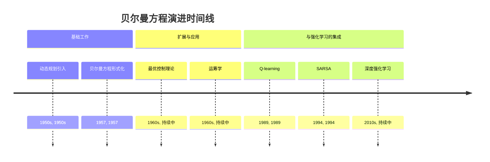
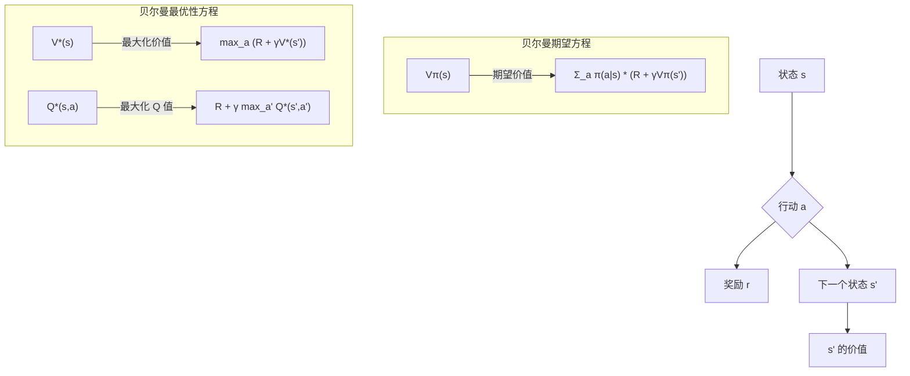

## 贝尔曼方程演进文档

### 1. 引言与历史背景

贝尔曼方程，以美国数学家理查德·贝尔曼命名，是动态规划和最优控制理论中的一个基本概念。它描述了如何通过将复杂问题分解为更简单的子问题来在马尔可夫决策过程（MDP）中找到最优策略。本质上，它指出在某个时间点上的决策问题的价值可以用在后续时间点上所做决策的价值来表示。

理查德·贝尔曼在 1950 年代开发了动态规划的概念，它为解决多阶段决策问题提供了数学框架。贝尔曼方程是该框架的核心，提供了一个递归关系，将状态（或状态-行动对）的价值与后续状态的价值联系起来。这种递归结构至关重要，因为它允许高效计算最优策略，尤其是在状态和行动数量有限的问题中。

最初，贝尔曼方程应用于运筹学、经济学和控制工程中，用于系统动力学完全已知的问题。随着 20 世纪后期强化学习的兴起，贝尔曼方程作为在动力学未知环境中学习最优策略算法的理论基础而获得了新的突出地位。Q-learning 和 SARSA 等算法是贝尔曼方程的直接应用，使智能体能够通过试错学习最优行为。

### 1.1. 贝尔曼方程演进时间线

### 2. 核心概念与架构

贝尔曼方程建立在 MDP 框架内的状态、行动、奖励和价值函数的概念之上。

#### 2.1. 价值函数

**心智模型/类比：**
想象你正在计划一次公路旅行。对于你可以访问的每个城市（状态），你都想知道该城市在达到最终目的地和享受旅程方面的“价值”有多大。贝尔曼方程可以帮助你计算这个价值。它说：你当前所在城市的价值是你立即获得的乐趣，加上你接下来可以去的*最佳*城市的折扣价值。你不需要每次都从头开始计划整个旅行；你只需要知道从你所在位置迈出下一步的最佳价值。

*   **状态价值函数 (V(s))：** 表示智能体从状态 `s` 开始并遵循特定策略 `π` 可以获得的预期累积折扣奖励。
*   **行动价值函数 (Q(s, a))：** 表示智能体从状态 `s` 开始，采取行动 `a`，然后遵循特定策略 `π` 可以获得的预期累积折扣奖励。

#### 2.2. 贝尔曼期望方程

此方程描述了*给定*策略 `π` 的价值函数。它对策略规定的所有可能行动和所有可能的下一个状态进行平均。

$V^\pi(s) = \sum_a \pi(a|s) \sum_{s'} P(s'|s, a) [R(s, a, s') + \gamma V^\pi(s')]$

*   **`Vπ(s)`：** 策略 `π` 下状态 `s` 的价值。
*   **`π(a|s)`：** 策略 `π` 下在状态 `s` 中采取行动 `a` 的概率。
*   **`P(s'|s, a)`：** 在状态 `s` 中采取行动 `a` 后转换到状态 `s'` 的概率。
*   **`R(s, a, s')`：** 在状态 `s` 中采取行动 `a` 并到达 `s'` 后获得的即时奖励。
*   **`γ`：** 折扣因子。

此方程用于**策略评估**，即我们想确定给定策略的好坏。

#### 2.3. 贝尔曼最优性方程

此方程描述了*最优*策略 `π*` 的价值函数。它不是对行动进行平均，而是取所有可能行动中的最大值，从而有效地在每一步选择最佳行动。

$
V^*(s) = \max_a \sum_{s'} P(s'|s, a) [R(s, a, s') + \gamma V^*(s')]
$

对于最优行动价值函数：

$Q^*(s, a) = \sum_{s'} P(s'|s, a) [R(s, a, s') + \gamma \max_{a'} Q^*(s', a')]$

*   **`V*(s)`：** 状态 `s` 的最优价值。
*   **`Q*(s, a)`：** 在状态 `s` 中采取行动 `a` 的最优价值。
*   **`max_a` / `max_{a'}`：** 选择导致最高预期未来奖励的行动的运算符。

这些方程用于**策略改进**和**价值迭代**以找到最优策略。

**Mermaid图：贝尔曼方程核心结构**

### 3. 使用贝尔曼方程求解

贝尔曼方程通过迭代求解，以找到最优价值函数，从而找到最优策略。

#### 3.1. 价值迭代

**目标：** 通过重复应用贝尔曼最优性方程直到收敛来找到最优价值函数 `V*(s)`。

**过程：**
1.  任意初始化所有 `s` 的 `V(s)`（例如，设为零）。
2.  重复使用以下公式更新 `V(s)`：$
V_{k+1}(s) = \max_a \sum_{s'} P(s'|s, a) [R(s, a, s') + \gamma V_k(s')]$

3.  继续直到 `V(s)` 收敛。

#### 3.2. 策略迭代

**目标：** 通过交替进行策略评估和策略改进来找到最优策略 `π*`。

**过程：**
1.  **策略评估：** 给定策略 `π`，使用贝尔曼期望方程计算 `Vπ(s)`（通常通过求解线性方程组或迭代更新）。
2.  **策略改进：** 通过对 `Vπ(s)` 采取贪婪行动来更新策略 `π`：$
\pi'(s) = \underset{a}{\operatorname{argmax}} \sum_{s'} P(s'|s, a) [R(s, a, s') + \gamma V^\pi(s')]
$。
3.  重复步骤 1 和 2，直到策略不再改进。

### 3.3. 快速参考：贝尔曼方程应用（概念性）

| 方法 | 目标 | 关键方程 | 模型要求 |
| :--- | :--- | :--- | :--- |
| **价值迭代** | 查找 `V*(s)` | 贝尔曼最优性 | 已知 (P, R) |
| **策略迭代** | 查找 `π*` | 贝尔曼期望与最优性 | 已知 (P, R) |
| **Q-learning** | 查找 `Q*(s, a)` | 贝尔曼最优性 (TD 更新) | 无模型 |
| **SARSA** | 查找 `Qπ(s, a)` | 贝尔曼期望 (TD 更新) | 无模型 |

### 4. 演进与影响

贝尔曼方程的影响自其诞生以来显著增长，尤其是在计算能力和强化学习兴起之后：

*   **动态规划的基础：** 它为动态规划提供了数学基础，使得解决以前难以处理的复杂序列决策问题成为可能。
*   **强化学习的理论基础：** 贝尔曼方程是几乎所有现代强化学习算法的核心理论基础。当环境模型已知时，价值迭代和策略迭代是直接应用，而 Q-learning 和 SARSA 则将其应用于无模型学习。
*   **函数逼近的可扩展性：** 当与函数逼近器（如深度强化学习中的神经网络）结合时，贝尔曼方程允许智能体在具有巨大或连续状态和行动空间的环境中学习最优策略，远远超出了表格方法所能处理的范围。
*   **最优控制和经济学：** 除了人工智能，贝尔曼方程在最优控制理论、经济学（例如，跨期选择、资产定价）和运筹学中仍然是优化资源分配和随时间决策的关键工具。

### 5. 结论

贝尔曼方程是现代决策理论、动态规划和强化学习的基石。其优雅的递归结构提供了一种强大的方法，可以将复杂的序列决策问题分解为可管理的子问题，从而发现最优策略。从 1950 年代的起源到当今先进人工智能系统中的核心作用，贝尔曼方程仍然是理解和解决不确定性下最优决策问题不可或缺的工具。对该方程的深入理解对于任何从事强化学习和人工智能研究或应用的人来说都至关重要。
