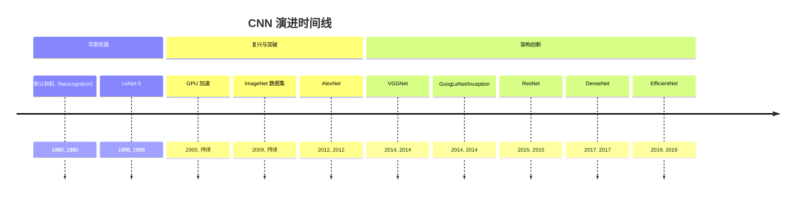
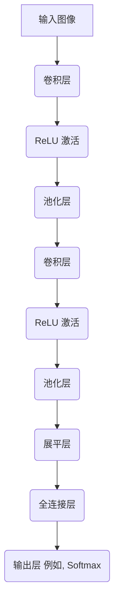
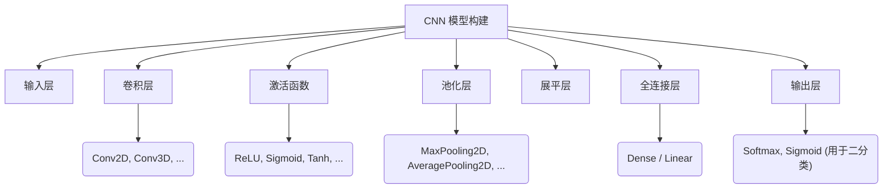

## CNN 演进文档

### 1. 引言与历史背景

卷积神经网络（CNNs 或 ConvNets）是一类深度神经网络，最常应用于分析视觉图像。它们的灵感来源于动物视觉皮层的组织方式，其中单个皮层神经元仅对其视觉野中受限区域的刺激做出反应，该区域被称为感受野。这些感受野的集合重叠以覆盖整个视觉区域。

CNN 的基本思想可以追溯到 20 世纪 80 年代，当时福岛邦彦（Kunihiko Fukushima）提出了**新认知机（Neocognitron）**，这是一种用于视觉模式识别的分层多层神经网络。该模型引入了卷积层和池化层等概念。然而，直到 20 世纪 90 年代末，扬·勒昆（Yann LeCun）及其同事开发的 **LeNet-5** 才展示了 CNN 在手写数字识别等任务中的实际应用。LeNet-5 成功地应用反向传播来训练一个包含卷积层和池化层的深度网络。

尽管早期取得了一些成功，但由于计算限制和缺乏大型数据集，CNN 在许多年里仍然相对小众。随着强大的 GPU 和 ImageNet 等大规模数据集的出现，CNN 在 2010 年代开始复兴。2012 年，**AlexNet** 这一更深更宽的 CNN 架构在 ImageNet 大规模视觉识别挑战赛（ILSVRC）中获胜，显著优于传统的计算机视觉方法，这是一个突破性的时刻。这一事件推动了深度学习革命，并确立了 CNN 作为图像识别和许多其他计算机视觉任务的主导方法。

### 1.1. CNN 演进时间线



### 2. 核心架构

CNN 的核心架构建立在几种关键的层类型之上，它们协同工作以从输入数据中提取特征层次结构。典型的 CNN 架构包括一个输入层、一系列用于特征提取的卷积层和池化层，以及用于分类或回归的全连接层。

#### 2.1. 卷积层

**心智模型 / 类比：**
想象一个手电筒（滤波器/核）在图像上扫描。在每个位置，手电筒照亮一个小区域，你计算该区域的“摘要”（卷积操作）。这个摘要成为新的“特征图”图像中的一个像素。不同的手电筒（不同的滤波器）突出显示不同的特征，例如边缘、纹理或特定模式。

卷积层是 CNN 的基本构建块。它通过将滤波器（或核）传递到输入数据上来执行卷积操作。
*   **滤波器/核：** 可学习权重的小矩阵，在输入上滑动。每个滤波器都旨在检测特定特征（例如，边缘、纹理、角点）。
*   **特征图：** 卷积层的输出，表示检测到的特征。每个滤波器生成一个特征图。
*   **参数共享：** 一个关键概念，即在整个输入图像中使用相同的滤波器。与全连接网络相比，这大大减少了参数数量，使模型更高效，更不容易过拟合。
*   **步长：** 滤波器在输入上移动的步长。大于 1 的步长会导致特征图的下采样。
*   **填充：** 在输入边界周围添加额外的像素（通常是零）。这允许滤波器在图像边缘上操作，并可用于控制输出特征图的空间大小。常见的类型有 'valid'（无填充）和 'same'（添加填充以确保输出与输入具有相同的宽度和高度）。

#### 2.2. 激活函数 (ReLU)

卷积操作之后，激活函数逐元素应用于特征图。CNN 中最常见的激活函数是修正线性单元（ReLU）。
*   **ReLU：** `f(x) = max(0, x)`。它为模型引入非线性，使其能够学习更复杂的模式。它计算效率高，有助于缓解梯度消失问题。

#### 2.3. 池化层

**心智模型 / 类比：**
在你用“手电筒”（卷积层）突出显示特征之后，池化层就像是总结这些亮点。如果你有一个 2x2 的亮点网格，最大池化会选择该网格中最亮的亮点，从而有效地保留最重要的信息并减小图像尺寸。

池化层用于减小特征图的空间维度（宽度和高度）。这有两个主要好处：
*   **降维：** 减少参数数量和计算成本，使网络更高效，并有助于防止过拟合。
*   **平移不变性：** 使学习到的特征对输入图像中的小幅平移和失真更具鲁棒性。
*   **最大池化：** 从特征图的一个补丁中选择最大值。这是最常见的池化类型。
*   **平均池化：** 计算特征图的一个补丁中的平均值。

#### 2.4. 全连接层

经过几个卷积层和池化层提取高级特征后，这些特征被传递到全连接（密集）层以完成最终任务。
*   **展平：** 在进入全连接层之前，3D 特征图被“展平”为 1D 向量。这种转换对于将卷积基础连接到密集分类器头部至关重要。
*   **分类/回归：** 全连接层根据前面层学习到的特征执行最终的分类或回归。输出层通常使用 softmax 激活进行多类分类任务，或使用 sigmoid 进行二元分类。

**Mermaid 图：CNN 核心架构**



### 3. 详细 API 概述（概念性）

与 NumPy 等通用库不同，CNN 通常使用深度学习框架（如 TensorFlow、PyTorch 或 Keras）实现。这里的“API”指的是在这些框架中构建 CNN 模型时常用的组件和模式。演进方向是更抽象和模块化的 API，允许研究人员和实践者用更少的样板代码构建复杂的架构。

#### 3.1. 卷积层

这些是核心特征提取器。框架提供了高度优化的实现。

##### 3.1.1. 2D 卷积层 (例如, `tf.keras.layers.Conv2D`, `torch.nn.Conv2d`)

**目标：** 对输入图像应用 2D 卷积。

**代码（概念性 - Keras）：**
```python
from tensorflow.keras import layers
from tensorflow.keras import models

# 添加 Conv2D 层的示例
model = models.Sequential()
model.add(layers.Conv2D(32, (3, 3), activation='relu', input_shape=(28, 28, 1)))
model.add(layers.MaxPooling2D((2, 2)))
model.add(layers.Conv2D(64, (3, 3), activation='relu'))
model.add(layers.MaxPooling2D((2, 2)))
model.add(layers.Conv2D(64, (3, 3), activation='relu'))
model.add(layers.Flatten())
model.add(layers.Dense(64, activation='relu'))
model.add(layers.Dense(10, activation='softmax'))

model.summary()
```

**解释：**
*   `filters`：卷积中输出滤波器的数量。这决定了特征图的数量。
*   `kernel_size`：一个元组或整数，指定 2D 卷积窗口的高度和宽度。
*   `activation`：要使用的激活函数（例如，'relu'、'sigmoid'、'tanh'）。
*   `input_shape`：第一层必需，指定输入数据的形状（高度、宽度、通道）。
*   `padding`：'valid'（无填充）或 'same'（填充以确保输出大小与输入大小相同）。
*   `strides`：卷积的步长。

*   **上下文：** 用于从图像中学习特征空间层次结构的主要层。
*   **参数（常见）：**
    *   `filters` (int)：输出空间的维度（即，卷积中输出滤波器的数量）。
    *   `kernel_size` (int 或 2 个 int 的元组/列表)：2D 卷积窗口的高度和宽度。
    *   `strides` (int 或 2 个 int 的元组/列表)：沿高度和宽度的卷积步长。
    *   `padding` (string)："valid" 或 "same" 之一。
    *   `activation`：要使用的激活函数。
*   **返回：** 表示卷积特征图的张量。

##### 3.1.2. 快速参考：卷积层

| 参数 | 描述 | 常见值 |
| :--- | :--- | :--- |
| `filters` | 输出特征图的数量 | 32, 64, 128, 256 |
| `kernel_size` | 卷积窗口的大小 | (3, 3), (5, 5) |
| `strides` | 卷积的步长 | (1, 1), (2, 2) |
| `padding` | 输入填充策略 | 'valid', 'same' |
| `activation` | 非线性激活函数 | 'relu', 'sigmoid', 'tanh' |

#### 3.2. 池化层

用于下采样特征图。

##### 3.2.1. 最大池化层 (例如, `tf.keras.layers.MaxPooling2D`, `torch.nn.MaxPool2d`)

**目标：** 通过在窗口上取最大值来沿其空间维度（高度和宽度）下采样输入。

**代码（概念性 - Keras）：**
```python
from tensorflow.keras import layers
from tensorflow.keras import models

model = models.Sequential()
model.add(layers.Conv2D(32, (3, 3), activation='relu', input_shape=(28, 28, 1)))
model.add(layers.MaxPooling2D((2, 2))) # 最大池化层
# ... 模型的其余部分
```

**解释：**
*   `pool_size`：一个元组或整数，指定池化窗口的大小。
*   `strides`：池化操作的步长。如果为 `None`，则默认为 `pool_size`。

*   **上下文：** 减小特征图的空间维度，使模型对小位移更具鲁棒性并减少计算量。
*   **参数（常见）：**
    *   `pool_size` (int 或 2 个 int 的元组/列表)：下采样因子（垂直，水平）。
    *   `strides` (int 或 2 个 int 的元组/列表)：池化窗口每步移动的距离。
    *   `padding` (string)："valid" 或 "same" 之一。
*   **返回：** 下采样张量。

##### 3.2.2. 快速参考：池化层

| 参数 | 描述 | 常见值 |
| :--- | :--- | :--- |
| `pool_size` | 池化窗口的大小 | (2, 2), (3, 3) |
| `strides` | 池化的步长 | (2, 2) (通常与 `pool_size` 相同) |
| `padding` | 输入填充策略 | 'valid', 'same' |

#### 3.3. 全连接层

用于分类或回归的最终层。

##### 3.3.1. 密集层 (例如, `tf.keras.layers.Dense`, `torch.nn.Linear`)

**目标：** 一个常规的密集连接神经网络层。

**代码（概念性 - Keras）：**
```python
from tensorflow.keras import layers
from tensorflow.keras import models

model = models.Sequential()
# ... 卷积层和池化层
model.add(layers.Flatten()) # 在密集层之前展平
model.add(layers.Dense(128, activation='relu'))
model.add(layers.Dense(10, activation='softmax')) # 10 个类别的输出层
```

**解释：**
*   `units`：正整数，输出空间的维度。
*   `activation`：要使用的激活函数。

*   **上下文：** 根据卷积基提取的高级特征执行最终的分类或回归。
*   **参数（常见）：**
    *   `units` (int)：输出空间的维度。
    *   `activation`：要使用的激活函数。
*   **返回：** 表示层输出的张量。

##### 3.3.2. 快速参考：全连接层

| 参数 | 描述 | 常见值 |
| :--- | :--- | :--- |
| `units` | 层中的神经元数量 | 64, 128, 256, 512 |
| `activation` | 非线性激活函数 | 'relu', 'softmax', 'sigmoid' |

**Mermaid 图：简化 CNN API 结构（概念性）**



### 3.4. API 心智图

```mermaid
mindmap
  root((CNN API (概念性)))
    (层)
      (卷积)
        (Conv2D)
          (filters)
          (kernel_size)
          (strides)
          (padding)
          (activation)
      (池化)
        (MaxPooling2D)
          (pool_size)
          (strides)
          (padding)
        (AveragePooling2D)
      (激活)
        (ReLU)
        (Sigmoid)
        (Tanh)
        (Softmax)
      (展平)
      (密集层 / 线性层)
        (units)
        (activation)
    (模型构建)
      (Sequential API)
      (Functional API)
      (Subclassing API)
    (训练)
      (优化器)
      (损失函数)
      (指标)
```

### 4. 架构权衡

CNN 具有一些固有属性，使其特别适合某些任务，但对其他任务则不然。

#### 4.1. 优势

*   **空间数据的归纳偏置:** CNN 对网格状数据具有很强的**归纳偏置**。**空间局部性**（距离较近的像素更相关）和**平移等变性**（如果一个物体移动，其身份不会改变）的概念已内置于其架构中。这使得它们在处理视觉数据时参数效率极高，学习速度快。
*   **参数效率:** 通过**参数共享**，单个滤波器在整个图像上滑动，检测特征而不管其位置。与全连接网络相比，这极大地减少了可学习参数的数量，从而减轻了过拟合，并降低了计算要求。
*   **分层特征学习:** 卷积层的堆叠特性使网络能够学习特征的层次结构，从初始层的简单边缘和纹理，到更深层次的复杂图案和物体部分。

#### 4.2. 劣势

*   **全局上下文有限:** 卷积核的局部感受野可能使网络难以学习长距离依赖关系或理解图像的全局上下文，除非网络非常深或使用非常大的卷积核。
*   **对非网格数据不灵活:** CNN 专为网格状数据结构（如图像、时间序列）设计。它们不易应用于图或点云等不规则数据格式。
*   **几何不变性:** 虽然池化提供了一定的平移不变性，但标准 CNN 对旋转或缩放等其他几何变换并不具有固有的鲁棒性。

### 5. 实际应用与用例

CNN 是现代计算机视觉的支柱，并已成功应用于广泛的任务。

*   **图像分类:** 最常见的应用，即 CNN 为整个图像分配一个标签（例如，“猫”、“狗”、“汽车”）。
*   **目标检测:** 通过在图像中的多个物体周围绘制边界框来识别和定位它们（例如，YOLO、SSD、R-CNN）。
*   **语义分割:** 对图像中的每个像素进行分类，以创建其中物体的像素级掩码（例如，U-Net、FCN）。
*   **图像生成:** 使用像生成对抗网络（GANs）这样的架构，其中 CNN 通常构成生成器和判别器组件。
*   **医学图像分析:** 分析 X 射线、MRI 和 CT 扫描等医学影像，用于肿瘤检测、疾病分类和分割。

#### 5.1. 示例：使用预训练模型进行分类

一个常见且强大的技术是**迁移学习**，即使用在大型数据集（如 ImageNet）上预训练的模型作为新任务的特征提取器。

**代码 (概念性 - PyTorch):**
```python
import torch
from torchvision import models, transforms
from PIL import Image

# 加载一个预训练的 ResNet-18 模型
resnet = models.resnet18(weights=models.ResNet18_Weights.DEFAULT)
resnet.eval() # 将模型设置为评估模式

# 定义图像转换流程
preprocess = transforms.Compose([
    transforms.Resize(256),
    transforms.CenterCrop(224),
    transforms.ToTensor(),
    transforms.Normalize(mean=[0.485, 0.456, 0.406], std=[0.229, 0.224, 0.225]),
])

# 加载并预处理一个示例图像 (请替换为您的图像路径)
# img = Image.open("path/to/your/image.jpg")
# input_tensor = preprocess(img)
# input_batch = input_tensor.unsqueeze(0) # 创建一个模型期望的小批量

# 进行预测
# with torch.no_grad():
#     output = resnet(input_batch)

# 输出是未归一化的分数。要获得概率，可以应用 softmax。
# probabilities = torch.nn.functional.softmax(output[0], dim=0)
```

### 6. 完整代码示例 (MNIST)

为了使架构更具体，这里提供了两个完整的、可运行的简单 CNN 示例，用于对手写数字的 MNIST 数据集进行分类，一个使用 TensorFlow/Keras，另一个使用 PyTorch。

#### 6.1. TensorFlow/Keras 实现

此示例使用 Keras Sequential API，这是一种逐层构建模型的直接方法。

```python
import tensorflow as tf
from tensorflow.keras import layers, models

# 1. 加载并预处理 MNIST 数据集
(x_train, y_train), (x_test, y_test) = tf.keras.datasets.mnist.load_data()

# 将像素值归一化到 0 到 1 之间，并添加一个通道维度
x_train = x_train.reshape((60000, 28, 28, 1)).astype('float32') / 255
x_test = x_test.reshape((10000, 28, 28, 1)).astype('float32') / 255

# 2. 定义 CNN 模型架构
model = models.Sequential([
    layers.Conv2D(32, (3, 3), activation='relu', input_shape=(28, 28, 1)),
    layers.MaxPooling2D((2, 2)),
    layers.Conv2D(64, (3, 3), activation='relu'),
    layers.MaxPooling2D((2, 2)),
    layers.Conv2D(64, (3, 3), activation='relu'),
    layers.Flatten(),
    layers.Dense(64, activation='relu'),
    layers.Dense(10, activation='softmax')
])

model.summary()

# 3. 编译模型
model.compile(optimizer='adam',
              loss='sparse_categorical_crossentropy',
              metrics=['accuracy'])

# 4. 训练模型
history = model.fit(x_train, y_train, epochs=5, 
                    validation_data=(x_test, y_test))

# 5. 评估模型
test_loss, test_acc = model.evaluate(x_test, y_test, verbose=2)
print(f"\n测试准确率: {test_acc:.4f}")
```

#### 6.2. PyTorch 实现

此示例将 CNN 定义为一个自定义的 `nn.Module` 类，这是在 PyTorch 中构建模型的标准且最灵活的方式。

```python
import torch
import torch.nn as nn
import torch.optim as optim
from torchvision import datasets, transforms
from torch.utils.data import DataLoader

# 1. 定义转换并加载 MNIST 数据集
transform = transforms.Compose([
    transforms.ToTensor(),
    transforms.Normalize((0.1307,), (0.3081,)) # MNIST 的均值和标准差
])

train_dataset = datasets.MNIST(root='./data', train=True, download=True, transform=transform)
test_dataset = datasets.MNIST(root='./data', train=False, download=True, transform=transform)

train_loader = DataLoader(train_dataset, batch_size=64, shuffle=True)
test_loader = DataLoader(test_dataset, batch_size=1000, shuffle=False)

# 2. 定义 CNN 模型架构
class SimpleCNN(nn.Module):
    def __init__(self):
        super(SimpleCNN, self).__init__()
        self.conv1 = nn.Conv2d(1, 32, kernel_size=3, stride=1, padding=1)
        self.pool = nn.MaxPool2d(kernel_size=2, stride=2, padding=0)
        self.conv2 = nn.Conv2d(32, 64, kernel_size=3, stride=1, padding=1)
        self.fc1 = nn.Linear(64 * 7 * 7, 128) # 28x28 -> 14x14 -> 7x7
        self.fc2 = nn.Linear(128, 10)
        self.relu = nn.ReLU()

    def forward(self, x):
        x = self.relu(self.conv1(x))
        x = self.pool(x)
        x = self.relu(self.conv2(x))
        x = self.pool(x)
        x = x.view(-1, 64 * 7 * 7) # 展平张量
        x = self.relu(self.fc1(x))
        x = self.fc2(x)
        return x

model = SimpleCNN()

# 3. 定义损失函数和优化器
criterion = nn.CrossEntropyLoss()
optimizer = optim.Adam(model.parameters(), lr=0.001)

# 4. 训练模型
def train_model(num_epochs):
    model.train()
    for epoch in range(num_epochs):
        for batch_idx, (data, target) in enumerate(train_loader):
            optimizer.zero_grad()
            outputs = model(data)
            loss = criterion(outputs, target)
            loss.backward()
            optimizer.step()
            if (batch_idx + 1) % 100 == 0:
                print(f'轮次 [{epoch+1}/{num_epochs}], 步骤 [{batch_idx+1}/{len(train_loader)}], 损失: {loss.item():.4f}')

train_model(num_epochs=5)

# 5. 评估模型
def evaluate_model():
    model.eval()
    with torch.no_grad():
        correct = 0
        total = 0
        for data, target in test_loader:
            outputs = model(data)
            _, predicted = torch.max(outputs.data, 1)
            total += target.size(0)
            correct += (predicted == target).sum().item()
        print(f'测试准确率: {100 * correct / total:.2f}%')

evaluate_model()
```

### 7. 演进与影响

CNN 的演进是一个深度、宽度和架构创新不断增加的故事，其驱动力是对更高准确性和效率的追求。

*   **更深的网络:** 像 LeNet-5 这样的早期网络很浅。AlexNet 展示了更深网络的强大功能，随后的架构如 VGGNet（多达 19 层）和 ResNet（多达 152 层，引入残差连接以对抗梯度消失）进一步推动了这一趋势。
*   **计算效率:** Inception 模块（GoogLeNet）和分组卷积（ResNeXt、MobileNet）等创新专注于提高网络的计算效率，允许更深的模型或在资源受限的设备上部署。EfficientNet 使用复合系数系统地扩展网络深度、宽度和分辨率。
*   **迁移学习:** 在大型数据集（如 ImageNet）上预训练大型 CNN，然后针对特定任务进行微调的能力彻底改变了计算机视觉。这显著减少了对大型、特定任务数据集和从头开始训练的需求。
*   **超越图像分类:** 尽管最初在图像分类中占据主导地位，但 CNN 已被应用于各种任务，包括目标检测（R-CNN、YOLO、SSD）、语义分割（FCN、U-Net）、图像生成（GANs），甚至自然语言处理（尽管 Transformer 现在在这里占据主导地位）。
*   **硬件加速:** 卷积的可并行性使得 CNN 非常适合 GPU 加速，这是其成功和广泛采用的关键因素。

### 8. 结论

卷积神经网络从其早期概念化到现代高度优化的架构，已经从根本上改变了计算机视觉和深度学习领域。CNN 的核心组件——卷积、激活和池化——与深度学习框架的强大功能相结合，继续推动图像识别、目标检测和许多其他 AI 应用的进步。对更高效、更强大的 CNN 架构的持续研究确保了它们在快速发展的人工智能领域中的持续相关性。
