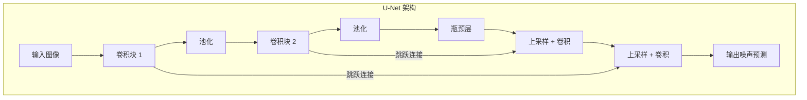

# Diffusion Models 入门简介

> 一篇为初学者准备的 Diffusion 模型（扩散模型）温和介绍——这项技术是 Stable Diffusion、Midjourney 和现代 AI 图像生成的基石。无需任何机器学习背景知识！

---

## 目录

1. [预备知识与基础](#1-预备知识与基础)
2. [从 GAN 到 Diffusion：演进之路](#2-从-gan-到-diffusion演进之路)
3. [为什么我们需要 Diffusion 模型？](#3-为什么我们需要-diffusion-模型)
4. [核心概念](#4-核心概念)
5. [Diffusion 模型的工作原理](#5-diffusion-模型的工作原理)
6. [Diffusion 模型的重要性](#6-diffusion-模型的重要性)
7. [动手建立直觉](#7-动手建立直觉)
8. [术语表](#8-术语表)

---

## 1. 预备知识与基础

在深入了解 Diffusion 模型之前，让我们先建立一些基础概念。我们会从零开始解释一切！

### 1.1 什么是向量？

> 📖 **术语：向量 (Vector)** - 一个有序的数字列表。可以把它想象成空间中的一个点，或者一个从原点指向该点的箭头。例如，[3, 5] 是一个二维向量，代表一个从原点向右 3 个单位、向上 5 个单位的点。

**向量**就是一个有序的数字列表。它是机器学习中最基本的概念之一。

**为什么我们在 AI 中使用向量？**

向量让计算机能用数字来表示信息：
- **文字**变成向量（例如，“猫” 可能表示为 [0.9, -0.2, 0.5, ...]）
- 图像中的**像素**由向量表示，例如 [红, 绿, 蓝] 的颜色值。
- 整张**图像**可以是其所有像素值组成的一个巨大向量。

### 1.2 什么是矩阵？

> 📖 **术语：矩阵 (Matrix)** - 一个矩形的数字网格。可以看作是按行和列排列的向量集合。

**矩阵**是一个由行和列组成的数字网格。图像是矩阵的一个完美例子，其中每个元素都是一个像素。

**视觉示例：**
```
一张图像是像素值的矩阵：
一个 3x3 的灰度图像（数字 = 亮度）

┌           ┐
│ 255  128  0   │   行 1
│ 100  200  50  │   行 2
│ 25   75   150 │   行 3
└           ┘
```

### 1.3 什么是函数？

> 📖 **术语：函数 (Function)** - 一种数学关系，它接受输入并产生输出。你给它一些东西，它遵循规则，然后返回另一些东西。写作 f(x) = y，其中 x 是输入，y 是输出。

在机器学习中，**神经网络本身就是一个函数**。训练的目标就是**学习**一个正确的函数，该函数能将输入（如噪声或文本提示）转换为正确的输出（一幅美丽的图像）。

### 1.4 什么是神经网络？

> 📖 **术语：神经网络 (Neural Network)** - 一种受人脑启发的计算模型。它由相互连接的“神经元”层组成，用于处理信息。每个神经元接收输入，应用权重（重要性因子），并产生一个输出。

**神经网络**是驱动 Diffusion 模型的引擎。它是系统中负责**学习**如何逆转噪声并创造图像的部分。

**它如何学习：**
> 📖 **术语：训练 (Training)** - 通过向神经网络展示示例并调整其内部参数以减少错误来教导它的过程。

1.  做出预测（例如，猜测图像中的噪声）。
2.  与正确答案（实际的噪声）进行比较。
3.  微调内部值以减少误差。
4.  重复数百万次！

### 1.5 什么是噪声？

> 📖 **术语：噪声 (Noise)** - 随机的、无意义的数据。在图像生成中，我们通常使用高斯噪声，它看起来像电视雪花。

想象一张完全清晰的图像。现在，想象慢慢地向其中添加随机的雪花，直到原始图像完全消失。这些雪花就是**噪声**。

**视觉示例：**
```
清晰图像        轻微噪声        大量噪声          纯噪声
  (猫)      →    (模糊的猫)    →   (模糊的轮廓)   →     (雪花)
   ● ●            ●~●              ~_~              ▓▒░▓▒░
  /---\          /~-~\            /~~~\              ▓▒░▓▒░
 <|   |>        <|~~~|>          <|~~~|>             ▓▒░▓▒░
```
Diffusion 模型是理解和操纵这种噪声的大师。

---

## 2. 从 GAN 到 Diffusion：演进之路

在 Diffusion 出现之前，另外两种模型主导着生成式 AI：VAE 和 GAN。

### 2.1 VAE 和 GAN 是什么？

**VAE (变分自编码器 Variational Autoencoder):**
- **思想：** 将图像压缩成一个简单的描述（一个潜在向量），然后再重建它。
- **问题：** 通常产生模糊和低质量的结果。

**GAN (生成对抗网络 Generative Adversarial Network):**
- **思想：** 一个“生成器”网络试图创建假图像，一个“判别器”网络试图识别假货。它们相互竞争并共同进步。
- **比喻：** 一个艺术伪造者（生成器）和一个艺术评论家（判别器）。
- **问题：** 训练起来是出了名的困难和不稳定。两个网络必须完美平衡。

### 2.2 Diffusion 的“简单”思想

Diffusion 模型带来了一个全新的视角：

> 与其试图从一个随机向量一次性、大跨度地生成图像（像 GAN 那样），不如我们逐步地、分小步地、可控地完成它？

这就是关键的洞见！Diffusion 模型将“生成一只猫”这个极其困难的任务，分解成一千个微小而简单的步骤：“让这些雪花看起来更像一只猫一点点”。

```
GAN:
  随机噪声 ──────────► [复杂网络] ──────────► 最终图像 (一次完成)

Diffusion:
  随机噪声 ──► [第1步] ──► [第2步] ... ──► [第1000步] ──► 最终图像 (逐步生成)
```
这种逐步进行的过程要稳定得多，并且通常能带来更高质量的结果。

---

## 3. 为什么我们需要 Diffusion 模型？

### 3.1 问题：高质量生成很困难

从零开始创建逼真、多样化且高分辨率的图像是 AI 中最具挑战性的任务之一。
- **GAN** 虽然强大，但可能会遭受“模式崩溃”（mode collapse）——它们只学会生成少数几种能骗过判别器的图像，导致缺乏多样性。
- **VAE** 更稳定，但倾向于产生更模糊、细节更少的图像。

### 3.2 Diffusion 的解决方案：质量与稳定性

Diffusion 模型通过以下方式解决了这些问题：
1.  **分解任务：** 逐步降噪的过程更容易学习和控制。
2.  **稳定的训练：** 训练过程比 GAN 稳定得多。你只是在教一个网络一个直接的任务：预测噪声。
3.  **高保真结果：** 渐进的过程使得创造出细节惊人且逼真的图像成为可能。

这种质量、多样性和稳定性的结合，是 Diffusion 模型席卷图像生成领域的原因。

---

## 4. 核心概念

让我们来探讨构成 Diffusion 的两个关键过程。

### 4.1 前向过程：添加噪声

> 📖 **术语：前向过程 (Forward Process 或 Diffusion Process)** - 从一张清晰图像开始，在每一步逐渐添加少量噪声，经过设定的步数，直到图像变成纯噪声的过程。

这个过程是**固定**的。我们不需要在这里学习任何东西。它是一个简单的数学程序。

```
第 0 步 (t=0)        第 1 步 (t=1)         ...        第 T 步 (t=1000)
┌───────────┐        ┌───────────┐                   ┌───────────┐
│ 清晰的猫  │ +噪声→ │ 有噪声的猫│ +噪声→ ... +噪声→ │  纯噪声   │
└───────────┘        └───────────┘                   └───────────┘
```
前向过程的目的是创建训练数据。对于任何图像，我们都可以即时生成它在任意时间步 `t` 的噪声版本。

### 4.2 反向过程：学习降噪

> 📖 **术语：反向过程 (Reverse Process 或 Denoising Process)** - 训练一个神经网络来撤销前向过程的一步。它接收在第 `t` 步的噪声图像，并试图预测一个在第 `t-1` 步的噪声稍小的图像。

这才是魔法发生和学习进行的地方。神经网络的工作是预测在给定步骤中添加到图像里的噪声。

**目标：**
- **输入：** 一张噪声图像 `x_t` 和时间步 `t`。
- **预测：** 为了得到 `x_t` 而添加的噪声 `ε`。
- **操作：** 从 `x_t` 中减去预测的噪声，得到 `x_{t-1}` 的估计值。

```
第 T 步 (t=1000)      ...        第 1 步 (t=1)          第 0 步 (t=0)
┌───────────┐                    ┌───────────┐         ┌───────────┐
│  纯噪声   │ -噪声→ ... -噪声→ │ 有噪声的猫│ -噪声→ │ 清晰的猫  │
└───────────┘                    └───────────┘         └───────────┘
   ▲                             ▲                     ▲
   │ [神经网络预测噪声]          │ [预测噪声]            │ [预测噪声]
```

### 4.3 U-Net 架构

> 📖 **术语：U-Net** - 一种形似字母 "U" 的特定神经网络架构。它特别擅长处理输出需要与输入大小相同的任务（如图像到图像的任务）。

大多数 Diffusion 模型中使用的神经网络是 **U-Net**。

**为什么是 U-Net？**
1.  **下采样路径 (编码器)：** 它首先缩小图像以理解“全局”上下文（图像中有什么）。
2.  **上采样路径 (解码器)：** 然后它将图像扩展回原始尺寸，并添加精细的细节。
3.  **跳跃连接 (Skip Connections)：** 它将下采样路径的层直接连接到上采样路径的对应层。这至关重要！它让网络在重建图像时能够记住并重用低级细节（如纹理和边缘）。



### 4.4 条件 Diffusion：文本到图像

我们如何控制模型生成什么内容？我们添加**条件**。对于像 Stable Diffusion 这样的文本到图像模型，条件就是文本提示。

> 📖 **术语：条件化 (Conditioning)** - 用额外的信息（如文本描述）来引导扩散过程，以影响最终输出。

这通常是通过借自 Transformer 的一种机制来实现的：**交叉注意力 (cross-attention)**。

1.  文本提示被转换成数字表示（嵌入）。
2.  在 U-Net 内部的各个层中，**交叉注意力**层允许图像表示“关注”文本表示。
3.  U-Net 会问：“鉴于我正在尝试创作‘一个宇航员骑着马’，这段文本的哪些部分与我当前正在降噪的图像部分最相关？”

这引导着降噪过程，以创造出与文本提示相匹配的图像。

---

## 5. Diffusion 模型的工作原理

让我们来看看训练和生成过程。

### 5.1 训练模型

训练的目标是教会 U-Net 成为一个噪声预测大师。

```
循环 (重复数百万次):
  1. 从训练数据集中获取一张随机图像（例如，一张狗的照片）。
  2. 选择一个随机的时间步 `t`（例如，t=250，总步数1000）。
  3. 生成实际的噪声 `ε`（一个由随机数组成的张量）。
  4. 将 `t` 步的噪声 `ε` 应用于图像，创建一张噪声图像 `x_t`。
  5. 将噪声图像 `x_t` 和时间步 `t` 输入到 U-Net 中。
  6. U-Net 预测出噪声 `ε_predicted`。
  7. 计算 `ε_predicted` 和实际 `ε` 之间的误差（损失）。
  8. 更新 U-Net 的参数以最小化这个误差。
```
U-Net 从不直接看到清晰的图像。它只看到一个噪声版本，并被要求预测被添加的噪声。

### 5.2 推理 (生成图像)

现在我们有了一个训练好的 U-Net，我们可以生成新图像了。

```
开始：生成一张纯噪声的随机图像 `x_T`（例如，在 t=1000 时）。

从 t=T 循环到 1 (例如, t=1000, 999, 998, ...):
  1. 将当前图像 `x_t` 和时间步 `t` 输入到我们训练好的 U-Net 中。
     （如果我们有文本提示，也一并输入）。
  2. U-Net 预测出当前步骤的噪声 `ε_predicted`。
  3. 使用一个调度器算法从 `x_t` 中减去一小部分预测出的噪声。
     这给了我们新的、噪声稍小的图像 `x_{t-1}`。
  4. 结果 `x_{t-1}` 成为下一次循环迭代的输入。

结束：当循环完成时（在 t=0 时），最终的 `x_0` 就是我们生成的图像！
```
这种迭代优化的过程，从纯粹的雪花开始，根据 U-Net 的预测慢慢雕刻出一幅图像，正是我们从 Midjourney 和 Stable Diffusion 等模型中看到的惊人细节图像的创作方式。

---

## 6. Diffusion 模型的重要性

### 6.1 现实世界应用

Diffusion 模型不仅用于有趣的图像。它们是创造力和科学的强大新工具。

```
┌─────────────────────────────────────────────────────────────┐
│                 DIFFUSION 应用场景                          │
├─────────────────────────────────────────────────────────────┤
│                                                             │
│  🖼️ 文本到图像生成                                          │
│     “一张宇航员在火星上骑马的照片”                          │
│     → Midjourney, Stable Diffusion, DALL-E 2                │
│                                                             │
│  🎨 图像编辑 (内补 & 外扩)                                  │
│     “从这张照片中移除这个人” 或 “扩展这张图像的背景”        │
│     → Adobe Photoshop 生成式填充                            │
│                                                             │
│  ✨ 图像到图像翻译                                          │
│     “把这张素描变成一张写实照片”                            │
│     → ControlNet, InstructPix2Pix                           │
│                                                             │
│  🎬 视频生成                                                │
│     “一艘船在暴风雨中航行的电影镜头”                        │
│     → Sora, RunwayML, Pika Labs                             │
│                                                             │
│  🎵 音频和音乐生成                                          │
│     “生成一首愉快的原声民谣歌曲”                            │
│     → AudioLDM, Riffusion                                   │
│                                                             │
│  🔬 科学发现                                                │
│     “为特定功能生成新的蛋白质结构” 或 “设计一个新分子”    │
│     → 药物发现, 材料科学                                    │
│                                                             │
└─────────────────────────────────────────────────────────────┘
```

### 6.2 Diffusion 家族树

自最初的概念以来，该领域发展迅速。

```
Diffusion 演进史:

2015: "Deep Unsupervised Learning using Nonequilibrium Thermodynamics"
         │
         └─► 理论基础被奠定。

2020: DDPM (Denoising Diffusion Probabilistic Models)
         │
         └─► 这篇论文展示了 Diffusion 模型可以实现高质量的图像生成，
             开启了革命。

2021: GLIDE & DALL-E 2
         │
         └─► OpenAI 将 Diffusion 与文本条件相结合，
             取得了令人难以置信的文本到图像效果。

2022: 潜在扩散模型 (Latent Diffusion Models, LDM)
         │
         └─► Stable Diffusion 背后的突破！不是在巨大的图像上运行
             扩散，而是在图像的一个小的、压缩的“潜在”版本上运行。
             这极大地提高了效率和速度。

2022+: 众多变体...
         ControlNet (精确控制), DDIM (更快的采样),
         以及特定于应用的各种模型。
```

---

## 7. 动手建立直觉

让我们用一个一维的例子来建立直觉：生成一个数字。

### 7.1 简单示例设置

想象我们的“图像”只是一个数字，我们的数据集只有一个数据点：`8`。我们的目标是训练一个能从随机噪声开始生成数字 `8` 的模型。

让我们定义一个简单的 3 步扩散过程。
- 我们的数据 `x_0` = `8`
- 噪声只是一个随机数（例如，从 -2 到 +2）。

**前向过程 (添加噪声):**
- `x_1` = `x_0` + noise_1 = `8 + 1.5` = `9.5`
- `x_2` = `x_1` + noise_2 = `9.5 - 2.0` = `7.5`
- `x_3` = `x_2` + noise_3 = `7.5 + 1.8` = `9.3` (这是我们的“纯噪声”起点)

### 7.2 逐步降噪直觉

我们的神经网络的工作是学习这个过程的逆过程。让我们假设我们的“网络”是一个非常简单的函数：`f(x) = x - (x - 8) * 0.5`。这个函数试图将任何数字 `x` 拉回一半到 `8` 的距离。

**反向过程 (生成):**

**第 1 步: 从噪声 `x_3` 开始**
- 输入: `x_3` = `9.3`
- 网络预测“方向”: `f(9.3) = 9.3 - (9.3 - 8) * 0.5 = 9.3 - 0.65 = 8.65`
- 我们的新值 `x_2` 是 `8.65`。我们离 8 更近了！

**第 2 步: 对 `x_2` 降噪**
- 输入: `x_2` = `8.65`
- 网络预测: `f(8.65) = 8.65 - (8.65 - 8) * 0.5 = 8.65 - 0.325 = 8.325`
- 我们的新值 `x_1` 是 `8.325`。更近了！

**第 3 步: 对 `x_1` 降噪**
- 输入: `x_1` = `8.325`
- 网络预测: `f(8.325) = 8.325 - (8.325 - 8) * 0.5 = 8.325 - 0.1625 = 8.1625`
- 我们的最终值 `x_0` 是 `8.1625`。

我们从随机噪声 (`9.3`) 开始，最终得到了 `8.1625`，这非常接近我们的原始数据 `8`。一个真正的 Diffusion 模型在数千个步骤中为数百万个像素同时执行此操作！

---

## 8. 术语表

| 术语 | 定义 |
| :--- | :--- |
| **条件化 (Conditioning)** | 用额外的信息（如文本）引导扩散过程以影响输出。 |
| **交叉注意力 (Cross-Attention)** | 一种机制（常来自 Transformer），允许模型在生成图像时关注条件信息（如文本提示）的相关部分。 |
| **DDPM** | Denoising Diffusion Probabilistic Model (去噪扩散概率模型)。2020年的一篇有影响力的论文，展示了 Diffusion 模型的高性能。|
| **Diffusion 模型** | 一种生成模型，通过逐步逆转一个加噪过程来创建数据。 |
| **前向过程 (Forward Process)** | 将噪声逐渐添加到图像中，直到其变为随机雪花的固定过程。 |
| **GAN** | Generative Adversarial Network (生成对抗网络)。一种由生成器和判别器相互竞争的生成模型。|
| **潜在扩散 (Latent Diffusion)** | 一种高效的 Diffusion 模型（被 Stable Diffusion 使用），它在图像的一个小的、压缩的“潜在”表示上操作，而不是在完整的像素图像上。|
| **噪声 (Noise)** | 随机的、无意义的数据。在图像生成中，通常是看起来像电视雪花的高斯噪声。|
| **反向过程 (Reverse Process)** | 训练神经网络逐步对图像进行降噪的学习过程，从纯噪声开始，生成清晰的图像。|
| **调度器 (Scheduler)** | 在推理期间，用于决定在反向过程的每一步中精确减去多少预测噪声的算法。|
| **跳跃连接 (Skip Connection)** | U-Net 中的一种连接，将信息直接从编码器（下采样路径）传递到解码器（上采样路径），以保留重要细节。|
| **时间步 (Timestep, t)** | 一个数字，表示已向图像添加了多少噪声。`t=0` 是清晰图像，而高的 `t` (例如 `t=1000`) 是纯噪声。|
| **训练 (Training)** | 通过向神经网络展示示例并调整其参数以减少错误来教导它的过程。|
| **U-Net** | 一种 U 形的神经网络架构，非常适合图像到图像的任务，是大多数 Diffusion 模型的核心。|
| **向量 (Vector)** | 用于表示像像素或词语这类数据的有序数字列表。|

---

## 结论

恭喜！你已经学习了 Diffusion 模型的基础知识：

**你现在理解了：**
- ✓ 噪声、神经网络和向量等基本概念。
- ✓ 为什么 Diffusion 模型是继 GAN 之后的一大进步。
- ✓ 核心概念：前向（加噪）和反向（去噪）过程。
- ✓ Diffusion 模型如何训练（预测噪声）以及如何生成图像（迭代降噪）。
- ✓ U-Net 架构和文本条件化的作用。
- ✓ 这些模型在许多领域产生的巨大影响。

这些基础知识为你提供了一个强大的视角，去理解当前由 AI 驱动的创造力爆发。

**继续学习吧！** 🚀
