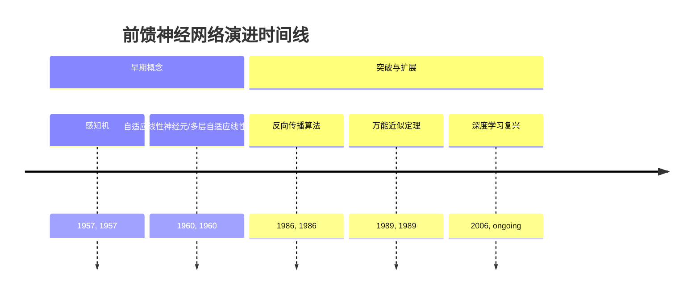
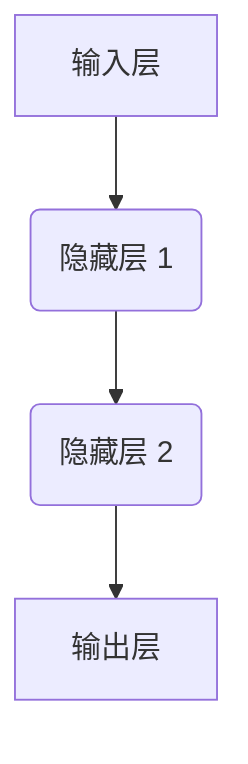
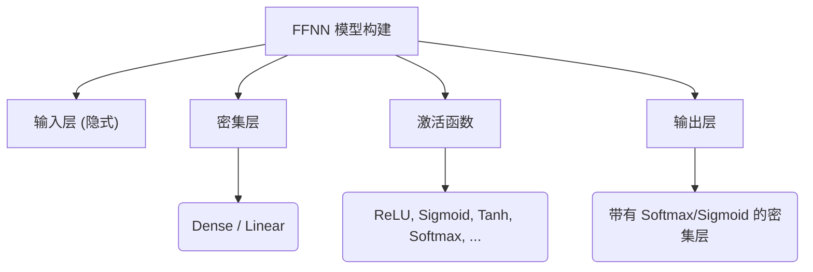
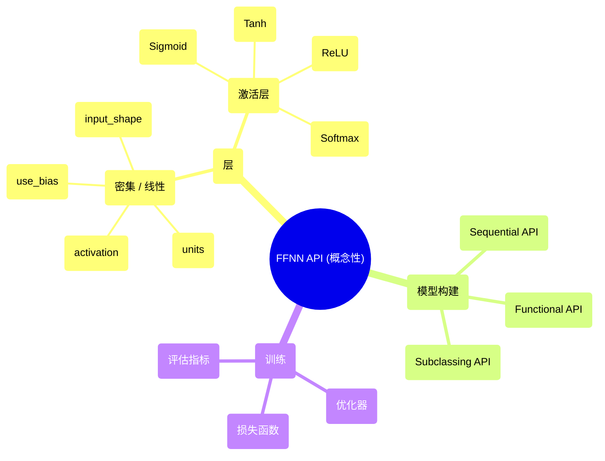

## 前馈神经网络演进文档

### 1. 介绍与历史背景

前馈神经网络（FFNN），当它含有一个或多个隐藏层时也被称为多层感知机（MLP），是最简单的人工神经网络类型。在FFNN中，节点间的连接不形成循环；信息只在一个方向上流动——向前——从输入节点，经过所有隐藏节点，最终到达输出节点。这些网络之所以被称为“前馈”，是因为信息流严格地从输入到输出单向流动，没有任何反馈回路。

人工神经元的概念可以追溯到1957年Frank Rosenblatt提出的**感知机**，它是一个单层网络，能够学习二元分类器。尽管具有开创性，但感知机的局限性，特别是其无法解决非线性可分问题（Minsky和Papert在1969年强调），导致了神经网络的“AI寒冬”。

FFNN的兴趣复苏伴随着1980年代**反向传播算法**的发展，该算法在1986年由David Rumelhart、Geoffrey Hinton和Ronald Williams广为推广。反向传播提供了一种训练多层网络的有效方法，使其能够学习复杂的非线性关系，并克服了单层感知机的局限性。这一突破为现代深度学习铺平了道路，因为FFNN成为了后来更复杂网络（如CNN和RNN）构建的基础架构。

### 1.1. FFNN 演进时间线



### 2. 核心架构

前馈神经网络的核心架构由一个输入层、一个或多个隐藏层以及一个输出层组成。每个层都由多个神经元（或节点）构成，并且一个层中的每个神经元都与后续层中的每个神经元连接，这使其具有“全连接”或“密集”的结构。

#### 2.1. 输入层

**心智模型 / 类比：**
想象输入层是一栋建筑的“接待处”。它接收所有传入的信息（数据特征），然后简单地将其传递给第一批工作人员（第一个隐藏层），而不进行任何处理。

*   **目的：** 接收原始输入数据。
*   **结构：** 该层中的神经元数量与输入数据集中的特征数量相对应。此处不进行任何计算；它只是将输入值分发到下一层。

#### 2.2. 隐藏层

**心智模型 / 类比：**
隐藏层就像建筑物内的“处理部门”。每个部门（层）都有自己的工作人员团队（神经元），他们共同协作，转换从上一个部门接收到的信息。他们可能会结合信息片段，滤除噪声，或者突出重要方面，然后将其提炼后的理解传递给下一个部门。

*   **目的：** 执行中间计算并从输入数据中提取特征。这些层之所以“隐藏”，是因为它们的输入和输出不直接暴露给外部世界。
*   **结构：** 隐藏层中的每个神经元接收来自前一层所有神经元的输入，应用加权和，然后通过激活函数传递结果。隐藏层的数量和每层神经元的数量是在模型设计期间确定的超参数。

#### 2.3. 输出层

**心智模型 / 类比：**
输出层是“最终报告部门”。在所有隐藏层处理之后，该部门根据提炼后的信息汇编最终结果或决策，并将其呈现给外部世界。

*   **目的：** 产生网络的最终输出，例如预测或分类。
*   **结构：** 输出层中的神经元数量取决于问题的类型：
    *   **回归：** 通常一个神经元用于预测连续值。
    *   **二元分类：** 一个神经元（通常带有 sigmoid 激活）用于预测两个类别的概率。
    *   **多类分类：** 多个神经元（通常带有 softmax 激活），每个类别一个，用于预测类别概率。

#### 2.4. 权重与偏置

*   **权重：** 分配给神经元之间连接的数值。它们决定了连接的强度和重要性。在训练期间，权重会进行调整以最小化网络的预测误差。
*   **偏置：** 每个神经元中的附加参数，允许激活函数发生偏移。它们使网络能够更好地拟合数据。

#### 2.5. 激活函数

*   **目的：** 引入非线性到网络中，使其能够学习线性模型无法学习的复杂模式和关系。如果没有激活函数，多层网络的行为将类似于单层线性模型。
*   **常见示例：**
    *   **ReLU（修正线性单元）：** `f(x) = max(0, x)`。因其计算效率高和能够缓解梯度消失问题而广受欢迎。
    *   **Sigmoid：** `f(x) = 1 / (1 + e^(-x))`。将输出压缩到0和1之间，常用于二元分类的输出层。
    *   **Tanh（双曲正切）：** `f(x) = (e^x - e^-x) / (e^x + e^-x)`。将输出压缩到-1和1之间。
    *   **Softmax：** 用于多类分类的输出层，将原始分数（logits）转换为总和为1的概率分布。

**Mermaid 图：FFNN 核心架构**



### 3. 详细 API 概述（概念性）

前馈神经网络通常使用深度学习框架（如TensorFlow、PyTorch或Keras）实现。这里的“API”指的是在这些框架内构建FFNN模型时常用的组件和模式。重点在于定义层、激活函数，并将它们组装成一个顺序或功能模型。

#### 3.1. 密集/线性层

这些是FFNN的基本构建块，代表了层之间的全连接特性。

##### 3.1.1. 密集层（例如，`tf.keras.layers.Dense`, `torch.nn.Linear`）

**目标：** 实现 `output = activation(dot(input, kernel) + bias)`。该层表示一个全连接操作。

**代码（概念性 - Keras）：**
```python
from tensorflow.keras import layers, models

model = models.Sequential([
    layers.Dense(64, activation='relu', input_shape=(784,)), # 输入层 + 第一个隐藏层
    layers.Dense(64, activation='relu'), # 第二个隐藏层
    layers.Dense(10, activation='softmax') # 输出层，用于10个类别
])

model.summary()
```

**解释：**
*   `units`：层中的神经元数量（输出空间的维度）。
*   `activation`：要使用的激活函数（例如，`'relu'`, `'sigmoid'`, `'softmax'`）。
*   `input_shape`：第一层必需，指定输入数据的形状。

*   **上下文：** 构建FFNN的主要层，负责加权和与激活。
*   **参数（常见）：**
    *   `units` (int)：输出空间的维度。
    *   `activation`：要使用的激活函数。
    *   `use_bias` (bool)：该层是否使用偏置向量。
*   **返回：** 表示层输出的张量。

##### 3.1.2. 快速参考：密集/线性层

| 参数 | 描述 | 常见值 |
| :--- | :--- | :--- |
| `units` | 层中的神经元数量 | 32, 64, 128, 256 |
| `activation` | 非线性激活函数 | \'relu\', \'sigmoid\', \'softmax\' |
| `input_shape` | 输入数据的形状（针对第一层） | (784,), (100,) |

#### 3.2. 激活函数

这些通常在 `Dense` 层中作为参数指定，或者作为单独的层。

##### 3.2.1. ReLU 激活（例如，`tf.keras.layers.ReLU`, `torch.nn.ReLU`）

**目标：** 应用修正线性单元激活函数。

**代码（概念性 - Keras）：**
```python
from tensorflow.keras import layers, models

model = models.Sequential([
    layers.Dense(64, input_shape=(784,)),
    layers.ReLU(), # 显式 ReLU 激活层
    layers.Dense(10, activation='softmax')
])
```

*   **上下文：** 引入非线性。
*   **参数（常见）：** 通常无，或 `max_value`，`negative_slope`。
*   **返回：** 激活后的张量。

##### 3.2.2. Softmax 激活（例如，`tf.keras.layers.Softmax`, `torch.nn.Softmax`）

**目标：** 将值向量转换为概率分布。

**代码（概念性 - Keras）：**
```python
from tensorflow.keras import layers, models

model = models.Sequential([
    layers.Dense(64, activation='relu', input_shape=(784,)),
    layers.Dense(10), # 此处无激活函数
    layers.Softmax() # 显式 Softmax 激活层用于输出
])
```

*   **上下文：** 用于多类分类的输出层。
*   **参数（常见）：** `axis`（应用 softmax 的维度）。
*   **返回：** 概率张量。

**Mermaid 图：简化 FFNN API 结构（概念性）**



### 3.3. API 思维导图



#### 3.4. 损失函数和优化器

训练前馈神经网络涉及最小化**损失函数**（也称为代价函数），该函数量化了网络预测与真实目标值之间的差异。然后，**优化器**负责调整网络的权重和偏置以减少这种损失。

##### 3.4.1. 损失函数

*   **目的：** 衡量模型的表现如何。较低的损失值表示模型表现更好。
*   **常见示例：**
    *   **均方误差 (MSE):** `Loss = (1/N) * sum((y_true - y_pred)^2)`。
    *   **用例：** 主要用于回归问题，目标是预测连续的数值。
    *   **二元交叉熵 (Binary Cross-Entropy):** `Loss = - (y_true * log(y_pred) + (1 - y_true) * log(1 - y_pred))`。
    *   **用例：** 用于二元分类问题（两个类别），通常在输出层具有 sigmoid 激活函数时使用。
    *   **分类交叉熵 (Categorical Cross-Entropy) (或稀疏分类交叉熵):** `Loss = - sum(y_true * log(y_pred))`。
    *   **用例：** 用于多类分类问题。分类交叉熵用于独热编码（one-hot encoded）标签，而稀疏分类交叉熵用于整数标签。

##### 3.4.2. 优化器

*   **目的：** 在训练期间调整模型参数（权重和偏置）以最小化损失函数的算法。它们决定了网络如何学习。
*   **常见示例：**
    *   **随机梯度下降 (SGD):** 一种基本的优化器，它沿损失函数梯度的相反方向更新权重。通常包括动量（momentum）以加速收敛并抑制震荡。
    *   **Adam (自适应矩估计):** 一种流行且通常有效的优化器，结合了 RMSprop 和 Adagrad 的概念。它根据梯度的通过一阶和二阶矩的估计自适应地调整每个参数的学习率。
    *   **RMSprop (均方根传播):** 一种维护平方梯度移动平均值的优化器，并将学习率除以该平均值，有助于为每个参数调整学习率。

### 4. 架构权衡

FFNNs 虽然是基础，但其固有的优点和缺点决定了它们适用于各种任务的程度。

#### 4.1. 优势

*   **简单性和可解释性（相对而言）：** 与更复杂的深度学习架构相比，简单的FFNN（特别是隐藏层较少的FFNN）可能更容易理解和调试。
*   **万能近似定理：** 具有一个隐藏层且包含有限神经元的前馈网络可以以任意精度近似任何连续函数。这一理论基础突出了它们学习复杂映射的能力。
*   **表格数据处理的灵活性：** FFNNs对于学习结构化表格数据中的模式非常有效，其中特征之间没有强烈的空间或时间关系（与图像或序列不同）。
*   **深度学习的基础：** 它们是构建更专业神经网络（如用于图像的CNN和用于序列的RNN）的基础架构，经常出现在此类专业网络末端的“密集”层中。

#### 4.2. 劣势

*   **缺乏空间/时间意识：** FFNNs独立处理所有输入特征。它们不固有地理解空间关系（例如，在图像中）或时间依赖性（例如，在时间序列或自然语言中），这使得它们在处理此类数据时不如CNN或RNN高效和强大。
*   **参数数量庞大（对于复杂任务）：** 对于涉及高维输入（如原始图像）的任务，全连接的FFNN需要极其庞大的参数数量，导致计算效率低下，并且在没有仔细正则化的情况下，过拟合的风险很高。
*   **梯度消失/爆炸：** 在深度FFNN中，反向传播期间梯度可能变得非常小（消失）或非常大（爆炸），使网络难以学习，尤其是在早期层。在ReLU激活函数和更好的初始化技术出现之前，这是一个主要挑战。
*   **处理大输入效率低下：** 使用全连接FFNN处理高分辨率图像等大输入计算成本高昂，并且由于参数共享和局部感受野，通常不如CNNs。

### 5. 实际应用与用例

FFNNs用途广泛，已成功应用于许多任务，特别是涉及结构化数据的任务。

*   **分类：**
    *   **图像分类（简单）：** 对于小型、预处理的图像（例如，MNIST手写数字），FFNNs可以表现良好。然而，对于复杂图像，CNNs更受青睐。
    *   **垃圾邮件检测：** 根据电子邮件内容中提取的特征将电子邮件分类为垃圾邮件或非垃圾邮件。
    *   **情感分析：** 将文本分类为积极、消极或中性情感。
*   **回归：**
    *   **预测建模：** 根据各种输入特征预测连续值，如房价、股票价格或销售数据。
*   **模式识别：**
    *   **手写数字识别：** MLP的早期成功之一是识别手写数字。
*   **异常检测：** 识别数据中不符合预期行为的异常模式（例如，欺诈检测）。

#### 5.1. 示例：使用前馈网络的简单分类

这是一个概念性的代码示例，演示了一个用于分类任务的简单FFNN，例如根据各种特征预测客户是否会流失。

**代码（概念性 - Keras）：**
```python
import tensorflow as tf
from tensorflow.keras import layers, models
from sklearn.model_selection import train_test_split
from sklearn.preprocessing import StandardScaler
import numpy as np

# 1. 为演示生成一些合成数据
# 想象5个特征：年龄、收入、使用时长、支持电话数量、合同类型（二元）
# 以及一个二元目标：流失（0或1）
np.random.seed(42)
num_samples = 1000
age = np.random.randint(20, 70, num_samples)
income = np.random.normal(50000, 15000, num_samples)
usage_duration = np.random.normal(12, 5, num_samples) # 月
support_calls = np.random.randint(0, 10, num_samples)
contract_type = np.random.randint(0, 2, num_samples) # 0: 月度, 1: 年度

# 一个简单的流失规则（例如，年龄较大、收入较低、使用时长较短、支持电话较多、月度合同）
churn_prob = (
    0.1 * (70 - age) / 50 +
    0.05 * (50000 - income) / 15000 +
    0.15 * (12 - usage_duration) / 12 +
    0.2 * support_calls / 10 +
    0.3 * (1 - contract_type)
)
churn_prob = np.clip(churn_prob, 0.05, 0.95) # 将概率裁剪到合理范围
churn = (np.random.rand(num_samples) < churn_prob).astype(int)

X = np.stack([age, income, usage_duration, support_calls, contract_type], axis=1)
y = churn

# 2. 预处理数据
scaler = StandardScaler()
X_scaled = scaler.fit_transform(X)

X_train, X_test, y_train, y_test = train_test_split(X_scaled, y, test_size=0.2, random_state=42)

# 3. 定义 FFNN 模型架构
model = models.Sequential([
    layers.Dense(32, activation='relu', input_shape=(X_train.shape[1],)), # 输入层 + 第一个隐藏层
    layers.Dense(16, activation='relu'), # 第二个隐藏层
    layers.Dense(1, activation='sigmoid') # 输出层，用于二元分类
])

model.summary()

# 4. 编译模型
model.compile(optimizer='adam',
              loss='binary_crossentropy', # 适用于二元分类的损失函数
              metrics=['accuracy'])

# 5. 训练模型
# history = model.fit(X_train, y_train, epochs=10, batch_size=32, validation_data=(X_test, y_test))

# 6. 评估模型
# test_loss, test_acc = model.evaluate(X_test, y_test, verbose=2)
# print(f"\nTest accuracy: {test_acc:.4f}")

# 7. 进行预测
# predictions = (model.predict(X_test) > 0.5).astype(int)
# print("\nSample predictions vs actual:")
# for i in range(5):
#     print(f"Predicted: {predictions[i][0]}, Actual: {y_test[i]}")
```

### 6. 完整代码示例（MNIST）

为了使架构具体化，这里有两个完整的、可运行的简单FFNN示例，用于对MNIST手写数字数据集进行分类，一个使用TensorFlow/Keras，另一个使用PyTorch。MNIST数据集通常被用作神经网络的“hello world”，尽管CNN通常在此数据集上获得更高的准确率。

#### 6.1. TensorFlow/Keras 实现

此示例使用Keras Sequential API，这是一种逐层构建模型的直接方法。

```python
import tensorflow as tf
from tensorflow.keras import layers, models

# 1. 加载和预处理 MNIST 数据集
(x_train, y_train), (x_test, y_test) = tf.keras.datasets.mnist.load_data()

# 将像素值归一化到0到1之间
x_train = x_train.astype('float32') / 255
x_test = x_test.astype('float32') / 255

# 将 28x28 图像展平为 784 维向量，用于 FFNN
x_train = x_train.reshape((60000, 28 * 28))
x_test = x_test.reshape((10000, 28 * 28))

# 2. 定义 FFNN 模型架构
model = models.Sequential([
    layers.Input(shape=(784,)), # 输入层
    layers.Dense(128, activation='relu'), # 第一个隐藏层
    layers.Dense(64, activation='relu'),  # 第二个隐藏层
    layers.Dense(10, activation='softmax') # 输出层，用于10个类别
])

model.summary()

# 3. 编译模型
model.compile(optimizer='adam',
              loss='sparse_categorical_crossentropy',
              metrics=['accuracy'])

# 4. 训练模型
history = model.fit(x_train, y_train, epochs=10, batch_size=32, \
                    validation_data=(x_test, y_test))

# 5. 评估模型
test_loss, test_acc = model.evaluate(x_test, y_test, verbose=2)
print(f"\nTest accuracy: {test_acc:.4f}")
```

#### 6.2. PyTorch 实现

此示例将FFNN定义为一个自定义的 `nn.Module` 类，这是在PyTorch中构建模型的标准和最灵活的方法。

```python
import torch
import torch.nn as nn
import torch.optim as optim
from torchvision import datasets, transforms
from torch.utils.data import DataLoader

# 1. 定义变换并加载 MNIST 数据集
transform = transforms.Compose([
    transforms.ToTensor(), # 将 PIL 图像转换为 PyTorch 张量（0-1 范围）
    transforms.Normalize((0.1307,), (0.3081,)), # 使用 MNIST 均值和标准差进行归一化
    transforms.Lambda(lambda x: x.view(-1)) # 将 28x28 图像展平为 784 维向量
])

train_dataset = datasets.MNIST(root='./data', train=True, download=True, transform=transform)
test_dataset = datasets.MNIST(root='./data', train=False, download=True, transform=transform)

train_loader = DataLoader(train_dataset, batch_size=64, shuffle=True)
test_loader = DataLoader(test_dataset, batch_size=1000, shuffle=False)

# 2. 定义 FFNN 模型架构
class SimpleFFNN(nn.Module):
    def __init__(self):
        super(SimpleFFNN, self).__init__()
        self.fc1 = nn.Linear(28 * 28, 128) # 输入层 (784) 到第一个隐藏层 (128)
        self.relu1 = nn.ReLU()
        self.fc2 = nn.Linear(128, 64)      # 第一个隐藏层到第二个隐藏层
        self.relu2 = nn.ReLU()
        self.fc3 = nn.Linear(64, 10)       # 第二个隐藏层到输出层 (10 个类别)

    def forward(self, x):
        x = self.relu1(self.fc1(x))
        x = self.relu2(self.fc2(x))
        x = self.fc3(x)
        return x # 原始 logits，CrossEntropyLoss 将在内部应用 softmax

model = SimpleFFNN()

# 3. 定义损失函数和优化器
criterion = nn.CrossEntropyLoss() # 包括 Softmax
optimizer = optim.Adam(model.parameters(), lr=0.001)

# 4. 训练模型
def train_model(num_epochs):
    model.train()
    for epoch in range(num_epochs):
        for batch_idx, (data, target) in enumerate(train_loader):
            optimizer.zero_grad()
            outputs = model(data)
            loss = criterion(outputs, target)
            loss.backward()
            optimizer.step()
            if (batch_idx + 1) % 100 == 0:
                print(f'Epoch [{epoch+1}/{num_epochs}], Step [{batch_idx+1}/{len(train_loader)}], Loss: {loss.item():.4f}')

train_model(num_epochs=10)

# 5. 评估模型
def evaluate_model():
    model.eval()
    with torch.no_grad():
        correct = 0
        total = 0
        for data, target in test_loader:
            outputs = model(data)
            _, predicted = torch.max(outputs.data, 1)
            total += target.size(0)
            correct += (predicted == target).sum().item()
        print(f'Test Accuracy: {100 * correct / total:.2f}%')

evaluate_model()
```

### 7. 演进与影响

前馈神经网络的演进与训练算法、计算能力和数据可用性的进步密切相关。尽管简单的FFNN最初受到限制，但其基本原理已不断完善并整合到更复杂的架构中。

*   **从感知机到多层感知机（MLP）：** 从单层感知机到带有隐藏层的MLP的转变，通过反向传播实现，使得网络能够学习非线性决策边界并解决更复杂的问题。
*   **深度网络：** “深度”学习的概念，虽然在CNN和RNN中更为突出，但也适用于FFNN。堆叠更多的隐藏层允许FFNN学习更抽象和分层的数据表示，尽管面临梯度消失等挑战。
*   **激活函数创新：** 从sigmoid/tanh到ReLU及其变体的转变显著提高了训练速度，并缓解了深度网络中的梯度消失问题。
*   **正则化技术：** dropout、批归一化和L1/L2正则化等技术对于有效训练深度FFNN、防止过拟合和提高泛化能力至关重要。
*   **优化算法：** 优化器（例如Adam、RMSprop、带动量的SGD）的开发极大地加速并稳定了FFNN和其他深度学习模型的训练。
*   **基础作用：** FFNN仍然是基本组成部分。它们通常用作更复杂模型的“头部”（例如，CNN中用于分类的最终密集层）或用于处理扁平、非结构化数据。
*   **独立使用在复杂数据上的下降：** 尽管具有历史意义，但独立深度FFNN通常被专门的架构所取代，如用于图像数据的CNN或用于序列数据的RNN/Transformer，因为它们对这些数据类型具有固有的结构优势。然而，它们仍然是表格数据问题的首选。

### 8. 结论

前馈神经网络代表了人工神经网络的基础架构，体现了连接主义和学习的核心原理。从早期的感知机到可通过反向传播训练的多层网络，FFNNs为深度学习的更广泛领域提供了基本构建块。尽管针对特定数据类型出现了更专业的架构，但FFNN的简单性、理论能力（万能近似）和对表格数据的适应性确保了其持续的相关性。它作为现代深度神经网络的先驱和通常是不可或缺的组成部分，彰显了其对人工智能的深远而持久的影响。
