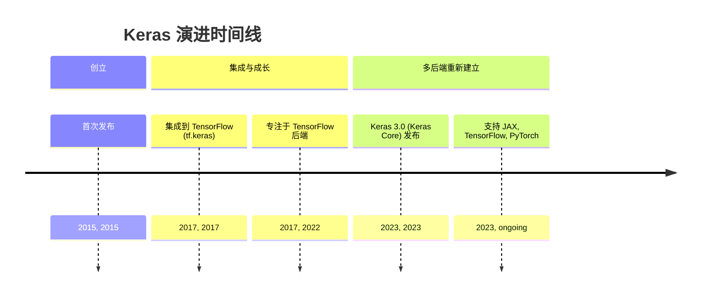
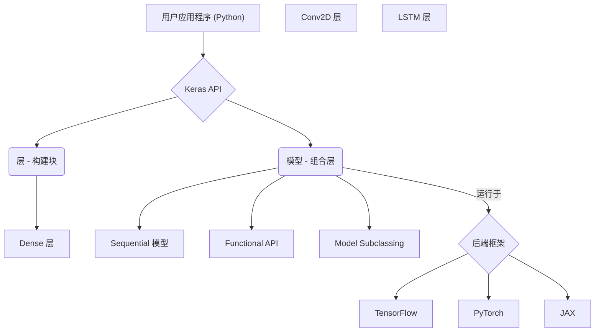
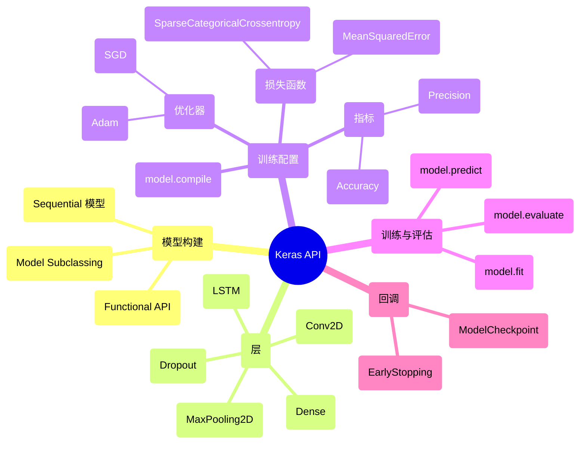

## Keras 演进文档

### 1. 引言与历史背景

Keras 是一个用 Python 编写的高级开源深度学习 API，旨在快速进行神经网络实验。它提供了一个用户友好的界面，简化了构建、训练和评估深度学习模型的过程。Keras 以其模块化、可扩展性和易用性而闻名，是研究人员和开发人员的热门选择。

Keras 由 Google 工程师 François Chollet 开发，并于 2015 年 3 月作为 ONEIROS 研究项目的一部分首次发布。其最初目标是实现深度神经网络的快速原型设计和实验。2017 年，Keras 被集成到 TensorFlow 中，成为其官方高级 API，这是一个重要的转折点。此次集成极大地提升了其受欢迎程度和功能。

最初，Keras 支持多个后端，包括 TensorFlow、Theano 和 Microsoft Cognitive Toolkit (CNTK)。然而，在一段时间内，它主要专注于 TensorFlow。随着 2023 年 **Keras 3.0 (也称为 Keras Core)** 的发布，该库被重写以重新建立多后端支持，使其能够无缝运行在 JAX、TensorFlow 和 PyTorch 上，为用户提供了无与伦比的灵活性。

### 1.1. Keras 演进时间线

### 2. 核心架构

Keras 的核心架构围绕着**层 (Layers)** 和**模型 (Models)** 的概念构建，强调模块化和组合性。它在底层深度学习框架之上提供了一个高级抽象，允许用户专注于模型设计而不是底层实现细节。

#### 2.1. 层：构建块

*   **层 (Layers)**：Keras 中神经网络的基本构建块。每个层代表一个简单的输入/输出转换，并封装自己的状态（权重）和计算。Keras 提供了一组丰富的预构建层，包括：
    *   **核心层**: `Dense`、`Activation`、`Flatten`、`Input`
    *   **卷积层**: `Conv2D`、`Conv1D`
    *   **池化层**: `MaxPooling2D`、`AveragePooling2D`
    *   **循环层**: `LSTM`、`GRU`
    *   **归一化层**: `BatchNormalization`
    *   **Dropout 层**: `Dropout`

#### 2.2. 模型：组合层

Keras 中的模型用于将层组合在一起，并可以在数据上进行训练。Keras 提供了几种构建模型的方法，以适应不同级别的复杂性和灵活性：

*   **Sequential 模型**: 最简单的模型类型，表示层的线性堆叠。适用于简单的前馈网络。
*   **Functional API (函数式 API)**: 一种更灵活的构建模型的方式，允许任意的层图。这使得多输入、多输出模型、共享层和复杂拓扑结构成为可能。
*   **Model Subclassing (模型子类化)**: 对于需要完全控制模型前向传播的高级用户，Keras 允许通过子类化 `tf.keras.Model` 类（或 Keras 3.0 中的 `keras.Model`）从头开始定义自定义模型。

#### 2.3. 多后端支持 (Keras 3.0)

Keras 3.0 的一个重要架构转变是重新建立了真正的多后端支持。这意味着相同的 Keras 代码可以通过简单地更改配置设置在不同的深度学习框架（JAX、TensorFlow、PyTorch）上运行。这提供了无与伦比的灵活性，并允许用户利用不同后端的优势，而无需重写模型。

**Mermaid 图：Keras 核心架构**

### 3. 详细 API 概述

Keras 的 API 设计直观，涵盖了整个深度学习工作流。

#### 3.1. 模型构建

*   **`keras.Sequential([...])`**: 创建层的线性堆叠。
*   **`keras.Input(shape)`**: 与 Functional API 一起使用，定义输入张量。
*   **`keras.Model(inputs, outputs)`**: 使用 Functional API 创建模型。

#### 3.2. 层 (`keras.layers`)

*   **`Dense(units, activation=None)`**: 全连接神经网络层。
*   **`Conv2D(filters, kernel_size, ...)`**: 2D 卷积层（例如，用于图像处理）。
*   **`MaxPooling2D(pool_size)`**: 2D 空间数据的最大池化操作。
*   **`LSTM(units)`**: 长短期记忆层（循环神经网络）。
*   **`Dropout(rate)`**: 对输入应用 Dropout。

#### 3.3. 训练配置

*   **`model.compile(optimizer, loss, metrics)`**: 配置模型以进行训练。
    *   **优化器 (`keras.optimizers`)**: `Adam()`、`SGD()`、`RMSprop()`
    *   **损失函数 (`keras.losses`)**: `SparseCategoricalCrossentropy()`、`MeanSquaredError()`
    *   **指标 (`keras.metrics`)**: `Accuracy()`、`Precision()`、`Recall()`

#### 3.4. 训练与评估

*   **`model.fit(x, y, epochs, batch_size, validation_data, ...)`**: 训练模型。
*   **`model.evaluate(x, y, ...)`**: 在测试模式下返回模型的损失值和指标值。
*   **`model.predict(x)`**: 为输入样本生成输出预测。

#### 3.5. 回调 (`keras.callbacks`)

*   **`EarlyStopping(monitor, patience)`**: 当监控的指标停止改进时停止训练。
*   **`ModelCheckpoint(filepath, monitor, save_best_only)`**: 每个 epoch 后保存模型。

### 3.6. API 思维导图

### 4. 演变与影响

*   **简化深度学习:** Keras 显著降低了深度学习的入门门槛，使更多的开发人员和研究人员能够快速构建和实验神经网络。
*   **快速原型设计:** 其用户友好的 API 和模块化设计实现了快速原型设计和迭代，加速了深度学习项目的开发周期。
*   **高级 API 标准:** Keras 影响了其他深度学习框架中高级 API 的设计，成为构建更高级抽象深度学习模型的实际标准。
*   **多后端灵活性 (Keras 3.0):** Keras 3.0 中重新引入的强大多后端支持是一个游戏规则改变者，为用户提供了前所未有的灵活性，他们现在可以在不更改模型代码的情况下选择自己喜欢的后端（TensorFlow、PyTorch、JAX）。这促进了互操作性并减少了供应商锁定。
*   **强大的社区和生态系统:** Keras 受益于一个庞大而活跃的社区，为其持续开发、广泛文档以及兼容工具和资源的丰富生态系统做出了贡献。

### 5. 结论

Keras 已从一个独立的库发展成为一个功能强大的多后端深度学习 API，它简化了复杂的神经网络任务。其对用户友好性、模块化和快速实验的一贯关注使其成为深度学习从业者不可或缺的工具。随着 Keras 3.0 对后端无关性的重新承诺，它将继续以灵活性和效率赋能用户，巩固其作为在各个领域构建和部署深度学习解决方案的领先选择的地位。
