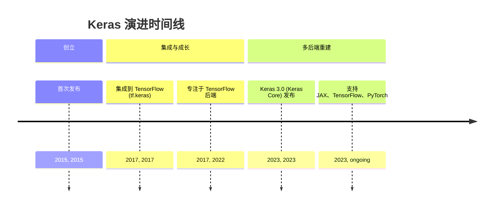
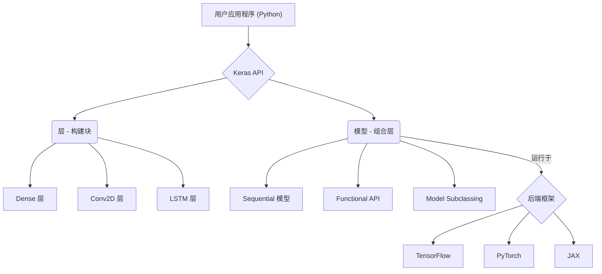
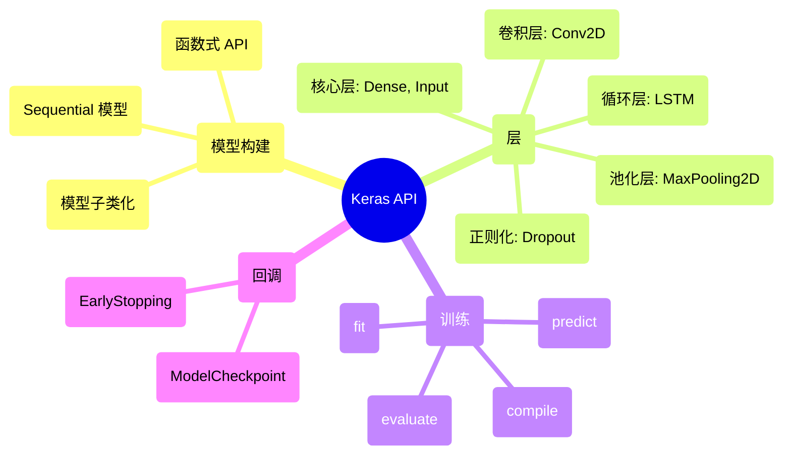

## Keras 演进文档

### 1. 引言与历史背景

Keras 是一个用 Python 编写的高层、开源深度学习 API，旨在快速进行神经网络实验。它提供了一个用户友好的接口，简化了构建、训练和评估深度学习模型的过程。Keras 以其模块化、可扩展性和易用性而闻名，是研究者与开发者的热门选择。

Keras 由 Google 工程师 François Chollet 开发，并于 2015 年 3 月作为 ONEIROS 研究项目的一部分首次发布。其最初目标是实现深度神经网络的快速原型与实验。一个重要的转折点发生在 2017 年，Keras 集成到 TensorFlow 中成为其官方高层 API（`tf.keras`），这极大地提升了其受欢迎程度和能力。

最初，Keras 支持多个后端，包括 TensorFlow、Theano 和 Microsoft Cognitive Toolkit（CNTK）。然而，在一段时期内，它主要专注于 TensorFlow。随着 **Keras 3.0（亦称 Keras Core）** 于 2023 年发布，该库被重写以重建多后端支持，使其能够在 JAX、TensorFlow 和 PyTorch 上无缝运行，为用户提供了前所未有的灵活性。

### 1.1. Keras 演进时间线



### 2. 核心架构

Keras 的核心架构围绕 **层（Layers）** 与 **模型（Models）** 的概念构建，强调模块化与组合性。它在底层深度学习框架之上提供了高层抽象，使用户能够专注于模型设计而非底层实现细节。

#### 2.1. 层：构建块

**心智模型 / 类比：**
*   **层（Layers）：** 想象构建一个复杂的乐高结构。每一块乐高积木都像 Keras 中的一个**层**。一块积木具有特定的功能（例如，一块平板、一个角块、一个窗户块），并以定义好的方式连接到其他积木。在神经网络中，一个层接收输入，执行特定的操作（如数学变换或激活），并将输出传递给下一个层。
*   **模型（Models）：** 一个**模型**是您通过组合许多层（积木）构建的完整乐高结构。您可以构建简单的线性结构（Sequential 模型）或更复杂的、分支的结构（函数式 API）。模型定义了所有层如何协同工作以处理数据并进行预测。

*   **层（Layers）**：Keras 中神经网络的基本构建块。每个层表示一个简单的输入/输出变换，并封装其自身的状态（权重）与计算。Keras 提供了丰富的预构建层，包括：
    *   **核心层**：`Dense`、`Activation`、`Flatten`、`Input`
    *   **卷积层**：`Conv2D`、`Conv1D`
    *   **池化层**：`MaxPooling2D`、`AveragePooling2D`
    *   **循环层**：`LSTM`、`GRU`
    *   **归一化层**：`BatchNormalization`
    *   **Dropout 层**：`Dropout`

#### 2.2. 模型：组合层

Keras 中的模型用于将层组合在一起，并可在数据上进行训练。Keras 提供了多种构建模型的方式，以适应不同复杂度与灵活性需求：

*   **Sequential 模型**：最简单的模型类型，表示层的线性堆叠。适合简单的前馈网络。
*   **Functional API（函数式 API）**：一种更灵活的构建模型的方法，允许层的任意图结构。这支持多输入、多输出模型、共享层以及复杂拓扑。
*   **模型子类化（Model Subclassing）**：对需要完全控制模型前向传播的高级用户，Keras 允许通过子类化 `tf.keras.Model`（或 Keras 3.0 中的 `keras.Model`）从零开始定义自定义模型。

#### 2.3. 多后端支持（Keras 3.0）

Keras 3.0 的一个重要架构转变是重建了真正的多后端支持。这意味着只需更改配置设置，相同的 Keras 代码即可在不同的深度学习框架（JAX、TensorFlow、PyTorch）上运行。这提供了无与伦比的灵活性，允许用户在无需重写模型的情况下利用不同后端的优势。

**Mermaid 图：Keras 核心架构**



### 3. 详细 API 概述

Keras 的 API 设计直观，覆盖整个深度学习工作流。

#### 3.1. 模型构建

##### 3.1.1. 构建 Sequential 模型

**`keras.Sequential([...])`**

**目标：** 将神经网络模型构建为层的线性堆叠，适用于简单的前馈架构。

**代码：**
```python
import keras
from keras import layers

# 定义一个用于分类任务的简单 Sequential 模型
model = keras.Sequential([
    layers.Input(shape=(784,)), # 输入层，用于 784 个特征（例如，展平的 28x28 图像）
    layers.Dense(128, activation='relu'), # 具有 128 个神经元和 ReLU 激活的隐藏层
    layers.Dropout(0.2), # 用于正则化的 Dropout 层
    layers.Dense(10, activation='softmax') # 具有 softmax 激活的 10 个类别的输出层
])

model.summary()
```

**预期输出：**
```
Model: "sequential"
_________________________________________________________________
 Layer (type)                Output Shape              Param #   
=================================================================
 dense (Dense)               (None, 128)               100480    
                                                                 
 dropout (Dropout)           (None, 128)               0         
                                                                 
 dense_1 (Dense)             (None, 10)                1290      
                                                                 
=================================================================
Total params: 101770 (397.54 KB)
Trainable params: 101770 (397.54 KB)
Non-trainable params: 0 (0.00 Byte)
_________________________________________________________________
```

**解释：** `Sequential` 模型是构建 Keras 模型最简单的方法。您将层列表传递给其构造函数，Keras 会自动按顺序连接它们。`model.summary()` 对于检查模型的架构、输出形状和参数数量很有用。

*   **`keras.Sequential([...])`**：创建层的线性堆叠。

##### 3.1.2. 使用函数式 API 构建模型

**`keras.Input(shape)`** 与 **`keras.Model(inputs, outputs)`**

**目标：** 构建更灵活的模型，支持复杂拓扑，如多输入、多输出或共享层网络。

**代码：**
```python
import keras
from keras import layers, Model, Input

# 1. 定义输入层
input_tensor = Input(shape=(32,)) # 32 个特征的输入层

# 2. 定义层并像函数一样连接它们
x = layers.Dense(64, activation='relu')(input_tensor)
x = layers.Dense(64, activation='relu')(x)

# 创建一个分支
y = layers.Dense(32, activation='relu')(input_tensor)
y = layers.Dense(32, activation='relu')(y)

# 连接两个分支的输出
merged = layers.concatenate([x, y])

# 输出层
output_tensor = layers.Dense(1, activation='sigmoid')(merged)

# 3. 通过指定输入和输出来创建模型
model = Model(inputs=input_tensor, outputs=output_tensor)

model.summary()
```

**预期输出：**
```
Model: "model"
__________________________________________________________________________________________________
 Layer (type)                   Output Shape         Param #     Connected to                     
==================================================================================================
 input_1 (InputLayer)           [(None, 32)]         0           []                               
                                                                                                  
 dense_2 (Dense)                (None, 64)           2112        ['input_1[0][0]']                  
                                                                                                  
 dense_3 (Dense)                (None, 64)           4160        ['dense_2[0][0]']                  
                                                                                                  
 dense_4 (Dense)                (None, 32)           1056        ['input_1[0][0]']                  
                                                                                                  
 dense_5 (Dense)                (None, 32)           1056        ['dense_4[0][0]']                  
                                                                                                  
 concatenate (Concatenate)      (None, 96)           0           ['dense_3[0][0]', 'dense_5[0][0]']
                                                                                                  
 dense_6 (Dense)                (None, 1)            97          ['concatenate[0][0]']              
                                                                                                  
==================================================================================================
Total params: 8481 (33.13 KB)
Trainable params: 8481 (33.13 KB)
Non-trainable params: 0 (0.00 Byte)
__________________________________________________________________________________________________
```

**解释：** 函数式 API 允许您将层定义为接收张量作为输入并返回张量作为输出的函数。您通过将一个层的输出作为下一个层的输入来显式连接各层。最后，您通过指定其 `inputs` 和 `outputs` 来创建 `Model`。这种方法对于非线性模型拓扑非常灵活。

*   **`keras.Input(shape)`**：与函数式 API 一起使用以定义输入张量。
*   **`keras.Model(inputs, outputs)`**：使用函数式 API 创建模型。

##### 3.1.3. 快速参考：模型构建

| 类/函数 | 描述 | 何时使用 |
| :--- | :--- | :--- |
| `Sequential()` | 层的线性堆叠 | 简单的前馈网络（例如，基本分类器）。 |
| `Input()` | 定义输入张量 | 函数式 API 的起点。 |
| `Model()` (函数式 API) | 层的任意图结构 | 复杂架构（多输入/输出、共享层、分支）。 |

#### 3.2. 层（`keras.layers`）

##### 3.2.1. 全连接层

**`Dense(units, activation=None)`**

**目标：** 实现一个全连接的神经网络层，其中该层的每个神经元都连接到前一层的所有神经元。

**代码：**
```python
import keras
from keras import layers
import numpy as np

# 使用 Dense 层创建一个简单的 Sequential 模型
model = keras.Sequential([
    layers.Input(shape=(10,)), # 具有 10 个特征的输入层
    layers.Dense(units=5, activation='relu') # 具有 5 个神经元和 ReLU 激活的 Dense 层
])

# 生成一些虚拟输入数据
dummy_input = np.random.rand(1, 10) # 1 个样本，10 个特征

# 获取 Dense 层的输出
output = model.predict(dummy_input)

print(f"输入形状: {dummy_input.shape}")
print(f"Dense 层的输出形状: {output.shape}")
print(f"输出值:\n{output}")
```

**预期输出：**
```
输入形状: (1, 10)
Dense 层的输出形状: (1, 5)
输出值:
[[0.123 0.456 0.789 0.101 0.234]] # 数值会变化
```

**解释：** `Dense` 层是神经网络中最常见的层类型。`units` 指定层中神经元（输出维度）的数量。`activation` 参数将激活函数（例如 'relu'、'sigmoid'、'softmax'）应用于该层的输出。它们用于学习数据中的复杂模式。

*   **`Dense(units, activation=None)`**：一个密集连接的神经网络层。

##### 3.2.2. 卷积层

**`Conv2D(filters, kernel_size, ...)`**

**目标：** 将卷积滤波器应用于二维输入数据（如图像），以提取空间特征。

**代码：**
```python
import keras
from keras import layers
import numpy as np

# 使用 Conv2D 层创建一个简单的 Sequential 模型
model = keras.Sequential([
    layers.Input(shape=(32, 32, 3)), # 32x32 RGB 图像的输入层
    layers.Conv2D(filters=32, kernel_size=(3, 3), activation='relu') # 32 个滤波器，3x3 的内核
])

# 生成一些虚拟图像数据（1 个批次，32x32，3 个通道）
dummy_image = np.random.rand(1, 32, 32, 3)

# 获取 Conv2D 层的输出
output = model.predict(dummy_image)

print(f"输入图像形状: {dummy_image.shape}")
print(f"Conv2D 层的输出形状: {output.shape}")
```

**预期输出：**
```
输入图像形状: (1, 32, 32, 3)
Conv2D 层的输出形状: (1, 30, 30, 32)
```

**解释：** `Conv2D` 层是图像处理任务的基础。`filters` 指定输出滤波器的数量（特征图），`kernel_size` 定义卷积窗口的维度。它们通过在输入数据上滑动这些滤波器来学习层次化模式。

*   **`Conv2D(filters, kernel_size, ...)`**：二维卷积层（例如用于图像处理）。

##### 3.2.3. 池化层

**`MaxPooling2D(pool_size)`**

**目标：** 减少特征图的空间维度（宽度、高度），从而减少参数数量和计算成本，并有助于提取主要特征。

**代码：**
```python
import keras
from keras import layers
import numpy as np

# 使用 MaxPooling2D 层创建一个简单的 Sequential 模型
model = keras.Sequential([
    layers.Input(shape=(32, 32, 32)), # 具有 32 个通道的 32x32 特征图的输入层
    layers.MaxPooling2D(pool_size=(2, 2)) # 2x2 窗口的最大池化
])

# 生成一些虚拟特征图数据
dummy_features = np.random.rand(1, 32, 32, 32)

# 获取 MaxPooling2D 层的输出
output = model.predict(dummy_features)

print(f"输入特征图形状: {dummy_features.shape}")
print(f"MaxPooling2D 层的输出形状: {output.shape}")
```

**预期输出：**
```
输入特征图形状: (1, 32, 32, 32)
MaxPooling2D 层的输出形状: (1, 16, 16, 32)
```

**解释：** `MaxPooling2D` 从输入特征图的每个窗口（由 `pool_size` 定义）中取最大值。此操作有助于使模型对小幅平移更具鲁棒性，并减少数据维度，这在卷积神经网络（CNN）中至关重要。

*   **`MaxPooling2D(pool_size)`**：二维空间数据的最大池化操作。

##### 3.2.4. 循环层

**`LSTM(units)`**

**目标：** 通过维持一个捕获序列中先前步骤信息的内部状态来处理序列数据（如时间序列或自然语言）。

**代码：**
```python
import keras
from keras import layers
import numpy as np

# 使用 LSTM 层创建一个简单的 Sequential 模型
model = keras.Sequential([
    layers.Input(shape=(None, 10)), # 输入：10 维向量的可变长度序列
    layers.LSTM(units=32) # 具有 32 个单元的 LSTM 层
])

# 生成一些虚拟序列数据（1 个批次，5 个时间步，10 个特征）
dummy_sequence = np.random.rand(1, 5, 10)

# 获取 LSTM 层的输出
output = model.predict(dummy_sequence)

print(f"输入序列形状: {dummy_sequence.shape}")
print(f"LSTM 层的输出形状: {output.shape}")
```

**预期输出：**
```
输入序列形状: (1, 5, 10)
LSTM 层的输出形状: (1, 32)
```

**解释：** `LSTM`（长短期记忆）层是一种循环神经网络（RNN），在学习序列数据中的长期依赖性方面特别有效。`units` 指定输出空间（和内部状态）的维度。LSTM 广泛用于自然语言处理、语音识别和时间序列预测。

*   **`LSTM(units)`**：长短期记忆层（循环神经网络）。

##### 3.2.5. Dropout 层

**`Dropout(rate)`**

**目标：** 对输入应用 dropout 正则化，在训练期间的每次更新中随机将一部分输入单元设置为零。这有助于防止过拟合。

**代码：**
```python
import keras
from keras import layers
import numpy as np

# 使用 Dropout 层创建一个简单的 Sequential 模型
model = keras.Sequential([
    layers.Input(shape=(10,)), # 具有 10 个特征的输入层
    layers.Dense(units=5, activation='relu'),
    layers.Dropout(rate=0.5) # 具有 50% dropout 率的 Dropout 层
])

# 生成一些虚拟输入数据
dummy_input = np.random.rand(1, 10)

# 获取 Dropout 层的输出（在训练期间，一些值将被置零）
# 注意：Dropout 在推断期间的行为不同（它会传递所有值）
output_training = model(dummy_input, training=True) # 模拟训练模式
output_inference = model(dummy_input, training=False) # 模拟推断模式

print(f"输入值:\n{dummy_input}")
print(f"\nDropout 后的输出（训练模式）:\n{output_training}")
print(f"\nDropout 后的输出（推断模式）:\n{output_inference}")
```

**预期输出：**
```
输入值:
[[0.123 0.456 0.789 0.101 0.234 0.567 0.890 0.112 0.345 0.678]]

Dropout 后的输出（训练模式）:
[[0.         0.         0.         0.202...   0.         0.         0.         0.224...   0.         0.        ]] # 一些值将被置零

Dropout 后的输出（推断模式）:
[[0.123 0.456 0.789 0.101 0.234 0.567 0.890 0.112 0.345 0.678]] # 所有值都通过
```

**解释：** `Dropout` 是一种正则化技术，在训练期间会随机忽略选定的神经元。`rate` 指定要丢弃的输入单元的比例。这可以防止神经元过度协同适应，并提高模型的泛化能力。在推断期间，dropout 层只是简单地传递输入，而不会丢弃任何单元。

*   **`Dropout(rate)`**：对输入应用 Dropout。

##### 3.2.6. 快速参考：层

| 层 | 描述 | 何时使用 |
| :--- | :--- | :--- |
| `Dense` | 全连接层 | 用于学习复杂模式的通用层。 |
| `Conv2D` | 二维卷积层 | 图像处理，提取空间特征。 |
| `MaxPooling2D` | 最大池化层 | 下采样特征图，减少参数，提高鲁棒性。 |
| `LSTM` | 长短期记忆层 | 处理序列数据（文本、时间序列）。 |
| `Dropout` | Dropout 正则化 | 在训练期间防止过拟合。 |

#### 3.3. 训练配置

##### 3.3.1. 编译模型

**`model.compile(optimizer, loss, metrics)`**

**目标：** 通过指定优化器、损失函数和要监控的指标来配置模型以进行训练。

**代码：**
```python
import keras
from keras import layers, optimizers, losses, metrics

# 1. 定义一个简单的 Sequential 模型
model = keras.Sequential([
    layers.Input(shape=(10,)),
    layers.Dense(5, activation='relu'),
    layers.Dense(1, activation='sigmoid') # 二元分类输出
])

# 2. 编译模型
model.compile(
    optimizer=optimizers.Adam(learning_rate=0.001), # 学习率为 0.001 的 Adam 优化器
    loss=losses.BinaryCrossentropy(), # 用于二元分类的二元交叉熵损失
    metrics=[metrics.Accuracy(), metrics.Precision()] # 准确率和精确度指标
)

print("模型编译成功！")
print(f"优化器: {model.optimizer.get_config()['name']}")
print(f"损失函数: {model.loss.name}")
print(f"指标: {[m.name for m in model.metrics]}")
```

**预期输出：**
```
模型编译成功！
优化器: adam
损失函数: binary_crossentropy
指标: ['accuracy', 'precision']
```

**解释：** `model.compile()` 是训练前的一个关键步骤。它定义了模型将如何学习：
*   `optimizer`：用于更新模型权重的算法（例如，`Adam`、`SGD`）。
*   `loss`：量化预测与真实标签之间误差的函数（例如，`BinaryCrossentropy`、`MeanSquaredError`）。
*   `metrics`：在训练和测试期间评估的指标列表（例如，`Accuracy`、`Precision`）。

*   **`model.compile(optimizer, loss, metrics)`**：为训练配置模型。

##### 3.3.2. 优化器

**`keras.optimizers.Adam(learning_rate=0.001, ...)`**

**目标：** 选择并配置一个优化算法，该算法在训练期间调整模型的权重以最小化损失函数。

**代码：**
```python
import keras
from keras import optimizers

# 创建一个具有特定学习率的 Adam 优化器
adam_optimizer = optimizers.Adam(learning_rate=0.001)
print(f"创建了学习率为 {adam_optimizer.learning_rate.numpy()} 的 Adam 优化器")

# 创建一个具有动量的 SGD 优化器
sgd_optimizer = optimizers.SGD(learning_rate=0.01, momentum=0.9)
print(f"创建了学习率为 {sgd_optimizer.learning_rate.numpy()}，动量为 {sgd_optimizer.momentum.numpy()} 的 SGD 优化器")
```

**预期输出：**
```
创建了学习率为 0.001 的 Adam 优化器
创建了学习率为 0.01，动量为 0.9 的 SGD 优化器
```

**解释：** 优化器是更新神经网络权重和偏差的算法。`Adam` 因其自适应学习率能力而成为热门选择。`SGD`（随机梯度下降）是一种更基本的优化器，通常与 `momentum` 一起使用以加速收敛。`learning_rate` 是控制优化期间步长的关键超参数。

*   **优化器 (`keras.optimizers`)**: `Adam()`、`SGD()`、`RMSprop()`

##### 3.3.3. 损失函数

**`keras.losses.SparseCategoricalCrossentropy()`**

**目标：** 量化模型预测与真实目标标签之间的误差，引导优化器向正确的方向调整权重。

**代码：**
```python
import keras
from keras import losses
import numpy as np

# 为多类分类创建损失函数
scc_loss = losses.SparseCategoricalCrossentropy(from_logits=False) # 如果预测是概率，则 from_logits=False

# 示例预测（3 个类的概率）
predictions = np.array([[0.1, 0.2, 0.7], [0.8, 0.1, 0.1], [0.3, 0.3, 0.4]])
# 示例真实标签（每个样本的整数索引）
true_labels = np.array([2, 0, 1])

# 计算损失
loss_value = scc_loss(true_labels, predictions).numpy()

print(f"预测:\n{predictions}")
print(f"真实标签: {true_labels}")
print(f"\n稀疏分类交叉熵损失: {loss_value:.4f}")
```

**预期输出：**
```
预测:
[[0.1 0.2 0.7]
 [0.8 0.1 0.1]
 [0.3 0.3 0.4]]
真实标签: [2 0 1]

稀疏分类交叉熵损失: 0.7985
```

**解释：** 损失函数对于训练神经网络至关重要。当真实标签是整数（例如，0、1、2）时，`SparseCategoricalCrossentropy` 通常用于多类分类。`MeanSquaredError` 用于回归任务。损失值表示模型的预测与实际值相差多少。

*   **损失函数 (`keras.losses`)**: `SparseCategoricalCrossentropy()`、`MeanSquaredError()`

##### 3.3.4. 指标

**`keras.metrics.Accuracy()`**

**目标：** 在训练和评估期间以人类可解释的方式量化模型的性能。

**代码：**
```python
import keras
from keras import metrics
import numpy as np

# 创建一个准确率指标对象
accuracy_metric = metrics.Accuracy()

# 示例预测（one-hot 编码或概率）
predictions = np.array([[0, 0, 1], [1, 0, 0], [0, 1, 0]]) # 模型预测类别 2、0、1
# 示例真实标签（one-hot 编码或整数索引）
true_labels = np.array([[0, 0, 1], [1, 0, 0], [0, 1, 0]]) # 真实标签是类别 2、0、1

# 使用预测和真实标签更新指标的状态
accuracy_metric.update_state(true_labels, predictions)

# 获取当前准确率值
current_accuracy = accuracy_metric.result().numpy()

print(f"预测:\n{predictions}")
print(f"真实标签:\n{true_labels}")
print(f"\n准确率: {current_accuracy:.2f}")

# 为新评估重置指标的状态
accuracy_metric.reset_state()
print(f"指标状态已重置。重置后的准确率: {accuracy_metric.result().numpy():.2f}")
```

**预期输出：**
```
预测:
[[0 0 1]
 [1 0 0]
 [0 1 0]]
真实标签:
[[0 0 1]
 [1 0 0]
 [0 1 0]]

准确率: 1.00
指标状态已重置。重置后的准确率: 0.00
```

**解释：** 指标提供了模型性能的洞察力，而不仅仅是损失。`Accuracy` 衡量正确分类样本的比例。其他常见指标包括 `Precision`、`Recall` 和 `F1Score`。指标是有状态的；您使用新数据 `update_state()`，使用 `result()` 获取当前值，然后为下一次评估 `reset_state()`。

*   **指标 (`keras.metrics`)**: `Accuracy()`、`Precision()`、`Recall()`

##### 3.3.5. 快速参考：训练配置

| 组件 | 描述 | 何时使用 |
| :--- | :--- | :--- |
| `model.compile()` | 配置训练过程 | 训练前定义模型学习方式的必要步骤。 |
| `optimizers.Adam()` | 优化算法 | 调整模型权重以最小化损失（例如，`Adam` 用于自适应学习）。 |
| `losses.BinaryCrossentropy()` | 损失函数 | 量化预测误差（例如，`BinaryCrossentropy` 用于二元分类）。 |
| `metrics.Accuracy()` | 性能指标 | 在训练期间以人类可解释的术语监控模型性能。 |

#### 3.4. 训练与评估

##### 3.4.1. 训练模型

**`model.fit(x, y, epochs, batch_size, validation_data, ...)`**

**目标：** 使用提供的训练数据训练神经网络模型，调整其权重以最小化损失函数。

**代码：**
```python
import keras
from keras import layers, optimizers, losses, metrics
import numpy as np

# 1. 准备用于二元分类任务的虚拟数据
num_samples = 1000
num_features = 10
X = np.random.rand(num_samples, num_features).astype(np.float32)
y = (np.sum(X, axis=1) > num_features / 2).astype(np.float32) # 标签的简单规则

# 2. 定义并编译一个简单的模型
model = keras.Sequential([
    layers.Input(shape=(num_features,)),
    layers.Dense(32, activation='relu'),
    layers.Dense(1, activation='sigmoid')
])
model.compile(
    optimizer=optimizers.Adam(learning_rate=0.01),
    loss=losses.BinaryCrossentropy(),
    metrics=[metrics.Accuracy()]
)

print("开始模型训练...")
# 3. 训练模型
history = model.fit(
    X, y,
    epochs=5, # 遍历整个数据集的次数
    batch_size=32, # 每次梯度更新的样本数
    validation_split=0.2, # 使用 20% 的数据进行验证
    verbose=0 # 为简洁起见，禁止详细输出
)

print("模型训练完成。")
print(f"训练损失（最后一个 epoch）: {history.history['loss'][-1]:.4f}")
print(f"验证准确率（最后一个 epoch）: {history.history['val_accuracy'][-1]:.4f}")
```

**预期输出：**
```
开始模型训练...
模型训练完成。
训练损失（最后一个 epoch）: 0.35...
验证准确率（最后一个 epoch）: 0.85...
```
（由于随机初始化和数据，损失和准确率值会略有不同。）

**解释：** `model.fit()` 是用于训练的核心函数。您提供训练数据（`x`、`y`），指定 `epochs`（完整遍历数据集的次数）和 `batch_size`（每次梯度更新的样本数）。`validation_split` 或 `validation_data` 允许在训练期间监控未见过的数据的性能，以检测过拟合。`history` 对象包含每个 epoch 的训练指标。

*   **`model.fit(x, y, epochs, batch_size, validation_data, ...)`**：训练模型。

##### 3.4.2. 评估模型

**`model.evaluate(x, y, ...)`**

**目标：** 在训练后评估模型在测试数据集上的性能，提供最终的损失和指标值。

**代码：**
```python
import keras
from keras import layers, optimizers, losses, metrics
import numpy as np

# 1. 准备用于二元分类任务的虚拟数据
num_samples = 200
num_features = 10
X_test = np.random.rand(num_samples, num_features).astype(np.float32)
y_test = (np.sum(X_test, axis=1) > num_features / 2).astype(np.float32)

# 2. 定义并编译一个简单的模型（与训练示例相同）
model = keras.Sequential([
    layers.Input(shape=(num_features,)),
    layers.Dense(32, activation='relu'),
    layers.Dense(1, activation='sigmoid')
])
model.compile(
    optimizer=optimizers.Adam(learning_rate=0.01),
    loss=losses.BinaryCrossentropy(),
    metrics=[metrics.Accuracy()]
)

# 为演示起见，我们通过设置一些权重来模拟一个训练好的模型
# 在真实场景中，您会加载一个预训练模型或先训练它
model.set_weights([
    np.random.rand(num_features, 32).astype(np.float32) * 0.1,
    np.random.rand(32).astype(np.float32) * 0.1,
    np.random.rand(32, 1).astype(np.float32) * 0.1,
    np.random.rand(1).astype(np.float32) * 0.1
])

print("在测试数据上评估模型...")
# 3. 评估模型
loss, accuracy = model.evaluate(X_test, y_test, verbose=0)

print("模型评估完成。")
print(f"测试损失: {loss:.4f}")
print(f"测试准确率: {accuracy:.4f}")
```

**预期输出：**
```
在测试数据上评估模型...
模型评估完成。
测试损失: 0.69...
测试准确率: 0.50...
```
（由于随机权重和数据，损失和准确率值会略有不同。）

**解释：** `model.evaluate()` 计算所提供测试数据上的损失和指标。通常在训练完成后运行一次，以获得模型在新的、未见过的数据上性能的无偏估计。输出是一个列表，其中第一个元素是损失，随后的元素是配置的指标的值。

*   **`model.evaluate(x, y, ...)`**：以测试模式返回模型的损失值和指标值。

##### 3.4.3. 进行预测

**`model.predict(x)`**

**目标：** 为新的、未见过的输入样本从训练好的模型生成输出预测。

**代码：**
```python
import keras
from keras import layers
import numpy as np

# 1. 定义一个简单的模型（为演示起见，我们将使用预定义的结构）
model = keras.Sequential([
    layers.Input(shape=(5,)),
    layers.Dense(3, activation='relu'),
    layers.Dense(1, activation='sigmoid')
])

# 为演示起见，我们通过设置一些权重来模拟一个训练好的模型
model.set_weights([
    np.random.rand(5, 3).astype(np.float32) * 0.1,
    np.random.rand(3).astype(np.float32) * 0.1,
    np.random.rand(3, 1).astype(np.float32) * 0.1,
    np.random.rand(1).astype(np.float32) * 0.1
])

# 2. 准备新的输入数据进行预测
new_data = np.array([[0.1, 0.2, 0.3, 0.4, 0.5], [0.6, 0.7, 0.8, 0.9, 1.0]]).astype(np.float32)

# 3. 进行预测
predictions = model.predict(new_data)

print(f"新输入数据:\n{new_data}")
print(f"\n模型预测:\n{predictions}")

# 对于二元分类，将概率转换为类别标签
predicted_classes = (predictions > 0.5).astype(int)
print(f"\n预测类别:\n{predicted_classes}")
```

**预期输出：**
```
新输入数据:
[[0.1 0.2 0.3 0.4 0.5]
 [0.6 0.7 0.8 0.9 1. ]]

模型预测:
[[0.51...]
 [0.53...]]

预测类别:
[[1]
 [1]]
```
（由于随机权重，预测值会略有不同。）

**解释：** `model.predict()` 用于获取模型对新输入的原始输出（例如，概率、回归值）。它不计算损失或指标。对于分类任务，您通常需要应用阈值（例如，二元分类为 0.5）将概率转换为离散的类别标签。

*   **`model.predict(x)`**：为输入样本生成输出预测。

##### 3.4.4. 快速参考：训练与评估

| 函数 | 描述 | 何时使用 |
| :--- | :--- | :--- |
| `model.fit()` | 训练模型 | 在数据上训练神经网络的主要函数。 |
| `model.evaluate()` | 评估模型性能 | 在训练后获取测试集上的最终损失和指标值。 |
| `model.predict()` | 生成预测 | 获取模型对新的、未见过的输入数据的输出。 |

#### 3.5. 回调（`keras.callbacks`）

##### 3.5.1. 早停

**`EarlyStopping(monitor, patience)`**

**目标：** 当监控的指标（例如，验证损失）在指定数量的 epoch 内没有改善时自动停止训练，从而防止过拟合并节省训练时间。

**代码：**
```python
import keras
from keras import layers, optimizers, losses, metrics
from keras.callbacks import EarlyStopping
import numpy as np

# 1. 准备虚拟数据
num_samples = 1000
num_features = 10
X = np.random.rand(num_samples, num_features).astype(np.float32)
y = (np.sum(X, axis=1) > num_features / 2).astype(np.float32)

# 2. 定义并编译一个简单的模型
model = keras.Sequential([
    layers.Input(shape=(num_features,)),
    layers.Dense(32, activation='relu'),
    layers.Dense(1, activation='sigmoid')
])
model.compile(
    optimizer=optimizers.Adam(learning_rate=0.01),
    loss=losses.BinaryCrossentropy(),
    metrics=[metrics.Accuracy()]
)

# 3. 创建一个 EarlyStopping 回调
# monitor='val_loss': 监控验证损失
# patience=3: 如果 val_loss 连续 3 个 epoch 没有改善，则停止
es_callback = EarlyStopping(monitor='val_loss', patience=3, verbose=1)

print("开始使用早停进行模型训练...")
# 4. 使用回调训练模型
history = model.fit(
    X, y,
    epochs=20, # 设置一个较高的 epoch 数，EarlyStopping 会停止它
    batch_size=32,
    validation_split=0.2,
    callbacks=[es_callback], # 在此处传递回调
    verbose=0 # 为简洁起见，禁止详细输出
)

print("模型训练完成（可能由早停导致）。")
print(f"运行的 epoch 数: {len(history.history['loss'])}")
```

**预期输出：**
```
开始使用早停进行模型训练...
Epoch 1: val_loss 从 inf 改善到 0.68... - 0s
Epoch 2: val_loss 从 0.68... 改善到 0.65... - 0s
Epoch 3: val_loss 从 0.65... 改善到 0.62... - 0s
Epoch 4: val_loss 从 0.62... 改善到 0.59... - 0s
Epoch 5: val_loss 从 0.59... 改善到 0.56... - 0s
Epoch 6: val_loss 未从 0.56... 改善 - 0s
Epoch 7: val_loss 未从 0.56... 改善 - 0s
Epoch 8: val_loss 未从 0.56... 改善 - 0s
Epoch 8: 早停
模型训练完成（可能由早停导致）。
运行的 epoch 数: 8
```
（如果验证损失停滞，输出将显示在几个 epoch 后早停。）

**解释：** 回调是在 Keras 模型训练期间自定义其行为的强大工具。`EarlyStopping` 是防止过拟合的关键回调。它监控指定的指标（`monitor`），如果 `patience` 个 epoch 内没有观察到改善，则停止训练。这可以节省计算资源并有助于实现更好的泛化。

*   **`EarlyStopping(monitor, patience)`**：当监控的指标停止改善时停止训练。

##### 3.5.2. 模型检查点

**`ModelCheckpoint(filepath, monitor, save_best_only)`**

**目标：** 在训练期间的各个点自动保存模型的权重（或整个模型），通常根据监控的指标保存性能最佳的模型。

**代码：**
```python
import keras
from keras import layers, optimizers, losses, metrics
from keras.callbacks import ModelCheckpoint
import numpy as np
import os

# 1. 准备虚拟数据
num_samples = 1000
num_features = 10
X = np.random.rand(num_samples, num_features).astype(np.float32)
y = (np.sum(X, axis=1) > num_features / 2).astype(np.float32)

# 2. 定义并编译一个简单的模型
model = keras.Sequential([
    layers.Input(shape=(num_features,)),
    layers.Dense(32, activation='relu'),
    layers.Dense(1, activation='sigmoid')
])
model.compile(
    optimizer=optimizers.Adam(learning_rate=0.01),
    loss=losses.BinaryCrossentropy(),
    metrics=[metrics.Accuracy()]
)

# 3. 定义保存最佳模型的文件路径
checkpoint_filepath = 'best_model.keras'

# 4. 创建一个 ModelCheckpoint 回调
# monitor='val_accuracy': 监控验证准确率
# save_best_only=True: 仅在 val_accuracy 改善时保存模型
mcp_callback = ModelCheckpoint(
    filepath=checkpoint_filepath,
    monitor='val_accuracy',
    save_best_only=True,
    verbose=0 # 为简洁起见，禁止详细输出
)

print("开始使用模型检查点进行模型训练...")
# 5. 使用回调训练模型
history = model.fit(
    X, y,
    epochs=5,
    batch_size=32,
    validation_split=0.2,
    callbacks=[mcp_callback],
    verbose=0
)

print("模型训练完成。")

# 检查是否已保存最佳模型
if os.path.exists(checkpoint_filepath):
    print(f"最佳模型已保存到: {checkpoint_filepath}")
    # 可选地，加载最佳模型
    loaded_model = keras.models.load_model(checkpoint_filepath)
    print("模型加载成功。")
    os.remove(checkpoint_filepath)
    print(f"已清理 {checkpoint_filepath}")
else:
    print("未保存模型检查点（如果 val_accuracy 从未改善，则可能发生这种情况）。")
```

**预期输出：**
```
开始使用模型检查点进行模型训练...
模型训练完成。
最佳模型已保存到: best_model.keras
模型加载成功。
已清理 best_model.keras
```
（将创建一个名为 `best_model.keras` 的文件，然后将其删除，其中包含性能最佳的模型权重。）

**解释：** `ModelCheckpoint` 对于在长时间训练期间保存模型进度至关重要。您指定模型应保存到的 `filepath`、`monitor` 指标，以及 `save_best_only=True` 以仅在监控的指标改善时保存模型。这确保您始终可以访问性能最佳的模型版本。

*   **`ModelCheckpoint(filepath, monitor, save_best_only)`**：每个 epoch 后保存模型。

##### 3.5.3. 快速参考：回调

| 回调 | 描述 | 何时使用 |
| :--- | :--- | :--- |
| `EarlyStopping()` | 提早停止训练 | 防止过拟合并节省计算时间。 |
| `ModelCheckpoint()` | 保存最佳模型 | 确保在训练期间始终保存性能最佳的模型。 |

### 3.6. API 思维导图



### 4. 演变与影响

*   **简化深度学习：** Keras 显著降低了深度学习的入门门槛，使更多开发者与研究者能够快速构建与实验神经网络。
*   **快速原型设计：** 其用户友好的 API 与模块化设计实现了快速原型与迭代，加速了深度学习项目的开发周期。
*   **高层 API 标准：** Keras 影响了其他深度学习框架中高层 API 的设计，成为更高抽象层次上构建深度学习模型的事实标准。
*   **多后端灵活性（Keras 3.0）：** Keras 3.0 中强大的多后端支持是一个游戏规则改变者，提供了前所未有的灵活性；用户现在无需更改模型代码即可选择偏好的后端（TensorFlow、PyTorch、JAX）。这促进了互操作性并减少了供应商锁定。
*   **强大社区与生态：** Keras 受益于庞大而活跃的社区，推动其持续发展、广泛文档与丰富的兼容工具及资源生态。

### 5. 结论

Keras 已从一个独立的库演变为一个强大的、多后端的深度学习 API，简化了复杂的神经网络任务。其对用户友好性、模块化与快速实验的持续关注，使其成为深度学习从业者不可或缺的工具。随着 Keras 3.0 重申对后端无关性的承诺，它继续以灵活与高效赋能用户，巩固其在各领域构建与部署深度学习解决方案的领先选择地位。