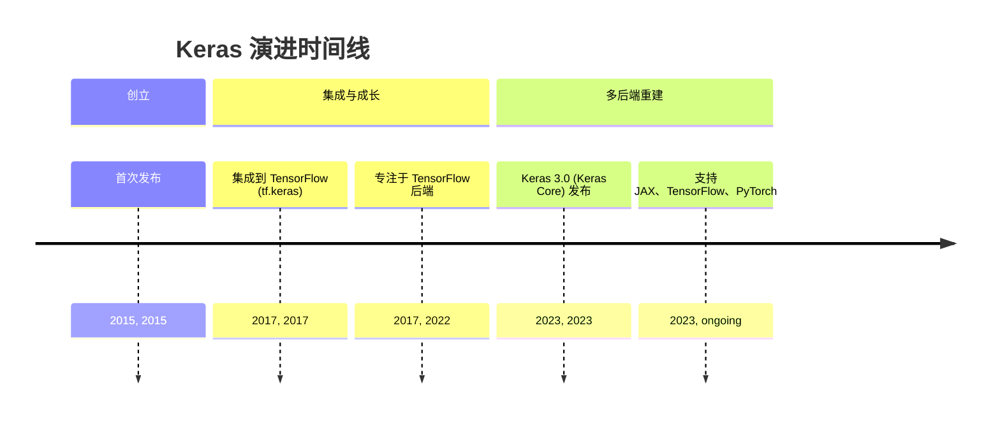
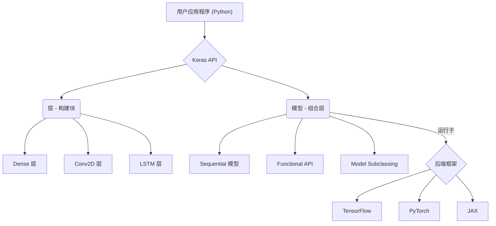
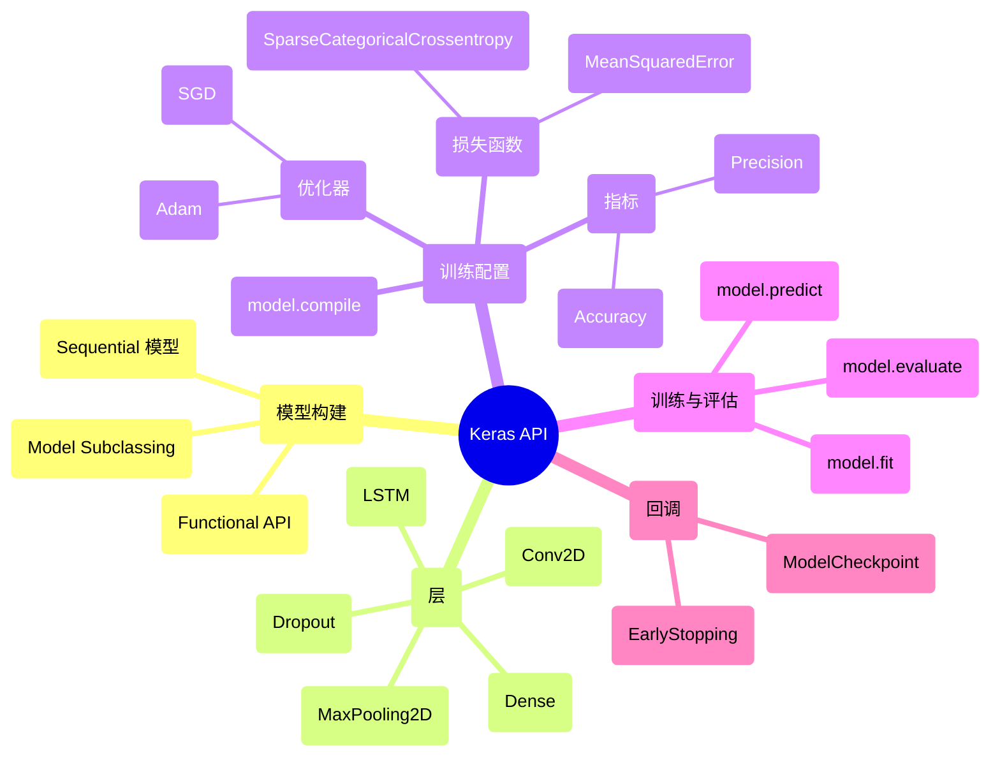

## Keras 演进文档

### 1. 引言与历史背景

Keras 是一个用 Python 编写的高层、开源深度学习 API，旨在快速进行神经网络实验。它提供了一个用户友好的接口，简化了构建、训练和评估深度学习模型的过程。Keras 以其模块化、可扩展性和易用性而闻名，是研究者与开发者的热门选择。

Keras 由 Google 工程师 François Chollet 开发，并于 2015 年 3 月作为 ONEIROS 研究项目的一部分首次发布。其最初目标是实现深度神经网络的快速原型与实验。一个重要的转折点发生在 2017 年，Keras 集成到 TensorFlow 中成为其官方高层 API（`tf.keras`），这极大地提升了其受欢迎程度和能力。

最初，Keras 支持多个后端，包括 TensorFlow、Theano 和 Microsoft Cognitive Toolkit（CNTK）。然而，在一段时期内，它主要专注于 TensorFlow。随着 **Keras 3.0（亦称 Keras Core）** 于 2023 年发布，该库被重写以重建多后端支持，使其能够在 JAX、TensorFlow 和 PyTorch 上无缝运行，为用户提供了前所未有的灵活性。

### 1.1. Keras 演进时间线



### 2. 核心架构

Keras 的核心架构围绕 **层（Layers）** 与 **模型（Models）** 的概念构建，强调模块化与组合性。它在底层深度学习框架之上提供了高层抽象，使用户能够专注于模型设计而非底层实现细节。

#### 2.1. 层：构建块

*   **层（Layers）**：Keras 中神经网络的基本构建块。每个层表示一个简单的输入/输出变换，并封装其自身的状态（权重）与计算。Keras 提供了丰富的预构建层，包括：
    *   **核心层**：`Dense`、`Activation`、`Flatten`、`Input`
    *   **卷积层**：`Conv2D`、`Conv1D`
    *   **池化层**：`MaxPooling2D`、`AveragePooling2D`
    *   **循环层**：`LSTM`、`GRU`
    *   **归一化层**：`BatchNormalization`
    *   **Dropout 层**：`Dropout`

#### 2.2. 模型：组合层

Keras 中的模型用于将层组合在一起，并可在数据上进行训练。Keras 提供了多种构建模型的方式，以适应不同复杂度与灵活性需求：

*   **Sequential 模型**：最简单的模型类型，表示层的线性堆叠。适合简单的前馈网络。
*   **Functional API（函数式 API）**：一种更灵活的构建模型的方法，允许层的任意图结构。这支持多输入、多输出模型、共享层以及复杂拓扑。
*   **模型子类化（Model Subclassing）**：对需要完全控制模型前向传播的高级用户，Keras 允许通过子类化 `tf.keras.Model`（或 Keras 3.0 中的 `keras.Model`）从零开始定义自定义模型。

#### 2.3. 多后端支持（Keras 3.0）

Keras 3.0 的一个重要架构转变是重建了真正的多后端支持。这意味着只需更改配置设置，相同的 Keras 代码即可在不同的深度学习框架（JAX、TensorFlow、PyTorch）上运行。这提供了无与伦比的灵活性，允许用户在无需重写模型的情况下利用不同后端的优势。

**Mermaid 图：Keras 核心架构**



### 3. 详细 API 概述

Keras 的 API 设计直观，覆盖整个深度学习工作流。

#### 3.1. 模型构建

*   **`keras.Sequential([...])`**：创建层的线性堆叠。
*   **`keras.Input(shape)`**：与函数式 API 一起使用以定义输入张量。
*   **`keras.Model(inputs, outputs)`**：使用函数式 API 创建模型。

#### 3.2. 层（`keras.layers`）

*   **`Dense(units, activation=None)`**：全连接神经网络层。
*   **`Conv2D(filters, kernel_size, ...)`**：二维卷积层（例如用于图像处理）。
*   **`MaxPooling2D(pool_size)`**：二维空间数据的最大池化操作。
*   **`LSTM(units)`**：长短期记忆层（循环神经网络）。
*   **`Dropout(rate)`**：对输入应用 Dropout。

#### 3.3. 训练配置

*   **`model.compile(optimizer, loss, metrics)`**：为训练配置模型。
    *   **优化器（`keras.optimizers`）**：`Adam()`、`SGD()`、`RMSprop()`
    *   **损失函数（`keras.losses`）**：`SparseCategoricalCrossentropy()`、`MeanSquaredError()`
    *   **指标（`keras.metrics`）**：`Accuracy()`、`Precision()`、`Recall()`

#### 3.4. 训练与评估

*   **`model.fit(x, y, epochs, batch_size, validation_data, ...)`**：训练模型。
*   **`model.evaluate(x, y, ...)`**：在测试模式下返回模型的损失值与指标值。
*   **`model.predict(x)`**：为输入样本生成输出预测。

#### 3.5. 回调（`keras.callbacks`）

*   **`EarlyStopping(monitor, patience)`**：当监控的指标停止改善时停止训练。
*   **`ModelCheckpoint(filepath, monitor, save_best_only)`**：每个 epoch 后保存模型。

### 3.6. API 思维导图



### 4. 演变与影响

*   **简化深度学习：** Keras 显著降低了深度学习的入门门槛，使更多开发者与研究者能够快速构建与实验神经网络。
*   **快速原型设计：** 其用户友好的 API 与模块化设计实现了快速原型与迭代，加速了深度学习项目的开发周期。
*   **高层 API 标准：** Keras 影响了其他深度学习框架中高层 API 的设计，成为更高抽象层次上构建深度学习模型的事实标准。
*   **多后端灵活性（Keras 3.0）：** Keras 3.0 中强大的多后端支持是一个游戏规则改变者，提供了前所未有的灵活性；用户现在无需更改模型代码即可选择偏好的后端（TensorFlow、PyTorch、JAX）。这促进了互操作性并减少了供应商锁定。
*   **强大社区与生态：** Keras 受益于庞大而活跃的社区，推动其持续发展、广泛文档与丰富的兼容工具及资源生态。

### 5. 结论

Keras 已从一个独立的库演变为一个强大的、多后端的深度学习 API，简化了复杂的神经网络任务。其对用户友好性、模块化与快速实验的持续关注，使其成为深度学习从业者不可或缺的工具。随着 Keras 3.0 重申对后端无关性的承诺，它继续以灵活与高效赋能用户，巩固其在各领域构建与部署深度学习解决方案的领先选择地位。

### 6. 典型用例

#### 6.1. 用 Sequential 构建分类模型

```python
import keras
from keras import layers

model = keras.Sequential([
    layers.Input((784,)),
    layers.Dense(128, activation="relu"),
    layers.Dropout(0.2),
    layers.Dense(10, activation="softmax")
])
model.compile(optimizer="adam", loss="sparse_categorical_crossentropy", metrics=["accuracy"])
```

#### 6.2. 函数式 API 分支结构

```python
from keras import layers, Model, Input

inp = Input((32,))
x1 = layers.Dense(64, activation="relu")(inp)
x2 = layers.Dense(64, activation="relu")(inp)
concat = layers.Concatenate()([x1, x2])
out = layers.Dense(1)(concat)
model = Model(inp, out)
model.compile(optimizer="adam", loss="mse")
```

#### 6.3. 使用回调进行训练

```python
from keras.callbacks import EarlyStopping, ModelCheckpoint

es = EarlyStopping(monitor="val_loss", patience=3)
mcp = ModelCheckpoint("best.keras", monitor="val_loss", save_best_only=True)
model.fit(X_train, y_train, epochs=20, batch_size=64, validation_split=0.2, callbacks=[es, mcp])
```