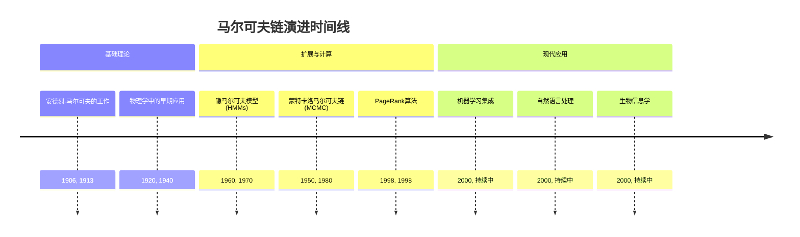
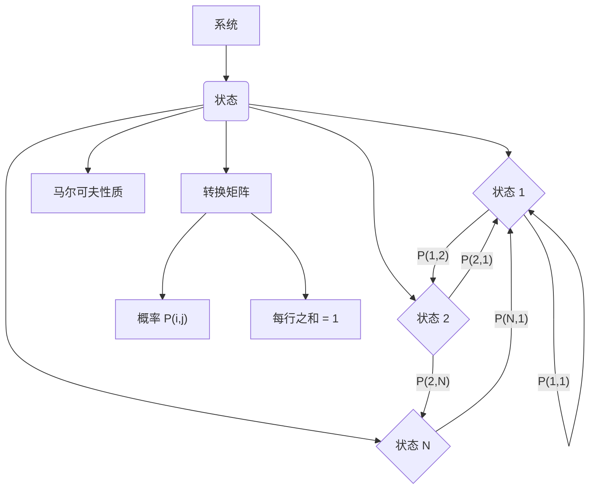
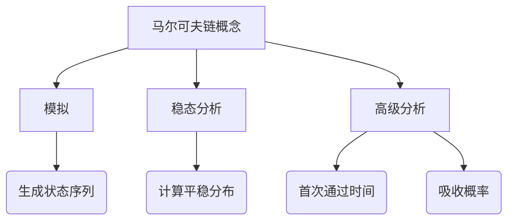
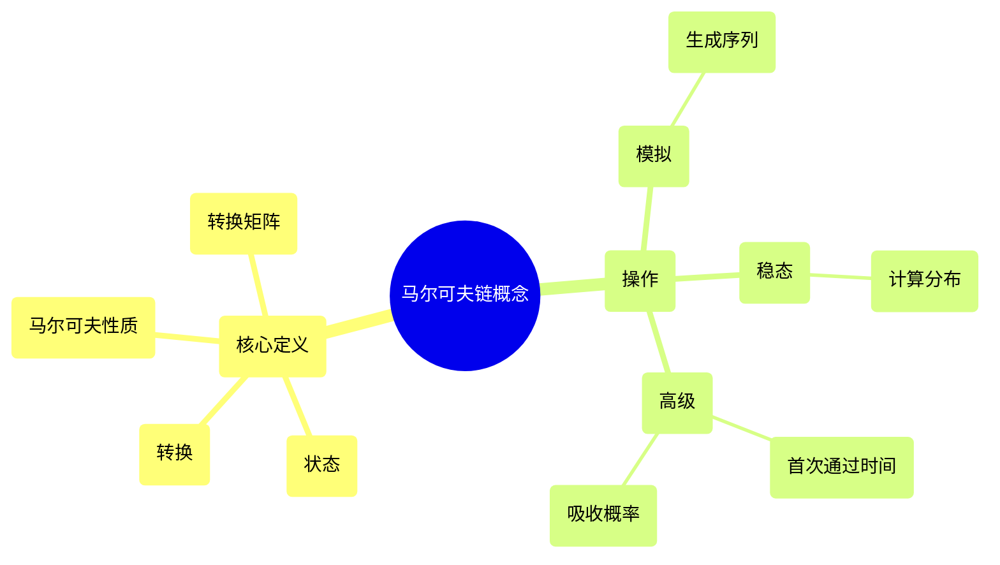

## 马尔可夫链演进文档

### 1. 引言与历史背景

马尔可夫链，以俄罗斯数学家安德烈·马尔可夫命名，是概率论和统计学中的一个基本概念。它们描述了一系列可能的事件，其中每个事件的概率仅取决于前一个事件所达到的状态。这种“无记忆”特性，被称为马尔可夫性质，使其在建模随时间通过一系列状态演变的系统方面非常强大。

它们的应用范围广泛，涵盖物理学、化学、生物学、经济学、计算机科学和自然语言处理等领域。从模拟粒子运动到预测股票价格，从理解基因序列到驱动谷歌的PageRank算法，马尔可夫链为分析序列数据和根据当前状态预测未来行为提供了强大的框架。

### 1.1. 马尔可夫链演进时间线



### 2. 核心概念与架构

马尔可夫链的核心在于其状态以及受概率支配的状态之间的转换。

#### 2.1. 状态与转换

**心智模型/类比：**
想象一个棋盘游戏，你在不同的方格之间移动棋子。每个方格代表一个“状态”（例如，“开始”、“监狱”、“A财产”）。掷骰子决定你“转换”到下一个方格。在马尔可夫链中，你不是掷骰子，而是有概率决定你从当前方格（状态）移动到任何其他方格的可能性。关键是，只有你当前的方格对你的下一步移动很重要，而不是你如何到达当前方格。

*   **状态：** 这些是系统可能的结果或条件。例如，在天气模型中，状态可能是“晴朗”、“多云”或“下雨”。在语言模型中，状态可以是单个单词。
*   **转换：** 这些是从一个状态到另一个状态的移动。每个转换都有一个相关的概率。

#### 2.2. 马尔可夫性质

马尔可夫链的决定性特征是**马尔可夫性质**。它指出系统的未来状态仅取决于其当前状态，而不取决于其之前的事件序列。简而言之，“无记忆性”。

*   **背景：** 移动到下一个状态的概率*仅*取决于当前状态，而不取决于之前访问过的状态历史。
*   **含义：** 这一性质极大地简化了复杂系统的数学分析和建模。

#### 2.3. 转换矩阵

状态之间转换的概率通常组织成一个**转换矩阵**（也称为随机矩阵）。

*   **结构：** 一个方阵，其中每个元素 `P(i, j)` 表示从状态 `i` 移动到状态 `j` 的概率。
*   **属性：**
    *   每个元素 `P(i, j)` 介于 0 和 1 之间（包括 0 和 1）。
    *   每行中概率的总和必须等于 1（因为系统必须从状态 `i` 转换到*某个*状态）。

**Mermaid图：马尔可夫链核心架构**



### 3. 详细API概述（概念性）

虽然马尔可夫链是一个数学概念，但其实际应用涉及计算工具。本节概述了如何使用常见的编程范式和库（例如，NumPy用于矩阵运算，SciPy用于特定算法）与马尔可夫链概念进行交互。

#### 3.1. 模拟马尔可夫链

**目标：** 根据给定的转换矩阵和初始状态生成状态序列。

**概念代码（Python与NumPy）：**
```python
import numpy as np

# 示例：天气模型（晴朗、多云、下雨）
# 转换矩阵 P[i, j] = P(下一个状态是 j | 当前状态是 i)
# 行：当前状态，列：下一个状态
# P = [[P_SS, P_SC, P_SR],
#      [P_CS, P_CC, P_CR],
#      [P_RS, P_RC, P_RR]]
transition_matrix = np.array([
    [0.7, 0.2, 0.1],  # 晴朗 -> 晴朗, 多云, 下雨
    [0.3, 0.4, 0.3],  # 多云 -> 晴朗, 多云, 下雨
    [0.2, 0.3, 0.5]   # 下雨 -> 晴朗, 多云, 下雨
])

states = ["晴朗", "多云", "下雨"]
current_state_index = 0 # 从晴朗开始
simulation_length = 10
simulated_sequence = [states[current_state_index]]

print(f"起始状态: {states[current_state_index]}")

for _ in range(simulation_length - 1):
    # 获取当前状态的概率
    current_state_probabilities = transition_matrix[current_state_index, :]
    
    # 根据这些概率选择下一个状态
    next_state_index = np.random.choice(len(states), p=current_state_probabilities)
    
    simulated_sequence.append(states[next_state_index])
    current_state_index = next_state_index

print(f"模拟序列: {simulated_sequence}")
```

**解释：** 模拟涉及根据当前状态在转换矩阵中定义的概率迭代选择下一个状态。`np.random.choice` 是用于这种概率选择的常用函数。

*   **背景：** 生成马尔可夫链可能随时间采取的状态路径或序列。
*   **参数（概念性）：**
    *   `transition_matrix`：定义状态转换概率的矩阵。
    *   `initial_state`：模拟的起始状态。
    *   `num_steps`：模拟的步数。
*   **返回（概念性）：** 表示访问状态序列的列表或数组。

#### 3.2. 计算稳态分布

**目标：** 找到处于每个状态的长期概率分布，假设马尔可夫链是不可约和非周期的。

**概念代码（Python与NumPy/SciPy）：**
```python
import numpy as np
from scipy.linalg import eig

# 示例转换矩阵（同上）
transition_matrix = np.array([
    [0.7, 0.2, 0.1],
    [0.3, 0.4, 0.3],
    [0.2, 0.3, 0.5]
])

# 对于稳态，我们需要求解 (P^T - I)pi = 0，其中 pi 是稳态向量
# 并且 sum(pi) = 1。
# 这等价于找到 P 对应于特征值 1 的左特征向量。
# 或者，找到 P.T 对应于特征值 1 的右特征向量。

eigenvalues, eigenvectors = eig(transition_matrix.T)

# 找到对应于特征值 1 的特征向量
steady_state_vector = None
for i in range(len(eigenvalues)):
    if np.isclose(eigenvalues[i], 1.0):
        steady_state_vector = eigenvectors[:, i]
        break

if steady_state_vector is not None:
    # 归一化向量，使其元素之和为 1
    steady_state_distribution = steady_state_vector / np.sum(steady_state_vector)
    # 确保实数值（特征向量可能由于数值精度而为复数）
    steady_state_distribution = np.real(steady_state_distribution)
    print(f"稳态分布: {steady_state_distribution}")
    print(f"概率之和: {np.sum(steady_state_distribution):.4f}")
else:
    print("未找到稳态分布（未找到特征值 1）。")

# 对于某些情况的更简单方法：将 P 提升到大幂次
# P_large_power = np.linalg.matrix_power(transition_matrix, 1000)
# print(f"
提升到大幂次的转换矩阵（第一行是稳态）:
{P_large_power[0, :]}")
```

**解释：** 稳态分布 `π` 是一个概率向量，使得 `πP = π`。这意味着如果系统处于稳态分布，它将在一次转换后保持在该分布中。在数学上，它是转换矩阵 `P` 对应于特征值 1 的左特征向量。SciPy 的 `linalg.eig` 等库可用于查找特征向量。

*   **背景：** 确定系统处于每个状态的长期概率。
*   **参数（概念性）：**
    *   `transition_matrix`：定义状态转换概率的矩阵。
    *   `initial_state`：模拟的起始状态。
    *   `num_steps`：模拟的步数。
*   **返回（概念性）：** 一个概率分布（向量），其中每个元素表示处于相应状态的长期概率。

#### 3.3. 快速参考：马尔可夫链操作（概念性）

| 操作 | 描述 | 何时使用 |
| :--- | :--- | :--- |
| **模拟** | 随时间生成状态序列。 | 理解可能的路径，生成样本数据，预测短期行为。 |
| **稳态计算** | 查找长期状态概率。 | 分析长期行为，理解平衡，PageRank类应用。 |
| **首次通过时间** | 计算达到特定状态的预期时间。 | 可靠性分析，排队论，生物建模。 |
| **吸收概率** | 被吸收进特定吸收状态的概率。 | 风险分析，博弈论。 |

#### 3.4. 简化马尔可夫链概念API结构



#### 3.5. API 心智图



### 4. 演进与影响

马尔可夫链的演进以理论进步和实际应用的爆炸式增长为特征。

*   **理论基础：** 安德烈·马尔可夫的初步工作为具有无记忆性质的随机过程奠定了基础。随后的数学家扩展了该理论，产生了遍历性、不可约性和周期性等概念，这些对于理解链的长期行为至关重要。
*   **计算方法：** 开发用于模拟马尔可夫链和计算其稳态分布的有效算法（通常利用NumPy封装的LAPACK等线性代数库）至关重要。20世纪中叶蒙特卡洛马尔可夫链（MCMC）的兴起彻底改变了统计推断，允许从复杂的概率分布中进行采样。
*   **隐马尔可夫模型（HMMs）：** HMMs是一个重要的扩展，允许对底层状态不可直接观察但可以通过可观察输出推断的系统进行建模。这导致了语音识别、生物信息学（例如，基因发现）和自然语言处理方面的突破。
*   **PageRank算法：** 最著名的应用之一，谷歌的PageRank，使用马尔可夫链来模拟随机网络冲浪者的行为，根据到达网页的概率确定网页的重要性。
*   **与机器学习的集成：** 马尔可夫链及其变体（如马尔可夫随机场）是各种机器学习算法不可或缺的一部分，特别是在序列建模、强化学习（例如，马尔可夫决策过程）和图形模型中。

### 5. 结论

马尔可夫链是概率建模持久力量的证明。从其在理论数学中的微不足道的开端，它们已演变为理解和预测几乎所有科学和工程学科中复杂系统不可或缺的工具。其优雅的简洁性，结合其捕捉序列依赖性的深刻能力，确保了它们在日益数据驱动的世界中持续的相关性。
