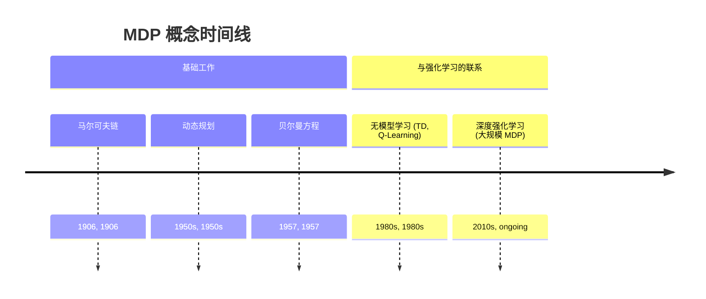
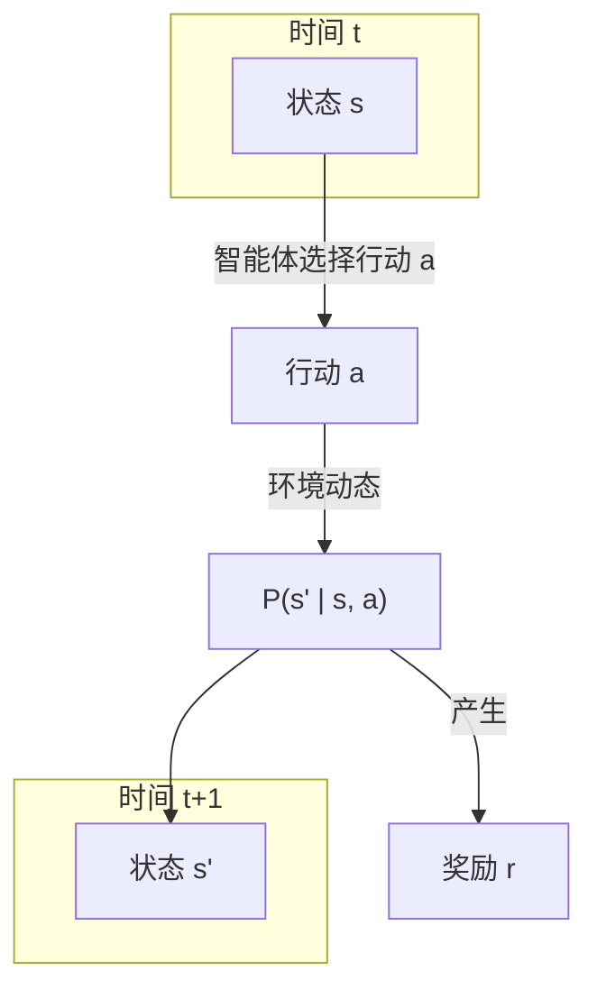

## 马尔可夫决策过程演进文档

### 1. 引言与历史背景

马尔可夫决策过程（MDP）是一个用于在结果部分随机、部分受决策者控制的情况下进行决策建模的数学框架。它为强化学习（RL）提供了形式化的基础。“马尔可夫”属性以俄罗斯数学家安德烈·马尔可夫的名字命名，是其核心假设：它指出，给定现在，未来独立于过去。换句话说，当前状态 `S_t` 捕捉了做出最优决策所需的所有信息；智能体如何到达 `S_t` 的历史是无关紧要的。

MDP 的概念是在 20 世纪 50 年代由理查德·贝尔曼发展的，他引入了**动态规划**和**贝尔曼方程**。这些工具提供了一种在可以建模为 MDP 的系统中求解最优策略的方法。几十年来，MDP 主要用于运筹学、控制理论和经济学等领域，以解决已知模型的问题（即转移概率和奖励函数是给定的）。

随着 20 世纪 80 年代末强化学习的兴起，MDP 与机器学习和人工智能的联系变得日益突出。RL 提供了一种在模型*未知*时解决 MDP 的方法。像 Q-learning 和 TD-learning 这样的算法允许智能体通过与环境的试错交互来学习最优策略，从而有效地隐式学习底层的 MDP 动态。如今，MDP 框架是形式化几乎所有 RL 问题的标准方式，从简单的网格世界到像围棋这样的复杂游戏。

### 1.1. MDP 概念时间线

### 2. MDP 的核心组件

**心智模型 / 类比:**
想象一下玩像“蛇与梯子”这样的棋盘游戏。
*   **智能体 (Agent):** 你就是智能体。
*   **状态 (State, S):** 你在棋盘上的位置就是当前状态。
*   **行动 (Action, A):** 行动就是掷骰子。
*   **转移 (Transition, P):** 游戏规则和随机的骰子点数决定了移动到下一个状态的概率。如果你落在一个梯子上，你会转移到一个更好的状态；如果你落在一个蛇上，你会转移到一个更差的状态。
*   **奖励 (Reward, R):** 每走一步你可能会得到一个小的负奖励（以鼓励快速完成），到达终点时会得到一个大的正奖励。
*   **策略 (Policy, π):** 在这样简单的游戏中，你的策略是固定的（你总是掷骰子）。在像国际象棋这样更复杂的游戏中，你的策略将是你用来决定移动哪个棋子的策略。

MDP 是描述这类游戏的形式化数学框架。强化学习就是学习赢得游戏的最佳策略或政策的过程，即使你最初并不知道所有的规则或蛇与梯子的确切布局。

一个 MDP 被形式化地定义为一个元组 `(S, A, P, R, γ)`。

*   **S (状态):** 一个有限的可能状态集合。状态代表了在特定时间对世界的完整描述。例如，在国际象棋游戏中，状态是棋盘上所有棋子的位置。
*   **A (行动):** 智能体可用的一个有限的可能行动集合。在给定状态 `s` 中，智能体可以选择采取行动 `a`。
*   **P (转移概率函数):** `P(s' | s, a)` 是在状态 `s` 中采取行动 `a` 后转移到状态 `s'` 的概率。这定义了环境的动态。
*   **R (奖励函数):** `R(s, a, s')` 是由于行动 `a` 从状态 `s` 转移到状态 `s'` 后收到的即时奖励。
*   **γ (折扣因子):** `γ` 是一个介于 0 和 1 之间的值，代表折扣因子。它决定了未来奖励的重要性。值为 0 使智能体“短视”（只关心即时奖励），而接近 1 的值使其努力争取长期的高奖励。

智能体的目标是找到一个**策略 (π)**，这是一个函数 `π(a|s)`，指定在状态 `s` 中采取行动 `a` 的概率。目标是找到一个**最优策略 (π*)**，以最大化预期的累积折扣奖励。

**Mermaid 图：MDP 组件与流程**

### 3. 贝尔曼方程：MDP 的核心

由理查德·贝尔曼发展的贝尔曼方程是解决 MDP 的基石。它为状态的价值提供了一个递归定义，将其分解为即时奖励加上下一个状态的折扣价值。

#### 3.1. 价值函数

*   **状态价值函数 (Vπ(s)):** 从状态 `s` 开始并此后遵循策略 `π` 的预期回报。
*   **行动价值函数 (Qπ(s, a)):** 从状态 `s` 开始，采取行动 `a`，并此后遵循策略 `π` 的预期回报。

#### 3.2. 贝尔曼期望方程

该方程计算在给定策略 `π` 下状态 `s` 的价值。它对所有可能的行动和下一个状态进行平均。

`Vπ(s) = Σ_a π(a|s) Σ_{s'} P(s'|s, a) [R(s, a, s') + γVπ(s')]`

它本质上是说：“处于状态 `s` 的价值是，对所有可能的行动求和，即采取该行动的概率乘以你将获得的预期奖励。”

#### 3.3. 贝尔曼最优方程

该方程定义了在*最优*策略 `π*` 下状态 `s` 的价值。它指出，一个状态在最优策略下的价值必须等于从该状态出发的最佳行动的预期回报。

`V*(s) = max_a Σ_{s'} P(s'|s, a) [R(s, a, s') + γV*(s')]`

关键区别在于 `max_a` 算子。它不是对策略的行动进行平均，而是简单地选择单个最佳行动。如果我们能解这个方程，我们就能找到最优策略。

### 4. 解决 MDP

解决 MDP 有两种主要情景：

#### 4.1. 当模型已知时 (规划)

如果转移概率 `P` 和奖励函数 `R` 是已知的，我们可以使用动态规划方法来找到最优策略。

*   **价值迭代:** 一种迭代算法，从一个随机的价值函数开始，并重复应用贝尔曼最优方程来更新价值，直到它们收敛到最优价值 `V*`。
*   **策略迭代:** 一种在两个步骤之间交替的算法：
    1.  **策略评估:** 计算当前策略 `π` 的价值函数 `Vπ`。
    2.  **策略改进:** 通过相对于计算出的价值函数贪婪地行动来改进策略。

#### 4.2. 当模型未知时 (强化学习)

这是人工智能中更常见、更具挑战性的情景。智能体不知道 `P` 或 `R`，必须通过与环境的互动来学习它们。

*   **无模型 RL:** 像 **Q-learning** 和 **SARSA** 这样的算法通过试错直接学习最优行动价值函数 `Q*`，而无需明确学习转移模型 `P`。它们使用智能体的经验（`(s, a, r, s')` 的元组）来迭代更新它们的 Q 值估计，最终收敛到最优值。这是大多数现代 RL 的精髓。

### 5. 实践示例：一个简单的网格世界

考虑一个简单的 2x2 网格世界。
*   **状态 (S):** 四个状态：`(0,0), (0,1), (1,0), (1,1)`。
*   **行动 (A):** `上, 下, 左, 右`。
*   **转移 (P):** 确定性的。采取一个行动会使智能体朝该方向移动一步。如果智能体撞到墙，它会停留在原地。
*   **奖励 (R):** 到达目标状态 `(1,1)` 为 +1，掉入洞 `(1,0)` 为 -1，所有其他转移为 -0.1（以鼓励快速找到目标）。
*   **折扣 (γ):** 0.9。

一个置于此环境中的 RL 智能体最初会采取随机行动。经过许多回合后，它会学到：
1.  在状态 `(0,1)` 中采取行动“右”会导向高奖励状态 `(1,1)`。因此，Q 值 `Q((0,1), right)` 会增加。
2.  在状态 `(0,0)` 中采取行动“下”会导向高惩罚状态 `(1,0)`。因此，Q 值 `Q((0,0), down)` 会减少。

最终，智能体学习到的 Q 值将引导它找到最优策略，即总是采取导向目标状态 `(1,1)` 的行动。

### 6. 结论

马尔可夫决策过程是构建现代强化学习的理论基石。它提供了一种简单而强大的数学语言来描述通过交互学习以实现目标的问题。虽然经典的动态规划方法可以解决已知模型的 MDP，但该框架的真正威力在强化学习中得以实现，智能体可以通过经验学习解决复杂的、未知的 MDP。理解 MDP 的核心组件和贝尔曼方程的逻辑对于任何希望深入研究强化学习理论和实践的人来说都是至关重要的。
