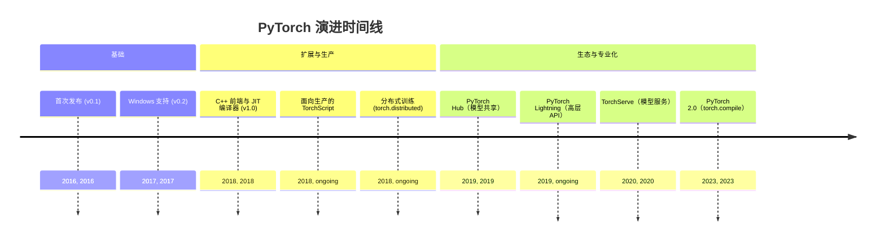
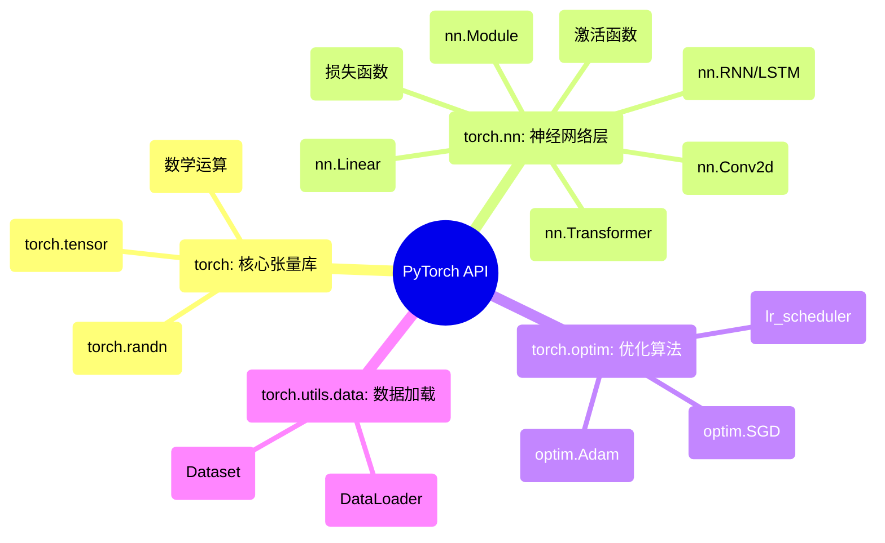

## PyTorch 演进文档

### 1. 引言与历史背景

PyTorch 是一个领先的开源机器学习框架，以其灵活性、易用性和强大的社区支持而闻名。它主要由 Meta AI 开发，因其“Pythonic”的使用体验而备受赞誉，使其成为研究人员和开发者快速原型设计与构建复杂神经网络架构的首选。

PyTorch 的起源可追溯至 **Torch** 框架，该框架于 2002 年首次发布，使用 Lua 编程语言编写。尽管 Torch 功能强大，但 Lua 的使用阻碍了其在以 Python 为主的机器学习社区中的普及。为此，Meta（当时的 Facebook）团队创建了 PyTorch，这是一款以 Python 为优先的深度学习库，将 Torch 的灵活性与 Python 的易用性相结合。

2016 年发布的 PyTorch 首个公开版本是一个转折点。它引入了动态计算图（“边运行边定义”的方法），这与当时如 TensorFlow 等框架使用的静态图有显著不同。这种动态特性使调试更容易，并允许更灵活的模型架构，尤其是在自然语言处理（NLP）领域。

### 1.1. PyTorch 演进时间线



### 2. 核心架构

PyTorch 的架构既旨在灵活地用于研究，又旨在稳健地用于生产。其核心组件协同工作，为从模型定义到训练与部署提供无缝体验。

#### 2.1. 张量（Tensors）

**心智模型 / 类比：**
可以将 **张量（Tensor）** 视为一个超强的多维数组，就像 NumPy 的 `ndarray` 一样。你可以有：
*   **0维张量**（标量）：一个单独的数字，如 `5`。
*   **1维张量**（向量）：一个数字列表，如 `[1, 2, 3]`。
*   **2维张量**（矩阵）：一个数字表格，如 `[[1, 2], [3, 4]]`。
*   **3维张量或更高维**：数字立方体，等等。

关键的超能力是 PyTorch 可以将这些张量移动到 GPU 上进行极快的计算，这对深度学习至关重要。

PyTorch 中的基础数据结构是 **张量**（`torch.Tensor`），在概念上类似于 NumPy 的 `ndarray`。张量是多维数组，可以在 CPU 或 GPU 上运行。能够轻松地将张量移动到 GPU 是 PyTorch 在深度学习领域性能的基石。

#### 2.2. 动态计算图与 Autograd

这是 PyTorch 最具决定性的特征。PyTorch 不预先定义静态的计算图，而是在执行操作时动态构建计算图。这种“边运行边定义”的方法允许动态的模型架构，其中计算结构可在每次迭代中改变。

**`autograd`** 引擎负责自动计算张量操作的梯度（导数）。当以 `requires_grad=True` 创建张量时，PyTorch 会跟踪对其执行的所有操作。当在最终（标量）张量上调用 `.backward()` 时，`autograd` 会沿着计算图反向遍历，并为所有需要梯度的张量计算梯度。

#### 2.3. 模块（`torch.nn`）与优化器（`torch.optim`）

*   **`torch.nn.Module`**：这是所有神经网络模块（例如层、损失函数）的基类。在 PyTorch 中，通过子类化 `nn.Module` 并在 `__init__` 方法中定义层，以及在 `forward` 方法中定义前向传播逻辑来构建模型。
*   **`torch.optim`**：该包提供了广泛的优化算法（如 SGD、Adam、RMSprop），用于根据计算出的梯度更新模型参数。

#### 2.4. JIT 编译器与 TorchScript

尽管动态计算图非常适合研究，但在生产部署方面可能效率较低。为弥合这一差距，PyTorch 引入了 **即时（JIT）编译器** 与 **TorchScript**。TorchScript 是可被 PyTorch JIT 理解与优化的 Python 子集。它允许将动态的 PyTorch 模型转换为静态图表示，从而在无 Python 解释器的高性能环境（如 C++）中运行。PyTorch 2.0 中引入的 **`torch.compile`** 进一步增强了这一点，提供了一个简单函数，将 Python 代码 JIT 编译为优化的内核。

**Mermaid 图：PyTorch 核心架构**


### 3. 详细 API 概述

PyTorch 的 API 组织为一组库，为构建、训练与部署机器学习模型提供工具。

#### 3.1. `torch`：核心张量库

这是主命名空间，提供 `Tensor` 对象以及大量对张量进行操作的数学函数。

##### 3.1.1. 创建张量

**`torch.tensor(data, ...)`**

**目标：** 从现有数据（如 Python 列表或 NumPy 数组）创建 PyTorch 张量。

**代码：**
```python
import torch
import numpy as np

# 从 Python 列表创建
list_data = [[1, 2], [3, 4]]
tensor_from_list = torch.tensor(list_data)
print(f"从列表创建的张量:\n{tensor_from_list}")

# 从 NumPy 数组创建
numpy_array = np.array([5, 6, 7])
tensor_from_numpy = torch.tensor(numpy_array)
print(f"\n从 NumPy 数组创建的张量:\n{tensor_from_numpy}")
```

**预期输出：**
```
从列表创建的张量:
tensor([[1, 2],
        [3, 4]])

从 NumPy 数组创建的张量:
tensor([5, 6, 7])
```

**解释：** `torch.tensor()` 是从现有数据结构创建张量的主要方法。PyTorch 会自动推断数据类型（例如 `torch.int64`、`torch.float32`），但你可以使用 `dtype` 参数指定类型。

*   **`torch.tensor(data, ...)`**：从 Python 列表或 NumPy 数组创建张量。

**`torch.randn(size, ...)`**

**目标：** 创建指定大小的张量，填充来自标准正态分布（均值0，方差1）的随机数。

**代码：**
```python
import torch

# 创建一个 2x3 的随机数张量
random_tensor = torch.randn(2, 3)
print(f"随机 2x3 张量:\n{random_tensor}")
```

**预期输出：**
（2x3 张量，包含随机值，每次运行都会不同）
```
随机 2x3 张量:
tensor([[ 0.1234, -0.5678,  1.2345],
        [-1.5432,  0.8765, -0.2345]])
```

**解释：** 像 `torch.randn()`、`torch.rand()`（均匀分布）和 `torch.ones()` 这样的函数用于创建特定形状的张量而无需手动提供数据。这对于初始化模型权重和其他参数至关重要。

*   **`torch.randn(size, ...)`**：创建包含来自标准正态分布的随机数的张量。

##### 3.1.2. 执行数学运算

**数学运算（`torch.matmul`、`torch.sum`、`torch.sigmoid` 等）**

**目标：** 对张量应用数学函数。

**代码：**
```python
import torch

t1 = torch.tensor([[1., 2.], [3., 4.]])
t2 = torch.tensor([[5., 6.], [7., 8.]])

# 逐元素加法
add_result = t1 + t2
print(f"逐元素加法:\n{add_result}")

# 矩阵乘法
matmul_result = torch.matmul(t1, t2)
print(f"\n矩阵乘法:\n{matmul_result}")

# 应用非线性函数（sigmoid）
sigmoid_result = torch.sigmoid(t1)
print(f"\n对 t1 应用 Sigmoid:\n{sigmoid_result}")
```

**预期输出：**
```
逐元素加法:
tensor([[ 6.,  8.],
        [10., 12.]])

矩阵乘法:
tensor([[19., 22.],
        [43., 50.]])

对 t1 应用 Sigmoid:
tensor([[0.7311, 0.8808],
        [0.9526, 0.9820]])
```

**解释：** PyTorch 提供了一个针对 CPU 和 GPU 高度优化的数学运算综合库。标准 Python 操作符如 `+`、`-`、`*`、`/` 被重载用于逐元素运算，而 `torch.matmul()` 等函数用于特定的线性代数运算。

*   **数学运算**：丰富的函数库，如 `torch.matmul`、`torch.sum`、`torch.sigmoid` 等。

##### 3.1.3. 快速参考：核心张量库

| 函数 | 描述 | 使用时机 |
| :--- | :--- | :--- |
| `torch.tensor()` | 从数据创建张量 | 将现有的 Python 列表或 NumPy 数组转换为张量。 |
| `torch.randn()`, `torch.rand()` | 创建随机张量 | 初始化神经网络中的权重和偏置。 |
| `torch.matmul()`, `+`, `*` | 数学运算 | 在模型中执行线性代数和逐元素计算。 |

#### 3.2. `torch.nn`：神经网络层

该模块提供构建神经网络的积木。

##### 3.2.1. 使用 `nn.Module` 定义模型

**`nn.Module`**

**目标：** 通过定义层和前向传播逻辑来创建自定义神经网络。

**代码：**
```python
import torch
import torch.nn as nn

class SimpleNet(nn.Module):
    def __init__(self):
        super(SimpleNet, self).__init__()
        # 定义层
        self.layer1 = nn.Linear(in_features=10, out_features=32)
        self.activation = nn.ReLU()
        self.layer2 = nn.Linear(in_features=32, out_features=1)

    def forward(self, x):
        # 定义前向传播逻辑
        x = self.layer1(x)
        x = self.activation(x)
        x = self.layer2(x)
        return x

# 实例化模型
model = SimpleNet()
print(model)

# 使用虚拟输入测试
dummy_input = torch.randn(64, 10) # 批量大小 64，10 个特征
output = model(dummy_input)
print(f"\n输出形状: {output.shape}")
```

**预期输出：**
```
SimpleNet(
  (layer1): Linear(in_features=10, out_features=32, bias=True)
  (activation): ReLU()
  (layer2): Linear(in_features=32, out_features=1, bias=True)
)

输出形状: torch.Size([64, 1])
```

**解释：** PyTorch 中的所有自定义模型都应该继承自 `nn.Module`。层通常在 `__init__` 方法中定义，计算逻辑（数据如何通过层流动）在 `forward` 方法中定义。PyTorch 会自动跟踪所有定义层的参数。

*   **`nn.Module`**：所有模型的基类。
*   **各类层**：一套全面的层，包括：
    *   `nn.Linear(in_features, out_features)`：全连接层。
    *   `nn.Conv2d(...)`：用于图像数据的二维卷积层。
    *   `nn.RNN(...)`、`nn.LSTM(...)`：用于序列数据的循环层。
    *   `nn.Transformer(...)`：标准 Transformer 架构。
*   **激活函数**：`nn.ReLU`、`nn.Sigmoid`、`nn.Softmax` 等。

##### 3.2.2. 计算损失

**损失函数（`nn.MSELoss`、`nn.CrossEntropyLoss` 等）**

**目标：** 计算模型预测与真实目标值之间的差异。

**代码：**
```python
import torch
import torch.nn as nn

# 回归任务示例
predictions_reg = torch.randn(10, 1) # 10 个预测值
targets_reg = torch.randn(10, 1) # 10 个真实值
mse_loss_fn = nn.MSELoss()
mse_loss = mse_loss_fn(predictions_reg, targets_reg)
print(f"均方误差 (MSE) 损失: {mse_loss.item()}")

# 分类任务示例（3 个类别）
predictions_cls = torch.randn(10, 3) # 10 个样本，3 个类别
targets_cls = torch.randint(0, 3, (10,)) # 10 个真实类别标签
ce_loss_fn = nn.CrossEntropyLoss()
ce_loss = ce_loss_fn(predictions_cls, targets_cls)
print(f"交叉熵损失: {ce_loss.item()}")
```

**预期输出：**
（损失值每次运行都会不同）
```
均方误差 (MSE) 损失: 2.1345...
交叉熵损失: 1.4567...
```

**解释：** 损失函数对于训练至关重要。它们量化模型的表现如何。`nn.MSELoss`（均方误差）常用于回归，而 `nn.CrossEntropyLoss` 是多类分类的标准。`.item()` 方法用于从单元素张量中提取标量值。

*   **损失函数**：`nn.MSELoss`、`nn.CrossEntropyLoss`、`nn.BCELoss` 等。

##### 3.2.3. 快速参考：神经网络层

| 类/模块 | 描述 | 使用时机 |
| :--- | :--- | :--- |
| `nn.Module` | 所有模型的基类 | 构建任何自定义神经网络的基础。 |
| `nn.Linear`, `nn.Conv2d` 等 | 预定义层 | 作为 `nn.Module` 内的构建块来定义模型架构。 |
| `nn.ReLU`, `nn.Sigmoid` 等 | 激活函数 | 在模型中引入非线性，通常在线性或卷积层之后。 |
| `nn.MSELoss`, `nn.CrossEntropyLoss` | 损失函数 | 在训练期间计算模型预测与真实目标之间的误差。 |

#### 3.3. `torch.optim`：优化算法

该模块包含用于训练模型的优化器。

##### 3.3.1. 更新模型参数

**优化器（`optim.SGD`、`optim.Adam` 等）**

**目标：** 使用优化算法根据计算出的梯度更新模型的参数（权重和偏置）。

**代码：**
```python
import torch
import torch.nn as nn
import torch.optim as optim

# 1. 定义模型
model = nn.Linear(in_features=5, out_features=1)

# 2. 创建优化器，传入模型参数和学习率 (lr)
optimizer = optim.Adam(model.parameters(), lr=0.01)

# --- 单个训练步骤 ---
# 3. 生成一些虚拟数据和损失
input_data = torch.randn(16, 5)
predictions = model(input_data)
loss = predictions.mean() # 虚拟损失

# 4. 清除旧梯度
optimizer.zero_grad()

# 5. 计算当前损失的梯度
loss.backward()

# 6. 更新模型参数
optimizer.step()

print("模型参数已更新一步。")
# 你可以在更新前后检查 model.parameters() 来查看变化
```

**预期输出：**
```
模型参数已更新一步。
```

**解释：** 训练循环涉及以下关键的优化器步骤：
1. `optimizer.zero_grad()`：清除上一步的梯度。
2. `loss.backward()`：计算损失相对于所有模型参数的梯度。
3. `optimizer.step()`：使用计算出的梯度和优化器的逻辑（例如 Adam 的动量）更新参数。

*   **`optim.SGD(params, lr=...)`**：随机梯度下降。
*   **`optim.Adam(params, lr=...)`**：广泛用于深度学习的 Adam 优化器。
*   **`optim.lr_scheduler`**：用于在训练期间调整学习率的子模块。

##### 3.3.2. 快速参考：优化算法

| 类/模块 | 描述 | 使用时机 |
| :--- | :--- | :--- |
| `optim.Adam` | 自适应矩估计优化器 | 一个鲁棒的通用优化器，适用于大多数深度学习任务。 |
| `optim.SGD` | 随机梯度下降 | 基础优化器；通常与动量一起用于训练深度网络。 |
| `optimizer.zero_grad()` | 清除梯度 | 在每个训练步骤开始时防止梯度累积。 |
| `loss.backward()` | 计算梯度 | 在计算损失后为所有参数计算梯度。 |
| `optimizer.step()` | 更新参数 | 在计算梯度后更新模型的权重。 |

#### 3.4. `torch.utils.data`：数据加载与处理

该模块提供创建高效数据加载管道的工具。

##### 3.4.1. 创建自定义数据集

**`Dataset`**

**目标：** 创建自定义数据集类来处理特定的数据格式和结构。

**代码：**
```python
import torch
from torch.utils.data import Dataset

class MyCustomDataset(Dataset):
    def __init__(self, num_samples=100):
        # 在真实场景中，你会在这里从文件加载数据
        self.num_samples = num_samples
        self.features = torch.randn(num_samples, 10) # 100 个样本，每个 10 个特征
        self.labels = torch.randint(0, 2, (num_samples,)) # 100 个标签（0 或 1）

    def __len__(self):
        # 返回数据集中样本的总数
        return self.num_samples

    def __getitem__(self, idx):
        # 返回给定索引处数据集中的一个样本
        return self.features[idx], self.labels[idx]

# 实例化数据集
dataset = MyCustomDataset(num_samples=50)
print(f"数据集长度: {len(dataset)}")

# 获取单个样本
first_sample_features, first_sample_label = dataset[0]
print(f"第一个样本特征形状: {first_sample_features.shape}")
print(f"第一个样本标签: {first_sample_label}")
```

**预期输出：**
```
数据集长度: 50
第一个样本特征形状: torch.Size([10])
第一个样本标签: tensor(0)
```
（标签值每次运行都会不同）

**解释：** 要创建自定义数据集，必须继承自 `torch.utils.data.Dataset` 并实现两个方法：
1. `__len__()`：应返回数据集的总大小。
2. `__getitem__(idx)`：应检索并返回给定索引 `idx` 处的样本（特征和标签）。

*   **`Dataset`**：用于表示数据集的抽象类。用户通过子类化该类创建自定义数据集。

##### 3.4.2. 批量加载数据

**`DataLoader`**

**目标：** 创建一个可迭代对象，自动对 `Dataset` 中的数据进行批处理、随机打乱和并行加载。

**代码：**
```python
import torch
from torch.utils.data import Dataset, DataLoader

# 使用前面示例中的自定义数据集
class MyCustomDataset(Dataset):
    def __init__(self, num_samples=100):
        self.num_samples = num_samples
        self.features = torch.randn(num_samples, 10)
        self.labels = torch.randint(0, 2, (num_samples,))
    def __len__(self):
        return self.num_samples
    def __getitem__(self, idx):
        return self.features[idx], self.labels[idx]

dataset = MyCustomDataset(num_samples=50)

# 创建 DataLoader
# batch_size=16: 以 16 个样本为一批加载数据
# shuffle=True: 在每个 epoch 开始时随机打乱数据
# num_workers > 0: 使用多个子进程并行加载数据
data_loader = DataLoader(dataset, batch_size=16, shuffle=True)

# 遍历 DataLoader
print("遍历 DataLoader 的一个 epoch：")
for batch_idx, (features_batch, labels_batch) in enumerate(data_loader):
    print(f"  批次 {batch_idx+1}:")
    print(f"    特征批次形状: {features_batch.shape}")
    print(f"    标签批次形状: {labels_batch.shape}")
```

**预期输出：**
```
遍历 DataLoader 的一个 epoch：
  批次 1:
    特征批次形状: torch.Size([16, 10])
    标签批次形状: torch.Size([16])
  批次 2:
    特征批次形状: torch.Size([16, 10])
    标签批次形状: torch.Size([16])
  批次 3:
    特征批次形状: torch.Size([16, 10])
    标签批次形状: torch.Size([16])
  批次 4:
    特征批次形状: torch.Size([2, 10])
    标签批次形状: torch.Size([2])
```

**解释：** `DataLoader` 是训练的关键工具。它接受一个 `Dataset` 对象并处理批处理和随机打乱的复杂性。在训练循环中，你直接遍历 `DataLoader` 来获取每个训练步骤的小批量数据。如果样本总数不能被批次大小整除，最后一个批次可能会更小。

*   **`DataLoader`**：包装一个 `Dataset` 并提供对数据集的可迭代对象，具备批处理、随机打乱与并行数据加载等功能。

##### 3.4.3. 快速参考：数据加载与处理

| 类 | 描述 | 使用时机 |
| :--- | :--- | :--- |
| `Dataset` | 自定义数据集的抽象类 | 为特定数据（例如文件夹中的图像、文件中的文本）创建标准化接口。 |
| `DataLoader` | 可迭代的数据加载器 | 在模型训练期间高效地从 `Dataset` 以随机打乱的小批量加载数据。 |

### 3.5. API 思维导图



### 4. 演变与影响

*   **从研究到生产：** PyTorch 的演变一直非常注重弥合研究与生产之间的差距。引入 TorchScript、面向模型服务的 TorchServe 与 C++ 前端，是使 PyTorch 成为生产就绪框架的关键步骤。
*   **动态计算图的兴起：** PyTorch 的"边运行边定义"理念对机器学习领域产生了深远影响，推动了其他框架采用更动态与指令式的方法（例如 TensorFlow 的 Eager Execution）。
*   **编译器优先方法（PyTorch 2.0）：** 随 PyTorch 2.0 与 `torch.compile` 的发布标志着重要的战略转变。它不再要求用户将模型显式转换为静态图格式（如 TorchScript），而是提供了一个可自动优化标准 Python 代码以提升性能的编译器，从而同时提供即时执行的灵活性与编译图的速度。
*   **丰富生态：** PyTorch 的成功孕育了一个蓬勃发展的库生态。诸如 **Hugging Face Transformers**（用于 NLP）、**PyTorch Lightning**（用于高层训练循环）与 **fastai** 等库，使构建最先进的模型更加容易。

### 5. 结论

PyTorch 从根本上改变了机器学习模型的开发方式。其对用户体验、灵活性与"Pythonic"方法的关注，使其成为广大研究者与从业者的首选框架。从一个动态优先的研究工具演变为具备强大编译器与稳健生产故事的综合框架，展现了其成熟度与长远眼光。通过成功将易用性与高性能相结合，PyTorch 继续成为推动人工智能进步的驱动力。

