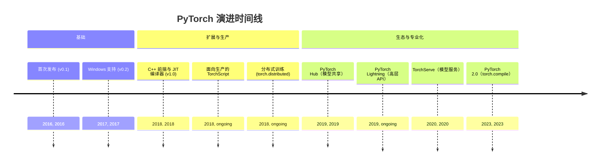
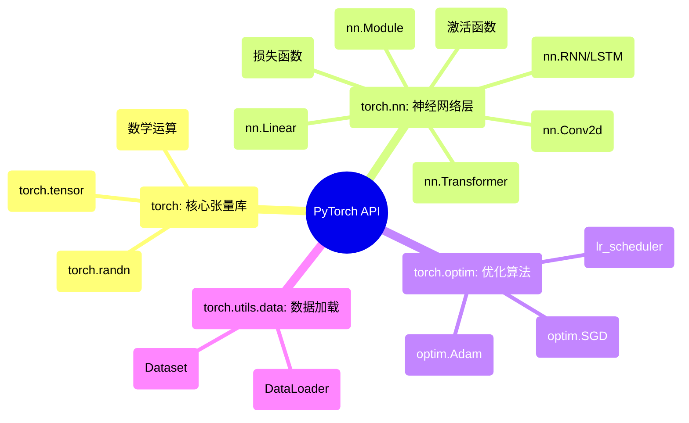

## PyTorch 演进文档

### 1. 引言与历史背景

PyTorch 是一个领先的开源机器学习框架，以其灵活性、易用性和强大的社区支持而闻名。它主要由 Meta AI 开发，因其“Pythonic”的使用体验而备受赞誉，使其成为研究人员和开发者快速原型设计与构建复杂神经网络架构的首选。

PyTorch 的起源可追溯至 **Torch** 框架，该框架于 2002 年首次发布，使用 Lua 编程语言编写。尽管 Torch 功能强大，但 Lua 的使用阻碍了其在以 Python 为主的机器学习社区中的普及。为此，Meta（当时的 Facebook）团队创建了 PyTorch，这是一款以 Python 为优先的深度学习库，将 Torch 的灵活性与 Python 的易用性相结合。

2016 年发布的 PyTorch 首个公开版本是一个转折点。它引入了动态计算图（“边运行边定义”的方法），这与当时如 TensorFlow 等框架使用的静态图有显著不同。这种动态特性使调试更容易，并允许更灵活的模型架构，尤其是在自然语言处理（NLP）领域。

### 1.1. PyTorch 演进时间线



### 2. 核心架构

PyTorch 的架构既旨在灵活地用于研究，又旨在稳健地用于生产。其核心组件协同工作，为从模型定义到训练与部署提供无缝体验。

#### 2.1. 张量（Tensors）

PyTorch 中的基础数据结构是 **张量**（`torch.Tensor`），在概念上类似于 NumPy 的 `ndarray`。张量是多维数组，可以在 CPU 或 GPU 上运行。能够轻松地将张量移动到 GPU 是 PyTorch 在深度学习领域性能的基石。

#### 2.2. 动态计算图与 Autograd

这是 PyTorch 最具决定性的特征。PyTorch 不预先定义静态的计算图，而是在执行操作时动态构建计算图。这种“边运行边定义”的方法允许动态的模型架构，其中计算结构可在每次迭代中改变。

**`autograd`** 引擎负责自动计算张量操作的梯度（导数）。当以 `requires_grad=True` 创建张量时，PyTorch 会跟踪对其执行的所有操作。当在最终（标量）张量上调用 `.backward()` 时，`autograd` 会沿着计算图反向遍历，并为所有需要梯度的张量计算梯度。

#### 2.3. 模块（`torch.nn`）与优化器（`torch.optim`）

*   **`torch.nn.Module`**：这是所有神经网络模块（例如层、损失函数）的基类。在 PyTorch 中，通过子类化 `nn.Module` 并在 `__init__` 方法中定义层，以及在 `forward` 方法中定义前向传播逻辑来构建模型。
*   **`torch.optim`**：该包提供了广泛的优化算法（如 SGD、Adam、RMSprop），用于根据计算出的梯度更新模型参数。

#### 2.4. JIT 编译器与 TorchScript

尽管动态计算图非常适合研究，但在生产部署方面可能效率较低。为弥合这一差距，PyTorch 引入了 **即时（JIT）编译器** 与 **TorchScript**。TorchScript 是可被 PyTorch JIT 理解与优化的 Python 子集。它允许将动态的 PyTorch 模型转换为静态图表示，从而在无 Python 解释器的高性能环境（如 C++）中运行。PyTorch 2.0 中引入的 **`torch.compile`** 进一步增强了这一点，提供了一个简单函数，将 Python 代码 JIT 编译为优化的内核。

**Mermaid 图：PyTorch 核心架构**


### 3. 详细 API 概述

PyTorch 的 API 组织为一组库，为构建、训练与部署机器学习模型提供工具。

#### 3.1. `torch`：核心张量库

这是主命名空间，提供 `Tensor` 对象以及大量对张量进行操作的数学函数。

*   **`torch.tensor(data, ...)`**：从 Python 列表或 NumPy 数组创建张量。
*   **`torch.randn(size, ...)`**：创建包含来自标准正态分布的随机数的张量。
*   **数学运算**：丰富的函数库，如 `torch.matmul`、`torch.sum`、`torch.sigmoid` 等。

#### 3.2. `torch.nn`：神经网络层

该模块提供构建神经网络的积木。

*   **`nn.Module`**：所有模型的基类。
*   **各类层**：一套全面的层，包括：
    *   `nn.Linear(in_features, out_features)`：全连接层。
    *   `nn.Conv2d(...)`：用于图像数据的二维卷积层。
    *   `nn.RNN(...)`、`nn.LSTM(...)`：用于序列数据的循环层。
    *   `nn.Transformer(...)`：标准 Transformer 架构。
*   **激活函数**：`nn.ReLU`、`nn.Sigmoid`、`nn.Softmax` 等。
*   **损失函数**：`nn.MSELoss`、`nn.CrossEntropyLoss`、`nn.BCELoss` 等。

#### 3.3. `torch.optim`：优化算法

该模块包含用于训练模型的优化器。

*   **`optim.SGD(params, lr=...)`**：随机梯度下降。
*   **`optim.Adam(params, lr=...)`**：广泛用于深度学习的 Adam 优化器。
*   **`optim.lr_scheduler`**：用于在训练期间调整学习率的子模块。

#### 3.4. `torch.utils.data`：数据加载与处理

该模块提供创建高效数据加载管道的工具。

*   **`Dataset`**：用于表示数据集的抽象类。用户通过子类化该类创建自定义数据集。
*   **`DataLoader`**：包装一个 `Dataset` 并提供对数据集的可迭代对象，具备批处理、随机打乱与并行数据加载等功能。

### 3.5. API 思维导图



### 4. 演变与影响

*   **从研究到生产：** PyTorch 的演变一直非常注重弥合研究与生产之间的差距。引入 TorchScript、面向模型服务的 TorchServe 与 C++ 前端，是使 PyTorch 成为生产就绪框架的关键步骤。
*   **动态计算图的兴起：** PyTorch 的“边运行边定义”理念对机器学习领域产生了深远影响，推动了其他框架采用更动态与指令式的方法（例如 TensorFlow 的 Eager Execution）。
*   **编译器优先方法（PyTorch 2.0）：** 随 PyTorch 2.0 与 `torch.compile` 的发布标志着重要的战略转变。它不再要求用户将模型显式转换为静态图格式（如 TorchScript），而是提供了一个可自动优化标准 Python 代码以提升性能的编译器，从而同时提供即时执行的灵活性与编译图的速度。
*   **丰富生态：** PyTorch 的成功孕育了一个蓬勃发展的库生态。诸如 **Hugging Face Transformers**（用于 NLP）、**PyTorch Lightning**（用于高层训练循环）与 **fastai** 等库，使构建最先进的模型更加容易。

### 5. 结论

PyTorch 从根本上改变了机器学习模型的开发方式。其对用户体验、灵活性与“Pythonic”方法的关注，使其成为广大研究者与从业者的首选框架。从一个动态优先的研究工具演变为具备强大编译器与稳健生产故事的综合框架，展现了其成熟度与长远眼光。通过成功将易用性与高性能相结合，PyTorch 继续成为推动人工智能进步的驱动力。

### 6. 典型用例

#### 6.1. 基础训练循环

```python
import torch
import torch.nn as nn
import torch.optim as optim

model = nn.Sequential(nn.Linear(10, 64), nn.ReLU(), nn.Linear(64, 1))
opt = optim.Adam(model.parameters(), lr=1e-3)
loss_fn = nn.MSELoss()

x = torch.randn(256, 10)
y = torch.randn(256, 1)

for step in range(200):
    pred = model(x)
    loss = loss_fn(pred, y)
    opt.zero_grad()
    loss.backward()
    opt.step()
```

#### 6.2. Dataset 与 DataLoader

```python
from torch.utils.data import Dataset, DataLoader
import torch

class ToyDataset(Dataset):
    def __init__(self, n=1000):
        self.X = torch.randn(n, 32)
        self.y = (self.X.mean(dim=1) > 0).float()
    def __len__(self):
        return len(self.X)
    def __getitem__(self, idx):
        return self.X[idx], self.y[idx]

ds = ToyDataset()
loader = DataLoader(ds, batch_size=64, shuffle=True)
for xb, yb in loader:
    pass
```

#### 6.3. 保存与加载模型

```python
import torch

torch.save(model.state_dict(), "model.pt")
model.load_state_dict(torch.load("model.pt"))
model.eval()
```