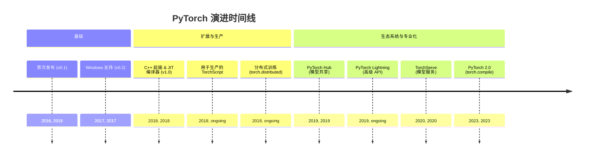
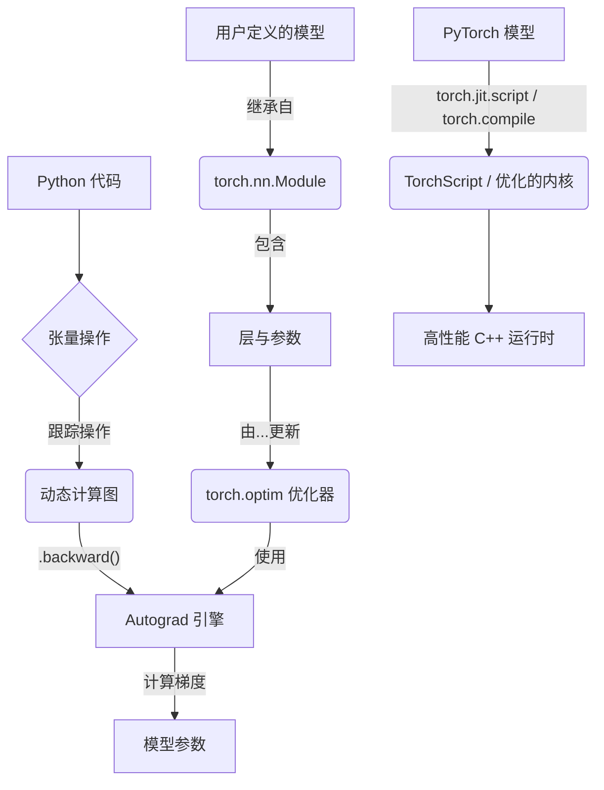
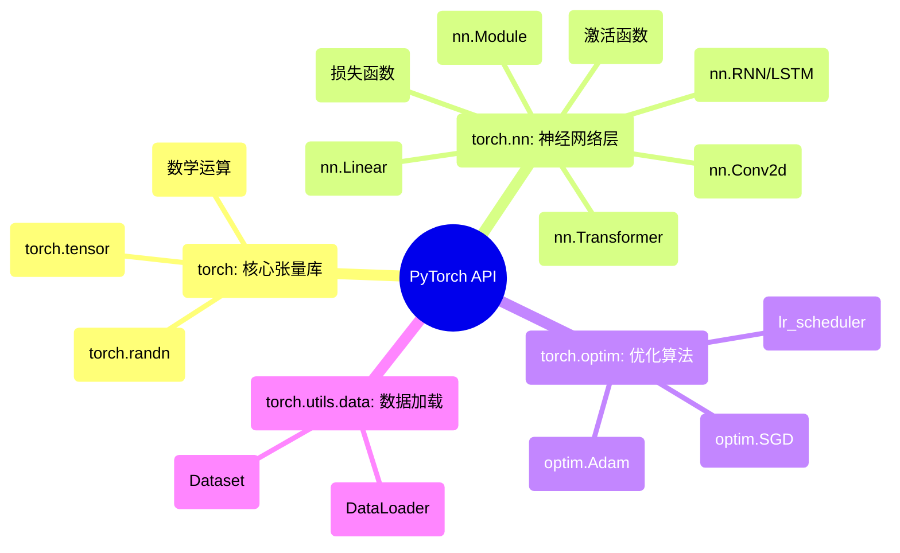

## PyTorch 演进文档

### 1. 引言与历史背景

PyTorch 是一个领先的开源机器学习框架，以其灵活性、易用性和强大的社区支持而闻名。它主要由 Meta AI 开发，并因其“Pythonic”的感觉而备受赞誉，这使其成为研究人员和开发人员快速原型设计和构建复杂神经网络架构的最爱。

PyTorch 的起源可以追溯到 **Torch** 框架，该框架于 2002 年首次发布，使用 Lua 编程语言编写。虽然功能强大，但 Torch 使用 Lua 成为其在以 Python 为主的机器学习社区中普及的障碍。认识到这一点，Meta (当时的 Facebook) 的一个团队创建了 PyTorch，这是一个 Python 优先的深度学习库，它将 Torch 的灵活性与 Python 的易用性相结合。

2016 年 PyTorch 的首次公开发布是一个转折点。它引入了动态计算图 (一种“边运行边定义”的方法)，这与当时 TensorFlow 等框架使用的静态图有很大不同。这种动态特性使调试更容易，并允许更灵活的模型架构，尤其是在自然语言处理 (NLP) 领域。

### 1.1. PyTorch 演进时间线

### 2. 核心架构

PyTorch 的架构旨在既能灵活地用于研究，又能稳健地用于生产。其核心组件协同工作，提供从模型定义到训练和部署的无缝体验。

#### 2.1. 张量 (Tensors)

PyTorch 中的基本数据结构是 **Tensor** (`torch.Tensor`)，它在概念上类似于 NumPy 的 `ndarray`。张量是可以运行在 CPU 或 GPU 上的多维数组。能够毫不费力地将张量移动到 GPU 是 PyTorch 深度学习性能的基石。

#### 2.2. 动态计算图与 Autograd

这是 PyTorch 最具决定性的特征。PyTorch 不是预先定义一个静态的计算图，而是在执行操作时动态构建图。这种“边运行边定义”的方法允许动态模型架构，其中计算的结构可以在每次迭代中改变。

**`autograd`** 引擎负责自动计算张量操作的梯度 (导数)。当一个张量以 `requires_grad=True` 创建时，PyTorch 会跟踪对其执行的所有操作。当在最终 (标量) 张量上调用 `.backward()` 时，`autograd` 会向后遍历计算图，并为所有需要梯度的张量计算梯度。

#### 2.3. 模块 (`torch.nn`) 与优化器 (`torch.optim`)

*   **`torch.nn.Module`:** 这是所有神经网络模块 (例如，层、损失函数) 的基类。在 PyTorch 中，模型是通过子类化 `nn.Module` 并在 `__init__` 方法中定义层，在 `forward` 方法中定义前向传播逻辑来构建的。
*   **`torch.optim`:** 该包提供了广泛的优化算法 (如 SGD、Adam、RMSprop)，用于根据计算出的梯度更新模型的参数。

#### 2.4. JIT 编译器与 TorchScript

虽然动态图非常适合研究，但对于生产部署而言，其效率可能较低。为了弥合这一差距，PyTorch 引入了 **即时 (JIT) 编译器** 和 **TorchScript**。TorchScript 是 Python 的一个子集，可以被 PyTorch JIT 理解和优化。它允许您将动态的 PyTorch 模型转换为静态图表示，该表示可以在没有 Python 解释器的高性能环境 (如 C++) 中运行。PyTorch 2.0 中引入的 **`torch.compile`** 通过提供一个简单的函数将 Python 代码 JIT 编译为优化的内核，进一步增强了这一点。

**Mermaid 图：PyTorch 核心架构**

### 3. 详细 API 概述

PyTorch 的 API 被组织成一组库，为构建、训练和部署机器学习模型提供了工具。

#### 3.1. `torch`: 核心张量库

这是主要的命名空间，提供了 `Tensor` 对象和大量操作张量的数学函数。

*   **`torch.tensor(data, ...)`**: 从 Python 列表或 NumPy 数组创建张量。
*   **`torch.randn(size, ...)`**: 创建一个包含来自标准正态分布的随机数的张量。
*   **数学运算**: 丰富的函数库，如 `torch.matmul`、`torch.sum`、`torch.sigmoid` 等。

#### 3.2. `torch.nn`: 神经网络层

该模块为创建神经网络提供了构建块。

*   **`nn.Module`**: 所有模型的基类。
*   **层**: 一套全面的层，包括：
    *   `nn.Linear(in_features, out_features)`: 全连接层。
    *   `nn.Conv2d(...)`: 用于图像数据的二维卷积层。
    *   `nn.RNN(...)`, `nn.LSTM(...)`: 用于序列数据的循环层。
    *   `nn.Transformer(...)`: 标准的 Transformer 架构。
*   **激活函数**: `nn.ReLU`, `nn.Sigmoid`, `nn.Softmax` 等。
*   **损失函数**: `nn.MSELoss`, `nn.CrossEntropyLoss`, `nn.BCELoss` 等。

#### 3.3. `torch.optim`: 优化算法

该模块包含用于训练模型的优化器。

*   **`optim.SGD(params, lr=...)`**: 随机梯度下降。
*   **`optim.Adam(params, lr=...)`**: Adam 优化器，在深度学习中广泛使用。
*   **`optim.lr_scheduler`**: 用于在训练期间调整学习率的子模块。

#### 3.4. `torch.utils.data`: 数据加载与处理

该模块为创建高效的数据加载管道提供了工具。

*   **`Dataset`**: 用于表示数据集的抽象类。用户通过子类化它来创建自定义数据集。
*   **`DataLoader`**: 包装一个 `Dataset` 并提供一个可迭代的数据集，具有批处理、随机播放和并行数据加载等功能。

### 3.5. API 思维导图

### 4. 演变与影响

*   **从研究到生产:** PyTorch 的演变一直非常注重弥合研究与生产之间的差距。TorchScript、TorchServe (用于模型服务) 和 C++ 前端的引入是使 PyTorch 成为生产就绪框架的关键步骤。
*   **动态图的兴起:** PyTorch 的“边运行边定义”理念对机器学习领域产生了深远影响，推动了其他框架采用更动态和命令式的方法 (例如，TensorFlow 的 Eager Execution)。
*   **编译器优先的方法 (PyTorch 2.0):** PyTorch 2.0 与 `torch.compile` 的发布标志着一个重大的战略转变。它不再要求用户将模型显式转换为静态图格式 (如 TorchScript)，而是提供了一个可以自动优化标准 Python 代码以提高性能的编译器，从而提供了两全其美的方案：即时执行的灵活性和编译图的速度。
*   **丰富的生态系统:** PyTorch 的成功催生了一个蓬勃发展的库生态系统。**Hugging Face Transformers** (用于 NLP)、**PyTorch Lightning** (用于高级训练循环) 和 **fastai** 等库使得构建最先进的模型变得更加容易。

### 5. 结论

PyTorch 从根本上改变了机器学习模型的开发方式。它对用户体验、灵活性和“Pythonic”方法的关注使其成为广大研究人员和从业者首选的框架。从一个动态优先的研究工具演变为一个具有强大编译器和稳健生产故事的综合框架，展示了其成熟度和长远眼光。通过成功地将易用性与高性能相结合，PyTorch 继续成为推动人工智能进步的驱动力。
