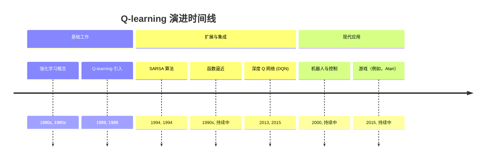
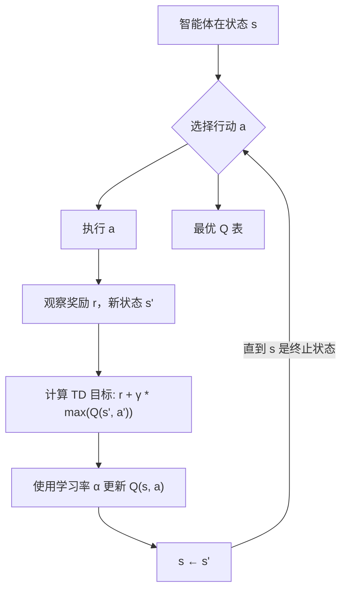
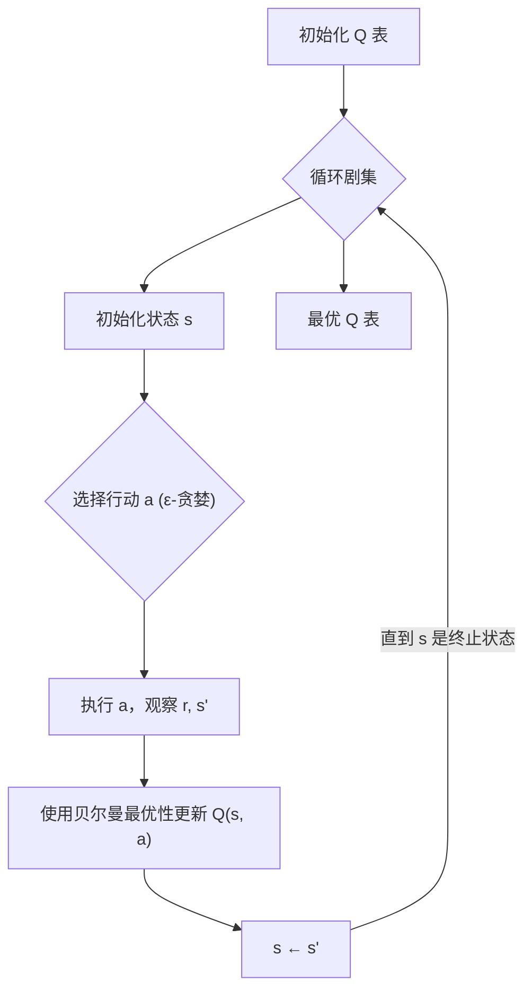

## Q-learning 演进文档

### 1. 引言与历史背景

Q-learning 是一种无模型强化学习算法。它是一种价值迭代算法，可以在不需要环境动力学模型的情况下学习特定状态下行动的质量。简而言之，Q-learning 智能体通过试错学习做出最优决策，观察其在不同情况下行动的后果（奖励）。

Q-learning 由 Christopher Watkins 于 1989 年开发，是强化学习领域的一个重大突破，因为它允许智能体即使在环境的转换概率和奖励函数未知的情况下也能学习最优策略。这种“无模型”特性使其高度适用于现实世界中通常无法获得或过于复杂而无法明确建模的环境问题。

Q-learning 的影响是深远的，它作为许多后续强化学习进展的基础算法，包括将 Q-learning 与深度神经网络结合以处理高维状态空间的深度 Q 网络（DQN）。它仍然是理解和实现基本强化学习智能体的基石。

### 1.1. Q-learning 演进时间线



### 2. 核心概念与架构

Q-learning 的核心围绕着 Q 表（或 Q 函数）和用于最优化的贝尔曼方程。

#### 2.1. Q 表 / Q 函数

**心智模型/类比：**
想象你正在尝试穿越一个迷宫。对于迷宫中的每个交叉口（状态），你都有一个心理记分卡。在这张记分卡上，对于你可以走的每个可能方向（行动），你都写下了一个“质量分数”（Q 值），表示该方向有多好。最初，所有分数都为零。当你探索迷宫时，你会根据路径是否带来奖励（如奶酪）或惩罚（如死胡同）来更新这些分数。随着时间的推移，你的记分卡成为穿越迷宫的最佳路径的可靠指南。

*   **Q 表：** 一个存储每个可能的状态-行动对 `(s, a)` 的 Q 值的表格。每个条目 `Q(s, a)` 表示在状态 `s` 中采取行动 `a` 并随后遵循最优策略的预期未来奖励。
*   **Q 函数：** 当状态空间太大而无法用表格表示时，使用函数逼近器（例如，神经网络）来估计 `Q(s, a)`。

#### 2.2. Q-learning 更新规则

Q-learning 的核心是它如何根据经验更新其 Q 值。智能体与环境交互，在状态 `s` 中采取行动 `a`，观察奖励 `r`，并转换到新状态 `s'`。

$Q(s, a) \leftarrow Q(s, a) + \alpha [r + \gamma \max_{a'} Q(s', a') - Q(s, a)]$

*   **`Q(s, a)`：** 状态-行动对的当前估计 Q 值。
*   **`α` (学习率)：** 一个介于 0 和 1 之间的值，它决定了新信息覆盖旧信息的程度。高 `α` 意味着智能体学习速度快但可能不稳定；低 `α` 意味着学习速度慢但更稳定。
*   **`r` (奖励)：** 在状态 `s` 中采取行动 `a` 并转换到 `s'` 后获得的即时奖励。
*   **`γ` (折扣因子)：** 一个介于 0 和 1 之间的值，它折扣未来奖励。它决定了未来奖励的重要性。值为 0 使智能体“短视”；值接近 1 使其追求长期高奖励。
*   **`max_{a'} Q(s', a')`：** *下一个状态* `s'` 的最大 Q 值，考虑从 `s'` 的所有可能行动 `a'`。这是与 SARSA 的关键区别，因为 Q-learning 是一种*离策略*算法——它学习最优策略的价值，而不管所遵循的策略是什么。
*   **`[r + γ max_{a'} Q(s', a') - Q(s, a)]`：** 整个项是“时间差分（TD）误差”。它表示 Q 值的新、更准确的估计（目标：`r + γ max_{a'} Q(s', a')`）与旧估计（`Q(s, a)`）之间的差异。

**Mermaid图：Q-learning 更新流程**



### 3. 详细API概述（概念性）

Q-learning 是一种算法，而不是具有直接 API 的库。但是，它的实现通常涉及 Q 表的数据结构以及更新规则和行动选择的函数。NumPy 等库通常用于数值运算。

#### 3.1. Q 表初始化

**目标：** 创建并初始化 Q 表，其中包含零或小的随机值。

**概念代码（Python与NumPy）：**
```python
import numpy as np

num_states = 10
num_actions = 4

# 使用零初始化 Q 表
q_table = np.zeros((num_states, num_actions))
print("已初始化 Q 表（前 5 行）:")
print(q_table[:5, :])

# 或者，使用小的随机值初始化
q_table_random = np.random.uniform(low=-1, high=1, size=(num_states, num_actions))
print("\n已初始化 Q 表（随机，前 5 行）:")
print(q_table_random[:5, :])
```

**解释：** 用零初始化很常见，这意味着没有关于行动价值的先验知识。随机初始化有助于探索。

*   **背景：** 设置存储 Q 值的数据结构。
*   **参数（概念性）：**
    *   `num_states`：环境中的总状态数。
    *   `num_actions`：智能体可用的总行动数。
*   **返回（概念性）：** 一个表示 Q 表的 2D NumPy 数组。

#### 3.2. 行动选择（探索与利用）

**目标：** 根据当前的 Q 值选择一个行动，平衡探索（尝试新事物）和利用（使用已知的好行动）。

**概念代码（Python）：**
```python
import numpy as np

def choose_action(state, q_table, epsilon):
    if np.random.uniform(0, 1) < epsilon: # 探索
        action = np.random.randint(q_table.shape[1])
    else: # 利用
        action = np.argmax(q_table[state, :])
    return action

# 示例用法
num_states = 10
num_actions = 4
q_table = np.zeros((num_states, num_actions))
current_state = 0
epsilon = 0.1 # 10% 的探索机会

selected_action = choose_action(current_state, q_table, epsilon)
print(f"状态 {current_state} 在 epsilon {epsilon} 下选择的行动: {selected_action}")

epsilon = 0.9 # 90% 的探索机会
selected_action_explore = choose_action(current_state, q_table, epsilon)
print(f"状态 {current_state} 在 epsilon {epsilon} 下选择的行动: {selected_action_explore}")
```

**解释：** ε-贪婪策略是一种常见的策略。以概率 `ε`，智能体通过选择随机行动进行探索。以概率 `1-ε`，它通过选择当前状态下 Q 值最高的行动进行利用。

*   **背景：** 智能体如何决定在给定状态下采取哪个行动。
*   **参数（概念性）：**
    *   `state`：智能体的当前状态。
    *   `q_table`：当前的 Q 表。
    *   `epsilon`：探索率（用于 ε-贪婪策略）。
*   **返回（概念性）：** 所选的行动。

#### 3.3. Q 值更新

**目标：** 在每次与环境交互后应用 Q-learning 更新规则。

**概念代码（Python）：**
```python
import numpy as np

def update_q_value(q_table, state, action, reward, next_state, learning_rate, discount_factor):
    # Q(s, a) ← Q(s, a) + α [r + γ max_{a'} Q(s', a') - Q(s, a)]
    old_q_value = q_table[state, action]
    max_future_q = np.max(q_table[next_state, :])
    
    new_q_value = old_q_value + learning_rate * (reward + discount_factor * max_future_q - old_q_value)
    q_table[state, action] = new_q_value
    return q_table

# 示例用法
num_states = 3
num_actions = 2
q_table = np.array([[0., 0.], [0., 0.], [0., 0.]])

state = 0
action = 0
reward = 1
next_state = 1
learning_rate = 0.1
discount_factor = 0.9

print(f"更新前的 Q 表:\n{q_table}")
updated_q_table = update_q_value(q_table, state, action, reward, next_state, learning_rate, discount_factor)
print(f"\n更新后的 Q 表:\n{updated_q_table}")
```

**解释：** 此函数直接实现 Q-learning 更新规则，从智能体的经验和算法的超参数中获取必要的参数。

*   **背景：** Q-learning 算法的核心学习步骤。
*   **参数（概念性）：**
    *   `q_table`：当前的 Q 表。
    *   `state`：采取行动的状态 `s`。
    *   `action`：采取的行动 `a`。
    *   `reward`：收到的即时奖励 `r`。
    *   `next_state`：结果状态 `s'`。
    *   `learning_rate`：学习率 `α`。
    *   `discount_factor`：折扣因子 `γ`。
*   **返回（概念性）：** 更新后的 Q 表。

### 3.4. 快速参考：Q-learning 组件（概念性）

| 组件 | 描述 | 何时使用 |
| :--- | :--- | :--- |
| **Q 表/Q 函数** | 存储状态-行动对的预期未来奖励。 | 当状态-行动空间可管理（表格）或复杂（函数逼近器）时。 |
| **行动选择（ε-贪婪）** | 平衡探索和利用。 | 在训练期间，确保智能体发现最优路径，同时利用已知的好行动。 |
| **更新规则** | 根据经验迭代细化 Q 值。 | 在每次与环境交互后。 |

**Mermaid图：简化 Q-learning 过程**



### 4. 演进与影响

Q-learning 的演进以其适应性和在强化学习中扮演的基础角色为标志：

*   **无模型学习：** 它无需环境的显式模型即可学习的能力是革命性的，将强化学习应用于更广泛的现实世界问题。
*   **离策略学习：** 作为一种离策略算法（在遵循不同但通常是探索性策略的同时学习最优策略）是一个强大的功能，可以实现高效的数据重用和鲁棒学习。
*   **函数逼近：** Q-learning 与函数逼近器（如线性模型和后来的神经网络）的集成使其能够扩展到具有连续或非常大的状态空间的问题，超越了简单的表格表示。
*   **深度 Q 网络（DQN）：** Q-learning 与深度神经网络在 DQN 中的结合（例如，从原始像素数据玩 Atari 游戏）展示了深度强化学习的巨大潜力，并引发了新一轮的研究。
*   **高级算法的基础：** 许多高级 RL 算法，如 Double Q-learning、Dueling DQN 和 Rainbow DQN，都直接建立在 Q-learning 的原理之上，解决了其局限性并提高了其性能。

### 5. 结论

Q-learning 是强化学习史上一个关键的算法。其优雅的简洁性，结合其无模型和离策略的特性，使其成为智能体通过与环境直接交互学习最优行为的强大工具。从其诞生之初，它不仅解决了具有挑战性的问题，而且为深度强化学习革命奠定了基础，至今仍在影响尖端人工智能系统的发展。理解 Q-learning 对于掌握基于价值的强化学习的核心概念至关重要。
