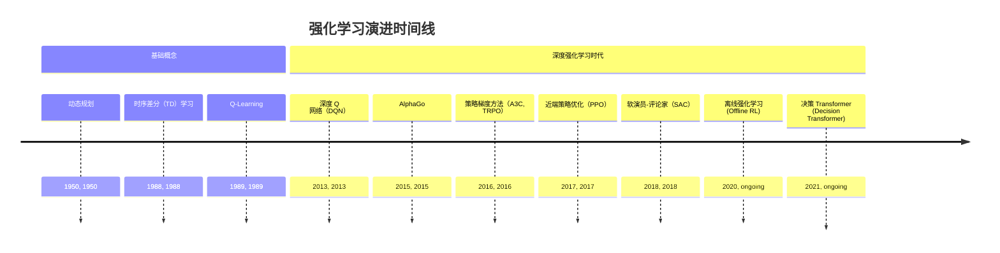
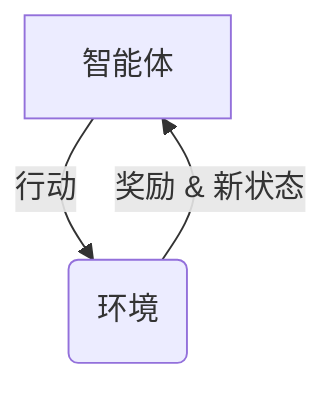
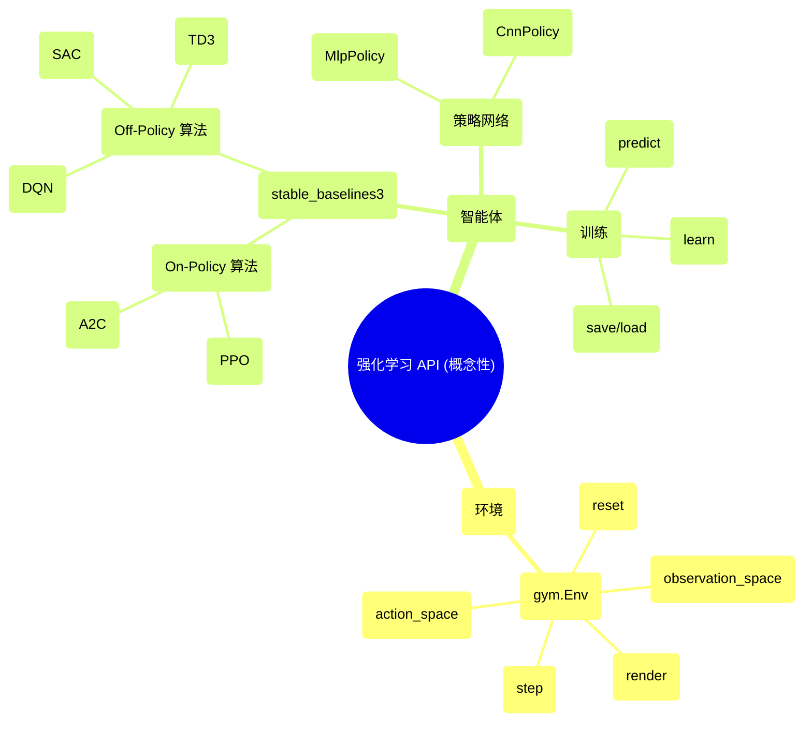

## 强化学习演进文档

### 1. 引言与历史背景

强化学习（RL）是机器学习的一个分支，研究智能体如何在环境中采取行动以最大化累积奖励。它是机器学习的三大基本范式之一，与监督学习和无监督学习并列。RL 与监督学习的不同之处在于，它不需要标记的输入/输出对，也不需要明确纠正次优行为。相反，它的重点是在探索（未知领域）和利用（现有知识）之间找到平衡。

RL 的思想根源可以追溯到动物学习心理学和动力系统优化控制。现代 RL 领域出现于 20 世纪 80 年代，建立在试错学习和动态规划思想的基础上。早期的突破包括**时序差分（TD）学习**的发展，它允许模型在没有环境动态模型的情况下从原始经验中学习；以及 **Q-learning**，一种无模型的 RL 算法，可以为任何给定的有限马尔可夫决策过程（MDP）找到最优的行动选择策略。

近十年来，RL 出现了戏剧性的复兴，这在很大程度上是由其与深度学习的结合推动的。这种被称为**深度强化学习（DRL）**的融合，使 RL 算法能够扩展到以前难以解决的高维状态和行动空间问题。一个里程碑式的成就是 2015 年，DeepMind 的 **AlphaGo**，一个由 DRL 驱动的系统，击败了人类职业围棋选手，这一壮举以前被认为需要几十年才能实现。这一事件，以及在机器人、游戏和资源管理方面的成功，巩固了 RL 作为现代人工智能关键支柱的地位。

### 1.1. 强化学习演进时间线



### 2. 核心架构

RL 的核心是**智能体**与**环境**之间的交互。智能体采取**行动**，改变环境的**状态**。环境反过来为智能体提供**奖励**（或惩罚）和新的状态。智能体的目标是学习一个**策略**——一个从状态到行动的映射——以最大化其随时间推移的累积奖励。

#### 2.1. 关键概念

*   **智能体 (Agent):** 学习者或决策者。
*   **环境 (Environment):** 智能体与之交互的外部系统。
*   **状态 (State, S):** 环境状态的完整描述。
*   **行动 (Action, A):** 智能体可以采取的可能行动之一。
*   **奖励 (Reward, R):** 智能体在某个状态下采取行动后从环境收到的即时信号。
*   **策略 (Policy, π):** 智能体的策略或行为函数，将状态映射到行动。
*   **价值函数 (Value Function, V or Q):** 对预期未来奖励的预测。状态的价值函数 V(s) 是从状态 s 开始的预期累积奖励。行动价值函数 Q(s, a) 是在状态 s 中采取行动 a 的预期累积奖励。
*   **模型 (Model, Optional):** 智能体对环境的表示，预测环境接下来会做什么。

**Mermaid 图：RL 交互循环**



#### 2.2. 基于价值与基于策略的方法

RL 算法大致可分为两种主要类型：

*   **基于价值的方法 (Value-Based Methods):** 这些方法学习一个价值函数，该函数估计每个状态或状态-行动对的预期回报。然后从该价值函数中隐式地导出策略（例如，总是选择具有最高价值的行动）。**Q-learning** 和 **DQN** 是突出的例子。
*   **基于策略的方法 (Policy-Based Methods):** 这些方法直接学习将状态映射到行动的策略函数。它们在高维或连续行动空间中通常更有效。**REINFORCE** 和 **PPO** 是基于策略的方法的例子。
*   **演员-评论家方法 (Actor-Critic Methods):** 这些方法结合了基于价值和基于策略的方法的优点。它们使用两个模型：一个学习策略的**演员 (actor)**，以及一个学习价值函数以评价演员策略的**评论家 (critic)**。**A2C/A3C** 和 **SAC** 是流行的演员-评论家算法。

### 3. 详细 API 概述（概念性）

RL 通常使用 **Stable Baselines3**、**RLlib** 或 **Tianshou** 等库来实现，这些库建立在 PyTorch 和 TensorFlow 等深度学习框架之上。这里的“API”指的是在这些库中用于定义和训练 RL 智能体的通用组件和模式。

#### 3.1. 核心 RL 组件

##### 3.1.1. 环境 (例如, `gym.Env`)

**目标：** 定义 RL 智能体操作的世界。

**代码 (概念性 - Gymnasium):**
```python
import gymnasium as gym

# 创建一个经典的控制环境
env = gym.make("CartPole-v1")

# 重置环境以获取初始状态
observation, info = env.reset()

for _ in range(100):
    action = env.action_space.sample()  # 采取随机行动
    observation, reward, terminated, truncated, info = env.step(action)

    if terminated or truncated:
        observation, info = env.reset()

env.close()
```

**解释:**
*   `gym.make(id)`: 创建一个环境实例。
*   `reset()`: 将环境重置为初始状态并返回初始观察值。
*   `step(action)`: 采取一个行动并返回新的观察值、奖励以及回合是否终止。
*   `action_space`: 可能的行动空间。
*   `observation_space`: 可能的观察空间。

*   **上下文:** RL 环境的基本接口，由 OpenAI 的 Gym（现在维护为 Gymnasium）标准化。
*   **常用方法:**
    *   `reset()`: 重置环境。
    *   `step(action)`: 执行一个时间步。
    *   `render()`: 渲染环境。
*   **常用属性:**
    *   `action_space`: 有效行动的空间。
    *   `observation_space`: 有效观察的空间。

##### 3.1.2. 智能体/策略 (例如, `stable_baselines3.PPO`)

**目标：** 定义 RL 智能体及其策略。

**代码 (概念性 - Stable Baselines3):**
```python
from stable_baselines3 import PPO
import gymnasium as gym

# 创建环境
env = gym.make("CartPole-v1")

# 实例化智能体
model = PPO("MlpPolicy", env, verbose=1)

# 训练智能体
model.learn(total_timesteps=10000)

# 评估训练好的智能体
obs, info = env.reset()
for _ in range(1000):
    action, _states = model.predict(obs, deterministic=True)
    obs, reward, terminated, truncated, info = env.step(action)
    if terminated or truncated:
        obs, info = env.reset()

env.close()
```

**解释:**
*   `PPO("MlpPolicy", env)`: 为给定环境创建一个具有多层感知器（MLP）策略的 PPO 智能体。
*   `learn(total_timesteps)`: 训练智能体指定的步数。
*   `predict(observation)`: 从学习到的策略中为给定的观察值获取行动。

*   **上下文:** 封装特定 RL 算法逻辑的高级类。
*   **常用方法:**
    *   `learn()`: 训练智能体。
    *   `predict()`: 推断最佳行动。
    *   `save()` / `load()`: 保存和加载训练好的模型。

##### 3.1.3. 快速参考：核心 RL 组件

| 组件 | 描述 | 关键方法/属性 |
| :--- | :--- | :--- |
| `环境` | 智能体与之交互的世界 | `reset()`, `step()`, `action_space` |
| `智能体/策略` | 学习者和决策者 | `learn()`, `predict()` |

#### 3.2. API 思维导图



### 4. 架构权衡

不同的 RL 算法在样本效率、稳定性和计算成本方面有不同的权衡。

#### 4.1. On-Policy vs. Off-Policy

*   **On-Policy (同策略):** 智能体从其当前策略生成的数据中学习。
    *   **优点:** 更稳定可靠。
    *   **缺点:** 样本效率较低，因为每次策略更新后都会丢弃数据。
    *   **例子:** PPO, A2C。
*   **Off-Policy (异策略):** 智能体可以从不同策略生成的数据中学习（例如，从过去经验的回放缓冲区中）。
    *   **优点:** 样本效率更高。
    *   **缺点:** 可能不太稳定。
    *   **例子:** DQN, SAC, TD3。

#### 4.2. 无模型 vs. 基于模型

*   **无模型 (Model-Free):** 智能体直接从经验中学习策略或价值函数，而不建立环境模型。
    *   **优点:** 更简单、更灵活。
    *   **缺点:** 可能非常样本效率低下。
    *   **例子:** 大多数流行的 DRL 算法，如 DQN, PPO, SAC。
*   **基于模型 (Model-Based):** 智能体学习环境动态的模型，然后使用该模型进行规划（例如，通过模拟未来的轨迹）。
    *   **优点:** 样本效率可能高得多。
    *   **缺点:** 性能受限于学习模型的准确性。

#### 4.3. 新兴范式

近年来，新的方法论正在重塑 RL 的格局。

*   **离线强化学习 (Offline Reinforcement Learning):** 该范式专注于从大量预先收集的环境交互数据集中学习策略，而无需任何主动探索。
    *   **优点:** 使得在实时交互成本高昂、危险或不切实际的领域（如医疗保健、自动驾驶）中应用 RL 成为可能。它利用现有数据来学习策略。
    *   **缺点:** 面临“分布偏移”的挑战，即学习到的策略可能会因为遇到静态数据集中未充分代表的状态而表现不佳。
*   **将 RL 视为序列建模问题 (决策 Transformer):** 这种方法将 RL 重新定义为一个条件序列建模任务。它不是学习策略或价值函数，而是训练一个基于 Transformer 的模型来处理轨迹（状态、行动和奖励的序列），以预测能实现期望回报的未来行动。
    *   **优点:** 利用了 Transformer 架构的强大功能和可扩展性。它可以使用监督学习技术来解决 RL 问题，这些技术通常更稳定且易于理解。
    *   **缺点:** 在在线设置中，样本效率可能不如传统的无模型方法。
*   **大规模通用智能体:** 受 NLP 和视觉领域基础模型的启发，这一趋势专注于在大量多样化的数据上训练大型、多任务模型。这些“通用智能体”（如 DeepMind 的 Gato）可以被提示执行各种任务，而无需针对特定任务进行微调。
    *   **优点:** 旨在创建一个单一、多功能的智能体，能够即时适应新任务，这是迈向通用人工智能的关键一步。
    *   **缺点:** 需要巨大的计算资源和数据。其泛化能力仍是一个活跃的研究领域。

### 5. 实际应用与用例

RL 已成功应用于各种复杂的决策问题。

*   **游戏:** 在围棋（AlphaGo）、星际争霸 II（AlphaStar）和 Dota 2（OpenAI Five）等游戏中实现超人表现。
*   **机器人:** 训练机器人执行复杂的操纵任务、运动和导航。
*   **自动驾驶:** 优化自动驾驶汽车的驾驶策略。
*   **资源管理:** 管理数据中心、通信网络和供应链中的资源。
*   **推荐系统:** 个性化向用户推荐，以最大化长期参与度。

### 6. 完整代码示例 (使用 PPO 的 CartPole)

此示例使用 Stable Baselines3 在经典的 CartPole 环境上训练 PPO 智能体。

```python
import gymnasium as gym
from stable_baselines3 import PPO
from stable_baselines3.common.evaluation import evaluate_policy

# 1. 创建 CartPole 环境
env = gym.make("CartPole-v1")

# 2. 实例化 PPO 智能体
# "MlpPolicy" 表示策略网络是多层感知器
model = PPO("MlpPolicy", env, verbose=1)

# 3. 训练智能体 10,000 步
model.learn(total_timesteps=10000)

# 4. 评估训练好的智能体
mean_reward, std_reward = evaluate_policy(model, env, n_eval_episodes=100)
print(f"平均奖励: {mean_reward:.2f} +/- {std_reward:.2f}")

# 5. 体验训练好的智能体
obs, info = env.reset()
for i in range(1000):
    action, _states = model.predict(obs, deterministic=True)
    obs, reward, terminated, truncated, info = env.step(action)
    env.render()
    if terminated or truncated:
        obs, info = env.reset()

env.close()
```

### 7. 演进与影响

RL 的演进标志着从小型、离散问题上的表格方法到能够处理高维、连续状态和行动空间的基于深度学习的方法的转变。

*   **深度强化学习:** RL 与深度神经网络的结合是近期进展的关键驱动力，使 RL 能够应用于复杂的现实世界问题。
*   **算法创新:** 更稳定、样本效率更高的算法（如 PPO 和 SAC）的发展使 RL 更加实用和易于使用。
*   **标准化和库:** 标准化环境（Gym/Gymnasium）和易于使用的库（Stable Baselines3, RLlib）的创建，使 RL 民主化并加速了研究。
*   **从模拟到现实世界:** 当前研究的一个主要焦点是弥合“模拟到现实”的差距，使在模拟中训练的策略能够有效地部署在现实世界的机器人和系统上。
*   **新兴范式:** 该领域目前正在经历另一次转变，**离线 RL** 的兴起使得从静态数据集中学习成为可能，而像 **决策 Transformer** 这样的架构则将 RL 重新定义为序列建模问题。这种与深度学习其他领域的融合，为能够执行各种任务的**大规模通用智能体**铺平了道路。

### 8. 结论

强化学习为解决顺序决策问题提供了一个强大的框架。从其在动态规划中的理论基础到深度强化学习的最新突破，该领域取得了显著的进展。随着算法变得越来越强大和样本效率越来越高，以及模拟环境变得越来越逼真，RL 有望在解决人工智能和自动化领域一些最具挑战性的问题中发挥越来越重要的作用。
