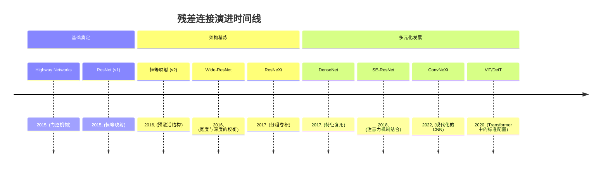
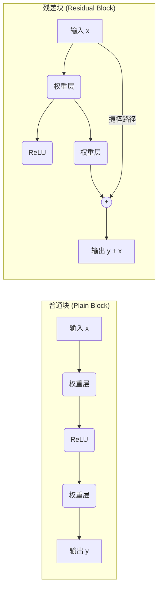
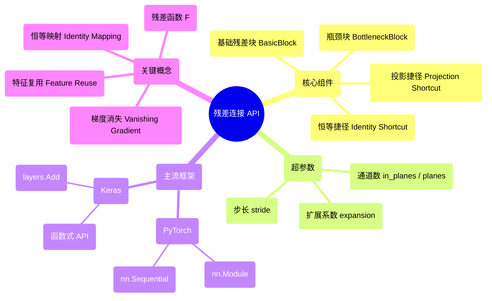

## 残差连接 (Residual Connection) 演进文档

### 1. 引言与历史背景

残差连接（Residual Connections），也称为跳跃连接（skip connections）或捷径连接（shortcut connections），是深度学习中的一项基本架构创新，它使训练极深层次的神经网络成为可能。由何恺明等人在 2015 年的里程碑式论文 **"Deep Residual Learning for Image Recognition"** 中引入，该技术有效地解决了“退化问题”，即在深层网络中增加更多层会导致训练误差更高的问题。

在残差连接出现之前，像 VGG 这样的网络在 19 层左右就会遇到准确率瓶颈。ResNet（残差网络）打破了这一障碍，成功训练了超过 150 层的网络，并赢得了 2015 年 ILSVRC 竞赛的所有类别冠军。这一创新开启了极深学习时代，目前已成为从视觉 Transformer (ViT) 到大语言模型 (LLM) 的标准配置。

### 1.1. 残差连接演进时间线



### 2. 核心架构

残差连接的核心理念是允许一层的输入绕过权重层，直接加到输出上。网络不是学习直接映射 $H(x)$，而是学习**残差映射** $F(x) = H(x) - x$。

#### 2.1. 残差块 (Residual Block)

**心智模型 / 类比：**
想象你在玩“传话游戏”，信息经过很多人传递。通常，消息会失真。残差连接就像保留原始的纸条（输入 $x$），只要求每个人建议**一个小改动**（残差 $F(x)$）。最后，你将所有改动累加到原始纸条上。

基本操作为：
$$y = F(x, \{W_i\}) + x$$

*   **恒等映射 (Identity Mapping)：** $x$ 项代表恒等捷径。它在反向传播时无损地传递梯度，防止了梯度消失问题。
*   **残差函数 ($F$)：** 通常由 2-3 层包含批归一化 (Batch Normalization) 和 ReLU 的卷积层组成。
*   **逐元素相加：** 输入和残差输出进行求和。这要求它们的维度必须一致。

#### 2.2. 瓶颈设计 (Bottleneck Design)

对于更深的网络（ResNet-50 及以上），使用“瓶颈”块来降低计算成本。
1.  **1x1 卷积：** 压缩通道维度（瓶颈）。
2.  **3x3 卷积：** 执行主要的特征提取。
3.  **1x1 卷积：** 恢复通道维度以进行相加。

#### 2.3. 恒等捷径 vs. 投影捷径

*   **恒等捷径：** 当输入和输出形状匹配时使用，不增加额外参数。
*   **投影捷径 (1x1 卷积)：** 当输出空间分辨率减半且通道数加倍时使用。在捷径路径上使用步长为 2 的 1x1 卷积来匹配维度。

**Mermaid 图：残差块 vs. 普通块**



### 3. 详细 API 概述 (概念性)

在现代框架中，残差连接通常在自定义的“块 (Block)”模块中实现，或使用内置的相加层。

#### 3.1. PyTorch 实现 (概念性)

**目标：** 实现一个基础残差块。

```python
import torch.nn as nn

class ResidualBlock(nn.Module):
    def __init__(self, in_planes, planes, stride=1):
        super(ResidualBlock, self).__init__()
        self.conv1 = nn.Conv2d(in_planes, planes, kernel_size=3, 
                               stride=stride, padding=1, bias=False)
        self.bn1 = nn.BatchNorm2d(planes)
        self.conv2 = nn.Conv2d(planes, planes, kernel_size=3, 
                               stride=1, padding=1, bias=False)
        self.bn2 = nn.BatchNorm2d(planes)

        self.shortcut = nn.Sequential()
        if stride != 1 or in_planes != planes:
            # 投影捷径
            self.shortcut = nn.Sequential(
                nn.Conv2d(in_planes, planes, kernel_size=1, stride=stride, bias=False),
                nn.BatchNorm2d(planes)
            )

    def forward(self, x):
        out = nn.ReLU()(self.bn1(self.conv1(x)))
        out = self.bn2(self.conv2(out))
        out += self.shortcut(x) # 核心：残差连接
        out = nn.ReLU()(out)
        return out
```

#### 3.2. Keras 实现 (概念性)

**目标：** 使用函数式 API 构建捷径。

```python
from tensorflow.keras import layers

def residual_block(x, filters, stride=1):
    shortcut = x
    
    # 主路径
    x = layers.Conv2D(filters, 3, strides=stride, padding='same')(x)
    x = layers.BatchNormalization()(x)
    x = layers.Activation('relu')(x)
    
    x = layers.Conv2D(filters, 3, padding='same')(x)
    x = layers.BatchNormalization()(x)
    
    # 投影捷径
    if stride != 1:
        shortcut = layers.Conv2D(filters, 1, strides=stride)(shortcut)
        shortcut = layers.BatchNormalization()(shortcut)
    
    x = layers.Add()([x, shortcut]) # 逐元素相加
    x = layers.Activation('relu')(x)
    return x
```

### 3.3. API 心智图



### 4. 架构权衡

#### 4.1. 优势
*   **易于优化：** 简化了学习任务。即使权重层什么都不做，网络至少可以表示恒等映射。
*   **梯度流：** 捷径充当了“梯度高速公路”，显著缓解了梯度消失问题。
*   **特征复用：** 来自较早层的信息被保留并向后传递，允许后续层专注于完善现有特征。

#### 4.2. 劣势
*   **维度限制：** 相加要求特征图的高度、宽度和深度完全匹配，必要时需使用 1x1 卷积进行投影。
*   **特征混合：** 与 Concatenation (DenseNet) 不同，相加会将信息合并到单个表示中，这可能导致某些特定特征身份的丢失。

### 5. 实际应用与用例

*   **现代骨干网络：** ResNet-18, 34, 50, 101, 152 是大多数计算机视觉项目的默认起点。
*   **Transformer 模型：** 每一个主流 Transformer (GPT-4, Claude, BERT) 都在多头注意力层和前馈网络层周围使用了残差连接。
*   **医学图像：** U-Net 经常整合残差块以提高细微血管或肿瘤检测的分割精度。

### 6. 完整代码示例：用于 CIFAR-10 的 ResNet-18 (PyTorch)

```python
import torch
import torch.nn as nn
import torch.nn.functional as F

class BasicBlock(nn.Module):
    expansion = 1
    def __init__(self, in_planes, planes, stride=1):
        super(BasicBlock, self).__init__()
        self.conv1 = nn.Conv2d(in_planes, planes, kernel_size=3, stride=stride, padding=1, bias=False)
        self.bn1 = nn.BatchNorm2d(planes)
        self.conv2 = nn.Conv2d(planes, planes, kernel_size=3, stride=1, padding=1, bias=False)
        self.bn2 = nn.BatchNorm2d(planes)
        self.shortcut = nn.Sequential()
        if stride != 1 or in_planes != self.expansion * planes:
            self.shortcut = nn.Sequential(
                nn.Conv2d(in_planes, self.expansion * planes, kernel_size=1, stride=stride, bias=False),
                nn.BatchNorm2d(self.expansion * planes)
            )

    def forward(self, x):
        out = F.relu(self.bn1(self.conv1(x)))
        out = self.bn2(self.conv2(out))
        out += self.shortcut(x)
        out = F.relu(out)
        return out

class ResNet(nn.Module):
    def __init__(self, block, num_blocks, num_classes=10):
        super(ResNet, self).__init__()
        self.in_planes = 64
        self.conv1 = nn.Conv2d(3, 64, kernel_size=3, stride=1, padding=1, bias=False)
        self.bn1 = nn.BatchNorm2d(64)
        self.layer1 = self._make_layer(block, 64, num_blocks[0], stride=1)
        self.layer2 = self._make_layer(block, 128, num_blocks[1], stride=2)
        self.layer3 = self._make_layer(block, 256, num_blocks[2], stride=2)
        self.layer4 = self._make_layer(block, 512, num_blocks[3], stride=2)
        self.linear = nn.Linear(512 * block.expansion, num_classes)

    def _make_layer(self, block, planes, num_blocks, stride):
        strides = [stride] + [1] * (num_blocks - 1)
        layers = []
        for strike in strides:
            layers.append(block(self.in_planes, planes, strike))
            self.in_planes = planes * block.expansion
        return nn.Sequential(*layers)

    def forward(self, x):
        out = F.relu(self.bn1(self.conv1(x)))
        out = self.layer1(out)
        out = self.layer2(out)
        out = self.layer3(out)
        out = self.layer4(out)
        out = F.avg_pool2d(out, 4)
        out = out.view(out.size(0), -1)
        out = self.linear(out)
        return out

def ResNet18():
    return ResNet(BasicBlock, [2, 2, 2, 2])
```

### 7. 演进与影响

残差连接的影响怎么强调都不为过。通过将范式从“学习映射”转变为“学习残差”，它们解锁了神经网络的深度维度。

*   **从 CNN 到 Transformer：** 虽然 ResNet 是 CNN 的创新，但残差架构对于 Transformer 的缩放法则同样至关重要。
*   **归一化技术的协同进化：** 残差连接与**批归一化 (Batch Normalization)**（或 Transformer 中的 LayerNorm）配合效果最佳，因为这确保了输入和残差信号处于相近的量级。
*   **科学基础：** 后来关于“神经常微分方程 (Neural ODEs)”的研究将残差连接解释为连续动力系统的欧拉离散化，提供了与物理学更深的数学联系。

### 8. 结论

残差连接仍然是人工智能中最重要的“架构胶水”。通过为信号和梯度提供恒等路径，它们允许从业者构建任意深度的模型而无需担心退化问题。无论是在用于图像分类的 ResNet-101 中，还是在用于语言推理的 GPT-4 中，残差捷径都确保了深度学习既能“深”又能“训”。
