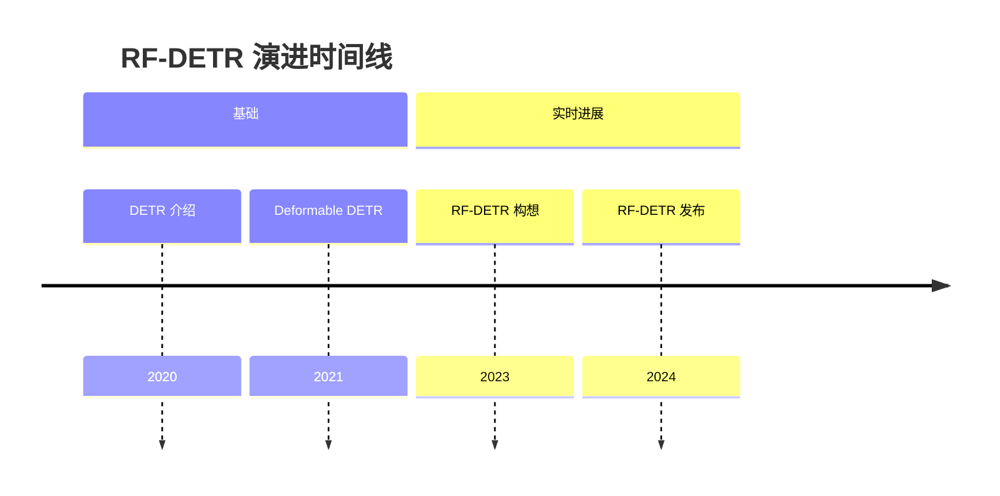
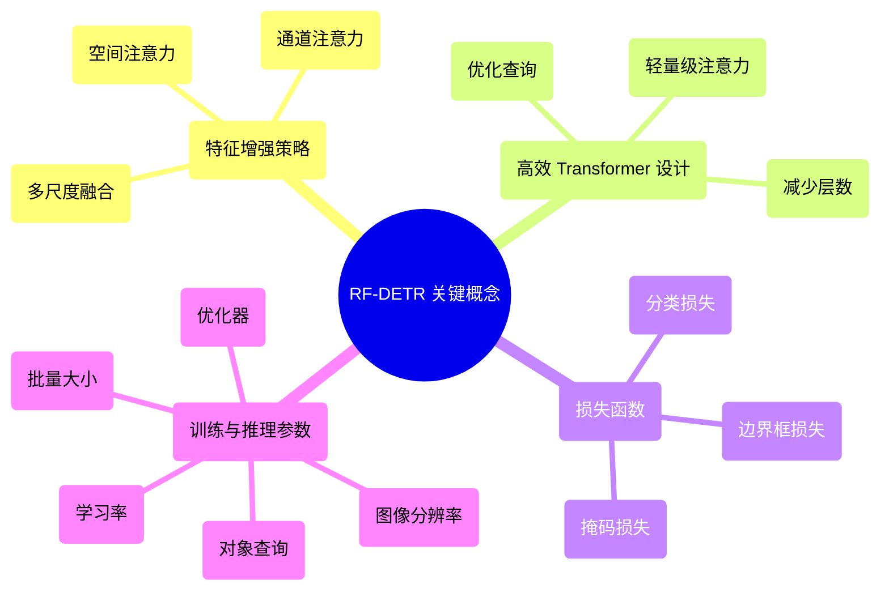

## RF-DETR 演进文档

### 1. 引言与历史背景

RF-DETR (Real-time Feature-enhanced Detection Transformer) 是一种由 **Roboflow** 开发的、基于 Transformer 的最先进的目标检测和实例分割模型架构。它在宽松的 **Apache 2.0 许可**下发布。该模型专为实时性能而设计，据称在其同尺寸的当代模型中速度最快、准确性最高。

RF-DETR 的一个显著成就是在标准基准测试上的表现。它在 **Microsoft COCO 目标检测基准**上的 AP (平均精度) 超过了 **60**，并在 **RF100-VL** 基准测试中取得了最先进的结果，该基准旨在测试模型对现实世界问题的领域适应性。

最初的 DETR 模型由 Facebook AI 于 2020 年推出，通过将其构建为直接集合预测问题，彻底改变了目标检测。然而，它存在收敛慢和计算成本高的问题。随后的工作，如 Deformable DETR，提高了效率，而 RF-DETR 通过增强特征提取和优化 Transformer 架构以提高速度，进一步突破了这些界限，使其成为适用于现实世界部署的实用解决方案。

### 1.1. RF-DETR 演进时间线



### 2. 核心架构

RF-DETR 的核心架构集成了高效的骨干网络、特征增强模块 (FEM) 和简化的 Transformer 编码器-解码器。其关键创新在于能够提取丰富的多尺度特征，并通过专门的 Transformer 快速处理它们，从而在不牺牲准确性的情况下实现实时性能。

RF-DETR 的开发承认了多个先前工作的基础性贡献，包括 **LW-DETR**、**DINOv2** 和 **Deformable DETR**，并从中汲取了架构灵感和原则。

#### 2.1. 心智模型 / 类比

想象你是一名技艺高超的侦探 (RF-DETR)，试图在快速移动的人群（视频流）中发现特定物体（例如，汽车、行人）。
*   **骨干网络** 就像你的眼睛，快速扫描整个场景，捕捉最初的视觉线索。
*   **特征增强模块 (FEM)** 就像你的大脑，智能地处理这些原始视觉线索，突出重要细节，并结合来自不同距离（尺度）的信息，形成更清晰的潜在嫌疑人图像。
*   **Transformer 编码器** 就像你的专业分析师团队，每个人都专注于增强视觉数据的不同方面，识别模式和关系。
*   **Transformer 解码器** 就像你的首席侦探，根据分析师的发现，直接指出每个嫌疑人的确切位置和身份，甚至实时预测他们的边界框和掩码。

#### 2.2. 关键组件

*   **高效骨干网络：** 通常是为速度优化的轻量级 CNN（例如，ResNet 变体、Swin Transformer），负责从输入图像中提取初始特征。
*   **特征增强模块 (FEM)：** 一种新颖的模块，用于细化和融合来自骨干网络的多尺度特征。它通常结合注意力机制或空间聚合技术来创建更具辨别力的特征图。
*   **Transformer 编码器：** 处理来自 FEM 的增强特征。它使用自注意力来捕获整个图像的全局上下文信息。RF-DETR 通常采用更高效的 Transformer 编码器变体来降低计算开销。
*   **Transformer 解码器：** 采用一组固定的可学习对象查询和编码器的输出，直接预测对象边界框和类别标签。它使用交叉注意力来关注来自编码器输出的相关特征。
*   **预测头：** 简单的前馈网络，将解码器的输出转换为最终的边界框坐标、类别概率和分割掩码。

**Mermaid 图：RF-DETR 核心架构**

```mermaid
graph TD
    A[输入图像] --> B[高效骨干网络];
    B --> C[多尺度特征];
    C --> D[特征增强模块 (FEM)];
    D --> E[增强特征];
    E --> F[Transformer 编码器];
    F --> G[编码器输出];
    H[对象查询] --> I[Transformer 解码器];
    G --> I;
    I --> J[预测头];
    J --> K[对象检测与分割掩码];
```

### 3. 实际用法与关键概念

虽然 RF-DETR 是一个研究模型，但它也被打包以供实际使用。它的“API”可以通过其面向用户的推理包和其可配置的架构组件来理解。

#### 3.1. 实际用法 / API

RF-DETR 专为在自定义数据集上进行微调而设计，并且可以轻松安装和用于推理。

*   **安装：** 可以使用 pip 直接从 PyPI 安装该模型：
    ```bash
    pip install rfdetr
    ```
    或者，可以从源代码库安装：
    ```bash
    pip install git+https://github.com/roboflow/rf-detr.git
    ```

*   **推理：** 可以使用 Roboflow 的 `Inference` 包或直接通过模型的 `.predict()` 方法执行推理，从而可以轻松地将模型应用于新图像。

#### 3.2. 特征增强策略

**上下文：** FEM 对 RF-DETR 的性能至关重要。它专注于在特征进入 Transformer 之前提高其质量和丰富性。
*   **技术：** 这通常涉及空间注意力、通道注意力或多尺度特征融合机制（例如，FPN 类似结构，但针对实时进行了优化）。目标是使特征更具辨别力，并对对象大小和外观的变化更具鲁棒性。

#### 3.3. 高效 Transformer 设计

**上下文：** 为了实现实时性能，RF-DETR 在其 Transformer 架构中采用了优化措施。
*   **技术：** 这可以包括：
    *   **减少层数：** 与原始 DETR 相比，编码器和解码器层数更少。
    *   **轻量级注意力：** 使用计算复杂度较低的注意力机制变体（例如，线性注意力、窗口注意力、可变形注意力）。
    *   **查询设计：** 优化对象查询的数量和初始化以加快解码过程。

#### 3.4. 损失函数

**上下文：** 训练 RF-DETR 涉及多种损失函数的组合，以指导模型预测准确的边界框、类别和掩码。
*   **组件：**
    *   **分类损失：** 通常是 Focal Loss 或交叉熵损失，用于预测对象类别。
    *   **边界框回归损失：** 通常是 L1 损失和广义 IoU (GIoU) 损失的组合，用于精确的框定位。
    *   **掩码损失（用于分割）：** 二进制交叉熵或 Dice 损失，用于像素级分割。

#### 3.5. 训练和推理参数

**上下文：** 在训练和推理期间配置各种参数以控制模型的行为。
*   **参数：**
    *   **学习率调度：** 训练期间学习率如何变化。
    *   **优化器：** (例如，AdamW)
    *   **批量大小：** 一次训练迭代中处理的样本数量。
    *   **训练轮数：** 总训练迭代次数。
    *   **图像分辨率：** 输入图像大小，影响准确性和速度。
    *   **对象查询数量：** 影响模型可以检测的最大对象数量的关键参数。

**Mermaid 图：简化的 RF-DETR 关键概念**



### 4. 演进与影响

RF-DETR 的演进证明了使基于 Transformer 的目标检测模型适用于实际应用的持续努力。其主要影响在于证明了可以实时实现高精度检测和分割，弥合了研究突破与可部署解决方案之间的差距。

*   **实时性能：** RF-DETR 显著降低了与早期 DETR 变体相比的推理延迟，使其适用于需要即时响应的应用，例如自动驾驶、机器人和视频监控。
*   **增强的特征表示：** 特征增强模块 (FEM) 是一项关键创新，允许模型构建更强大和上下文丰富的特征表示，这直接有助于提高准确性。
*   **SOTA 性能：** RF-DETR 通常在具有挑战性的基准（例如，COCO）上实现最先进 (SOTA) 的结果，同时保持实时速度，展示了其架构优化的有效性。
*   **更广泛的适用性：** 通过克服以前 DETR 模型的速度限制，RF-DETR 将基于 Transformer 的检测器应用于更广泛的实时计算机视觉任务。
*   **未来工作的基础：** RF-DETR 的成功激发了对高效 Transformer 架构和特征工程技术的进一步研究，以实现实时感知。

### 5. 结论与未来展望

RF-DETR 代表了实时目标检测和分割的重大飞跃，成功地将 Transformer 模型的强大功能与实际部署所需的效率相结合。其创新的特征增强模块和优化的 Transformer 设计为速度和准确性设定了新的基准。

RF-DETR 等模型的未来发展轨迹可能包括：
*   **进一步提高效率：** 探索更轻量级的骨干网络、先进的注意力机制和量化技术，以进一步提高推理速度。
*   **多任务学习：** 将更多任务（例如，深度估计、姿态估计）集成到单个统一的实时 Transformer 模型中。
*   **鲁棒性和泛化能力：** 提高在具有挑战性条件（例如，弱光、恶劣天气）和多样化数据集上的性能。
*   **硬件感知设计：** 开发专门为在边缘设备和专用 AI 加速器上高效部署而定制的架构。
*   **自监督和少样本学习：** 减少对大型标记数据集进行训练的依赖，使这些模型更能适应数据有限的新领域。
