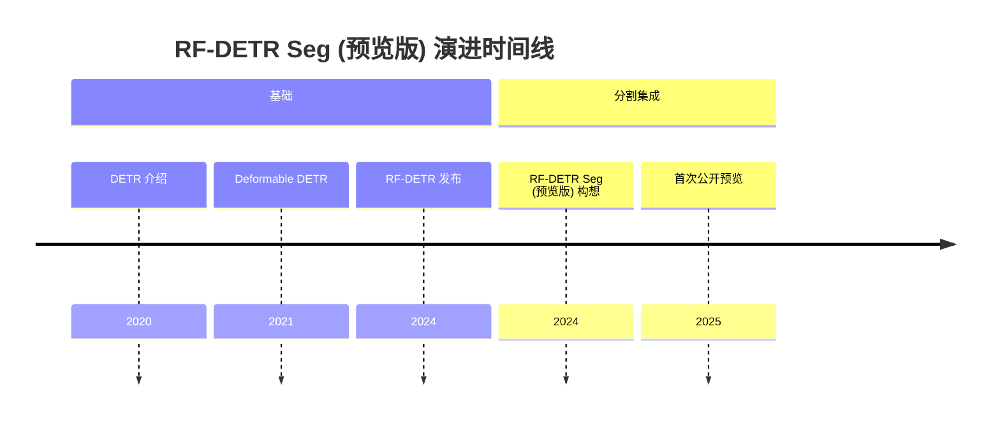

## RF-DETR Seg (预览版) 演进文档

### 1. 引言与历史背景

RF-DETR Seg (预览版) 代表了 RF-DETR 模型的一个实验性扩展，专门为实时实例分割而定制。它建立在 RF-DETR 在实时目标检测方面取得的进展之上，集成了分割功能，旨在以高推理速度提供像素级掩码以及边界框检测。根据 Roboflow 的说法，在 Microsoft COCO 分割基准上，RF-DETR Seg 的速度是**最大 YOLO 模型的 3 倍，并且准确性更高**。

从 DETR 到 RF-DETR 的演进侧重于优化 Transformer 架构以提高速度，并增强特征表示以进行检测。RF-DETR Seg (预览版) 通过将掩码预测分支（通常是轻量级 FCN（全卷积网络）或专用掩码头）集成到现有的 RF-DETR 框架中来扩展这一点。“预览版”状态表明其分割性能和实时效率正在持续开发、完善和评估中。

### 1.1. RF-DETR Seg (预览版) 演进时间线



### 2. 核心架构

RF-DETR Seg (预览版) 在很大程度上继承了基础 RF-DETR 的高效骨干网络、特征增强模块 (FEM) 和简化的 Transformer 编码器-解码器。主要的架构新增是一个专用的**掩码预测头**，它对 Transformer 解码器处理的特征进行操作，以生成高质量的实例掩码。

#### 2.1. 心智模型 / 类比

继续侦探类比，如果 RF-DETR 是一名侦探，负责指出嫌疑人（边界框），那么 RF-DETR Seg (预览版) 就是一名法医艺术家（分割头），他在侦探识别出嫌疑人后，在人群中一丝不苟地勾勒出他们的确切轮廓（像素级掩码）。核心侦探工作（特征提取、Transformer 处理）保持不变，但工作流程中增加了一个额外的、精确的轮廓绘制步骤。

#### 2.2. 关键组件

*   **高效骨干网络：** （与 RF-DETR 相同）用于初始特征提取的轻量级 CNN。
*   **特征增强模块 (FEM)：** （与 RF-DETR 相同）细化和融合多尺度特征。
*   **Transformer 编码器：** （与 RF-DETR 相同）处理增强特征，捕获全局上下文。
*   **Transformer 解码器：** （与 RF-DETR 相同）接收对象查询和编码器输出，以预测对象边界框和类别标签。
*   **掩码预测头：** 一个新组件，通常是一个小型 FCN 或专用模块，它接收解码器的输出特征并为每个检测到的对象生成二进制掩码。此头部设计为高效，以保持实时性能。
*   **预测头（用于检测）：** （与 RF-DETR 相同）用于边界框坐标和类别概率的简单前馈网络。

**Mermaid 图：RF-DETR Seg (预览版) 核心架构**

```mermaid
graph TD
    A[输入图像] --> B[高效骨干网络];
    B --> C[多尺度特征];
    C --> D[特征增强模块 (FEM)];
    D --> E[增强特征];
    E --> F[Transformer 编码器];
    F --> G[编码器输出];
    H[对象查询] --> I[Transformer 解码器];
    G --> I;
    I --> J[检测预测头];
    I --> K[掩码预测头];
    J --> L[对象检测];
    K --> M[分割掩码];
    L & M --> N[组合输出];
```

### 3. 详细 API 概述 / 关键概念

RF-DETR Seg (预览版) 扩展了 RF-DETR 的概念，并特别考虑了实例分割。“API”在此处指的是架构新增和控制分割的参数。

#### 3.1. 掩码预测头设计

**上下文：** 掩码预测头的设计对于高效生成准确和高分辨率的掩码至关重要。
*   **技术：** 这可以包括：
    *   **基于 FCN 的头部：** 使用一系列卷积层和上采样来预测像素级掩码。
    *   **动态掩码头部：** 掩码头部根据对象查询动态生成，从而实现实例特定的掩码预测。
    *   **特征分辨率：** 平衡输入到掩码头的特征分辨率，以在不过度增加计算成本的情况下实现细节。

#### 3.2. 分割损失函数

**上下文：** 分割训练需要额外的损失项来指导掩码预测。
*   **组件：**
    *   **二元交叉熵 (BCE) 损失：** 常用于像素级分类（前景/背景）。
    *   **Dice 损失：** 对不平衡分割任务特别有效，侧重于预测掩码和真实掩码之间的重叠。
    *   **组合损失：** 通常是 BCE 和 Dice 损失的加权和。

#### 3.3. 分割的训练和推理参数

**上下文：** 引入或调整了特定于分割的参数。
*   **参数：**
    *   **掩码头学习率：** 掩码分支的学习率可能不同。
    *   **掩码损失权重：** 平衡掩码损失对分类和边界框损失的贡献。
    *   **掩码分辨率：** 预测掩码的输出分辨率。
    *   **掩码后处理：** 诸如连通分量分析或阈值处理等技术，用于细化原始掩码预测。

**Mermaid 图：简化的 RF-DETR Seg (预览版) 关键概念**

```mermaid
mindmap
  root((RF-DETR Seg (预览版) 关键概念))
    (掩码预测头设计)
      (基于 FCN 的头部)
      (动态掩码头部)
      (特征分辨率)
    (分割损失函数)
      (二元交叉熵损失)
      (Dice 损失)
      (组合损失)
    (分割的训练与推理参数)
      (掩码头学习率)
      (掩码损失权重)
      (掩码分辨率)
      (掩码后处理)
```

### 4. 演进与影响

RF-DETR Seg (预览版) 标志着将基于 Transformer 的实时检测扩展到更细粒度的实例分割任务的持续努力。即使在预览状态下，其影响也在于证明了在 DETR 模型家族中实现实时、高质量分割的可行性。

*   **实时实例分割：** 主要影响是能够以以前基于 Transformer 的模型难以达到的速度提供实例分割，为机器人、增强现实和高级视频分析等应用打开了大门。
*   **统一检测和分割：** 它朝着检测和分割的更统一框架迈进，与多阶段方法相比，简化了模型部署并降低了计算开销。
*   **研究方向：** 预览状态突出显示了一个活跃的研究领域，推动了高效 Transformer 设计在密集预测任务中的可能性。
*   **未来模型的基础：** RF-DETR Seg (预览版) 中的架构选择和优化可能会为后续的、成熟的实时分割模型的开发提供信息。

### 5. 结论与未来展望

RF-DETR Seg (预览版) 是一项令人兴奋的进展，展示了使用优化的 Transformer 架构进行实时实例分割的潜力。它建立在 RF-DETR 的优势之上，为其快速对象定位功能添加了像素级理解。

RF-DETR Seg 及类似实时分割模型的未来发展轨迹可能包括：
*   **生产就绪稳定性：** 从预览版过渡到稳定版，并进行广泛的基准测试和鲁棒性测试。
*   **改进掩码质量：** 进一步增强掩码预测头和损失函数，以实现更精细的分割细节。
*   **边缘设备效率：** 持续优化以在资源受限的硬件上部署。
*   **全景分割：** 扩展到全景分割，它统一了实例分割（针对“事物”）和语义分割（针对“物质”）。
*   **领域适应：** 改进对新领域和数据集的泛化能力，同时最大限度地减少再训练。
