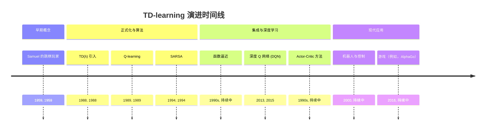

## TD-learning 演进文档

### 1. 引言与历史背景

时序差分（TD）学习是指一类无模型强化学习方法，它通过从下一个状态的估计值中进行自举来学习。与蒙特卡洛方法不同，蒙特卡洛方法等到一个回合结束才计算实际回报，而 TD 方法根据其他学习到的估计值更新其估计值，这使得它们对于连续任务或具有非常长回合的任务更有效。

TD 学习的奠基思想由 Arthur Samuel 在 1950 年代后期在他的跳棋程序中提出，该程序通过比较连续的评估来学习评估棋盘位置。然而，TD 学习的正式化和广泛认可随着 Richard Sutton 在 1988 年的工作而到来，特别是引入了 **TD(λ)**。Sutton 表明，TD 方法结合了蒙特卡洛（从经验中学习）和动态规划（从估计中自举）的思想，为强化学习提供了一种强大而灵活的方法。

TD 学习是许多成功的强化学习算法的核心，包括 Q-learning 和 SARSA，它们本质上是 TD 控制方法。它能够从经验中增量学习，无需环境模型，并根据其他估计值更新估计值，这使其成为现代强化学习的基石，也是学习掌握复杂任务的智能体中的关键组成部分。

### 1.1. TD-learning 演进时间线



### 2. 核心概念与架构

TD 学习的核心在于其更新规则，它结合了蒙特卡洛和动态规划的元素。

#### 2.1. TD 误差

**心智模型/类比：**
想象你正在尝试预测一场篮球比赛的最终比分，而比赛仍在进行中。蒙特卡洛方法会等到比赛结束，然后将你的初始预测与实际最终比分进行比较。TD 方法就像在比赛过程中不断调整你的预测。每过一节，你都会查看当前比分和你对最终比分的*新*预测，然后根据这些新信息调整你的*旧*预测。你正在使用一个估计（本节后的预测）来更新之前的估计（本节前的预测），而不是等待绝对的真相（最终比分）。

*   **TD 误差：** 当前状态的估计值与下一个状态的估计值加上即时奖励之间的差值。它量化了智能体对实际结果与预期相比的“惊讶”程度。

    `TD Error = r + γ V(s') - V(s)`

    *   `r`：收到的即时奖励。
    *   `γ`：折扣因子。
    *   `V(s')`：下一个状态 `s'` 的估计值。
    *   `V(s)`：当前状态 `s` 的估计值。

#### 2.2. TD 更新规则

状态值函数 `V(s)` 的通用 TD 更新规则是：

`V(s) ← V(s) + α [r + γ V(s') - V(s)]`

*   **`V(s)`：** 状态 `s` 的当前估计值。
*   **`α` (学习率)：** 确定更新步长。
*   **`r + γ V(s')`：** 这是“TD 目标”——状态 `s` 真实值的一个新的自举估计。
*   **`[r + γ V(s') - V(s)]`：** 这是 TD 误差，它驱动学习。

此更新规则在每次与环境交互后应用，使 TD 学习成为一种在线、增量的方法。

**Mermaid图：TD 更新流程**

```mermaid
graph TD
    A[智能体在状态 s] --> B{采取行动 a}
    B --> C[观察奖励 r，新状态 s']
    C --> D[估计 V(s')]
    D --> E[计算 TD 目标: r + γ * V(s')]
    E --> F[计算 TD 误差: TD 目标 - V(s)]
    F --> G[使用学习率 α 更新 V(s)]
```

### 3. 关键 TD 控制算法

虽然基本的 TD 更新用于*预测*（学习 `V(s)`），但它可以扩展到*控制*（学习最优策略）。

#### 3.1. SARSA (State-Action-Reward-State-Action)

**目标：** 通过更新下一个状态中*实际*采取的行动的 Q 值来学习最优策略。

**更新规则：**
`Q(s, a) ← Q(s, a) + α [r + γ Q(s', a') - Q(s, a)]`

*   **与 Q-learning 的主要区别：** SARSA 是一种*同策略*算法。它根据在下一个状态 `s'` 中*实际选择*的行动 `a'`（遵循当前策略）更新 `Q(s, a)`。这意味着 SARSA 学习它当前遵循的策略的价值，包括其探索策略。

#### 3.2. Q-learning

**目标：** 通过更新下一个状态中*最佳可能*行动的 Q 值来学习最优策略。

**更新规则：**
`Q(s, a) ← Q(s, a) + α [r + γ max_{a'} Q(s', a') - Q(s, a)]`

*   **与 SARSA 的主要区别：** Q-learning 是一种*离策略*算法。它根据下一个状态 `s'` 的 `max` Q 值更新 `Q(s, a)`，而不管实际采取的行动 `a'` 是什么。这使得 Q-learning 即使在智能体探索次优行动时也能学习最优策略。

### 3.3. 快速参考：TD 算法（概念性）

| 算法 | 类型 | 更新目标 | 学习到的策略 |
| :--- | :--- | :--- | :--- |
| **TD(0)** | 预测 | `r + γ V(s')` | 不适用（学习状态值） |
| **SARSA** | 控制（同策略） | `r + γ Q(s', a')` | *当前*策略的价值 |
| **Q-learning** | 控制（离策略） | `r + γ max_{a'} Q(s', a')` | *最优*策略的价值 |

### 4. 演进与影响

TD 学习一直是强化学习的基石，以多种方式发展：

*   **优于蒙特卡洛的效率：** TD 方法可以在线和增量学习，通常比蒙特卡洛方法收敛更快，尤其是在具有长回合或连续环境的任务中。
*   **自举：** 基于其他估计值更新估计值（自举）的思想是一个强大的概念，可以实现更快的学习，并且是动态规划和许多 RL 算法的标志。
*   **TD(λ) 和资格迹：** Sutton 的 TD(λ) 引入了资格迹，它允许 TD 更新回溯多个步骤，弥合了单步 TD 更新和完整蒙特卡洛更新之间的差距。这显著提高了学习效率。
*   **控制方法的基础：** TD 学习为 Q-learning 和 SARSA 等无模型控制算法提供了基础，这些算法使智能体能够在未知环境中学习最优行为。
*   **深度强化学习：** TD 原理是深度强化学习的基础。例如，深度 Q 网络（DQN）使用深度神经网络来逼近 Q 函数，并使用 TD 误差对其进行更新，展示了 TD 学习在复杂、高维问题上的可扩展性。
*   **Actor-Critic 方法：** 更高级的 RL 算法，例如 actor-critic 方法，也利用了 TD 学习。评论家组件通常使用 TD 方法来学习价值函数，然后帮助行动者组件改进其策略。

### 5. 结论

时序差分学习是强化学习中一个基本且极具影响力的概念。通过结合蒙特卡洛和动态规划的优势，它为智能体提供了一种高效灵活的方式，可以直接从经验中学习价值函数和最优策略，而无需环境模型。从早期概念思想的提出到现代深度强化学习算法的核心，其演进突显了它在人工智能领域中持久的重要性。对 TD 学习的扎实理解对于任何从事强化学习理论和实践的人来说都至关重要。
