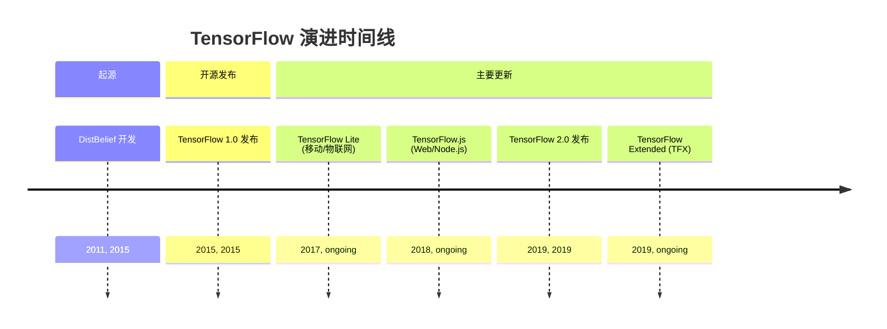
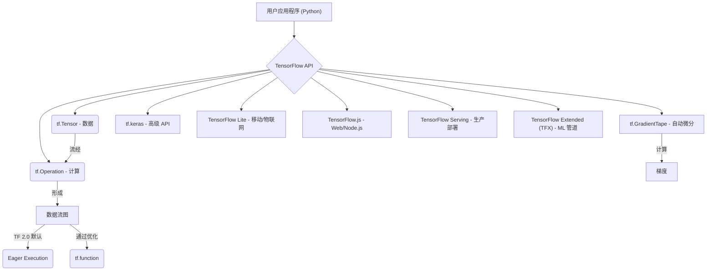

## TensorFlow 演进文档

### 1. 引言与历史背景

TensorFlow 是由 Google 开发的开源机器学习框架。它广泛用于构建和训练深度学习模型，特别是神经网络，应用于计算机视觉、自然语言处理和强化学习等各种领域。其灵活性使其能够部署在从服务器到移动设备和网络浏览器等多种平台上。

TensorFlow 的起源可以追溯到 Google 专有的深度学习系统 **DistBelief**，该系统于 2011 年开始在内部开发。尽管功能强大，但 DistBelief 在可扩展性和灵活性方面存在局限性。认识到对更健壮和通用系统的需求，包括 Jeff Dean 在内的 Google 工程师重构了 DistBelief 的代码库，从而创建了 TensorFlow。

TensorFlow 于 2015 年 11 月首次作为开源项目在 Apache 许可证 2.0 下发布。此举旨在加速全球机器学习领域的创新，并培养庞大的开发人员和研究人员社区。一个重要的里程碑是 2019 年 9 月发布的 **TensorFlow 2.0**，它带来了重大变化，包括将 Eager Execution 作为默认模式、更紧密的 Keras 集成以及整体 API 简化。

### 1.1. TensorFlow 演进时间线



### 2. 核心架构

TensorFlow 的核心是将计算表示为**数据流图**。在此模型中，图中的节点表示数学运算，而边表示在这些运算之间流动多维数据数组（张量）。这种基于图的方法可以实现高效执行、自动微分以及在分布式系统和各种硬件加速器（CPU、GPU、TPU）上的部署。

#### 2.1. 数据流图和张量

*   **张量 (Tensors)**：TensorFlow 中数据的核心单元。张量是多维数组，类似于 NumPy 数组，但增加了驻留在加速器内存（GPU、TPU）中并参与自动微分的能力。
*   **操作 (Ops)**：数据流图中表示计算的节点。TensorFlow 提供了丰富的操作库，从基本算术到复杂的神经网络层。

#### 2.2. Eager Execution (即时执行)

从 TensorFlow 2.0 开始，**Eager Execution** 成为默认模式。这允许操作立即评估，而不是先构建图然后在一个会话中运行它。Eager Execution 使 TensorFlow 更直观、更易于调试，并且更类似于传统的命令式编程范例，同时在需要时（例如通过 `tf.function`）仍然可以获得基于图的性能优势。

#### 2.3. 自动微分 (`tf.GradientTape`)

TensorFlow 的自动微分系统对于训练神经网络至关重要。`tf.GradientTape` API 记录前向传播期间执行的操作，然后使用这些记录来计算目标相对于某些源（通常是模型变量）的梯度。这自动化了反向传播过程，这是优化模型参数的基础。

#### 2.4. 模块化和部署生态系统

TensorFlow 的设计考虑了模块化和广泛的部署生态系统：

*   **`tf.keras`**: 用于构建和训练深度学习模型的高级 API，直接集成到 TensorFlow 2.0 中。它简化了模型构建和实验。
*   **TensorFlow Lite**: 针对移动和嵌入式设备优化的 TensorFlow 版本，支持设备上的机器学习推理。
*   **TensorFlow.js**: 一个 JavaScript 库，用于在 Web 浏览器和 Node.js 中训练和部署机器学习模型。
*   **TensorFlow Serving**: 用于在生产环境中提供机器学习模型的高性能、灵活的服务系统。
*   **TensorFlow Extended (TFX)**: 用于部署生产级机器学习管道的端到端平台。

**Mermaid 图：TensorFlow 核心架构**



### 3. 详细 API 概述

TensorFlow 的 API 非常广泛，既提供了易于使用的高级抽象，也提供了灵活的低级控制。

#### 3.1. `tf.keras` (高级 API)

`tf.keras` 因其简单性和强大功能而被推荐用于大多数用户。它提供了神经网络的构建块。

*   **`tf.keras.Model`**: Keras 模型的基础类，用于定义自定义模型。
*   **`tf.keras.layers`**: 包含各种类型的神经网络层（例如 `Dense`、`Conv2D`、`LSTM`）。
*   **`model.compile(optimizer, loss, metrics)`**: 配置模型以进行训练。
*   **`model.fit(x, y, epochs, ...)`**: 训练模型固定数量的 epoch。
*   **`model.predict(x)`**: 为输入样本生成输出预测。

#### 3.2. 张量和操作 (低级 API)

直接操作张量和操作提供了细粒度的控制。

*   **`tf.constant(value, dtype=None)`**: 创建一个常量张量。
*   **`tf.Variable(initial_value, ...)`**: 创建一个可变张量，其值可以在训练期间更改。
*   **`tf.add(x, y)`**、**`tf.multiply(x, y)`** 等：逐元素算术运算。
*   **`tf.matmul(a, b)`**: 执行矩阵乘法。
*   **`tf.reduce_sum(input_tensor, axis=None)`**: 计算张量维度上的元素之和。

#### 3.3. 数据输入管道 (`tf.data`)

`tf.data` API 用于构建高效且可扩展的机器学习模型输入管道。

*   **`tf.data.Dataset.from_tensor_slices(tensors)`**: 从张量切片创建数据集。
*   **`dataset.map(map_func)`**: 将 `map_func` 映射到此数据集的元素上。
*   **`dataset.batch(batch_size)`**: 将此数据集的连续元素组合成批次。
*   **`dataset.shuffle(buffer_size)`**: 随机打乱此数据集的元素。

#### 3.4. 自动微分 (`tf.GradientTape`)

*   **`tf.GradientTape()`**: 用于记录操作以进行自动微分的上下文管理器。
*   **`tape.gradient(target, sources)`**: 计算 `target` 相对于 `sources` 的梯度。

### 3.5. API 思维导图

```mermaid
mindmap
  root((TensorFlow API))
    (高级 API: tf.keras)
      (tf.keras.Model)
      (tf.keras.layers)
      (model.compile)
      (model.fit)
      (model.predict)
    (低级 API: 张量与操作)
      (tf.constant)
      (tf.Variable)
      (tf.add, tf.multiply, ...)
      (tf.matmul)
      (tf.reduce_sum)
    (数据输入管道: tf.data)
      (tf.data.Dataset.from_tensor_slices)
      (dataset.map)
      (dataset.batch)
      (dataset.shuffle)
    (自动微分: tf.GradientTape)
      (tf.GradientTape())
      (tape.gradient)
```

### 4. 演变与影响

*   **深度学习的普及:** TensorFlow 在使深度学习普及到广大开发人员和研究人员社区方面发挥了关键作用，促进了人工智能的快速发展。
*   **行业标准:** 它已成为开发和部署机器学习模型的行业标准，特别是在 Google 及其他公司的大规模生产环境中。
*   **生态系统扩展:** 该框架催生了丰富的工具和库生态系统（TensorFlow Lite、TensorFlow.js、TFX 等），将其功能扩展到各种平台和用例。
*   **研究与创新:** TensorFlow 仍然是尖端人工智能研究的领先平台，不断开发新功能和优化，以推动机器学习的边界。
*   **TensorFlow 2.0 简化:** 转向 TensorFlow 2.0 并采用 Eager Execution 和 Keras 集成显著改善了用户体验，使框架更直观、更符合 Python 风格，从而降低了新用户的入门门槛。

### 5. 结论

TensorFlow 从 Google 内部项目到全球开源巨头的历程深刻影响了机器学习领域。其健壮的数据流图架构，结合 Eager Execution 和自动微分等强大功能，为构建和部署最先进的 AI 模型提供了灵活且可扩展的平台。在充满活力的社区和 Google 持续承诺的推动下，TensorFlow 不断演进，确保其始终处于 AI 创新的前沿，赋能研究人员和开发人员应对日益复杂的挑战。
