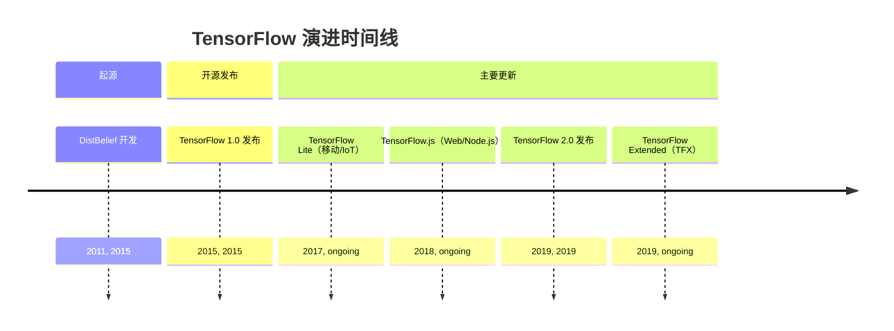
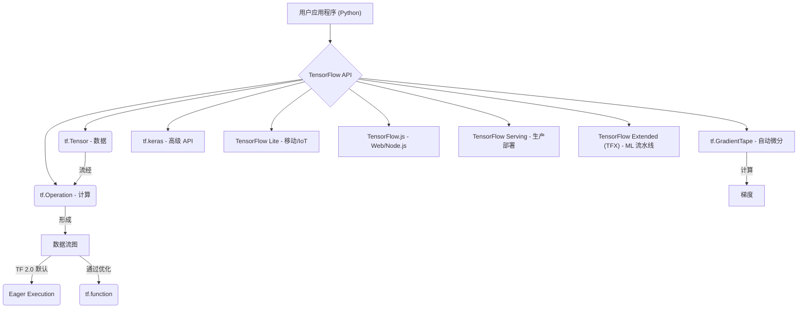

## TensorFlow 演进文档

### 1. 引言与历史背景

TensorFlow 是由 Google 开发的开源机器学习框架。它广泛用于构建和训练深度学习模型，尤其是神经网络，应用领域涵盖计算机视觉、自然语言处理和强化学习等。它具有高度的灵活性，可部署在从服务器到移动设备及 Web 浏览器的多种平台上。

TensorFlow 的起源可追溯到 Google 的专有深度学习系统 **DistBelief**，该系统自 2011 年开始在内部开发。尽管功能强大，但 DistBelief 在可扩展性和灵活性方面存在局限。Google 的工程师（包括 Jeff Dean）意识到需要一个更健壮、更通用的系统，于是重构了 DistBelief 的代码库，最终创建了 TensorFlow。

TensorFlow 于 2015 年 11 月在 Apache License 2.0 下首次作为开源项目发布。此举旨在加速全球机器学习创新，并培育庞大的开发者与研究者社区。一个重要的里程碑是 **TensorFlow 2.0** 于 2019 年 9 月发布，带来了重大变更，包括将 Eager Execution 设为默认模式、更紧密的 Keras 集成以及整体 API 简化。

### 1.1. TensorFlow 演进时间线



### 2. 核心架构

TensorFlow 的核心将计算表示为 **数据流图**。在该模型中，图中的节点表示数学运算，边表示在这些运算之间流动的多维数据数组（张量）。这种基于图的方式实现了高效执行、自动微分，以及在分布式系统和各种硬件加速器（CPU、GPU、TPU）上的部署。

#### 2.1. 数据流图与张量

*   **张量（Tensors）**：TensorFlow 中数据的核心单元。张量是多维数组，类似于 NumPy 数组，但具备驻留在加速器内存（GPU、TPU）以及参与自动微分的能力。
*   **操作（Ops）**：数据流图中的计算节点。TensorFlow 提供了丰富的操作库，从基础算术到复杂的神经网络层。

#### 2.2. Eager Execution（即时执行）

自 TensorFlow 2.0 起，**Eager Execution** 成为默认模式。这允许操作立即求值，而不是先构建图再在会话中运行。Eager Execution 使 TensorFlow 更直观、更易调试，并更接近传统指令式编程范式；同时在需要时（例如通过 `tf.function`）仍可获得基于图的性能优势。

#### 2.3. 自动微分（`tf.GradientTape`）

TensorFlow 的自动微分系统是训练神经网络的关键。`tf.GradientTape` API 会记录前向传播期间执行的操作，然后利用这些记录计算目标相对于某些源（通常是模型变量）的梯度。这实现了反向传播过程的自动化，是优化模型参数的基础。

#### 2.4. 模块化与部署生态

TensorFlow 在设计上考虑了模块化和广泛的部署生态：

*   **`tf.keras`**：用于构建和训练深度学习模型的高级 API，直接集成到 TensorFlow 2.0 中，简化了模型构建与实验过程。
*   **TensorFlow Lite**：面向移动和嵌入式设备的优化版本，实现设备端机器学习推理。
*   **TensorFlow.js**：用于在 Web 浏览器和 Node.js 中训练与部署机器学习模型的 JavaScript 库。
*   **TensorFlow Serving**：用于在生产环境中提供机器学习模型的灵活且高性能的服务系统。
*   **TensorFlow Extended（TFX）**：用于部署生产级机器学习流水线的端到端平台。

**Mermaid 图：TensorFlow 核心架构**



### 3. 详细 API 概述

TensorFlow 的 API 十分广泛，既提供了易用的高级抽象，也提供了灵活的低级控制。

#### 3.1. `tf.keras`（高级 API）

`tf.keras` 因其简洁与强大而被推荐给大多数用户。它提供了构建神经网络的积木。

*   **`tf.keras.Model`**：Keras 模型的基类，用于定义自定义模型。
*   **`tf.keras.layers`**：包含多种类型的神经网络层（例如 `Dense`、`Conv2D`、`LSTM`）。
*   **`model.compile(optimizer, loss, metrics)`**：为训练配置模型。
*   **`model.fit(x, y, epochs, ...)`**：在固定轮数上训练模型。
*   **`model.predict(x)`**：为输入样本生成输出预测。

#### 3.2. 张量与操作（低级 API）

直接操作张量与计算为精细控制提供了可能。

*   **`tf.constant(value, dtype=None)`**：创建常量张量。
*   **`tf.Variable(initial_value, ...)`**：创建可变张量，其值可在训练期间改变。
*   **`tf.add(x, y)`**、**`tf.multiply(x, y)`** 等：逐元素算术操作。
*   **`tf.matmul(a, b)`**：执行矩阵乘法。
*   **`tf.reduce_sum(input_tensor, axis=None)`**：计算张量各维上的元素之和。

#### 3.3. 数据输入管道（`tf.data`）

`tf.data` API 用于为机器学习模型构建高效且可扩展的输入管道。

*   **`tf.data.Dataset.from_tensor_slices(tensors)`**：从张量切片创建数据集。
*   **`dataset.map(map_func)`**：将 `map_func` 映射到数据集元素。
*   **`dataset.batch(batch_size)`**：将连续元素组合成批次。
*   **`dataset.shuffle(buffer_size)`**：随机打乱数据集的元素。

#### 3.4. 自动微分（`tf.GradientTape`）

*   **`tf.GradientTape()`**：用于记录操作以进行自动微分的上下文管理器。
*   **`tape.gradient(target, sources)`**：计算 `target` 相对于 `sources` 的梯度。

### 3.5. API 思维导图

```mermaid
mindmap
  root((TensorFlow API))
    (高级 API: tf.keras)
      (tf.keras.Model)
      (tf.keras.layers)
      (model.compile)
      (model.fit)
      (model.predict)
    (低级 API: 张量与操作)
      (tf.constant)
      (tf.Variable)
      (tf.add, tf.multiply, ...)
      (tf.matmul)
      (tf.reduce_sum)
    (数据输入管道: tf.data)
      (tf.data.Dataset.from_tensor_slices)
      (dataset.map)
      (dataset.batch)
      (dataset.shuffle)
    (自动微分: tf.GradientTape)
      (tf.GradientTape())
      (tape.gradient)
```

### 4. 演变与影响

*   **深度学习的普及化：** TensorFlow 在让深度学习为广大开发者与研究者所用方面发挥了关键作用，推动了 AI 的快速发展。
*   **行业标准：** 它已成为开发与部署机器学习模型的行业标准，尤其在 Google 及其他公司的大规模生产环境中。
*   **生态系统扩展：** 该框架催生了一系列丰富的工具与库（TensorFlow Lite、TensorFlow.js、TFX 等），将其能力扩展到多种平台与用例。
*   **研究与创新：** TensorFlow 仍是尖端 AI 研究的平台，新功能与优化不断推进机器学习的边界。
*   **TensorFlow 2.0 简化：** 转向 TensorFlow 2.0 并采用 Eager Execution 与 Keras 集成显著改善了用户体验，使框架更直观、更 Python 化，降低了新用户的入门门槛。

### 5. 结论

TensorFlow 从 Google 内部项目到全球开源巨头的历程深刻影响了机器学习领域。其稳健的数据流图架构结合 Eager Execution 与自动微分等强大功能，为构建与部署最先进的 AI 模型提供了灵活且可扩展的平台。在充满活力的社区与 Google 持续承诺的推动下，TensorFlow 不断演进，确保其始终处于 AI 创新的前沿，赋能研究者与开发者应对愈发复杂的挑战。

### 6. 典型用例

#### 6.1. 使用 `tf.keras` 构建并训练简单分类器

```python
import tensorflow as tf
(X_train, y_train), (X_test, y_test) = tf.keras.datasets.mnist.load_data()
X_train = X_train.reshape(-1, 28*28).astype("float32")/255.0
X_test  = X_test.reshape(-1, 28*28).astype("float32")/255.0

model = tf.keras.Sequential([
    tf.keras.layers.Dense(128, activation="relu"),
    tf.keras.layers.Dense(10, activation="softmax")
])
model.compile(optimizer="adam", loss="sparse_categorical_crossentropy", metrics=["accuracy"])
model.fit(X_train, y_train, epochs=3, batch_size=64)
print(model.evaluate(X_test, y_test))
```

#### 6.2. 使用 `tf.data` 构建输入管道

```python
import tensorflow as tf
import numpy as np

features = np.random.randn(1000, 32).astype("float32")
labels = (features.mean(axis=1) > 0).astype("int32")

ds = tf.data.Dataset.from_tensor_slices((features, labels)).shuffle(1000).batch(32)
for batch_x, batch_y in ds.take(1):
    print(batch_x.shape, batch_y.shape)
```

#### 6.3. 使用 `tf.GradientTape` 自定义训练循环

```python
import tensorflow as tf

model = tf.keras.Sequential([
    tf.keras.layers.Dense(64, activation="relu"),
    tf.keras.layers.Dense(1)
])
optimizer = tf.keras.optimizers.Adam(1e-3)

x = tf.random.normal((256, 10))
y = tf.random.normal((256, 1))

for step in range(200):
    with tf.GradientTape() as tape:
        pred = model(x, training=True)
        loss = tf.reduce_mean((pred - y) ** 2)
    grads = tape.gradient(loss, model.trainable_variables)
    optimizer.apply_gradients(zip(grads, model.trainable_variables))
```
