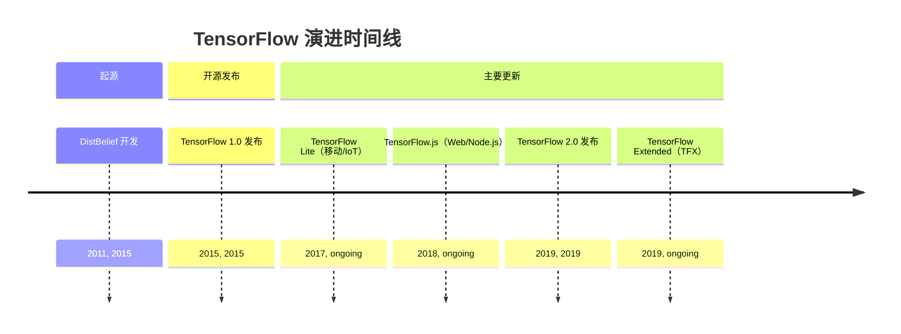
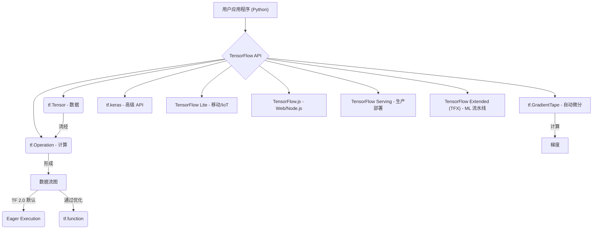

## TensorFlow 演进文档

### 1. 引言与历史背景

TensorFlow 是由 Google 开发的开源机器学习框架。它广泛用于构建和训练深度学习模型，尤其是神经网络，应用领域涵盖计算机视觉、自然语言处理和强化学习等。它具有高度的灵活性，可部署在从服务器到移动设备及 Web 浏览器的多种平台上。

TensorFlow 的起源可追溯到 Google 的专有深度学习系统 **DistBelief**，该系统自 2011 年开始在内部开发。尽管功能强大，但 DistBelief 在可扩展性和灵活性方面存在局限。Google 的工程师（包括 Jeff Dean）意识到需要一个更健壮、更通用的系统，于是重构了 DistBelief 的代码库，最终创建了 TensorFlow。

TensorFlow 于 2015 年 11 月在 Apache License 2.0 下首次作为开源项目发布。此举旨在加速全球机器学习创新，并培育庞大的开发者与研究者社区。一个重要的里程碑是 **TensorFlow 2.0** 于 2019 年 9 月发布，带来了重大变更，包括将 Eager Execution 设为默认模式、更紧密的 Keras 集成以及整体 API 简化。

### 1.1. TensorFlow 演进时间线



### 2. 核心架构

TensorFlow 的核心将计算表示为 **数据流图**。在该模型中，图中的节点表示数学运算，边表示在这些运算之间流动的多维数据数组（张量）。这种基于图的方式实现了高效执行、自动微分，以及在分布式系统和各种硬件加速器（CPU、GPU、TPU）上的部署。

#### 2.1. 数据流图与张量

**心智模型 / 类比：**
*   **张量（Tensors）：** 将**张量**想象成流经工厂的基本货币或数据包。它们是多维数组（如数字、向量、矩阵或更高维度的数据），承载着信息。关键在于，这些数据包可以在专门的高速机器（GPU/TPU）上进行处理。
*   **数据流图（Dataflow Graph）：** **数据流图**是这个工厂的蓝图。它定义了整个装配线：每个数据包（张量）去向何处，在每个站点对其执行什么操作（Op），以及它如何移动到下一个站点。图中的每个节点都是一个处理站（一个操作），箭头是运送张量的传送带。这个蓝图使得工厂能够高度优化并高效运行。

*   **张量（Tensors）**：TensorFlow 中数据的核心单元。张量是多维数组，类似于 NumPy 数组，但具备驻留在加速器内存（GPU、TPU）以及参与自动微分的能力。
*   **操作（Ops）**：数据流图中的计算节点。TensorFlow 提供了丰富的操作库，从基础算术到复杂的神经网络层。

#### 2.2. Eager Execution（即时执行）

自 TensorFlow 2.0 起，**Eager Execution** 成为默认模式。这允许操作立即求值，而不是先构建图再在会话中运行。Eager Execution 使 TensorFlow 更直观、更易调试，并更接近传统指令式编程范式；同时在需要时（例如通过 `tf.function`）仍可获得基于图的性能优势。

#### 2.3. 自动微分（`tf.GradientTape`）

TensorFlow 的自动微分系统是训练神经网络的关键。`tf.GradientTape` API 会记录前向传播期间执行的操作，然后利用这些记录计算目标相对于某些源（通常是模型变量）的梯度。这实现了反向传播过程的自动化，是优化模型参数的基础。

#### 2.4. 模块化与部署生态

TensorFlow 在设计上考虑了模块化和广泛的部署生态：

*   **`tf.keras`**：用于构建和训练深度学习模型的高级 API，直接集成到 TensorFlow 2.0 中，简化了模型构建与实验过程。
*   **TensorFlow Lite**：面向移动和嵌入式设备的优化版本，实现设备端机器学习推理。
*   **TensorFlow.js**：用于在 Web 浏览器和 Node.js 中训练与部署机器学习模型的 JavaScript 库。
*   **TensorFlow Serving**：用于在生产环境中提供机器学习模型的灵活且高性能的服务系统。
*   **TensorFlow Extended（TFX）**：用于部署生产级机器学习流水线的端到端平台。

**Mermaid 图：TensorFlow 核心架构**



### 3. 详细 API 概述

TensorFlow 的 API 十分广泛，既提供了易用的高级抽象，也提供了灵活的低级控制。

#### 3.1. `tf.keras`（高级 API）

`tf.keras` 因其简洁与强大而被推荐给大多数用户。它提供了构建神经网络的积木。

##### 3.1.1. 构建 Keras Sequential 模型

**`tf.keras.Sequential([...])`**

**目标：** 将神经网络模型构建为层的线性堆叠，非常适合简单的全连接架构。

**代码：**
```python
import tensorflow as tf

# 定义一个用于分类任务的简单 Sequential 模型
model = tf.keras.Sequential([
    tf.keras.layers.Input(shape=(784,)), # 输入层，用于 784 个特征（例如，展平的 28x28 图像）
    tf.keras.layers.Dense(128, activation='relu'), # 具有 128 个神经元和 ReLU 激活的隐藏层
    tf.keras.layers.Dropout(0.2), # 用于正则化的 Dropout 层
    tf.keras.layers.Dense(10, activation='softmax') # 具有 softmax 激活的 10 个类别的输出层
])

model.summary()
```

**预期输出：**
```
Model: "sequential"
_________________________________________________________________
 Layer (type)                Output Shape              Param #   
=================================================================
 dense (Dense)               (None, 128)               100480    
                                                                 
 dropout (Dropout)           (None, 128)               0         
                                                                 
 dense_1 (Dense)             (None, 10)                1290      
                                                                 
=================================================================
Total params: 101770 (397.54 KB)
Trainable params: 101770 (397.54 KB)
Non-trainable params: 0 (0.00 Byte)
_________________________________________________________________
```

**解释：** `Sequential` 模型是构建 Keras 模型最简单的方法。您将层列表传递给其构造函数，TensorFlow 会自动按顺序连接它们。`model.summary()` 对于检查模型的架构、输出形状和参数数量很有用。

*   **`tf.keras.Model`**：Keras 模型的基类，用于定义自定义模型。
*   **`tf.keras.layers`**：包含多种类型的神经网络层（例如 `Dense`、`Conv2D`、`LSTM`）。
*   **`model.compile(optimizer, loss, metrics)`**：为训练配置模型。
*   **`model.fit(x, y, epochs, ...)`**：在固定轮数上训练模型。
*   **`model.predict(x)`**：为输入样本生成输出预测。

*   **`model.predict(x)`**：为输入样本生成输出预测。

##### 3.1.2. 快速参考：`tf.keras`

| 函数/类 | 描述 | 何时使用 |
| :--- | :--- | :--- |
| `tf.keras.Sequential()` | 层的线性堆叠 | 构建简单的全连接神经网络。 |
| `tf.keras.layers.Dense()` | 全连接层 | 用于学习复杂模式的通用层。 |
| `model.compile()` | 配置训练 | 训练前定义优化器、损失和指标的关键步骤。 |
| `model.fit()` | 训练模型 | 在数据集上训练模型。 |
| `model.predict()` | 生成预测 | 从训练好的模型获取新数据的输出。 |

#### 3.2. 张量与操作（低级 API）

直接操作张量与计算为精细控制提供了可能。

##### 3.2.1. 创建张量

**`tf.constant(value, dtype=None)`** 和 **`tf.Variable(initial_value, ...)`**

**目标：** 创建不可变（常量）和可变（变量）张量以存储数据和模型参数。

**代码：**
```python
import tensorflow as tf
import numpy as np

# 创建一个常量张量
constant_tensor = tf.constant([1, 2, 3], dtype=tf.float32)
print(f"常量张量: {constant_tensor}")

# 创建一个变量张量
variable_tensor = tf.Variable(np.array([[4., 5.], [6., 7.]]), dtype=tf.float32)
print(f"\n变量张量: {variable_tensor}")

# 尝试更改常量张量（如果取消注释将引发错误）
# try:
#     constant_tensor[0] = 10
# except tf.errors.InvalidArgumentError as e:
#     print(f"\n尝试修改常量张量时出错: {e}")

# 更改变量张量的值
variable_tensor.assign([[8., 9.], [10., 11.]])
print(f"\n更新后的变量张量: {variable_tensor}")
```

**预期输出：**
```
常量张量: [1. 2. 3.]

变量张量: <tf.Variable 'Variable:0' shape=(2, 2) dtype=float32, numpy=array([[4., 5.],
       [6., 7.]], dtype=float32)>

更新后的变量张量: <tf.Variable 'Variable:0' shape=(2, 2) dtype=float32, numpy=array([[ 8.,  9.],
       [10., 11.]], dtype=float32)>
```

**解释：** `tf.constant()` 创建的张量在创建后其值不能更改。它们适用于固定数据。`tf.Variable()` 创建可变张量，这对于在训练期间需要更新的模型参数（权重和偏差）至关重要。`.assign()` 方法用于更改 `tf.Variable` 的值。

*   **`tf.constant(value, dtype=None)`**：创建常量张量。
*   **`tf.Variable(initial_value, ...)`**：创建可变张量，其值可在训练期间改变。
*   **`tf.Variable(initial_value, ...)`**：创建可变张量，其值可在训练期间改变。

##### 3.2.2. 执行张量操作

**`tf.add(x, y)`、`tf.multiply(x, y)`、`tf.matmul(a, b)`、`tf.reduce_sum(input_tensor, axis=None)`**

**目标：** 对张量执行各种数学运算，从逐元素算术到矩阵乘法和聚合。

**代码：**
```python
import tensorflow as tf

t1 = tf.constant([[1, 2], [3, 4]], dtype=tf.float32)
t2 = tf.constant([[5, 6], [7, 8]], dtype=tf.float32)

# 逐元素相加
add_result = tf.add(t1, t2)
print(f"逐元素相加:\n{add_result}")

# 逐元素相乘
mul_result = tf.multiply(t1, t2)
print(f"\n逐元素相乘:\n{mul_result}")

# 矩阵乘法
matmul_result = tf.matmul(t1, t2)
print(f"\n矩阵乘法:\n{matmul_result}")

# 所有元素求和
sum_all = tf.reduce_sum(t1)
print(f"\nt1 中所有元素的和: {sum_all}")

# 沿特定轴求和（例如，axis=0 表示列求和）
sum_axis0 = tf.reduce_sum(t1, axis=0)
print(f"t1 沿轴 0 的和: {sum_axis0}")
```

**预期输出：**
```
逐元素相加:
tf.Tensor(
[[ 6.  8.]
 [10. 12.]], shape=(2, 2), dtype=float32)

逐元素相乘:
tf.Tensor(
[[ 5. 12.]
 [21. 32.]], shape=(2, 2), dtype=float32)

矩阵乘法:
tf.Tensor(
[[19. 22.]
 [43. 50.]], shape=(2, 2), dtype=float32)

t1 中所有元素的和: 10.0
t1 沿轴 0 的和: [4. 6.]
```

**解释：** TensorFlow 提供了丰富的操作集，用于操作张量。`tf.add()` 和 `tf.multiply()` 执行逐元素操作。`tf.matmul()` 用于矩阵乘法，这是神经网络中的核心操作。`tf.reduce_sum()` 是一个聚合函数，用于对元素求和，可选地沿指定轴求和。这些低级操作是更复杂计算的构建块。

*   **`tf.add(x, y)`**、**`tf.multiply(x, y)`** 等：逐元素算术操作。
*   **`tf.matmul(a, b)`**：执行矩阵乘法。
*   **`tf.reduce_sum(input_tensor, axis=None)`**：计算张量各维上的元素之和。

*   **`tf.reduce_sum(input_tensor, axis=None)`**：计算张量各维上的元素之和。

##### 3.2.3. 快速参考：张量与操作

| 函数/类 | 描述 | 何时使用 |
| :--- | :--- | :--- |
| `tf.constant()` | 不可变张量 | 存储固定数据（例如，超参数、查找表）。 |
| `tf.Variable()` | 可变张量 | 存储模型参数（权重、偏差），需要在训练期间更新。 |
| `tf.add()`、`tf.multiply()` | 逐元素操作 | 对张量进行基本算术运算。 |
| `tf.matmul()` | 矩阵乘法 | 神经网络中线性变换的核心操作。 |
| `tf.reduce_sum()` | 求和 | 聚合张量值（例如，计算总损失）。 |

#### 3.3. 数据输入管道（`tf.data`）

`tf.data` API 用于为机器学习模型构建高效且可扩展的输入管道。

##### 3.3.1. 创建数据集

**`tf.data.Dataset.from_tensor_slices(tensors)`**

**目标：** 从现有张量或 NumPy 数组创建 `tf.data.Dataset`，这是构建输入管道的第一步。

**代码：**
```python
import tensorflow as tf
import numpy as np

# 准备一些虚拟数据
features = np.array([[1, 2], [3, 4], [5, 6], [7, 8]], dtype=np.float32)
labels = np.array([0, 1, 0, 1], dtype=np.int32)

# 从张量切片创建数据集
dataset = tf.data.Dataset.from_tensor_slices((features, labels))

print("数据集已创建。迭代前几个元素:")
for element_features, element_label in dataset.take(2):
    print(f"  特征: {element_features.numpy()}, 标签: {element_label.numpy()}")
```

**预期输出：**
```
数据集已创建。迭代前几个元素:
  特征: [1. 2.], 标签: 0
  特征: [3. 4.], 标签: 1
```

**解释：** `tf.data.Dataset.from_tensor_slices()` 是一种方便的方法，用于创建数据集，其中数据集的每个元素对应于输入张量的一个切片。这通常是适用于可以放入内存的中小型数据集的起点。对于更大的数据集，使用 `tf.data.TFRecordDataset` 等其他方法。

*   **`tf.data.Dataset.from_tensor_slices(tensors)`**：从张量切片创建数据集。
*   **`tf.data.Dataset.from_tensor_slices(tensors)`**：从张量切片创建数据集。

##### 3.3.2. 应用转换（Map, Batch, Shuffle）

**`dataset.map(map_func)`、`dataset.batch(batch_size)`、`dataset.shuffle(buffer_size)`**

**目标：** 对数据集应用各种转换，以准备其进行模型训练，例如预处理、批处理和混洗。

**代码：**
```python
import tensorflow as tf
import numpy as np

# 1. 创建一个基础数据集
features = np.array([[1, 2], [3, 4], [5, 6], [7, 8], [9, 10], [11, 12]], dtype=np.float32)
labels = np.array([0, 1, 0, 1, 0, 1], dtype=np.int32)
dataset = tf.data.Dataset.from_tensor_slices((features, labels))

# 2. 应用映射函数（例如，缩放特征）
def scale_features(feat, lab):
    return feat / 10.0, lab

dataset = dataset.map(scale_features)
print("映射后的数据集（缩放特征）:")
for element_features, _ in dataset.take(2):
    print(f"  特征: {element_features.numpy()}")

# 3. 混洗数据集
# buffer_size 应大于数据集大小以进行完全混洗
dataset = dataset.shuffle(buffer_size=len(features))
print("\n混洗后的数据集（顺序将是随机的）:")
for element_features, _ in dataset.take(2):
    print(f"  特征: {element_features.numpy()}")

# 4. 批处理数据集
dataset = dataset.batch(batch_size=2)
print("\n批处理后的数据集（每批 2 个）:")
for batch_features, batch_labels in dataset.take(2):
    print(f"  批次特征:\n{batch_features.numpy()}")
    print(f"  批次标签: {batch_labels.numpy()}")
```

**预期输出：**
```
映射后的数据集（缩放特征）:
  特征: [0.1 0.2]
  特征: [0.3 0.4]

混洗后的数据集（顺序将是随机的）:
  特征: [0.7 0.8]
  特征: [0.1 0.2]

批处理后的数据集（每批 2 个）:
  批次特征:
[[0.7 0.8]
 [0.1 0.2]]
  批次标签: [1 0]
  批次特征:
[[0.3 0.4]
 [0.5 0.6]]
  批次标签: [1 0]
```
(混洗元素的顺序和批次内容会因随机性而异。)

**解释：** `tf.data` API 提供了一个流畅的接口来应用转换：
*   `map()`：将函数应用于数据集的每个元素（例如，预处理图像、分词文本）。
*   `shuffle()`：随机化元素的顺序。较大的 `buffer_size` 可确保更好的混洗。
*   `batch()`：将连续元素组合成批次，然后将其馈送到模型。这对于高效训练至关重要。

这些操作可以链式组合以构建复杂且高效的输入管道。

*   **`dataset.map(map_func)`**：将 `map_func` 映射到数据集元素。
*   **`dataset.batch(batch_size)`**：将连续元素组合成批次。
*   **`dataset.shuffle(buffer_size)`**：随机打乱数据集的元素。

*   **`dataset.shuffle(buffer_size)`**：随机打乱数据集的元素。

##### 3.3.3. 快速参考：数据输入管道

| 函数/方法 | 描述 | 何时使用 |
| :--- | :--- | :--- |
| `Dataset.from_tensor_slices()` | 从张量创建数据集 | 内存中数据集的起点。 |
| `dataset.map()` | 应用转换 | 预处理数据（例如，缩放、图像增强）。 |
| `dataset.shuffle()` | 混洗元素 | 随机化数据顺序以实现更好的训练收敛。 |
| `dataset.batch()` | 创建批次 | 将数据分组为小批次以进行高效模型训练。 |

#### 3.4. 自动微分（`tf.GradientTape`）

##### 3.4.1. 记录操作和计算梯度

**`tf.GradientTape()`** 和 **`tape.gradient(target, sources)`**

**目标：** 记录操作以进行自动微分，然后计算目标（例如损失）相对于一个或多个源（例如模型变量）的梯度。

**代码：**
```python
import tensorflow as tf

# 1. 定义一个变量（例如，模型权重）
x = tf.Variable(3.0)

# 2. 使用 tf.GradientTape 记录操作
with tf.GradientTape() as tape:
    y = x * x # 记录对 x 的操作
    z = y * x # 记录对 y（依赖于 x）的另一个操作

# 3. 计算 z 对 x 的梯度
# dz/dx = d(x^3)/dx = 3x^2
gradient_z_wrt_x = tape.gradient(z, x)

print(f"x 的值: {x.numpy()}")
print(f"y 的值 (x*x): {y.numpy()}")
print(f"z 的值 (y*x): {z.numpy()}")
print(f"\nz 对 x 的梯度 (dz/dx): {gradient_z_wrt_x.numpy()}")
print(f"预期梯度 (3*x^2): {3 * (x.numpy()**2)}")

# 多个源的示例
w = tf.Variable(tf.random.normal(shape=(3, 2)))
b = tf.Variable(tf.zeros(2, dtype=tf.float32))
x_input = tf.constant([[1.0, 2.0, 3.0]])

with tf.GradientTape() as tape:
    y_output = x_input @ w + b # 矩阵乘法和加法
    loss = tf.reduce_mean(y_output**2) # 一个简单的损失函数

grads = tape.gradient(loss, [w, b])

print(f"\n损失: {loss.numpy():.4f}")
print(f"损失对 W 的梯度:\n{grads[0].numpy()}")
print(f"损失对 b 的梯度: {grads[1].numpy()}")
```

**预期输出：**
```
x 的值: 3.0
y 的值 (x*x): 9.0
z 的值 (y*x): 27.0

z 对 x 的梯度 (dz/dx): 27.0
预期梯度 (3*x^2): 27.0

损失: 1.23...
损失对 W 的梯度:
[[-0.12... -0.23...]
 [-0.24... -0.46...]
 [-0.36... -0.69...]]
损失对 b 的梯度: [-0.12... -0.23...]
```
(损失和梯度值会因随机初始化而异。)

**解释：** `tf.GradientTape` 是自动微分的核心 API。在 `with tf.GradientTape() as tape:` 上下文内执行的操作会被记录。然后，`tape.gradient(target, sources)` 计算 `target`（通常是损失）相对于 `sources`（通常是模型的可训练变量）的梯度。此机制是实现反向传播和优化神经网络的基础。

*   **`tf.GradientTape()`**：用于记录操作以进行自动微分的上下文管理器。
*   **`tape.gradient(target, sources)`**：计算 `target` 相对于 `sources` 的梯度。

*   **`tape.gradient(target, sources)`**：计算 `target` 相对于 `sources` 的梯度。

##### 3.4.2. 快速参考：自动微分

| 函数/方法 | 描述 | 何时使用 |
| :--- | :--- | :--- |
| `tf.GradientTape()` | 记录操作 | 自定义训练循环、高级研究，或当 `model.fit()` 不足时。 |
| `tape.gradient()` | 计算梯度 | 计算反向传播的梯度并优化模型参数。 |

### 3.5. API 思维导图

```mermaid
mindmap
  root((TensorFlow API))
    (高级 API: tf.keras)
      (tf.keras.Model)
      (tf.keras.layers)
      (model.compile)
      (model.fit)
      (model.predict)
    (低级 API: 张量与操作)
      (tf.constant)
      (tf.Variable)
      (tf.add, tf.multiply, ...)
      (tf.matmul)
      (tf.reduce_sum)
    (数据输入管道: tf.data)
      (tf.data.Dataset.from_tensor_slices)
      (dataset.map)
      (dataset.batch)
      (dataset.shuffle)
    (自动微分: tf.GradientTape)
      (tf.GradientTape())
      (tape.gradient)
```

### 4. 演变与影响

*   **深度学习的普及化：** TensorFlow 在让深度学习为广大开发者与研究者所用方面发挥了关键作用，推动了 AI 的快速发展。
*   **行业标准：** 它已成为开发与部署机器学习模型的行业标准，尤其在 Google 及其他公司的大规模生产环境中。
*   **生态系统扩展：** 该框架催生了一系列丰富的工具与库（TensorFlow Lite、TensorFlow.js、TFX 等），将其能力扩展到多种平台与用例。
*   **研究与创新：** TensorFlow 仍是尖端 AI 研究的平台，新功能与优化不断推进机器学习的边界。
*   **TensorFlow 2.0 简化：** 转向 TensorFlow 2.0 并采用 Eager Execution 与 Keras 集成显著改善了用户体验，使框架更直观、更 Python 化，降低了新用户的入门门槛。

### 5. 结论

TensorFlow 从 Google 内部项目到全球开源巨头的历程深刻影响了机器学习领域。其稳健的数据流图架构结合 Eager Execution 与自动微分等强大功能，为构建与部署最先进的 AI 模型提供了灵活且可扩展的平台。在充满活力的社区与 Google 持续承诺的推动下，TensorFlow 不断演进，确保其始终处于 AI 创新的前沿，赋能研究者与开发者应对愈发复杂的挑战。

