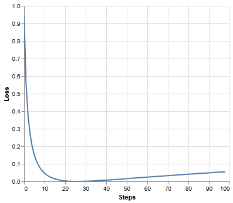
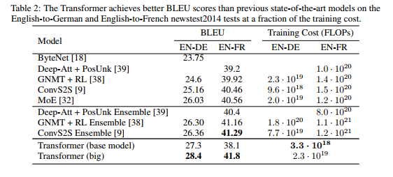

图解Transformer

[Attention is All You Need](https://arxiv.org/abs/1706.03762)


- *v2022: Austin Huang, Suraj Subramanian, Jonathan Sum, Khalid Almubarak, and Stella Biderman.*
- *[原作](https://nlp.seas.harvard.edu/2018/04/03/attention.html): [Sasha Rush](http://rush-nlp.com/).*

在过去五年里，Transformer 一直备受关注。本文以逐行实现的方式，对原论文进行了注解。我们对原论文的某些章节进行了重新排序和删减，并在全文中加入了注释。本文档本身就是一个可运行的 notebook，应当是一个完全可用的实现。代码可在此处获取：[https://github.com/harvardnlp/annotated-transformer/](https://github.com/harvardnlp/annotated-transformer/)。

### 目录

- [预备知识](https://nlp.seas.harvard.edu/annotated-transformer/#prelims)
- [背景](https://nlp.seas.harvard.edu/annotated-transformer/#background)
- [第一部分：模型架构](https://nlp.seas.harvard.edu/annotated-transformer/#part-1-model-architecture)
- [模型架构](https://nlp.seas.harvard.edu/annotated-transformer/#model-architecture)
  - [编码器和解码器堆栈](https://nlp.seas.harvard.edu/annotated-transformer/#encoder-and-decoder-stacks)
  - [逐位前馈网络](https://nlp.seas.harvard.edu/annotated-transformer/#position-wise-feed-forward-networks)
  - [嵌入和 Softmax](https://nlp.seas.harvard.edu/annotated-transformer/#embeddings-and-softmax)
  - [位置编码](https://nlp.seas.harvard.edu/annotated-transformer/#positional-encoding)
  - [完整模型](https://nlp.seas.harvard.edu/annotated-transformer/#full-model)
  - [推理：](https://nlp.seas.harvard.edu/annotated-transformer/#inference)
- [第二部分：模型训练](https://nlp.seas.harvard.edu/annotated-transformer/#part-2-model-training)
- [训练](https://nlp.seas.harvard.edu/annotated-transformer/#training)
  - [批处理和掩码](https://nlp.seas.harvard.edu/annotated-transformer/#batches-and-masking)
  - [训练循环](https://nlp.seas.harvard.edu/annotated-transformer/#training-loop)
  - [训练数据和批处理](https://nlp.seas.harvard.edu/annotated-transformer/#training-data-and-batching)
  - [硬件和计划](https://nlp.seas.harvard.edu/annotated-transformer/#hardware-and-schedule)
  - [优化器](https://nlp.seas.harvard.edu/annotated-transformer/#optimizer)
  - [正则化](https://nlp.seas.harvard.edu/annotated-transformer/#regularization)
- [第一个例子](https://nlp.seas.harvard.edu/annotated-transformer/#a-first-example)
  - [合成数据](https://nlp.seas.harvard.edu/annotated-transformer/#synthetic-data)
  - [损失计算](https://nlp.seas.harvard.edu/annotated-transformer/#loss-computation)
  - [贪心解码](https://nlp.seas.harvard.edu/annotated-transformer/#greedy-decoding)
- [第三部分：真实世界案例](https://nlp.seas.harvard.edu/annotated-transformer/#part-3-a-real-world-example)
  - [数据加载](https://nlp.seas.harvard.edu/annotated-transformer/#data-loading)
  - [迭代器](https://nlp.seas.harvard.edu/annotated-transformer/#iterators)
  - [系统训练](https://nlp.seas.harvard.edu/annotated-transformer/#training-the-system)
- [附加组件：BPE、搜索、平均化](https://nlp.seas.harvard.edu/annotated-transformer/#additional-components-bpe-search-averaging)
- [结果](https://nlp.seas.harvard.edu/annotated-transformer/#results)
  - [注意力可视化](https://nlp.seas.harvard.edu/annotated-transformer/#attention-visualization)
  - [编码器自注意力](https://nlp.seas.harvard.edu/annotated-transformer/#encoder-self-attention)
  - [解码器自注意力](https://nlp.seas.harvard.edu/annotated-transformer/#decoder-self-attention)
  - [解码器源注意力](https://nlp.seas.harvard.edu/annotated-transformer/#decoder-src-attention)
- [结论](https://nlp.seas.harvard.edu/annotated-transformer/#conclusion)

# 预备知识

[跳过](https://nlp.seas.harvard.edu/annotated-transformer/#background)

```python
# !pip install -r requirements.txt
# # 为 colab 取消注释
# #
# !pip install -q torchdata==0.3.0 torchtext==0.12 spacy==3.2 altair GPUtil
# !python -m spacy download de_core_news_sm
# !python -m spacy download en_core_web_sm
import os
from os.path import exists
import torch
import torch.nn as nn
from torch.nn.functional import log_softmax, pad
import math
import copy
import time
from torch.optim.lr_scheduler import LambdaLR
import pandas as pd
import altair as alt
from torchtext.data.functional import to_map_style_dataset
from torch.utils.data import DataLoader
from torchtext.vocab import build_vocab_from_iterator
import torchtext.datasets as datasets
import spacy
import GPUtil
import warnings
from torch.utils.data.distributed import DistributedSampler
import torch.distributed as dist
import torch.multiprocessing as mp
from torch.nn.parallel import DistributedDataParallel as DDP


# 设置为 False 以跳过 notebook 执行（例如用于调试）
warnings.filterwarnings("ignore")
RUN_EXAMPLES = True
# notebook 中使用的一些方便的辅助函数


def is_interactive_notebook():
    return __name__ == "__main__"


def show_example(fn, args=[]):
    if __name__ == "__main__" and RUN_EXAMPLES:
        return fn(*args)


def execute_example(fn, args=[]):
    if __name__ == "__main__" and RUN_EXAMPLES:
        fn(*args)


class DummyOptimizer(torch.optim.Optimizer):
    def __init__(self):
        self.param_groups = [{"lr": 0}]
        None

    def step(self):
        None

    def zero_grad(self, set_to_none=False):
        None


class DummyScheduler:
    def step(self):
        None
```

> 我的评论都放在引用块中。正文内容全部来自原论文。

# 背景

减少顺序计算的目标也构成了扩展神经 GPU、ByteNet 和 ConvS2S 的基础，它们都使用卷积神经网络作为基本构建块，为所有输入和输出位置并行计算隐藏表示。在这些模型中，关联来自两个任意输入或输出位置的信号所需的操作数量随着位置之间距离的增加而增长，对于 ConvS2S 是线性增长，对于 ByteNet 是对数增长。这使得学习远距离位置之间的依赖关系变得更加困难。在 Transformer 中，这被减少为常数数量的操作，尽管代价是由于平均注意力加权位置而降低了有效分辨率，我们用多头注意力来抵消这种影响。

自注意力，有时称为内部注意力，是一种注意力机制，它关联单个序列的不同位置，以计算序列的表示。自注意力已成功用于各种任务，包括阅读理解、摘要概括、文本蕴涵和学习任务无关的句子表示。端到端记忆网络基于循环注意力机制，而不是序列对齐的循环，并已证明在简单语言问答和语言建模任务上表现良好。

然而，据我们所知，Transformer 是第一个完全依赖自注意力来计算其输入和输出表示的转导模型，而不使用序列对齐的 RNN 或卷积。

# 第一部分：模型架构

# 模型架构

大多数有竞争力的神经序列转导模型都具有编码器-解码器结构 [(引用)](https://arxiv.org/abs/1409.0473)。在这里，编码器将符号表示的输入序列 (x1,...,xn)(*x*1,...,*x**n*) 映射到连续表示序列 z=(z1,...,zn)**z**=(*z*1,...,*z**n*)。给定 z**z**，解码器然后一次生成一个元素的符号输出序列 (y1,...,ym)(*y*1,...,*y**m*)。在每一步，模型都是自回归的 [(引用)](https://arxiv.org/abs/1308.0850)，在生成下一个符号时，将先前生成的符号作为附加输入。

```python
class EncoderDecoder(nn.Module):
    """
    一个标准的编码器-解码器架构。这是该模型和许多其他模型的基础。
    """

    def __init__(self, encoder, decoder, src_embed, tgt_embed, generator):
        super(EncoderDecoder, self).__init__()
        self.encoder = encoder
        self.decoder = decoder
        self.src_embed = src_embed
        self.tgt_embed = tgt_embed
        self.generator = generator

    def forward(self, src, tgt, src_mask, tgt_mask):
        """接收并处理带掩码的源序列和目标序列。"""
        return self.decode(self.encode(src, src_mask), src_mask, tgt, tgt_mask)

    def encode(self, src, src_mask):
        return self.encoder(self.src_embed(src), src_mask)

    def decode(self, memory, src_mask, tgt, tgt_mask):
        return self.decoder(self.tgt_embed(tgt), memory, src_mask, tgt_mask)
class Generator(nn.Module):
    "定义标准的线性 + softmax 生成步骤。"

    def __init__(self, d_model, vocab):
        super(Generator, self).__init__()
        self.proj = nn.Linear(d_model, vocab)

    def forward(self, x):
        return log_softmax(self.proj(x), dim=-1)
```

Transformer 遵循这种整体架构，对编码器和解码器都使用堆叠的自注意力和逐点、全连接层，分别如图 1 的左半部分和右半部分所示。


## 编码器和解码器堆栈

### 编码器

编码器由 N=6*N*=6 个相同层的堆栈组成。

```python
def clones(module, N):
    "生成 N 个相同的层。"
    return nn.ModuleList([copy.deepcopy(module) for _ in range(N)])
class Encoder(nn.Module):
    "核心编码器是 N 个层的堆栈"

    def __init__(self, layer, N):
        super(Encoder, self).__init__()
        self.layers = clones(layer, N)
        self.norm = LayerNorm(layer.size)

    def forward(self, x, mask):
        "依次将输入（和掩码）通过每个层。"
        for layer in self.layers:
            x = layer(x, mask)
        return self.norm(x)
```

我们在两个子层的每一个周围都使用了一个残差连接 [(引用)](https://arxiv.org/abs/1512.03385)，然后是层归一化 [(引用)](https://arxiv.org/abs/1607.06450)。

```python
class LayerNorm(nn.Module):
    "构建一个层归一化模块（详见引用）。"

    def __init__(self, features, eps=1e-6):
        super(LayerNorm, self).__init__()
        self.a_2 = nn.Parameter(torch.ones(features))
        self.b_2 = nn.Parameter(torch.zeros(features))
        self.eps = eps

    def forward(self, x):
        mean = x.mean(-1, keepdim=True)
        std = x.std(-1, keepdim=True)
        return self.a_2 * (x - mean) / (std + self.eps) + self.b_2
```

也就是说，每个子层的输出是 LayerNorm(x+Sublayer(x))LayerNorm(*x*+Sublayer(*x*))，其中 Sublayer(x)Sublayer(*x*) 是由子层本身实现的函数。我们在每个子层的输出上应用 dropout [(引用)](http://jmlr.org/papers/v15/srivastava14a.html)，然后将其添加到子层输入并进行归一化。

为了方便这些残差连接，模型中的所有子层以及嵌入层都产生维度为 dmodel=512*d*model=512 的输出。

```python
class SublayerConnection(nn.Module):
    """
    一个残差连接，后跟一个层归一化。
    注意，为了代码简洁，归一化在前面而不是最后。
    """

    def __init__(self, size, dropout):
        super(SublayerConnection, self).__init__()
        self.norm = LayerNorm(size)
        self.dropout = nn.Dropout(dropout)

    def forward(self, x, sublayer):
        """将残差连接应用于任何具有相同大小的子层。"""
        return x + self.dropout(sublayer(self.norm(x)))
```

每个层有两个子层。第一个是多头自注意力机制，第二个是简单的、逐位的全连接前馈网络。

```python
class EncoderLayer(nn.Module):
    "编码器由自注意力和前馈网络组成（定义如下）"

    def __init__(self, size, self_attn, feed_forward, dropout):
        super(EncoderLayer, self).__init__()
        self.self_attn = self_attn
        self.feed_forward = feed_forward
        self.sublayer = clones(SublayerConnection(size, dropout), 2)
        self.size = size

    def forward(self, x, mask):
        "按照图 1（左）的连接方式。"
        x = self.sublayer[0](x, lambda x: self.self_attn(x, x, x, mask))
        return self.sublayer[1](x, self.feed_forward)
```

### 解码器

解码器也由 N=6*N*=6 个相同层的堆栈组成。

```python
class Decoder(nn.Module):
    "带掩码的通用 N 层解码器。"

    def __init__(self, layer, N):
        super(Decoder, self).__init__()
        self.layers = clones(layer, N)
        self.norm = LayerNorm(layer.size)

    def forward(self, x, memory, src_mask, tgt_mask):
        for layer in self.layers:
            x = layer(x, memory, src_mask, tgt_mask)
        return self.norm(x)
```

除了每个编码器层中的两个子层外，解码器还插入了第三个子层，该子层对编码器堆栈的输出执行多头注意力。与编码器类似，我们在每个子层周围都使用了残差连接，然后是层归一化。

```python
class DecoderLayer(nn.Module):
    "解码器由自注意力、源注意力和前馈网络组成（定义如下）"

    def __init__(self, size, self_attn, src_attn, feed_forward, dropout):
        super(DecoderLayer, self).__init__()
        self.size = size
        self.self_attn = self_attn
        self.src_attn = src_attn
        self.feed_forward = feed_forward
        self.sublayer = clones(SublayerConnection(size, dropout), 3)

    def forward(self, x, memory, src_mask, tgt_mask):
        "按照图 1（右）的连接方式。"
        m = memory
        x = self.sublayer[0](x, lambda x: self.self_attn(x, x, x, tgt_mask))
        x = self.sublayer[1](x, lambda x: self.src_attn(x, m, m, src_mask))
        return self.sublayer[2](x, self.feed_forward)
```

我们还修改了解码器堆栈中的自注意力子层，以防止位置关注后续位置。这种掩码，再加上输出嵌入被偏移一个位置的事实，确保了对位置 i*i* 的预测只能依赖于小于 i*i* 的已知输出。

```python
def subsequent_mask(size):
    "屏蔽掉后续位置。"
    attn_shape = (1, size, size)
    subsequent_mask = torch.triu(torch.ones(attn_shape), diagonal=1).type(
        torch.uint8
    )
    return subsequent_mask == 0
```

> 下面的注意力掩码显示了每个目标词（行）被允许查看的位置（列）。在训练期间，词语被阻止关注未来的词语。

```python
def example_mask():
    LS_data = pd.concat(
        [
            pd.DataFrame(
                {
                    "Subsequent Mask": subsequent_mask(20)[0][x, y].flatten(),
                    "Window": y,
                    "Masking": x,
                }
            )
            for y in range(20)
            for x in range(20)
        ]
    )

    return (
        alt.Chart(LS_data)
        .mark_rect()
        .properties(height=250, width=250)
        .encode(
            alt.X("Window:O"),
            alt.Y("Masking:O"),
            alt.Color("Subsequent Mask:Q", scale=alt.Scale(scheme="viridis")),
        )
        .interactive()
    )


show_example(example_mask)
```


### 注意力

注意力函数可以描述为将一个查询和一组键值对映射到一个输出，其中查询、键、值和输出都是向量。输出是值的加权和，其中分配给每个值的权重由查询与相应键的兼容性函数计算。

我们称我们特定的注意力为“缩放点积注意力”。输入由维度为 dk*d**k* 的查询和键，以及维度为 dv*d**v* 的值组成。我们计算查询与所有键的点积，将每个点积除以 dk*d**k*，然后应用 softmax 函数以获得值的权重。


在实践中，我们同时计算一组查询的注意力函数，将它们打包成一个矩阵 Q*Q*。键和值也分别打包成矩阵 K*K* 和 V*V*。我们计算输出矩阵如下：

Attention(Q,K,V)=softmax(QKTdk)VAttention(*Q*,*K*,*V*)=softmax(*d**k**Q**K**T*)*V*

```python
def attention(query, key, value, mask=None, dropout=None):
    """计算'缩放点积注意力'"""
    d_k = query.size(-1)
    scores = torch.matmul(query, key.transpose(-2, -1)) / math.sqrt(d_k)
    if mask is not None:
        scores = scores.masked_fill(mask == 0, -1e9)
    p_attn = scores.softmax(dim=-1)
    if dropout is not None:
        p_attn = dropout(p_attn)
    return torch.matmul(p_attn, value), p_attn
```

两种最常用的注意力函数是加性注意力 [(引用)](https://arxiv.org/abs/1409.0473) 和点积（乘性）注意力。点积注意力与我们的算法相同，除了缩放因子 1dk*d**k*1。加性注意力使用带有单个隐藏层的前馈网络来计算兼容性函数。虽然两者在理论复杂性上相似，但点积注意力在实践中速度更快，空间效率更高，因为它可以使用高度优化的矩阵乘法代码来实现。

虽然对于较小的 dk*d**k* 值，两种机制的性能相似，但对于较大的 dk*d**k* 值，加性注意力在没有缩放的情况下优于点积注意力 [(引用)](https://arxiv.org/abs/1703.03906)。我们怀疑对于较大的 dk*d**k* 值，点积的幅度会变大，将 softmax 函数推入梯度极小的区域（为了说明为什么点积会变大，假设 q*q* 和 k*k* 的分量是均值为 00、方差为 11 的独立随机变量。那么它们的点积 q⋅k=∑i=1dkqiki*q*⋅*k*=∑*i*=1*d**k**q**i**k**i* 的均值为 00，方差为 dk*d**k*）。为了抵消这种影响，我们将点积缩放 1dk*d**k*1。


多头注意力允许模型在不同位置联合关注来自不同表示子空间的信息。使用单个注意力头时，平均化会抑制这一点。

MultiHead(Q,K,V)=Concat(head1,...,headh)WO其中 headi=Attention(QWiQ,KWiK,VWiV)MultiHead(*Q*,*K*,*V*)=Concat(head1,...,headh)*W**O*其中 headi=Attention(*Q**W**i**Q*,*K**W**i**K*,*V**W**i**V*)

其中投影是参数矩阵 WiQ∈Rdmodel×dk*W**i**Q*∈R*d*model×*d**k*, WiK∈Rdmodel×dk*W**i**K*∈R*d*model×*d**k*, WiV∈Rdmodel×dv*W**i**V*∈R*d*model×*d**v* 和 WO∈Rhdv×dmodel*W**O*∈R*h**d**v*×*d*model。

在这项工作中，我们使用 h=8*h*=8 个并行的注意力层，或称为头。对于每个头，我们使用 dk=dv=dmodel/h=64*d**k*=*d**v*=*d*model/*h*=64。由于每个头的维度减小，总计算成本与全维度的单头注意力相似。

```python
class MultiHeadedAttention(nn.Module):
    def __init__(self, h, d_model, dropout=0.1):
        """接收模型大小和头的数量。"""
        super(MultiHeadedAttention, self).__init__()
        assert d_model % h == 0
        # 我们假设 d_v 总是等于 d_k
        self.d_k = d_model // h
        self.h = h
        self.linears = clones(nn.Linear(d_model, d_model), 4)
        self.attn = None
        self.dropout = nn.Dropout(p=dropout)

    def forward(self, query, key, value, mask=None):
        """实现图 2"""
        if mask is not None:
            # 相同的掩码应用于所有 h 个头。
            mask = mask.unsqueeze(1)
        nbatches = query.size(0)

        # 1) 在批处理中进行所有线性投影，从 d_model => h x d_k
        query, key, value = [
            lin(x).view(nbatches, -1, self.h, self.d_k).transpose(1, 2)
            for lin, x in zip(self.linears, (query, key, value))
        ]

        # 2) 在批处理中对所有投影向量应用注意力。
        x, self.attn = attention(
            query, key, value, mask=mask, dropout=self.dropout
        )

        # 3) 使用 view 进行“连接”，并应用最终的线性层。
        x = (
            x.transpose(1, 2)
            .contiguous()
            .view(nbatches, -1, self.h * self.d_k)
        )
        del query
        del key
        del value
        return self.linears[-1](x)
```

### 模型中注意力的应用

Transformer 以三种不同的方式使用多头注意力： 1) 在“编码器-解码器注意力”层中，查询来自前一个解码器层，而记忆键和值来自编码器的输出。这允许解码器中的每个位置关注输入序列中的所有位置。这模仿了序列到序列模型中典型的编码器-解码器注意力机制，例如 [(引用)](https://arxiv.org/abs/1609.08144)。

1. 编码器包含自注意力层。在自注意力层中，所有的键、值和查询都来自同一个地方，即编码器中前一层的输出。编码器中的每个位置都可以关注编码器前一层的所有位置。
2. 同样，解码器中的自注意力层允许解码器中的每个位置关注解码器中直到并包括该位置的所有位置。我们需要防止解码器中的向左信息流，以保持自回归属性。我们在缩放点积注意力内部通过屏蔽掉（设置为 −∞−∞）softmax 输入中对应于非法连接的所有值来实现这一点。

## 逐位前馈网络

除了注意力子层，我们的编码器和解码器中的每个层都包含一个全连接的前馈网络，该网络分别且相同地应用于每个位置。这包括两个线性变换，中间有一个 ReLU 激活函数。

FFN(x)=max⁡(0,xW1+b1)W2+b2FFN(*x*)=max(0,*x**W*1+*b*1)*W*2+*b*2

虽然线性变换在不同位置上是相同的，但它们在不同层之间使用不同的参数。另一种描述方式是将其视为两个核大小为 1 的卷积。输入和输出的维度是 dmodel=512*d*model=512，内层的维度是 dff=2048*d**ff*=2048。

```python
class PositionwiseFeedForward(nn.Module):
    """实现 FFN 方程。"""

    def __init__(self, d_model, d_ff, dropout=0.1):
        super(PositionwiseFeedForward, self).__init__()
        self.w_1 = nn.Linear(d_model, d_ff)
        self.w_2 = nn.Linear(d_ff, d_model)
        self.dropout = nn.Dropout(dropout)

    def forward(self, x):
        return self.w_2(self.dropout(self.w_1(x).relu()))
```

## 嵌入和 Softmax

与其他序列转导模型类似，我们使用学习到的嵌入将输入词元和输出词元转换为维度为 dmodel*d*model 的向量。我们还使用通常的学习到的线性变换和 softmax 函数将解码器输出转换为预测的下一个词元概率。在我们的模型中，我们在两个嵌入层和 softmax 前的线性变换之间共享相同的权重矩阵，类似于 [(引用)](https://arxiv.org/abs/1608.05859)。在嵌入层中，我们将这些权重乘以 dmodel*d*model。

```python
class Embeddings(nn.Module):
    def __init__(self, d_model, vocab):
        super(Embeddings, self).__init__()
        self.lut = nn.Embedding(vocab, d_model)
        self.d_model = d_model

    def forward(self, x):
        return self.lut(x) * math.sqrt(self.d_model)
```

## 位置编码

由于我们的模型不包含循环和卷积，为了让模型能够利用序列的顺序，我们必须注入一些关于序列中词元相对或绝对位置的信息。为此，我们在编码器和解码器堆栈底部的输入嵌入中添加“位置编码”。位置编码与嵌入具有相同的维度 dmodel*d*model，因此两者可以相加。位置编码有多种选择，包括学习的和固定的 [(引用)](https://arxiv.org/pdf/1705.03122.pdf)。

在这项工作中，我们使用不同频率的正弦和余弦函数：

PE(pos,2i)=sin⁡(pos/100002i/dmodel)*P**E*(*p**os*,2*i*)=sin(*p**os*/100002*i*/*d*model)

PE(pos,2i+1)=cos⁡(pos/100002i/dmodel)*P**E*(*p**os*,2*i*+1)=cos(*p**os*/100002*i*/*d*model)

其中 pos*p**os* 是位置，i*i* 是维度。也就是说，位置编码的每个维度对应一个正弦曲线。波长从 2π2*π* 到 10000⋅2π10000⋅2*π* 形成一个几何级数。我们选择这个函数是因为我们假设它能让模型轻松地学习通过相对位置进行关注，因为对于任何固定的偏移量 k*k*，PEpos+k*P**E**p**os*+*k* 可以表示为 PEpos*P**E**p**os* 的线性函数。

此外，我们在编码器和解码器堆栈中都对嵌入和位置编码的总和应用了 dropout。对于基础模型，我们使用的比率为 Pdrop=0.1*P**d**ro**p*=0.1。

```python
class PositionalEncoding(nn.Module):
    """实现 PE 函数。"""

    def __init__(self, d_model, dropout, max_len=5000):
        super(PositionalEncoding, self).__init__()
        self.dropout = nn.Dropout(p=dropout)

        # 在对数空间中一次性计算位置编码。
        pe = torch.zeros(max_len, d_model)
        position = torch.arange(0, max_len).unsqueeze(1)
        div_term = torch.exp(
            torch.arange(0, d_model, 2) * -(math.log(10000.0) / d_model)
        )
        pe[:, 0::2] = torch.sin(position * div_term)
        pe[:, 1::2] = torch.cos(position * div_term)
        pe = pe.unsqueeze(0)
        self.register_buffer("pe", pe)

    def forward(self, x):
        x = x + self.pe[:, : x.size(1)].requires_grad_(False)
        return self.dropout(x)
```

> 下面的位置编码将根据位置添加一个正弦波。每个维度的波的频率和偏移量都不同。

```python
def example_positional():
    pe = PositionalEncoding(20, 0)
    y = pe.forward(torch.zeros(1, 100, 20))

    data = pd.concat(
        [
            pd.DataFrame(
                {
                    "embedding": y[0, :, dim],
                    "dimension": dim,
                    "position": list(range(100)),
                }
            )
            for dim in [4, 5, 6, 7]
        ]
    )

    return (
        alt.Chart(data)
        .mark_line()
        .properties(width=800)
        .encode(x="position", y="embedding", color="dimension:N")
        .interactive()
    )


show_example(example_positional)
```


我们还尝试了使用学习到的位置嵌入 [(引用)](https://arxiv.org/pdf/1705.03122.pdf)，发现两个版本产生了几乎相同的结果。我们选择了正弦版本，因为它可能允许模型外推到比训练中遇到的序列更长的序列。

## 完整模型

> 这里我们定义一个从超参数到完整模型的函数。

```python
def make_model(
    src_vocab, tgt_vocab, N=6, d_model=512, d_ff=2048, h=8, dropout=0.1
):
    """辅助函数：从超参数构建一个模型。"""
    c = copy.deepcopy
    attn = MultiHeadedAttention(h, d_model)
    ff = PositionwiseFeedForward(d_model, d_ff, dropout)
    position = PositionalEncoding(d_model, dropout)
    model = EncoderDecoder(
        Encoder(EncoderLayer(d_model, c(attn), c(ff), dropout), N),
        Decoder(DecoderLayer(d_model, c(attn), c(attn), c(ff), dropout), N),
        nn.Sequential(Embeddings(d_model, src_vocab), c(position)),
        nn.Sequential(Embeddings(d_model, tgt_vocab), c(position)),
        Generator(d_model, tgt_vocab),
    )

    # 这在他们的代码中很重要。
    # 使用 Glorot / fan_avg 初始化参数。
    for p in model.parameters():
        if p.dim() > 1:
            nn.init.xavier_uniform_(p)
    return model
```

## 推理：

> 这里我们进行一个前向步骤来生成模型的预测。我们尝试使用我们的 transformer 来记忆输入。你会看到输出是随机生成的，因为模型还没有训练。在下一个教程中，我们将构建训练函数并尝试训练我们的模型来记忆从 1 到 10 的数字。

```python
def inference_test():
    test_model = make_model(11, 11, 2)
    test_model.eval()
    src = torch.LongTensor([[1, 2, 3, 4, 5, 6, 7, 8, 9, 10]])
    src_mask = torch.ones(1, 1, 10)

    memory = test_model.encode(src, src_mask)
    ys = torch.zeros(1, 1).type_as(src)

    for i in range(9):
        out = test_model.decode(
            memory, src_mask, ys, subsequent_mask(ys.size(1)).type_as(src.data)
        )
        prob = test_model.generator(out[:, -1])
        _, next_word = torch.max(prob, dim=1)
        next_word = next_word.data[0]
        ys = torch.cat(
            [ys, torch.empty(1, 1).type_as(src.data).fill_(next_word)], dim=1
        )

    print("未训练模型的示例预测:", ys)


def run_tests():
    for _ in range(10):
        inference_test()


show_example(run_tests)
未训练模型的示例预测: tensor([[0, 0, 0, 0, 0, 0, 0, 0, 0, 0]])
未训练模型的示例预测: tensor([[0, 3, 4, 4, 4, 4, 4, 4, 4, 4]])
未训练模型的示例预测: tensor([[ 0, 10, 10, 10,  3,  2,  5,  7,  9,  6]])
未训练模型的示例预测: tensor([[ 0,  4,  3,  6, 10, 10,  2,  6,  2,  2]])
未训练模型的示例预测: tensor([[ 0,  9,  0,  1,  5, 10,  1,  5, 10,  6]])
未训练模型的示例预测: tensor([[ 0,  1,  5,  1, 10,  1, 10, 10, 10, 10]])
未训练模型的示例预测: tensor([[ 0,  1, 10,  9,  9,  9,  9,  9,  1,  5]])
未训练模型的示例预测: tensor([[ 0,  3,  1,  5, 10, 10, 10, 10, 10, 10]])
未训练模型的示例预测: tensor([[ 0,  3,  5, 10,  5, 10,  4,  2,  4,  2]])
未训练模型的示例预测: tensor([[0, 5, 6, 2, 5, 6, 2, 6, 2, 2]])
```

# 第二部分：模型训练

# 训练

本节描述我们模型的训练方案。

> 我们先暂停一下，介绍一些训练标准编码器解码器模型所需的工具。首先，我们定义一个批处理对象，用于在训练期间保存源句和目标句，以及构建掩码。

## 批处理和掩码

```python
class Batch:
    """用于在训练期间保存带掩码的一批数据的对象。"""

    def __init__(self, src, tgt=None, pad=2):  # 2 = <blank>
        self.src = src
        self.src_mask = (src != pad).unsqueeze(-2)
        if tgt is not None:
            self.tgt = tgt[:, :-1]
            self.tgt_y = tgt[:, 1:]
            self.tgt_mask = self.make_std_mask(self.tgt, pad)
            self.ntokens = (self.tgt_y != pad).data.sum()

    @staticmethod
    def make_std_mask(tgt, pad):
        """创建一个掩码来隐藏填充和未来的词。"""
        tgt_mask = (tgt != pad).unsqueeze(-2)
        tgt_mask = tgt_mask & subsequent_mask(tgt.size(-1)).type_as(
            tgt_mask.data
        )
        return tgt_mask
```

> 接下来，我们创建一个通用的训练和评分函数来跟踪损失。我们传入一个通用的损失计算函数，该函数也处理参数更新。

## 训练循环

```python
class TrainState:
    """跟踪处理的步数、样本数和词元数"""

    step: int = 0  # 当前 epoch 中的步数
    accum_step: int = 0  # 梯度累积步数
    samples: int = 0  # 使用的总样本数
    tokens: int = 0  # 处理的总词元数
def run_epoch(
    data_iter,
    model,
    loss_compute,
    optimizer,
    scheduler,
    mode="train",
    accum_iter=1,
    train_state=TrainState(),
):
    """训练一个 epoch"""
    start = time.time()
    total_tokens = 0
    total_loss = 0
    tokens = 0
    n_accum = 0
    for i, batch in enumerate(data_iter):
        out = model.forward(
            batch.src, batch.tgt, batch.src_mask, batch.tgt_mask
        )
        loss, loss_node = loss_compute(out, batch.tgt_y, batch.ntokens)
        # loss_node = loss_node / accum_iter
        if mode == "train" or mode == "train+log":
            loss_node.backward()
            train_state.step += 1
            train_state.samples += batch.src.shape[0]
            train_state.tokens += batch.ntokens
            if i % accum_iter == 0:
                optimizer.step()
                optimizer.zero_grad(set_to_none=True)
                n_accum += 1
                train_state.accum_step += 1
            scheduler.step()

        total_loss += loss
        total_tokens += batch.ntokens
        tokens += batch.ntokens
        if i % 40 == 1 and (mode == "train" or mode == "train+log"):
            lr = optimizer.param_groups[0]["lr"]
            elapsed = time.time() - start
            print(
                (
                    "Epoch 步数: %6d | 累积步数: %3d | 损失: %6.2f "
                    + "| 词元/秒: %7.1f | 学习率: %6.1e"
                )
                % (i, n_accum, loss / batch.ntokens, tokens / elapsed, lr)
            )
            start = time.time()
            tokens = 0
        del loss
        del loss_node
    return total_loss / total_tokens, train_state
```

## 训练数据和批处理

我们在标准的 WMT 2014 英德数据集上进行了训练，该数据集包含约 450 万个句子对。句子使用字节对编码进行编码，该编码具有约 37000 个词元的共享源-目标词汇表。对于英法翻译，我们使用了更大的 WMT 2014 英法数据集，包含 3600 万个句子，并将词元分割成一个 32000 个词片的词汇表。

句子对按近似序列长度进行批处理。每个训练批次包含一组句子对，其中包含约 25000 个源词元和 25000 个目标词元。

## 硬件和计划

我们在一个拥有 8 个 NVIDIA P100 GPU 的机器上训练我们的模型。对于我们使用本文所述超参数的基础模型，每个训练步骤耗时约 0.4 秒。我们总共训练了 100,000 步，即 12 小时。对于我们的大型模型，步长时间为 1.0 秒。大型模型训练了 300,000 步（3.5 天）。

## 优化器

我们使用了 Adam 优化器 [(引用)](https://arxiv.org/abs/1412.6980)，其中 β1=0.9*β*1=0.9，β2=0.98*β*2=0.98，ϵ=10−9*ϵ*=10−9。我们在训练过程中根据以下公式改变学习率：

lrate=dmodel−0.5⋅min⁡(step_num−0.5,step_num⋅warmup_steps−1.5)*l**r**a**t**e*=*d*model−0.5⋅min(*s**t**e**p*_*n**u**m*−0.5,*s**t**e**p*_*n**u**m*⋅*w**a**r**m**u**p*_*s**t**e**p**s*−1.5)

这对应于在第一个 warmup_steps*w**a**r**m**u**p*_*s**t**e**p**s* 训练步骤中线性增加学习率，然后按步数的平方根倒数成比例地减小学习率。我们使用了 warmup_steps=4000*w**a**r**m**u**p*_*s**t**e**p**s*=4000。

> 注意：这部分非常重要。需要使用这种模型设置进行训练。

> 不同模型大小和优化超参数下该模型曲线的示例。

```python
def rate(step, model_size, factor, warmup):
    """
    我们必须将 LambdaLR 函数的步数默认为 1，
    以避免零的负幂次方。
    """
    if step == 0:
        step = 1
    return factor * (
        model_size ** (-0.5) * min(step ** (-0.5), step * warmup ** (-1.5))
    )
def example_learning_schedule():
    opts = [
        [512, 1, 4000],  # 示例 1
        [512, 1, 8000],  # 示例 2
        [256, 1, 4000],  # 示例 3
    ]

    dummy_model = torch.nn.Linear(1, 1)
    learning_rates = []

    # opts 列表中有 3 个示例。
    for idx, example in enumerate(opts):
        # 每个示例运行 20000 个 epoch
        optimizer = torch.optim.Adam(
            dummy_model.parameters(), lr=1, betas=(0.9, 0.98), eps=1e-9
        )
        lr_scheduler = LambdaLR(
            optimizer=optimizer, lr_lambda=lambda step: rate(step, *example)
        )
        tmp = []
        # 进行 20K 次虚拟训练步骤，保存每一步的学习率
        for step in range(20000):
            tmp.append(optimizer.param_groups[0]["lr"])
            optimizer.step()
            lr_scheduler.step()
        learning_rates.append(tmp)

    learning_rates = torch.tensor(learning_rates)

    # 启用 altair 处理超过 5000 行
    alt.data_transformers.disable_max_rows()

    opts_data = pd.concat(
        [
            pd.DataFrame(
                {
                    "Learning Rate": learning_rates[warmup_idx, :],
                    "model_size:warmup": ["512:4000", "512:8000", "256:4000"][
                        warmup_idx
                    ],
                    "step": range(20000),
                }
            )
            for warmup_idx in [0, 1, 2]
        ]
    )

    return (
        alt.Chart(opts_data)
        .mark_line()
        .properties(width=600)
        .encode(x="step", y="Learning Rate", color="model_size:warmup:N")
        .interactive()
    )


example_learning_schedule()
```


## 正则化

### 标签平滑

在训练期间，我们使用了值为 ϵls=0.1*ϵ**l**s*=0.1 的标签平滑 [(引用)](https://arxiv.org/abs/1512.00567)。这会损害困惑度，因为模型学会了更加不确定，但提高了准确率和 BLEU 分数。

> 我们使用 KL 散度损失来实现标签平滑。我们不使用 one-hot 目标分布，而是创建一个分布，该分布具有正确词的 `confidence`，其余的 `smoothing` 质量分布在整个词汇表中。

```python
class LabelSmoothing(nn.Module):
    """实现标签平滑。"""

    def __init__(self, size, padding_idx, smoothing=0.0):
        super(LabelSmoothing, self).__init__()
        self.criterion = nn.KLDivLoss(reduction="sum")
        self.padding_idx = padding_idx
        self.confidence = 1.0 - smoothing
        self.smoothing = smoothing
        self.size = size
        self.true_dist = None

    def forward(self, x, target):
        assert x.size(1) == self.size
        true_dist = x.data.clone()
        true_dist.fill_(self.smoothing / (self.size - 2))
        true_dist.scatter_(1, target.data.unsqueeze(1), self.confidence)
        true_dist[:, self.padding_idx] = 0
        mask = torch.nonzero(target.data == self.padding_idx)
        if mask.dim() > 0:
            true_dist.index_fill_(0, mask.squeeze(), 0.0)
        self.true_dist = true_dist
        return self.criterion(x, true_dist.clone().detach())
```

> 这里我们可以看到一个例子，说明质量如何根据置信度分布到单词上。

```python
# 标签平滑的例子。


def example_label_smoothing():
    crit = LabelSmoothing(5, 0, 0.4)
    predict = torch.FloatTensor(
        [
            [0, 0.2, 0.7, 0.1, 0],
            [0, 0.2, 0.7, 0.1, 0],
            [0, 0.2, 0.7, 0.1, 0],
            [0, 0.2, 0.7, 0.1, 0],
            [0, 0.2, 0.7, 0.1, 0],
        ]
    )
    crit(x=predict.log(), target=torch.LongTensor([2, 1, 0, 3, 3]))
    LS_data = pd.concat(
        [
            pd.DataFrame(
                {
                    "target distribution": crit.true_dist[x, y].flatten(),
                    "columns": y,
                    "rows": x,
                }
            )
            for y in range(5)
            for x in range(5)
        ]
    )

    return (
        alt.Chart(LS_data)
        .mark_rect(color="Blue", opacity=1)
        .properties(height=200, width=200)
        .encode(
            alt.X("columns:O", title=None),
            alt.Y("rows:O", title=None),
            alt.Color(
                "target distribution:Q", scale=alt.Scale(scheme="viridis")
            ),
        )
        .interactive()
    )


show_example(example_label_smoothing)
```


> 标签平滑实际上会在模型对某个选择非常自信时开始惩罚模型。

```python
def loss(x, crit):
    d = x + 3 * 1
    predict = torch.FloatTensor([[0, x / d, 1 / d, 1 / d, 1 / d]])
    return crit(predict.log(), torch.LongTensor([1])).data


def penalization_visualization():
    crit = LabelSmoothing(5, 0, 0.1)
    loss_data = pd.DataFrame(
        {
            "Loss": [loss(x, crit) for x in range(1, 100)],
            "Steps": list(range(99)),
        }
    ).astype("float")

    return (
        alt.Chart(loss_data)
        .mark_line()
        .properties(width=350)
        .encode(
            x="Steps",
            y="Loss",
        )
        .interactive()
    )


show_example(penalization_visualization)
```



# 第一个例子

> 我们可以从一个简单的复制任务开始。给定一小组词汇表中的一组随机输入符号，目标是生成相同的符号。

## 合成数据

```python
def data_gen(V, batch_size, nbatches):
    """为 src-tgt 复制任务生成随机数据。"""
    for i in range(nbatches):
        data = torch.randint(1, V, size=(batch_size, 10))
        data[:, 0] = 1
        src = data.requires_grad_(False).clone().detach()
        tgt = data.requires_grad_(False).clone().detach()
        yield Batch(src, tgt, 0)
```

## 损失计算

```python
class SimpleLossCompute:
    """一个简单的损失计算和训练函数。"""

    def __init__(self, generator, criterion):
        self.generator = generator
        self.criterion = criterion

    def __call__(self, x, y, norm):
        x = self.generator(x)
        sloss = (
            self.criterion(
                x.contiguous().view(-1, x.size(-1)), y.contiguous().view(-1)
            )
            / norm
        )
        return sloss.data * norm, sloss
```

## 贪心解码

> 这段代码为了简单起见，使用贪心解码来预测翻译。

```python
def greedy_decode(model, src, src_mask, max_len, start_symbol):
    memory = model.encode(src, src_mask)
    ys = torch.zeros(1, 1).fill_(start_symbol).type_as(src.data)
    for i in range(max_len - 1):
        out = model.decode(
            memory, src_mask, ys, subsequent_mask(ys.size(1)).type_as(src.data)
        )
        prob = model.generator(out[:, -1])
        _, next_word = torch.max(prob, dim=1)
        next_word = next_word.data[0]
        ys = torch.cat(
            [ys, torch.zeros(1, 1).type_as(src.data).fill_(next_word)], dim=1
        )
    return ys
# 训练简单的复制任务。


def example_simple_model():
    V = 11
    criterion = LabelSmoothing(size=V, padding_idx=0, smoothing=0.0)
    model = make_model(V, V, N=2)

    optimizer = torch.optim.Adam(
        model.parameters(), lr=0.5, betas=(0.9, 0.98), eps=1e-9
    )
    lr_scheduler = LambdaLR(
        optimizer=optimizer,
        lr_lambda=lambda step: rate(
            step, model_size=model.src_embed[0].d_model, factor=1.0, warmup=400
        ),
    )

    batch_size = 80
    for epoch in range(20):
        model.train()
        run_epoch(
            data_gen(V, batch_size, 20),
            model,
            SimpleLossCompute(model.generator, criterion),
            optimizer,
            lr_scheduler,
            mode="train",
        )
        model.eval()
        run_epoch(
            data_gen(V, batch_size, 5),
            model,
            SimpleLossCompute(model.generator, criterion),
            DummyOptimizer(),
            DummyScheduler(),
            mode="eval",
        )[0]

    model.eval()
    src = torch.LongTensor([[0, 1, 2, 3, 4, 5, 6, 7, 8, 9]])
    max_len = src.shape[1]
    src_mask = torch.ones(1, 1, max_len)
    print(greedy_decode(model, src, src_mask, max_len=max_len, start_symbol=0))


# execute_example(example_simple_model)
```

# 第三部分：真实世界案例

> 现在我们考虑一个使用 Multi30k 德英翻译任务的真实世界案例。这个任务比论文中考虑的 WMT 任务小得多，但它展示了整个系统。我们还展示了如何使用多 GPU 处理来使其真正快速。

## 数据加载

> 我们将使用 torchtext 和 spacy 加载数据集进行分词。

```python
# 加载 spacy 分词器模型，如果尚未下载则下载


def load_tokenizers():

    try:
        spacy_de = spacy.load("de_core_news_sm")
    except IOError:
        os.system("python -m spacy download de_core_news_sm")
        spacy_de = spacy.load("de_core_news_sm")

    try:
        spacy_en = spacy.load("en_core_web_sm")
    except IOError:
        os.system("python -m spacy download en_core_web_sm")
        spacy_en = spacy.load("en_core_web_sm")

    return spacy_de, spacy_en
def tokenize(text, tokenizer):
    return [tok.text for tok in tokenizer.tokenizer(text)]


def yield_tokens(data_iter, tokenizer, index):
    for from_to_tuple in data_iter:
        yield tokenizer(from_to_tuple[index])
def build_vocabulary(spacy_de, spacy_en):
    def tokenize_de(text):
        return tokenize(text, spacy_de)

    def tokenize_en(text):
        return tokenize(text, spacy_en)

    print("正在构建德语词汇表 ...")
    train, val, test = datasets.Multi30k(language_pair=("de", "en"))
    vocab_src = build_vocab_from_iterator(
        yield_tokens(train + val + test, tokenize_de, index=0),
        min_freq=2,
        specials=["<s>", "</s>", "<blank>", "<unk>"],
    )

    print("正在构建英语词汇表 ...")
    train, val, test = datasets.Multi30k(language_pair=("de", "en"))
    vocab_tgt = build_vocab_from_iterator(
        yield_tokens(train + val + test, tokenize_en, index=1),
        min_freq=2,
        specials=["<s>", "</s>", "<blank>", "<unk>"],
    )

    vocab_src.set_default_index(vocab_src["<unk>"])
    vocab_tgt.set_default_index(vocab_tgt["<unk>"])

    return vocab_src, vocab_tgt


def load_vocab(spacy_de, spacy_en):
    if not exists("vocab.pt"):
        vocab_src, vocab_tgt = build_vocabulary(spacy_de, spacy_en)
        torch.save((vocab_src, vocab_tgt), "vocab.pt")
    else:
        vocab_src, vocab_tgt = torch.load("vocab.pt")
    print("完成。\n词汇表大小：")
    print(len(vocab_src))
    print(len(vocab_tgt))
    return vocab_src, vocab_tgt


if is_interactive_notebook():
    # 稍后在脚本中使用的全局变量
    spacy_de, spacy_en = show_example(load_tokenizers)
    vocab_src, vocab_tgt = show_example(load_vocab, args=[spacy_de, spacy_en])
完成。
词汇表大小：
59981
36745
```

> 批处理对速度至关重要。我们希望批次划分得非常均匀，填充量绝对最小。为此，我们必须对默认的 torchtext 批处理进行一些修改。这段代码修补了它们的默认批处理，以确保我们搜索足够多的句子来找到紧凑的批次。

## 迭代器

```python
def collate_batch(
    batch,
    src_pipeline,
    tgt_pipeline,
    src_vocab,
    tgt_vocab,
    device,
    max_padding=128,
    pad_id=2,
):
    bs_id = torch.tensor([0], device=device)  # <s> 词元 id
    eos_id = torch.tensor([1], device=device)  # </s> 词元 id
    src_list, tgt_list = [], []
    for (_src, _tgt) in batch:
        processed_src = torch.cat(
            [
                bs_id,
                torch.tensor(
                    src_vocab(src_pipeline(_src)),
                    dtype=torch.int64,
                    device=device,
                ),
                eos_id,
            ],
            0,
        )
        processed_tgt = torch.cat(
            [
                bs_id,
                torch.tensor(
                    tgt_vocab(tgt_pipeline(_tgt)),
                    dtype=torch.int64,
                    device=device,
                ),
                eos_id,
            ],
            0,
        )
        src_list.append(
            # 警告 - 对于填充的负值 - len 会覆盖值
            pad(
                processed_src,
                (
                    0,
                    max_padding - len(processed_src),
                ),
                value=pad_id,
            )
        )
        tgt_list.append(
            pad(
                processed_tgt,
                (0, max_padding - len(processed_tgt)),
                value=pad_id,
            )
        )

    src = torch.stack(src_list)
    tgt = torch.stack(tgt_list)
    return (src, tgt)
def create_dataloaders(
    device,
    vocab_src,
    vocab_tgt,
    spacy_de,
    spacy_en,
    batch_size=12000,
    max_padding=128,
    is_distributed=True,
):
    # def create_dataloaders(batch_size=12000):
    def tokenize_de(text):
        return tokenize(text, spacy_de)

    def tokenize_en(text):
        return tokenize(text, spacy_en)

    def collate_fn(batch):
        return collate_batch(
            batch,
            tokenize_de,
            tokenize_en,
            vocab_src,
            vocab_tgt,
            device,
            max_padding=max_padding,
            pad_id=vocab_src.get_stoi()["<blank>"],
        )

    train_iter, valid_iter, test_iter = datasets.Multi30k(
        language_pair=("de", "en")
    )

    train_iter_map = to_map_style_dataset(
        train_iter
    )  # DistributedSampler 需要一个数据集 len()
    train_sampler = (
        DistributedSampler(train_iter_map) if is_distributed else None
    )
    valid_iter_map = to_map_style_dataset(valid_iter)
    valid_sampler = (
        DistributedSampler(valid_iter_map) if is_distributed else None
    )

    train_dataloader = DataLoader(
        train_iter_map,
        batch_size=batch_size,
        shuffle=(train_sampler is None),
        sampler=train_sampler,
        collate_fn=collate_fn,
    )
    valid_dataloader = DataLoader(
        valid_iter_map,
        batch_size=batch_size,
        shuffle=(valid_sampler is None),
        sampler=valid_sampler,
        collate_fn=collate_fn,
    )
    return train_dataloader, valid_dataloader
```

## 系统训练

```python
def train_worker(
    gpu,
    ngpus_per_node,
    vocab_src,
    vocab_tgt,
    spacy_de,
    spacy_en,
    config,
    is_distributed=False,
):
    print(f"训练工作进程使用 GPU: {gpu} 进行训练", flush=True)
    torch.cuda.set_device(gpu)

    pad_idx = vocab_tgt["<blank>"]
    d_model = 512
    model = make_model(len(vocab_src), len(vocab_tgt), N=6)
    model.cuda(gpu)
    module = model
    is_main_process = True
    if is_distributed:
        dist.init_process_group(
            "nccl", init_method="env://", rank=gpu, world_size=ngpus_per_node
        )
        model = DDP(model, device_ids=[gpu])
        module = model.module
        is_main_process = gpu == 0

    criterion = LabelSmoothing(
        size=len(vocab_tgt), padding_idx=pad_idx, smoothing=0.1
    )
    criterion.cuda(gpu)

    train_dataloader, valid_dataloader = create_dataloaders(
        gpu,
        vocab_src,
        vocab_tgt,
        spacy_de,
        spacy_en,
        batch_size=config["batch_size"] // ngpus_per_node,
        max_padding=config["max_padding"],
        is_distributed=is_distributed,
    )

    optimizer = torch.optim.Adam(
        model.parameters(), lr=config["base_lr"], betas=(0.9, 0.98), eps=1e-9
    )
    lr_scheduler = LambdaLR(
        optimizer=optimizer,
        lr_lambda=lambda step: rate(
            step, d_model, factor=1, warmup=config["warmup"]
        ),
    )
    train_state = TrainState()

    for epoch in range(config["num_epochs"]):
        if is_distributed:
            train_dataloader.sampler.set_epoch(epoch)
            valid_dataloader.sampler.set_epoch(epoch)

        model.train()
        print(f"[GPU{gpu}] Epoch {epoch} 训练 ====", flush=True)
        _, train_state = run_epoch(
            (Batch(b[0], b[1], pad_idx) for b in train_dataloader),
            model,
            SimpleLossCompute(module.generator, criterion),
            optimizer,
            lr_scheduler,
            mode="train+log",
            accum_iter=config["accum_iter"],
            train_state=train_state,
        )

        GPUtil.showUtilization()
        if is_main_process:
            file_path = "%s%.2d.pt" % (config["file_prefix"], epoch)
            torch.save(module.state_dict(), file_path)
        torch.cuda.empty_cache()

        print(f"[GPU{gpu}] Epoch {epoch} 验证 ====", flush=True)
        model.eval()
        sloss = run_epoch(
            (Batch(b[0], b[1], pad_idx) for b in valid_dataloader),
            model,
            SimpleLossCompute(module.generator, criterion),
            DummyOptimizer(),
            DummyScheduler(),
            mode="eval",
        )
        print(sloss)
        torch.cuda.empty_cache()

    if is_main_process:
        file_path = "%sfinal.pt" % config["file_prefix"]
        torch.save(module.state_dict(), file_path)
def train_distributed_model(vocab_src, vocab_tgt, spacy_de, spacy_en, config):
    from the_annotated_transformer import train_worker

    ngpus = torch.cuda.device_count()
    os.environ["MASTER_ADDR"] = "localhost"
    os.environ["MASTER_PORT"] = "12356"
    print(f"检测到 GPU 数量: {ngpus}")
    print("正在生成训练进程 ...")
    mp.spawn(
        train_worker,
        nprocs=ngpus,
        args=(ngpus, vocab_src, vocab_tgt, spacy_de, spacy_en, config, True),
    )

def train_model(vocab_src, vocab_tgt, spacy_de, spacy_en, config):
    if config["distributed"]:
        train_distributed_model(
            vocab_src, vocab_tgt, spacy_de, spacy_en, config
        )
    else:
        train_worker(
            0, 1, vocab_src, vocab_tgt, spacy_de, spacy_en, config, False
        )

def load_trained_model():
    config = {
        "batch_size": 32,
        "distributed": False,
        "num_epochs": 8,
        "accum_iter": 10,
        "base_lr": 1.0,
        "max_padding": 72,
        "warmup": 3000,
        "file_prefix": "multi30k_model_",
    }
    model_path = "multi30k_model_final.pt"
    if not exists(model_path):
        train_model(vocab_src, vocab_tgt, spacy_de, spacy_en, config)

    model = make_model(len(vocab_src), len(vocab_tgt), N=6)
    model.load_state_dict(torch.load("multi30k_model_final.pt"))
    return model


if is_interactive_notebook():
    model = load_trained_model()
```

> 训练完成后，我们可以解码模型以生成一组翻译。这里我们只翻译验证集中的第一句话。这个数据集很小，所以用贪心搜索的翻译相当准确。

# 附加组件：BPE、搜索、平均化

> 这基本上涵盖了 transformer 模型本身。有四个方面我们没有明确涉及。我们还在 [OpenNMT-py](https://github.com/opennmt/opennmt-py) 中实现了所有这些附加功能。

> 1. BPE/ Word-piece：我们可以使用一个库首先将数据预处理成子词单元。参见 Rico Sennrich 的 [subword-nmt](https://github.com/rsennrich/subword-nmt) 实现。这些模型会将训练数据转换为如下形式：

Die  Protokoll datei  kann   heimlich  per  E - Mail  oder  FTP  an  einen  bestimmte n  Empfänger  gesendet  werden .

> 1. 共享嵌入：当使用带有共享词汇表的 BPE 时，我们可以在源/目标/生成器之间共享相同的权重向量。详情请见 [(引用)](https://arxiv.org/abs/1608.05859)。要将其添加到模型中，只需执行以下操作：

```python
if False:
    model.src_embed[0].lut.weight = model.tgt_embeddings[0].lut.weight
    model.generator.lut.weight = model.tgt_embed[0].lut.weight
```

> 1. 集束搜索：这有点太复杂了，这里不作介绍。请参阅 [OpenNMT-py](https://github.com/OpenNMT/OpenNMT-py/) 的 pytorch 实现。

> 1. 模型平均：该论文平均了最后 k 个检查点以产生集成效果。如果我们有一堆模型，我们可以在事后这样做：

```python
def average(model, models):
    """将模型平均到 model 中"""
    for ps in zip(*[m.params() for m in [model] + models]):
        ps[0].copy_(torch.sum(*ps[1:]) / len(ps[1:]))
```

# 结果

在 WMT 2014 英德翻译任务中，大型 transformer 模型（表 2 中的 Transformer (big)）比之前报道的最佳模型（包括集成模型）的 BLEU 分数高出 2.0 以上，创造了 28.4 的新 BLEU 分数记录。该模型的配置列在表 3 的最后一行。在 8 个 P100 GPU 上训练耗时 3.5 天。即使是我们的基础模型，也超过了所有先前发布的模型和集成模型，而训练成本仅为任何竞争模型的一小部分。

在 WMT 2014 英法翻译任务中，我们的大型模型实现了 41.0 的 BLEU 分数，超过了所有先前发布的单个模型，而训练成本不到先前最先进模型的 1/4。用于英法翻译的 Transformer (big) 模型使用的 dropout 率为 Pdrop = 0.1，而不是 0.3。



> 在上一节的附加扩展下，OpenNMT-py 的复现在 EN-DE WMT 上达到了 26.9。这里我将这些参数加载到了我们的重新实现中。

```python
# 加载数据和模型以进行输出检查
def check_outputs(
    valid_dataloader,
    model,
    vocab_src,
    vocab_tgt,
    n_examples=15,
    pad_idx=2,
    eos_string="</s>",
):
    results = [()] * n_examples
    for idx in range(n_examples):
        print("\n示例 %d ========\n" % idx)
        b = next(iter(valid_dataloader))
        rb = Batch(b[0], b[1], pad_idx)
        greedy_decode(model, rb.src, rb.src_mask, 64, 0)[0]

        src_tokens = [
            vocab_src.get_itos()[x] for x in rb.src[0] if x != pad_idx
        ]
        tgt_tokens = [
            vocab_tgt.get_itos()[x] for x in rb.tgt[0] if x != pad_idx
        ]

        print(
            "源文本 (输入)        : "
            + " ".join(src_tokens).replace("\n", "")
        )
        print(
            "目标文本 (真实) : "
            + " ".join(tgt_tokens).replace("\n", "")
        )
        model_out = greedy_decode(model, rb.src, rb.src_mask, 72, 0)[0]
        model_txt = (
            " ".join(
                [vocab_tgt.get_itos()[x] for x in model_out if x != pad_idx]
            ).split(eos_string, 1)[0]
            + eos_string
        )
        print("模型输出               : " + model_txt.replace("\n", ""))
        results[idx] = (rb, src_tokens, tgt_tokens, model_out, model_txt)
    return results


def run_model_example(n_examples=5):
    global vocab_src, vocab_tgt, spacy_de, spacy_en

    print("正在准备数据 ...")
    _, valid_dataloader = create_dataloaders(
        torch.device("cpu"),
        vocab_src,
        vocab_tgt,
        spacy_de,
        spacy_en,
        batch_size=1,
        is_distributed=False,
    )

    print("正在加载训练好的模型 ...")

    model = make_model(len(vocab_src), len(vocab_tgt), N=6)
    model.load_state_dict(
        torch.load("multi30k_model_final.pt", map_location=torch.device("cpu")),
    )

    print("正在检查模型输出：")
    example_data = check_outputs(
        valid_dataloader, model, vocab_src, vocab_tgt, n_examples=n_examples
    )
    return model, example_data


# execute_example(run_model_example)
```

## 注意力可视化

> 即使使用贪心解码器，翻译效果也相当不错。我们可以进一步将其可视化，以查看注意力每一层发生了什么。

```python
def mtx2df(m, max_row, max_col, row_tokens, col_tokens):
    """将密集矩阵转换为带有行和列索引的数据帧"""
    return pd.DataFrame(
        [
            (
                r,
                c,
                float(m[r, c]),
                "%.3d %s" 
                % (r, row_tokens[r] if len(row_tokens) > r else "<blank>"),
                "%.3d %s" 
                % (c, col_tokens[c] if len(col_tokens) > c else "<blank>"),
            )
            for r in range(m.shape[0])
            for c in range(m.shape[1])
            if r < max_row and c < max_col
        ],
        # if float(m[r,c]) != 0 and r < max_row and c < max_col],
        columns=["row", "column", "value", "row_token", "col_token"],
    )

def attn_map(attn, layer, head, row_tokens, col_tokens, max_dim=30):
    df = mtx2df(
        attn[0, head].data,
        max_dim,
        max_dim,
        row_tokens,
        col_tokens,
    )
    return (
        alt.Chart(data=df)
        .mark_rect()
        .encode(
            x=alt.X("col_token", axis=alt.Axis(title="")),
            y=alt.Y("row_token", axis=alt.Axis(title="")),
            color="value",
            tooltip=["row", "column", "value", "row_token", "col_token"],
        )
        .properties(height=400, width=400)
        .interactive()
    )
def get_encoder(model, layer):
    return model.encoder.layers[layer].self_attn.attn


def get_decoder_self(model, layer):
    return model.decoder.layers[layer].self_attn.attn


def get_decoder_src(model, layer):
    return model.decoder.layers[layer].src_attn.attn

def visualize_layer(model, layer, getter_fn, ntokens, row_tokens, col_tokens):
    # ntokens = last_example[0].ntokens
    attn = getter_fn(model, layer)
    n_heads = attn.shape[1]
    charts = [
        attn_map(
            attn,
            0,
            h,
            row_tokens=row_tokens,
            col_tokens=col_tokens,
            max_dim=ntokens,
        )
        for h in range(n_heads)
    ]
    assert n_heads == 8
    return alt.vconcat(
        charts[0]
        # | charts[1]
        | charts[2]
        # | charts[3]
        | charts[4]
        # | charts[5]
        | charts[6]
        # | charts[7]
        # layer + 1 due to 0-indexing
    ).properties(title="Layer %d" % (layer + 1))
```

## 编码器自注意力

```python
def viz_encoder_self():
    model, example_data = run_model_example(n_examples=1)
    example = example_data[
        len(example_data) - 1
    ]  # 最后一个示例的批处理对象

    layer_viz = [
        visualize_layer(
            model, layer, get_encoder, len(example[1]), example[1], example[1]
        )
        for layer in range(6)
    ]
    return alt.hconcat(
        layer_viz[0]
        # & layer_viz[1]
        & layer_viz[2]
        # & layer_viz[3]
        & layer_viz[4]
        # & layer_viz[5]
    )


show_example(viz_encoder_self)
正在准备数据 ...
正在加载训练好的模型 ...
正在检查模型输出：

示例 0 ========

源文本 (输入)        : <s> Zwei Frauen in pinkfarbenen T-Shirts und <unk> unterhalten sich vor einem <unk> . </s>
目标文本 (真实) : <s> Two women wearing pink T - shirts and blue jeans converse outside clothing store . </s>
模型输出               : <s> Two women in pink shirts and face are talking in front of a <unk> . </s>
```


## 解码器自注意力

```python
def viz_decoder_self():
    model, example_data = run_model_example(n_examples=1)
    example = example_data[len(example_data) - 1]

    layer_viz = [
        visualize_layer(
            model,
            layer,
            get_decoder_self,
            len(example[1]),
            example[1],
            example[1],
        )
        for layer in range(6)
    ]
    return alt.hconcat(
        layer_viz[0]
        & layer_viz[1]
        & layer_viz[2]
        & layer_viz[3]
        & layer_viz[4]
        & layer_viz[5]
    )


show_example(viz_decoder_self)
正在准备数据 ...
正在加载训练好的模型 ...
正在检查模型输出：

示例 0 ========

源文本 (输入)        : <s> Eine Gruppe von Männern in Kostümen spielt Musik . </s>
目标文本 (真实) : <s> A group of men in costume play music . </s>
模型输出               : <s> A group of men in costumes playing music . </s>
```


## 解码器源注意力

```python
def viz_decoder_src():
    model, example_data = run_model_example(n_examples=1)
    example = example_data[len(example_data) - 1]

    layer_viz = [
        visualize_layer(
            model,
            layer,
            get_decoder_src,
            max(len(example[1]), len(example[2])),
            example[1],
            example[2],
        )
        for layer in range(6)
    ]
    return alt.hconcat(
        layer_viz[0]
        & layer_viz[1]
        & layer_viz[2]
        & layer_viz[3]
        & layer_viz[4]
        & layer_viz[5]
    )


show_example(viz_decoder_src)
正在准备数据 ...
正在加载训练好的模型 ...
正在检查模型输出：

示例 0 ========

源文本 (输入)        : <s> Ein kleiner Junge verwendet einen Bohrer , um ein Loch in ein Holzstück zu machen . </s>
目标文本 (真实) : <s> A little boy using a drill to make a hole in a piece of wood . </s>
模型输出               : <s> A little boy uses a machine to be working in a hole in a log . </s>
```


# 结论

希望这些代码对未来的研究有用。如有任何问题，请随时联系。

此致, Sasha Rush, Austin Huang, Suraj Subramanian, Jonathan Sum, Khalid Almubarak, Stella Biderman
