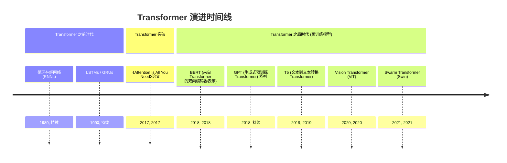
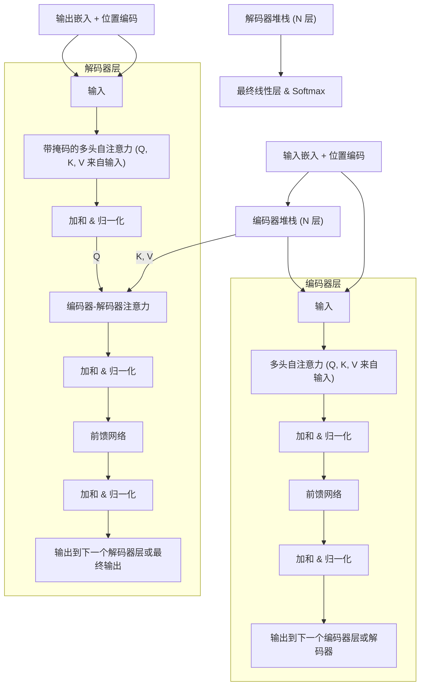
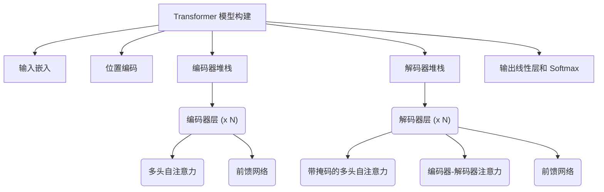
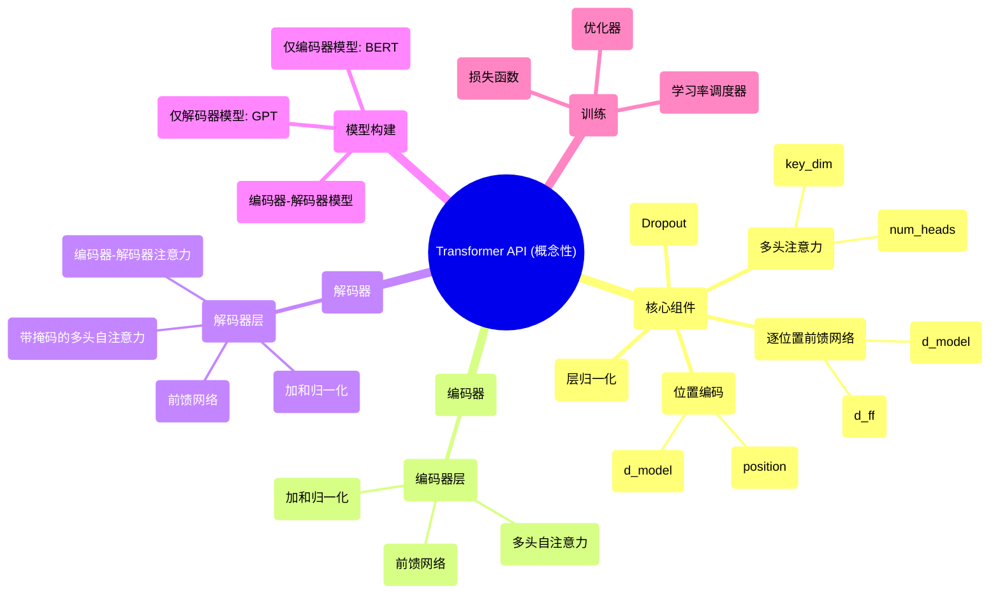

## Transformer 演进文档

### 1. 引言与历史背景

Transformer 是一种新颖的神经网络架构，由 Vaswani 等人于 2017 年在论文《Attention Is All You Need》中提出。它通过完全摒弃循环和卷积，仅依靠注意力机制来捕捉输入和输出之间的全局依赖关系，从而彻底改变了自然语言处理（NLP）领域。这一突破使得训练期间的并行化达到了前所未有的水平，并显著提高了各种序列到序列任务的性能。

在 Transformer 之前，循环神经网络（RNN）及其变体，如 LSTM（长短期记忆）和 GRU（门控循环单元），是序列建模的主导架构。这些模型按顺序处理数据，导致在长序列上训练缓慢，并且容易出现梯度消失/爆炸等问题。卷积神经网络（CNN）也用于某些 NLP 任务，但它们难以有效地捕捉长距离依赖关系。

Transformer 的引入标志着范式转变。其自注意力机制允许序列中的每个元素关注所有其他元素，从而有效地捕捉长距离依赖关系。并行处理所有输入 token 的能力，结合注意力的强大功能，缩短了训练时间，并在各种 NLP 基准测试中取得了最先进的结果。这种架构迅速成为许多有影响力的模型（包括 BERT、GPT 和 T5）的基础，推动了机器翻译、文本生成和问答等领域的重大进展。

### 1.1. Transformer 演进时间线



### 2. 核心架构

Transformer 架构是一种完全依赖于注意力机制的编码器-解码器结构。编码器和解码器都是由多个相同的层堆叠而成。在进入主架构之前，输入词元（token）会被转换为嵌入（embedding），并与位置编码相结合，以提供序列顺序信息。

#### 2.1. 注意力机制：Q, K, V

**心智模型 / 类比：**
想象一下，你正在研究一个主题（一个**查询 Query**）。你去了图书馆，那里的书都标有书名（**键 Key**）。你将你的查询与这些键进行比较，以找到最相关的书籍。这些书籍的内容就是**值 Value**。然后，你对所有书籍的内容进行加权求和，给予更相关的书籍更大的权重。

这就是 Transformer 的**缩放点积注意力（Scaled Dot-Product Attention）**的精髓。对于每个输入词元，模型会学习三个向量：
*   **查询 (Q):** 代表当前词元提出的“问题”，即序列中哪些其他部分与它相关。
*   **键 (K):** 代表序列中每个词元的“标签”或“标识符”，表明其内容是什么。
*   **值 (V):** 代表每个词元的实际“实质”或内容。

注意力分数是通过计算当前词元的查询向量与所有其他词元的键向量的点积得出的。这个分数经过缩放和 softmax 函数处理后，决定了当前词元应该对其他每个词元付出多少注意力。该词元的最终输出是序列中所有值向量的加权和。

**公式：** `Attention(Q, K, V) = softmax(Q * K^T / sqrt(d_k)) * V`

**公式详解：**
- **K^T**：表示键矩阵K的转置（Transpose）操作
  - 如果K的维度是 `[seq_len, d_k]`，那么 `K^T` 的维度就是 `[d_k, seq_len]`
  - 转置是为了让Q和K^T能够进行矩阵乘法运算
- **d_k**：表示键向量的维度（dimension of key vectors）
  - 这是每个键向量的特征维度大小
  - 通常等于模型的隐藏维度除以注意力头的数量
  - 例如：模型维度512，8个注意力头，则 `d_k = 512/8 = 64`
- **sqrt(d_k)**：缩放因子，用于：
  - 防止当d_k很大时点积值过大，导致softmax进入饱和区域
  - 保持数值稳定性，确保注意力权重分布均匀
  - 控制点积结果的方差在合理范围内

**计算流程：**
1. Q 和 K^T 做矩阵乘法得到注意力分数
2. 除以 sqrt(d_k) 进行缩放
3. 应用 softmax 得到注意力权重  
4. 与 V 相乘得到最终输出

#### 2.2. 多头注意力

Transformer 不仅执行单次注意力计算，而是使用**多头注意力（Multi-Head Attention）**。该机制将 Q、K、V 向量分割成多个更小的、并行的“注意力头”。

**心智模型 / 类比：**
想象一下，不是一个研究员在找书，而是一个研究团队（多个头）。每个研究员可以专注于查询的不同方面。一个可能寻找句法联系，另一个可能寻找语义相似性。通过结合他们的发现，你可以得到一个更丰富、更细致的理解。

每个头学习词元之间关系的不同方面。所有头的输出随后被拼接起来，并通过线性变换产生最终结果。这使得模型能够同时关注来自不同位置的不同表示子空间的信息。

#### 2.3. 编码器-解码器结构

##### 2.3.1. 编码器

编码器的任务是为输入序列构建一个丰富的、上下文感知的表示。它由一个相同层的堆栈组成，每层包含：
1.  **多头自注意力:** 在这里，Q、K、V 向量都来自*同一个*前一层的输出。每个词元都会关注输入序列中的所有其他词元，以建立自己的上下文感知表示。
2.  **逐位置前馈网络:** 一个简单的全连接网络，独立地应用于每个词元的表示。

每个子层都包裹在一个**残差连接**和**层归一化**中。

##### 2.3.2. 解码器

解码器的任务是逐个生成输出序列的词元。它也是一个相同层的堆栈，但每层有三个子层：
1.  **带掩码的多头自注意力:** 与编码器的自注意力类似，但有一个关键区别：应用了“前瞻掩码”。这可以防止任何词元关注输出序列中后续（未来）的词元，确保对当前词的预测只能依赖于已经生成的词。
2.  **多头编码器-解码器注意力 (交叉注意力):** 这是连接编码器和解码器的关键环节。**查询 (Query)** 向量来自解码器前一个带掩码的自注意力子层。**键 (Key)** 和 **值 (Value)** 向量来自**编码器堆栈的最终输出**。这使得解码器在生成下一个词元时，能够审视整个输入序列并专注于最相关的部分。
3.  **逐位置前馈网络:** 与编码器中的相同。

同样，每个子层都包裹在一个**残差连接**和**层归一化**中。

**Mermaid 图：Transformer 核心架构**



### 3. 详细 API 概述（概念性）

与 CNN 类似，Transformer 使用深度学习框架实现。这里的“API”指的是用于构建 Transformer 模型的常见模块和模式，通常利用 Hugging Face Transformers、TensorFlow 和 PyTorch 等库提供的预构建组件。演进方向是高度模块化和可配置的组件，从而能够快速试验不同的 Transformer 变体。

#### 3.1. 核心 Transformer 组件

这些是框架提供的基本构建块。

##### 3.1.1. 多头注意力 (例如, `tf.keras.layers.MultiHeadAttention`, `torch.nn.MultiheadAttention`)

**目标：** 并行执行多次注意力函数，然后连接并线性变换结果。

**代码（概念性 - Keras）：**
```python
import tensorflow as tf
from tensorflow.keras import layers

# MultiHeadAttention 层的示例
# 假设 query, key, value 是形状为 (batch_size, seq_len, embed_dim) 的张量
query = tf.random.uniform(shape=(2, 10, 64))
key = tf.random.uniform(shape=(2, 10, 64))
value = tf.random.uniform(shape=(2, 10, 64))

attention_layer = layers.MultiHeadAttention(num_heads=8, key_dim=64)
output_attention = attention_layer(query, key, value)

print(f"输出注意力形状: {output_attention.shape}")
```

**预期输出：**
```
输出注意力形状: (2, 10, 64)
```

**解释：**
*   `num_heads`：注意力头的数量。
*   `key_dim`：查询和键的每个注意力头的大小。

*   **上下文：** 捕捉序列内部（自注意力）或两个序列之间（编码器-解码器注意力）依赖关系的核心机制。
*   **参数（常见）：**
    *   `num_heads` (int)：注意力头的数量。
    *   `key_dim` (int)：查询和键的每个注意力头的大小。
    *   `value_dim` (int)：可选的值的每个注意力头的大小。
*   **返回：** 表示多头注意力输出的张量。

##### 3.1.2. 逐位置前馈网络 (例如, `tf.keras.layers.Dense` 堆栈, `torch.nn.Sequential` 的 `Linear` 层)

**目标：** 独立地对每个位置应用两个线性变换，中间有一个 ReLU 激活。

**代码（概念性 - Keras）：**
```python
import tensorflow as tf
from tensorflow.keras import layers

# 逐位置前馈网络的示例
input_tensor = tf.random.uniform(shape=(2, 10, 64))

ffn = tf.keras.Sequential([
    layers.Dense(256, activation='relu'),
    layers.Dense(64)
])

output_ffn = ffn(input_tensor)

print(f"输出 FFN 形状: {output_ffn.shape}")
```

**预期输出：**
```
输出 FFN 形状: (2, 10, 64)
```

**解释：**
*   通常实现为两个 `Dense` 层。第一个扩展维度，第二个将其投影回来。

*   **上下文：** 提供非线性，并允许模型学习注意力输出的更复杂变换。
*   **参数（常见）：**
    *   `d_model` (int)：输入和输出的维度。
    *   `d_ff` (int)：内部层的维度。
*   **返回：** 表示前馈网络输出的张量。

##### 3.1.3. 位置编码 (自定义层或函数)

**目标：** 将位置信息注入输入嵌入中。

**代码（概念性 - Keras）：**
```python
import tensorflow as tf

def get_angles(pos, i, d_model):
    angle_rates = 1 / tf.pow(10000, (2 * (i // 2)) / tf.cast(d_model, tf.float32))
    return pos * angle_rates

def positional_encoding(position, d_model):
    angle_rads = get_angles(tf.range(position, dtype=tf.float32)[:, tf.newaxis],
                            tf.range(d_model, dtype=tf.float32)[tf.newaxis, :],
                            d_model)

    # 对数组中的偶数索引应用 sin；2i
    sines = tf.sin(angle_rads[:, 0::2])

    # 对数组中的奇数索引应用 cos；2i + 1
    cosines = tf.cos(angle_rads[:, 1::2])

    pos_encoding = tf.concat([sines, cosines], axis=-1)
    return pos_encoding[tf.newaxis, ...]

# 示例用法
pos_enc = positional_encoding(position=50, d_model=128)
print(f"位置编码形状: {pos_enc.shape}")
```

**预期输出：**
```
位置编码形状: (1, 50, 128)
```

**解释：** 位置编码通常使用不同频率的正弦和余弦函数生成。这使得模型能够学习关注相对位置。

*   **上下文：** 对于向 Transformer 提供序列顺序信息至关重要，因为它缺乏固有的循环或卷积。
*   **参数（常见）：**
    *   `position` (int)：最大序列长度。
    *   `d_model` (int)：嵌入的维度。
*   **返回：** 位置编码的张量。

##### 3.1.4. 快速参考：核心 Transformer 组件

| 组件 | 描述 | 关键参数 |
| :--- | :--- | :--- |
| `MultiHeadAttention` | 并行注意力计算 | `num_heads`, `key_dim` |
| `FeedForward Network` | 带有 ReLU 的两个线性层 | `d_model`, `d_ff` |
| `Positional Encoding` | 注入序列顺序信息 | `position`, `d_model` |
| `LayerNormalization` | 稳定训练 | `epsilon` |
| `Add & Norm` | 残差连接 + 层归一化 | N/A |

#### 3.2. Transformer 编码器/解码器层

框架通常提供预构建的 `EncoderLayer` 和 `DecoderLayer` 模块。

##### 3.2.1. 编码器层 (例如, 自定义 `EncoderLayer` 类)

**目标：** Transformer 编码器的一个单层，结合了自注意力和前馈网络。

**代码（概念性 - PyTorch）：**
```python
import torch
import torch.nn as nn

class EncoderLayer(nn.Module):
    def __init__(self, d_model, num_heads, d_ff, dropout):
        super(EncoderLayer, self).__init__()
        self.mha = nn.MultiheadAttention(d_model, num_heads, dropout=dropout, batch_first=True)
        self.ffn = nn.Sequential(
            nn.Linear(d_model, d_ff),
            nn.ReLU(),
            nn.Linear(d_ff, d_model)
        )
        self.layernorm1 = nn.LayerNorm(d_model, eps=1e-6)
        self.layernorm2 = nn.LayerNorm(d_model, eps=1e-6)
        self.dropout1 = nn.Dropout(dropout)
        self.dropout2 = nn.Dropout(dropout)

    def forward(self, x, mask):
        attn_output, _ = self.mha(x, x, x, attn_mask=mask)
        attn_output = self.dropout1(attn_output)
        out1 = self.layernorm1(x + attn_output)

        ffn_output = self.ffn(out1)
        ffn_output = self.dropout2(ffn_output)
        out2 = self.layernorm2(out1 + ffn_output)
        return out2

# 示例用法
encoder_layer = EncoderLayer(d_model=512, num_heads=8, d_ff=2048, dropout=0.1)
input_tensor = torch.rand(1, 60, 512) # (batch_size, seq_len, d_model)
output_encoder = encoder_layer(input_tensor, mask=None)
print(f"输出编码器层形状: {output_encoder.shape}")
```

**预期输出：**
```
输出编码器层形状: torch.Size([1, 60, 512])
```

**解释：** 这个概念性的 `EncoderLayer` 结合了 `MultiheadAttention`、`FeedForward` 网络、`LayerNormalization` 和 `Dropout`，如原始论文所述。

*   **上下文：** 封装了 Transformer 编码器堆栈中单层的自注意力和前馈逻辑。
*   **参数（常见）：**
    *   `d_model` (int)：输入/输出的维度。
    *   `num_heads` (int)：注意力头的数量。
    *   `d_ff` (int)：前馈网络内部层的维度。
    *   `dropout` (float)：Dropout 率。
*   **返回：** 表示编码器层输出的张量。

##### 3.2.2. 解码器层 (例如, 自定义 `DecoderLayer` 类)

**目标：** Transformer 解码器的一个单层，结合了带掩码的自注意力、编码器-解码器注意力和前馈网络。

**代码（概念性 - PyTorch）：**
```python
import torch
import torch.nn as nn

class DecoderLayer(nn.Module):
    def __init__(self, d_model, num_heads, d_ff, dropout):
        super(DecoderLayer, self).__init__()
        self.mha1 = nn.MultiheadAttention(d_model, num_heads, dropout=dropout, batch_first=True) # 带掩码的自注意力
        self.mha2 = nn.MultiheadAttention(d_model, num_heads, dropout=dropout, batch_first=True) # 编码器-解码器注意力
        self.ffn = nn.Sequential(
            nn.Linear(d_model, d_ff),
            nn.ReLU(),
            nn.Linear(d_ff, d_model)
        )
        self.layernorm1 = nn.LayerNorm(d_model, eps=1e-6)
        self.layernorm2 = nn.LayerNorm(d_model, eps=1e-6)
        self.layernorm3 = nn.LayerNorm(d_model, eps=1e-6)
        self.dropout1 = nn.Dropout(dropout)
        self.dropout2 = nn.Dropout(dropout)
        self.dropout3 = nn.Dropout(dropout)

    def forward(self, x, enc_output, look_ahead_mask, padding_mask):
        attn1, attn_weights_block1 = self.mha1(x, x, x, attn_mask=look_ahead_mask)
        attn1 = self.dropout1(attn1)
        out1 = self.layernorm1(x + attn1)

        attn2, attn_weights_block2 = self.mha2(out1, enc_output, enc_output, attn_mask=padding_mask)
        attn2 = self.dropout2(attn2)
        out2 = self.layernorm2(out1 + attn2)

        ffn_output = self.ffn(out2)
        ffn_output = self.dropout3(ffn_output)
        out3 = self.layernorm3(out2 + ffn_output)
        return out3

# 示例用法（概念性）
decoder_layer = DecoderLayer(d_model=512, num_heads=8, d_ff=2048, dropout=0.1)
input_decoder = torch.rand(1, 50, 512) # (batch_size, target_seq_len, d_model)
encoder_output = torch.rand(1, 60, 512) # (batch_size, input_seq_len, d_model)

# 掩码将根据序列长度和填充生成
look_ahead_mask = torch.triu(torch.ones(50, 50), diagonal=1).bool()
padding_mask = None # 为简单起见，此处假设没有填充掩码

output_decoder = decoder_layer(input_decoder, encoder_output, look_ahead_mask, padding_mask)
print(f"输出解码器层形状: {output_decoder.shape}")
```

**预期输出：**
```
输出解码器层形状: torch.Size([1, 50, 512])
```

**解释：** 这个概念性的 `DecoderLayer` 包含了带掩码的自注意力、编码器-解码器注意力，以及前馈网络、层归一化和 Dropout。

*   **上下文：** 封装了 Transformer 解码器堆栈中单层的带掩码的自注意力、编码器-解码器注意力和前馈逻辑。
*   **参数（常见）：**
    *   `d_model` (int)：输入/输出的维度。
    *   `num_heads` (int)：注意力头的数量。
    *   `d_ff` (int)：前馈网络内部层的维度。
    *   `dropout` (float)：Dropout 率。
*   **返回：** 表示解码器层输出的张量。

##### 3.2.3. 快速参考：Transformer 层

| 层 | 描述 | 关键参数 |
| :--- | :--- | :--- |
| `EncoderLayer` | 单个编码器块 | `d_model`, `num_heads`, `d_ff`, `dropout` |
| `DecoderLayer` | 单个解码器块 | `d_model`, `num_heads`, `d_ff`, `dropout` |

**Mermaid 图：简化 Transformer API 结构（概念性）**



### 3.3. API 心智图



### 4. 架构权衡

与 RNN 和 CNN 等先前的架构相比，Transformer 具有一套独特的属性，既有明显的优势，也有其固有的劣势。

#### 4.1. 优势

*   **捕捉全局依赖关系:** 自注意力机制允许每个词元直接关注序列中的所有其他词元，无论它们相距多远。这使得 Transformer 在捕捉长距离依赖关系方面表现出色，而这正是 RNN 的一个显著弱点。
*   **并行化:** 与必须逐个处理词元的 RNN 的顺序性不同，Transformer 可以同时处理序列中的所有词元。这种高度的并行化使得在海量数据集上训练更大的模型成为可能。
*   **无循环导致的梯度消失/爆炸问题:** 通过消除循环连接，Transformer 避免了 RNN 在处理长序列时常遇到的梯度消失和爆炸问题。

#### 4.2. 劣势

*   **二次计算复杂度:** 自注意力机制的计算成本很高。对于长度为 `n` 的序列，计算和内存需求为 O(n²)。这使得将 Transformer 应用于非常长的序列（例如，高分辨率图像或整个文档）具有挑战性。
*   **缺乏归纳偏置:** 与 CNN（对空间数据）或 RNN（对顺序性和时间性）相比，Transformer 的归纳偏置较弱。它们本身并不知道序列的顺序或数据的局部结构。这就是为什么它们需要位置编码，并且通常需要非常大的数据集才能从头开始学习这些模式。
*   **数据需求量大:** 由于其灵活性和缺乏强大的归纳偏置，Transformer 通常比 CNN 或 RNN 需要更多的数据才能有效训练，以避免过拟合。

### 5. 实际应用与用例

Transformer 架构，特别是通过预训练模型，已成为各种任务的最新技术标准。

*   **机器翻译:** Transformer 最初设计的任务（例如，谷歌翻译）。
*   **文本生成:** 为聊天机器人、故事创作和代码生成创建类似人类的文本（例如，GPT 系列）。
*   **文本摘要:** 将长文档压缩成连贯的摘要。
*   **问答:** 根据给定的上下文回答问题。
*   **情感分析:** 对一段文本的情感进行分类。
*   **计算机视觉:** 将注意力应用于图像块，用于图像分类（Vision Transformer - ViT）和目标检测等任务。

#### 5.1. 示例：使用预训练模型进行情感分析

Hugging Face `transformers` 库使得为各种任务使用预训练模型变得异常简单。

**代码 (概念性 - PyTorch):**
```python
from transformers import pipeline

# 加载一个预训练的情感分析管道
# 首次运行时将下载模型和分词器
classifier = pipeline('sentiment-analysis')

# 分析一些文本
results = classifier(["我喜欢新的变形金刚电影！", "我对这部电影的情节不太确定。"])

for result in results:
    print(f"标签: {result['label']}, 分数: {result['score']:.4f}")
```
**预期输出:**
```
标签: POSITIVE, 分数: 0.9998
标签: NEGATIVE, 分数: 0.9967
```

### 6. 完整代码示例 (情感分析)

此示例演示了如何在 IMDb 数据集上微调一个预训练的 Transformer 模型 (DistilBERT) 以进行情感分析任务。它使用了 Hugging Face `transformers` 和 `datasets` 库，这是处理此类任务的标准方法。

#### 6.1. TensorFlow/Keras 实现

```python
import tensorflow as tf
from transformers import TFAutoModelForSequenceClassification, AutoTokenizer
from datasets import load_dataset

# 1. 加载并预处理 IMDb 数据集
imdb = load_dataset("imdb")

# 2. 初始化分词器并对数据进行分词
tokenizer = AutoTokenizer.from_pretrained("distilbert-base-uncased")

def tokenize_function(examples):
    return tokenizer(examples["text"], padding="max_length", truncation=True)

tokenized_datasets = imdb.map(tokenize_function, batched=True)

# 准备用于训练和验证的子集
small_train_dataset = tokenized_datasets["train"].shuffle(seed=42).select(range(1000))
small_eval_dataset = tokenized_datasets["test"].shuffle(seed=42).select(range(1000))

# 转换为 TensorFlow 数据集
tf_train_dataset = small_train_dataset.to_tf_dataset(
    columns=["attention_mask", "input_ids", "label"],
    shuffle=True,
    batch_size=16
)
tf_eval_dataset = small_eval_dataset.to_tf_dataset(
    columns=["attention_mask", "input_ids", "label"],
    shuffle=False,
    batch_size=16
)

# 3. 加载预训练模型
model = TFAutoModelForSequenceClassification.from_pretrained("distilbert-base-uncased", num_labels=2)

# 4. 编译模型
optimizer = tf.keras.optimizers.Adam(learning_rate=5e-5)
loss = tf.keras.losses.SparseCategoricalCrossentropy(from_logits=True)
metrics = [tf.keras.metrics.SparseCategoricalAccuracy()]
model.compile(optimizer=optimizer, loss=loss, metrics=metrics)

# 5. 微调模型
epochs = 3
model.fit(tf_train_dataset, validation_data=tf_eval_dataset, epochs=epochs)

# 6. 评估模型
print("\n在完整测试集上进行评估:")
tf_test_dataset = tokenized_datasets["test"].to_tf_dataset(
    columns=["attention_mask", "input_ids", "label"],
    shuffle=False,
    batch_size=16
)
eval_loss, eval_acc = model.evaluate(tf_test_dataset)
print(f"测试准确率: {eval_acc:.4f}")
```

#### 6.2. PyTorch 实现

```python
import torch
from torch.utils.data import DataLoader
from transformers import AutoTokenizer, AutoModelForSequenceClassification, AdamW
from datasets import load_dataset

# 1. 加载并预处理 IMDb 数据集
imdb = load_dataset("imdb")

# 2. 初始化分词器并对数据进行分词
tokenizer = AutoTokenizer.from_pretrained("distilbert-base-uncased")

def tokenize_function(examples):
    return tokenizer(examples["text"], padding="max_length", truncation=True)

tokenized_datasets = imdb.map(tokenize_function, batched=True)
tokenized_datasets.set_format("torch", columns=["input_ids", "attention_mask", "label"])

# 准备用于训练和验证的子集
small_train_dataset = tokenized_datasets["train"].shuffle(seed=42).select(range(1000))
small_eval_dataset = tokenized_datasets["test"].shuffle(seed=42).select(range(1000))

train_dataloader = DataLoader(small_train_dataset, shuffle=True, batch_size=8)
eval_dataloader = DataLoader(small_eval_dataset, batch_size=8)

# 3. 加载预训练模型
model = AutoModelForSequenceClassification.from_pretrained("distilbert-base-uncased", num_labels=2)

# 4. 设置优化器和设备
optimizer = AdamW(model.parameters(), lr=5e-5)
device = torch.device("cuda" if torch.cuda.is_available() else "cpu")
model.to(device)

# 5. 微调模型
num_epochs = 3
for epoch in range(num_epochs):
    model.train()
    for batch in train_dataloader:
        batch = {k: v.to(device) for k, v in batch.items()}
        outputs = model(**batch)
        loss = outputs.loss
        loss.backward()
        optimizer.step()
        optimizer.zero_grad()
    print(f"轮次 {epoch+1}/{num_epochs} 训练完成。")

# 6. 评估模型
model.eval()
total_correct = 0
total_samples = 0
for batch in eval_dataloader:
    batch = {k: v.to(device) for k, v in batch.items()}
    with torch.no_grad():
        outputs = model(**batch)
    
    logits = outputs.logits
    predictions = torch.argmax(logits, dim=-1)
    total_correct += (predictions == batch["labels"]).sum().item()
    total_samples += len(batch["labels"])

accuracy = total_correct / total_samples
print(f"验证准确率: {accuracy:.4f}")
```

### 7. 演进与影响

Transformer 对 NLP 及其他领域的影响是深远的，导致研究和应用开发迅速加速。

*   **预训练语言模型:** Transformer 架构使得 BERT、GPT 和 T5 等大规模预训练语言模型的开发成为可能。这些模型在大量文本数据上进行训练，可以针对各种下游任务进行微调，并取得了显著成功，从而在 NLP 中建立了新的范式。
*   **NLP 中的迁移学习:** 类似于计算机视觉中的 CNN，预训练的 Transformer 使迁移学习成为 NLP 中的标准方法，显著减少了许多任务所需的数据和计算资源。
*   **可扩展性和并行化:** 通过消除循环连接，Transformer 实现了前所未有的训练并行化，使得在大型数据集上训练具有数十亿参数的模型成为可能。
*   **超越 NLP:** Transformer 在 NLP 中的成功迅速导致其在其他领域的采用。**Vision Transformer (ViT)** 表明 Transformer 可以通过将图像块视为序列来在图像分类中实现最先进的结果。随后的模型，如 **Swin Transformer**，进一步提高了计算机视觉的效率和性能。
*   **注意力机制作为核心概念:** 注意力机制是 Transformer 的核心，已成为深度学习中的基本概念，影响着各种模态的架构。
*   **硬件优化:** Transformer 的并行特性非常适合现代 GPU 和 TPU 架构，这对其可扩展性和性能至关重要。

### 8. 结论

Transformer 架构代表了深度学习，特别是序列建模领域的巨大飞跃。其对自注意力的创新性依赖，加上可并行化的编码器-解码器结构，不仅重新定义了自然语言处理的最新技术，而且将其影响力扩展到计算机视觉和其他领域。Transformer 高效捕捉长距离依赖关系的能力及其对大规模预训练的适用性，使其成为现代 AI 的基石，预示着机器理解和生成复杂数据的方式将持续进步。
