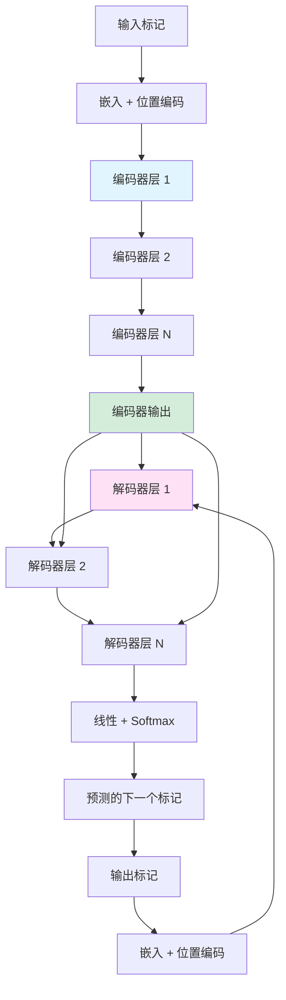

# Transformer 入门指南

> 面向初学者的 Transformer 架构 gentle 介绍——这是 ChatGPT、BERT 和现代 AI 背后的技术。无需任何机器学习背景知识！

---

## 目录

1. [前置知识与基础](#1-前置知识与基础)
2. [从 CNN 到 Transformer：演进之路](#2-从-cnn-到-transformer演进之路)
3. [为什么我们需要 Transformer？](#3-为什么我们需要-transformer)
4. [核心概念](#4-核心概念)
5. [Transformer 如何工作](#5-transformer-如何工作)
6. [为什么 Transformer 如此重要](#6-为什么-transformer-如此重要)
7. [动手实践](#7-动手实践)
8. [术语表](#8-术语表)

---

## 1. 前置知识与基础

在深入 Transformer 之前，让我们先建立一些基础概念。别担心——我们将从零开始解释所有内容！

### 1.1 什么是向量？

> 📖 **术语：向量 (Vector)** - 一组按顺序排列的数字。可以将其视为空间中的一个点或从原点指向该点的箭头。例如，[3, 5] 是一个二维向量，表示从原点向右 3 个单位、向上 5 个单位的点。

**向量**本质上就是一个按顺序排列的数字列表。它是机器学习中最基本的概念之一。

**可视化示例：**

```
在二维空间中：
    ↑
  5 |    ● [3, 5]
  4 |   /
  3 |  /
  2 | /
  1 |/
  0 +--●---→
    0 1 2 3 4 5
      [2, 0]

向量作为箭头：
    [3, 5] = 从 (0,0) 指向 (3,5) 的箭头
    [2, 0] = 从 (0,0) 指向 (2,0) 的箭头
```

**为什么我们在 AI 中使用向量？**

向量让计算机能够用数字表示信息：
- 单词变成向量（例如，"cat" 可能是 [0.9, -0.2, 0.5, ...]）
- 图像变成向量（每个像素的颜色值）
- 声音变成向量（每个时间点的音频幅度）

### 1.2 什么是矩阵？

> 📖 **术语：矩阵 (Matrix)** - 按行和列排列的数字网格。可以将其视为按行和列排列的向量集合。可以对矩阵进行加、减、乘运算来转换数据。

**矩阵**是一个按行和列排列的数字网格。它就像一个充满数字的电子表格。

**可视化示例：**

```
一个 3×2 矩阵（3 行，2 列）：

┌           ┐
│ 1  5  │   第 1 行
│ 3  2  │   第 2 行
│ 4  8  │   第 3 行
└           ┘
  ↑  ↑
 第 第
 1 2
 列 列

也可以将其视为 3 个堆叠的向量：
[1, 5]  →  第 1 行
[3, 2]  →  第 2 行
[4, 8]  →  第 3 行
```

**矩阵在 AI 中的作用：**
- 图像是像素值的矩阵
- 句子可以表示为矩阵（每一行是一个词向量）
- 神经网络使用矩阵将输入数据转换为输出

### 1.3 什么是函数？

> 📖 **术语：函数 (Function)** - 一种数学关系，接受输入并产生输出。你给它一些东西，它遵循规则，然后给你返回结果。写作 f(x) = y，其中 x 是输入，y 是输出。

你可能还记得代数课上学过的函数。它们只是将输入转换为输出的规则。

**简单示例：**

```
f(x) = 2x + 1

如果 x = 3：  f(3) = 2(3) + 1 = 7
如果 x = 10： f(10) = 2(10) + 1 = 21

输入 → [函数应用规则] → 输出
```

**在机器学习中：**
- "函数"就是神经网络本身
- 输入：你的数据（文本、图像等）
- 输出：预测、分类、生成的文本

训练的目标就是**学习**出能够将输入正确转换为输出的函数！

### 1.4 什么是神经网络？

> 📖 **术语：神经网络 (Neural Network)** - 受人脑启发的计算模型。它由相互连接的"神经元"层组成，用于处理信息。每个神经元接收输入，应用权重（重要性因子），并产生输出。

**神经网络**就像一个数学大脑。它由相互连接的"神经元"层组成，逐步处理信息。

**可视化结构：**

```
        输入层          隐藏层           输出层
         (第 0 层)      (第 1, 2...层)      (最终层)

         ┌─────┐
         │ I₁  │────────┐
         ├─────┤        │
         │ I₂  │────────┼───┐
         ├─────┤        │   │
         │ I₃  │────────┼───┼────┐
         └─────┘        │   │    │
                        ▼   ▼    ▼
                      ┌─────────┐
                      │  H₁ H₂  │
                      └─────────┘
                        │     │
                        ▼     ▼
                      ┌─────────┐
                      │  O₁ O₂  │
                      └─────────┘

I = 输入神经元（接收原始数据）
H = 隐藏神经元（处理并学习模式）
O = 输出神经元（产生最终结果）
```

**它是如何学习的：**

> 📖 **术语：训练 (Training)** - 通过向神经网络展示示例并调整参数以减少误差，经过多次迭代来教授神经网络。

1. 做出预测
2. 与正确答案比较
3. 稍微调整内部值以减少误差
4. 重复数百万次！


---

## 2. 从 CNN 到 Transformer：演进之路

在理解 Transformer 之前，我们需要先了解 CNN（卷积神经网络）。它们为理解注意力机制提供了基础。

### 2.1 什么是 CNN？

> 📖 **术语：CNN (卷积神经网络)** - 一种专为网格状数据（如图像）设计的神经网络。它使用在输入上滑动的"滤波器"来查找模式，一次专注于局部区域。

**CNN** 就像一个手电筒，逐段扫描图像，寻找模式。

**CNN "卷积"如何工作：**

```
想象一个 5×5 的图像（每个数字 = 像素亮度）：

图像：
┌─────────┐
│ 1  1  1  0  0 │
│ 0  1  1  1  0 │
│ 0  0  1  1  1 │
│ 0  0  1  1  0 │
│ 0  1  1  0  0 │
└─────────┘

一个 3×3 的滤波器滑动（卷动）：

滤波器：         步骤 1（左上角）：       步骤 2（向右移动）：
┌───┐           ┌───┐                    ┌───┐
│ 1 0 1 │       │ 1 1 1 │                │ 1 1 0 │
│ 0 1 0 │   →   │ 0 1 1 │        →       │ 1 1 1 │
│ 1 0 1 │       │ 0 0 1 │                │ 0 1 1 │
└───┘           └───┘                    └───┘
  ↓               ↓                          ↓
与图像块相乘      (1×1)+(1×0)+(1×1)          计算新值...
                +(0×0)+(1×1)+(1×0)
                +(0×1)+(0×0)+(1×1) = 4

这创建了一个"特征图"，显示模式出现的位置！
```

**关键洞察：** 滤波器一次只能看到一个**小的局部区域**。

### 2.2 CNN 的"局部"注意力

CNN 擅长查找局部模式（边缘、角落、纹理），但有一个限制：

```
问题：CNN 能轻松连接距离较远的像素吗？

图像："一只狗正在接飞盘"

┌─────────────────────────────────────────┐
│  [狗的头部]  .....  [飞盘]            │
│       ↑                        ↑       │
│    这些像素相距很远！              │
│    CNN 需要很多层才能连接           │
│    它们（感受野增长缓慢）           │
└─────────────────────────────────────────┘

CNN 第 1 层：每个神经元看到 3×3 区域
CNN 第 2 层：每个神经元看到 5×5 区域（组合第 1 层）
CNN 第 3 层：每个神经元看到 7×7 区域
...
需要很多深层网络才能看到整个图像！
```

### 2.3 Transformer 的解决方案：全局注意力

> 📖 **术语：全局注意力 (Global Attention)** - 能够直接连接任何元素到任何其他元素的能力，无论距离多远。与 CNN 的局部滑动窗口不同，注意力可以同时"看到"整个输入。

Transformer 的突破：**每个位置可以直接关注到每个其他位置！**

```
CNN vs Transformer 注意力：

CNN（局部）：
    位置 5 看到：[3, 4, 5, 6, 7] ← 仅限附近

    ┌───┬───┬───┬───┬───┬───┬───┬───┐
    │   │   │   │ ● │   │   │   │   │
    └───┴───┴───┴───┴───┴───┴───┴───┘
              ╰─ 局部窗口 ─╯

Transformer（全局）：
    位置 5 看到：[0, 1, 2, 3, 4, 5, 6, 7, 8, 9] ← 所有位置！

    ┌───┬───┬───┬───┬───┬───┬───┬───┬───┬───┐
    │ ✓ │ ✓ │ ✓ │ ✓ │ ● │ ✓ │ ✓ │ ✓ │ ✓ │ ✓ │
    └───┴───┴───┴───┴───┴───┴───┴───┴───┴───┘
      ╰─────── 可以关注到任何地方 ───────╯

每个位置都可以直接"查看"每个其他位置！
```

### 2.4 并排比较

| 方面 | CNN | Transformer |
|------|-----|-------------|
| **注意力范围** | 局部（滑动窗口） | 全局（全连接） |
| **看到的内容** | 附近的像素/标记 | 一次性看到所有内容 |
| **最适用于** | 图像、局部模式 | 文本、长距离连接 |
| **连接距离** | 随层数缓慢增长 | 立即实现，与距离无关 |
| **并行化** | 可以（独立窗口） | 可以（所有位置同时处理） |

---

## 3. 为什么我们需要 Transformer？

既然了解了 CNN 的基础，让我们探讨为什么需要 Transformer 以及它们解决了什么问题。

### 3.1 问题：理解语言需要上下文

语言很棘手，因为含义取决于句子中**任何位置**的上下文。

**示例 1：代词解析**

```
句子："奖杯装不进手提箱，因为它太[大/小]。"

问题："它"指的是什么？

┌─────────────────────────────────────────────────┐
│  "奖杯装不进手提箱，因为它太 大。"              │
│                                                  │
│  "它" = 奖杯（奖杯太大了）                      │
└─────────────────────────────────────────────────┘

┌─────────────────────────────────────────────────┐
│  "奖杯装不进手提箱，因为它太 小。"              │
│                                                  │
│  "它" = 手提箱（手提箱太小了）                  │
└─────────────────────────────────────────────────┘

要理解"它"，必须连接相距很远的词！
```

**示例 2：长距离依赖**

```
科学文本：
"Alice 使用限制性内切酶将 DNA 序列插入质粒载体。
连接片段后，她转化细菌并将其涂布在含有氨苄青霉素的琼脂上。"

问题：什么被"连接"了？

要回答这个问题，必须追溯到句子开头找到
"DNA 序列"和"片段"——它们跨越许多词连接在一起！
```

### 3.2 为什么 CNN/RNN 遇到困难

**RNN 问题（顺序处理）：**

> 📖 **术语：RNN (循环神经网络)** - 一种一次处理一个元素的序列，维护所见数据的"记忆"的神经网络。就像逐字阅读一本书。

```
RNN 处理（逐词进行）：

时间步：  t₁      t₂      t₃      t₄
         [Alice]  [插入]   [the]   [DNA]
           │        │        │        │
           └────────┴────────┴────────┘
                    (隐藏状态向前流动)

问题：
1. 慢：必须顺序处理（无法并行化）
2. 记忆丢失：早期信息被"遗忘"（梯度消失）
3. 难以连接相距较远的词
```

**CNN 问题（局部窗口）：**

```
CNN 处理（滑动窗口）：

文本：     [The] [cat] [sat] [on] [the] [mat]
          ╰─┬─╯
            │ CNN 同时看到这些词
            │（有限的窗口大小）

要连接"The"和"mat"，CNN 需要很多层：
第 1 层：看到 3 个词
第 2 层：看到 5 个词
第 3 层：看到 7 个词
第 4 层：看到 9 个词 ← 终于连接上了！
```

### 3.3 Transformer 的解决方案

**并行处理 + 全局注意力：**

```
Transformer 同时处理所有位置：

输入：    [The] [cat] [sat] [on] [the] [mat]
           ↓     ↓     ↓     ↓     ↓     ↓
        全部并行处理！

每个位置可以"关注"每个其他位置：
┌─────────────────────────────────────────────────┐
│                                                 │
│  "The" ←────────── "mat"                        │
│    ╲                   ╱                        │
│     ╲                 ╱                         │
│      ╲              "cat"                       │
│       ╲            ╱                            │
│        ╲          ╱                             │
│         ─→  "sat"  ←─                          │
│              ╲     ╱                            │
│               ╲   ╱                             │
│              "on"                               │
│                                                 │
│  每个词都可以直接查看每个词！                   │
└─────────────────────────────────────────────────┘

优势：
✓ 并行训练（所有位置同时进行）
✓ 直接的长距离连接
✓ 没有梯度消失问题
```

---

## 4. 核心概念

现在让我们理解让 Transformer 工作的关键概念。

### 4.1 从词到数字：嵌入

> 📖 **术语：嵌入 (Embedding)** - 词、图像或其他数据的向量表示。相似的词有相似的嵌入。例如，"cat"（猫）和"dog"（狗）的嵌入比"cat"和"car"（汽车）更接近。

计算机不能直接处理词——它们需要数字。**嵌入**将词转换为向量。

**示例：词嵌入**

```
词 → 嵌入向量

"猫"   → [0.9, -0.2, 0.5, 0.1, ...]
"狗"   → [0.8, -0.1, 0.6, 0.2, ...]
"汽车" → [0.1, 0.7, -0.3, 0.4, ...]

在二维中可视化：
        ↑
   0.5  │    ● 猫
        │       ● 狗
   0.0  ┼──────────────→
        │    ● 汽车
  -0.5  │

相似的词聚集在一起！
```

### 4.2 注意力机制：Q、K、V

> 📖 **术语：注意力机制 (Attention Mechanism)** - 一种允许模型在产生输出的每个部分时专注于输入相关部分的技术。它学习应该关注什么。

Transformer 的核心创新是**注意力机制**。让我们通过类比来理解它。

**图书馆类比：**

```
想象你正在研究一个主题：

┌─────────────────────────────────────────────────┐
│  📚 图书馆类比                                  │
│                                                 │
│  你的问题："神经网络如何学习？"                  │
│         │                                       │
│         └── 这是你的 查询 (Query, Q)            │
│             你在寻找的内容                      │
│                                                 │
│  书架上的书名：                                 │
│  ├─ "园艺入门"                                  │
│  ├─ "神经网络详解"          ← 匹配！            │
│  ├─ "法式烹饪"                                  │
│  └─ "Python 深度学习"      ← 匹配！            │
│         │                                       │
│         └── 这些是 键 (Key, K)                  │
│             每个项目的标签/标识符               │
│                                                 │
│  书的内容：                                     │
│  "神经网络通过调整来学习..."                    │
│  "反向传播是一种算法，它..."                    │
│         │                                       │
│         └── 这是 值 (Value, V)                  │
│             实际的内容/信息                     │
│                                                 │
│  过程：                                         │
│  1. 将查询与键比较（找到匹配项）                │
│  2. 对更好的匹配给予更多关注                    │
│  3. 从匹配的书中读取值                          │
└─────────────────────────────────────────────────┘
```

**在 Transformer 中：**

> 📖 **术语：查询 (Query, Q)** - 在注意力中，表示标记在关注其他标记时"寻找"的内容。
>
> 📖 **术语：键 (Key, K)** - 在注意力中，表示每个标记向他人"提供"或被标记为匹配的内容。
>
> 📖 **术语：值 (Value, V)** - 在注意力中，表示每个标记包含的实际信息或内容。

对于每个词（标记），模型学习：
- **查询 (Query, Q)**：这个词在"寻找"什么
- **键 (Key, K)**：这个词向他人"提供"什么
- **值 (Value, V)**：这个词包含的实际信息

**具体示例：**

```
句子："猫 坐 在 垫子 上"

处理"猫"：
┌─────────────────────────────────────────────────┐
│  词："猫"                                       │
│                                                 │
│  查询 (Q)："我是个名词，寻找可能描述            │
│             我动作的动词"                       │
│                                                 │
│  键 (K)："我是个毛茸茸的动物名词"               │
│                                                 │
│  值 (V)：[0.5, 0.8, -0.2, ...]                  │
│             （关于"猫"的实际信息）              │
└─────────────────────────────────────────────────┘

注意力分数（"猫"关注每个词的程度）：

"猫"：    0.01（不相关）
"猫"：    1.00（它自己）
"坐"：    0.45（相关动词！）
"在"：    0.12（有点相关）
"垫子"：  0.38（相关位置）

"猫"最关注"坐"（它的动作）
        和"垫子"（它的位置）
```

### 4.3 注意力公式（简化版）

> 📖 **术语：Softmax** - 将数字转换为概率的函数（全为正数，和为 1）。在注意力中用于创建权重。

```
Attention(Q, K, V) = softmax(Q × K / √d) × V

分解：
1. Q × K：将查询与键比较（找到匹配项）
2. / √d：缩小（防止数字过大）
3. softmax：转换为概率（和为 1）
4. × V：用注意力加权值

我们将在第 7 节手动计算！
```

### 4.4 多头注意力

> 📖 **术语：多头注意力 (Multi-Head Attention)** - 并行运行多个注意力操作。每个"头"可以学习不同的关系。就像让多个研究员从不同角度研究同一个问题。

不仅仅是一个注意力机制，Transformer 使用**多个头**——每个头学习不同的模式。

**类比：多个研究员**

```
单头 vs 多头：

单头：
┌─────────────────────────────────────────────────┐
│  一个研究员寻找连接                             │
│  "猫" ──→ 专注于"坐"（动作）                    │
│  可能会错过其他关系！                           │
└─────────────────────────────────────────────────┘

多头（8 个研究员）：
┌─────────────────────────────────────────────────┐
│  头 1："猫" ──→ "坐"（找到动作）                │
│  头 2："猫" ──→ "垫子"（找到位置）              │
│  头 3："猫" ──→ "The"（找到冠词）               │
│  头 4："猫" ──→ "on"（找到介词）                │
│  头 5："猫" ──→ 找到语法模式                    │
│  头 6："猫" ──→ 找到语义相似性                  │
│  头 7："猫" ──→ 找到其他东西                    │
│  头 8："猫" ──→ 找到其他东西                    │
│                                                 │
│  组合：对"猫"的丰富理解！                       │
└─────────────────────────────────────────────────┘
```

---

## 5. Transformer 如何工作

现在让我们把所有内容放在一起，看看 Transformer 如何处理输入。

### 5.1 全貌：编码器-解码器架构

> 📖 **术语：编码器-解码器 (Encoder-Decoder)** - 一种两部分架构。编码器处理输入并创建表示。解码器获取该表示并生成输出。

```
┌─────────────────────────────────────────────────────────────┐
│                    Transformer 架构                         │
├─────────────────────────────────────────────────────────────┤
│                                                             │
│  输入："The cat sat"                                        │
│     │                                                       │
│     ▼                                                       │
│  ┌─────────────────────────────────────┐                   │
│  │  编码器（理解输入）                  │                   │
│  │                                     │                   │
│  │  第 1 层：多头自注意力               │                   │
│  │          ↓                           │                   │
│  │  第 2 层：前馈网络                   │                   │
│  │          ↓                           │                   │
│  │  （重复 N 次）                       │                   │
│  │                                     │                   │
│  │  输出：丰富的上下文向量              │                   │
│  └─────────────────────────────────────┘                   │
│     │                                                       │
│     │（上下文向量传递给解码器）                            │
│     ▼                                                       │
│  ┌─────────────────────────────────────┐                   │
│  │  解码器（生成输出）                  │                   │
│  │                                     │                   │
│  │  第 1 层：掩码自注意力               │                   │
│  │          ↓                           │                   │
│  │  第 2 层：交叉注意力                 │                   │
│  │          （查看编码器输出）          │                   │
│  │          ↓                           │                   │
│  │  第 3 层：前馈网络                   │                   │
│  │          ↓                           │                   │
│  │  （重复 N 次）                       │                   │
│  └─────────────────────────────────────┘                   │
│     │                                                       │
│     ▼                                                       │
│  输出："Le chat s'est assis"（法语翻译）                   │
│                                                             │
└─────────────────────────────────────────────────────────────┘
```

### 5.2 编码器：理解输入

编码器的工作是创建输入的丰富表示。

```
输入："The cat sat on the mat"

步骤 1：分词
┌─────────────────────────────────────────────────┐
│  "The cat sat on the mat"                       │
│         ↓                                       │
│  ["The", "cat", "sat", "on", "the", "mat"]     │
│         ↓                                       │
│  [101,  5855, 2419, 286,  101,  3698]         │
│         （来自词汇表的标记 ID）                 │
└─────────────────────────────────────────────────┘

步骤 2：嵌入
┌─────────────────────────────────────────────────┐
│  每个标记 ID → 嵌入向量（512 个数字）           │
│                                                 │
│  "The" → [0.1, -0.5, 0.8, ..., 0.2]            │
│  "cat" → [0.9, -0.2, 0.5, ..., 0.7]            │
│  "sat" → [0.3, 0.6, -0.1, ..., 0.4]            │
│  ...                                            │
│                                                 │
│  形状：[6 个标记 × 512 维]                      │
└─────────────────────────────────────────────────┘

步骤 3：位置编码
┌─────────────────────────────────────────────────┐
│  添加位置信息（顺序很重要！）                    │
│                                                 │
│  位置 0 ("The")：+ [sin(0), cos(0), ...]       │
│  位置 1 ("cat")：+ [sin(1), cos(1), ...]       │
│  位置 2 ("sat")：+ [sin(2), cos(2), ...]       │
│  ...                                            │
│                                                 │
│  现在模型知道"The"在"cat"之前！                 │
└─────────────────────────────────────────────────┘

步骤 4：多头自注意力
┌─────────────────────────────────────────────────┐
│  每个词关注所有其他词：                         │
│                                                 │
│  "cat" 查看：["The", "cat", "sat", "on",       │
│               "the", "mat"]                    │
│  发现："sat"（动作）和"mat"（位置）            │
│         最相关                                  │
│                                                 │
│  结果：上下文感知的表示                          │
└─────────────────────────────────────────────────┘

步骤 5：前馈网络
┌─────────────────────────────────────────────────┐
│  每个位置独立处理：                             │
│                                                 │
│  [上下文 + 注意力] → [前馈网络] → [输出]       │
│                                                 │
│  两个线性层，中间有 ReLU 激活：                  │
│  输入 (512) → 扩展 (2048) → 压缩 (512)         │
└─────────────────────────────────────────────────┘

步骤 6：重复（N 层）
┌─────────────────────────────────────────────────┐
│  原始论文：N = 6 层                             │
│  每层学习越来越抽象的表示                        │
└─────────────────────────────────────────────────┘
```

### 5.3 解码器：生成输出

解码器一次生成一个标记的输出，同时使用：
1. 到目前为止生成的内容（掩码自注意力）
2. 编码器的理解（交叉注意力）

```
任务：将 "The cat sat" 翻译成法语

目前输出："Le chat"

步骤 1：掩码自注意力
┌─────────────────────────────────────────────────┐
│  当前输出标记相互关注：                         │
│                                                 │
│  ["Le", "chat"]                                 │
│     ↓      ↓                                    │
│  "chat" 关注 "Le"（冠词一致性）                 │
│                                                 │
│  掩码：不能看到未来的标记（尚未生成）！         │
└─────────────────────────────────────────────────┘

步骤 2：交叉注意力（编码器-解码器）
┌─────────────────────────────────────────────────┐
│  解码器查询编码器的理解：                       │
│                                                 │
│  "chat"（猫）询问编码器：                       │
│  "我应该关注输入中的什么？"                     │
│                                                 │
│  编码器回应：                                   │
│  "关注输入中的'cat'和'sat'"                    │
│                                                 │
│  这确保输出基于输入！                           │
└─────────────────────────────────────────────────┘

步骤 3：前馈网络
┌─────────────────────────────────────────────────┐
│  处理组合的信息                                 │
└─────────────────────────────────────────────────┘

步骤 4：输出预测
┌─────────────────────────────────────────────────┐
│  线性层 + softmax → 所有可能的下一个标记的概率： │
│                                                 │
│  "s'est":  0.65  ← 预测！                      │
│  "est":    0.25                                │
│  "a":      0.05                                │
│  "mange":  0.03                                │
│  ...                                            │
└─────────────────────────────────────────────────┘

步骤 5：追加并重复
┌─────────────────────────────────────────────────┐
│  将预测的标记添加到输出：                       │
│  ["Le", "chat"] → ["Le", "chat", "s'est"]      │
│                                                 │
│  重复直到预测到 <END> 标记                      │
└─────────────────────────────────────────────────┘
```

### 5.4 可视化架构图



---

## 6. 为什么 Transformer 如此重要

Transformer 彻底改变了人工智能。让我们看看为什么它们如此重要。

### 6.1 真实应用

```
┌─────────────────────────────────────────────────────────────┐
│                  Transformer 应用                          │
├─────────────────────────────────────────────────────────────┤
│                                                             │
│  🌐 机器翻译                                               │
│     "将这句话从英语翻译成西班牙语"                          │
│     → Google 翻译、DeepL                                   │
│                                                             │
│  💬 聊天机器人和对话 AI                                     │
│     "与我进行自然对话"                                     │
│     → ChatGPT、Claude、Bing Chat                           │
│                                                             │
│  📝 文本生成                                               │
│     "写一个关于机器人学习爱的故事"                          │
│     → GPT-4、Claude                                        │
│                                                             │
│  📚 文本摘要                                               │
│     "用 3 段话总结这份 100 页的文档"                        │
│     → 会议摘要器、新闻压缩器                               │
│                                                             │
│  ❓ 问答                                                   │
│     "根据给定上下文回答这个问题"                            │
│     → 搜索引擎、阅读理解                                   │
│                                                             │
│  😊 情感分析                                               │
│     "这条评论是正面的还是负面的？"                          │
│     → 产品评论分析                                         │
│                                                             │
│  🔍 代码生成                                               │
│     "写一个对列表排序的 Python 函数"                       │
│     → GitHub Copilot、CodeT5                               │
│                                                             │
│  🖼️ 计算机视觉                                              │
│     "对这个图像进行分类"                                   │
│     → Vision Transformer (ViT)、DALL-E                     │
│                                                             │
│  🧬 生物学                                                 │
│     "预测蛋白质结构"                                       │
│     → AlphaFold                                            │
│                                                             │
└─────────────────────────────────────────────────────────────┘
```

### 6.2 Transformer 家族树

```
Transformer 演进：

2017："Attention Is All You Need"
         │
         └─► 原始 Transformer（编码器-解码器）
              │
              ├─► 2018：BERT（仅编码器）
              │        "Bidirectional Encoder Representations from Transformers"
              │        用于：理解、分类、问答
              │
              ├─► 2018：GPT（仅解码器）
              │        "Generative Pre-trained Transformer"
              │        用于：文本生成
              │        → GPT-2 (2019) → GPT-3 (2020) → GPT-4 (2023)
              │
              ├─► 2019：T5（编码器-解码器）
              │        "Text-to-Text Transfer Transformer"
              │        所有任务都框架化为文本到文本
              │
              ├─► 2020：GPT-3
              │        1750 亿参数！
              │        少样本学习冠军
              │
              ├─► 2022：ChatGPT
              │        GPT-3.5 微调用于对话
              │        引发 AI 革命
              │
              ├─► 2023：GPT-4
              │        多模态（文本 + 图像）
              │
              └─► 2023+：许多变体...
                    LLaMA、Claude、Gemini 等
```

### 6.3 关键创新总结

| 创新 | 为什么重要 |
|------|------------|
| **自注意力** | 任意位置之间的直接连接 |
| **并行化** | 快速训练大规模数据集 |
| **可扩展性** | 架构可扩展到数十亿参数 |
| **预训练 + 微调** | 一次学习，适应多种任务 |
| **迁移学习** | 知识跨领域迁移 |

---

## 7. 动手实践

让我们通过一个简单的示例手动计算注意力。这将帮助你真正理解它是如何工作的！

### 7.1 设置：简单示例

```
句子："cat sat mat"

我们有 3 个标记：["cat", "sat", "mat"]

为简单起见，让我们使用二维向量：

词嵌入 (V)：
┌─────────────────────────────────────┐
│  "cat" → [1.0, 0.5]                 │
│  "sat" → [0.5, 1.0]                 │
│  "mat" → [0.8, 0.7]                 │
└─────────────────────────────────────┘

假设本例中 Q 和 K 与 V 相同：
Q = K = V（自注意力）
```

### 7.2 逐步注意力计算

**步骤 1：计算注意力分数 (Q × K^T)**

```
对于 "cat" 关注所有词：

┌─────────────────────────────────────────────────────────────┐
│  Q("cat") • K("cat") = [1.0, 0.5] • [1.0, 0.5]             │
│                      = 1.0×1.0 + 0.5×0.5                   │
│                      = 1.0 + 0.25 = 1.25                   │
│                                                             │
│  Q("cat") • K("sat") = [1.0, 0.5] • [0.5, 1.0]             │
│                      = 1.0×0.5 + 0.5×1.0                   │
│                      = 0.5 + 0.5 = 1.0                     │
│                                                             │
│  Q("cat") • K("mat") = [1.0, 0.5] • [0.8, 0.7]             │
│                      = 1.0×0.8 + 0.5×0.7                   │
│                      = 0.8 + 0.35 = 1.15                   │
└─────────────────────────────────────────────────────────────┘

原始分数：[1.25, 1.0, 1.15]
```

**步骤 2：缩放（除以 √d）**

```
d = 2（我们向量的维度）
√d = √2 ≈ 1.414

缩放分数：[1.25, 1.0, 1.15] / 1.414
          = [0.884, 0.707, 0.813]
```

**步骤 3：Softmax（转换为概率）**

```
公式：softmax(x) = exp(x) / sum(exp(全部))

exp([0.884, 0.707, 0.813]) = [2.42, 2.03, 2.25]
总和 = 2.42 + 2.03 + 2.25 = 6.70

Softmax：[2.42, 2.03, 2.25] / 6.70
         = [0.361, 0.303, 0.336]

这些是我们的注意力权重！

┌─────────────────────────────────────────────────────────────┐
│  "cat" 关注到：                                            │
│    "cat"：36.1%（它自己，最高）                            │
│    "sat"：30.3%（动词）                                    │
│    "mat"：33.6%（位置）                                    │
│                                                             │
│  解释："cat" 关注所有词，                                  │
│  对自己和"mat"（位置）的关注稍多一些                       │
└─────────────────────────────────────────────────────────────┘
```

**步骤 4：加权值**

```
最终输出 = 值的加权和：

= 0.361 × [1.0, 0.5]    ("cat")
+ 0.303 × [0.5, 1.0]    ("sat")
+ 0.336 × [0.8, 0.7]    ("mat")

= [0.361, 0.181] + [0.152, 0.303] + [0.269, 0.235]
= [0.782, 0.719]

这就是"cat"的上下文感知表示！

它不再只是 [1.0, 0.5]——它还包含来自
"sat"和"mat"的信息！
```

### 7.3 可视化总结

```
        注意力矩阵（对于 "cat"）

         cat    sat    mat
        ┌──────┬──────┬──────┐
   cat  │ 36%  │ 30%  │ 34%  │
        ├──────┼──────┼──────┤
   sat  │  ?   │  ?   │  ?   │  ← 类似计算
        ├──────┼──────┼──────┤
   mat  │  ?   │  ?   │  ?   │
        └──────┴──────┴──────┘

       更深的颜色 = 更高的注意力
```

---

## 8. 术语表

本文档中介绍的所有术语的完整参考。

| 术语 | 定义 |
|------|------------|
| **注意力** | 一种允许模型在产生输出时专注于输入相关部分的技术。学习应该关注什么。 |
| **CNN** | 卷积神经网络——一种用于网格状数据（如图像）的神经网络，使用滑动滤波器查找局部模式。 |
| **解码器** | 编码器-解码器架构的一部分，生成输出，通常使用掩码自注意力和交叉注意力。 |
| **嵌入** | 数据（词、图像）的向量表示。相似的项目有相似的嵌入。 |
| **编码器** | 编码器-解码器架构的一部分，处理输入以创建丰富的上下文表示。 |
| **函数** | 一种数学关系，接受输入并遵循规则产生输出。写作 f(x) = y。 |
| **全局注意力** | 能够直接连接任何元素到任何其他元素的能力，无论距离多远。 |
| **键 (Key, K)** | 在注意力中，表示每个标记向他人"提供"或被标记为匹配的内容。 |
| **矩阵** | 按行和列排列的数字网格。按行和列排列的向量集合。 |
| **多头注意力** | 并行运行多个注意力操作，每个操作学习不同的关系模式。 |
| **神经网络** | 受人脑启发的计算模型。相互连接的神经元层处理信息以学习模式。 |
| **查询 (Query, Q)** | 在注意力中，表示标记在关注其他标记时"寻找"的内容。 |
| **RNN** | 循环神经网络——一次处理一个元素的序列，维护所见数据的记忆。 |
| **Softmax** | 将数字转换为概率的函数（全为正数，和为 1）。在注意力中用于创建权重。 |
| **训练** | 通过展示示例并调整参数以减少误差，经过多次迭代来教授神经网络。 |
| **Transformer** | 仅使用注意力机制的神经网络架构。实现并行处理和全局连接。 |
| **值 (Value, V)** | 在注意力中，表示每个标记包含的实际信息或内容。 |
| **向量** | 一组按顺序排列的数字。可以表示空间中的点或从原点开始的箭头。 |
| **梯度消失** | 深度网络中的问题，梯度变得很小，使得早期层难以训练。Transformer 避免了这个问题。 |

---

## 结语

恭喜！你已经学习了 Transformer 架构的基础知识：

**你现在理解了：**
- ✓ 前置知识：向量、矩阵、函数、神经网络
- ✓ CNN 基础及其重要性
- ✓ 为什么发明 Transformer（它们解决的问题）
- ✓ 核心概念：嵌入、注意力 (Q, K, V)、多头注意力
- ✓ Transformer 如何工作（编码器-解码器，逐步讲解）
- ✓ 为什么它们重要（实际应用）
- ✓ 动手实践（手动计算注意力！）

**下一步：**
1. **实验**预训练模型（Hugging Face Transformers 库）
2. **阅读**"Attention Is All You Need"（原始论文）
3. **实现**一个简单的 Transformer
4. **探索**你感兴趣领域的应用

Transformer 不仅是一种架构——它是一种范式转变，重塑了人工智能。理解它让你从根本上深入了解现代 AI 系统的工作原理。

**继续学习！** 🚀

---

> **文档信息**
>
> - **创建时间：** 2026
> - **目标受众：** 完全初学者（无需 ML/DL 背景）
> - **前置要求：** 对代数的基本了解
> - **预计阅读时间：** 45-60 分钟
>
> 查看标准技术参考，请参阅 `transformer_evolution_document.zh.md`
