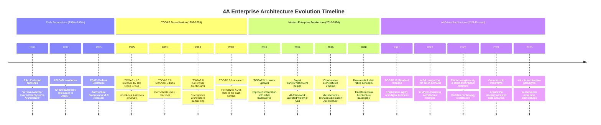
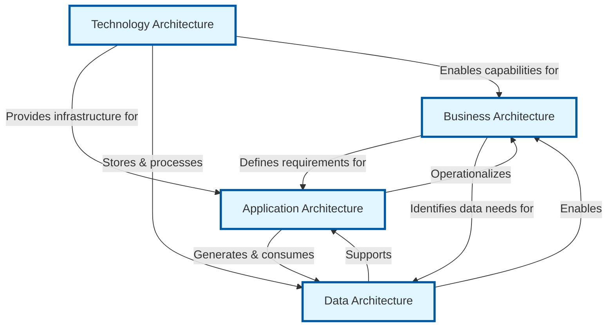
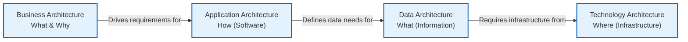
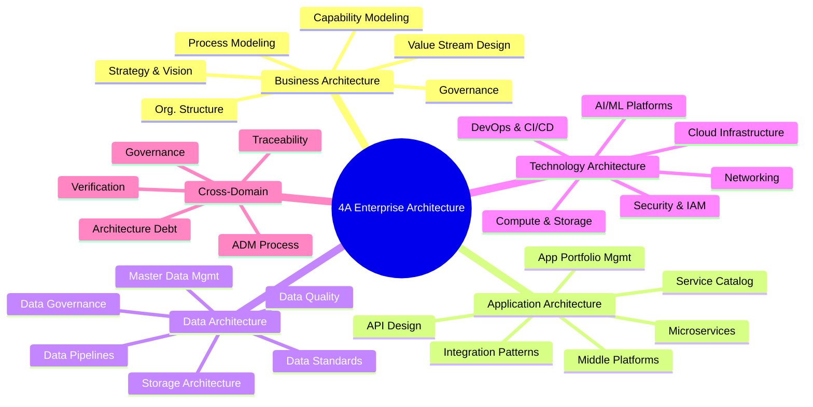

# 4A Enterprise Architecture Domains Evolution Document

## 1. Introduction and Historical Context

The 4A Enterprise Architecture framework represents a systematic approach to organizing and managing enterprise IT architecture across four interconnected domains: **Business Architecture (BA)**, **Application Architecture (AA)**, **Data Architecture (DA)**, and **Technology Architecture (TA)**. This framework provides a structured methodology for aligning technology investments with business strategy, ensuring that every layer of the enterprise architecture contributes directly to organizational goals.

The 4A framework is deeply rooted in enterprise architecture methodologies, most notably **The Open Group Architecture Framework (TOGAF)**, which formalized these four domains as the foundational levels at which enterprise architecture is modeled. The framework has evolved from early enterprise architecture practices in the 1980s and has become the de facto standard for organizing complex IT environments in large organizations.

### 1.1. 4A Enterprise Architecture Evolution Timeline



## 2. Core Architecture

The 4A Enterprise Architecture framework is built on the principle of **layered modularity**, where each domain addresses a distinct aspect of the enterprise while maintaining explicit dependencies and relationships with adjacent layers. The framework follows a **top-down design, bottom-up implementation** approach, ensuring strategic alignment from business vision to technology execution.



### 2.1. Business Architecture (BA)

Business Architecture is the foundational layer that defines the organization's strategic direction, operational structure, and value delivery mechanisms. It answers the fundamental question: **"What does the business do, and how does it create value?"**

**Mental Model / Analogy:** Think of Business Architecture as the **blueprint of a city's master plan**. It defines the districts (business units), the transportation networks (business processes), the zoning laws (governance), and the economic development strategy (business capabilities). Just as a city planner ensures that residential, commercial, and industrial areas are properly connected, Business Architecture ensures that business strategy translates into operational reality.

**Key Components:**
- **Enterprise Strategy:** Vision, mission, strategic objectives, and business goals
- **Business Capabilities:** What the organization can do (e.g., "process customer orders," "manage supply chain")
- **Value Streams:** End-to-end sequences of activities that deliver value to stakeholders
- **Organizational Structure:** Business units, roles, responsibilities, and governance models
- **Business Processes:** Detailed workflows, decision points, and handoffs between actors
- **Stakeholder Mapping:** Identification of internal and external stakeholders and their interests

**Methodologies:**
- Customer-centric process optimization
- Domain-Driven Design (DDD) for business capability mapping
- Strategic alignment mapping (connecting strategy to execution)
- Value stream analysis and optimization

**Deliverables:**
- End-to-end business process models
- Organizational capability matrices
- Strategic roadmaps and initiative portfolios
- Value stream definitions and metrics
- Business capability maps

### 2.2. Application Architecture (AA)

Application Architecture provides a blueprint for the individual software systems to be deployed, defines interactions between those systems, and maps their relationships to core business processes. It answers: **"What applications do we need, and how do they work together?"**

**Mental Model / Analogy:** Application Architecture is like the **building floor plans and utility connections** in our city analogy. Each building (application) serves a specific purpose (office, residential, industrial), and the roads, pipes, and electrical connections (APIs, integrations, data flows) ensure they function as a cohesive ecosystem.

**Key Components:**
- **Enterprise Application Portfolio:** ERP, CRM, SCM, HRIS, and other core systems
- **Functional Modules:** Discrete units of business functionality within applications
- **Microservices & APIs:** Decomposed, independently deployable service components
- **Integration Patterns:** Synchronous/asynchronous communication, event-driven architecture
- **Business & Data Middle Platforms:** Reusable service layers that enable cross-functional capabilities
- **Service Catalogs:** Inventory of available services and their contracts

**Methodologies:**
- Microservices refactoring and decomposition
- Platform-based design ("platform + ecosystem")
- Capability reuse modeling and service orchestration
- API-first design and contract-driven development

**Deliverables:**
- System architecture blueprints and deployment diagrams
- Service catalogs and API specifications
- Application portfolio rationalization reports
- Integration architecture documents
- Reusable middle-platform component libraries

### 2.3. Data Architecture (DA)

Data Architecture describes the structure of an organization's logical and physical data assets and the associated data management resources. It answers: **"What data do we have, where does it live, and how is it governed?"**

**Mental Model / Analogy:** Data Architecture is the **water supply and information network** of our city. Just as water must be collected, purified, stored, and distributed to every building through carefully designed pipelines, data must be captured, cleaned, stored, and made accessible to every application and business process that needs it.

**Key Components:**
- **Data Asset Standards:** Naming conventions, data types, encoding standards
- **Data Governance Frameworks:** Policies, roles, and processes for data stewardship
- **Data Flow Paths:** How data moves between systems, applications, and users
- **Data Storage Architectures:** Data lakes, data warehouses, operational databases
- **Data Quality & Lineage:** Mechanisms for ensuring accuracy and tracking data origins
- **Master Data Management (MDM):** Single source of truth for critical business entities
- **Real-time Data Pipelines:** Event streaming, CDC (Change Data Capture), and real-time analytics

**Methodologies:**
- Centralized data standardization and governance
- Automated data quality and compliance workflows
- Real-time data pipeline engineering
- Data mesh and data fabric implementation

**Deliverables:**
- Unified data dictionaries and business glossaries
- Data governance policies and stewardship charters
- Data lake/warehouse architecture and implementation plans
- Data lineage and quality metrics dashboards
- Data security and privacy compliance documentation

### 2.4. Technology Architecture (TA)

Technology Architecture describes the hardware, software, and network infrastructure required to support the deployment of mission-critical applications. It answers: **"What technology infrastructure do we need to run our applications and manage our data?"**

**Mental Model / Analogy:** Technology Architecture is the **foundation, utilities, and physical infrastructure** of our city. It includes the power grid, water treatment plants, road networks, and telecommunications systems. Without a solid technology foundation, no application can run reliably, and no data can be processed efficiently.

**Key Components:**
- **Cloud Infrastructure:** IaaS, PaaS, SaaS platforms, hybrid cloud architectures
- **Networking:** LAN/WAN, CDN, load balancers, API gateways
- **Compute & Storage:** Servers, containers, serverless functions, distributed storage
- **Operating Systems & Middleware:** OS platforms, runtime environments, message brokers
- **Security & Compliance:** IAM, encryption, firewalls, zero-trust architecture
- **AI/ML Infrastructure:** GPU clusters, model serving platforms, MLOps tooling

**Methodologies:**
- "Cloud-first, AI-driven" deployment strategies
- Elastic computing and auto-scaling provisioning
- Open API ecosystem integration
- Infrastructure as Code (IaC) and GitOps

**Deliverables:**
- Unified cloud platform architecture and deployment plans
- Infrastructure provisioning templates (Terraform, CloudFormation)
- OpenAPI catalogs and service mesh configurations
- Security reference architectures and compliance frameworks
- Scalability and disaster recovery plans

```mermaid
graph TD
    EA["4A Enterprise Architecture"]
    
    EA --> BA["Business Architecture"]
    BA --> BA1["Strategy & Vision"]
    BA --> BA2["Capability Maps"]
    BA --> BA3["Value Streams"]
    BA --> BA4["Process Models"]
    BA --> BA5["Org. Structure"]
    
    EA --> AA["Application Architecture"]
    AA --> AA1["App Portfolio"]
    AA --> AA2["Microservices"]
    AA --> AA3["API Contracts"]
    AA --> AA4["Integration Patterns"]
    AA --> AA5["Middle Platforms"]
    
    EA --> DA["Data Architecture"]
    DA --> DA1["Data Standards"]
    DA --> DA2["Governance"]
    DA --> DA3["Data Lakes/Warehouses"]
    DA --> DA4["Data Pipelines"]
    DA --> DA5["Master Data Mgmt"]
    
    EA --> TA["Technology Architecture"]
    TA --> TA1["Cloud Infrastructure"]
    TA --> TA2["Networking"]
    TA --> TA3["Compute & Storage"]
    TA --> TA4["Security & IAM"]
    TA --> TA5["AI/ML Platforms"]
    
    classDef main fill:#1565c0,stroke:#0d47a1,stroke-width:2px,color:#fff;
    classDef domain fill:#e1f5fe,stroke:#01579b,stroke-width:2px;
    classDef sub fill:#bbdefb,stroke:#1976d2,stroke-width:1px;
    class EA main;
    class BA,AA,DA,TA domain;
    class BA1,BA2,BA3,BA4,BA5,AA1,AA2,AA3,AA4,AA5,DA1,DA2,DA3,DA4,DA5,TA1,TA2,TA3,TA4,TA5 sub;
```



## 3. Detailed Architecture Overview

### 3.1. Architecture Development Method (ADM)

The 4A framework is operationalized through the **Architecture Development Method (ADM)**, a step-by-step process for developing and managing enterprise architecture. ADM ensures that each domain is addressed systematically and that dependencies between domains are properly managed.

**ADM Phase Flow:**

```mermaid
graph LR
    Preliminary["Preliminary"] --> A["A: Architecture Vision"]
    A --> B["B: Business Architecture"]
    B --> C["C: Information Systems\n(Applications + Data)"]
    C --> D["D: Technology Architecture"]
    D --> E["E: Opportunities & Solutions"]
    E --> F["F: Migration Planning"]
    F --> G["G: Implementation Governance"]
    G --> H["H: Architecture Change Mgmt"]
    H --> Requirements["Requirements Mgmt"]
    Requirements -.-> A
    
    classDef phase fill:#e3f2fd,stroke:#1565c0,stroke-width:2px;
    class Preliminary,A,B,C,D,E,F,G,H,Requirements phase;
```



**Key ADM Phases for 4A Domains:**

- **Phase B (Business Architecture):** Develops the target business architecture, identifies gaps, and defines the roadmap for business transformation.
- **Phase C (Information Systems Architecture):** Combines Application Architecture and Data Architecture, ensuring that application portfolios and data assets are aligned with business needs.
- **Phase D (Technology Architecture):** Defines the target technology infrastructure, including hardware, software, and network requirements.

### 3.2. Business Architecture Deep Dive

#### 3.2.1. Business Capability Modeling

**Goal:** Define what the organization does in a structured, technology-agnostic manner.

**Approach:**
1. **Identify Core Capabilities:** Strategic functions that differentiate the business (e.g., "Product Innovation," "Customer Relationship Management")
2. **Identify Supporting Capabilities:** Enabling functions (e.g., "HR Management," "Financial Reporting")
3. **Decompose Capabilities:** Break down into Level 2 and Level 3 capabilities for granularity
4. **Map to Value Streams:** Link capabilities to the value streams they enable
5. **Assess Maturity:** Evaluate each capability's current state and target state

**Example Capability Map:**
```
Enterprise Capability: Customer Management
├── Level 2: Customer Acquisition
│   ├── Level 3: Lead Generation
│   ├── Level 3: Lead Qualification
│   └── Level 3: Proposal Development
├── Level 2: Customer Retention
│   ├── Level 3: Customer Support
│   ├── Level 3: Loyalty Programs
│   └── Level 3: Renewal Management
└── Level 2: Customer Analytics
    ├── Level 3: Customer Segmentation
    ├── Level 3: Lifetime Value Analysis
    └── Level 3: Churn Prediction
```

#### 3.2.2. Value Stream Design

**Goal:** Map end-to-end sequences of activities that deliver value to stakeholders.

**Approach:**
1. **Identify Stakeholders:** Customers, employees, partners, regulators
2. **Define Trigger:** What initiates the value stream (e.g., "Customer places order")
3. **Map Stages:** Sequential stages that transform inputs to outputs
4. **Identify Capabilities:** Link each stage to the capabilities that enable it
5. **Define Metrics:** KPIs for measuring value stream performance

**Example Value Stream: "Order to Cash"**
```
Trigger: Customer submits order
→ Stage 1: Order Capture (Capability: Order Management)
→ Stage 2: Order Validation (Capability: Credit Assessment)
→ Stage 3: Order Fulfillment (Capability: Inventory Management)
→ Stage 4: Invoice Generation (Capability: Billing)
→ Stage 5: Payment Collection (Capability: Accounts Receivable)
→ Stage 6: Revenue Recognition (Capability: Financial Reporting)
Outcome: Customer receives product, company receives payment
```

#### 3.2.3. Business Process Modeling

**Goal:** Document detailed workflows, decision points, and handoffs.

**Approach:**
- Use **BPMN 2.0** (Business Process Model and Notation) for standardization
- Identify **swimlanes** for different roles/departments
- Map **decision gateways** and exception handling paths
- Define **SLA targets** for process duration and quality

### 3.3. Application Architecture Deep Dive

#### 3.3.1. Application Portfolio Management

**Goal:** Rationalize and optimize the organization's application landscape.

**Approach:**
1. **Inventory:** Catalog all applications in use (including shadow IT)
2. **Assess:** Evaluate each application on business fit, technical quality, cost, and risk
3. **Rationalize:** Apply the **TIME** model:
   - **T**olerate (keep as-is)
   - **I**nvest (enhance and modernize)
   - **M**igrate (replace or consolidate)
   - **E**liminate (retire and decommission)
4. **Roadmap:** Define the target application portfolio and migration plan

#### 3.3.2. Microservices Architecture

**Goal:** Decompose monolithic applications into independently deployable, loosely coupled services.

**Design Principles:**
- **Single Responsibility:** Each service owns one business capability
- **Bounded Context:** Services align with Domain-Driven Design boundaries
- **API-First:** Services communicate through well-defined APIs
- **Data Ownership:** Each service owns its data store (database per service)
- **Independent Deployment:** Services can be deployed without coordinating with others

**Microservices Decomposition Example:**
```
Monolithic E-Commerce Application
├── User Management Service
├── Product Catalog Service
├── Shopping Cart Service
├── Order Processing Service
├── Payment Processing Service
├── Inventory Management Service
├── Notification Service
└── Analytics Service
```

#### 3.3.3. Integration Architecture Patterns

**Goal:** Enable seamless communication between applications and services.

**Key Patterns:**

| Pattern | Description | When to Use |
|---------|-------------|-------------|
| **Synchronous API (REST/GraphQL)** | Direct request-response communication | Real-time data retrieval, user-facing operations |
| **Asynchronous Messaging (Kafka/RabbitMQ)** | Event-driven, decoupled communication | High-throughput, fault-tolerant workflows |
| **Event Sourcing** | State changes captured as immutable events | Audit trails, CQRS architectures |
| **API Gateway** | Single entry point for all client requests | Centralized auth, rate limiting, routing |
| **Service Mesh** | Infrastructure layer for service-to-service communication | Large-scale microservices deployments |
| **Enterprise Service Bus (ESB)** | Centralized integration platform (legacy) | Heterogeneous enterprise systems (being replaced by microservices) |

### 3.4. Data Architecture Deep Dive

#### 3.4.1. Data Governance Framework

**Goal:** Establish policies, roles, and processes for managing data as a strategic asset.

**Key Components:**
- **Data Ownership:** Assign data stewards and data owners for each domain
- **Data Quality Standards:** Define accuracy, completeness, timeliness, and consistency metrics
- **Data Lineage:** Track data from source to consumption for transparency and compliance
- **Master Data Management:** Maintain single, authoritative sources for critical entities (Customer, Product, Employee)
- **Data Security & Privacy:** Implement access controls, encryption, and regulatory compliance (GDPR, CCPA, HIPAA)

#### 3.4.2. Data Storage Architecture

**Goal:** Design the right storage solution for each data use case.

**Storage Options:**

| Storage Type | Technology Examples | Use Case |
|--------------|---------------------|----------|
| **Relational Database** | PostgreSQL, MySQL, Oracle | Transactional systems, ACID compliance |
| **Document Store** | MongoDB, Couchbase | Flexible schema, content management |
| **Data Warehouse** | Snowflake, Redshift, BigQuery | Analytics, BI reporting, historical data |
| **Data Lake** | Hadoop, S3, ADLS | Raw data storage, data science, ML training |
| **Key-Value Store** | Redis, DynamoDB | Caching, session management, real-time lookups |
| **Graph Database** | Neo4j, Amazon Neptune | Relationship-heavy data, recommendation engines |
| **Time-Series Database** | InfluxDB, TimescaleDB | IoT, monitoring, financial market data |

#### 3.4.3. Data Pipeline Architecture

**Goal:** Move and transform data from source systems to consumption layers.

**Pipeline Patterns:**

**Batch Pipeline (ETL):**
```
Source Systems → Extract → Transform → Load → Data Warehouse → BI/Analytics
```

**Real-time Pipeline (Streaming):**
```
Source Systems → CDC/Event Capture → Stream Processing (Kafka/Flink) → Real-time Store → Dashboards/APIs
```

**Lambda Architecture (Batch + Streaming):**
```
                    ┌→ Batch Layer (Hadoop/Spark) ──→ Serving Layer ──→ Analytics
Source Systems ────┤
                    └→ Speed Layer (Kafka/Storm) ───→ Serving Layer ──→ Analytics
```

### 3.5. Technology Architecture Deep Dive

#### 3.5.1. Cloud Architecture Patterns

**Goal:** Design scalable, resilient, and cost-effective cloud infrastructure.

**Cloud Service Models:**

| Model | Description | Examples |
|-------|-------------|----------|
| **IaaS** (Infrastructure as a Service) | Virtualized computing resources | AWS EC2, Azure VMs, Google Compute Engine |
| **PaaS** (Platform as a Service) | Managed platforms for application deployment | AWS Elastic Beanstalk, Heroku, Google App Engine |
| **SaaS** (Software as a Service) | Fully managed applications | Salesforce, Office 365, Slack |
| **FaaS** (Function as a Service) | Serverless function execution | AWS Lambda, Azure Functions, Google Cloud Functions |
| **CaaS** (Container as a Service) | Managed container orchestration | EKS, AKS, GKE |

**Multi-Cloud Architecture:**
```
                    ┌─────────────┐
                    │   DNS/CDN   │
                    └──────┬──────┘
                           │
        ┌──────────────────┼──────────────────┐
        ▼                  ▼                  ▼
┌───────────────┐  ┌───────────────┐  ┌───────────────┐
│   AWS Cloud   │  │  Azure Cloud  │  │  GCP Cloud    │
│  (Primary)    │  │  (Secondary)  │  │  (ML/AI)      │
│               │  │               │  │               │
│ • Compute     │  │ • Active Dir. │  │ • BigQuery    │
│ • S3 Storage  │  │ • SQL DB      │  │ • Vertex AI   │
│ • RDS         │  │ • Blob Store  │  │ • Cloud SQL   │
└───────────────┘  └───────────────┘  └───────────────┘
```

#### 3.5.2. Security Architecture

**Goal:** Protect enterprise assets through layered security controls.

**Zero-Trust Architecture Principles:**
- **Never Trust, Always Verify:** Every request is authenticated and authorized
- **Least Privilege Access:** Users and services get minimum necessary permissions
- **Micro-segmentation:** Network traffic restricted between workloads
- **Continuous Monitoring:** Real-time threat detection and response

**Security Layers:**
```
┌─────────────────────────────────────────────────┐
│               Application Security               │
│  (WAF, Input Validation, AuthN/AuthZ)            │
├─────────────────────────────────────────────────┤
│               Data Security                      │
│  (Encryption at Rest & In Transit, DLP)          │
├─────────────────────────────────────────────────┤
│               Network Security                   │
│  (Firewalls, IDS/IPS, Zero-Trust Network)        │
├─────────────────────────────────────────────────┤
│               Infrastructure Security            │
│  (IAM, Endpoint Protection, Container Security)  │
├─────────────────────────────────────────────────┤
│               Physical Security                  │
│  (Data Center Access, Environmental Controls)    │
└─────────────────────────────────────────────────┘
```

#### 3.5.3. DevOps & Platform Engineering

**Goal:** Enable rapid, reliable software delivery through automation and self-service platforms.

**CI/CD Pipeline Architecture:**
```
Code Commit → Build → Unit Tests → Integration Tests → Security Scan → Staging → Production → Monitoring
    │           │        │              │               │           │          │            │
    └───────────┴────────┴──────────────┴───────────────┴───────────┴──────────┴────────────┘
                                      Feedback Loop
```

**Internal Developer Platform (IDP):**
```
┌─────────────────────────────────────────────┐
│            Developer Portal                  │
│  (Self-Service UI, Documentation, Catalog)   │
├─────────────────────────────────────────────┤
│            Platform APIs                     │
│  (Provisioning, Deployment, Monitoring)      │
├─────────────────────────────────────────────┤
│            Golden Paths                      │
│  (Pre-approved templates, best practices)    │
├─────────────────────────────────────────────┤
│            Infrastructure Automation         │
│  (Terraform, Kubernetes, GitOps)             │
└─────────────────────────────────────────────┘
```

### 3.6. Cross-Domain Integration Patterns

#### 3.6.1. Sequential Decomposition Flow

The 4A framework follows a **top-down decomposition** pattern:



**Example Traceability Chain:**

| Layer | Artifact | Example |
|-------|----------|---------|
| **BA** | Business Capability | "Process Customer Orders" |
| **AA** | Application Service | Order Processing Service (REST API) |
| **DA** | Data Entity | Order, OrderItem, Customer (relational model) |
| **TA** | Infrastructure | AWS ECS (containers), RDS PostgreSQL (database), CloudFront (CDN) |

#### 3.6.2. Bidirectional Verification

Each layer must validate against adjacent layers to prevent business-IT disconnects:

- **BA ↔ AA Verification:** Do application services fully support business capabilities? Are there redundant or orphaned applications?
- **AA ↔ DA Verification:** Do applications have access to the data they need? Is data duplication minimized?
- **DA ↔ TA Verification:** Can the technology infrastructure support data volume, velocity, and variety requirements?

#### 3.6.3. Unified Governance Model

**Architecture Review Board (ARB):**
- **Composition:** Representatives from all 4A domains, business stakeholders
- **Responsibilities:** Architecture standards approval, exception handling, roadmap alignment
- **Cadence:** Bi-weekly reviews, quarterly roadmap assessments

**Governance Artifacts:**
- Architecture principles and standards repository
- Exception request and approval workflow
- Compliance scorecards and maturity assessments
- Architecture debt tracking and remediation plans

### 3.7. Architecture Mindmap



## 4. Evolution and Impact

### 4.1. Framework Evolution

- **1987:** Zachman Framework introduces the first systematic approach to enterprise architecture, laying groundwork for domain-based architecture thinking.
- **1995:** TOGAF v1.0 formalizes the 4-domain structure (Business, Application, Data, Technology), providing a practical methodology for enterprise architects.
- **2009:** TOGAF 9.0 introduces the Architecture Continuum and Solution Continuum, strengthening the connection between architecture domains and implementation.
- **2014:** Digital transformation accelerates adoption of 4A framework in Asia-Pacific enterprises, particularly in China where it becomes the standard for state-owned enterprise architecture.
- **2018:** Cloud-native and microservices architectures reshape Application Architecture, while data lakes and real-time processing transform Data Architecture.
- **2021:** TOGAF 10 Standard emphasizes agility, digital business, and the integration of emerging technologies across all 4A domains.
- **2023-2024:** Generative AI and platform engineering introduce new paradigms for all four domains, from AI-assisted business process optimization to autonomous infrastructure management.

### 4.2. Ecosystem Relationships

- **TOGAF:** The primary methodology that operationalizes the 4A framework through the ADM process.
- **Zachman Framework:** Provides a complementary taxonomy (What, How, Where, Who, When, Why × Planner, Owner, Designer, Builder, Subcontractor, Functioning Enterprise).
- **ArchiMate:** A modeling language specifically designed for visualizing 4A architecture artifacts.
- **Domain-Driven Design (DDD):** Provides tactical patterns for Application Architecture, particularly microservices decomposition.
- **ITIL/COBIT:** Complementary frameworks for IT service management and governance that integrate with 4A architecture practices.

### 4.3. Community and Industry Adoption

- **Fortune 500:** Over 80% of Fortune 500 companies use TOGAF or related 4A-based enterprise architecture frameworks.
- **Government:** Federal Enterprise Architecture Framework (FEAF), Department of Defense Architecture Framework (DoDAF), and NATO Architecture Framework all incorporate 4A domain structures.
- **Cloud Providers:** AWS, Azure, and Google Cloud provide architecture frameworks that map directly to 4A domains (AWS Well-Architected Framework, Azure Architecture Center).
- **Consulting:** Major consulting firms (McKinsey, Deloitte, Accenture) use 4A-based frameworks for enterprise architecture assessments and transformation roadmaps.

## 5. Conclusion

The 4A Enterprise Architecture framework remains one of the most enduring and practical approaches to organizing complex IT environments. By dividing enterprise architecture into **Business, Application, Data, and Technology** domains, the framework provides a structured methodology for ensuring that every technology investment directly supports business strategy.

In the modern era of cloud-native computing, AI/ML integration, and platform engineering, the 4A framework has demonstrated remarkable adaptability. Business Architecture now incorporates AI-driven strategic planning; Application Architecture embraces microservices and internal developer platforms; Data Architecture evolves toward data mesh and real-time analytics; and Technology Architecture incorporates serverless computing, GitOps, and zero-trust security.

The framework's strength lies in its **modularity and traceability**: every technology decision can be traced back to a business requirement, and every business capability has clear application, data, and technology enablers. This end-to-end alignment ensures that enterprise architecture remains a strategic discipline, not just a technical exercise.

For organizations undertaking digital transformation, the 4A framework provides the **common language and structured methodology** needed to align business leaders, architects, developers, and operations teams around a shared vision of the enterprise's future state.
