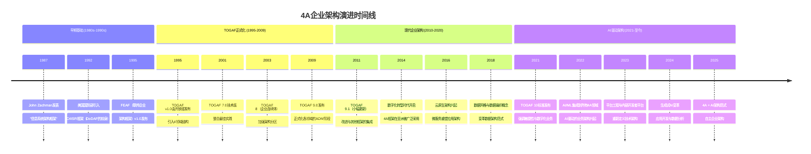
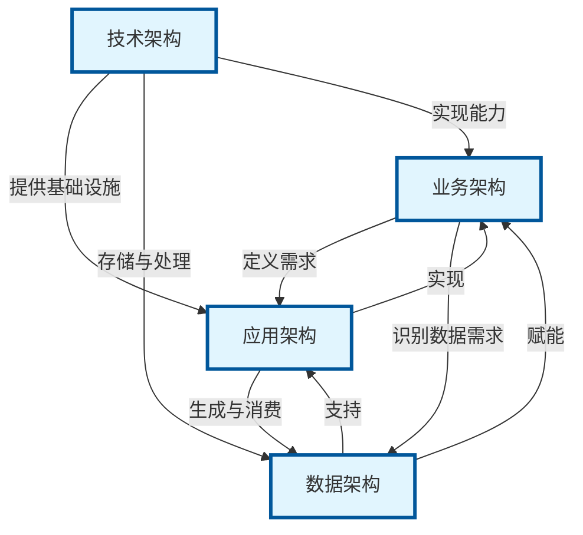
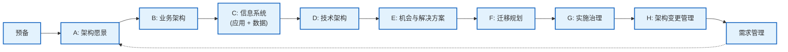
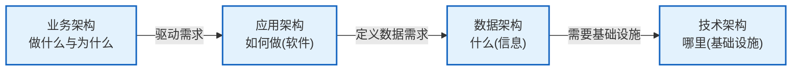
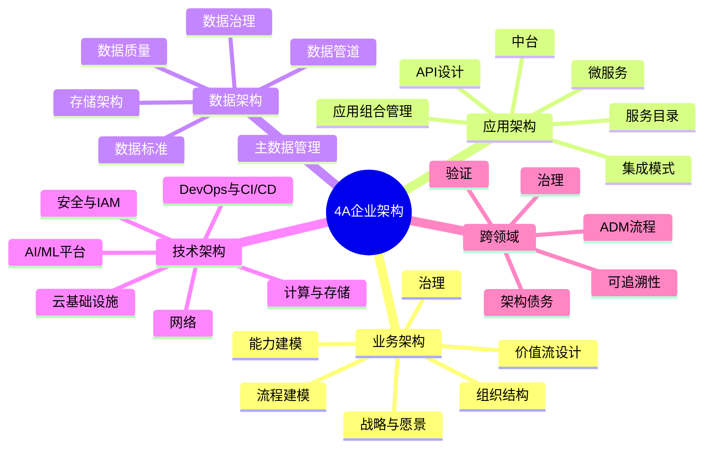

# 4A企业架构领域演进文档

## 1. 引言与历史背景

4A企业架构框架代表了一种系统化的方法，用于在四个相互关联的领域（**业务架构BA**、**应用架构AA**、**数据架构DA**和**技术架构TA**）中组织和管理企业IT架构。该框架提供了一种结构化的方法，使技术投资与业务战略保持一致，确保企业架构的每一层都直接为组织目标做出贡献。

4A框架深深扎根于企业架构方法论中，尤其是**开放组架构框架（TOGAF）**，该框架将这四个领域正式确定为建模企业架构的基础层次。该框架从20世纪80年代的早期企业架构实践演变而来，已成为大型组织中复杂IT环境的事实标准。

### 1.1. 4A企业架构演进时间线



## 2. 核心架构

4A企业架构框架建立在**分层模块化**原则之上，其中每个领域解决企业的一个独特方面，同时与相邻层保持明确的依赖关系。该框架遵循**自上而下设计，自下而上实施**的方法，确保从业务愿景到技术执行的战略一致性。



### 2.1. 业务架构（BA）

业务架构是定义组织战略方向、运营结构和价值交付机制的基础层。它回答了一个根本问题：**"企业做什么，以及如何创造价值？"**

**心智模型/类比：** 将业务架构想象成**城市总体规划的蓝图**。它定义了各个区域（业务单元）、交通网络（业务流程）、区划法规（治理）以及经济发展战略（业务能力）。正如城市规划师确保住宅、商业和工业区正确连接一样，业务架构确保业务战略转化为运营现实。

**关键组件：**
- **企业战略：** 愿景、使命、战略目标和业务目标
- **业务能力：** 组织能够做什么（例如"处理客户订单"、"管理供应链"）
- **价值流：** 向利益相关者交付价值的端到端活动序列
- **组织结构：** 业务单元、角色、职责和治理模型
- **业务流程：** 详细的工作流、决策点和参与者之间的交接
- **利益相关者映射：** 识别内外部利益相关者及其利益

**方法论：**
- 以客户为中心的流程优化
- 用于业务能力映射的领域驱动设计（DDD）
- 战略对齐映射（将战略与执行连接）
- 价值流分析与优化

**交付物：**
- 端到端业务流程模型
- 组织能力矩阵
- 战略路线图和计划组合
- 价值流定义与指标
- 业务能力地图

### 2.2. 应用架构（AA）

应用架构为要部署的个体软件系统提供蓝图，定义这些系统之间的交互，并将它们的关系映射到核心业务流程。它回答了：**"我们需要什么应用，它们如何协同工作？"**

**心智模型/类比：** 应用架构就像我们城市类比中的**建筑平面图和公用设施连接**。每栋建筑（应用）都有特定用途（办公、住宅、工业），而道路、管道和电力连接（API、集成、数据流）确保它们作为一个协调的生态系统运行。

**关键组件：**
- **企业应用组合：** ERP、CRM、SCM、HRIS及其他核心系统
- **功能模块：** 应用内离散的业务功能单元
- **微服务与API：** 分解的、可独立部署的服务组件
- **集成模式：** 同步/异步通信、事件驱动架构
- **业务与数据中台：** 支持跨功能能力的可重用服务层
- **服务目录：** 可用服务及其合约的清单

**方法论：**
- 微服务重构与分解
- 平台化设计（"平台+生态"）
- 能力重用建模与服务编排
- API优先设计与合约驱动开发

**交付物：**
- 系统架构蓝图与部署图
- 服务目录与API规范
- 应用组合合理化报告
- 集成架构文档
- 可复用的中台组件库

### 2.3. 数据架构（DA）

数据架构描述组织的逻辑和物理数据资产的结构以及相关的数据管理资源。它回答了：**"我们有什么数据，它们存储在哪里，以及如何治理？"**

**心智模型/类比：** 数据架构是我们城市的**供水和信息网络**。正如水必须被收集、净化、储存并通过精心设计的管道分配到每栋建筑一样，数据必须被捕获、清理、存储并使其可被每个需要它的应用和业务流程访问。

**关键组件：**
- **数据资产标准：** 命名约定、数据类型、编码标准
- **数据治理框架：** 数据管理的策略、角色和流程
- **数据流路径：** 数据如何在系统、应用和用户之间流动
- **数据存储架构：** 数据湖、数据仓库、操作数据库
- **数据质量与血缘：** 确保准确性和跟踪数据源的机制
- **主数据管理（MDM）：** 关键业务实体的单一权威来源
- **实时数据管道：** 事件流、CDC（变更数据捕获）和实时分析

**方法论：**
- 集中式数据标准化与治理
- 自动化数据质量与合规工作流
- 实时数据管道工程
- 数据网格与数据编织实施

**交付物：**
- 统一数据字典与业务术语表
- 数据治理策略和管理章程
- 数据湖/仓库架构与实施计划
- 数据血缘与质量指标仪表板
- 数据安全与隐私合规文档

### 2.4. 技术架构（TA）

技术架构描述支持部署关键任务应用所需的硬件、软件和网络基础设施。它回答了：**"我们需要什么技术基础设施来运行应用和管理数据？"**

**心智模型/类比：** 技术架构是我们城市的**地基、公用设施和物理基础设施**。它包括电网、水处理厂、道路网络和电信系统。没有坚实的技术基础，任何应用都无法可靠运行，任何数据都无法高效处理。

**关键组件：**
- **云基础设施：** IaaS、PaaS、SaaS平台、混合云架构
- **网络：** LAN/WAN、CDN、负载均衡器、API网关
- **计算与存储：** 服务器、容器、无服务器函数、分布式存储
- **操作系统与中间件：** OS平台、运行时环境、消息代理
- **安全与合规：** IAM、加密、防火墙、零信任架构
- **AI/ML基础设施：** GPU集群、模型服务平台、MLOps工具

**方法论：**
- "云优先、AI驱动"的部署策略
- 弹性计算与自动伸缩配置
- 开放API生态集成
- 基础设施即代码（IaC）与GitOps

**交付物：**
- 统一云平台架构与部署计划
- 基础设施配置模板（Terraform、CloudFormation）
- OpenAPI目录与服务网格配置
- 安全参考架构与合规框架
- 可扩展性与灾难恢复计划

```mermaid
graph TD
    EA["4A企业架构"]
    
    EA --> BA["业务架构"]
    BA --> BA1["战略与愿景"]
    BA --> BA2["能力地图"]
    BA --> BA3["价值流"]
    BA --> BA4["流程模型"]
    BA --> BA5["组织结构"]
    
    EA --> AA["应用架构"]
    AA --> AA1["应用组合"]
    AA --> AA2["微服务"]
    AA --> AA3["API合约"]
    AA --> AA4["集成模式"]
    AA --> AA5["中台"]
    
    EA --> DA["数据架构"]
    DA --> DA1["数据标准"]
    DA --> DA2["治理"]
    DA --> DA3["数据湖/仓库"]
    DA --> DA4["数据管道"]
    DA --> DA5["主数据管理"]
    
    EA --> TA["技术架构"]
    TA --> TA1["云基础设施"]
    TA --> TA2["网络"]
    TA --> TA3["计算与存储"]
    TA --> TA4["安全与IAM"]
    TA --> TA5["AI/ML平台"]
    
    classDef main fill:#1565c0,stroke:#0d47a1,stroke-width:2px,color:#fff;
    classDef domain fill:#e1f5fe,stroke:#01579b,stroke-width:2px;
    classDef sub fill:#bbdefb,stroke:#1976d2,stroke-width:1px;
    class EA main;
    class BA,AA,DA,TA domain;
    class BA1,BA2,BA3,BA4,BA5,AA1,AA2,AA3,AA4,AA5,DA1,DA2,DA3,DA4,DA5,TA1,TA2,TA3,TA4,TA5 sub;
```



## 3. 详细架构概述

### 3.1. 架构开发方法（ADM）

4A框架通过**架构开发方法（ADM）**进行实施，这是一种开发和管理企业架构的分步流程。ADM确保每个领域得到系统化处理，并且领域之间的依赖关系得到正确管理。

**ADM阶段流程：**



**4A领域的关键ADM阶段：**

- **阶段B（业务架构）：** 开发目标业务架构，识别差距，并定义业务转型路线图。
- **阶段C（信息系统架构）：** 结合应用架构和数据架构，确保应用组合和数据资产与业务需求保持一致。
- **阶段D（技术架构）：** 定义目标技术基础设施，包括硬件、软件和网络需求。

### 3.2. 业务架构深入解析

#### 3.2.1. 业务能力建模

**目标：** 以结构化、技术无关的方式定义组织做什么。

**方法：**
1. **识别核心能力：** 使企业差异化的战略职能（例如"产品创新"、"客户关系管理"）
2. **识别支持能力：** 赋能职能（例如"人力资源管理"、"财务报告"）
3. **分解能力：** 向下分解为二级和三级能力以实现细粒度
4. **映射到价值流：** 将能力与其赋能的价值流连接
5. **评估成熟度：** 评估每个能力的当前状态与目标状态

**能力地图示例：**
```
企业能力：客户管理
├── 二级：客户获取
│   ├── 三级：线索生成
│   ├── 三级：线索验证
│   └── 三级：方案开发
├── 二级：客户留存
│   ├── 三级：客户支持
│   ├── 三级：忠诚度计划
│   └── 三级：续约管理
└── 二级：客户分析
    ├── 三级：客户细分
    ├── 三级：生命周期价值分析
    └── 三级：流失预测
```

#### 3.2.2. 价值流设计

**目标：** 映射向利益相关者交付价值的端到端活动序列。

**方法：**
1. **识别利益相关者：** 客户、员工、合作伙伴、监管机构
2. **定义触发器：** 什么启动价值流（例如"客户下订单"）
3. **映射阶段：** 将输入转换为输出的顺序阶段
4. **识别能力：** 将每个阶段与赋能它的能力连接
5. **定义指标：** 用于衡量价值流绩效的KPI

**价值流示例："订单到现金"**
```
触发器：客户提交订单
→ 阶段1：订单捕获（能力：订单管理）
→ 阶段2：订单验证（能力：信用评估）
→ 阶段3：订单履行（能力：库存管理）
→ 阶段4：发票生成（能力：计费）
→ 阶段5：收款（能力：应收账款）
→ 阶段6：收入确认（能力：财务报告）
结果：客户收到产品，公司收到付款
```

#### 3.2.3. 业务流程建模

**目标：** 记录详细的工作流、决策点和交接。

**方法：**
- 使用**BPMN 2.0**（业务流程模型与表示法）进行标准化
- 为不同角色/部门识别**泳道**
- 映射**决策网关**和异常处理路径
- 定义流程持续时间和质量的**SLA目标**

### 3.3. 应用架构深入解析

#### 3.3.1. 应用组合管理

**目标：** 合理化并优化组织的应用景观。

**方法：**
1. **清单：** 编录所有使用中的应用（包括影子IT）
2. **评估：** 根据业务适配度、技术质量、成本和风险评估每个应用
3. **合理化：** 应用**TIME**模型：
   - **T**olerate（维持现状）
   - **I**nvest（增强与现代化）
   - **M**igrate（替换或整合）
   - **E**liminate（退役与下线）
4. **路线图：** 定义目标应用组合与迁移计划

#### 3.3.2. 微服务架构

**目标：** 将单体应用分解为可独立部署、松散耦合的服务。

**设计原则：**
- **单一职责：** 每个服务拥有一个业务能力
- **边界上下文：** 服务与领域驱动设计边界对齐
- **API优先：** 服务通过明确定义的API通信
- **数据所有权：** 每个服务拥有自己的数据存储（每个服务一个数据库）
- **独立部署：** 服务可以在不与其他服务协调的情况下部署

**微服务分解示例：**
```
单体电商应用
├── 用户管理服务
├── 产品目录服务
├── 购物车服务
├── 订单处理服务
├── 支付处理服务
├── 库存管理服务
├── 通知服务
└── 分析服务
```

#### 3.3.3. 集成架构模式

**目标：** 实现应用和服务之间的无缝通信。

**关键模式：**

| 模式 | 描述 | 适用场景 |
|---------|-------------|----------|
| **同步API（REST/GraphQL）** | 直接请求-响应通信 | 实时数据检索、面向用户的操作 |
| **异步消息（Kafka/RabbitMQ）** | 事件驱动、解耦通信 | 高吞吐量、容错工作流 |
| **事件溯源** | 状态变更捕获为不可变事件 | 审计跟踪、CQRS架构 |
| **API网关** | 所有客户端请求的单一入口点 | 集中认证、限流、路由 |
| **服务网格** | 服务间通信的基础设施层 | 大规模微服务部署 |
| **企业服务总线（ESB）** | 集中式集成平台（遗留） | 异构企业系统（正被微服务取代） |

### 3.4. 数据架构深入解析

#### 3.4.1. 数据治理框架

**目标：** 建立策略、角色和流程，将数据作为战略资产进行管理。

**关键组件：**
- **数据所有权：** 为每个领域分配数据管理者和数据所有者
- **数据质量标准：** 定义准确性、完整性、及时性和一致性指标
- **数据血缘：** 跟踪数据从源头到消费的透明度和合规性
- **主数据管理：** 维护关键实体（客户、产品、员工）的单一权威来源
- **数据安全与隐私：** 实施访问控制、加密和法规合规（GDPR、CCPA、HIPAA）

#### 3.4.2. 数据存储架构

**目标：** 为每个数据用例设计合适的存储解决方案。

**存储选项：**

| 存储类型 | 技术示例 | 用例 |
|--------------|---------------------|----------|
| **关系数据库** | PostgreSQL、MySQL、Oracle | 交易系统、ACID合规 |
| **文档存储** | MongoDB、Couchbase | 灵活模式、内容管理 |
| **数据仓库** | Snowflake、Redshift、BigQuery | 分析、BI报告、历史数据 |
| **数据湖** | Hadoop、S3、ADLS | 原始数据存储、数据科学、ML训练 |
| **键值存储** | Redis、DynamoDB | 缓存、会话管理、实时查找 |
| **图数据库** | Neo4j、Amazon Neptune | 关系密集型数据、推荐引擎 |
| **时序数据库** | InfluxDB、TimescaleDB | IoT、监控、金融市场数据 |

#### 3.4.3. 数据管道架构

**目标：** 将数据从源系统移动和转换到消费层。

**管道模式：**

**批处理管道（ETL）：**
```
源系统 → 提取 → 转换 → 加载 → 数据仓库 → BI/分析
```

**实时管道（流处理）：**
```
源系统 → CDC/事件捕获 → 流处理（Kafka/Flink） → 实时存储 → 仪表板/API
```

**Lambda架构（批处理+流处理）：**
```
                    ┌→ 批处理层（Hadoop/Spark）──→ 服务层 ──→ 分析
源系统 ────────────┤
                    └→ 速度层（Kafka/Storm）───→ 服务层 ──→ 分析
```

### 3.5. 技术架构深入解析

#### 3.5.1. 云架构模式

**目标：** 设计可扩展、有弹性且成本效益高的云基础设施。

**云服务模型：**

| 模型 | 描述 | 示例 |
|-------|-------------|----------|
| **IaaS**（基础设施即服务） | 虚拟化计算资源 | AWS EC2、Azure VMs、Google Compute Engine |
| **PaaS**（平台即服务） | 用于应用部署的托管平台 | AWS Elastic Beanstalk、Heroku、Google App Engine |
| **SaaS**（软件即服务） | 完全托管的应用 | Salesforce、Office 365、Slack |
| **FaaS**（函数即服务） | 无服务器函数执行 | AWS Lambda、Azure Functions、Google Cloud Functions |
| **CaaS**（容器即服务） | 托管容器编排 | EKS、AKS、GKE |

**多云架构：**
```
                    ┌─────────────┐
                    │   DNS/CDN   │
                    └──────┬──────┘
                           │
        ┌──────────────────┼──────────────────┐
        ▼                  ▼                  ▼
┌───────────────┐  ┌───────────────┐  ┌───────────────┐
│   AWS云       │  │  Azure云      │  │  GCP云        │
│  (主)         │  │  (备)         │  │  (ML/AI)      │
│               │  │               │  │               │
│ • 计算        │  │ • 活动目录    │  │ • BigQuery    │
│ • S3存储      │  │ • SQL DB      │  │ • Vertex AI   │
│ • RDS         │  │ • Blob存储    │  │ • Cloud SQL   │
└───────────────┘  └───────────────┘  └───────────────┘
```

#### 3.5.2. 安全架构

**目标：** 通过分层安全控制保护企业资产。

**零信任架构原则：**
- **永不信任，始终验证：** 每个请求都经过认证和授权
- **最小权限访问：** 用户和服务获得最低必要权限
- **微分段：** 限制工作负载之间的网络流量
- **持续监控：** 实时威胁检测与响应

**安全层：**
```
┌─────────────────────────────────────────────────┐
│               应用安全                           │
│  (WAF、输入验证、认证/授权)                       │
├─────────────────────────────────────────────────┤
│               数据安全                           │
│  (静态与传输加密、DLP)                           │
├─────────────────────────────────────────────────┤
│               网络安全                           │
│  (防火墙、IDS/IPS、零信任网络)                   │
├─────────────────────────────────────────────────┤
│               基础设施安全                        │
│  (IAM、端点保护、容器安全)                        │
├─────────────────────────────────────────────────┤
│               物理安全                           │
│  (数据中心访问、环境控制)                         │
└─────────────────────────────────────────────────┘
```

#### 3.5.3. DevOps与平台工程

**目标：** 通过自动化和自助服务平台实现快速、可靠的软件交付。

**CI/CD管道架构：**
```
代码提交 → 构建 → 单元测试 → 集成测试 → 安全扫描 → 预发布 → 生产 → 监控
    │           │        │              │               │           │          │            │
    └───────────┴────────┴──────────────┴───────────────┴───────────┴──────────┴────────────┘
                                      反馈循环
```

**内部开发者平台（IDP）：**
```
┌─────────────────────────────────────────────┐
│            开发者门户                        │
│  (自助UI、文档、目录)                         │
├─────────────────────────────────────────────┤
│            平台API                           │
│  (配置、部署、监控)                           │
├─────────────────────────────────────────────┤
│            黄金路径                          │
│  (预批准模板、最佳实践)                       │
├─────────────────────────────────────────────┤
│            基础设施自动化                     │
│  (Terraform、Kubernetes、GitOps)             │
└─────────────────────────────────────────────┘
```

### 3.6. 跨领域集成模式

#### 3.6.1. 顺序分解流程

4A框架遵循**自上而下的分解**模式：



**可追溯性链表示例：**

| 层 | 工件 | 示例 |
|-------|----------|---------|
| **BA** | 业务能力 | "处理客户订单" |
| **AA** | 应用服务 | 订单处理服务（REST API） |
| **DA** | 数据实体 | 订单、订单项、客户（关系模型） |
| **TA** | 基础设施 | AWS ECS（容器）、RDS PostgreSQL（数据库）、CloudFront（CDN） |

#### 3.6.2. 双向验证

每层必须与相邻层进行验证，以防止业务-IT脱节：

- **BA ↔ AA 验证：** 应用服务是否完全支持业务能力？是否存在冗余或孤立的应用？
- **AA ↔ DA 验证：** 应用是否能访问所需数据？数据重复是否最小化？
- **DA ↔ TA 验证：** 技术基础设施是否能支持数据量、速度和多样性需求？

#### 3.6.3. 统一治理模型

**架构审查委员会（ARB）：**
- **组成：** 所有4A领域的代表、业务利益相关者
- **职责：** 架构标准批准、例外处理、路线图对齐
- **节奏：** 双周审查、季度路线图评估

**治理工件：**
- 架构原则与标准存储库
- 例外请求与审批工作流
- 合规记分卡与成熟度评估
- 架构债务跟踪与修复计划

### 3.7. 架构思维导图



## 4. 演进与影响

### 4.1. 框架演进

- **1987年：** Zachman框架引入了首个系统化企业架构方法，为基于领域的架构思维奠定了基础。
- **1995年：** TOGAF v1.0正式确定了4领域结构（业务、应用、数据、技术），为企业架构师提供了实用的方法论。
- **2009年：** TOGAF 9.0引入了企业连续体和解决方案连续体，加强了架构领域与实施之间的联系。
- **2014年：** 数字化转型加速了4A框架在亚太企业中的采用，尤其在中国，它成为国有企业架构的标准。
- **2018年：** 云原生和微服务架构重塑了应用架构，而数据湖和实时处理改变了数据架构。
- **2021年：** TOGAF 10标准强调敏捷性、数字化业务以及新兴技术在所有4A领域的集成。
- **2023-2024年：** 生成式AI和平台工程为所有四个领域引入了新范式，从AI辅助业务流程优化到自主基础设施管理。

### 4.2. 生态系统关系

- **TOGAF：** 通过ADM流程实施4A框架的主要方法论。
- **Zachman框架：** 提供了互补的分类法（什么、如何、哪里、谁、何时、为什么 × 规划者、所有者、设计者、构建者、分包商、功能企业）。
- **ArchiMate：** 专门用于可视化4A架构工件的建模语言。
- **领域驱动设计（DDD）：** 为应用架构提供了战术模式，尤其是微服务分解。
- **ITIL/COBIT：** 与4A架构实践集成的IT服务管理和治理的补充框架。

### 4.3. 社区与行业采用

- **财富500强：** 超过80%的财富500强公司使用TOGAF或基于4A的企业架构框架。
- **政府：** 联邦企业架构框架（FEAF）、国防部架构框架（DoDAF）和北约架构框架都包含4A领域结构。
- **云提供商：** AWS、Azure和Google Cloud提供的架构框架直接映射到4A领域（AWS Well-Architected Framework、Azure Architecture Center）。
- **咨询：** 主要咨询公司（麦肯锡、德勤、埃森哲）使用基于4A的框架进行企业架构评估和转型路线图。

## 5. 结论

4A企业架构框架仍然是组织复杂IT环境最持久和实用的方法之一。通过将企业架构划分为**业务、应用、数据和技术**领域，该框架提供了一种结构化的方法，确保每一项技术投资都直接支持业务战略。

在云原生计算、AI/ML集成和平台工程的现代时代，4A框架展示了 remarkable 的适应性。业务架构现在融入了AI驱动的战略规划；应用架构拥抱微服务和内部开发者平台；数据架构向数据网格和实时分析演进；技术架构融入了无服务器计算、GitOps和零信任安全。

该框架的优势在于其**模块化和可追溯性**：每个技术决策都可以追溯到一个业务需求，每个业务能力都有清晰的应用、数据和技术赋能。这种端到端的对齐确保企业架构仍然是一个战略性的学科，而不仅仅是一个技术练习。

对于进行数字化转型的组织，4A框架提供了**共同语言和结构化方法论**，使业务领导者、架构师、开发者和运营团队围绕企业未来状态的共享愿景保持一致。
