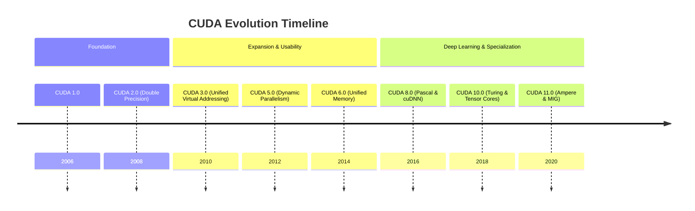
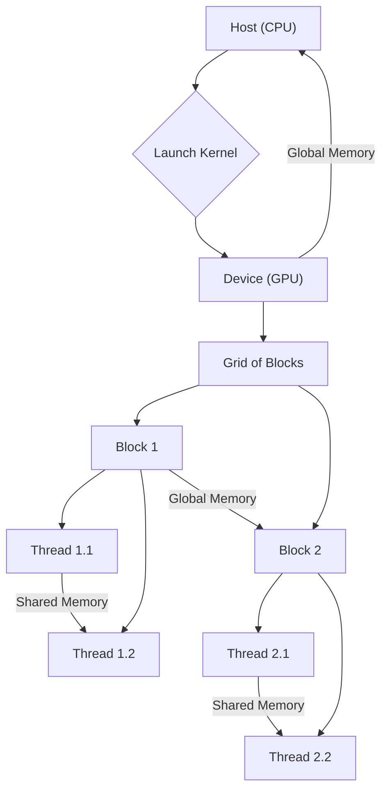
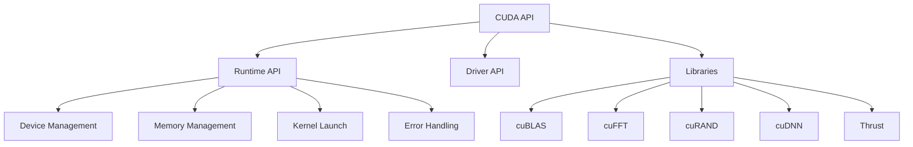
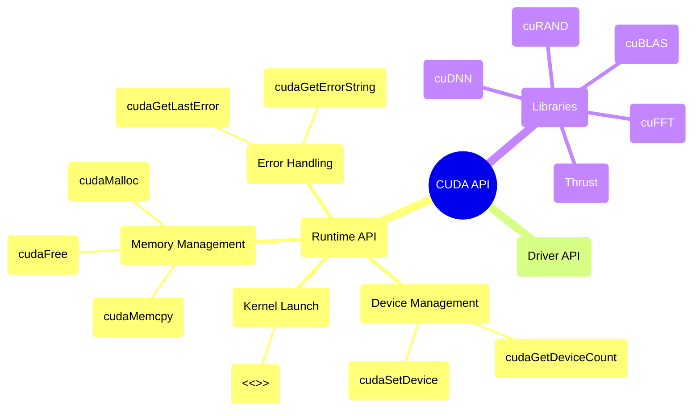

# CUDA Evolution Document

## 1. History and Evolution

NVIDIA CUDA (Compute Unified Device Architecture) is a parallel computing platform and programming model developed by NVIDIA for its GPUs. CUDA was first introduced in 2006, allowing developers to use C, C++, and Fortran to write programs that run on NVIDIA GPUs. This marked a significant shift from using GPUs solely for graphics rendering to general-purpose parallel processing.

### Key Milestones:



## 2. Core Architecture

CUDA's architecture is built around the concept of a host (CPU) and a device (GPU). The host manages the overall application, while the device performs parallel computations.

### Mental Model / Analogy:
Imagine a highly specialized factory. The **Host (CPU)** is the factory manager, overseeing the entire operation, preparing tasks, and handling general logistics. The **Device (GPU)** is the factory floor, equipped with thousands of highly efficient workers (CUDA Cores) that excel at performing many identical, parallel tasks simultaneously. The manager (CPU) sends specific, intensive tasks to the factory floor (GPU) to be executed in parallel, then retrieves the results.

### Key Components:
- **CUDA Cores:** The fundamental processing units on an NVIDIA GPU, designed for parallel execution.
- **Streaming Multiprocessors (SMs):** Groups of CUDA Cores, along with shared memory and registers, that execute warps of threads.
- **Global Memory:** High-bandwidth memory accessible by all threads on the GPU.
- **Shared Memory:** Low-latency, high-bandwidth memory shared by threads within a single thread block.
- **Registers:** Fastest memory, private to each thread.
- **Host (CPU):** Manages the GPU, transfers data, and launches kernels.
- **Device (GPU):** Executes parallel kernels.

### Execution Model:
CUDA uses a hierarchical execution model:
- **Grid:** A collection of thread blocks, executed on the GPU.
- **Block:** A group of threads that can cooperate by sharing data through shared memory and synchronizing their execution.
- **Thread:** The basic unit of execution, running a single instance of a kernel function.



## 3. Detailed API Overview

The CUDA API provides a comprehensive set of functions and libraries for programming NVIDIA GPUs. It is primarily exposed through C/C++ interfaces.

### 3.1. Device Management

Functions for querying and managing GPU devices.

#### `cudaGetDeviceCount(int* count)`

**Goal:** Retrieve the number of CUDA-capable devices.

**Context:** This function is essential for enumerating available GPUs and is typically one of the first CUDA calls an application makes to discover the system's GPU capabilities.
*   **Parameters:**
    *   `count`: A pointer to an integer in which the number of CUDA-capable devices will be returned.
*   **Returns:** `cudaError_t` indicating the success or failure of the operation. `cudaSuccess` if successful, or an error code otherwise.

**Code:**
```cpp
#include <iostream>
#include <cuda_runtime.h>

int main() {
    int deviceCount;
    cudaError_t cudaStatus = cudaGetDeviceCount(&deviceCount);
    if (cudaStatus != cudaSuccess) {
        fprintf(stderr, "cudaGetDeviceCount failed: %s\n", cudaGetErrorString(cudaStatus));
        return 1;
    }
    std::cout << "CUDA-capable device(s) found: " << deviceCount << std::endl;
    return 0;
}
```

**Expected Output:**
```
CUDA-capable device(s) found: 1
```
(Output may vary depending on the system's GPU configuration)

**Explanation:** This function is essential for enumerating available GPUs and can be used to select a specific device for computation. Error checking with `cudaError_t` and `cudaGetErrorString` is a common practice in CUDA programming.

#### `cudaSetDevice(int device)`

**Goal:** Set the current CUDA device for the calling host thread.

**Context:** This function allows a host thread to explicitly choose which GPU it will interact with. This is particularly useful in multi-GPU systems where different threads or parts of an application might target different devices.
*   **Parameters:**
    *   `device`: The ID of the CUDA device to set as current.
*   **Returns:** `cudaError_t` indicating the success or failure of the operation. `cudaSuccess` if successful, or an error code otherwise.

**Explanation:** This function allows a host thread to explicitly choose which GPU it will interact with. This is particularly useful in multi-GPU systems where different threads or parts of an application might target different devices.

##### Quick Reference: Device Management

| Function | Description | When to Use |
| :--- | :--- | :--- |
| `cudaGetDeviceCount()` | Get the number of CUDA devices | To check for available GPUs and iterate through them. |
| `cudaSetDevice()` | Set the current device | To explicitly select a GPU in multi-GPU environments. |

### 3.2. Memory Management

Functions for allocating, deallocating, and transferring memory between host (CPU) and device (GPU).

#### `cudaMalloc(void** devPtr, size_t size)`

**Goal:** Allocate memory on the device.

**Context:** `cudaMalloc` is analogous to `malloc` in C/C++ but allocates memory directly on the GPU's global memory. This memory is accessible by all threads on the device and is a fundamental step before performing any GPU computations that require device-side data.
*   **Parameters:**
    *   `devPtr`: A pointer to a pointer in host memory that will be set to the starting address of the allocated device memory.
    *   `size`: The size in bytes of the memory to allocate on the device.
*   **Returns:** `cudaError_t` indicating the success or failure of the operation. `cudaSuccess` if successful, or an error code otherwise.

**Code:**
```cpp
#include <iostream>
#include <cuda_runtime.h>

int main() {
    float* d_data; // Device pointer
    size_t size = 1024 * sizeof(float); // Allocate 1024 floats

    cudaError_t cudaStatus = cudaMalloc((void**)&d_data, size);
    if (cudaStatus != cudaSuccess) {
        fprintf(stderr, "cudaMalloc failed: %s\n", cudaGetErrorString(cudaStatus));
        return 1;
    }
    std::cout << "Successfully allocated " << size << " bytes on device." << std::endl;

    cudaFree(d_data); // Free memory after use
    return 0;
}
```

**Expected Output:**
```
Successfully allocated 4096 bytes on device.
```

**Explanation:** `cudaMalloc` is analogous to `malloc` in C/C++ but allocates memory directly on the GPU's global memory. This memory is accessible by all threads on the device.

#### `cudaFree(void* devPtr)`

**Goal:** Free memory on the device.

**Context:** Releases memory previously allocated with `cudaMalloc`. It's crucial to free device memory to prevent memory leaks and ensure efficient resource utilization on the GPU.
*   **Parameters:**
    *   `devPtr`: Device pointer to memory to be freed.
*   **Returns:** `cudaError_t` indicating the success or failure of the operation. `cudaSuccess` if successful, or an error code otherwise.

**Explanation:** Releases memory previously allocated with `cudaMalloc`. It's crucial to free device memory to prevent memory leaks.

#### `cudaMemcpy(void* dst, const void* src, size_t count, cudaMemcpyKind kind)`

**Goal:** Copy data between host and device.

**Context:** This function is the primary way to move data between the CPU's main memory and the GPU's global memory. It is a synchronous operation, meaning it blocks the host thread until the copy is complete. It is essential for transferring input data to the GPU and retrieving results from the GPU.
*   **Parameters:**
    *   `dst`: Destination memory address.
    *   `src`: Source memory address.
    *   `count`: Size in bytes to copy.
    *   `kind`: Type of transfer, e.g., `cudaMemcpyHostToDevice`, `cudaMemcpyDeviceToHost`, `cudaMemcpyDeviceToDevice`.
*   **Returns:** `cudaError_t` indicating the success or failure of the operation. `cudaSuccess` if successful, or an error code otherwise.

**Code:**
```cpp
#include <iostream>
#include <vector>
#include <cuda_runtime.h>

int main() {
    const int N = 10;
    size_t bytes = N * sizeof(int);

    // Host memory
    std::vector<int> h_data(N);
    for (int i = 0; i < N; ++i) h_data[i] = i;

    // Device memory
    int* d_data;
    cudaMalloc((void**)&d_data, bytes);

    // Copy from host to device
    cudaMemcpy(d_data, h_data.data(), bytes, cudaMemcpyHostToDevice);
    std::cout << "Copied data from host to device." << std::endl;

    // (Perform GPU computation here)

    // Copy from device to host (for verification)
    std::vector<int> h_result(N);
    cudaMemcpy(h_result.data(), d_data, bytes, cudaMemcpyDeviceToHost);
    std::cout << "Copied data from device to host." << std::endl;

    std::cout << "First 5 elements from device: ";
    for (int i = 0; i < 5; ++i) {
        std::cout << h_result[i] << " ";
    }
    std::cout << std::endl;

    cudaFree(d_data);
    return 0;
}
```

**Expected Output:**
```
Copied data from host to device.
Copied data from device to host.
First 5 elements from device: 0 1 2 3 4 
```

**Explanation:** This function is the primary way to move data between the CPU's main memory and the GPU's global memory. The `cudaMemcpyKind` enum specifies the direction of the transfer (e.g., `cudaMemcpyHostToDevice`, `cudaMemcpyDeviceToHost`, `cudaMemcpyDeviceToDevice`).

##### Quick Reference: Memory Management

| Function | Description | When to Use |
| :--- | :--- | :--- |
| `cudaMalloc()` | Allocate device memory | Before performing computations on the GPU that require device-side data. |
| `cudaFree()` | Free device memory | After device memory is no longer needed to prevent leaks. |
| `cudaMemcpy()` | Copy data H<->D | To transfer input data to the GPU and retrieve results from the GPU. |

### 3.3. Kernel Launch

Functions for launching kernel functions on the GPU.

#### Kernel Launch Syntax: `<<<gridDim, blockDim, sharedMemBytes, stream>>>`

**Goal:** Execute a `__global__` function (kernel) on the GPU with a specified configuration.

**Mind Model / Analogy:**
Imagine you have a huge factory (the GPU) and a task (your kernel function) that needs to be done by many workers (threads). You don't just tell one worker to do it; you organize them into teams (blocks) and then assign many teams to the factory floor (grid). The kernel launch syntax is like the instruction sheet you give to the factory manager: "Launch this task with X teams, each team having Y workers, and give each team Z amount of shared workspace."

**Code:**
```cpp
#include <iostream>
#include <cuda_runtime.h>

// Simple kernel to add 1 to each element
__global__ void addOne(int* data, int N) {
    int idx = blockIdx.x * blockDim.x + threadIdx.x;
    if (idx < N) {
        data[idx] += 1;
    }
}

int main() {
    const int N = 10;
    size_t bytes = N * sizeof(int);
    int h_data[N] = {0, 1, 2, 3, 4, 5, 6, 7, 8, 9};
    int* d_data;

    cudaMalloc((void**)&d_data, bytes);
    cudaMemcpy(d_data, h_data, bytes, cudaMemcpyHostToDevice);

    int threadsPerBlock = 256;
    int blocksPerGrid = (N + threadsPerBlock - 1) / threadsPerBlock;

    // Launch the kernel
    addOne<<<blocksPerGrid, threadsPerBlock>>>(d_data, N);

    cudaMemcpy(h_data, d_data, bytes, cudaMemcpyDeviceToHost);

    std::cout << "Data after kernel execution: ";
    for (int i = 0; i < N; ++i) {
        std::cout << h_data[i] << " ";
    }
    std::cout << std::endl;

    cudaFree(d_data);
    return 0;
}
```

**Expected Output:**
```
Data after kernel execution: 1 2 3 4 5 6 7 8 9 10 
```

**Explanation:** The `<<<...>>>` syntax is unique to CUDA and specifies the execution configuration for a kernel. `gridDim` (first argument) defines the number of thread blocks, and `blockDim` (second argument) defines the number of threads within each block. Optional arguments include `sharedMemBytes` for dynamic shared memory allocation and `stream` for asynchronous execution.

##### Quick Reference: Kernel Launch

| Syntax | Description | When to Use |
| :--- | :--- | :--- |
| `<<<G, B>>>` | Launch kernel with G blocks, B threads/block | To execute parallel code on the GPU. |

### 3.4. Error Handling

Functions for checking and reporting CUDA errors.

#### `cudaGetLastError()`

**Goal:** Returns the last error that has occurred.

**Context:** After any CUDA API call or kernel launch, `cudaGetLastError()` can be called to check for errors. It's good practice to check for errors frequently, especially after asynchronous operations like kernel launches, to ensure proper error handling and debugging.
*   **Parameters:** None.
*   **Returns:** `cudaError_t` indicating the last error code. `cudaSuccess` if no error has occurred since the last call to `cudaGetLastError()` or `cudaPeekAtLastError()`, or an error code otherwise.

**Explanation:** After any CUDA API call or kernel launch, `cudaGetLastError()` can be called to check for errors. It's good practice to check for errors frequently, especially after asynchronous operations like kernel launches.

#### `cudaGetErrorString(cudaError_t error)`

**Goal:** Returns a string description of a CUDA error code.

**Context:** This utility function converts a `cudaError_t` enum value into a human-readable string, which is invaluable for debugging and logging CUDA errors. It helps in understanding the nature of an error without needing to refer to documentation for error codes.
*   **Parameters:**
    *   `error`: The CUDA error code to convert.
*   **Returns:** A const char* pointer to the string description of the error code.

**Explanation:** This utility function converts a `cudaError_t` enum value into a human-readable string, which is invaluable for debugging.

##### Quick Reference: Error Handling

| Function | Description | When to Use |
| :--- | :--- | :--- |
| `cudaGetLastError()` | Get the last error | After any CUDA operation to check for success or failure. |
| `cudaGetErrorString()` | Get error description | To convert error codes into readable messages for debugging. |

### 3.5. Driver API

A lower-level API that provides more control over the GPU, often used by higher-level libraries. It's typically used when finer-grained control over context management, module loading, and memory mapping is required, often by framework developers rather than application developers.

### 3.6. Libraries

NVIDIA provides a rich set of highly optimized libraries built on CUDA.

- **cuBLAS:** GPU-accelerated Basic Linear Algebra Subprograms. Essential for high-performance matrix operations.
- **cuFFT:** GPU-accelerated Fast Fourier Transforms. Used in signal processing and image analysis.
- **cuRAND:** GPU-accelerated random number generation. Important for simulations and machine learning.
- **cuDNN:** GPU-accelerated primitives for deep neural networks. A cornerstone for deep learning frameworks like TensorFlow and PyTorch.
- **Thrust:** A C++ template library for parallel algorithms. Provides a high-level interface for common parallel patterns (e.g., sort, reduce, scan) that can be executed on both CPUs and GPUs.



### 3.7. API Mind Map



## 4. Evolution and Impact

- **Kernels:** Functions executed in parallel on the GPU.
- **Threads, Blocks, Grids:** The hierarchical organization of parallel execution.
  **Mind Model / Analogy:** Think of a massive orchestra. The entire orchestra is the **Grid**. Within the orchestra, you have sections (strings, brass, woodwinds) – these are the **Blocks**. Each musician in a section is a **Thread**. Each musician plays their part (executes the kernel), and musicians within a section can coordinate closely (shared memory, synchronization), while different sections work more independently but contribute to the overall symphony.
- **Memory Hierarchy:** Global, shared, and register memory with different performance characteristics.
- **Streams:** Sequences of CUDA operations that execute in order on the device.
- **Events:** Used for timing and synchronizing CUDA operations.
- **Unified Memory:** A single memory address space accessible by both CPU and GPU.
- **Tensor Cores:** Specialized hardware units on NVIDIA GPUs for accelerating matrix operations, crucial for deep learning.

## 5. Conclusion and Future Trajectory

CUDA continues to evolve with new GPU architectures and advancements in parallel computing. Future directions include:
- Enhanced support for new AI workloads and data types.
- Further improvements in memory management and data transfer efficiency.
- Integration with emerging programming models and languages.
- Expansion into new domains beyond traditional scientific computing and deep learning.
