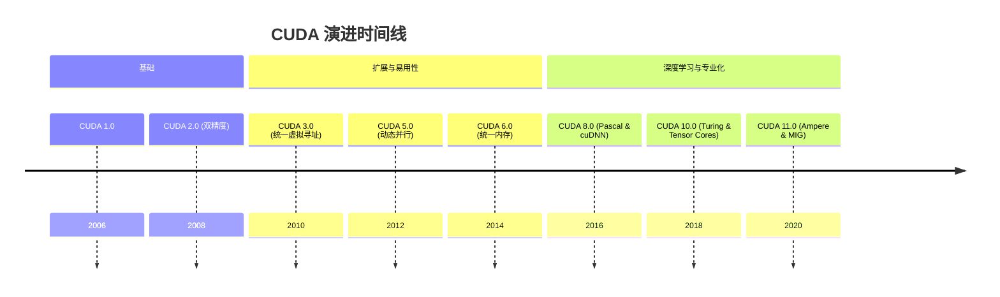
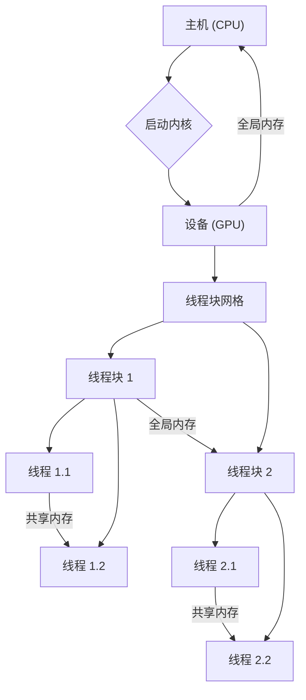
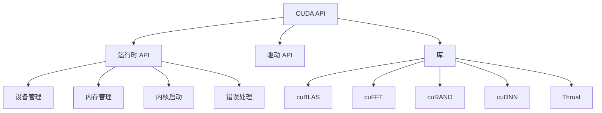
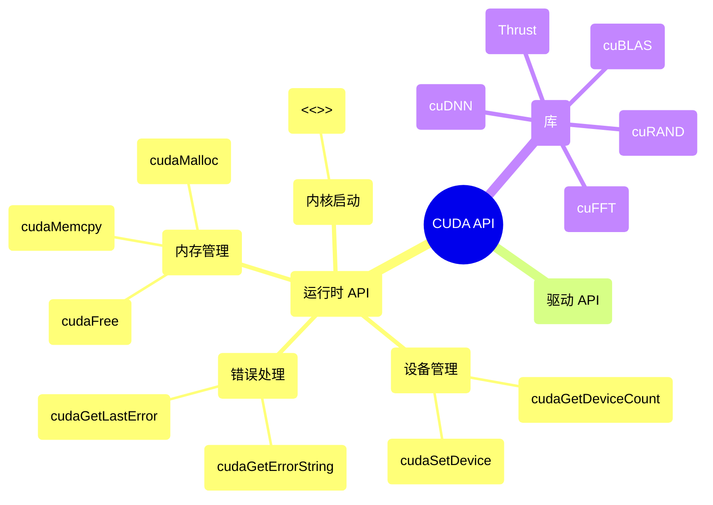

# CUDA 演进文档

## 1. 历史与演进

NVIDIA CUDA（Compute Unified Device Architecture）是 NVIDIA 为其 GPU 开发的并行计算平台和编程模型。CUDA 于 2006 年首次推出，允许开发者使用 C、C++ 和 Fortran 编写在 NVIDIA GPU 上运行的程序。这标志着 GPU 从仅用于图形渲染到通用并行处理的重大转变。

### 重要里程碑：



## 2. 核心架构

CUDA 的架构围绕着主机（CPU）和设备（GPU）的概念构建。主机管理整个应用程序，而设备执行并行计算。

### 关键组件：
- **CUDA 核心：** NVIDIA GPU 上的基本处理单元，专为并行执行而设计。
- **流式多处理器 (SM)：** CUDA 核心组，以及共享内存和寄存器，执行线程束。
- **全局内存：** GPU 上所有线程都可访问的高带宽内存。
- **共享内存：** 单个线程块内线程共享的低延迟、高带宽内存。
- **寄存器：** 最快的内存，每个线程私有。
- **主机 (CPU)：：** 管理 GPU，传输数据，并启动内核。
- **设备 (GPU)：** 执行并行内核。

### 执行模型：
CUDA 使用分层执行模型：
- **网格 (Grid)：** 线程块的集合，在 GPU 上执行。
- **块 (Block)：** 一组线程，可以通过共享内存共享数据并同步执行来协作。
- **线程 (Thread)：** 基本执行单元，运行内核函数的一个实例。



## 3. 详细 API 概述

CUDA API 提供了一套全面的函数和库，用于编程 NVIDIA GPU。它主要通过 C/C++ 接口公开。

### 3.1. 设备管理

用于查询和管理 GPU 设备的函数。

#### `cudaGetDeviceCount(int* count)`

**目标：** 获取 CUDA 可用设备的数量。

**代码：**
```cpp
#include <iostream>
#include <cuda_runtime.h>

int main() {
    int deviceCount;
    cudaError_t cudaStatus = cudaGetDeviceCount(&deviceCount);
    if (cudaStatus != cudaSuccess) {
        fprintf(stderr, "cudaGetDeviceCount failed: %s\n", cudaGetErrorString(cudaStatus));
        return 1;
    }
    std::cout << "找到 CUDA 可用设备: " << deviceCount << std::endl;
    return 0;
}
```

**预期输出：**
```
找到 CUDA 可用设备: 1
```
（输出可能因系统 GPU 配置而异）

**解释：** 此函数对于枚举可用 GPU 至关重要，可用于选择特定设备进行计算。使用 `cudaError_t` 和 `cudaGetErrorString` 进行错误检查是 CUDA 编程中的常见做法。

#### `cudaSetDevice(int device)`

**目标：** 为调用主机线程设置当前的 CUDA 设备。

**解释：** 此函数允许主机线程显式选择它将与之交互的 GPU。这在多 GPU 系统中特别有用，其中不同的线程或应用程序的不同部分可能针对不同的设备。

##### 快速参考：设备管理

| 函数 | 描述 | 使用时机 |
| :--- | :--- | :--- |
| `cudaGetDeviceCount()` | 获取 CUDA 设备数量 | 检查可用 GPU 并遍历它们。 |
| `cudaSetDevice()` | 设置当前设备 | 在多 GPU 环境中显式选择 GPU。 |

### 3.2. 内存管理

用于在主机（CPU）和设备（GPU）之间分配、释放和传输内存的函数。

#### `cudaMalloc(void** devPtr, size_t size)`

**目标：** 在设备上分配内存。

**代码：**
```cpp
#include <iostream>
#include <cuda_runtime.h>

int main() {
    float* d_data; // 设备指针
    size_t size = 1024 * sizeof(float); // 分配 1024 个浮点数

    cudaError_t cudaStatus = cudaMalloc((void**)&d_data, size);
    if (cudaStatus != cudaSuccess) {
        fprintf(stderr, "cudaMalloc failed: %s\n", cudaGetErrorString(cudaStatus));
        return 1;
    }
    std::cout << "成功在设备上分配 " << size << " 字节。" << std::endl;

    cudaFree(d_data); // 使用后释放内存
    return 0;
}
```

**预期输出：**
```
成功在设备上分配 4096 字节。
```

**解释：** `cudaMalloc` 类似于 C/C++ 中的 `malloc`，但直接在 GPU 的全局内存上分配内存。此内存可由设备上的所有线程访问。

#### `cudaFree(void* devPtr)`

**目标：** 释放设备上的内存。

**解释：** 释放先前使用 `cudaMalloc` 分配的内存。释放设备内存以防止内存泄漏至关重要。

#### `cudaMemcpy(void* dst, const void* src, size_t count, cudaMemcpyKind kind)`

**目标：** 在主机和设备之间复制数据。

**代码：**
```cpp
#include <iostream>
#include <vector>
#include <cuda_runtime.h>

int main() {
    const int N = 10;
    size_t bytes = N * sizeof(int);

    // 主机内存
    std::vector<int> h_data(N);
    for (int i = 0; i < N; ++i) h_data[i] = i;

    // 设备内存
    int* d_data;
    cudaMalloc((void**)&d_data, bytes);

    // 从主机复制到设备
    cudaMemcpy(d_data, h_data.data(), bytes, cudaMemcpyHostToDevice);
    std::cout << "数据已从主机复制到设备。" << std::endl;

    // (在此处执行 GPU 计算)

    // 从设备复制到主机（用于验证）
    std::vector<int> h_result(N);
    cudaMemcpy(h_result.data(), d_data, bytes, cudaMemcpyDeviceToHost);
    std::cout << "数据已从设备复制到主机。" << std::endl;

    std::cout << "来自设备的前 5 个元素: ";
    for (int i = 0; i < 5; ++i) {
        std::cout << h_result[i] << " ";
    }
    std::cout << std::endl;

    cudaFree(d_data);
    return 0;
}
```

**预期输出：**
```
数据已从主机复制到设备。
数据已从设备复制到主机。
来自设备的前 5 个元素: 0 1 2 3 4 
```

**解释：** 此函数是在 CPU 主内存和 GPU 全局内存之间移动数据的主要方式。`cudaMemcpyKind` 枚举指定传输方向（例如，`cudaMemcpyHostToDevice`、`cudaMemcpyDeviceToHost`、`cudaMemcpyDeviceToDevice`）。

##### 快速参考：内存管理

| 函数 | 描述 | 使用时机 |
| :--- | :--- | :--- |
| `cudaMalloc()` | 分配设备内存 | 在 GPU 上执行需要设备端数据的计算之前。 |
| `cudaFree()` | 释放设备内存 | 在不再需要设备内存后释放以防止内存泄漏。 |
| `cudaMemcpy()` | 复制数据 H<->D | 将输入数据传输到 GPU 并从 GPU 检索结果。 |

### 3.3. 内核启动

用于在 GPU 上启动内核函数的函数。

#### 内核启动语法：`<<<gridDim, blockDim, sharedMemBytes, stream>>>`

**目标：** 以指定配置在 GPU 上执行 `__global__` 函数（内核）。

**心智模型 / 类比：**
想象你有一个巨大的工厂（GPU）和一个需要由许多工人（线程）完成的任务（你的内核函数）。你不会只告诉一个工人去做，而是将他们组织成团队（块），然后将许多团队分配到工厂车间（网格）。内核启动语法就像你给工厂经理的指令单：“启动此任务，使用 X 个团队，每个团队有 Y 个工人，并给每个团队 Z 量的共享工作空间。”

**代码：**
```cpp
#include <iostream>
#include <cuda_runtime.h>

// 简单内核，将每个元素加 1
__global__ void addOne(int* data, int N) {
    int idx = blockIdx.x * blockDim.x + threadIdx.x;
    if (idx < N) {
        data[idx] += 1;
    }
}

int main() {
    const int N = 10;
    size_t bytes = N * sizeof(int);
    int h_data[N] = {0, 1, 2, 3, 4, 5, 6, 7, 8, 9};
    int* d_data;

    cudaMalloc((void**)&d_data, bytes);
    cudaMemcpy(d_data, h_data, bytes, cudaMemcpyHostToDevice);

    int threadsPerBlock = 256;
    int blocksPerGrid = (N + threadsPerBlock - 1) / threadsPerBlock;

    // 启动内核
    addOne<<<blocksPerGrid, threadsPerBlock>>>(d_data, N);

    cudaMemcpy(h_data, d_data, bytes, cudaMemcpyDeviceToHost);

    std::cout << "内核执行后的数据: ";
    for (int i = 0; i < N; ++i) {
        std::cout << h_data[i] << " ";
    }
    std::cout << std::endl;

    cudaFree(d_data);
    return 0;
}
```

**预期输出：**
```
内核执行后的数据: 1 2 3 4 5 6 7 8 9 10 
```

**解释：** `<<<...>>>` 语法是 CUDA 独有的，用于指定内核的执行配置。`gridDim`（第一个参数）定义线程块的数量，`blockDim`（第二个参数）定义每个线程块内的线程数量。可选参数包括用于动态共享内存分配的 `sharedMemBytes` 和用于异步执行的 `stream`。

##### 快速参考：内核启动

| 语法 | 描述 | 使用时机 |
| :--- | :--- | :--- |
| `<<<G, B>>>` | 启动内核，G 个块，B 个线程/块 | 在 GPU 上执行并行代码。 |

### 3.4. 错误处理

用于检查和报告 CUDA 错误的函数。

#### `cudaGetLastError()`

**目标：** 返回发生的最后一个错误。

**解释：** 在任何 CUDA API 调用或内核启动后，可以调用 `cudaGetLastError()` 来检查错误。经常检查错误是一个好习惯，尤其是在内核启动等异步操作之后。

#### `cudaGetErrorString(cudaError_t error)`

**目标：** 返回 CUDA 错误代码的字符串描述。

**解释：** 此实用函数将 `cudaError_t` 枚举值转换为人类可读的字符串，这对于调试非常宝贵。

##### 快速参考：错误处理

| 函数 | 描述 | 使用时机 |
| :--- | :--- | :--- |
| `cudaGetLastError()` | 获取最后一个错误 | 在任何 CUDA 操作后检查成功或失败。 |
| `cudaGetErrorString()` | 获取错误描述 | 将错误代码转换为可读消息以进行调试。 |

### 3.5. 驱动 API

一个更低级的 API，提供对 GPU 的更多控制，通常由更高级别的库使用。它通常用于需要对上下文管理、模块加载和内存映射进行更精细控制的场景，通常由框架开发者而非应用程序开发者使用。

### 3.6. 库

NVIDIA 提供了一套丰富的基于 CUDA 构建的高度优化库。

- **cuBLAS：** GPU 加速的基本线性代数子程序。对于高性能矩阵运算至关重要。
- **cuFFT：** GPU 加速的快速傅里叶变换。用于信号处理和图像分析。
- **cuRAND：** GPU 加速的随机数生成。对于模拟和机器学习很重要。
- **cuDNN：** 用于深度神经网络的 GPU 加速原语。是 TensorFlow 和 PyTorch 等深度学习框架的基石。
- **Thrust：** 一个用于并行算法的 C++ 模板库。为常见的并行模式（例如，排序、归约、扫描）提供高级接口，这些模式可以在 CPU 和 GPU 上执行。



### 3.7. API 思维导图



## 4. 关键概念和特性

- **内核 (Kernels)：** 在 GPU 上并行执行的函数。
- **线程、块、网格：** 并行执行的分层组织。
  **心智模型 / 类比：** 想象一个大型管弦乐队。整个管弦乐队是**网格**。在管弦乐队中，有不同的声部（弦乐、铜管乐、木管乐）——这些是**块**。每个声部中的音乐家都是一个**线程**。每个音乐家演奏自己的部分（执行内核），声部内的音乐家可以密切协作（共享内存、同步），而不同的声部则更独立地工作，但共同构成整体交响乐。
- **内存层次结构：** 具有不同性能特征的全局内存、共享内存和寄存器内存。
- **流 (Streams)：** 在设备上按顺序执行的 CUDA 操作序列。
- **事件 (Events)：** 用于计时和同步 CUDA 操作。
- **统一内存 (Unified Memory)：** CPU 和 GPU 都可以访问的单个内存地址空间。
- **Tensor Cores：** NVIDIA GPU 上用于加速矩阵运算的专用硬件单元，对深度学习至关重要。

## 5. 未来方向

CUDA 随着新的 GPU 架构和并行计算的进步而不断发展。未来的方向包括：
- 增强对新 AI 工作负载和数据类型的支持。
- 进一步改进内存管理和数据传输效率。
- 与新兴编程模型和语言集成。
- 扩展到传统科学计算和深度学习之外的新领域。
