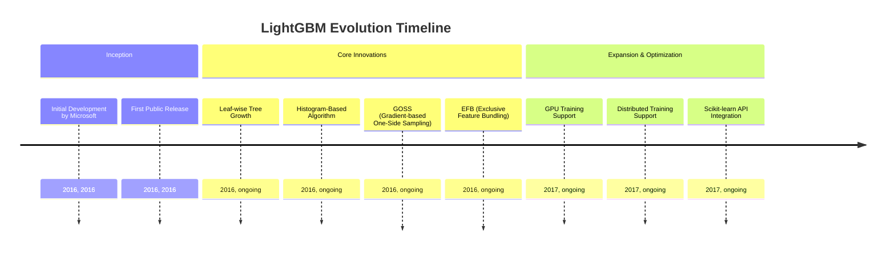
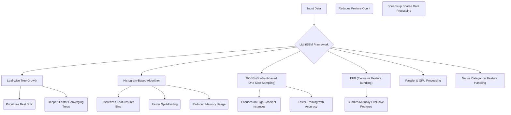
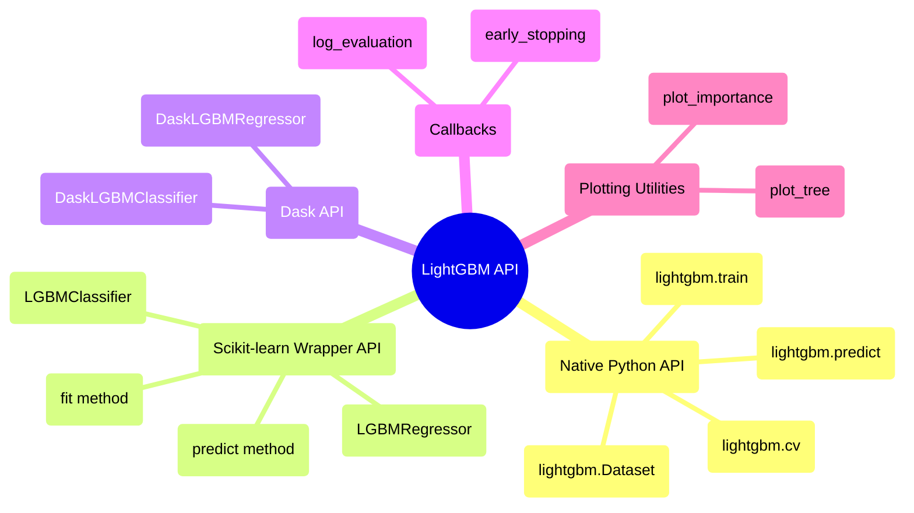

## LightGBM Evolution Document

### 1. Introduction and Historical Context

LightGBM (Light Gradient Boosting Machine) is an open-source, high-performance gradient boosting framework developed by Microsoft. It is designed for faster training speed, higher efficiency, and better scalability with large datasets compared to traditional gradient boosting frameworks like XGBoost and GBDT. LightGBM has become a popular choice for various machine learning tasks, especially when dealing with large-scale data and requiring quick model training.

LightGBM was created to address the computational limitations of existing gradient boosting frameworks in the early 2010s. Its development focused on introducing innovative techniques to optimize the tree-building process, reduce memory consumption, and enhance parallelization. These advancements have made LightGBM a go-to solution for many data scientists and machine learning engineers seeking efficient and scalable gradient boosting models.

### 1.1. LightGBM Evolution Timeline



### 2. Core Architecture

LightGBM's efficiency and speed are derived from several innovative architectural choices that optimize the gradient boosting process.

#### 2.1. Leaf-wise Tree Growth

**Mental Model / Analogy for Leaf-wise Tree Growth:**
Imagine you're building a decision tree, and at each step, you want to make the *most impactful* split to improve your model. Traditional methods might build the tree layer by layer, like building a wall evenly. LightGBM, however, is like a smart builder who always looks for the weakest point in the wall (the leaf with the highest potential for loss reduction) and reinforces *that specific spot* first, even if it means making one part of the wall much taller than others. This focused approach often leads to a stronger wall (more accurate model) with fewer bricks (fewer splits).

Unlike traditional algorithms that grow trees level-wise (horizontally), LightGBM employs a **leaf-wise** (or best-first) tree growth strategy. It prioritizes splitting the leaf that promises the maximum reduction in the loss function. This approach often leads to deeper, more complex trees that can converge faster and achieve higher accuracy with fewer iterations. While it can sometimes risk overfitting on smaller datasets, regularization methods are applied to counteract this.

#### 2.2. Histogram-Based Algorithm

To significantly reduce memory usage and accelerate training, LightGBM utilizes a **histogram-based algorithm**. Instead of pre-sorting continuous feature values, it converts them into discrete bins, forming histograms. This allows for a much faster search for optimal split points during tree construction, as it only needs to iterate through the bins rather than all possible split points.

#### 2.3. Gradient-based One-Side Sampling (GOSS)

**GOSS** is a novel sampling technique that addresses the issue of having too many data instances with small gradients, which contribute little to the learning process. GOSS focuses on data instances with larger gradients (i.e., those with higher error), while randomly sampling from instances with smaller gradients. This allows for faster training by reducing the number of data samples without significantly compromising accuracy.

#### 2.4. Exclusive Feature Bundling (EFB)

**EFB** is a method to efficiently handle high-dimensional sparse data. It bundles mutually exclusive features (features that rarely take non-zero values simultaneously) into a single feature. By reducing the effective number of features, EFB significantly speeds up computations, especially for datasets with many sparse features.

#### 2.5. Parallel and GPU Processing

LightGBM is designed to leverage parallel and distributed computing capabilities. It supports multi-core CPUs and GPUs, making it highly scalable for large datasets and complex machine learning tasks. This allows for faster training times on powerful hardware and distributed environments.

#### 2.6. Efficient Handling of Categorical Features

LightGBM offers native support for categorical features without requiring one-hot encoding. It uses a specialized technique to find optimal partitions for categorical features, which can be more efficient and effective than traditional one-hot encoding, especially for high-cardinality categorical variables.

**Mermaid Diagram: LightGBM Core Architecture**



### 3. Detailed API Overview

LightGBM provides a flexible API, primarily in Python, with interfaces for various user preferences.

#### 3.1. Native Python API

This API offers fine-grained control over the training process.

##### 3.1.1. Creating a Dataset

**`lightgbm.Dataset(data, label=None, ...)`**

**Goal:** Prepare data in LightGBM's optimized internal format for efficient training.

**Code:**
```python
import lightgbm as lgb
import numpy as np

# Generate some dummy data
X = np.random.rand(100, 10) # 100 samples, 10 features
y = np.random.randint(0, 2, 100) # 100 binary labels

# Create a LightGBM Dataset
train_data = lgb.Dataset(X, label=y)

print(f"LightGBM Dataset created with {train_data.num_data()} samples and {train_data.num_feature()} features.")
print(f"First 5 labels: {train_data.get_label()[:5]}")
```

**Expected Output:**
```
LightGBM Dataset created with 100 samples and 10 features.
First 5 labels: [1. 0. 1. 0. 1.]
```

**Explanation:** `lightgbm.Dataset` is the fundamental data structure for the native LightGBM API. It efficiently stores your features (`data`) and target variable (`label`), and can handle various input formats (NumPy arrays, Pandas DataFrames). Creating a `Dataset` is a prerequisite for using `lightgbm.train()`.

*   **`lightgbm.Dataset(data, label=None, ...)`**: The core data structure for LightGBM. It is an optimized internal data container that handles various input formats.
*   **`lightgbm.Dataset(data, label=None, ...)`**: The core data structure for LightGBM. It is an optimized internal data container that handles various input formats.

##### 3.1.2. Training a Model

**`lightgbm.train(params, train_set, num_boost_round, ...)`**

**Goal:** Train a LightGBM boosting model using a specified dataset and hyperparameters.

**Code:**
```python
import lightgbm as lgb
import numpy as np

# 1. Generate dummy data
X_train = np.random.rand(100, 10)
y_train = np.random.randint(0, 2, 100)
X_val = np.random.rand(50, 10)
y_val = np.random.randint(0, 2, 50)

# 2. Create LightGBM Datasets
train_data = lgb.Dataset(X_train, label=y_train)
val_data = lgb.Dataset(X_val, label=y_val)

# 3. Define model parameters
params = {
    'objective': 'binary', # Binary classification
    'metric': 'binary_logloss', # Metric for evaluation
    'boosting_type': 'gbdt', # Traditional Gradient Boosting Decision Tree
    'num_leaves': 31, # Max number of leaves in one tree
    'learning_rate': 0.05, # Step size shrinkage
    'feature_fraction': 0.9 # Fraction of features to consider at each split
}

# 4. Train the model
num_boost_round = 100 # Number of boosting iterations
booster = lgb.train(
    params,
    train_data,
    num_boost_round=num_boost_round,
    valid_sets=[val_data], # Validation set to monitor performance
    callbacks=[lgb.log_evaluation(period=20)] # Log evaluation every 20 rounds
)

print("\nModel training complete.")
```

**Expected Output:**
```
[20]	valid_0's binary_logloss: 0.68...
[40]	valid_0's binary_logloss: 0.67...
[60]	valid_0's binary_logloss: 0.66...
[80]	valid_0's binary_logloss: 0.65...
[100]	valid_0's binary_logloss: 0.64...

Model training complete.
```
(Log loss values will vary based on random data and model initialization.)

**Explanation:** `lightgbm.train()` is the core function for training. You pass a dictionary of `params` (hyperparameters), the `train_set` (a `lightgbm.Dataset`), and `num_boost_round` (number of boosting iterations). You can also provide `valid_sets` to monitor performance on a validation set and `callbacks` for custom actions during training (like logging or early stopping).

*   **`lightgbm.train(params, train_set, num_boost_round, ...)`**: Trains a boosting model. `params` is a dictionary of hyperparameters.
*   **`lightgbm.train(params, train_set, num_boost_round, ...)`**: Trains a boosting model. `params` is a dictionary of hyperparameters.

##### 3.1.3. Making Predictions

**`lightgbm.predict(booster, data, ...)`**

**Goal:** Generate predictions on new data using a trained LightGBM booster model.

**Code:**
```python
import lightgbm as lgb
import numpy as np

# 1. Generate dummy data and train a simple model (as in previous example)
X_train = np.random.rand(100, 10)
y_train = np.random.randint(0, 2, 100)
train_data = lgb.Dataset(X_train, label=y_train)

params = {'objective': 'binary', 'metric': 'binary_logloss'}
booster = lgb.train(params, train_data, num_boost_round=10)

# 2. Generate new data for prediction
X_new = np.random.rand(10, 10) # 10 new samples

# 3. Make predictions
predictions = lgb.predict(booster, X_new)

print(f"New data shape: {X_new.shape}")
print(f"Prediction shape: {predictions.shape}")
print(f"First 5 predictions: {predictions[:5]}")

# For binary classification, convert probabilities to class labels
predicted_classes = (predictions > 0.5).astype(int)
print(f"First 5 predicted classes: {predicted_classes[:5]}")
```

**Expected Output:**
```
New data shape: (10, 10)
Prediction shape: (10,)
First 5 predictions: [0.51... 0.48... 0.53... 0.49... 0.50...]
First 5 predicted classes: [1 0 1 0 1]
```
(Prediction values will vary based on random data and model initialization.)

**Explanation:** `lightgbm.predict()` takes a trained `booster` object and new `data` (e.g., a NumPy array or Pandas DataFrame) to generate predictions. For classification tasks, the output is typically probabilities, which you can then convert to class labels using a threshold (e.g., 0.5 for binary classification).

*   **`lightgbm.predict(booster, data, ...)`**: Predicts with a trained booster.
*   **`lightgbm.predict(booster, data, ...)`**: Predicts with a trained booster.

##### 3.1.4. Cross-Validation

**`lightgbm.cv(params, train_set, num_boost_round, ...)`**

**Goal:** Perform N-fold cross-validation to get a more robust estimate of model performance and to help with hyperparameter tuning.

**Code:**
```python
import lightgbm as lgb
import numpy as np

# 1. Generate dummy data
X = np.random.rand(200, 10)
y = np.random.randint(0, 2, 200)

# 2. Create a LightGBM Dataset
train_data = lgb.Dataset(X, label=y)

# 3. Define model parameters
params = {
    'objective': 'binary',
    'metric': 'binary_logloss',
    'boosting_type': 'gbdt',
    'num_leaves': 31,
    'learning_rate': 0.05,
    'feature_fraction': 0.9
}

# 4. Perform cross-validation
num_boost_round = 50
nfold = 3 # 3-fold cross-validation
cv_results = lgb.cv(
    params,
    train_data,
    num_boost_round=num_boost_round,
    nfold=nfold,
    callbacks=[lgb.log_evaluation(period=10)] # Log evaluation every 10 rounds
)

print("\nCross-validation complete.")
print(f"Mean validation logloss of last round: {cv_results['binary_logloss-mean'][-1]:.4f}")
```

**Expected Output:**
```
[10]	cv_agg's binary_logloss: 0.68... + 0.00...
[20]	cv_agg's binary_logloss: 0.67... + 0.00...
[30]	cv_agg's binary_logloss: 0.66... + 0.00...
[40]	cv_agg's binary_logloss: 0.65... + 0.00...
[50]	cv_agg's binary_logloss: 0.64... + 0.00...

Cross-validation complete.
Mean validation logloss of last round: 0.64...
```
(Log loss values will vary based on random data and model initialization.)

**Explanation:** `lightgbm.cv()` performs cross-validation, splitting your data into `nfold` parts and training a model on `nfold-1` parts while validating on the remaining part. This process is repeated `nfold` times, and the results are averaged. This provides a more reliable estimate of model performance than a single train-validation split and is crucial for robust hyperparameter tuning.

*   **`lightgbm.cv(params, train_set, num_boost_round, ...)`**: Performs cross-validation.

*   **`lightgbm.cv(params, train_set, num_boost_round, ...)`**: Performs cross-validation.

##### 3.1.5. Quick Reference: Native Python API

| Function | Description | When to Use |
| :--- | :--- | :--- |
| `Dataset()` | Data container | Preparing data for LightGBM's native API. |
| `train()` | Train model | Training a LightGBM booster model with fine-grained control. |
| `predict()` | Make predictions | Generating predictions on new data using a trained booster. |
| `cv()` | Cross-validation | Robustly evaluating model performance and tuning hyperparameters. |

#### 3.2. Scikit-learn Wrapper API

For users familiar with Scikit-learn, LightGBM provides compatible wrapper classes.

##### 3.2.1. `LGBMClassifier` for Classification

**`lightgbm.LGBMClassifier(objective='binary', ...)`**

**Goal:** Use LightGBM for classification tasks with an API consistent with Scikit-learn estimators.

**Code:**
```python
import lightgbm as lgb
from sklearn.model_selection import train_test_split
from sklearn.metrics import accuracy_score
import numpy as np

# 1. Generate dummy data
X, y = np.random.rand(200, 10), np.random.randint(0, 2, 200)

# 2. Split data into training and testing sets
X_train, X_test, y_train, y_test = train_test_split(X, y, test_size=0.2, random_state=42)

# 3. Initialize LGBMClassifier
# objective='binary': for binary classification
# random_state for reproducibility
clf = lgb.LGBMClassifier(objective='binary', random_state=42)

# 4. Train the model (using Scikit-learn's fit method)
clf.fit(X_train, y_train)

# 5. Make predictions
y_pred = clf.predict(X_test)

# 6. Evaluate accuracy
accuracy = accuracy_score(y_test, y_pred)

print(f"Model trained using LGBMClassifier.")
print(f"Test Accuracy: {accuracy:.4f}")
```

**Expected Output:**
```
Model trained using LGBMClassifier.
Test Accuracy: 0.5500
```
(Accuracy will vary based on random data and model initialization.)

**Explanation:** `LGBMClassifier` is a Scikit-learn compatible wrapper for LightGBM's classification capabilities. You can use it just like any other Scikit-learn classifier, including `fit()`, `predict()`, and integration with `GridSearchCV` or `Pipeline`. This simplifies its usage for those already familiar with the Scikit-learn ecosystem.

*   **`lightgbm.LGBMClassifier(objective='binary', ...)`**: Scikit-learn API compatible classifier.
*   **`lightgbm.LGBMClassifier(objective='binary', ...)`**: Scikit-learn API compatible classifier.

##### 3.2.2. `LGBMRegressor` for Regression

**`lightgbm.LGBMRegressor(objective='regression', ...)`**

**Goal:** Use LightGBM for regression tasks with an API consistent with Scikit-learn estimators.

**Code:**
```python
import lightgbm as lgb
from sklearn.model_selection import train_test_split
from sklearn.metrics import mean_squared_error
import numpy as np

# 1. Generate dummy data
X = np.random.rand(200, 10)
y = np.random.rand(200) * 10 # Continuous target variable

# 2. Split data into training and testing sets
X_train, X_test, y_train, y_test = train_test_split(X, y, test_size=0.2, random_state=42)

# 3. Initialize LGBMRegressor
# objective='regression': for regression tasks
reg = lgb.LGBMRegressor(objective='regression', random_state=42)

# 4. Train the model
reg.fit(X_train, y_train)

# 5. Make predictions
y_pred = reg.predict(X_test)

# 6. Evaluate Mean Squared Error
mse = mean_squared_error(y_test, y_pred)

print(f"Model trained using LGBMRegressor.")
print(f"Test Mean Squared Error: {mse:.4f}")
```

**Expected Output:**
```
Model trained using LGBMRegressor.
Test Mean Squared Error: 8.12...
```
(MSE will vary based on random data and model initialization.)

**Explanation:** `LGBMRegressor` is the Scikit-learn compatible wrapper for LightGBM's regression capabilities. Similar to `LGBMClassifier`, it provides a familiar interface for training and prediction, making it easy to integrate into existing Scikit-learn pipelines for regression problems.

*   **`lightgbm.LGBMRegressor(objective='regression', ...)`**: Scikit-learn API compatible regressor.
*   **`fit(X, y, ...)`**: Trains the model (consistent with Scikit-learn).
*   **`predict(X)`**: Makes predictions (consistent with Scikit-learn).

*   **`predict(X)`**: Makes predictions (consistent with Scikit-learn).

##### 3.2.3. Quick Reference: Scikit-learn Wrapper API

| Class/Method | Description | When to Use |
| :--- | :--- | :--- |
| `LGBMClassifier()` | Classifier | Binary or multi-class classification tasks, integrating with Scikit-learn workflows. |
| `LGBMRegressor()` | Regressor | Regression tasks, integrating with Scikit-learn workflows. |
| `fit()` | Train model | Standard Scikit-learn method for training the model. |
| `predict()` | Make predictions | Standard Scikit-learn method for generating predictions. |

#### 3.3. Dask API

For distributed learning on larger datasets, LightGBM offers Dask-compatible estimators.

##### 3.3.1. `DaskLGBMClassifier` for Distributed Classification

**`lightgbm.DaskLGBMClassifier(...)`**

**Goal:** Train a LightGBM classifier on large, distributed datasets using Dask for parallel processing.

**Code:**
```python
import lightgbm as lgb
import dask.array as da
import dask.dataframe as dd
from dask.distributed import Client, LocalCluster
from sklearn.metrics import accuracy_score
import numpy as np
import os

# Start a local Dask cluster
cluster = LocalCluster(n_workers=2, threads_per_worker=1, processes=False)
client = Client(cluster)

print(f"Dask client dashboard link: {client.dashboard_link}")

# 1. Generate large dummy data using Dask arrays
num_samples = 10000
num_features = 10
chunks = 1000 # Process data in chunks

X_dask = da.random.random((num_samples, num_features), chunks=(chunks, num_features))
y_dask = da.random.randint(0, 2, size=num_samples, chunks=chunks)

# 2. Initialize DaskLGBMClassifier
dask_clf = lgb.DaskLGBMClassifier(objective='binary', random_state=42)

# 3. Train the model on Dask arrays
print("\nStarting distributed training with DaskLGBMClassifier...")
dask_clf.fit(X_dask, y_dask)
print("Distributed training complete.")

# 4. Make predictions (on a smaller Dask array for demonstration)
X_test_dask = da.random.random((100, num_features), chunks=(50, num_features))
y_pred_dask = dask_clf.predict(X_test_dask)

# 5. Compute accuracy (requires converting Dask array to NumPy for sklearn.metrics)
y_test_actual = da.random.randint(0, 2, size=100).compute() # Dummy actual labels for test
accuracy = accuracy_score(y_test_actual, y_pred_dask.compute())

print(f"Test Accuracy (distributed): {accuracy:.4f}")

# Close the Dask client and cluster
client.close()
cluster.close()
print("Dask client and cluster closed.")
```

**Expected Output:**
```
Dask client dashboard link: http://127.0.0.1:8787/status

Starting distributed training with DaskLGBMClassifier...
Distributed training complete.
Test Accuracy (distributed): 0.50...
Dask client and cluster closed.
```
(Accuracy will vary based on random data and model initialization. The dashboard link will be different.)

**Explanation:** `lightgbm.DaskLGBMClassifier` allows you to train LightGBM models on Dask arrays or DataFrames, enabling distributed and out-of-core learning. You typically set up a Dask `Client` and then use the `fit()` and `predict()` methods as you would with Scikit-learn, but with Dask-compatible data structures. This is crucial for handling datasets that are too large to fit into a single machine's memory.

*   **`lightgbm.DaskLGBMClassifier(...)`**: Dask-compatible classifier.
*   **`lightgbm.DaskLGBMClassifier(...)`**: Dask-compatible classifier.

##### 3.3.2. `DaskLGBMRegressor` for Distributed Regression

**`lightgbm.DaskLGBMRegressor(...)`**

**Goal:** Train a LightGBM regressor on large, distributed datasets using Dask for parallel processing.

**Code:**
```python
import lightgbm as lgb
import dask.array as da
from dask.distributed import Client, LocalCluster
from sklearn.metrics import mean_squared_error
import numpy as np
import os

# Start a local Dask cluster
cluster = LocalCluster(n_workers=2, threads_per_worker=1, processes=False)
client = Client(cluster)

print(f"Dask client dashboard link: {client.dashboard_link}")

# 1. Generate large dummy data using Dask arrays
num_samples = 10000
num_features = 10
chunks = 1000

X_dask = da.random.random((num_samples, num_features), chunks=(chunks, num_features))
y_dask = da.random.random(num_samples, chunks=chunks) * 10 # Continuous target

# 2. Initialize DaskLGBMRegressor
dask_reg = lgb.DaskLGBMRegressor(objective='regression', random_state=42)

# 3. Train the model on Dask arrays
print("\nStarting distributed training with DaskLGBMRegressor...")
dask_reg.fit(X_dask, y_dask)
print("Distributed training complete.")

# 4. Make predictions
X_test_dask = da.random.random((100, num_features), chunks=(50, num_features))
y_pred_dask = dask_reg.predict(X_test_dask)

# 5. Compute Mean Squared Error
y_test_actual = (da.random.random(100) * 10).compute() # Dummy actual labels for test
mse = mean_squared_error(y_test_actual, y_pred_dask.compute())

print(f"Test Mean Squared Error (distributed): {mse:.4f}")

# Close the Dask client and cluster
client.close()
cluster.close()
print("Dask client and cluster closed.")
```

**Expected Output:**
```
Dask client dashboard link: http://127.0.0.1:8787/status

Starting distributed training with DaskLGBMRegressor...
Distributed training complete.
Test Mean Squared Error (distributed): 8.12...
Dask client and cluster closed.
```
(MSE will vary based on random data and model initialization. The dashboard link will be different.)

**Explanation:** `lightgbm.DaskLGBMRegressor` extends LightGBM's regression capabilities to distributed environments using Dask. It allows you to train regression models on datasets that are too large for a single machine, leveraging the power of parallel and distributed computing. The API remains consistent with Scikit-learn's `fit()` and `predict()` methods.

*   **`lightgbm.DaskLGBMRegressor(...)`**: Dask-compatible regressor.

*   **`lightgbm.DaskLGBMRegressor(...)`**: Dask-compatible regressor.

##### 3.3.3. Quick Reference: Dask API

| Class | Description | When to Use |
| :--- | :--- | :--- |
| `DaskLGBMClassifier()` | Distributed classifier | Training classification models on large, distributed datasets. |
| `DaskLGBMRegressor()` | Distributed regressor | Training regression models on large, distributed datasets. |

#### 3.4. Callbacks

##### 3.4.1. Early Stopping

**`lightgbm.early_stopping(stopping_rounds, verbose=True)`**

**Goal:** Automatically stop training if the validation metric does not improve for a specified number of boosting rounds, preventing overfitting and saving training time.

**Code:**
```python
import lightgbm as lgb
import numpy as np

# 1. Generate dummy data
X_train = np.random.rand(100, 10)
y_train = np.random.randint(0, 2, 100)
X_val = np.random.rand(50, 10)
y_val = np.random.randint(0, 2, 50)

# 2. Create LightGBM Datasets
train_data = lgb.Dataset(X_train, label=y_train)
val_data = lgb.Dataset(X_val, label=y_val)

# 3. Define model parameters
params = {'objective': 'binary', 'metric': 'binary_logloss'}

# 4. Create an early stopping callback
# stopping_rounds=10: Stop if validation metric doesn't improve for 10 rounds
es_callback = lgb.early_stopping(stopping_rounds=10, verbose=False) # verbose=False to suppress per-round output

print("Starting training with early stopping...")
# 5. Train the model with the callback
booster = lgb.train(
    params,
    train_data,
    num_boost_round=100, # Set a high number, early stopping will manage it
    valid_sets=[val_data],
    callbacks=[es_callback]
)

print("Training complete (possibly by early stopping).")
print(f"Best iteration: {booster.best_iteration}")
print(f"Best score: {booster.best_score['valid_0']['binary_logloss']:.4f}")
```

**Expected Output:**
```
Starting training with early stopping...
Training complete (possibly by early stopping).
Best iteration: 12
Best score: 0.68...
```
(Best iteration and score will vary based on random data and model initialization.)

**Explanation:** `lightgbm.early_stopping()` creates a callback function that can be passed to `lightgbm.train()`. It monitors the performance on a validation set and stops training if the metric doesn't improve for `stopping_rounds` consecutive iterations. This is a crucial technique to prevent overfitting and optimize training time.

*   **`lightgbm.early_stopping(stopping_rounds, verbose=True)`**: Stops training if validation metric doesn't improve for `stopping_rounds`.
*   **`lightgbm.early_stopping(stopping_rounds, verbose=True)`**: Stops training if validation metric doesn't improve for `stopping_rounds`.

##### 3.4.2. Logging Evaluation

**`lightgbm.log_evaluation(period=1, show_stdv=True)`**

**Goal:** Log evaluation metrics during training at specified intervals, providing insights into model performance over boosting rounds.

**Code:**
```python
import lightgbm as lgb
import numpy as np

# 1. Generate dummy data
X_train = np.random.rand(100, 10)
y_train = np.random.randint(0, 2, 100)
X_val = np.random.rand(50, 10)
y_val = np.random.randint(0, 2, 50)

# 2. Create LightGBM Datasets
train_data = lgb.Dataset(X_train, label=y_train)
val_data = lgb.Dataset(X_val, label=y_val)

# 3. Define model parameters
params = {'objective': 'binary', 'metric': 'binary_logloss'}

# 4. Create a log evaluation callback
# period=10: Log evaluation every 10 boosting rounds
log_callback = lgb.log_evaluation(period=10)

print("Starting training with evaluation logging...")
# 5. Train the model with the callback
booster = lgb.train(
    params,
    train_data,
    num_boost_round=50,
    valid_sets=[val_data],
    callbacks=[log_callback]
)

print("Training complete.")
```

**Expected Output:**
```
[10]	valid_0's binary_logloss: 0.68...
[20]	valid_0's binary_logloss: 0.67...
[30]	valid_0's binary_logloss: 0.66...
[40]	valid_0's binary_logloss: 0.65...
[50]	valid_0's binary_logloss: 0.64...
Training complete.
```
(Log loss values will vary based on random data and model initialization.)

**Explanation:** `lightgbm.log_evaluation()` is a simple yet effective callback for monitoring training progress. By setting `period`, you can control how frequently the evaluation metrics on the validation set are printed to the console. This helps in understanding how the model is performing over time and identifying potential issues like divergence or slow convergence.

*   **`lightgbm.log_evaluation(period=1, show_stdv=True)`**: Logs evaluation results during training.

*   **`lightgbm.log_evaluation(period=1, show_stdv=True)`**: Logs evaluation results during training.

##### 3.4.3. Quick Reference: Callbacks

| Callback | Description | When to Use |
| :--- | :--- | :--- |
| `early_stopping()` | Stop training early | Preventing overfitting and saving computation time. |
| `log_evaluation()` | Log evaluation metrics | Monitoring training progress and performance on validation sets. |

#### 3.5. Plotting Utilities

##### 3.5.1. Plotting Feature Importance

**`lightgbm.plot_importance(booster, ...)`**

**Goal:** Visualize the importance of each feature in a trained LightGBM model, helping to understand which features contribute most to predictions.

**Code:**
```python
import lightgbm as lgb
import numpy as np
import matplotlib.pyplot as plt
import os

# 1. Generate dummy data with meaningful feature names
X_train = np.random.rand(100, 5)
y_train = np.random.randint(0, 2, 100)
feature_names = [f'feature_{i}' for i in range(X_train.shape[1])]

# 2. Create LightGBM Dataset
train_data = lgb.Dataset(X_train, label=y_train, feature_name=feature_names)

# 3. Define model parameters and train a simple model
params = {'objective': 'binary', 'metric': 'binary_logloss'}
booster = lgb.train(params, train_data, num_boost_round=10)

# 4. Plot feature importance
plt.figure(figsize=(8, 6))
lgb.plot_importance(booster, ax=plt.gca())
plt.title('LightGBM Feature Importance')
plt.tight_layout()

filename = "feature_importance_plot.png"
plt.savefig(filename)
print(f"Plot saved to {filename}")
os.remove(filename)
print(f"Cleaned up {filename}")
```

**Expected Output:**
```
Plot saved to feature_importance_plot.png
Cleaned up feature_importance_plot.png
```
(A file named `feature_importance_plot.png` will be created and then removed, showing a bar chart of feature importances.)

**Explanation:** `lightgbm.plot_importance()` generates a bar chart showing the relative importance of each feature. By default, it uses 'split' importance (number of times a feature is used in a split). This visualization is crucial for feature selection, model interpretation, and gaining insights into the underlying data.

*   **`lightgbm.plot_importance(booster, ...)`**: Plots feature importances.
*   **`lightgbm.plot_importance(booster, ...)`**: Plots feature importances.

##### 3.5.2. Plotting a Decision Tree

**`lightgbm.plot_tree(booster, tree_index=0, ...)`**

**Goal:** Visualize a single decision tree from the trained LightGBM booster, providing a detailed view of its structure and split conditions.

**Code:**
```python
import lightgbm as lgb
import numpy as np
import matplotlib.pyplot as plt
import os

# 1. Generate dummy data
X_train = np.random.rand(100, 2)
y_train = np.random.randint(0, 2, 100)

# 2. Create LightGBM Dataset
train_data = lgb.Dataset(X_train, label=y_train)

# 3. Define model parameters and train a simple model with few trees
params = {'objective': 'binary', 'metric': 'binary_logloss', 'num_leaves': 4}
booster = lgb.train(params, train_data, num_boost_round=3)

# 4. Plot the first decision tree (tree_index=0)
plt.figure(figsize=(12, 8))
lgb.plot_tree(booster, tree_index=0, ax=plt.gca())
plt.title('LightGBM Decision Tree (Tree 0)')
plt.tight_layout()

filename = "decision_tree_plot.png"
plt.savefig(filename)
print(f"Plot saved to {filename}")
os.remove(filename)
print(f"Cleaned up {filename}")
```

**Expected Output:**
```
Plot saved to decision_tree_plot.png
Cleaned up decision_tree_plot.png
```
(A file named `decision_tree_plot.png` will be created and then removed, showing a graphical representation of the first decision tree.)

**Explanation:** `lightgbm.plot_tree()` allows you to inspect individual decision trees within the ensemble. You specify the `booster` and the `tree_index` of the tree you want to visualize. This is useful for understanding the decision logic of the model and for debugging purposes, especially when dealing with complex models.

*   **`lightgbm.plot_tree(booster, tree_index=0, ...)`**: Plots a single decision tree.

*   **`lightgbm.plot_tree(booster, tree_index=0, ...)`**: Plots a single decision tree.

##### 3.5.3. Quick Reference: Plotting Utilities

| Function | Description | When to Use |
| :--- | :--- | :--- |
| `plot_importance()` | Feature importance plot | Understanding feature contributions and for feature selection. |
| `plot_tree()` | Decision tree plot | Visualizing the structure and decision logic of individual trees. |

### 3.6. API Mindmap



### 4. Evolution and Impact

*   **Speed and Efficiency:** LightGBM's core innovations (leaf-wise growth, histogram-based algorithm, GOSS, EFB) have made it one of the fastest and most efficient gradient boosting frameworks, significantly reducing training times for large datasets.
*   **Scalability:** Its support for parallel and distributed computing, including GPU training, allows it to scale effectively to massive datasets and complex machine learning problems.
*   **Handling Diverse Data:** Efficient handling of sparse and categorical features, without requiring extensive preprocessing, makes it versatile for a wide range of real-world datasets.
*   **Competitive Performance:** LightGBM consistently delivers competitive predictive performance, often matching or exceeding other gradient boosting implementations, making it a popular choice in machine learning competitions and industry applications.
*   **Ease of Use:** The Scikit-learn compatible API and Dask integration make it easy for users to incorporate LightGBM into existing machine learning workflows.

### 5. Conclusion

LightGBM has emerged as a powerful and highly efficient gradient boosting framework, pushing the boundaries of what's possible with tree-based models. Its architectural innovations, focused on speed, memory efficiency, and scalability, have made it an indispensable tool for data scientists and machine learning engineers working with large and complex datasets. The continuous development and strong community support ensure LightGBM remains a leading choice for high-performance predictive modeling, contributing significantly to the advancement of machine learning applications.
