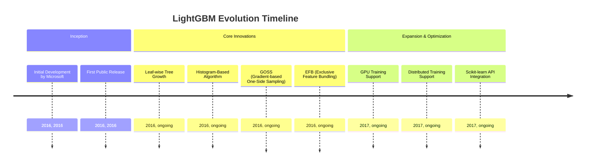
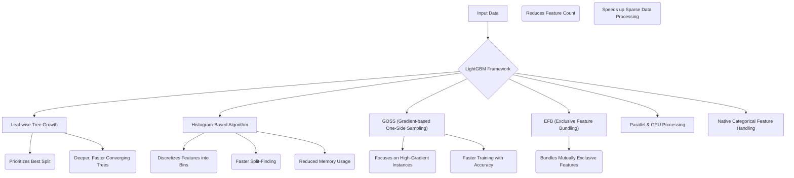
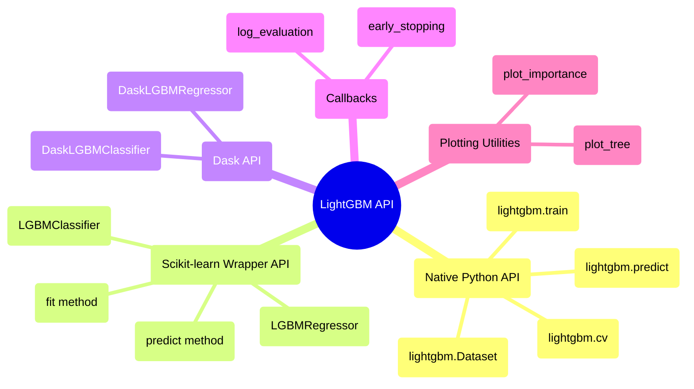

## LightGBM Evolution Document

### 1. Introduction and Historical Context

LightGBM (Light Gradient Boosting Machine) is an open-source, high-performance gradient boosting framework developed by Microsoft. It is designed for faster training speed, higher efficiency, and better scalability with large datasets compared to traditional gradient boosting frameworks like XGBoost and GBDT. LightGBM has become a popular choice for various machine learning tasks, especially when dealing with large-scale data and requiring quick model training.

LightGBM was created to address the computational limitations of existing gradient boosting frameworks in the early 2010s. Its development focused on introducing innovative techniques to optimize the tree-building process, reduce memory consumption, and enhance parallelization. These advancements have made LightGBM a go-to solution for many data scientists and machine learning engineers seeking efficient and scalable gradient boosting models.

### 1.1. LightGBM Evolution Timeline

### 2. Core Architecture

LightGBM's efficiency and speed are derived from several innovative architectural choices that optimize the gradient boosting process.

#### 2.1. Leaf-wise Tree Growth

Unlike traditional algorithms that grow trees level-wise (horizontally), LightGBM employs a **leaf-wise** (or best-first) tree growth strategy. It prioritizes splitting the leaf that promises the maximum reduction in the loss function. This approach often leads to deeper, more complex trees that can converge faster and achieve higher accuracy with fewer iterations. While it can sometimes risk overfitting on smaller datasets, regularization methods are applied to counteract this.

#### 2.2. Histogram-Based Algorithm

To significantly reduce memory usage and accelerate training, LightGBM utilizes a **histogram-based algorithm**. Instead of pre-sorting continuous feature values, it converts them into discrete bins, forming histograms. This allows for a much faster search for optimal split points during tree construction, as it only needs to iterate through the bins rather than all possible split points.

#### 2.3. Gradient-based One-Side Sampling (GOSS)

**GOSS** is a novel sampling technique that addresses the issue of having too many data instances with small gradients, which contribute little to the learning process. GOSS focuses on data instances with larger gradients (i.e., those with higher error), while randomly sampling from instances with smaller gradients. This allows for faster training by reducing the number of data samples without significantly compromising accuracy.

#### 2.4. Exclusive Feature Bundling (EFB)

**EFB** is a method to efficiently handle high-dimensional sparse data. It bundles mutually exclusive features (features that rarely take non-zero values simultaneously) into a single feature. By reducing the effective number of features, EFB significantly speeds up computations, especially for datasets with many sparse features.

#### 2.5. Parallel and GPU Processing

LightGBM is designed to leverage parallel and distributed computing capabilities. It supports multi-core CPUs and GPUs, making it highly scalable for large datasets and complex machine learning tasks. This allows for faster training times on powerful hardware and distributed environments.

#### 2.6. Efficient Handling of Categorical Features

LightGBM offers native support for categorical features without requiring one-hot encoding. It uses a specialized technique to find optimal partitions for categorical features, which can be more efficient and effective than traditional one-hot encoding, especially for high-cardinality categorical variables.

**Mermaid Diagram: LightGBM Core Architecture**

### 3. Detailed API Overview

LightGBM provides a flexible API, primarily in Python, with interfaces for various user preferences.

#### 3.1. Native Python API

This API offers fine-grained control over the training process.

*   **`lightgbm.Dataset(data, label=None, ...)`**: The core data structure for LightGBM. It is an optimized internal data container that handles various input formats.
*   **`lightgbm.train(params, train_set, num_boost_round, ...)`**: Trains a boosting model. `params` is a dictionary of hyperparameters.
*   **`lightgbm.predict(booster, data, ...)`**: Predicts with a trained booster.
*   **`lightgbm.cv(params, train_set, num_boost_round, ...)`**: Performs cross-validation.

#### 3.2. Scikit-learn Wrapper API

For users familiar with Scikit-learn, LightGBM provides compatible wrapper classes.

*   **`lightgbm.LGBMClassifier(objective='binary', ...)`**: Scikit-learn API compatible classifier.
*   **`lightgbm.LGBMRegressor(objective='regression', ...)`**: Scikit-learn API compatible regressor.
*   **`fit(X, y, ...)`**: Trains the model (consistent with Scikit-learn).
*   **`predict(X)`**: Makes predictions (consistent with Scikit-learn).

#### 3.3. Dask API

For distributed learning on larger datasets, LightGBM offers Dask-compatible estimators.

*   **`lightgbm.DaskLGBMClassifier(...)`**: Dask-compatible classifier.
*   **`lightgbm.DaskLGBMRegressor(...)`**: Dask-compatible regressor.

#### 3.4. Callbacks

*   **`lightgbm.early_stopping(stopping_rounds, verbose=True)`**: Stops training if validation metric doesn't improve for `stopping_rounds`.
*   **`lightgbm.log_evaluation(period=1, show_stdv=True)`**: Logs evaluation results during training.

#### 3.5. Plotting Utilities

*   **`lightgbm.plot_importance(booster, ...)`**: Plots feature importances.
*   **`lightgbm.plot_tree(booster, tree_index=0, ...)`**: Plots a single decision tree.

### 3.6. API Mindmap

### 4. Evolution and Impact

*   **Speed and Efficiency:** LightGBM's core innovations (leaf-wise growth, histogram-based algorithm, GOSS, EFB) have made it one of the fastest and most efficient gradient boosting frameworks, significantly reducing training times for large datasets.
*   **Scalability:** Its support for parallel and distributed computing, including GPU training, allows it to scale effectively to massive datasets and complex machine learning problems.
*   **Handling Diverse Data:** Efficient handling of sparse and categorical features, without requiring extensive preprocessing, makes it versatile for a wide range of real-world datasets.
*   **Competitive Performance:** LightGBM consistently delivers competitive predictive performance, often matching or exceeding other gradient boosting implementations, making it a popular choice in machine learning competitions and industry applications.
*   **Ease of Use:** The Scikit-learn compatible API and Dask integration make it easy for users to incorporate LightGBM into existing machine learning workflows.

### 5. Conclusion

LightGBM has emerged as a powerful and highly efficient gradient boosting framework, pushing the boundaries of what's possible with tree-based models. Its architectural innovations, focused on speed, memory efficiency, and scalability, have made it an indispensable tool for data scientists and machine learning engineers working with large and complex datasets. The continuous development and strong community support ensure LightGBM remains a leading choice for high-performance predictive modeling, contributing significantly to the advancement of machine learning applications.
