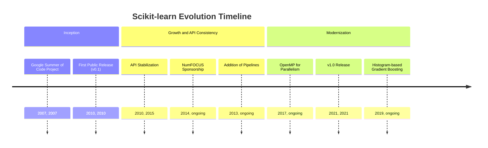
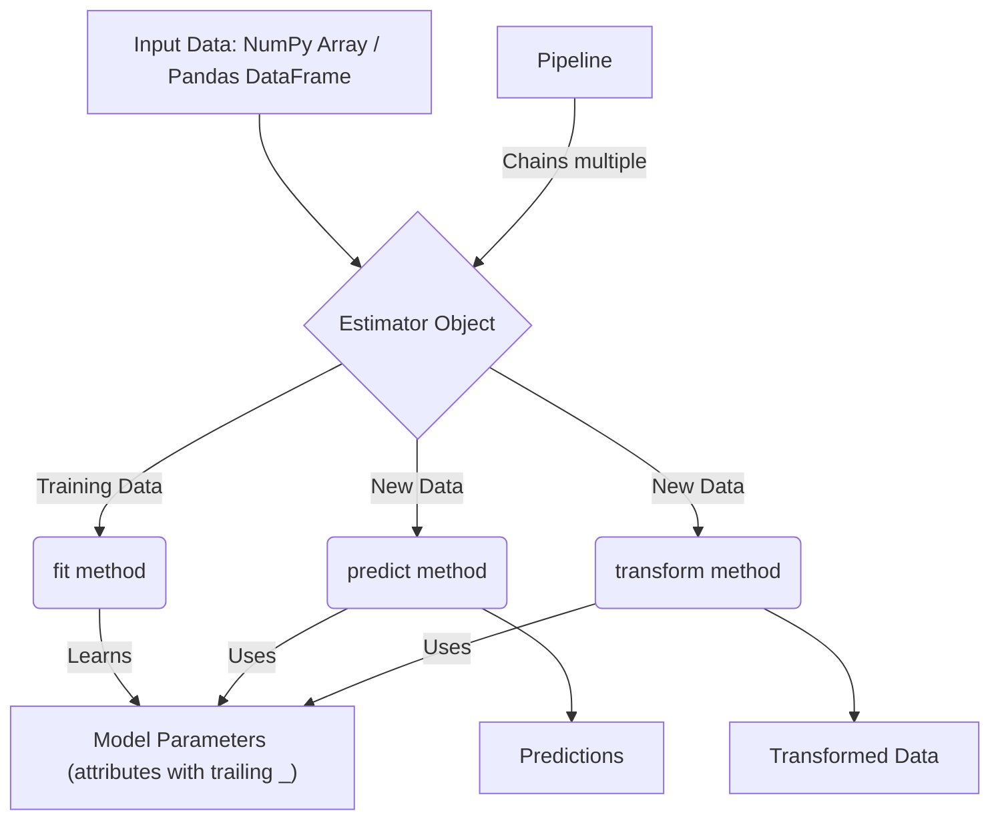
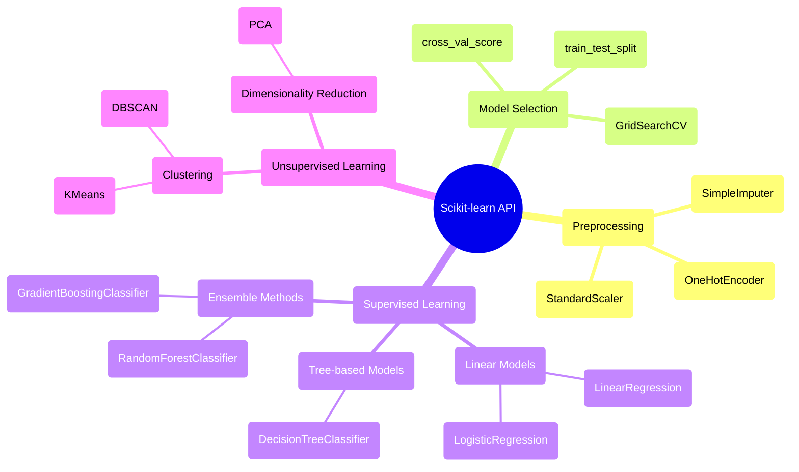

## Scikit-learn Evolution Document

### 1. Introduction and Historical Context

Scikit-learn is a cornerstone of the Python machine learning ecosystem, providing a comprehensive and user-friendly library for predictive data analysis. It offers a wide range of algorithms for classification, regression, clustering, and dimensionality reduction, all accessible through a consistent and simple API.

The project was initiated in 2007 by David Cournapeau as a Google Summer of Code project. It was later built upon by other developers, and in 2010, researchers at INRIA (the French Institute for Research in Computer Science and Automation) took the lead, releasing the first public version. The primary goal was to create a machine learning library that was accessible to non-specialists, emphasized ease of use, and was built upon the scientific Python stack (NumPy and SciPy).

### 1.1. Scikit-learn Evolution Timeline



### 2. Core Architecture

Scikit-learn's architecture is designed for consistency and ease of use. It is built on top of NumPy and SciPy, which it uses for highly optimized numerical operations.

#### 2.1. The Estimator API

The core of Scikit-learn's architecture is the **Estimator** object. Every algorithm, whether it's for classification, regression, or transformation, is exposed as an Estimator. This provides a unified interface with three key methods:

*   **`fit(X, y)`**: This method is used for training the estimator. It takes the training data `X` (and labels `y` for supervised learning) and learns the model parameters from it.
*   **`predict(X)`**: For supervised learning estimators, this method makes predictions on new data `X`.
*   **`transform(X)`**: For feature engineering or preprocessing estimators, this method transforms the input data `X`.

#### 2.2. Data Representation

Scikit-learn expects data to be in the form of NumPy arrays or Pandas DataFrames, where rows represent samples and columns represent features. This seamless integration with the core data science libraries makes it easy to build end-to-end workflows.

#### 2.3. Composition and Pipelines

A key architectural feature is the ability to compose multiple estimators into a single one. The **`Pipeline`** object allows you to chain multiple transformation steps and a final estimator together. This is crucial for creating robust and reproducible machine learning workflows, as it ensures that the same preprocessing steps are applied to both training and testing data.

**Mermaid Diagram: Scikit-learn Core Architecture**



### 3. Detailed API Overview

Scikit-learn's API is organized into modules based on the type of machine learning task.

#### 3.1. Preprocessing (`sklearn.preprocessing`)

This module includes tools for feature scaling, encoding categorical variables, and imputation of missing values.

*   **`StandardScaler()`**: Standardizes features by removing the mean and scaling to unit variance.
*   **`OneHotEncoder()`**: Encodes categorical integer features as a one-hot numeric array.
*   **`SimpleImputer()`**: A transformer for completing missing values.

#### 3.2. Model Selection (`sklearn.model_selection`)

This module provides tools for splitting data, cross-validation, and hyperparameter tuning.

*   **`train_test_split(X, y, ...)`**: Splits arrays or matrices into random train and test subsets.
*   **`GridSearchCV(estimator, param_grid, ...)`**: Exhaustive search over specified parameter values for an estimator.
*   **`cross_val_score(estimator, X, y, ...)`**: Evaluates a score by cross-validation.

#### 3.3. Supervised Learning Models

*   **Linear Models (`sklearn.linear_model`)**:
    *   `LinearRegression()`: Ordinary least squares Linear Regression.
    *   `LogisticRegression()`: Logistic Regression (aka logit, MaxEnt) classifier.
*   **Tree-based Models (`sklearn.tree`)**:
    *   `DecisionTreeClassifier()`: A decision tree classifier.
*   **Ensemble Methods (`sklearn.ensemble`)**:
    *   `RandomForestClassifier()`: A random forest classifier.
    *   `GradientBoostingClassifier()`: Gradient Boosting for classification.

#### 3.4. Unsupervised Learning Models

*   **Clustering (`sklearn.cluster`)**:
    *   `KMeans()`: K-Means clustering.
    *   `DBSCAN()`: Density-Based Spatial Clustering of Applications with Noise.
*   **Dimensionality Reduction (`sklearn.decomposition`)**:
    *   `PCA()`: Principal component analysis (PCA).

### 3.5. API Mindmap



### 4. Evolution and Impact

*   **Democratization of Machine Learning:** Scikit-learn's consistent and easy-to-use API has made machine learning accessible to a much broader audience, becoming the go-to library for many data scientists and developers.
*   **A Foundation for the Ecosystem:** It has become the standard for machine learning interoperability in Python. Many other libraries, including those for model explainability (SHAP, LIME) and hyperparameter optimization (Optuna, Hyperopt), are designed to work seamlessly with Scikit-learn estimators.
*   **Focus on Best Practices:** The library promotes good machine learning practices through its API design, such as the separation of training and testing data and the use of pipelines to prevent data leakage.
*   **Performance and Scalability:** While known for its ease of use, Scikit-learn has also made significant strides in performance, with many core algorithms implemented in Cython. The addition of histogram-based gradient boosting models brought a massive speedup for this popular algorithm.

### 5. Conclusion

Scikit-learn has played a pivotal role in the popularization of machine learning in Python. Its focus on a consistent, user-friendly API, combined with a comprehensive set of powerful algorithms and a commitment to good development practices, has made it an indispensable tool. It provides a solid foundation for a wide range of machine learning tasks and serves as a benchmark for API design in the broader data science ecosystem.

### 6. Typical use cases

#### 6.1. Binary classification (LogisticRegression)

```python
from sklearn.datasets import make_classification
from sklearn.model_selection import train_test_split
from sklearn.preprocessing import StandardScaler
from sklearn.linear_model import LogisticRegression
from sklearn.pipeline import Pipeline

X, y = make_classification(n_samples=1000, n_features=20, random_state=42)
X_train, X_test, y_train, y_test = train_test_split(X, y, test_size=0.2, random_state=42)

clf = Pipeline([
    ("scaler", StandardScaler()),
    ("logreg", LogisticRegression(max_iter=1000))
])
clf.fit(X_train, y_train)
print(clf.score(X_test, y_test))
```

#### 6.2. Cross-validation and hyperparameter search

```python
from sklearn.model_selection import GridSearchCV
from sklearn.svm import SVC

param_grid = {"C": [0.1, 1, 10], "gamma": ["scale", "auto"], "kernel": ["rbf"]}
search = GridSearchCV(SVC(), param_grid, cv=5)
search.fit(X_train, y_train)
print(search.best_params_)
print(search.score(X_test, y_test))
```

#### 6.3. Pipeline with preprocessing + model

```python
from sklearn.compose import ColumnTransformer
from sklearn.preprocessing import OneHotEncoder
from sklearn.impute import SimpleImputer
from sklearn.ensemble import RandomForestClassifier
from sklearn.pipeline import Pipeline
import pandas as pd

# Example mixed-type tabular data
df = pd.DataFrame({
    "age": [25, 32, None, 40],
    "city": ["NY", "SF", "NY", "LA"],
    "label": [0, 1, 0, 1]
})
X = df[["age", "city"]]
y = df["label"]

preprocess = ColumnTransformer([
    ("num", Pipeline([("impute", SimpleImputer()), ("scale", StandardScaler())]), ["age"]),
    ("cat", OneHotEncoder(handle_unknown="ignore"), ["city"]) 
])

model = Pipeline([
    ("prep", preprocess),
    ("rf", RandomForestClassifier(n_estimators=200, random_state=42))
])
model.fit(X, y)
```
