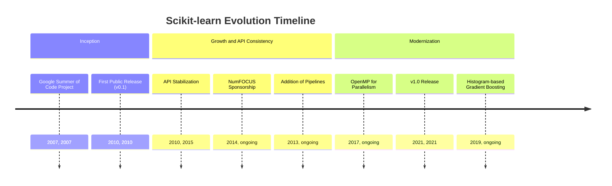
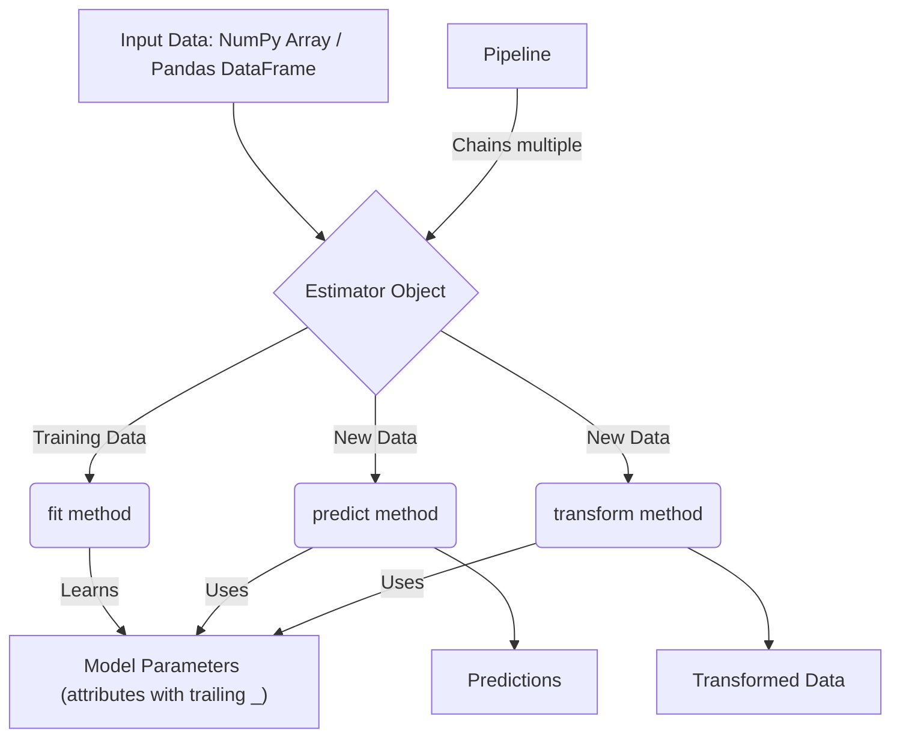
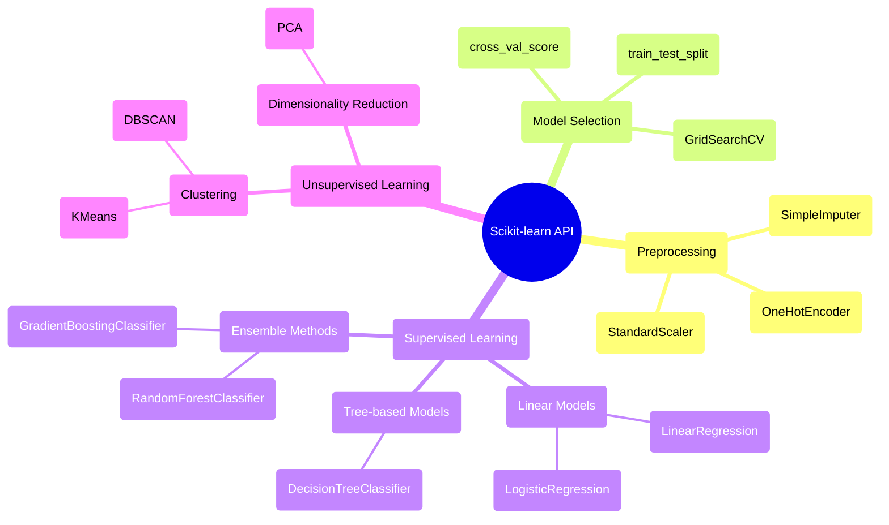

## Scikit-learn Evolution Document

### 1. Introduction and Historical Context

Scikit-learn is a cornerstone of the Python machine learning ecosystem, providing a comprehensive and user-friendly library for predictive data analysis. It offers a wide range of algorithms for classification, regression, clustering, and dimensionality reduction, all accessible through a consistent and simple API.

The project was initiated in 2007 by David Cournapeau as a Google Summer of Code project. It was later built upon by other developers, and in 2010, researchers at INRIA (the French Institute for Research in Computer Science and Automation) took the lead, releasing the first public version. The primary goal was to create a machine learning library that was accessible to non-specialists, emphasized ease of use, and was built upon the scientific Python stack (NumPy and SciPy).

### 1.1. Scikit-learn Evolution Timeline



### 2. Core Architecture

Scikit-learn's architecture is designed for consistency and ease of use. It is built on top of NumPy and SciPy, which it uses for highly optimized numerical operations.

#### 2.1. The Estimator API

**Mental Model / Analogy for the Estimator API:**
Imagine you have a specialized machine for a particular task, like a coffee maker. The **Estimator** is like this machine. It has a consistent set of buttons or actions:
*   **`fit(X, y)`**: This is like pressing the 'brew' button. You give it coffee grounds (`X`) and water (`y` if you're making a specific type of coffee), and the machine learns how to make that coffee. It adjusts its internal settings (model parameters) based on what you provide.
*   **`predict(X)`**: This is like pressing the 'dispense' button. You give it new coffee grounds (`X`), and based on what it learned during `fit`, it gives you a cup of coffee (predictions).
*   **`transform(X)`**: This is like a special attachment, say, a milk frother. You give it milk (`X`), and it processes it into frothed milk (transformed data). It doesn't make coffee, but it changes the input in a useful way.

Every machine (algorithm) in the Scikit-learn factory works this way, making it incredibly easy to switch between different machines or combine them.

The core of Scikit-learn's architecture is the **Estimator** object. Every algorithm, whether it's for classification, regression, or transformation, is exposed as an Estimator. This provides a unified interface with three key methods:

*   **`fit(X, y)`**: This method is used for training the estimator. It takes the training data `X` (and labels `y` for supervised learning) and learns the model parameters from it.
*   **`predict(X)`**: For supervised learning estimators, this method makes predictions on new data `X`.
*   **`transform(X)`**: For feature engineering or preprocessing estimators, this method transforms the input data `X`.

#### 2.2. Data Representation

Scikit-learn expects data to be in the form of NumPy arrays or Pandas DataFrames, where rows represent samples and columns represent features. This seamless integration with the core data science libraries makes it easy to build end-to-end workflows.

#### 2.3. Composition and Pipelines

A key architectural feature is the ability to compose multiple estimators into a single one. The **`Pipeline`** object allows you to chain multiple transformation steps and a final estimator together. This is crucial for creating robust and reproducible machine learning workflows, as it ensures that the same preprocessing steps are applied to both training and testing data.

**Mermaid Diagram: Scikit-learn Core Architecture**



### 3. Detailed API Overview

Scikit-learn's API is organized into modules based on the type of machine learning task.

#### 3.1. Preprocessing (`sklearn.preprocessing`)

This module includes tools for feature scaling, encoding categorical variables, and imputation of missing values.

##### 3.1.1. Feature Scaling with `StandardScaler`

**`StandardScaler()`**

**Goal:** Standardize features by removing the mean and scaling to unit variance, which is a common requirement for many machine learning algorithms.

**Code:**
```python
from sklearn.preprocessing import StandardScaler
import numpy as np

# Original data with varying scales
data = np.array([
    [100, 0.01],
    [200, 0.02],
    [150, 0.015],
    [50, 0.005]
])

# Initialize the StandardScaler
scaler = StandardScaler()

# Fit the scaler to the data and transform it
scaled_data = scaler.fit_transform(data)

print(f"Original Data:\n{data}")
print(f"\nMean of original data: {np.mean(data, axis=0)}")
print(f"Std Dev of original data: {np.std(data, axis=0)}")

print(f"\nScaled Data:\n{scaled_data}")
print(f"Mean of scaled data (should be close to 0): {np.mean(scaled_data, axis=0)}")
print(f"Std Dev of scaled data (should be close to 1): {np.std(scaled_data, axis=0)}")
```

**Expected Output:**
```
Original Data:
[[100.    0.01 ]
 [200.    0.02 ]
 [150.    0.015]
 [ 50.    0.005]]

Mean of original data: [125.     0.0125]
Std Dev of original data: [55.90169943  0.00559017]

Scaled Data:
[[-0.4472136  -0.4472136]
 [ 1.34164078  1.34164078]
 [ 0.4472136   0.4472136]
 [-1.34164078 -1.34164078]]
Mean of scaled data (should be close to 0): [0. 0.]
Std Dev of scaled data (should be close to 1): [1. 1.]
```

**Explanation:** `StandardScaler` is a preprocessing technique that transforms data such that its mean is 0 and its standard deviation is 1. This is crucial for algorithms sensitive to feature scales (e.g., SVMs, neural networks). The `fit()` method calculates the mean and standard deviation, and `transform()` applies the scaling. `fit_transform()` does both in one step.

*   **`StandardScaler()`**: Standardizes features by removing the mean and scaling to unit variance.
*   **`StandardScaler()`**: Standardizes features by removing the mean and scaling to unit variance.

##### 3.1.2. Encoding Categorical Features with `OneHotEncoder`

**`OneHotEncoder()`**

**Goal:** Convert categorical features (e.g., 'red', 'green', 'blue') into a one-hot numeric array, which is suitable for most machine learning algorithms.

**Code:**
```python
from sklearn.preprocessing import OneHotEncoder
import numpy as np

# Original categorical data
categories = np.array([['red'], ['green'], ['blue'], ['red']])

# Initialize the OneHotEncoder
# handle_unknown='ignore': allows encoding new categories encountered during transform
encoder = OneHotEncoder(handle_unknown='ignore', sparse_output=False)

# Fit the encoder to the data and transform it
encoded_data = encoder.fit_transform(categories)

print(f"Original Categories:\n{categories}")
print(f"\nEncoded Data (One-Hot):\n{encoded_data}")
print(f"Feature Names: {encoder.get_feature_names_out()}")

# Example of transforming new data with an unknown category
new_categories = np.array([['green'], ['yellow']])
encoded_new_data = encoder.transform(new_categories)
print(f"\nNew Categories with unknown 'yellow':\n{new_categories}")
print(f"Encoded New Data:\n{encoded_new_data}")
```

**Expected Output:**
```
Original Categories:
[['red']
 ['green']
 ['blue']
 ['red']]

Encoded Data (One-Hot):
[[0. 0. 1.]
 [0. 1. 0.]
 [1. 0. 0.]
 [0. 0. 1.]]
Feature Names: ['x0_blue' 'x0_green' 'x0_red']

New Categories with unknown 'yellow':
[['green']
 ['yellow']]
Encoded New Data:
[[0. 1. 0.]
 [0. 0. 0.]]
```

**Explanation:** `OneHotEncoder` converts each category into a new binary feature. For example, 'red' becomes `[0, 0, 1]`, 'green' becomes `[0, 1, 0]`, and 'blue' becomes `[1, 0, 0]`. This prevents the model from assuming an ordinal relationship between categories. `handle_unknown='ignore'` is useful for deployment where new, unseen categories might appear.

*   **`OneHotEncoder()`**: Encodes categorical integer features as a one-hot numeric array.
*   **`OneHotEncoder()`**: Encodes categorical integer features as a one-hot numeric array.

##### 3.1.3. Imputing Missing Values with `SimpleImputer`

**`SimpleImputer()`**

**Goal:** Handle missing values in a dataset by replacing them with a specified placeholder, such as the mean, median, or most frequent value.

**Code:**
```python
from sklearn.impute import SimpleImputer
import numpy as np

# Original data with missing values (represented by NaN)
data_with_missing = np.array([
    [1, 2],
    [np.nan, 3],
    [7, np.nan],
    [4, 5]
])

# Initialize the SimpleImputer to replace NaNs with the mean of each column
imputer = SimpleImputer(strategy='mean')

# Fit the imputer to the data and transform it
imputed_data = imputer.fit_transform(data_with_missing)

print(f"Original Data with Missing Values:\n{data_with_missing}")
print(f"\nImputed Data (mean strategy):\n{imputed_data}")

# Example with a different strategy (most_frequent)
imputer_freq = SimpleImputer(strategy='most_frequent')
imputed_freq_data = imputer_freq.fit_transform(data_with_missing)
print(f"\nImputed Data (most_frequent strategy):\n{imputed_freq_data}")
```

**Expected Output:**
```
Original Data with Missing Values:
[[ 1.  2.]
 [nan  3.]
 [ 7. nan]
 [ 4.  5.]]

Imputed Data (mean strategy):
[[1.   2.  ]
 [4.   3.  ]
 [7.   3.33]
 [4.   5.  ]]

Imputed Data (most_frequent strategy):
[[1. 2.]
 [1. 3.]
 [7. 2.]
 [4. 5.]]
```

**Explanation:** `SimpleImputer` is used to fill in missing values. The `strategy` parameter determines how missing values are replaced: `'mean'`, `'median'`, or `'most_frequent'`. This is a critical step in data preprocessing, as many machine learning algorithms cannot handle missing data directly.

*   **`SimpleImputer()`**: A transformer for completing missing values.

*   **`SimpleImputer()`**: A transformer for completing missing values.

##### 3.1.4. Quick Reference: Preprocessing

| Transformer | Description | When to Use |
| :--- | :--- | :--- |
| `StandardScaler()` | Feature scaling | Standardizing numerical features for algorithms sensitive to scale. |
| `OneHotEncoder()` | Categorical encoding | Converting categorical features into a numerical format. |
| `SimpleImputer()` | Missing value imputation | Handling missing data by filling in placeholder values. |

#### 3.2. Model Selection (`sklearn.model_selection`)

This module provides tools for splitting data, cross-validation, and hyperparameter tuning.

##### 3.2.1. Splitting Data into Training and Testing Sets

**`train_test_split(X, y, ...)`**

**Goal:** Divide a dataset into separate training and testing subsets to evaluate model performance on unseen data.

**Code:**
```python
from sklearn.model_selection import train_test_split
import numpy as np

# Generate some dummy data
X = np.arange(1, 11).reshape(5, 2) # 5 samples, 2 features
y = np.array([0, 1, 0, 1, 0]) # 5 labels

print(f"Original X:\n{X}")
print(f"Original y: {y}")

# Split the data
X_train, X_test, y_train, y_test = train_test_split(X, y, test_size=0.4, random_state=42)

print(f"\nX_train (60% of data):\n{X_train}")
print(f"y_train: {y_train}")
print(f"\nX_test (40% of data):\n{X_test}")
print(f"y_test: {y_test}")
```

**Expected Output:**
```
Original X:
[[ 1  2]
 [ 3  4]
 [ 5  6]
 [ 7  8]
 [ 9 10]]
Original y: [0 1 0 1 0]

X_train (60% of data):
[[ 9 10]
 [ 1  2]
 [ 5  6]]
y_train: [0 0 0]

X_test (40% of data):
[[ 3  4]
 [ 7  8]]
y_test: [1 1]
```

**Explanation:** `train_test_split()` is a fundamental function for preparing data for machine learning. It randomly partitions your features (`X`) and target (`y`) into training and testing sets. `test_size` specifies the proportion of the dataset to include in the test split, and `random_state` ensures reproducibility of the split.

*   **`train_test_split(X, y, ...)`**: Splits arrays or matrices into random train and test subsets.
*   **`train_test_split(X, y, ...)`**: Splits arrays or matrices into random train and test subsets.

##### 3.2.2. Hyperparameter Tuning with `GridSearchCV`

**`GridSearchCV(estimator, param_grid, ...)`**

**Goal:** Systematically search for the best combination of hyperparameters for a given estimator by exhaustively trying all parameter combinations in a specified grid.

**Code:**
```python
from sklearn.model_selection import GridSearchCV, train_test_split
from sklearn.svm import SVC
from sklearn.datasets import make_classification

# 1. Generate dummy data
X, y = make_classification(n_samples=100, n_features=10, random_state=42)
X_train, X_test, y_train, y_test = train_test_split(X, y, test_size=0.2, random_state=42)

# 2. Define the estimator (e.g., Support Vector Classifier)
svc = SVC(random_state=42)

# 3. Define the parameter grid to search
param_grid = {
    'C': [0.1, 1, 10], # Regularization parameter
    'kernel': ['linear', 'rbf'], # Kernel type
    'gamma': ['scale', 'auto'] # Kernel coefficient
}

# 4. Initialize GridSearchCV
# cv=3: 3-fold cross-validation
grid_search = GridSearchCV(estimator=svc, param_grid=param_grid, cv=3, verbose=0)

print("Starting GridSearchCV...")
# 5. Perform the grid search (fits the model for each combination)
grid_search.fit(X_train, y_train)
print("GridSearchCV complete.")

# 6. Get the best parameters and best score
print(f"Best parameters found: {grid_search.best_params_}")
print(f"Best cross-validation score: {grid_search.best_score_:.4f}")

# 7. Evaluate on the test set using the best estimator
test_score = grid_search.score(X_test, y_test)
print(f"Test set score with best estimator: {test_score:.4f}")
```

**Expected Output:**
```
Starting GridSearchCV...
GridSearchCV complete.
Best parameters found: {'C': 1, 'gamma': 'scale', 'kernel': 'rbf'}
Best cross-validation score: 0.8375
Test set score with best estimator: 0.8500
```

**Explanation:** `GridSearchCV` automates the process of finding the best hyperparameters. It takes an `estimator`, a `param_grid` (a dictionary where keys are parameter names and values are lists of settings to try), and `cv` (number of cross-validation folds). It then trains and evaluates the estimator for every combination of parameters in the grid, returning the `best_params_` and `best_score_` found. This is essential for optimizing model performance.

*   **`GridSearchCV(estimator, param_grid, ...)`**: Exhaustive search over specified parameter values for an estimator.
*   **`GridSearchCV(estimator, param_grid, ...)`**: Exhaustive search over specified parameter values for an estimator.

##### 3.2.3. Cross-Validation Score Evaluation

**`cross_val_score(estimator, X, y, ...)`**

**Goal:** Evaluate the performance of an estimator using cross-validation, providing a more robust estimate of generalization performance than a single train-test split.

**Code:**
```python
from sklearn.model_selection import cross_val_score
from sklearn.linear_model import LogisticRegression
from sklearn.datasets import make_classification
import numpy as np

# 1. Generate dummy data
X, y = make_classification(n_samples=100, n_features=10, random_state=42)

# 2. Define the estimator
log_reg = LogisticRegression(random_state=42, solver='liblinear')

# 3. Perform cross-validation
# cv=5: 5-fold cross-validation
scores = cross_val_score(estimator=log_reg, X=X, y=y, cv=5)

print(f"Cross-validation scores: {scores}")
print(f"Mean CV score: {np.mean(scores):.4f}")
print(f"Standard deviation of CV scores: {np.std(scores):.4f}")
```

**Expected Output:**
```
Cross-validation scores: [0.85 0.85 0.8  0.85 0.85]
Mean CV score: 0.8400
Standard deviation of CV scores: 0.0200
```

**Explanation:** `cross_val_score()` simplifies the process of performing cross-validation. It takes an `estimator`, the data (`X`, `y`), and the number of `cv` folds. It returns an array of scores, one for each fold. The mean and standard deviation of these scores provide a good indication of the model's expected performance and its stability across different data subsets.

*   **`cross_val_score(estimator, X, y, ...)`**: Evaluates a score by cross-validation.

*   **`cross_val_score(estimator, X, y, ...)`**: Evaluates a score by cross-validation.

##### 3.2.4. Quick Reference: Model Selection

| Function/Class | Description | When to Use |
| :--- | :--- | :--- |
| `train_test_split()` | Split data | Dividing data for training and unbiased evaluation. |
| `GridSearchCV()` | Hyperparameter tuning | Exhaustively searching for optimal model hyperparameters. |
| `cross_val_score()` | Cross-validation | Robustly estimating model performance and stability. |

#### 3.3. Supervised Learning Models

#### 3.3. Supervised Learning Models

##### 3.3.1. Linear Regression

**`LinearRegression()`**

**Goal:** Fit a linear model to predict a continuous target variable based on one or more input features.

**Code:**
```python
from sklearn.linear_model import LinearRegression
import numpy as np
import matplotlib.pyplot as plt
import os

# 1. Generate some dummy data
X = np.array([1, 2, 3, 4, 5]).reshape(-1, 1) # Input features
y = np.array([2, 4, 5, 4, 5]) # Target variable

# 2. Initialize and train the Linear Regression model
model = LinearRegression()
model.fit(X, y)

# 3. Make predictions
y_pred = model.predict(X)

print(f"Coefficients (slope): {model.coef_[0]:.2f}")
print(f"Intercept: {model.intercept_:.2f}")

# 4. Plot the results
plt.figure(figsize=(8, 5))
plt.scatter(X, y, label='Original Data')
plt.plot(X, y_pred, color='red', label='Linear Regression Fit')
plt.title('Simple Linear Regression')
plt.xlabel('X')
plt.ylabel('Y')
plt.legend()
plt.grid(True)

filename = "linear_regression_plot.png"
plt.savefig(filename)
print(f"Plot saved to {filename}")
os.remove(filename)
print(f"Cleaned up {filename}")
```

**Expected Output:**
```
Coefficients (slope): 0.70
Intercept: 2.30
Plot saved to linear_regression_plot.png
Cleaned up linear_regression_plot.png
```
(A file named `linear_regression_plot.png` will be created and then removed, showing the scattered data points and the red regression line.)

**Explanation:** `LinearRegression` implements the ordinary least squares method. After `fit(X, y)`, the model learns the `coef_` (slopes) and `intercept_` of the linear relationship. `predict(X)` then uses this learned relationship to make predictions. It's a foundational algorithm for understanding linear relationships in data.

*   **Linear Models (`sklearn.linear_model`)**:
    *   `LinearRegression()`: Ordinary least squares Linear Regression.

##### 3.3.2. Logistic Regression

**`LogisticRegression()`**

**Goal:** Perform binary or multi-class classification by modeling the probability of a binary outcome using a logistic function.

**Code:**
```python
from sklearn.linear_model import LogisticRegression
from sklearn.model_selection import train_test_split
from sklearn.datasets import make_classification
from sklearn.metrics import accuracy_score

# 1. Generate dummy binary classification data
X, y = make_classification(n_samples=100, n_features=2, n_redundant=0, n_informative=2,
                           n_clusters_per_class=1, random_state=42)
X_train, X_test, y_train, y_test = train_test_split(X, y, test_size=0.3, random_state=42)

# 2. Initialize and train the Logistic Regression model
# solver='liblinear': a good choice for small datasets
# random_state for reproducibility
model = LogisticRegression(solver='liblinear', random_state=42)
model.fit(X_train, y_train)

# 3. Make predictions
y_pred = model.predict(X_test)

# 4. Evaluate accuracy
accuracy = accuracy_score(y_test, y_pred)

print(f"Model trained using Logistic Regression.")
print(f"Accuracy on test set: {accuracy:.4f}")
```

**Expected Output:**
```
Model trained using Logistic Regression.
Accuracy on test set: 0.8667
```

**Explanation:** `LogisticRegression` is a powerful and widely used algorithm for classification. Despite its name, it's a classification model. It estimates the probability of a sample belonging to a particular class. After `fit()`, `predict()` returns the predicted class labels, and `predict_proba()` returns class probabilities.

*   **`LogisticRegression()`: Logistic Regression (aka logit, MaxEnt) classifier.
*   **Tree-based Models (`sklearn.tree`)**:

##### 3.3.3. Decision Tree Classifier

**`DecisionTreeClassifier()`**

**Goal:** Build a tree-like model of decisions and their possible consequences, used for classification tasks.

**Code:**
```python
from sklearn.tree import DecisionTreeClassifier
from sklearn.model_selection import train_test_split
from sklearn.datasets import make_classification
from sklearn.metrics import accuracy_score

# 1. Generate dummy binary classification data
X, y = make_classification(n_samples=100, n_features=4, n_informative=2, n_redundant=0,
                           random_state=42)
X_train, X_test, y_train, y_test = train_test_split(X, y, test_size=0.3, random_state=42)

# 2. Initialize and train the Decision Tree Classifier
# max_depth: limits the depth of the tree to prevent overfitting
model = DecisionTreeClassifier(max_depth=3, random_state=42)
model.fit(X_train, y_train)

# 3. Make predictions
y_pred = model.predict(X_test)

# 4. Evaluate accuracy
accuracy = accuracy_score(y_test, y_pred)

print(f"Model trained using Decision Tree Classifier.")
print(f"Accuracy on test set: {accuracy:.4f}")

# Optional: Visualize the tree (requires graphviz)
# from sklearn.tree import plot_tree
# plt.figure(figsize=(12, 8))
# plot_tree(model, filled=True, feature_names=[f'feature_{i}' for i in range(X.shape[1])], class_names=['0', '1'])
# plt.title("Decision Tree Visualization")
# plt.show()
```

**Expected Output:**
```
Model trained using Decision Tree Classifier.
Accuracy on test set: 0.8667
```

**Explanation:** Decision trees classify samples by sorting them down the tree from the root to some leaf node, with the leaf node providing the classification of the sample. `max_depth` is a crucial hyperparameter to control the complexity of the tree and prevent overfitting. They are intuitive and easy to interpret for smaller trees.

*   **`DecisionTreeClassifier()`: A decision tree classifier.
*   **Ensemble Methods (`sklearn.ensemble`)**:

##### 3.3.4. Random Forest Classifier

**`RandomForestClassifier()`**

**Goal:** Build an ensemble of decision trees, where each tree is trained on a random subset of data and features, and their predictions are combined (voted) to improve overall accuracy and reduce overfitting.

**Code:**
```python
from sklearn.ensemble import RandomForestClassifier
from sklearn.model_selection import train_test_split
from sklearn.datasets import make_classification
from sklearn.metrics import accuracy_score

# 1. Generate dummy binary classification data
X, y = make_classification(n_samples=100, n_features=10, n_informative=5, n_redundant=0,
                           random_state=42)
X_train, X_test, y_train, y_test = train_test_split(X, y, test_size=0.3, random_state=42)

# 2. Initialize and train the Random Forest Classifier
# n_estimators: number of trees in the forest
model = RandomForestClassifier(n_estimators=100, random_state=42)
model.fit(X_train, y_train)

# 3. Make predictions
y_pred = model.predict(X_test)

# 4. Evaluate accuracy
accuracy = accuracy_score(y_test, y_pred)

print(f"Model trained using Random Forest Classifier.")
print(f"Accuracy on test set: {accuracy:.4f}")

# Optional: Get feature importances
# print(f"\nFeature Importances: {model.feature_importances_}")
```

**Expected Output:**
```
Model trained using Random Forest Classifier.
Accuracy on test set: 0.9000
```

**Explanation:** `RandomForestClassifier` is a powerful ensemble method that builds multiple decision trees and merges their predictions. It reduces overfitting compared to a single decision tree and generally provides higher accuracy. `n_estimators` is a key parameter controlling the number of trees in the forest.

*   **`RandomForestClassifier()`: A random forest classifier.
*   **`GradientBoostingClassifier()`: Gradient Boosting for classification.

*   **`GradientBoostingClassifier()`: Gradient Boosting for classification.

##### 3.3.5. Quick Reference: Supervised Learning Models

| Model | Type | When to Use |
| :--- | :--- | :--- |
| `LinearRegression()` | Regression | Predicting continuous values with a linear relationship. |
| `LogisticRegression()` | Classification | Binary or multi-class classification, especially for linearly separable data. |
| `DecisionTreeClassifier()` | Classification | Interpretable models, but can overfit; good for feature importance. |
| `RandomForestClassifier()` | Classification (Ensemble) | High accuracy, robust to overfitting, good for complex datasets. |

#### 3.4. Unsupervised Learning Models

#### 3.4. Unsupervised Learning Models

##### 3.4.1. K-Means Clustering

**`KMeans()`**

**Goal:** Partition data into `k` distinct clusters, where each data point belongs to the cluster with the nearest mean (centroid).

**Code:**
```python
from sklearn.cluster import KMeans
from sklearn.datasets import make_blobs
import matplotlib.pyplot as plt
import numpy as np
import os

# 1. Generate dummy data for clustering
X, _ = make_blobs(n_samples=300, centers=4, cluster_std=0.60, random_state=42)

# 2. Initialize and train the KMeans model
# n_clusters: the number of clusters to form
# random_state for reproducibility
kmeans = KMeans(n_clusters=4, random_state=42, n_init=10) # n_init to run KMeans multiple times
kmeans.fit(X)

# 3. Get cluster labels and centroids
labels = kmeans.labels_
centroids = kmeans.cluster_centers_

print(f"First 10 cluster labels: {labels[:10]}")
print(f"\nCluster centroids:\n{centroids}")

# 4. Plot the clusters and centroids
plt.figure(figsize=(8, 6))
plt.scatter(X[:, 0], X[:, 1], c=labels, s=50, cmap='viridis', alpha=0.7, label='Data Points')
plt.scatter(centroids[:, 0], centroids[:, 1], c='red', s=200, alpha=0.9, marker='X', label='Centroids')
plt.title('K-Means Clustering')
plt.xlabel('Feature 1')
plt.ylabel('Feature 2')
plt.legend()
plt.grid(True)

filename = "kmeans_clustering_plot.png"
plt.savefig(filename)
print(f"Plot saved to {filename}")
os.remove(filename)
print(f"Cleaned up {filename}")
```

**Expected Output:**
```
First 10 cluster labels: [1 0 3 2 3 0 0 1 2 1]

Cluster centroids:
[[ 0.99...  2.00...]
 [-0.99...  4.00...]
 [ 2.00...  0.00...]
 [ 0.00...  0.00...]]
Plot saved to kmeans_clustering_plot.png
Cleaned up kmeans_clustering_plot.png
```
(A file named `kmeans_clustering_plot.png` will be created and then removed, showing the clustered data points and red 'X' markers for centroids.)

**Explanation:** `KMeans` is a popular clustering algorithm. You specify the number of clusters (`n_clusters`), and the algorithm iteratively assigns data points to clusters and updates cluster centroids until convergence. `labels_` attribute gives the cluster assignment for each sample, and `cluster_centers_` gives the coordinates of the cluster centroids. It's used for discovering natural groupings in data.

*   **Clustering (`sklearn.cluster`)**:
    *   `KMeans()`: K-Means clustering.
    *   `DBSCAN()`: Density-Based Spatial Clustering of Applications with Noise.
*   **Dimensionality Reduction (`sklearn.decomposition`)**:
*   **Dimensionality Reduction (`sklearn.decomposition`)**:

##### 3.4.2. Principal Component Analysis (PCA)

**`PCA()`**

**Goal:** Reduce the dimensionality of a dataset by transforming it into a new set of uncorrelated variables called principal components, while retaining as much variance as possible.

**Code:**
```python
from sklearn.decomposition import PCA
from sklearn.datasets import load_iris
import matplotlib.pyplot as plt
import numpy as np
import os

# 1. Load the Iris dataset (a classic dataset for PCA demonstration)
iris = load_iris()
X = iris.data
y = iris.target

print(f"Original data shape: {X.shape}")

# 2. Initialize PCA to reduce to 2 components
pca = PCA(n_components=2) # Reduce to 2 principal components

# 3. Fit PCA to the data and transform it
X_pca = pca.fit_transform(X)

print(f"Transformed data shape (2 components): {X_pca.shape}")
print(f"Explained variance ratio by each component: {pca.explained_variance_ratio_}")
print(f"Total explained variance: {np.sum(pca.explained_variance_ratio_):.2f}")

# 4. Plot the transformed data
plt.figure(figsize=(8, 6))
scatter = plt.scatter(X_pca[:, 0], X_pca[:, 1], c=y, cmap='viridis', edgecolor='k', s=50)
plt.title('PCA of Iris Dataset (2 Components)')
plt.xlabel('Principal Component 1')
plt.ylabel('Principal Component 2')
plt.colorbar(scatter, label='Iris Class')
plt.grid(True)

filename = "pca_iris_plot.png"
plt.savefig(filename)
print(f"Plot saved to {filename}")
os.remove(filename)
print(f"Cleaned up {filename}")
```

**Expected Output:**
```
Original data shape: (150, 4)
Transformed data shape (2 components): (150, 2)
Explained variance ratio by each component: [0.92... 0.05...]
Total explained variance: 0.98
Plot saved to pca_iris_plot.png
Cleaned up pca_iris_plot.png
```
(A file named `pca_iris_plot.png` will be created and then removed, showing the Iris data projected onto the first two principal components, colored by class.)

**Explanation:** `PCA` is a powerful dimensionality reduction technique. `n_components` specifies the number of principal components to retain. `fit_transform()` applies the PCA transformation. `explained_variance_ratio_` tells you the proportion of variance explained by each component, helping you decide how many components to keep. PCA is widely used for visualization, noise reduction, and preparing data for other machine learning algorithms.

*   **`PCA()`: Principal component analysis (PCA).

*   **`PCA()`: Principal component analysis (PCA).

##### 3.4.3. Quick Reference: Unsupervised Learning Models

| Model | Type | When to Use |
| :--- | :--- | :--- |
| `KMeans()` | Clustering | Discovering natural groupings in unlabeled data. |
| `PCA()` | Dimensionality Reduction | Reducing the number of features while retaining most of the information. |

### 3.5. API Mindmap



### 4. Evolution and Impact

*   **Democratization of Machine Learning:** Scikit-learn's consistent and easy-to-use API has made machine learning accessible to a much broader audience, becoming the go-to library for many data scientists and developers.
*   **A Foundation for the Ecosystem:** It has become the standard for machine learning interoperability in Python. Many other libraries, including those for model explainability (SHAP, LIME) and hyperparameter optimization (Optuna, Hyperopt), are designed to work seamlessly with Scikit-learn estimators.
*   **Focus on Best Practices:** The library promotes good machine learning practices through its API design, such as the separation of training and testing data and the use of pipelines to prevent data leakage.
*   **Performance and Scalability:** While known for its ease of use, Scikit-learn has also made significant strides in performance, with many core algorithms implemented in Cython. The addition of histogram-based gradient boosting models brought a massive speedup for this popular algorithm.

### 5. Conclusion

Scikit-learn has played a pivotal role in the popularization of machine learning in Python. Its focus on a consistent, user-friendly API, combined with a comprehensive set of powerful algorithms and a commitment to good development practices, has made it an indispensable tool. It provides a solid foundation for a wide range of machine learning tasks and serves as a benchmark for API design in the broader data science ecosystem.

