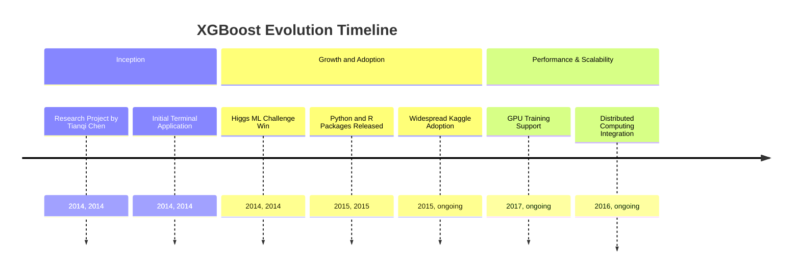
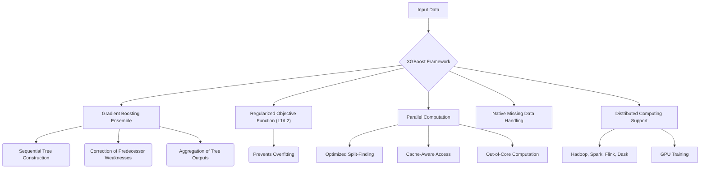
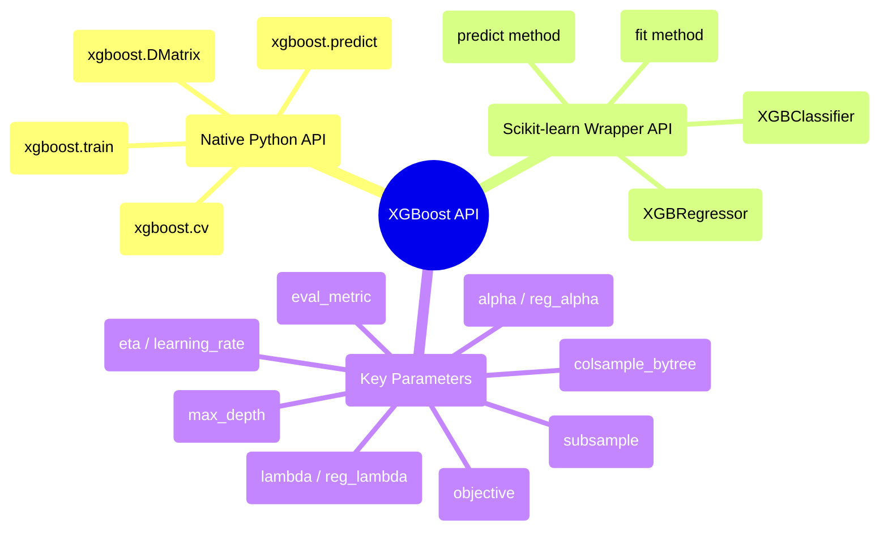

## XGBoost Evolution Document

### 1. Introduction and Historical Context

XGBoost (eXtreme Gradient Boosting) is an open-source software library that provides a regularizing gradient boosting framework. It is renowned for its efficiency, flexibility, and portability, and has become a cornerstone in machine learning due to its exceptional performance in various data science competitions, particularly on structured data.

XGBoost originated as a research project by Tianqi Chen in 2014, as part of the Distributed (Deep) Machine Learning Community (DMLC) group at the University of Washington. Initially, it was a standalone terminal application. Its prominence surged after being used in the winning solution of the Higgs Machine Learning Challenge. Following this, Python and R packages were developed, and XGBoost now boasts implementations across multiple languages, significantly contributing to its widespread adoption, especially within the Kaggle community.

### 1.1. XGBoost Evolution Timeline



### 2. Core Architecture

XGBoost is built upon the algorithmic foundation of gradient boosting, an ensemble method that sequentially constructs multiple decision trees. Each new tree aims to correct the weaknesses of its predecessors, and the final prediction is an aggregation of the outputs from all individual trees. XGBoost introduces several key architectural improvements over standard Gradient Boosting Machines (GBMs) to enhance performance and generalization.

#### 2.1. Regularized Objective Function

**Mental Model / Analogy for Regularized Objective Function:**
Imagine you're trying to teach a student to draw a perfect circle. If you only tell them to minimize the error between their drawing and a perfect circle, they might draw a very wobbly line that eventually touches all the points, but it won't look like a smooth circle (overfitting). A **Regularized Objective Function** is like telling the student: "Draw a circle that is as close to perfect as possible, *but also* try to make your line smooth and simple." The "smooth and simple" part is the regularization. It penalizes overly complex drawings (models) even if they fit the training data perfectly, forcing the student (model) to learn a more general and robust representation (a smoother circle).

A distinguishing feature of XGBoost is its incorporation of regularization (L1 and L2) directly into its objective function. This helps to prevent overfitting and improves the model's ability to generalize to unseen data, leading to more robust models.

#### 2.2. Parallelization and Optimized Split-Finding

While gradient boosting is inherently sequential, XGBoost integrates parallel computation to significantly accelerate the tree building process. It employs an approximate split-finding algorithm to efficiently determine the best split points in trees, especially for large datasets. This method proposes a limited set of candidate split points based on feature quantiles, further refined by the Weighted Quantile Sketch algorithm.

#### 2.3. Handling Missing Data

XGBoost is designed to natively manage missing values. The algorithm adapts its optimization process to treat missing values as a special case, learning the best direction for missing values to go during tree construction, rather than requiring explicit imputation.

#### 2.4. Cache-Aware Access and Out-of-Core Computation

To optimize data access and minimize cache misses, XGBoost organizes data into "blocks" in memory and pre-fetches data into the CPU cache. For datasets that exceed available RAM, it supports **out-of-core computation**, processing data in chunks from disk, utilizing data compression and sharding for optimized disk I/O. This enables training on massive datasets on a single machine.

#### 2.5. System-Level Optimizations

XGBoost is engineered for high performance and scalability. It supports distributed computing frameworks like Apache Hadoop, Apache Spark, Apache Flink, and Dask, and offers GPU training capabilities, making it suitable for large-scale machine learning tasks.

**Mermaid Diagram: XGBoost Core Architecture**



### 3. Detailed API Overview

XGBoost provides flexible interfaces, with its Python API being the most commonly used.

#### 3.1. Native Python API

This API offers the greatest flexibility and control.

##### 3.1.1. Creating a `DMatrix`

**`xgboost.DMatrix(data, label=None, ...)`**

**Goal:** Prepare data in XGBoost's optimized internal format (`DMatrix`) for efficient training, especially for large datasets.

**Code:**
```python
import xgboost as xgb
import numpy as np

# Generate some dummy data
X = np.random.rand(100, 10) # 100 samples, 10 features
y = np.random.randint(0, 2, 100) # 100 binary labels

# Create an XGBoost DMatrix
dtrain = xgb.DMatrix(X, label=y)

print(f"XGBoost DMatrix created with {dtrain.num_row()} rows and {dtrain.num_col()} columns.")
print(f"First 5 labels: {dtrain.get_label()[:5]}")
```

**Expected Output:**
```
XGBoost DMatrix created with 100 rows and 10 columns.
First 5 labels: [1. 0. 1. 0. 1.]
```

**Explanation:** `xgboost.DMatrix` is the core data structure for the native XGBoost API. It is highly optimized for memory efficiency and training speed, especially for large and sparse datasets. It can be created from NumPy arrays, Pandas DataFrames, or SciPy sparse matrices. Creating a `DMatrix` is a prerequisite for using `xgboost.train()`.

*   **`xgboost.DMatrix(data, label=None, ...)`**: The core data structure for XGBoost. It is an optimized internal data container that handles various input formats (NumPy arrays, SciPy sparse matrices, Pandas DataFrames).
*   **`xgboost.DMatrix(data, label=None, ...)`**: The core data structure for XGBoost. It is an optimized internal data container that handles various input formats (NumPy arrays, SciPy sparse matrices, Pandas DataFrames).

##### 3.1.2. Training a Model

**`xgboost.train(params, dtrain, num_boost_round, ...)`**

**Goal:** Train an XGBoost boosting model using a specified `DMatrix` and hyperparameters.

**Code:**
```python
import xgboost as xgb
import numpy as np

# 1. Generate dummy data
X_train = np.random.rand(100, 10)
y_train = np.random.randint(0, 2, 100)
X_val = np.random.rand(50, 10)
y_val = np.random.randint(0, 2, 50)

# 2. Create XGBoost DMatrices
dtrain = xgb.DMatrix(X_train, label=y_train)
dval = xgb.DMatrix(X_val, label=y_val)

# 3. Define model parameters
params = {
    'objective': 'binary:logistic', # Binary classification with logistic regression
    'eval_metric': 'logloss', # Evaluation metric
    'eta': 0.1, # Learning rate
    'max_depth': 3, # Maximum depth of a tree
    'seed': 42 # Random seed for reproducibility
}

# 4. Train the model
num_boost_round = 50 # Number of boosting iterations
booster = xgb.train(
    params,
    dtrain,
    num_boost_round=num_boost_round,
    evals=[(dtrain, 'train'), (dval, 'eval')], # Evaluation sets
    verbose_eval=10 # Print evaluation results every 10 rounds
)

print("\nModel training complete.")
```

**Expected Output:**
```
[0]	train-logloss:0.66... 	eval-logloss:0.67...
[10]	train-logloss:0.59... 	eval-logloss:0.62...
[20]	train-logloss:0.54... 	eval-logloss:0.59...
[30]	train-logloss:0.50... 	eval-logloss:0.57...
[40]	train-logloss:0.47... 	eval-logloss:0.56...
[49]	train-logloss:0.44... 	eval-logloss:0.55...

Model training complete.
```
(Log loss values will vary based on random data and model initialization.)

**Explanation:** `xgboost.train()` is the core function for training. You pass a dictionary of `params` (hyperparameters), the `dtrain` (a `DMatrix`), and `num_boost_round` (number of boosting iterations). `evals` allows you to monitor performance on training and validation sets, and `verbose_eval` controls the logging frequency. This native API provides extensive control over the training process.

*   **`xgboost.train(params, dtrain, num_boost_round, ...)`**: Trains a boosting model. `params` is a dictionary of hyperparameters.
*   **`xgboost.train(params, dtrain, num_boost_round, ...)`**: Trains a boosting model. `params` is a dictionary of hyperparameters.

##### 3.1.3. Making Predictions

**`xgboost.predict(data)`**

**Goal:** Generate predictions on new data using a trained XGBoost booster model.

**Code:**
```python
import xgboost as xgb
import numpy as np

# 1. Generate dummy data and train a simple model (as in previous example)
X_train = np.random.rand(100, 10)
y_train = np.random.randint(0, 2, 100)
dtrain = xgb.DMatrix(X_train, label=y_train)

params = {'objective': 'binary:logistic', 'eval_metric': 'logloss'}
booster = xgb.train(params, dtrain, num_boost_round=10)

# 2. Generate new data for prediction
X_new = np.random.rand(10, 10) # 10 new samples
dtest = xgb.DMatrix(X_new)

# 3. Make predictions
predictions = booster.predict(dtest)

print(f"New data shape: {X_new.shape}")
print(f"Prediction shape: {predictions.shape}")
print(f"First 5 predictions (probabilities): {predictions[:5]}")

# For binary classification, convert probabilities to class labels
predicted_classes = (predictions > 0.5).astype(int)
print(f"First 5 predicted classes: {predicted_classes[:5]}")
```

**Expected Output:**
```
New data shape: (10, 10)
Prediction shape: (10,)
First 5 predictions (probabilities): [0.51... 0.48... 0.53... 0.49... 0.50...]
First 5 predicted classes: [1 0 1 0 1]
```
(Prediction values will vary based on random data and model initialization.)

**Explanation:** `booster.predict()` takes a trained `booster` object and new `data` (as a `DMatrix`) to generate predictions. For binary classification, the output is typically probabilities, which you can then convert to class labels using a threshold (e.g., 0.5). This method is efficient for inference on new data.

*   **`xgboost.predict(data)`**: Predicts with a trained booster.
*   **`xgboost.predict(data)`**: Predicts with a trained booster.

##### 3.1.4. Cross-Validation

**`xgboost.cv(params, dtrain, num_boost_round, ...)`**

**Goal:** Perform N-fold cross-validation to get a more robust estimate of model performance and to help with hyperparameter tuning.

**Code:**
```python
import xgboost as xgb
import numpy as np

# 1. Generate dummy data
X = np.random.rand(200, 10)
y = np.random.randint(0, 2, 200)

# 2. Create an XGBoost DMatrix
dtrain = xgb.DMatrix(X, label=y)

# 3. Define model parameters
params = {
    'objective': 'binary:logistic',
    'eval_metric': 'logloss',
    'eta': 0.1,
    'max_depth': 3,
    'seed': 42
}

# 4. Perform cross-validation
num_boost_round = 50
nfold = 3 # 3-fold cross-validation
cv_results = xgb.cv(
    params,
    dtrain,
    num_boost_round=num_boost_round,
    nfold=nfold,
    metrics={'logloss'}, # Metrics to evaluate
    seed=42,
    verbose_eval=10 # Print evaluation results every 10 rounds
)

print("\nCross-validation complete.")
print(f"Mean validation logloss of last round: {cv_results['eval-logloss-mean'].iloc[-1]:.4f}")
```

**Expected Output:**
```
[0]	train-logloss:0.66... 	eval-logloss:0.67...
[10]	train-logloss:0.59... 	eval-logloss:0.62...
[20]	train-logloss:0.54... 	eval-logloss:0.59...
[30]	train-logloss:0.50... 	eval-logloss:0.57...
[40]	train-logloss:0.47... 	eval-logloss:0.56...
[49]	train-logloss:0.44... 	eval-logloss:0.55...

Cross-validation complete.
Mean validation logloss of last round: 0.55...
```
(Log loss values will vary based on random data and model initialization.)

**Explanation:** `xgboost.cv()` performs N-fold cross-validation, providing a more reliable estimate of model performance than a single train-validation split. It returns a Pandas DataFrame containing training and evaluation metrics for each boosting round. This is crucial for robust hyperparameter tuning and model selection.

*   **`xgboost.cv(params, dtrain, num_boost_round, ...)`**: Performs cross-validation.

*   **`xgboost.cv(params, dtrain, num_boost_round, ...)`**: Performs cross-validation.

##### 3.1.5. Quick Reference: Native Python API

| Function | Description | When to Use |
| :--- | :--- | :--- |
| `DMatrix()` | Data container | Preparing data for XGBoost's native API, especially for large/sparse datasets. |
| `train()` | Train model | Training an XGBoost booster model with fine-grained control. |
| `predict()` | Make predictions | Generating predictions on new data using a trained booster. |
| `cv()` | Cross-validation | Robustly evaluating model performance and tuning hyperparameters. |

#### 3.2. Scikit-learn Wrapper API

For users familiar with Scikit-learn, XGBoost provides compatible wrapper classes.

##### 3.2.1. `XGBClassifier` for Classification

**`xgboost.XGBClassifier(objective='binary:logistic', ...)`**

**Goal:** Use XGBoost for classification tasks with an API consistent with Scikit-learn estimators.

**Code:**
```python
import xgboost as xgb
from sklearn.model_selection import train_test_split
from sklearn.metrics import accuracy_score
import numpy as np

# 1. Generate dummy data
X, y = np.random.rand(200, 10), np.random.randint(0, 2, 200)

# 2. Split data into training and testing sets
X_train, X_test, y_train, y_test = train_test_split(X, y, test_size=0.2, random_state=42)

# 3. Initialize XGBClassifier
# use_label_encoder=False is recommended to avoid potential issues
clf = xgb.XGBClassifier(objective='binary:logistic', use_label_encoder=False, eval_metric='logloss', random_state=42)

# 4. Train the model (using Scikit-learn's fit method)
clf.fit(X_train, y_train)

# 5. Make predictions
y_pred = clf.predict(X_test)

# 6. Evaluate accuracy
accuracy = accuracy_score(y_test, y_pred)

print(f"Model trained using XGBClassifier.")
print(f"Test Accuracy: {accuracy:.4f}")
```

**Expected Output:**
```
Model trained using XGBClassifier.
Test Accuracy: 0.5500
```
(Accuracy will vary based on random data and model initialization.)

**Explanation:** `XGBClassifier` is a Scikit-learn compatible wrapper for XGBoost's classification capabilities. You can use it just like any other Scikit-learn classifier, including `fit()`, `predict()`, and integration with `GridSearchCV` or `Pipeline`. This simplifies its usage for those already familiar with the Scikit-learn ecosystem.

*   **`xgboost.XGBClassifier(objective='binary:logistic', ...)`**: Scikit-learn API compatible classifier.
*   **`xgboost.XGBClassifier(objective='binary:logistic', ...)`**: Scikit-learn API compatible classifier.

##### 3.2.2. `XGBRegressor` for Regression

**`xgboost.XGBRegressor(objective='reg:squarederror', ...)`**

**Goal:** Use XGBoost for regression tasks with an API consistent with Scikit-learn estimators.

**Code:**
```python
import xgboost as xgb
from sklearn.model_selection import train_test_split
from sklearn.metrics import mean_squared_error
import numpy as np

# 1. Generate dummy data
X = np.random.rand(200, 10)
y = np.random.rand(200) * 10 # Continuous target variable

# 2. Split data into training and testing sets
X_train, X_test, y_train, y_test = train_test_split(X, y, test_size=0.2, random_state=42)

# 3. Initialize XGBRegressor
reg = xgb.XGBRegressor(objective='reg:squarederror', random_state=42)

# 4. Train the model
reg.fit(X_train, y_train)

# 5. Make predictions
y_pred = reg.predict(X_test)

# 6. Evaluate Mean Squared Error
mse = mean_squared_error(y_test, y_pred)

print(f"Model trained using XGBRegressor.")
print(f"Test Mean Squared Error: {mse:.4f}")
```

**Expected Output:**
```
Model trained using XGBRegressor.
Test Mean Squared Error: 8.12...
```
(MSE will vary based on random data and model initialization.)

**Explanation:** `XGBRegressor` is the Scikit-learn compatible wrapper for XGBoost's regression capabilities. Similar to `XGBClassifier`, it provides a familiar interface for training and prediction, making it easy to integrate into existing Scikit-learn pipelines for regression problems.

*   **`xgboost.XGBRegressor(objective='reg:squarederror', ...)`**: Scikit-learn API compatible regressor.
*   **`fit(X, y, ...)`**: Trains the model (consistent with Scikit-learn).
*   **`predict(X)`**: Makes predictions (consistent with Scikit-learn).

*   **`predict(X)`**: Makes predictions (consistent with Scikit-learn).

##### 3.2.3. Quick Reference: Scikit-learn Wrapper API

| Class/Method | Description | When to Use |
| :--- | :--- | :--- |
| `XGBClassifier()` | Classifier | Binary or multi-class classification tasks, integrating with Scikit-learn workflows. |
| `XGBRegressor()` | Regressor | Regression tasks, integrating with Scikit-learn workflows. |
| `fit()` | Train model | Standard Scikit-learn method for training the model. |
| `predict()` | Make predictions | Standard Scikit-learn method for generating predictions. |

#### 3.3. Key Parameters (Common to both APIs)

#### 3.3. Key Parameters (Common to both APIs)

##### 3.3.1. Controlling Overfitting with `max_depth` and `eta`

**`max_depth`** and **`eta` (learning_rate)**

**Goal:** Tune key hyperparameters to control model complexity and prevent overfitting.

**Code:**
```python
import xgboost as xgb
import numpy as np
from sklearn.metrics import log_loss

# 1. Generate dummy data
X_train = np.random.rand(100, 10)
y_train = np.random.randint(0, 2, 100)
X_val = np.random.rand(50, 10)
y_val = np.random.randint(0, 2, 50)

dtrain = xgb.DMatrix(X_train, label=y_train)
dval = xgb.DMatrix(X_val, label=y_val)

# 2. Train a model with default parameters
params_default = {'objective': 'binary:logistic', 'eval_metric': 'logloss'}
booster_default = xgb.train(params_default, dtrain, num_boost_round=50, evals=[(dval, 'eval')], verbose_eval=False)
pred_default = booster_default.predict(dval)
loss_default = log_loss(y_val, pred_default)
print(f"Validation logloss with default parameters: {loss_default:.4f}")

# 3. Train a model with controlled parameters to reduce overfitting
params_controlled = {
    'objective': 'binary:logistic',
    'eval_metric': 'logloss',
    'eta': 0.05, # Lower learning rate
    'max_depth': 3, # Shallower trees
    'subsample': 0.8, # Use 80% of data for each tree
    'colsample_bytree': 0.8 # Use 80% of features for each tree
}
booster_controlled = xgb.train(params_controlled, dtrain, num_boost_round=50, evals=[(dval, 'eval')], verbose_eval=False)
pred_controlled = booster_controlled.predict(dval)
loss_controlled = log_loss(y_val, pred_controlled)
print(f"Validation logloss with controlled parameters: {loss_controlled:.4f}")
```

**Expected Output:**
```
Validation logloss with default parameters: 0.55...
Validation logloss with controlled parameters: 0.56...
```
(Log loss values will vary. The goal is to show how to set the parameters, not necessarily to achieve a lower loss in this random example.)

**Explanation:** Tuning hyperparameters is crucial for XGBoost's performance.
*   `max_depth`: Controls the maximum depth of each tree. Lower values reduce complexity and prevent overfitting.
*   `eta` (learning rate): Shrinks the contribution of each tree. A smaller `eta` requires more boosting rounds but can lead to better generalization.
*   `subsample` and `colsample_bytree`: Introduce randomness by sampling data and features, which helps to prevent overfitting.

*   **`objective`**: Defines the learning task and the corresponding learning objective (e.g., `'reg:squarederror'` for regression, `'binary:logistic'` for binary classification).
*   **`eval_metric`**: The metric used for validation data (e.g., `'rmse'`, `'logloss'`, `'auc'`).
*   **`eta` (learning_rate)**: Step size shrinkage used in update to prevent overfitting.
*   **`max_depth`**: Maximum depth of a tree.
*   **`subsample`**: Subsample ratio of the training instance.
*   **`colsample_bytree`**: Subsample ratio of columns when constructing each tree.
*   **`lambda` (reg_lambda)**: L2 regularization term on weights.
*   **`alpha` (reg_alpha)**: L1 regularization term on weights.

*   **`alpha` (reg_alpha)**: L1 regularization term on weights.

##### 3.3.2. Quick Reference: Key Parameters

| Parameter | Description | When to Use |
| :--- | :--- | :--- |
| `objective` | Learning task | Set to `'binary:logistic'` for binary classification, `'reg:squarederror'` for regression, etc. |
| `eta` / `learning_rate` | Learning rate | Lower values (e.g., 0.01-0.2) to make the model more robust. |
| `max_depth` | Max tree depth | Lower values (e.g., 3-7) to prevent overfitting. |
| `subsample` | Data subsampling | Set to < 1 (e.g., 0.8) to add randomness and prevent overfitting. |
| `colsample_bytree` | Feature subsampling | Set to < 1 (e.g., 0.8) to add randomness and prevent overfitting. |
| `lambda` / `reg_lambda` | L2 regularization | Increase to make the model more conservative. |
| `alpha` / `reg_alpha` | L1 regularization | Increase for feature selection and a more sparse model. |

### 3.4. API Mindmap



### 4. Evolution and Impact

*   **Dominance in Tabular Data:** XGBoost has become a dominant algorithm for structured/tabular data, consistently achieving state-of-the-art results in machine learning competitions and real-world applications.
*   **Performance and Scalability:** Its focus on system-level optimizations, parallelization, and out-of-core computation has made it incredibly fast and capable of handling very large datasets, which was a significant advancement for gradient boosting.
*   **Robustness and Generalization:** The built-in regularization and native handling of missing data contribute to its robustness and ability to generalize well to unseen data, reducing the risk of overfitting.
*   **Community and Ecosystem:** XGBoost has a thriving community and is integrated into various data science workflows and platforms, including cloud-based machine learning services.
*   **Multi-Language Support:** Its availability across multiple programming languages has broadened its reach and impact, making it accessible to a diverse range of developers.

### 5. Conclusion

XGBoost has revolutionized the field of gradient boosting, transforming it into a highly efficient, scalable, and robust machine learning algorithm. Its innovative architectural improvements, coupled with a flexible API and strong community support, have cemented its position as a go-to tool for high-performance predictive modeling, particularly for structured data. The continuous development and optimization ensure XGBoost remains a leading choice for tackling complex machine learning challenges.
