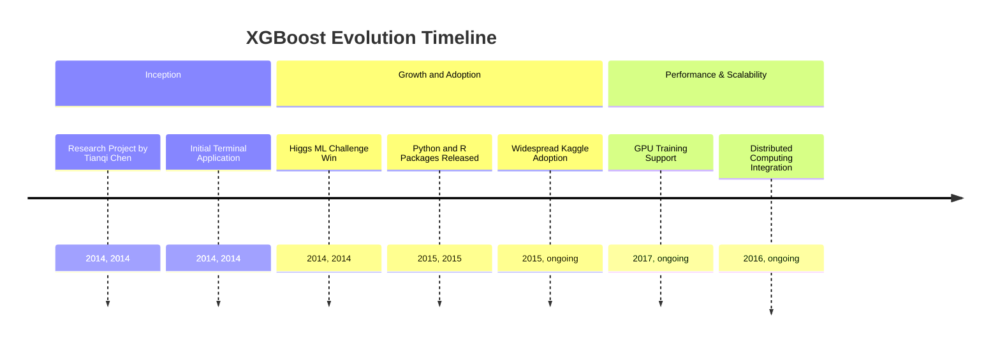
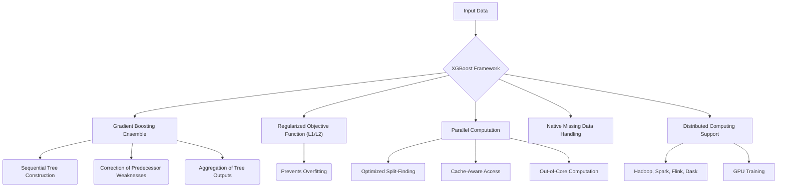
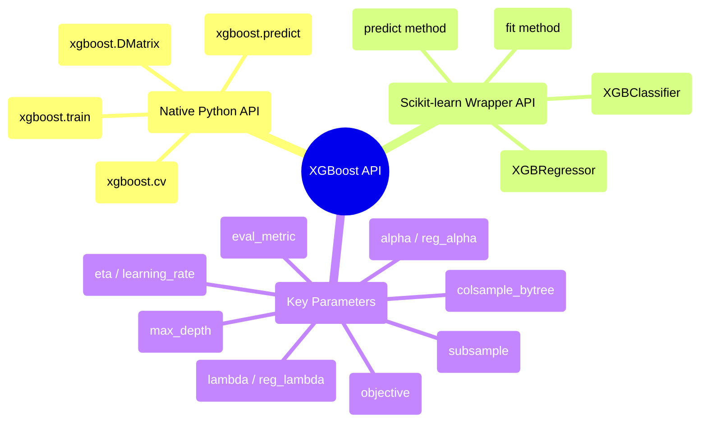

## XGBoost Evolution Document

### 1. Introduction and Historical Context

XGBoost (eXtreme Gradient Boosting) is an open-source software library that provides a regularizing gradient boosting framework. It is renowned for its efficiency, flexibility, and portability, and has become a cornerstone in machine learning due to its exceptional performance in various data science competitions, particularly on structured data.

XGBoost originated as a research project by Tianqi Chen in 2014, as part of the Distributed (Deep) Machine Learning Community (DMLC) group at the University of Washington. Initially, it was a standalone terminal application. Its prominence surged after being used in the winning solution of the Higgs Machine Learning Challenge. Following this, Python and R packages were developed, and XGBoost now boasts implementations across multiple languages, significantly contributing to its widespread adoption, especially within the Kaggle community.

### 1.1. XGBoost Evolution Timeline

### 2. Core Architecture

XGBoost is built upon the algorithmic foundation of gradient boosting, an ensemble method that sequentially constructs multiple decision trees. Each new tree aims to correct the weaknesses of its predecessors, and the final prediction is an aggregation of the outputs from all individual trees. XGBoost introduces several key architectural improvements over standard Gradient Boosting Machines (GBMs) to enhance performance and generalization.

#### 2.1. Regularized Objective Function

A distinguishing feature of XGBoost is its incorporation of regularization (L1 and L2) directly into its objective function. This helps to prevent overfitting and improves the model's ability to generalize to unseen data, leading to more robust models.

#### 2.2. Parallelization and Optimized Split-Finding

While gradient boosting is inherently sequential, XGBoost integrates parallel computation to significantly accelerate the tree building process. It employs an approximate split-finding algorithm to efficiently determine the best split points in trees, especially for large datasets. This method proposes a limited set of candidate split points based on feature quantiles, further refined by the Weighted Quantile Sketch algorithm.

#### 2.3. Handling Missing Data

XGBoost is designed to natively manage missing values. The algorithm adapts its optimization process to treat missing values as a special case, learning the best direction for missing values to go during tree construction, rather than requiring explicit imputation.

#### 2.4. Cache-Aware Access and Out-of-Core Computation

To optimize data access and minimize cache misses, XGBoost organizes data into "blocks" in memory and pre-fetches data into the CPU cache. For datasets that exceed available RAM, it supports **out-of-core computation**, processing data in chunks from disk, utilizing data compression and sharding for optimized disk I/O. This enables training on massive datasets on a single machine.

#### 2.5. System-Level Optimizations

XGBoost is engineered for high performance and scalability. It supports distributed computing frameworks like Apache Hadoop, Apache Spark, Apache Flink, and Dask, and offers GPU training capabilities, making it suitable for large-scale machine learning tasks.

**Mermaid Diagram: XGBoost Core Architecture**

### 3. Detailed API Overview

XGBoost provides flexible interfaces, with its Python API being the most commonly used.

#### 3.1. Native Python API

This API offers the greatest flexibility and control.

*   **`xgboost.DMatrix(data, label=None, ...)`**: The core data structure for XGBoost. It is an optimized internal data container that handles various input formats (NumPy arrays, SciPy sparse matrices, Pandas DataFrames).
*   **`xgboost.train(params, dtrain, num_boost_round, ...)`**: Trains a boosting model. `params` is a dictionary of hyperparameters.
*   **`xgboost.predict(data)`**: Predicts with a trained booster.
*   **`xgboost.cv(params, dtrain, num_boost_round, ...)`**: Performs cross-validation.

#### 3.2. Scikit-learn Wrapper API

For users familiar with Scikit-learn, XGBoost provides compatible wrapper classes.

*   **`xgboost.XGBClassifier(objective='binary:logistic', ...)`**: Scikit-learn API compatible classifier.
*   **`xgboost.XGBRegressor(objective='reg:squarederror', ...)`**: Scikit-learn API compatible regressor.
*   **`fit(X, y, ...)`**: Trains the model (consistent with Scikit-learn).
*   **`predict(X)`**: Makes predictions (consistent with Scikit-learn).

#### 3.3. Key Parameters (Common to both APIs)

*   **`objective`**: Defines the learning task and the corresponding learning objective (e.g., `'reg:squarederror'` for regression, `'binary:logistic'` for binary classification).
*   **`eval_metric`**: The metric used for validation data (e.g., `'rmse'`, `'logloss'`, `'auc'`).
*   **`eta` (learning_rate)**: Step size shrinkage used in update to prevent overfitting.
*   **`max_depth`**: Maximum depth of a tree.
*   **`subsample`**: Subsample ratio of the training instance.
*   **`colsample_bytree`**: Subsample ratio of columns when constructing each tree.
*   **`lambda` (reg_lambda)**: L2 regularization term on weights.
*   **`alpha` (reg_alpha)**: L1 regularization term on weights.

### 3.4. API Mindmap

### 4. Evolution and Impact

*   **Dominance in Tabular Data:** XGBoost has become a dominant algorithm for structured/tabular data, consistently achieving state-of-the-art results in machine learning competitions and real-world applications.
*   **Performance and Scalability:** Its focus on system-level optimizations, parallelization, and out-of-core computation has made it incredibly fast and capable of handling very large datasets, which was a significant advancement for gradient boosting.
*   **Robustness and Generalization:** The built-in regularization and native handling of missing data contribute to its robustness and ability to generalize well to unseen data, reducing the risk of overfitting.
*   **Community and Ecosystem:** XGBoost has a thriving community and is integrated into various data science workflows and platforms, including cloud-based machine learning services.
*   **Multi-Language Support:** Its availability across multiple programming languages has broadened its reach and impact, making it accessible to a diverse range of developers.

### 5. Conclusion

XGBoost has revolutionized the field of gradient boosting, transforming it into a highly efficient, scalable, and robust machine learning algorithm. Its innovative architectural improvements, coupled with a flexible API and strong community support, have cemented its position as a go-to tool for high-performance predictive modeling, particularly for structured data. The continuous development and optimization ensure XGBoost remains a leading choice for tackling complex machine learning challenges.
