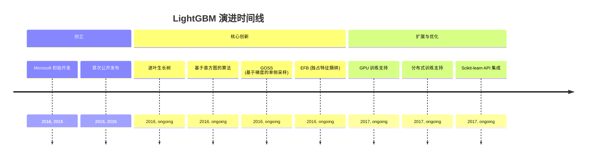
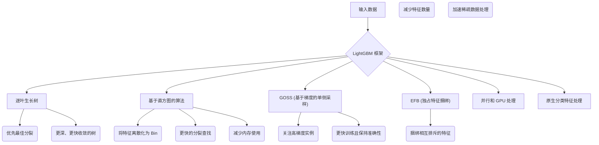
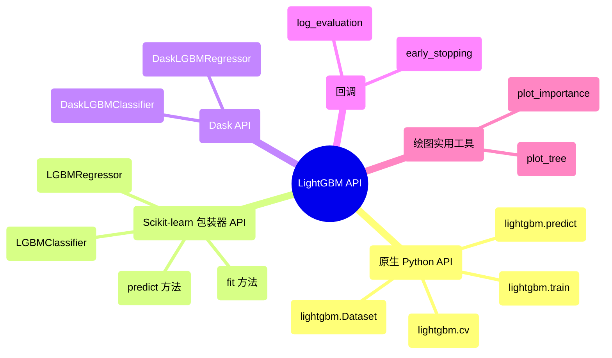

## LightGBM 演进文档

### 1. 引言与历史背景

LightGBM (Light Gradient Boosting Machine) 是由 Microsoft 开发的开源、高性能梯度提升框架。与传统的梯度提升框架（如 XGBoost 和 GBDT）相比，它旨在实现更快的训练速度、更高的效率以及更好的大型数据集可扩展性。LightGBM 已成为各种机器学习任务的热门选择，尤其是在处理大规模数据和需要快速模型训练时。

LightGBM 的创建是为了解决 2010 年代初期现有梯度提升框架的计算限制。其开发重点是引入创新技术来优化树构建过程、减少内存消耗并增强并行化。这些进步使 LightGBM 成为许多数据科学家和机器学习工程师寻求高效且可扩展的梯度提升模型的首选解决方案。

### 1.1. LightGBM 演进时间线

### 2. 核心架构

LightGBM 的效率和速度源于几项创新性架构选择，这些选择优化了梯度提升过程。

#### 2.1. 逐叶生长树

与传统算法按层级（水平）生长树不同，LightGBM 采用**逐叶生长**（或最佳优先）的树生长策略。它优先分裂那些能最大程度减少损失函数的叶子。这种方法通常会产生更深、更复杂的树，这些树可以更快地收敛并以更少的迭代次数实现更高的准确性。虽然这有时可能会在较小的数据集上导致过拟合，但会应用正则化方法来抵消这种情况。

#### 2.2. 基于直方图的算法

为了显著减少内存使用并加速训练，LightGBM 利用**基于直方图的算法**。它不是预先排序连续特征值，而是将它们转换为离散的 bin，形成直方图。这使得在树构建过程中寻找最佳分裂点变得更快，因为它只需要遍历 bin 而不是所有可能的分裂点。

#### 2.3. 基于梯度的单侧采样 (GOSS)

**GOSS** 是一种新颖的采样技术，解决了梯度较小的数据实例过多（对学习过程贡献不大）的问题。GOSS 专注于梯度较大的数据实例（即误差较高的实例），同时从梯度较小的实例中随机采样。这可以通过减少数据样本数量来加速训练，而不会显著影响准确性。

#### 2.4. 独占特征捆绑 (EFB)

**EFB** 是一种有效处理高维稀疏数据的方法。它将相互排斥的特征（很少同时取非零值的特征）捆绑到一个特征中。通过减少有效特征数量，EFB 显著加快了计算速度，特别是对于具有许多稀疏特征的数据集。

#### 2.5. 并行和 GPU 处理

LightGBM 旨在利用并行和分布式计算能力。它支持多核 CPU 和 GPU，使其能够高效地扩展到大型数据集和复杂的机器学习任务。这可以缩短强大硬件和分布式环境上的训练时间。

#### 2.6. 分类特征的高效处理

LightGBM 提供对分类特征的原生支持，无需进行独热编码。它使用专门的技术来查找分类特征的最佳分区，这比传统的独热编码更高效和有效，特别是对于高基数分类变量。

**Mermaid 图：LightGBM 核心架构**

### 3. 详细 API 概述

LightGBM 提供了灵活的 API，主要在 Python 中，并为各种用户偏好提供了接口。

#### 3.1. 原生 Python API

此 API 提供对训练过程的细粒度控制。

*   **`lightgbm.Dataset(data, label=None, ...)`**: LightGBM 的核心数据结构。它是一个优化的内部数据容器，可处理各种输入格式。
*   **`lightgbm.train(params, train_set, num_boost_round, ...)`**: 训练一个提升模型。`params` 是一个超参数字典。
*   **`lightgbm.predict(booster, data, ...)`**: 使用训练好的提升器进行预测。
*   **`lightgbm.cv(params, train_set, num_boost_round, ...)`**: 执行交叉验证。

#### 3.2. Scikit-learn 包装器 API

对于熟悉 Scikit-learn 的用户，LightGBM 提供了兼容的包装器类。

*   **`lightgbm.LGBMClassifier(objective='binary', ...)`**: 与 Scikit-learn API 兼容的分类器。
*   **`lightgbm.LGBMRegressor(objective='regression', ...)`**: 与 Scikit-learn API 兼容的回归器。
*   **`fit(X, y, ...)`**: 训练模型（与 Scikit-learn 一致）。
*   **`predict(X)`**: 进行预测（与 Scikit-learn 一致）。

#### 3.3. Dask API

对于大型数据集上的分布式学习，LightGBM 提供了 Dask 兼容的 Estimator。

*   **`lightgbm.DaskLGBMClassifier(...)`**: Dask 兼容的分类器。
*   **`lightgbm.DaskLGBMRegressor(...)`**: Dask 兼容的回归器。

#### 3.4. 回调

*   **`lightgbm.early_stopping(stopping_rounds, verbose=True)`**: 如果验证指标在 `stopping_rounds` 内没有改善，则停止训练。
*   **`lightgbm.log_evaluation(period=1, show_stdv=True)`**: 在训练期间记录评估结果。

#### 3.5. 绘图实用工具

*   **`lightgbm.plot_importance(booster, ...)`**: 绘制特征重要性。
*   **`lightgbm.plot_tree(booster, tree_index=0, ...)`**: 绘制单个决策树。

### 3.6. API 思维导图

### 4. 演变与影响

*   **速度与效率:** LightGBM 的核心创新（逐叶生长、基于直方图的算法、GOSS、EFB）使其成为最快、最有效的梯度提升框架之一，显著缩短了大型数据集的训练时间。
*   **可扩展性:** 它对并行和分布式计算（包括 GPU 训练）的支持使其能够有效地扩展到海量数据集和复杂的机器学习问题。
*   **处理多样化数据:** 对稀疏和分类特征的高效处理，无需进行大量预处理，使其适用于各种实际数据集。
*   **竞争性性能:** LightGBM 始终提供具有竞争力的预测性能，通常与甚至超越其他梯度提升实现，使其成为机器学习竞赛和行业应用中的热门选择。
*   **易用性:** 与 Scikit-learn 兼容的 API 和 Dask 集成使用户可以轻松地将 LightGBM 集成到现有的机器学习工作流中。

### 5. 结论

LightGBM 已成为一个强大且高效的梯度提升框架，突破了基于树模型的能力极限。其专注于速度、内存效率和可扩展性的架构创新，使其成为处理大型复杂数据集的数据科学家和机器学习工程师不可或缺的工具。持续的开发和强大的社区支持确保 LightGBM 仍然是高性能预测建模的领先选择，为机器学习应用的进步做出了重大贡献。
