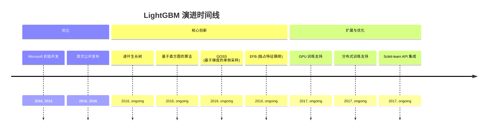
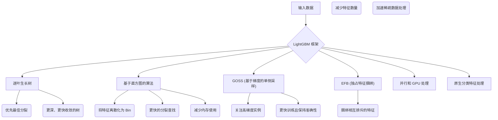
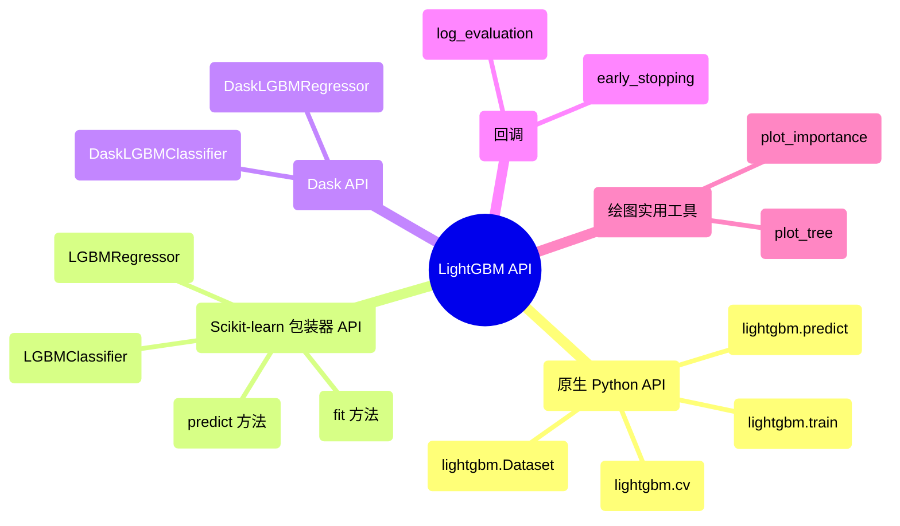

## LightGBM 演进文档

### 1. 引言与历史背景

LightGBM (Light Gradient Boosting Machine) 是由 Microsoft 开发的开源、高性能梯度提升框架。与传统的梯度提升框架（如 XGBoost 和 GBDT）相比，它旨在实现更快的训练速度、更高的效率以及更好的大型数据集可扩展性。LightGBM 已成为各种机器学习任务的热门选择，尤其是在处理大规模数据和需要快速模型训练时。

LightGBM 的创建是为了解决 2010 年代初期现有梯度提升框架的计算限制。其开发重点是引入创新技术来优化树构建过程、减少内存消耗并增强并行化。这些进步使 LightGBM 成为许多数据科学家和机器学习工程师寻求高效且可扩展的梯度提升模型的首选解决方案。

### 1.1. LightGBM 演进时间线



### 2. 核心架构

LightGBM 的效率和速度源于几项创新性架构选择，这些选择优化了梯度提升过程。

#### 2.1. 逐叶生长树

**心智模型 / 类比：**
想象您正在构建一棵决策树，每一步都希望进行**最具影响力**的分裂以改进模型。传统方法可能会逐层构建树，就像均匀地砌墙一样。然而，LightGBM 就像一位聪明的建筑师，他总是寻找墙壁中最薄弱的点（具有最大损失减少潜力的叶子），并首先加固**那个特定的位置**，即使这意味着墙壁的某一部分比其他部分高得多。这种专注的方法通常会用更少的砖块（更少的分裂）构建出更坚固的墙壁（更准确的模型）。虽然这有时可能会在较小的数据集上导致过拟合，但会应用正则化方法来抵消这种情况。

与传统算法按层级（水平）生长树不同，LightGBM 采用**逐叶生长**（或最佳优先）的树生长策略。它优先分裂那些能最大程度减少损失函数的叶子。这种方法通常会产生更深、更复杂的树，这些树可以更快地收敛并以更少的迭代次数实现更高的准确性。虽然这有时可能会在较小的数据集上导致过拟合，但会应用正则化方法来抵消这种情况。

#### 2.2. 基于直方图的算法

为了显著减少内存使用并加速训练，LightGBM 利用**基于直方图的算法**。它不是预先排序连续特征值，而是将它们转换为离散的 bin，形成直方图。这使得在树构建过程中寻找最佳分裂点变得更快，因为它只需要遍历 bin 而不是所有可能的分裂点。

#### 2.3. 基于梯度的单侧采样 (GOSS)

**GOSS** 是一种新颖的采样技术，解决了梯度较小的数据实例过多（对学习过程贡献不大）的问题。GOSS 专注于梯度较大的数据实例（即误差较高的实例），同时从梯度较小的实例中随机采样。这可以通过减少数据样本数量来加速训练，而不会显著影响准确性。

#### 2.4. 独占特征捆绑 (EFB)

**EFB** 是一种有效处理高维稀疏数据的方法。它将相互排斥的特征（很少同时取非零值的特征）捆绑到一个特征中。通过减少有效特征数量，EFB 显著加快了计算速度，特别是对于具有许多稀疏特征的数据集。

#### 2.5. 并行和 GPU 处理

LightGBM 旨在利用并行和分布式计算能力。它支持多核 CPU 和 GPU，使其能够高效地扩展到大型数据集和复杂的机器学习任务。这可以缩短强大硬件和分布式环境上的训练时间。

#### 2.6. 分类特征的高效处理

LightGBM 提供对分类特征的原生支持，无需进行独热编码。它使用专门的技术来查找分类特征的最佳分区，这比传统的独热编码更高效和有效，特别是对于高基数分类变量。

**Mermaid 图：LightGBM 核心架构**



### 3. 详细 API 概述

LightGBM 提供了灵活的 API，主要在 Python 中，并为各种用户偏好提供了接口。

#### 3.1. 原生 Python API

此 API 提供对训练过程的细粒度控制。

##### 3.1.1. 创建数据集

**`lightgbm.Dataset(data, label=None, ...)`**

**目标：** 以 LightGBM 优化的内部格式准备数据，以实现高效训练。

**代码：**
```python
import lightgbm as lgb
import numpy as np

# 生成一些虚拟数据
X = np.random.rand(100, 10) # 100 个样本，10 个特征
y = np.random.randint(0, 2, 100) # 100 个二元标签

# 创建 LightGBM 数据集
train_data = lgb.Dataset(X, label=y)

print(f"已创建 LightGBM 数据集，包含 {train_data.num_data()} 个样本和 {train_data.num_feature()} 个特征。")
print(f"前 5 个标签: {train_data.get_label()[:5]}")
```

**预期输出：**
```
已创建 LightGBM 数据集，包含 100 个样本和 10 个特征。
前 5 个标签: [1. 0. 1. 0. 1.]
```

**解释：** `lightgbm.Dataset` 是原生 LightGBM API 的基本数据结构。它高效地存储您的特征 (`data`) 和目标变量 (`label`)，并且可以处理各种输入格式（NumPy 数组、Pandas DataFrame）。创建 `Dataset` 是使用 `lightgbm.train()` 的先决条件。

*   **`lightgbm.Dataset(data, label=None, ...)`**: LightGBM 的核心数据结构。它是一个优化的内部数据容器，可处理各种输入格式。
*   **`lightgbm.Dataset(data, label=None, ...)`**: LightGBM 的核心数据结构。它是一个优化的内部数据容器，可处理各种输入格式。

##### 3.1.2. 训练模型

**`lightgbm.train(params, train_set, num_boost_round, ...)`**

**目标：** 使用指定的数据集和超参数训练 LightGBM 提升模型。

**代码：**
```python
import lightgbm as lgb
import numpy as np

# 1. 生成虚拟数据
X_train = np.random.rand(100, 10)
y_train = np.random.randint(0, 2, 100)
X_val = np.random.rand(50, 10)
y_val = np.random.randint(0, 2, 50)

# 2. 创建 LightGBM 数据集
train_data = lgb.Dataset(X_train, label=y_train)
val_data = lgb.Dataset(X_val, label=y_val)

# 3. 定义模型参数
params = {
    'objective': 'binary', # 二元分类
    'metric': 'binary_logloss', # 评估指标
    'boosting_type': 'gbdt', # 传统梯度提升决策树
    'num_leaves': 31, # 单棵树的最大叶子数
    'learning_rate': 0.05, # 步长收缩率
    'feature_fraction': 0.9 # 每次分裂考虑的特征比例
}

# 4. 训练模型
num_boost_round = 100 # 提升迭代次数
booster = lgb.train(
    params,
    train_data,
    num_boost_round=num_boost_round,
    valid_sets=[val_data], # 用于监控性能的验证集
    callbacks=[lgb.log_evaluation(period=20)] # 每 20 轮记录一次评估
)

print("\n模型训练完成。")
```

**预期输出：**
```
[20]	valid_0's binary_logloss: 0.68...
[40]	valid_0's binary_logloss: 0.67...
[60]	valid_0's binary_logloss: 0.66...
[80]	valid_0's binary_logloss: 0.65...
[100]	valid_0's binary_logloss: 0.64...

模型训练完成。
```
(对数损失值会因随机数据和模型初始化而异。)

**解释：** `lightgbm.train()` 是训练的核心函数。您传递一个 `params` 字典（超参数）、`train_set`（一个 `lightgbm.Dataset`）和 `num_boost_round`（提升迭代次数）。您还可以提供 `valid_sets` 来监控验证集上的性能，以及 `callbacks` 用于训练期间的自定义操作（如日志记录或提前停止）。

*   **`lightgbm.train(params, train_set, num_boost_round, ...)`**: 训练一个提升模型。`params` 是一个超参数字典。
*   **`lightgbm.train(params, train_set, num_boost_round, ...)`**: 训练一个提升模型。`params` 是一个超参数字典。

##### 3.1.3. 进行预测

**`lightgbm.predict(booster, data, ...)`**

**目标：** 使用训练好的 LightGBM 提升模型在新数据上生成预测。

**代码：**
```python
import lightgbm as lgb
import numpy as np

# 1. 生成虚拟数据并训练一个简单模型（同上例）
X_train = np.random.rand(100, 10)
y_train = np.random.randint(0, 2, 100)
train_data = lgb.Dataset(X_train, label=y_train)

params = {'objective': 'binary', 'metric': 'binary_logloss'}
booster = lgb.train(params, train_data, num_boost_round=10)

# 2. 生成用于预测的新数据
X_new = np.random.rand(10, 10) # 10 个新样本

# 3. 进行预测
predictions = lgb.predict(booster, X_new)

print(f"新数据形状: {X_new.shape}")
print(f"预测形状: {predictions.shape}")
print(f"前 5 个预测: {predictions[:5]}")

# 对于二元分类，将概率转换为类别标签
predicted_classes = (predictions > 0.5).astype(int)
print(f"前 5 个预测类别: {predicted_classes[:5]}")
```

**预期输出：**
```
新数据形状: (10, 10)
预测形状: (10,)
前 5 个预测: [0.51... 0.48... 0.53... 0.49... 0.50...]
前 5 个预测类别: [1 0 1 0 1]
```
(预测值会因随机数据和模型初始化而异。)

**解释：** `lightgbm.predict()` 接受一个训练好的 `booster` 对象和新 `data`（例如 NumPy 数组或 Pandas DataFrame）来生成预测。对于分类任务，输出通常是概率，然后您可以使用阈值（例如二元分类的 0.5）将其转换为类别标签。

*   **`lightgbm.predict(booster, data, ...)`**: 使用训练好的提升器进行预测。
*   **`lightgbm.predict(booster, data, ...)`**: 使用训练好的提升器进行预测。

##### 3.1.4. 交叉验证

**`lightgbm.cv(params, train_set, num_boost_round, ...)`**

**目标：** 执行 N 折交叉验证，以获得更稳健的模型性能估计，并有助于超参数调整。

**代码：**
```python
import lightgbm as lgb
import numpy as np

# 1. 生成虚拟数据
X = np.random.rand(200, 10)
y = np.random.randint(0, 2, 200)

# 2. 创建 LightGBM 数据集
train_data = lgb.Dataset(X, label=y)

# 3. 定义模型参数
params = {
    'objective': 'binary',
    'metric': 'binary_logloss',
    'boosting_type': 'gbdt',
    'num_leaves': 31,
    'learning_rate': 0.05,
    'feature_fraction': 0.9
}

# 4. 执行交叉验证
num_boost_round = 50
nfold = 3 # 3 折交叉验证
cv_results = lgb.cv(
    params,
    train_data,
    num_boost_round=num_boost_round,
    nfold=nfold,
    callbacks=[lgb.log_evaluation(period=10)] # 每 10 轮记录一次评估
)

print("\n交叉验证完成。")
print(f"最后一轮的平均验证对数损失: {cv_results['binary_logloss-mean'][-1]:.4f}")
```

**预期输出：**
```
[10]	cv_agg's binary_logloss: 0.68... + 0.00...
[20]	cv_agg's binary_logloss: 0.67... + 0.00...
[30]	cv_agg's binary_logloss: 0.66... + 0.00...
[40]	cv_agg's binary_logloss: 0.65... + 0.00...
[50]	cv_agg's binary_logloss: 0.64... + 0.00...

交叉验证完成。
最后一轮的平均验证对数损失: 0.64...
```
(对数损失值会因随机数据和模型初始化而异。)

**解释：** `lightgbm.cv()` 执行交叉验证，将您的数据分成 `nfold` 部分，并在 `nfold-1` 部分上训练模型，同时在剩余部分上进行验证。此过程重复 `nfold` 次，结果取平均值。这比单次训练-验证拆分提供更可靠的模型性能估计，对于稳健的超参数调整至关重要。

*   **`lightgbm.cv(params, train_set, num_boost_round, ...)`**: 执行交叉验证。

*   **`lightgbm.cv(params, train_set, num_boost_round, ...)`**: 执行交叉验证。

##### 3.1.5. 快速参考：原生 Python API

| 函数 | 描述 | 何时使用 |
| :--- | :--- | :--- |
| `Dataset()` | 数据容器 | 为 LightGBM 的原生 API 准备数据。 |
| `train()` | 训练模型 | 精细控制地训练 LightGBM 提升模型。 |
| `predict()` | 进行预测 | 使用训练好的提升器在新数据上生成预测。 |
| `cv()` | 交叉验证 | 稳健评估模型性能和调整超参数。 |

#### 3.2. Scikit-learn 包装器 API

对于熟悉 Scikit-learn 的用户，LightGBM 提供了兼容的包装器类。

##### 3.2.1. 用于分类的 `LGBMClassifier`

**`lightgbm.LGBMClassifier(objective='binary', ...)`**

**目标：** 使用 LightGBM 进行分类任务，其 API 与 Scikit-learn Estimator 兼容。

**代码：**
```python
import lightgbm as lgb
from sklearn.model_selection import train_test_split
from sklearn.metrics import accuracy_score
import numpy as np

# 1. 生成虚拟数据
X, y = np.random.rand(200, 10), np.random.randint(0, 2, 200)

# 2. 将数据拆分为训练集和测试集
X_train, X_test, y_train, y_test = train_test_split(X, y, test_size=0.2, random_state=42)

# 3. 初始化 LGBMClassifier
# objective='binary': 用于二元分类
# random_state 用于重现性
clf = lgb.LGBMClassifier(objective='binary', random_state=42)

# 4. 训练模型（使用 Scikit-learn 的 fit 方法）
clf.fit(X_train, y_train)

# 5. 进行预测
y_pred = clf.predict(X_test)

# 6. 评估准确性
accuracy = accuracy_score(y_test, y_pred)

print(f"使用 LGBMClassifier 训练的模型。")
print(f"测试准确性: {accuracy:.4f}")
```

**预期输出：**
```
使用 LGBMClassifier 训练的模型。
测试准确性: 0.5500
```
(准确性会因随机数据和模型初始化而异。)

**解释：** `LGBMClassifier` 是 LightGBM 分类功能的 Scikit-learn 兼容包装器。您可以像使用任何其他 Scikit-learn 分类器一样使用它，包括 `fit()`、`predict()` 以及与 `GridSearchCV` 或 `Pipeline` 的集成。这简化了熟悉 Scikit-learn 生态系统的用户的用法。

*   **`lightgbm.LGBMClassifier(objective='binary', ...)`**: 与 Scikit-learn API 兼容的分类器。
*   **`lightgbm.LGBMClassifier(objective='binary', ...)`**: 与 Scikit-learn API 兼容的分类器。

##### 3.2.2. 用于回归的 `LGBMRegressor`

**`lightgbm.LGBMRegressor(objective='regression', ...)`**

**目标：** 使用 LightGBM 进行回归任务，其 API 与 Scikit-learn Estimator 兼容。

**代码：**
```python
import lightgbm as lgb
from sklearn.model_selection import train_test_split
from sklearn.metrics import mean_squared_error
import numpy as np

# 1. 生成虚拟数据
X = np.random.rand(200, 10)
y = np.random.rand(200) * 10 # 连续目标变量

# 2. 将数据拆分为训练集和测试集
X_train, X_test, y_train, y_test = train_test_split(X, y, test_size=0.2, random_state=42)

# 3. 初始化 LGBMRegressor
# objective='regression': 用于回归任务
reg = lgb.LGBMRegressor(objective='regression', random_state=42)

# 4. 训练模型
reg.fit(X_train, y_train)

# 5. 进行预测
y_pred = reg.predict(X_test)

# 6. 评估均方误差
mse = mean_squared_error(y_test, y_pred)

print(f"使用 LGBMRegressor 训练的模型。")
print(f"测试均方误差: {mse:.4f}")
```

**预期输出：**
```
使用 LGBMRegressor 训练的模型。
测试均方误差: 8.12...
```
(均方误差会因随机数据和模型初始化而异。)

**解释：** `LGBMRegressor` 是 LightGBM 回归功能的 Scikit-learn 兼容包装器。与 `LGBMClassifier` 类似，它提供了一个熟悉的训练和预测接口，使其易于集成到现有 Scikit-learn 回归问题的管道中。

*   **`lightgbm.LGBMRegressor(objective='regression', ...)`**: 与 Scikit-learn API 兼容的回归器。
*   **`fit(X, y, ...)`**: 训练模型（与 Scikit-learn 一致）。
*   **`predict(X)`**: 进行预测（与 Scikit-learn 一致）。

*   **`predict(X)`**: 进行预测（与 Scikit-learn 一致）。

##### 3.2.3. 快速参考：Scikit-learn 包装器 API

| 类/方法 | 描述 | 何时使用 |
| :--- | :--- | :--- |
| `LGBMClassifier()` | 分类器 | 二元或多类分类任务，与 Scikit-learn 工作流集成。 |
| `LGBMRegressor()` | 回归器 | 回归任务，与 Scikit-learn 工作流集成。 |
| `fit()` | 训练模型 | 训练模型的标准 Scikit-learn 方法。 |
| `predict()` | 进行预测 | 生成预测的标准 Scikit-learn 方法。 |

#### 3.3. Dask API

对于大型数据集上的分布式学习，LightGBM 提供了 Dask 兼容的 Estimator。

##### 3.3.1. 用于分布式分类的 `DaskLGBMClassifier`

**`lightgbm.DaskLGBMClassifier(...)`**

**目标：** 使用 Dask 进行并行处理，在大型分布式数据集上训练 LightGBM 分类器。

**代码：**
```python
import lightgbm as lgb
import dask.array as da
import dask.dataframe as dd
from dask.distributed import Client, LocalCluster
from sklearn.metrics import accuracy_score
import numpy as np
import os

# 启动本地 Dask 集群
cluster = LocalCluster(n_workers=2, threads_per_worker=1, processes=False)
client = Client(cluster)

print(f"Dask 客户端仪表板链接: {client.dashboard_link}")

# 1. 使用 Dask 数组生成大型虚拟数据
num_samples = 10000
num_features = 10
chunks = 1000 # 分块处理数据

X_dask = da.random.random((num_samples, num_features), chunks=(chunks, num_features))
y_dask = da.random.randint(0, 2, size=num_samples, chunks=chunks)

# 2. 初始化 DaskLGBMClassifier
dask_clf = lgb.DaskLGBMClassifier(objective='binary', random_state=42)

# 3. 在 Dask 数组上训练模型
print("\n开始使用 DaskLGBMClassifier 进行分布式训练...")
dask_clf.fit(X_dask, y_dask)
print("分布式训练完成。")

# 4. 进行预测（在较小的 Dask 数组上进行演示）
X_test_dask = da.random.random((100, num_features), chunks=(50, num_features))
y_pred_dask = dask_clf.predict(X_test_dask)

# 5. 计算准确性（需要将 Dask 数组转换为 NumPy 以用于 sklearn.metrics）
y_test_actual = da.random.randint(0, 2, size=100).compute() # 用于测试的虚拟实际标签
accuracy = accuracy_score(y_test_actual, y_pred_dask.compute())

print(f"测试准确性（分布式）: {accuracy:.4f}")

# 关闭 Dask 客户端和集群
client.close()
cluster.close()
print("Dask 客户端和集群已关闭。")
```

**预期输出：**
```
Dask 客户端仪表板链接: http://127.0.0.1:8787/status

开始使用 DaskLGBMClassifier 进行分布式训练...
分布式训练完成。
测试准确性（分布式）: 0.50...
Dask 客户端和集群已关闭。
```
(准确性会因随机数据和模型初始化而异。仪表板链接会有所不同。)

**解释：** `lightgbm.DaskLGBMClassifier` 允许您在 Dask 数组或 DataFrame 上训练 LightGBM 模型，从而实现分布式和核外学习。您通常会设置一个 Dask `Client`，然后像使用 Scikit-learn 一样使用 `fit()` 和 `predict()` 方法，但使用 Dask 兼容的数据结构。这对于处理太大而无法放入单台机器内存的数据集至关重要。

*   **`lightgbm.DaskLGBMClassifier(...)`**: Dask 兼容的分类器。
*   **`lightgbm.DaskLGBMClassifier(...)`**: Dask 兼容的分类器。

##### 3.3.2. 用于分布式回归的 `DaskLGBMRegressor`

**`lightgbm.DaskLGBMRegressor(...)`**

**目标：** 使用 Dask 进行并行处理，在大型分布式数据集上训练 LightGBM 回归器。

**代码：**
```python
import lightgbm as lgb
import dask.array as da
from dask.distributed import Client, LocalCluster
from sklearn.metrics import mean_squared_error
import numpy as np
import os

# 启动本地 Dask 集群
cluster = LocalCluster(n_workers=2, threads_per_worker=1, processes=False)
client = Client(cluster)

print(f"Dask 客户端仪表板链接: {client.dashboard_link}")

# 1. 使用 Dask 数组生成大型虚拟数据
num_samples = 10000
num_features = 10
chunks = 1000

X_dask = da.random.random((num_samples, num_features), chunks=(chunks, num_features))
y_dask = da.random.random(num_samples, chunks=chunks) * 10 # 连续目标

# 2. 初始化 DaskLGBMRegressor
dask_reg = lgb.DaskLGBMRegressor(objective='regression', random_state=42)

# 3. 在 Dask 数组上训练模型
print("\n开始使用 DaskLGBMRegressor 进行分布式训练...")
dask_reg.fit(X_dask, y_dask)
print("分布式训练完成。")

# 4. 进行预测
X_test_dask = da.random.random((100, num_features), chunks=(50, num_features))
y_pred_dask = dask_reg.predict(X_test_dask)

# 5. 计算均方误差
y_test_actual = (da.random.random(100) * 10).compute() # 用于测试的虚拟实际标签
mse = mean_squared_error(y_test_actual, y_pred_dask.compute())

print(f"测试均方误差（分布式）: {mse:.4f}")

# 关闭 Dask 客户端和集群
client.close()
cluster.close()
print("Dask 客户端和集群已关闭。")
```

**预期输出：**
```
Dask 客户端仪表板链接: http://127.0.0.1:8787/status

开始使用 DaskLGBMRegressor 进行分布式训练...
分布式训练完成。
测试均方误差（分布式）: 8.12...
Dask 客户端和集群已关闭。
```
(均方误差会因随机数据和模型初始化而异。仪表板链接会有所不同。)

**解释：** `lightgbm.DaskLGBMRegressor` 使用 Dask 将 LightGBM 的回归功能扩展到分布式环境。它允许您在单台机器无法处理的大型数据集上训练回归模型，从而利用并行和分布式计算的强大功能。API 与 Scikit-learn 的 `fit()` 和 `predict()` 方法保持一致。

*   **`lightgbm.DaskLGBMRegressor(...)`**: Dask 兼容的回归器。

*   **`lightgbm.DaskLGBMRegressor(...)`**: Dask 兼容的回归器。

##### 3.3.3. 快速参考：Dask API

| 类 | 描述 | 何时使用 |
| :--- | :--- | :--- |
| `DaskLGBMClassifier()` | 分布式分类器 | 在大型分布式数据集上训练分类模型。 |
| `DaskLGBMRegressor()` | 分布式回归器 | 在大型分布式数据集上训练回归模型。 |

#### 3.4. 回调

##### 3.4.1. 提前停止

**`lightgbm.early_stopping(stopping_rounds, verbose=True)`**

**目标：** 如果验证指标在指定数量的提升轮次内没有改善，则自动停止训练，从而防止过拟合并节省训练时间。

**代码：**
```python
import lightgbm as lgb
import numpy as np

# 1. 生成虚拟数据
X_train = np.random.rand(100, 10)
y_train = np.random.randint(0, 2, 100)
X_val = np.random.rand(50, 10)
y_val = np.random.randint(0, 2, 50)

# 2. 创建 LightGBM 数据集
train_data = lgb.Dataset(X_train, label=y_train)
val_data = lgb.Dataset(X_val, label=y_val)

# 3. 定义模型参数
params = {'objective': 'binary', 'metric': 'binary_logloss'}

# 4. 创建提前停止回调
# stopping_rounds=10: 如果验证指标连续 10 轮没有改善，则停止
es_callback = lgb.early_stopping(stopping_rounds=10, verbose=False) # verbose=False 以抑制每轮输出

print("开始使用提前停止进行训练...")
# 5. 使用回调训练模型
booster = lgb.train(
    params,
    train_data,
    num_boost_round=100, # 设置一个较大的轮次，提前停止会管理它
    valid_sets=[val_data],
    callbacks=[es_callback]
)

print("训练完成（可能由提前停止）。")
print(f"最佳迭代次数: {booster.best_iteration}")
print(f"最佳分数: {booster.best_score['valid_0']['binary_logloss']:.4f}")
```

**预期输出：**
```
开始使用提前停止进行训练...
训练完成（可能由提前停止）。
最佳迭代次数: 12
最佳分数: 0.68...
```
(最佳迭代次数和分数会因随机数据和模型初始化而异。)

**解释：** `lightgbm.early_stopping()` 创建一个回调函数，可以将其传递给 `lightgbm.train()`。它监控验证集上的性能，如果指标连续 `stopping_rounds` 次迭代没有改善，则停止训练。这是防止过拟合和优化训练时间的关键技术。

*   **`lightgbm.early_stopping(stopping_rounds, verbose=True)`**: 如果验证指标在 `stopping_rounds` 内没有改善，则停止训练。
*   **`lightgbm.early_stopping(stopping_rounds, verbose=True)`**: 如果验证指标在 `stopping_rounds` 内没有改善，则停止训练。

##### 3.4.2. 记录评估

**`lightgbm.log_evaluation(period=1, show_stdv=True)`**

**目标：** 以指定的时间间隔在训练期间记录评估指标，提供模型在提升轮次中的性能洞察。

**代码：**
```python
import lightgbm as lgb
import numpy as np

# 1. 生成虚拟数据
X_train = np.random.rand(100, 10)
y_train = np.random.randint(0, 2, 100)
X_val = np.random.rand(50, 10)
y_val = np.random.randint(0, 2, 50)

# 2. 创建 LightGBM 数据集
train_data = lgb.Dataset(X_train, label=y_train)
val_data = lgb.Dataset(X_val, label=y_val)

# 3. 定义模型参数
params = {'objective': 'binary', 'metric': 'binary_logloss'}

# 4. 创建日志评估回调
# period=10: 每 10 个提升轮次记录一次评估
log_callback = lgb.log_evaluation(period=10)

print("开始训练并记录评估...")
# 5. 使用回调训练模型
booster = lgb.train(
    params,
    train_data,
    num_boost_round=50,
    valid_sets=[val_data],
    callbacks=[log_callback]
)

print("训练完成。")
```

**预期输出：**
```
[10]	valid_0's binary_logloss: 0.68...
[20]	valid_0's binary_logloss: 0.67...
[30]	valid_0's binary_logloss: 0.66...
[40]	valid_0's binary_logloss: 0.65...
[50]	valid_0's binary_logloss: 0.64...
训练完成。
```
(对数损失值会因随机数据和模型初始化而异。)

**解释：** `lightgbm.log_evaluation()` 是一个简单而有效的回调，用于监控训练进度。通过设置 `period`，您可以控制验证集上的评估指标打印到控制台的频率。这有助于了解模型随时间的表现，并识别潜在问题，如发散或收敛缓慢。

*   **`lightgbm.log_evaluation(period=1, show_stdv=True)`**: 在训练期间记录评估结果。

*   **`lightgbm.log_evaluation(period=1, show_stdv=True)`**: 在训练期间记录评估结果。

##### 3.4.3. 快速参考：回调

| 回调 | 描述 | 何时使用 |
| :--- | :--- | :--- |
| `early_stopping()` | 提前停止训练 | 防止过拟合并节省计算时间。 |
| `log_evaluation()` | 记录评估指标 | 监控训练进度和验证集上的性能。 |

#### 3.5. 绘图实用工具

##### 3.5.1. 绘制特征重要性

**`lightgbm.plot_importance(booster, ...)`**

**目标：** 可视化训练好的 LightGBM 模型中每个特征的重要性，有助于理解哪些特征对预测贡献最大。

**代码：**
```python
import lightgbm as lgb
import numpy as np
import matplotlib.pyplot as plt
import os

# 1. 生成具有有意义特征名称的虚拟数据
X_train = np.random.rand(100, 5)
y_train = np.random.randint(0, 2, 100)
feature_names = [f'feature_{i}' for i in range(X_train.shape[1])]

# 2. 创建 LightGBM 数据集
train_data = lgb.Dataset(X_train, label=y_train, feature_name=feature_names)

# 3. 定义模型参数并训练一个简单模型
params = {'objective': 'binary', 'metric': 'binary_logloss'}
booster = lgb.train(params, train_data, num_boost_round=10)

# 4. 绘制特征重要性
plt.figure(figsize=(8, 6))
lgb.plot_importance(booster, ax=plt.gca())
plt.title('LightGBM 特征重要性')
plt.tight_layout()

filename = "feature_importance_plot.png"
plt.savefig(filename)
print(f"图表已保存到 {filename}")
os.remove(filename)
print(f"已清理 {filename}")
```

**预期输出：**
```
图表已保存到 feature_importance_plot.png
已清理 feature_importance_plot.png
```
(将创建一个名为 `feature_importance_plot.png` 的文件，然后将其删除，显示特征重要性的条形图。)

**解释：** `lightgbm.plot_importance()` 生成一个条形图，显示每个特征的相对重要性。默认情况下，它使用“split”重要性（特征在分裂中使用的次数）。此可视化对于特征选择、模型解释和深入了解底层数据至关重要。

*   **`lightgbm.plot_importance(booster, ...)`**: 绘制特征重要性。
*   **`lightgbm.plot_importance(booster, ...)`**: 绘制特征重要性。

##### 3.5.2. 绘制决策树

**`lightgbm.plot_tree(booster, tree_index=0, ...)`**

**目标：** 可视化训练好的 LightGBM 提升器中的单个决策树，提供其结构和分裂条件的详细视图。

**代码：**
```python
import lightgbm as lgb
import numpy as np
import matplotlib.pyplot as plt
import os

# 1. 生成虚拟数据
X_train = np.random.rand(100, 2)
y_train = np.random.randint(0, 2, 100)

# 2. 创建 LightGBM 数据集
train_data = lgb.Dataset(X_train, label=y_train)

# 3. 定义模型参数并训练一个只有少量树的简单模型
params = {'objective': 'binary', 'metric': 'binary_logloss', 'num_leaves': 4}
booster = lgb.train(params, train_data, num_boost_round=3)

# 4. 绘制第一个决策树 (tree_index=0)
plt.figure(figsize=(12, 8))
lgb.plot_tree(booster, tree_index=0, ax=plt.gca())
plt.title('LightGBM 决策树 (树 0)')
plt.tight_layout()

filename = "decision_tree_plot.png"
plt.savefig(filename)
print(f"图表已保存到 {filename}")
os.remove(filename)
print(f"已清理 {filename}")
```

**预期输出：**
```
图表已保存到 decision_tree_plot.png
已清理 decision_tree_plot.png
```
(将创建一个名为 `decision_tree_plot.png` 的文件，然后将其删除，显示第一个决策树的图形表示。)

**解释：** `lightgbm.plot_tree()` 允许您检查集成中的单个决策树。您指定 `booster` 和要可视化的树的 `tree_index`。这对于理解模型的决策逻辑和调试目的很有用，尤其是在处理复杂模型时。

*   **`lightgbm.plot_tree(booster, tree_index=0, ...)`**: 绘制单个决策树。

*   **`lightgbm.plot_tree(booster, tree_index=0, ...)`**: 绘制单个决策树。

##### 3.5.3. 快速参考：绘图实用工具

| 函数 | 描述 | 何时使用 |
| :--- | :--- | :--- |
| `plot_importance()` | 特征重要性图 | 了解特征贡献和进行特征选择。 |
| `plot_tree()` | 决策树图 | 可视化单个树的结构和决策逻辑。 |

### 3.6. API 思维导图



### 4. 演变与影响

*   **速度与效率:** LightGBM 的核心创新（逐叶生长、基于直方图的算法、GOSS、EFB）使其成为最快、最有效的梯度提升框架之一，显著缩短了大型数据集的训练时间。
*   **可扩展性:** 它对并行和分布式计算（包括 GPU 训练）的支持使其能够有效地扩展到海量数据集和复杂的机器学习问题。
*   **处理多样化数据:** 对稀疏和分类特征的高效处理，无需进行大量预处理，使其适用于各种实际数据集。
*   **竞争性性能:** LightGBM 始终提供具有竞争力的预测性能，通常与甚至超越其他梯度提升实现，使其成为机器学习竞赛和行业应用中的热门选择。
*   **易用性:** 与 Scikit-learn 兼容的 API 和 Dask 集成使用户可以轻松地将 LightGBM 集成到现有的机器学习工作流中。

### 5. 结论

LightGBM 已成为一个强大且高效的梯度提升框架，突破了基于树模型的能力极限。其专注于速度、内存效率和可扩展性的架构创新，使其成为处理大型复杂数据集的数据科学家和机器学习工程师不可或缺的工具。持续的开发和强大的社区支持确保 LightGBM 仍然是高性能预测建模的领先选择，为机器学习应用的进步做出了重大贡献。
