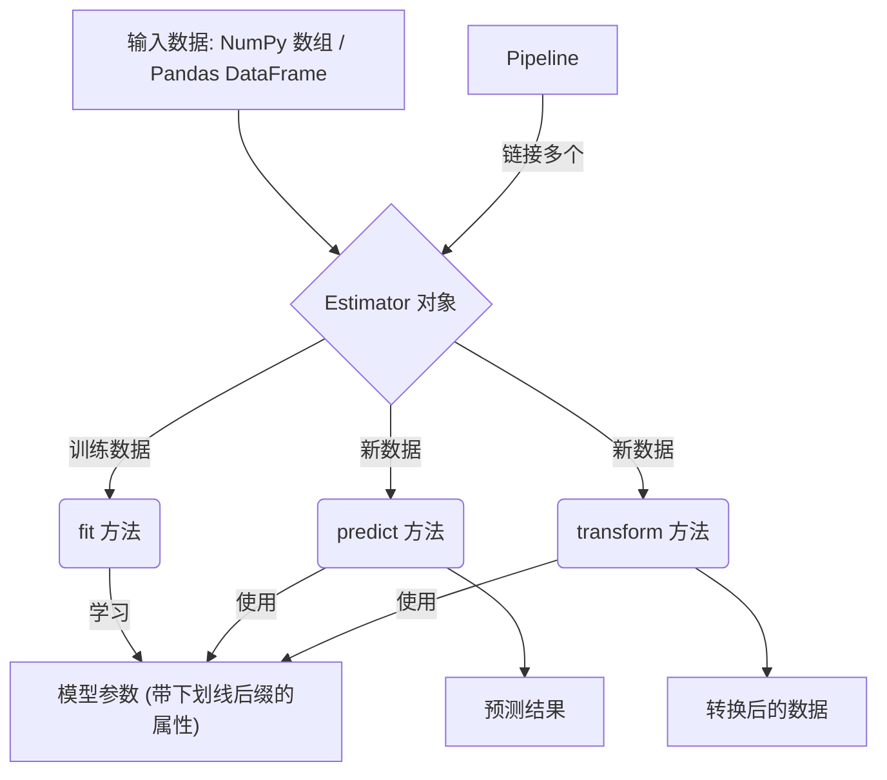
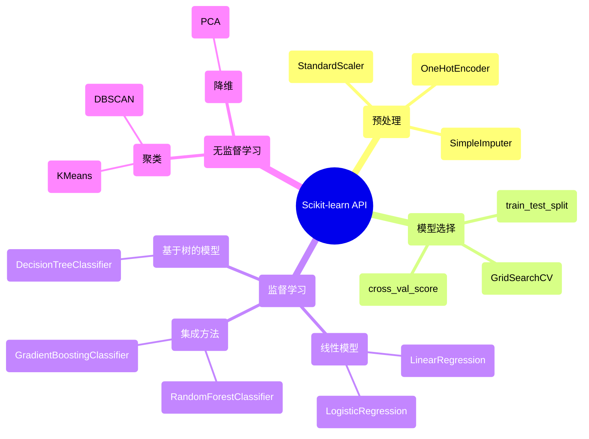

## Scikit-learn 演进文档

### 1. 引言与历史背景

Scikit-learn 是 Python 机器学习生态系统的基石，为预测性数据分析提供了一个全面且用户友好的库。它提供了广泛的分类、回归、聚类和降维算法，所有这些都可以通过一致且简单的 API 进行访问。

该项目由 David Cournapeau 于 2007 年作为 Google Summer of Code 项目发起。后来由其他开发人员在此基础上进行构建，并于 2010 年，INRIA (法国国家信息与自动化研究所) 的研究人员接手领导，发布了第一个公开版本。其主要目标是创建一个非专业人士也能使用的机器学习库，强调易用性，并建立在科学 Python 技术栈 (NumPy 和 SciPy) 之上。

### 1.1. Scikit-learn 演进时间线

### 2. 核心架构

Scikit-learn 的架构设计旨在实现一致性和易用性。它构建于 NumPy 和 SciPy 之上，并利用它们进行高度优化的数值运算。

#### 2.1. Estimator API

Scikit-learn 架构的核心是 **Estimator** 对象。每种算法，无论是用于分类、回归还是转换，都作为 Estimator 公开。这提供了一个统一的接口，包含三个关键方法：

*   **`fit(X, y)`**: 该方法用于训练 Estimator。它接收训练数据 `X` (以及监督学习的标签 `y`)，并从中学习模型参数。
*   **`predict(X)`**: 对于监督学习 Estimator，该方法对新数据 `X` 进行预测。
*   **`transform(X)`**: 对于特征工程或预处理 Estimator，该方法转换输入数据 `X`。

#### 2.2. 数据表示

Scikit-learn 期望数据以 NumPy 数组或 Pandas DataFrame 的形式存在，其中行代表样本，列代表特征。这种与核心数据科学库的无缝集成为构建端到端工作流提供了便利。

#### 2.3. 组合与 Pipelines

一个关键的架构特性是能够将多个 Estimator 组合成一个。**`Pipeline`** 对象允许您将多个转换步骤和最终的 Estimator 链接在一起。这对于创建健壮且可复现的机器学习工作流至关重要，因为它确保了对训练数据和测试数据应用相同的预处理步骤。

**Mermaid 图：Scikit-learn 核心架构**

### 3. 详细 API 概述

Scikit-learn 的 API 根据机器学习任务的类型组织成模块。

#### 3.1. 预处理 (`sklearn.preprocessing`)

该模块包括用于特征缩放、分类变量编码和缺失值插补的工具。

*   **`StandardScaler()`**: 通过移除均值和缩放到单位方差来标准化特征。
*   **`OneHotEncoder()`**: 将分类整数特征编码为独热数值数组。
*   **`SimpleImputer()`**: 用于补全缺失值的转换器。

#### 3.2. 模型选择 (`sklearn.model_selection`)

该模块提供了用于数据拆分、交叉验证和超参数调整的工具。

*   **`train_test_split(X, y, ...)`**: 将数组或矩阵拆分为随机的训练和测试子集。
*   **`GridSearchCV(estimator, param_grid, ...)`**: 对 Estimator 的指定参数值进行详尽搜索。
*   **`cross_val_score(estimator, X, y, ...)`**: 通过交叉验证评估分数。

#### 3.3. 监督学习模型

*   **线性模型 (`sklearn.linear_model`)**:
    *   `LinearRegression()`: 普通最小二乘线性回归。
    *   `LogisticRegression()`: 逻辑回归 (又名 logit, MaxEnt) 分类器。
*   **基于树的模型 (`sklearn.tree`)**:
    *   `DecisionTreeClassifier()`: 决策树分类器。
*   **集成方法 (`sklearn.ensemble`)**:
    *   `RandomForestClassifier()`: 随机森林分类器。
    *   `GradientBoostingClassifier()`: 用于分类的梯度提升。

#### 3.4. 无监督学习模型

*   **聚类 (`sklearn.cluster`)**:
    *   `KMeans()`: K-Means 聚类。
    *   `DBSCAN()`: 基于密度的噪声应用空间聚类。
*   **降维 (`sklearn.decomposition`)**:
    *   `PCA()`: 主成分分析 (PCA)。

### 3.5. API 思维导图

### 4. 演变与影响

*   **机器学习的民主化:** Scikit-learn 一致且易于使用的 API 使机器学习为更广泛的受众所用，成为许多数据科学家和开发人员的首选库。
*   **生态系统的基础:** 它已成为 Python 中机器学习互操作性的标准。许多其他库，包括用于模型可解释性 (SHAP, LIME) 和超参数优化 (Optuna, Hyperopt) 的库，都旨在与 Scikit-learn Estimator 无缝协作。
*   **关注最佳实践:** 该库通过其 API 设计推广了良好的机器学习实践，例如分离训练和测试数据以及使用 Pipelines 来防止数据泄漏。
*   **性能与可扩展性:** 尽管以易用性著称，Scikit-learn 在性能方面也取得了长足的进步，许多核心算法都用 Cython 实现。基于直方图的梯度提升模型的加入为这种流行的算法带来了巨大的速度提升。

### 5. 结论

Scikit-learn 在 Python 中机器学习的普及中发挥了关键作用。其对一致、用户友好的 API 的关注，结合一套全面的强大算法和对良好开发实践的承诺，使其成为不可或缺的工具。它为广泛的机器学习任务提供了坚实的基础，并成为更广泛的数据科学生态系统中 API 设计的基准。
