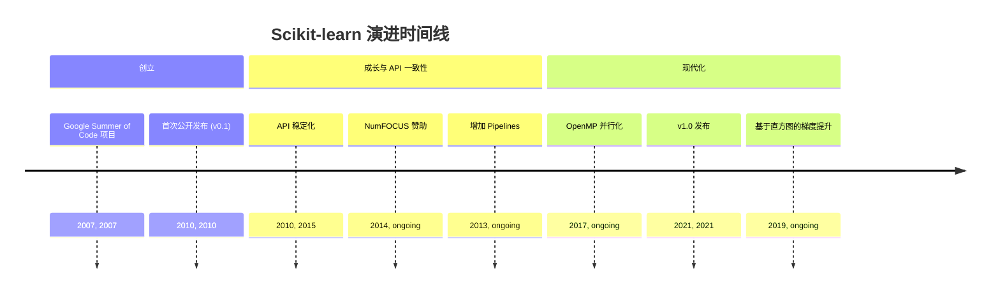
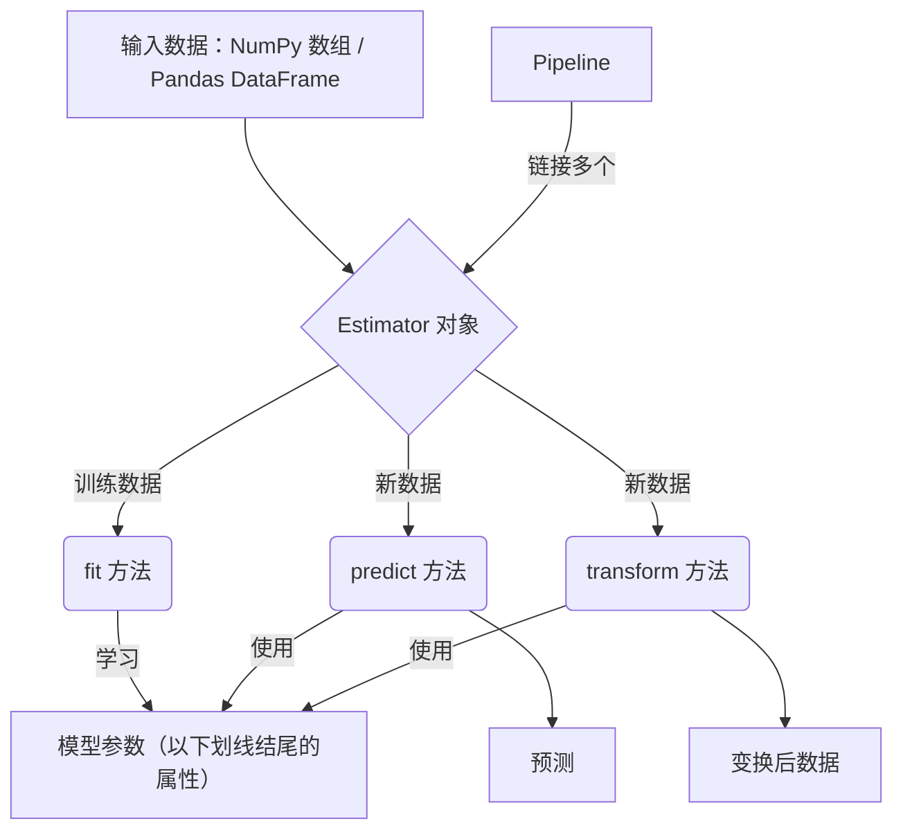
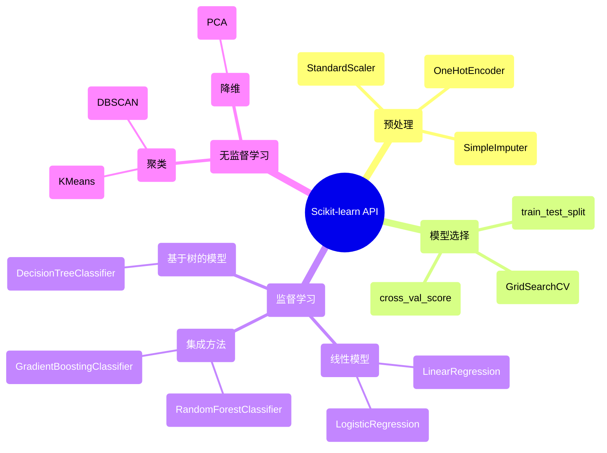

## Scikit-learn 演进文档

### 1. 引言与历史背景

Scikit-learn 是 Python 机器学习生态系统的基石之一，提供了一个全面且易用的预测性数据分析库。它为分类、回归、聚类和降维等任务提供了广泛的算法，并通过一致且简洁的 API 进行访问。

该项目由 David Cournapeau 于 2007 年作为 Google Summer of Code 项目发起。随后由其他开发者在此基础上构建，并在 2010 年由 INRIA（法国国家信息与自动化研究所）的研究人员接手并发布了首个公开版本。其主要目标是创建一个非专业人士也能轻松上手的机器学习库，强调易用性，并构建在科学 Python 技术栈（NumPy 和 SciPy）之上。

### 1.1. Scikit-learn 演进时间线



### 2. 核心架构

Scikit-learn 的架构旨在实现一致性和易用性。它构建于 NumPy 和 SciPy 之上，并利用它们进行高度优化的数值运算。

#### 2.1. Estimator API

Scikit-learn 架构的核心是 **Estimator** 对象。每个算法（无论是用于分类、回归还是变换）都以 Estimator 的形式公开。这提供了一个统一的接口，包含三个关键方法：

*   **`fit(X, y)`**：用于训练 Estimator。接收训练数据 `X`（以及用于监督学习的标签 `y`），并从中学习模型参数。
*   **`predict(X)`**：对监督学习的 Estimator，在新数据 `X` 上进行预测。
*   **`transform(X)`**：对特征工程或预处理的 Estimator，对输入数据 `X` 进行变换。

#### 2.2. 数据表示

Scikit-learn 期望数据以 NumPy 数组或 Pandas DataFrame 的形式存在，其中行表示样本、列表示特征。与核心数据科学库的无缝集成使得构建端到端的工作流变得容易。

#### 2.3. 组合与 Pipelines

一个关键的架构特性是能够将多个 Estimator 组合为一个。**`Pipeline`** 对象允许将多个变换步骤与最终的 Estimator 链接在一起。这对于创建健壮且可复现的机器学习工作流至关重要，因为它确保相同的预处理步骤同时应用于训练和测试数据。

**Mermaid 图：Scikit-learn 核心架构**



### 3. 详细 API 概述

Scikit-learn 的 API 按机器学习任务类型组织为多个模块。

#### 3.1. 预处理（`sklearn.preprocessing`）

该模块包括用于特征缩放、分类变量编码和缺失值填充的工具。

*   **`StandardScaler()`**：通过去均值并缩放到单位方差来标准化特征。
*   **`OneHotEncoder()`**：将分类整数特征编码为独热数值数组。
*   **`SimpleImputer()`**：用于补全缺失值的变换器。

#### 3.2. 模型选择（`sklearn.model_selection`）

该模块提供用于数据拆分、交叉验证和超参数调优的工具。

*   **`train_test_split(X, y, ...)`**：将数组或矩阵拆分为随机的训练和测试子集。
*   **`GridSearchCV(estimator, param_grid, ...)`**：对 Estimator 的指定参数值进行穷举搜索。
*   **`cross_val_score(estimator, X, y, ...)`**：通过交叉验证评估分数。

#### 3.3. 监督学习模型

*   **线性模型（`sklearn.linear_model`）**：
    *   `LinearRegression()`：普通最小二乘线性回归。
    *   `LogisticRegression()`：逻辑回归（又称 logit、MaxEnt）分类器。
*   **基于树的模型（`sklearn.tree`）**：
    *   `DecisionTreeClassifier()`：决策树分类器。
*   **集成方法（`sklearn.ensemble`）**：
    *   `RandomForestClassifier()`：随机森林分类器。
    *   `GradientBoostingClassifier()`：用于分类的梯度提升。

#### 3.4. 无监督学习模型

*   **聚类（`sklearn.cluster`）**：
    *   `KMeans()`：K-Means 聚类。
    *   `DBSCAN()`：基于密度的空间聚类算法。
*   **降维（`sklearn.decomposition`）**：
    *   `PCA()`：主成分分析。

### 3.5. API 思维导图



### 4. 演变与影响

*   **机器学习的民主化：** Scikit-learn 一致且易用的 API 让更广泛的受众能够使用机器学习，成为众多数据科学家和开发者的首选库。
*   **生态系统的基础：** 它已成为 Python 中机器学习互操作性的标准。许多其他库（包括模型可解释性库 SHAP、LIME 以及超参数优化库 Optuna、Hyperopt）都旨在与 Scikit-learn 的 Estimator 无缝协作。
*   **专注最佳实践：** 该库通过其 API 设计推广了良好的机器学习实践，例如训练和测试数据的分离，以及使用 Pipelines 防止数据泄漏。
*   **性能与可扩展性：** 尽管以易用性著称，Scikit-learn 在性能方面也取得了长足进步，许多核心算法使用 Cython 实现。引入基于直方图的梯度提升模型为这一流行算法带来了巨大提速。

### 5. 结论

Scikit-learn 在 Python 中推广机器学习方面发挥了关键作用。它对一致、用户友好型 API 的关注，结合全面而强大的算法集合以及对良好开发实践的承诺，使其成为不可或缺的工具。它为各种机器学习任务提供了坚实基础，并成为更广泛数据科学生态系统中 API 设计的基准。

### 6. 典型用例

#### 6.1. 二分类（LogisticRegression）

```python
from sklearn.datasets import make_classification
from sklearn.model_selection import train_test_split
from sklearn.preprocessing import StandardScaler
from sklearn.linear_model import LogisticRegression
from sklearn.pipeline import Pipeline

X, y = make_classification(n_samples=1000, n_features=20, random_state=42)
X_train, X_test, y_train, y_test = train_test_split(X, y, test_size=0.2, random_state=42)

clf = Pipeline([
    ("scaler", StandardScaler()),
    ("logreg", LogisticRegression(max_iter=1000))
])
clf.fit(X_train, y_train)
print(clf.score(X_test, y_test))
```

#### 6.2. 交叉验证与超参数搜索

```python
from sklearn.model_selection import GridSearchCV
from sklearn.svm import SVC

param_grid = {"C": [0.1, 1, 10], "gamma": ["scale", "auto"], "kernel": ["rbf"]}
search = GridSearchCV(SVC(), param_grid, cv=5)
search.fit(X_train, y_train)
print(search.best_params_)
print(search.score(X_test, y_test))
```

#### 6.3. 预处理 + 模型的流水线

```python
from sklearn.compose import ColumnTransformer
from sklearn.preprocessing import OneHotEncoder, StandardScaler
from sklearn.impute import SimpleImputer
from sklearn.ensemble import RandomForestClassifier
from sklearn.pipeline import Pipeline
import pandas as pd

# 混合类型表格数据示例
df = pd.DataFrame({
    "age": [25, 32, None, 40],
    "city": ["NY", "SF", "NY", "LA"],
    "label": [0, 1, 0, 1]
})
X = df[["age", "city"]]
y = df["label"]

preprocess = ColumnTransformer([
    ("num", Pipeline([("impute", SimpleImputer()), ("scale", StandardScaler())]), ["age"]),
    ("cat", OneHotEncoder(handle_unknown="ignore"), ["city"]) 
])

model = Pipeline([
    ("prep", preprocess),
    ("rf", RandomForestClassifier(n_estimators=200, random_state=42))
])
model.fit(X, y)
```
