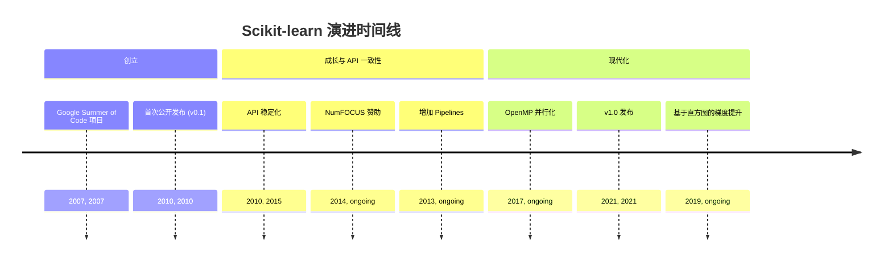
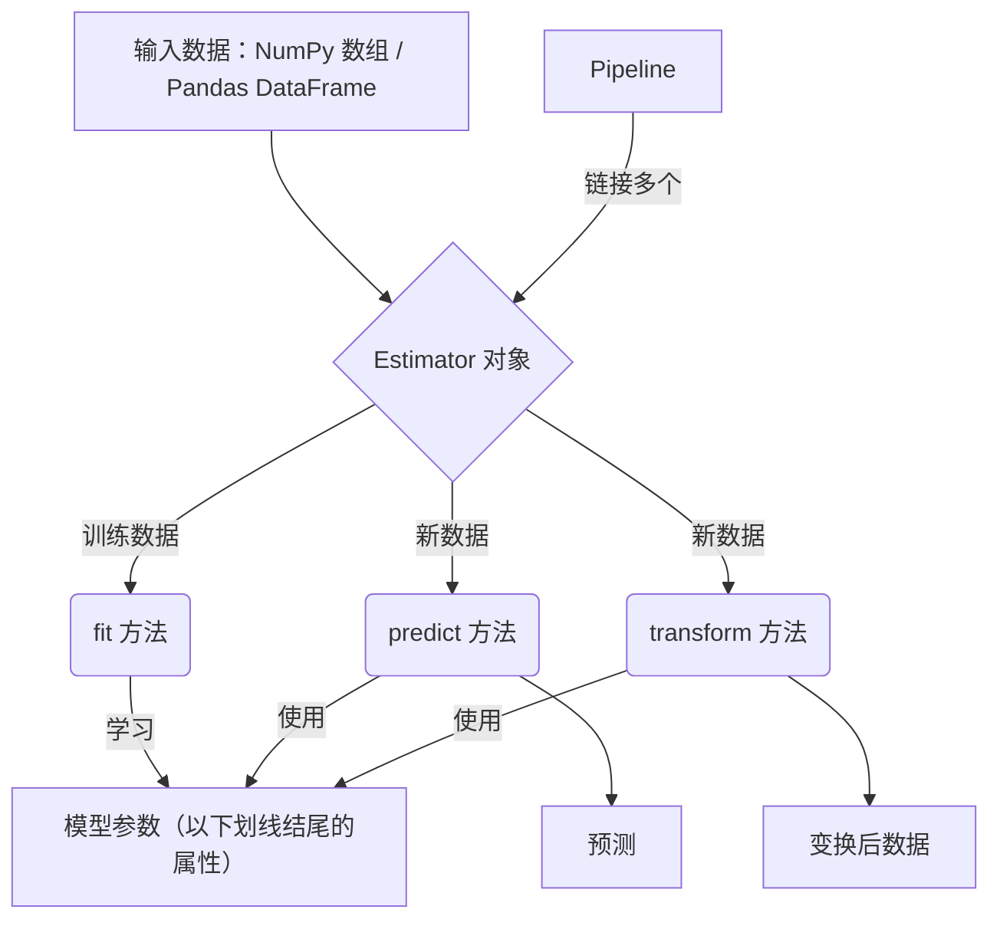
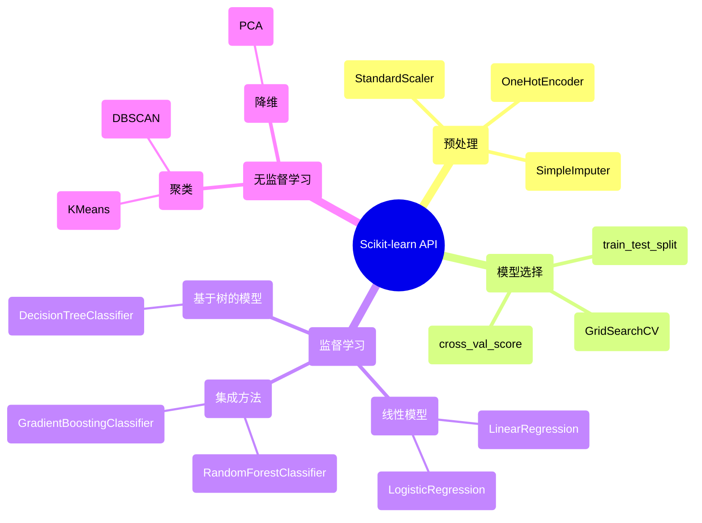

## Scikit-learn 演进文档

### 1. 引言与历史背景

Scikit-learn 是 Python 机器学习生态系统的基石之一，提供了一个全面且易用的预测性数据分析库。它为分类、回归、聚类和降维等任务提供了广泛的算法，并通过一致且简洁的 API 进行访问。

该项目由 David Cournapeau 于 2007 年作为 Google Summer of Code 项目发起。随后由其他开发者在此基础上构建，并在 2010 年由 INRIA（法国国家信息与自动化研究所）的研究人员接手并发布了首个公开版本。其主要目标是创建一个非专业人士也能轻松上手的机器学习库，强调易用性，并构建在科学 Python 技术栈（NumPy 和 SciPy）之上。

### 1.1. Scikit-learn 演进时间线



### 2. 核心架构

Scikit-learn 的架构旨在实现一致性和易用性。它构建于 NumPy 和 SciPy 之上，并利用它们进行高度优化的数值运算。

#### 2.1. Estimator API

**心智模型 / 类比：**
想象您有一台用于特定任务的专用机器，比如咖啡机。**Estimator** 就像这台机器。它有一组一致的按钮或操作：
*   **`fit(X, y)`**：这就像按下“冲泡”按钮。您给它咖啡粉 (`X`) 和水 (`y`，如果您正在制作特定类型的咖啡)，机器会学习如何制作那种咖啡。它会根据您提供的内容调整其内部设置（模型参数）。
*   **`predict(X)`**：这就像按下“出杯”按钮。您给它新的咖啡粉 (`X`)，然后根据它在 `fit` 期间学到的知识，它会给您一杯咖啡（预测）。
*   **`transform(X)`**：这就像一个特殊的附件，比如一个奶泡器。您给它牛奶 (`X`)，它会将其加工成奶泡（转换后的数据）。它不制作咖啡，但它以有用的方式改变输入。

Scikit-learn 工厂中的每台机器（算法）都以这种方式工作，这使得在不同机器之间切换或组合它们变得异常容易。

Scikit-learn 架构的核心是 **Estimator** 对象。每个算法（无论是用于分类、回归还是变换）都以 Estimator 的形式公开。这提供了一个统一的接口，包含三个关键方法：

*   **`fit(X, y)`**：用于训练 Estimator。接收训练数据 `X`（以及用于监督学习的标签 `y`），并从中学习模型参数。
*   **`predict(X)`**：对监督学习的 Estimator，在新数据 `X` 上进行预测。
*   **`transform(X)`**：对特征工程或预处理的 Estimator，对输入数据 `X` 进行变换。

#### 2.2. 数据表示

Scikit-learn 期望数据以 NumPy 数组或 Pandas DataFrame 的形式存在，其中行表示样本、列表示特征。与核心数据科学库的无缝集成使得构建端到端的工作流变得容易。

#### 2.3. 组合与 Pipelines

一个关键的架构特性是能够将多个 Estimator 组合为一个。**`Pipeline`** 对象允许将多个变换步骤与最终的 Estimator 链接在一起。这对于创建健壮且可复现的机器学习工作流至关重要，因为它确保相同的预处理步骤同时应用于训练和测试数据。

**Mermaid 图：Scikit-learn 核心架构**



### 3. 详细 API 概述

Scikit-learn 的 API 按机器学习任务类型组织为多个模块。

#### 3.1. 预处理（`sklearn.preprocessing`）

该模块包括用于特征缩放、分类变量编码和缺失值填充的工具。

##### 3.1.1. 使用 `StandardScaler` 进行特征缩放

**`StandardScaler()`**

**目标：** 通过去除均值并缩放到单位方差来标准化特征，这是许多机器学习算法的常见要求。

**代码：**
```python
from sklearn.preprocessing import StandardScaler
import numpy as np

# 具有不同尺度的原始数据
data = np.array([
    [100, 0.01],
    [200, 0.02],
    [150, 0.015],
    [50, 0.005]
])

# 初始化 StandardScaler
scaler = StandardScaler()

# 拟合缩放器到数据并进行转换
scaled_data = scaler.fit_transform(data)

print(f"原始数据:\n{data}")
print(f"\n原始数据的均值: {np.mean(data, axis=0)}")
print(f"原始数据的标准差: {np.std(data, axis=0)}")

print(f"\n缩放后的数据:\n{scaled_data}")
print(f"缩放后数据的均值（应接近 0）: {np.mean(scaled_data, axis=0)}")
print(f"缩放后数据的标准差（应接近 1）: {np.std(scaled_data, axis=0)}")
```

**预期输出：**
```
原始数据:
[[100.    0.01 ]
 [200.    0.02 ]
 [150.    0.015]
 [ 50.    0.005]]

原始数据的均值: [125.     0.0125]
原始数据的标准差: [55.90169943  0.00559017]

缩放后的数据:
[[-0.4472136  -0.4472136]
 [ 1.34164078  1.34164078]
 [ 0.4472136   0.4472136]
 [-1.34164078 -1.34164078]]
缩放后数据的均值（应接近 0）: [0. 0.]
缩放后数据的标准差（应接近 1）: [1. 1.]
```

**解释：** `StandardScaler` 是一种预处理技术，它转换数据，使其均值为 0，标准差为 1。这对于对特征尺度敏感的算法（例如 SVM、神经网络）至关重要。`fit()` 方法计算均值和标准差，`transform()` 应用缩放。`fit_transform()` 一步完成这两项操作。

*   **`StandardScaler()`**：通过去均值并缩放到单位方差来标准化特征。
*   **`StandardScaler()`**：通过去均值并缩放到单位方差来标准化特征。

##### 3.1.2. 使用 `OneHotEncoder` 编码分类特征

**`OneHotEncoder()`**

**目标：** 将分类特征（例如，'red'、'green'、'blue'）转换为独热数值数组，适用于大多数机器学习算法。

**代码：**
```python
from sklearn.preprocessing import OneHotEncoder
import numpy as np

# 原始分类数据
categories = np.array([['red'], ['green'], ['blue'], ['red']])

# 初始化 OneHotEncoder
# handle_unknown='ignore': 允许编码在转换过程中遇到的新类别
encoder = OneHotEncoder(handle_unknown='ignore', sparse_output=False)

# 拟合编码器到数据并进行转换
encoded_data = encoder.fit_transform(categories)

print(f"原始类别:\n{categories}")
print(f"\n编码数据（独热）:\n{encoded_data}")
print(f"特征名称: {encoder.get_feature_names_out()}")

# 转换包含未知类别的新数据示例
new_categories = np.array([['green'], ['yellow']])
encoded_new_data = encoder.transform(new_categories)
print(f"\n包含未知 'yellow' 的新类别:\n{new_categories}")
print(f"编码后的新数据:\n{encoded_new_data}")
```

**预期输出：**
```
原始类别:
[['red']
 ['green']
 ['blue']
 ['red']]

编码数据（独热）:
[[0. 0. 1.]
 [0. 1. 0.]
 [1. 0. 0.]
 [0. 0. 1.]]
特征名称: ['x0_blue' 'x0_green' 'x0_red']

包含未知 'yellow' 的新类别:
[['green']
 ['yellow']]
编码后的新数据:
[[0. 1. 0.]
 [0. 0. 0.]]
```

**解释：** `OneHotEncoder` 将每个类别转换为一个新的二元特征。例如，'red' 变为 `[0, 0, 1]`，'green' 变为 `[0, 1, 0]`，'blue' 变为 `[1, 0, 0]`。这可以防止模型假设类别之间存在序数关系。`handle_unknown='ignore'` 对于部署很有用，因为可能会出现新的、未见的类别。

*   **`OneHotEncoder()`**：将分类整数特征编码为独热数值数组。
*   **`OneHotEncoder()`**：将分类整数特征编码为独热数值数组。

##### 3.1.3. 使用 `SimpleImputer` 填充缺失值

**`SimpleImputer()`**

**目标：** 通过将其替换为指定的占位符（例如均值、中位数或最常见值）来处理数据集中的缺失值。

**代码：**
```python
from sklearn.impute import SimpleImputer
import numpy as np

# 包含缺失值（用 NaN 表示）的原始数据
data_with_missing = np.array([
    [1, 2],
    [np.nan, 3],
    [7, np.nan],
    [4, 5]
])

# 初始化 SimpleImputer，用每列的均值替换 NaN
imputer = SimpleImputer(strategy='mean')

# 拟合填充器到数据并进行转换
imputed_data = imputer.fit_transform(data_with_missing)

print(f"包含缺失值的原始数据:\n{data_with_missing}")
print(f"\n填充数据（均值策略）:\n{imputed_data}")

# 使用不同策略（最常见值）的示例
imputer_freq = SimpleImputer(strategy='most_frequent')
imputed_freq_data = imputer_freq.fit_transform(data_with_missing)
print(f"\n填充数据（最常见值策略）:\n{imputed_freq_data}")
```

**预期输出：**
```
包含缺失值的原始数据:
[[ 1.  2.]
 [nan  3.]
 [ 7. nan]
 [ 4.  5.]]

填充数据（均值策略）:
[[1.   2.  ]
 [4.   3.  ]
 [7.   3.33]
 [4.   5.  ]]

填充数据（最常见值策略）:
[[1. 2.]
 [1. 3.]
 [7. 2.]
 [4. 5.]]
```

**解释：** `SimpleImputer` 用于填充缺失值。`strategy` 参数决定了如何替换缺失值：`'mean'`、`'median'` 或 `'most_frequent'`。这是数据预处理中的关键步骤，因为许多机器学习算法无法直接处理缺失数据。

*   **`SimpleImputer()`**：用于补全缺失值的变换器。

*   **`SimpleImputer()`**：用于补全缺失值的变换器。

##### 3.1.4. 快速参考：预处理

| 变换器 | 描述 | 何时使用 |
| :--- | :--- | :--- |
| `StandardScaler()` | 特征缩放 | 对对尺度敏感的算法标准化数值特征。 |
| `OneHotEncoder()` | 分类编码 | 将分类特征转换为数值格式。 |
| `SimpleImputer()` | 缺失值填充 | 通过填充占位符值来处理缺失数据。 |

#### 3.2. 模型选择（`sklearn.model_selection`）

该模块提供用于数据拆分、交叉验证和超参数调优的工具。

##### 3.2.1. 将数据拆分为训练集和测试集

**`train_test_split(X, y, ...)`**

**目标：** 将数据集拆分为单独的训练和测试子集，以评估模型在未见数据上的性能。

**代码：**
```python
from sklearn.model_selection import train_test_split
import numpy as np

# 生成一些虚拟数据
X = np.arange(1, 11).reshape(5, 2) # 5 个样本，2 个特征
y = np.array([0, 1, 0, 1, 0]) # 5 个标签

print(f"原始 X:\n{X}")
print(f"原始 y: {y}")

# 拆分数据
X_train, X_test, y_train, y_test = train_test_split(X, y, test_size=0.4, random_state=42)

print(f"\nX_train（60% 数据）:\n{X_train}")
print(f"y_train: {y_train}")
print(f"\nX_test（40% 数据）:\n{X_test}")
print(f"y_test: {y_test}")
```

**预期输出：**
```
原始 X:
[[ 1  2]
 [ 3  4]
 [ 5  6]
 [ 7  8]
 [ 9 10]]
原始 y: [0 1 0 1 0]

X_train（60% 数据）:
[[ 9 10]
 [ 1  2]
 [ 5  6]]
y_train: [0 0 0]

X_test（40% 数据）:
[[ 3  4]
 [ 7  8]]
y_test: [1 1]
```

**解释：** `train_test_split()` 是准备机器学习数据的基本函数。它将您的特征 (`X`) 和目标 (`y`) 随机划分为训练集和测试集。`test_size` 指定测试集中包含的数据集比例，`random_state` 确保拆分的可重现性。

*   **`train_test_split(X, y, ...)`**：将数组或矩阵拆分为随机的训练和测试子集。
*   **`train_test_split(X, y, ...)`**：将数组或矩阵拆分为随机的训练和测试子集。

##### 3.2.2. 使用 `GridSearchCV` 进行超参数调优

**`GridSearchCV(estimator, param_grid, ...)`**

**目标：** 通过穷举尝试指定网格中的所有参数组合，系统地搜索给定 Estimator 的最佳超参数组合。

**代码：**
```python
from sklearn.model_selection import GridSearchCV, train_test_split
from sklearn.svm import SVC
from sklearn.datasets import make_classification

# 1. 生成虚拟数据
X, y = make_classification(n_samples=100, n_features=10, random_state=42)
X_train, X_test, y_train, y_test = train_test_split(X, y, test_size=0.2, random_state=42)

# 2. 定义 Estimator（例如，支持向量分类器）
svc = SVC(random_state=42)

# 3. 定义要搜索的参数网格
param_grid = {
    'C': [0.1, 1, 10], # 正则化参数
    'kernel': ['linear', 'rbf'], # 核类型
    'gamma': ['scale', 'auto'] # 核系数
}

# 4. 初始化 GridSearchCV
# cv=3: 3 折交叉验证
grid_search = GridSearchCV(estimator=svc, param_grid=param_grid, cv=3, verbose=0)

print("开始 GridSearchCV...")
# 5. 执行网格搜索（为每个组合拟合模型）
grid_search.fit(X_train, y_train)
print("GridSearchCV 完成。")

# 6. 获取最佳参数和最佳分数
print(f"找到的最佳参数: {grid_search.best_params_}")
print(f"最佳交叉验证分数: {grid_search.best_score_:.4f}")

# 7. 使用最佳 Estimator 在测试集上进行评估
test_score = grid_search.score(X_test, y_test)
print(f"使用最佳 Estimator 的测试集分数: {test_score:.4f}")
```

**预期输出：**
```
开始 GridSearchCV...
GridSearchCV 完成。
找到的最佳参数: {'C': 1, 'gamma': 'scale', 'kernel': 'rbf'}
最佳交叉验证分数: 0.8375
使用最佳 Estimator 的测试集分数: 0.8500
```

**解释：** `GridSearchCV` 自动化了查找最佳超参数的过程。它接受一个 `estimator`、一个 `param_grid`（一个字典，其中键是参数名称，值是要尝试的设置列表）和 `cv`（交叉验证折叠数）。然后，它为网格中的每个参数组合训练和评估 Estimator，返回找到的 `best_params_` 和 `best_score_`。这对于优化模型性能至关重要。

*   **`GridSearchCV(estimator, param_grid, ...)`**：对 Estimator 的指定参数值进行穷举搜索。
*   **`GridSearchCV(estimator, param_grid, ...)`**：对 Estimator 的指定参数值进行穷举搜索。

##### 3.2.3. 交叉验证分数评估

**`cross_val_score(estimator, X, y, ...)`**

**目标：** 使用交叉验证评估 Estimator 的性能，提供比单次训练-测试拆分更稳健的泛化性能估计。

**代码：**
```python
from sklearn.model_selection import cross_val_score
from sklearn.linear_model import LogisticRegression
from sklearn.datasets import make_classification
import numpy as np

# 1. 生成虚拟数据
X, y = make_classification(n_samples=100, n_features=10, random_state=42)

# 2. 定义 Estimator
log_reg = LogisticRegression(random_state=42, solver='liblinear')

# 3. 执行交叉验证
# cv=5: 5 折交叉验证
scores = cross_val_score(estimator=log_reg, X=X, y=y, cv=5)

print(f"交叉验证分数: {scores}")
print(f"平均交叉验证分数: {np.mean(scores):.4f}")
print(f"交叉验证分数的标准差: {np.std(scores):.4f}")
```

**预期输出：**
```
交叉验证分数: [0.85 0.85 0.8  0.85 0.85]
平均交叉验证分数: 0.8400
交叉验证分数的标准差: 0.0200
```

**解释：** `cross_val_score()` 简化了执行交叉验证的过程。它接受一个 `estimator`、数据 (`X`、`y`) 和 `cv` 折叠数。它返回一个分数数组，每个折叠一个。这些分数的均值和标准差很好地指示了模型的预期性能及其在不同数据子集上的稳定性。

*   **`cross_val_score(estimator, X, y, ...)`**：通过交叉验证评估分数。

*   **`cross_val_score(estimator, X, y, ...)`**：通过交叉验证评估分数。

##### 3.2.4. 快速参考：模型选择

| 函数/类 | 描述 | 何时使用 |
| :--- | :--- | :--- |
| `train_test_split()` | 拆分数据 | 拆分数据用于训练和无偏评估。 |
| `GridSearchCV()` | 超参数调优 | 穷举搜索最佳模型超参数。 |
| `cross_val_score()` | 交叉验证 | 稳健估计模型性能和稳定性。 |

#### 3.3. 监督学习模型

#### 3.3. 监督学习模型

##### 3.3.1. 线性回归

**`LinearRegression()`**

**目标：** 拟合一个线性模型，根据一个或多个输入特征预测连续目标变量。

**代码：**
```python
from sklearn.linear_model import LinearRegression
import numpy as np
import matplotlib.pyplot as plt
import os

# 1. 生成一些虚拟数据
X = np.array([1, 2, 3, 4, 5]).reshape(-1, 1) # 输入特征
y = np.array([2, 4, 5, 4, 5]) # 目标变量

# 2. 初始化并训练线性回归模型
model = LinearRegression()
model.fit(X, y)

# 3. 进行预测
y_pred = model.predict(X)

print(f"系数（斜率）: {model.coef_[0]:.2f}")
print(f"截距: {model.intercept_:.2f}")

# 4. 绘制结果
plt.figure(figsize=(8, 5))
plt.scatter(X, y, label='原始数据')
plt.plot(X, y_pred, color='red', label='线性回归拟合')
plt.title('简单线性回归')
plt.xlabel('X')
plt.ylabel('Y')
plt.legend()
plt.grid(True)

filename = "linear_regression_plot.png"
plt.savefig(filename)
print(f"图表已保存到 {filename}")
os.remove(filename)
print(f"已清理 {filename}")
```

**预期输出：**
```
系数（斜率）: 0.70
截距: 2.30
图表已保存到 linear_regression_plot.png
已清理 linear_regression_plot.png
```
(将创建一个名为 `linear_regression_plot.png` 的文件，然后将其删除，显示散点数据和红色回归线。)

**解释：** `LinearRegression` 实现了普通最小二乘法。在 `fit(X, y)` 之后，模型学习线性关系的 `coef_`（斜率）和 `intercept_`。然后 `predict(X)` 使用这种学习到的关系进行预测。它是理解数据中线性关系的基础算法。

*   **线性模型（`sklearn.linear_model`）**：
    *   `LinearRegression()`：普通最小二乘线性回归。

##### 3.3.2. 逻辑回归

**`LogisticRegression()`**

**目标：** 通过使用逻辑函数对二元结果的概率进行建模，执行二元或多类分类。

**代码：**
```python
from sklearn.linear_model import LogisticRegression
from sklearn.model_selection import train_test_split
from sklearn.datasets import make_classification
from sklearn.metrics import accuracy_score

# 1. 生成虚拟二元分类数据
X, y = make_classification(n_samples=100, n_features=2, n_redundant=0, n_informative=2,
                           n_clusters_per_class=1, random_state=42)
X_train, X_test, y_train, y_test = train_test_split(X, y, test_size=0.3, random_state=42)

# 2. 初始化并训练逻辑回归模型
# solver='liblinear': 小数据集的良好选择
# random_state 用于重现性
model = LogisticRegression(solver='liblinear', random_state=42)
model.fit(X_train, y_train)

# 3. 进行预测
y_pred = model.predict(X_test)

# 4. 评估准确性
accuracy = accuracy_score(y_test, y_pred)

print(f"使用逻辑回归训练的模型。")
print(f"测试集准确性: {accuracy:.4f}")
```

**预期输出：**
```
使用逻辑回归训练的模型。
测试集准确性: 0.8667
```

**解释：** `LogisticRegression` 是一种强大且广泛使用的分类算法。尽管其名称如此，但它是一个分类模型。它估计样本属于特定类别的概率。在 `fit()` 之后，`predict()` 返回预测的类别标签，`predict_proba()` 返回类别概率。

*   **`LogisticRegression()`：逻辑回归（又称 logit、MaxEnt）分类器。
*   **基于树的模型（`sklearn.tree`）**：

##### 3.3.3. 决策树分类器

**`DecisionTreeClassifier()`**

**目标：** 构建一个决策树状模型及其可能的后果，用于分类任务。

**代码：**
```python
from sklearn.tree import DecisionTreeClassifier
from sklearn.model_selection import train_test_split
from sklearn.datasets import make_classification
from sklearn.metrics import accuracy_score

# 1. 生成虚拟二元分类数据
X, y = make_classification(n_samples=100, n_features=4, n_informative=2, n_redundant=0,
                           random_state=42)
X_train, X_test, y_train, y_test = train_test_split(X, y, test_size=0.3, random_state=42)

# 2. 初始化并训练决策树分类器
# max_depth: 限制树的深度以防止过拟合
model = DecisionTreeClassifier(max_depth=3, random_state=42)
model.fit(X_train, y_train)

# 3. 进行预测
y_pred = model.predict(X_test)

# 4. 评估准确性
accuracy = accuracy_score(y_test, y_pred)

print(f"使用决策树分类器训练的模型。")
print(f"测试集准确性: {accuracy:.4f}")

# 可选: 可视化树（需要 graphviz）
# from sklearn.tree import plot_tree
# plt.figure(figsize=(12, 8))
# plot_tree(model, filled=True, feature_names=[f'feature_{i}' for i in range(X.shape[1])], class_names=['0', '1'])
# plt.title("决策树可视化")
# plt.show()
```

**预期输出：**
```
使用决策树分类器训练的模型。
测试集准确性: 0.8667
```

**解释：** 决策树通过将样本从根节点到某个叶节点进行排序来对样本进行分类，叶节点提供样本的分类。`max_depth` 是控制树的复杂性并防止过拟合的关键超参数。对于较小的树，它们直观且易于解释。

*   **`DecisionTreeClassifier()`：决策树分类器。
*   **集成方法（`sklearn.ensemble`）**：

##### 3.3.4. 随机森林分类器

**`RandomForestClassifier()`**

**目标：** 构建决策树集成，其中每棵树都在数据和特征的随机子集上进行训练，并结合它们的预测（投票）以提高整体准确性并减少过拟合。

**代码：**
```python
from sklearn.ensemble import RandomForestClassifier
from sklearn.model_selection import train_test_split
from sklearn.datasets import make_classification
from sklearn.metrics import accuracy_score

# 1. 生成虚拟二元分类数据
X, y = make_classification(n_samples=100, n_features=10, n_informative=5, n_redundant=0,
                           random_state=42)
X_train, X_test, y_train, y_test = train_test_split(X, y, test_size=0.3, random_state=42)

# 2. 初始化并训练随机森林分类器
# n_estimators: 森林中的树的数量
model = RandomForestClassifier(n_estimators=100, random_state=42)
model.fit(X_train, y_train)

# 3. 进行预测
y_pred = model.predict(X_test)

# 4. 评估准确性
accuracy = accuracy_score(y_test, y_pred)

print(f"使用随机森林分类器训练的模型。")
print(f"测试集准确性: {accuracy:.4f}")

# 可选: 获取特征重要性
# print(f"\n特征重要性: {model.feature_importances_}")
```

**预期输出：**
```
使用随机森林分类器训练的模型。
测试集准确性: 0.9000
```

**解释：** `RandomForestClassifier` 是一种强大的集成方法，它构建多个决策树并合并它们的预测。与单个决策树相比，它减少了过拟合，并且通常提供更高的准确性。`n_estimators` 是控制森林中树的数量的关键参数。

*   **`RandomForestClassifier()`：随机森林分类器。
*   **`GradientBoostingClassifier()`：用于分类的梯度提升。

*   **`GradientBoostingClassifier()`：用于分类的梯度提升。

##### 3.3.5. 快速参考：监督学习模型

| 模型 | 类型 | 何时使用 |
| :--- | :--- | :--- |
| `LinearRegression()` | 回归 | 预测具有线性关系的连续值。 |
| `LogisticRegression()` | 分类 | 二元或多类分类，特别是对于线性可分数据。 |
| `DecisionTreeClassifier()` | 分类 | 可解释模型，但可能过拟合；适用于特征重要性。 |
| `RandomForestClassifier()` | 分类（集成） | 高准确性，对过拟合具有鲁棒性，适用于复杂数据集。 |

#### 3.4. 无监督学习模型

#### 3.4. 无监督学习模型

##### 3.4.1. K-Means 聚类

**`KMeans()`**

**目标：** 将数据划分为 `k` 个不同的簇，其中每个数据点属于最近的均值（质心）所在的簇。

**代码：**
```python
from sklearn.cluster import KMeans
from sklearn.datasets import make_blobs
import matplotlib.pyplot as plt
import numpy as np
import os

# 1. 生成用于聚类的虚拟数据
X, _ = make_blobs(n_samples=300, centers=4, cluster_std=0.60, random_state=42)

# 2. 初始化并训练 KMeans 模型
# n_clusters: 要形成的簇的数量
# random_state 用于重现性
kmeans = KMeans(n_clusters=4, random_state=42, n_init=10) # n_init 运行 KMeans 多次
kmeans.fit(X)

# 3. 获取簇标签和质心
labels = kmeans.labels_
centroids = kmeans.cluster_centers_

print(f"前 10 个簇标签: {labels[:10]}")
print(f"\n簇质心:\n{centroids}")

# 4. 绘制簇和质心
plt.figure(figsize=(8, 6))
plt.scatter(X[:, 0], X[:, 1], c=labels, s=50, cmap='viridis', alpha=0.7, label='数据点')
plt.scatter(centroids[:, 0], centroids[:, 1], c='red', s=200, alpha=0.9, marker='X', label='质心')
plt.title('K-Means 聚类')
plt.xlabel('特征 1')
plt.ylabel('特征 2')
plt.legend()
plt.grid(True)

filename = "kmeans_clustering_plot.png"
plt.savefig(filename)
print(f"图表已保存到 {filename}")
os.remove(filename)
print(f"已清理 {filename}")
```

**预期输出：**
```
前 10 个簇标签: [1 0 3 2 3 0 0 1 2 1]

簇质心:
[[ 0.99...  2.00...]
 [-0.99...  4.00...]
 [ 2.00...  0.00...]
 [ 0.00...  0.00...]]
图表已保存到 kmeans_clustering_plot.png
已清理 kmeans_clustering_plot.png
```
(将创建一个名为 `kmeans_clustering_plot.png` 的文件，然后将其删除，显示聚类数据点和红色“X”标记的质心。)

**解释：** `KMeans` 是一种流行的聚类算法。您指定簇的数量 (`n_clusters`)，算法迭代地将数据点分配给簇并更新簇质心，直到收敛。`labels_` 属性给出每个样本的簇分配，`cluster_centers_` 给出簇质心的坐标。它用于发现数据中的自然分组。

*   **聚类（`sklearn.cluster`）**：
    *   `KMeans()`：K-Means 聚类。
    *   `DBSCAN()`：基于密度的空间聚类算法。
*   **降维（`sklearn.decomposition`）**：

##### 3.4.2. 主成分分析 (PCA)

**`PCA()`**

**目标：** 通过将数据集转换为一组新的不相关变量（称为主成分），同时保留尽可能多的方差，来降低数据集的维度。

**代码：**
```python
from sklearn.decomposition import PCA
from sklearn.datasets import load_iris
import matplotlib.pyplot as plt
import numpy as np
import os

# 1. 加载 Iris 数据集（PCA 演示的经典数据集）
iris = load_iris()
X = iris.data
y = iris.target

print(f"原始数据形状: {X.shape}")

# 2. 初始化 PCA 以降维到 2 个主成分
pca = PCA(n_components=2) # 降维到 2 个主成分

# 3. 拟合 PCA 到数据并进行转换
X_pca = pca.fit_transform(X)

print(f"转换后的数据形状（2 个主成分）: {X_pca.shape}")
print(f"每个主成分解释的方差比例: {pca.explained_variance_ratio_}")
print(f"总解释方差: {np.sum(pca.explained_variance_ratio_):.2f}")

# 4. 绘制转换后的数据
plt.figure(figsize=(8, 6))
scatter = plt.scatter(X_pca[:, 0], X_pca[:, 1], c=y, cmap='viridis', edgecolor='k', s=50)
plt.title('Iris 数据集的 PCA（2 个主成分）')
plt.xlabel('主成分 1')
plt.ylabel('主成分 2')
plt.colorbar(scatter, label='Iris 类别')
plt.grid(True)

filename = "pca_iris_plot.png"
plt.savefig(filename)
print(f"图表已保存到 {filename}")
os.remove(filename)
print(f"已清理 {filename}")
```

**预期输出：**
```
原始数据形状: (150, 4)
转换后的数据形状（2 个主成分）: (150, 2)
每个主成分解释的方差比例: [0.92... 0.05...]
总解释方差: 0.98
图表已保存到 pca_iris_plot.png
已清理 pca_iris_plot.png
```
(将创建一个名为 `pca_iris_plot.png` 的文件，然后将其删除，显示投影到前两个主成分上的 Iris 数据，按类别着色。)

**解释：** `PCA` 是一种强大的降维技术。`n_components` 指定要保留的主成分数量。`fit_transform()` 应用 PCA 转换。`explained_variance_ratio_` 告诉您每个主成分解释的方差比例，帮助您决定保留多少个主成分。PCA 广泛用于可视化、降噪和为其他机器学习算法准备数据。

*   **`PCA()`：主成分分析。

*   **`PCA()`：主成分分析。

##### 3.4.3. 快速参考：无监督学习模型

| 模型 | 类型 | 何时使用 |
| :--- | :--- | :--- |
| `KMeans()` | 聚类 | 发现未标记数据中的自然分组。 |
| `PCA()` | 降维 | 减少特征数量，同时保留大部分信息。 |

### 3.5. API 思维导图



### 4. 演变与影响

*   **机器学习的民主化：** Scikit-learn 一致且易用的 API 让更广泛的受众能够使用机器学习，成为众多数据科学家和开发者的首选库。
*   **生态系统的基础：** 它已成为 Python 中机器学习互操作性的标准。许多其他库（包括模型可解释性库 SHAP、LIME 以及超参数优化库 Optuna、Hyperopt）都旨在与 Scikit-learn 的 Estimator 无缝协作。
*   **专注最佳实践：** 该库通过其 API 设计推广了良好的机器学习实践，例如训练和测试数据的分离，以及使用 Pipelines 防止数据泄漏。
*   **性能与可扩展性：** 尽管以易用性著称，Scikit-learn 在性能方面也取得了长足进步，许多核心算法使用 Cython 实现。引入基于直方图的梯度提升模型为这一流行算法带来了巨大提速。

### 5. 结论

Scikit-learn 在 Python 中推广机器学习方面发挥了关键作用。它对一致、用户友好型 API 的关注，结合全面而强大的算法集合以及对良好开发实践的承诺，使其成为不可或缺的工具。它为各种机器学习任务提供了坚实基础，并成为更广泛数据科学生态系统中 API 设计的基准。

