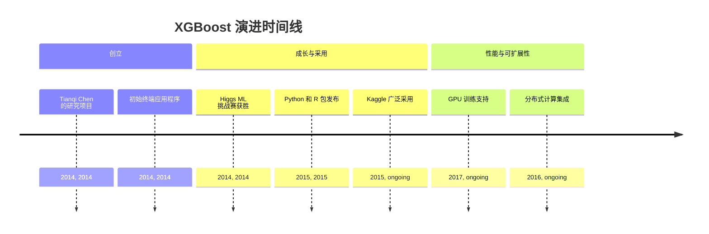
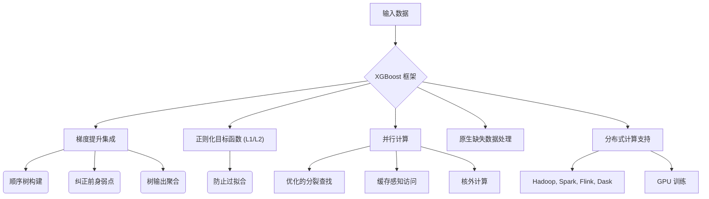
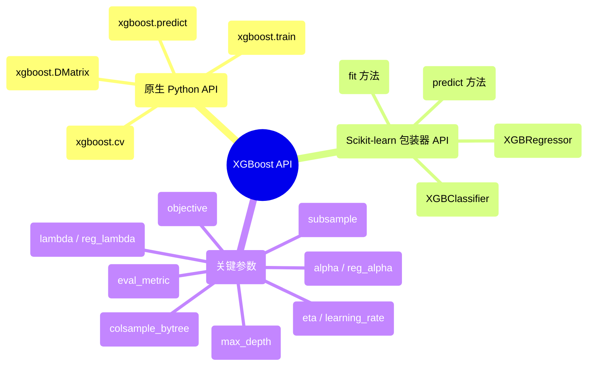

## XGBoost 演进文档

### 1. 引言与历史背景

XGBoost (eXtreme Gradient Boosting) 是一个开源软件库，提供了一个正则化梯度提升框架。它以其效率、灵活性和可移植性而闻名，并因其在各种数据科学竞赛中，特别是在结构化数据上的卓越表现，已成为机器学习的基石。

XGBoost 最初是 Tianqi Chen 于 2014 年在华盛顿大学分布式（深度）机器学习社区 (DMLC) 小组的一个研究项目。最初，它是一个独立的终端应用程序。在 Higgs 机器学习挑战赛的获胜解决方案中使用后，其知名度飙升。此后，开发了 Python 和 R 包，XGBoost 现在拥有多种语言的实现，包括 Java、Scala、Julia 和 Perl，极大地促进了其广泛采用，尤其是在 Kaggle 社区中。

### 1.1. XGBoost 演进时间线

### 2. 核心架构

XGBoost 建立在梯度提升的算法基础之上，这是一种顺序构建多个决策树的集成方法。每棵新树旨在纠正其前身的弱点，最终预测是所有单个树输出的聚合。XGBoost 引入了对标准梯度提升机 (GBM) 的几项关键架构改进，以提高性能和泛化能力。

#### 2.1. 正则化目标函数

XGBoost 的一个显著特征是将其正则化（L1 和 L2）直接纳入其目标函数。这有助于防止过拟合，并提高模型对未见数据的泛化能力，从而产生更稳健的模型。

#### 2.2. 并行化和优化的分裂查找

虽然梯度提升本质上是顺序的，但 XGBoost 集成了并行计算以显著加速树构建过程。它采用近似分裂查找算法，以有效地确定树中的最佳分裂点，特别是对于大型数据集。该方法基于特征分位数提出了一组有限的候选分裂点，并通过加权分位数草图算法进一步完善。

#### 2.3. 缺失数据处理

XGBoost 旨在原生处理缺失值。该算法调整其优化过程，将缺失值视为特殊情况，在树构建过程中学习缺失值的最佳方向，而无需显式插补。

#### 2.4. 缓存感知访问和核外计算

为了优化数据访问并最大程度地减少缓存未命中，XGBoost 将数据组织成内存中的“块”，并将数据预取到 CPU 缓存中。对于超出可用 RAM 的数据集，它支持**核外计算**，通过从磁盘分块处理数据，利用数据压缩和分片来优化磁盘 I/O。这使得在单台机器上训练海量数据集成为可能。

#### 2.5. 系统级优化

XGBoost 专为高性能和可扩展性而设计。它支持 Apache Hadoop、Apache Spark、Apache Flink 和 Dask 等分布式计算框架，并提供 GPU 训练功能，使其适用于大规模机器学习任务。

**Mermaid 图：XGBoost 核心架构**

### 3. 详细 API 概述

XGBoost 提供了灵活的接口，其中 Python API 是最常用的。

#### 3.1. 原生 Python API

此 API 提供最大的灵活性和控制。

*   **`xgboost.DMatrix(data, label=None, ...)`**: XGBoost 的核心数据结构。它是一个优化的内部数据容器，可处理各种输入格式（NumPy 数组、SciPy 稀疏矩阵、Pandas DataFrame）。
*   **`xgboost.train(params, dtrain, num_boost_round, ...)`**: 训练一个提升模型。`params` 是一个超参数字典。
*   **`xgboost.predict(data)`**: 使用训练好的提升器进行预测。
*   **`xgboost.cv(params, dtrain, num_boost_round, ...)`**: 执行交叉验证。

#### 3.2. Scikit-learn 包装器 API

对于熟悉 Scikit-learn 的用户，XGBoost 提供了兼容的包装器类。

*   **`xgboost.XGBClassifier(objective='binary:logistic', ...)`**: 与 Scikit-learn API 兼容的分类器。
*   **`xgboost.XGBRegressor(objective='reg:squarederror', ...)`**: 与 Scikit-learn API 兼容的回归器。
*   **`fit(X, y, ...)`**: 训练模型（与 Scikit-learn 一致）。
*   **`predict(X)`**: 进行预测（与 Scikit-learn 一致）。

#### 3.3. 关键参数 (两个 API 共有)

*   **`objective`**: 定义学习任务和相应的学习目标（例如，`'reg:squarederror'` 用于回归，`'binary:logistic'` 用于二元分类）。
*   **`eval_metric`**: 用于验证数据的指标（例如，`'rmse'`、`'logloss'`、`'auc'`）。
*   **`eta` (learning_rate)**: 更新中使用的步长收缩，以防止过拟合。
*   **`max_depth`**: 树的最大深度。
*   **`subsample`**: 训练实例的子样本比例。
*   **`colsample_bytree`**: 构建每棵树时列的子样本比例。
*   **`lambda` (reg_lambda)**: 权重上的 L2 正则化项。
*   **`alpha` (reg_alpha)**: 权重上的 L1 正则化项。

### 3.4. API 思维导图

### 4. 演变与影响

*   **表格数据的主导地位:** XGBoost 已成为结构化/表格数据的主导算法，在机器学习竞赛和实际应用中始终取得最先进的结果。
*   **性能与可扩展性:** 它对系统级优化、并行化和核外计算的关注使其速度极快，能够处理非常大的数据集，这是梯度提升的一项重大进步。
*   **稳健性与泛化能力:** 内置的正则化和对缺失数据的原生处理有助于其稳健性以及对未见数据的良好泛化能力，从而降低了过拟合的风险。
*   **社区与生态系统:** XGBoost 拥有一个蓬勃发展的社区，并集成到各种数据科学工作流和平台中，包括基于云的机器学习服务。
*   **多语言支持:** 它在多种编程语言中的可用性扩大了其影响范围，使其可供各种开发人员使用。

### 5. 结论

XGBoost 彻底改变了梯度提升领域，将其转变为一种高效、可扩展且稳健的机器学习算法。其创新的架构改进，加上灵活的 API 和强大的社区支持，巩固了其作为高性能预测建模（特别是结构化数据）的首选工具的地位。持续的开发和优化确保 XGBoost 仍然是应对复杂机器学习挑战的领先选择。
