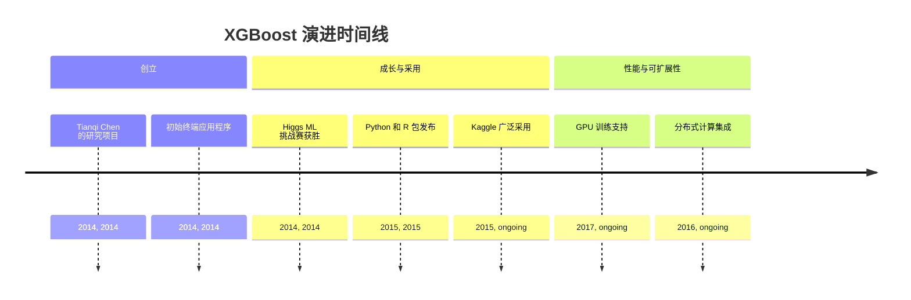
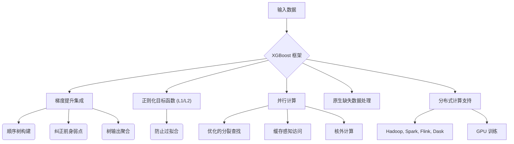
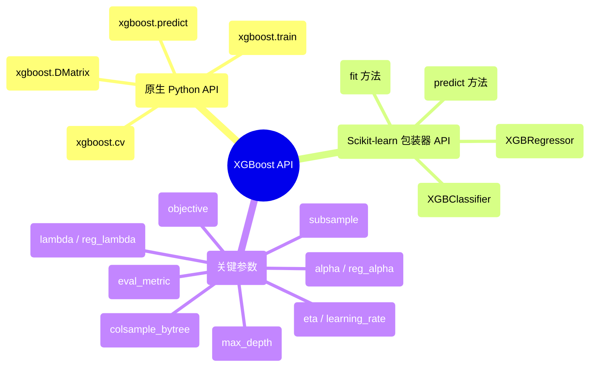

## XGBoost 演进文档

### 1. 引言与历史背景

XGBoost (eXtreme Gradient Boosting) 是一个开源软件库，提供了一个正则化梯度提升框架。它以其效率、灵活性和可移植性而闻名，并因其在各种数据科学竞赛中，特别是在结构化数据上的卓越表现，已成为机器学习的基石。

XGBoost 最初是 Tianqi Chen 于 2014 年在华盛顿大学分布式（深度）机器学习社区 (DMLC) 小组的一个研究项目。最初，它是一个独立的终端应用程序。在 Higgs 机器学习挑战赛的获胜解决方案中使用后，其知名度飙升。此后，开发了 Python 和 R 包，XGBoost 现在拥有多种语言的实现，包括 Java、Scala、Julia 和 Perl，极大地促进了其广泛采用，尤其是在 Kaggle 社区中。

### 1.1. XGBoost 演进时间线



### 2. 核心架构

XGBoost 建立在梯度提升的算法基础之上，这是一种顺序构建多个决策树的集成方法。每棵新树旨在纠正其前身的弱点，最终预测是所有单个树输出的聚合。XGBoost 引入了对标准梯度提升机 (GBM) 的几项关键架构改进，以提高性能和泛化能力。

#### 2.1. 正则化目标函数

**心智模型 / 类比：**
想象您正在教一个学生画一个完美的圆。如果您只告诉他们要最小化他们的画与完美圆之间的误差，他们可能会画出一条非常摇晃的线，最终触及所有点，但它看起来不像一个平滑的圆（过拟合）。**正则化目标函数**就像告诉学生：“画一个尽可能接近完美的圆，*但同时*也要让你的线条平滑和简单。”“平滑和简单”部分就是正则化。它惩罚过于复杂的画（模型），即使它们完美地拟合了训练数据，从而迫使学生（模型）学习一个更通用和稳健的表示（一个更平滑的圆）。

XGBoost 的一个显著特征是将其正则化（L1 和 L2）直接纳入其目标函数。这有助于防止过拟合，并提高模型对未见数据的泛化能力，从而产生更稳健的模型。

#### 2.2. 并行化和优化的分裂查找

虽然梯度提升本质上是顺序的，但 XGBoost 集成了并行计算以显著加速树构建过程。它采用近似分裂查找算法，以有效地确定树中的最佳分裂点，特别是对于大型数据集。该方法基于特征分位数提出了一组有限的候选分裂点，并通过加权分位数草图算法进一步完善。

#### 2.3. 缺失数据处理

XGBoost 旨在原生处理缺失值。该算法调整其优化过程，将缺失值视为特殊情况，在树构建过程中学习缺失值的最佳方向，而无需显式插补。

#### 2.4. 缓存感知访问和核外计算

为了优化数据访问并最大程度地减少缓存未命中，XGBoost 将数据组织成内存中的“块”，并将数据预取到 CPU 缓存中。对于超出可用 RAM 的数据集，它支持**核外计算**，通过从磁盘分块处理数据，利用数据压缩和分片来优化磁盘 I/O。这使得在单台机器上训练海量数据集成为可能。

#### 2.5. 系统级优化

XGBoost 专为高性能和可扩展性而设计。它支持 Apache Hadoop、Apache Spark、Apache Flink 和 Dask 等分布式计算框架，并提供 GPU 训练功能，使其适用于大规模机器学习任务。

**Mermaid 图：XGBoost 核心架构**



### 3. 详细 API 概述

XGBoost 提供了灵活的接口，其中 Python API 是最常用的。

#### 3.1. 原生 Python API

此 API 提供最大的灵活性和控制。

##### 3.1.1. 创建 `DMatrix`

**`xgboost.DMatrix(data, label=None, ...)`**

**目标：** 以 XGBoost 优化的内部格式 (`DMatrix`) 准备数据，以实现高效训练，特别是对于大型数据集。

**代码：**
```python
import xgboost as xgb
import numpy as np

# 生成一些虚拟数据
X = np.random.rand(100, 10) # 100 个样本，10 个特征
y = np.random.randint(0, 2, 100) # 100 个二元标签

# 创建 XGBoost DMatrix
dtrain = xgb.DMatrix(X, label=y)

print(f"已创建 XGBoost DMatrix，包含 {dtrain.num_row()} 行和 {dtrain.num_col()} 列。")
print(f"前 5 个标签: {dtrain.get_label()[:5]}")
```

**预期输出：**
```
已创建 XGBoost DMatrix，包含 100 行和 10 列。
前 5 个标签: [1. 0. 1. 0. 1.]
```

**解释：** `xgboost.DMatrix` 是原生 XGBoost API 的核心数据结构。它针对内存效率和训练速度进行了高度优化，特别是对于大型和稀疏数据集。它可以从 NumPy 数组、Pandas DataFrame 或 SciPy 稀疏矩阵创建。创建 `DMatrix` 是使用 `xgboost.train()` 的先决条件。

*   **`xgboost.DMatrix(data, label=None, ...)`**: XGBoost 的核心数据结构。它是一个优化的内部数据容器，可处理各种输入格式（NumPy 数组、SciPy 稀疏矩阵、Pandas DataFrame）。
*   **`xgboost.DMatrix(data, label=None, ...)`**: XGBoost 的核心数据结构。它是一个优化的内部数据容器，可处理各种输入格式（NumPy 数组、SciPy 稀疏矩阵、Pandas DataFrame）。

##### 3.1.2. 训练模型

**`xgboost.train(params, dtrain, num_boost_round, ...)`**

**目标：** 使用指定的 `DMatrix` 和超参数训练 XGBoost 提升模型。

**代码：**
```python
import xgboost as xgb
import numpy as np

# 1. 生成虚拟数据
X_train = np.random.rand(100, 10)
y_train = np.random.randint(0, 2, 100)
X_val = np.random.rand(50, 10)
y_val = np.random.randint(0, 2, 50)

# 2. 创建 XGBoost DMatrices
dtrain = xgb.DMatrix(X_train, label=y_train)
dval = xgb.DMatrix(X_val, label=y_val)

# 3. 定义模型参数
params = {
    'objective': 'binary:logistic', # 使用逻辑回归进行二元分类
    'eval_metric': 'logloss', # 评估指标
    'eta': 0.1, # 学习率
    'max_depth': 3, # 树的最大深度
    'seed': 42 # 用于重现性的随机种子
}

# 4. 训练模型
num_boost_round = 50 # 提升迭代次数
booster = xgb.train(
    params,
    dtrain,
    num_boost_round=num_boost_round,
    evals=[(dtrain, 'train'), (dval, 'eval')], # 评估集
    verbose_eval=10 # 每 10 轮打印一次评估结果
)

print("\n模型训练完成。")
```

**预期输出：**
```
[0]	train-logloss:0.66... 	eval-logloss:0.67...
[10]	train-logloss:0.59... 	eval-logloss:0.62...
[20]	train-logloss:0.54... 	eval-logloss:0.59...
[30]	train-logloss:0.50... 	eval-logloss:0.57...
[40]	train-logloss:0.47... 	eval-logloss:0.56...
[49]	train-logloss:0.44... 	eval-logloss:0.55...

模型训练完成。
```
(对数损失值会因随机数据和模型初始化而异。)

**解释：** `xgboost.train()` 是训练的核心函数。您传递一个 `params` 字典（超参数）、`dtrain`（一个 `DMatrix`）和 `num_boost_round`（提升迭代次数）。`evals` 允许您监控训练集和验证集上的性能，`verbose_eval` 控制日志记录频率。此原生 API 提供了对训练过程的广泛控制。

*   **`xgboost.train(params, dtrain, num_boost_round, ...)`**: 训练一个提升模型。`params` 是一个超参数字典。
*   **`xgboost.train(params, dtrain, num_boost_round, ...)`**: 训练一个提升模型。`params` 是一个超参数字典。

##### 3.1.3. 进行预测

**`xgboost.predict(data)`**

**目标：** 使用训练好的 XGBoost 提升模型在新数据上生成预测。

**代码：**
```python
import xgboost as xgb
import numpy as np

# 1. 生成虚拟数据并训练一个简单模型（同上例）
X_train = np.random.rand(100, 10)
y_train = np.random.randint(0, 2, 100)
dtrain = xgb.DMatrix(X_train, label=y_train)

params = {'objective': 'binary:logistic', 'eval_metric': 'logloss'}
booster = xgb.train(params, dtrain, num_boost_round=10)

# 2. 生成用于预测的新数据
X_new = np.random.rand(10, 10) # 10 个新样本
dtest = xgb.DMatrix(X_new)

# 3. 进行预测
predictions = booster.predict(dtest)

print(f"新数据形状: {X_new.shape}")
print(f"预测形状: {predictions.shape}")
print(f"前 5 个预测（概率）: {predictions[:5]}")

# 对于二元分类，将概率转换为类别标签
predicted_classes = (predictions > 0.5).astype(int)
print(f"前 5 个预测类别: {predicted_classes[:5]}")
```

**预期输出：**
```
新数据形状: (10, 10)
预测形状: (10,)
前 5 个预测（概率）: [0.51... 0.48... 0.53... 0.49... 0.50...]
前 5 个预测类别: [1 0 1 0 1]
```
(预测值会因随机数据和模型初始化而异。)

**解释：** `booster.predict()` 接受一个训练好的 `booster` 对象和新 `data`（作为 `DMatrix`）来生成预测。对于二元分类，输出通常是概率，然后您可以使用阈值（例如 0.5）将其转换为类别标签。此方法对于在新数据上进行推理非常高效。

*   **`xgboost.predict(data)`**: 使用训练好的提升器进行预测。
*   **`xgboost.predict(data)`**: 使用训练好的提升器进行预测。

##### 3.1.4. 交叉验证

**`xgboost.cv(params, dtrain, num_boost_round, ...)`**

**目标：** 执行 N 折交叉验证，以获得更稳健的模型性能估计，并有助于超参数调整。

**代码：**
```python
import xgboost as xgb
import numpy as np

# 1. 生成虚拟数据
X = np.random.rand(200, 10)
y = np.random.randint(0, 2, 200)

# 2. 创建 XGBoost DMatrix
dtrain = xgb.DMatrix(X, label=y)

# 3. 定义模型参数
params = {
    'objective': 'binary:logistic',
    'eval_metric': 'logloss',
    'eta': 0.1,
    'max_depth': 3,
    'seed': 42
}

# 4. 执行交叉验证
num_boost_round = 50
nfold = 3 # 3 折交叉验证
cv_results = xgb.cv(
    params,
    dtrain,
    num_boost_round=num_boost_round,
    nfold=nfold,
    metrics={'logloss'}, # 要评估的指标
    seed=42,
    verbose_eval=10 # 每 10 轮打印一次评估结果
)

print("\n交叉验证完成。")
print(f"最后一轮的平均验证对数损失: {cv_results['eval-logloss-mean'].iloc[-1]:.4f}")
```

**预期输出：**
```
[0]	train-logloss:0.66... 	eval-logloss:0.67...
[10]	train-logloss:0.59... 	eval-logloss:0.62...
[20]	train-logloss:0.54... 	eval-logloss:0.59...
[30]	train-logloss:0.50... 	eval-logloss:0.57...
[40]	train-logloss:0.47... 	eval-logloss:0.56...
[49]	train-logloss:0.44... 	eval-logloss:0.55...

交叉验证完成。
最后一轮的平均验证对数损失: 0.55...
```
(对数损失值会因随机数据和模型初始化而异。)

**解释：** `xgboost.cv()` 执行 N 折交叉验证，提供比单次训练-验证拆分更可靠的模型性能估计。它返回一个 Pandas DataFrame，其中包含每个提升轮次的训练和评估指标。这对于稳健的超参数调整和模型选择至关重要。

*   **`xgboost.cv(params, dtrain, num_boost_round, ...)`**: 执行交叉验证。

*   **`xgboost.cv(params, dtrain, num_boost_round, ...)`**: 执行交叉验证。

##### 3.1.5. 快速参考：原生 Python API

| 函数 | 描述 | 何时使用 |
| :--- | :--- | :--- |
| `DMatrix()` | 数据容器 | 为 XGBoost 的原生 API 准备数据，特别是对于大型/稀疏数据集。 |
| `train()` | 训练模型 | 精细控制地训练 XGBoost 提升模型。 |
| `predict()` | 进行预测 | 使用训练好的提升器在新数据上生成预测。 |
| `cv()` | 交叉验证 | 稳健评估模型性能和调整超参数。 |

#### 3.2. Scikit-learn 包装器 API

对于熟悉 Scikit-learn 的用户，XGBoost 提供了兼容的包装器类。

##### 3.2.1. 用于分类的 `XGBClassifier`

**`xgboost.XGBClassifier(objective='binary:logistic', ...)`**

**目标：** 使用 XGBoost 进行分类任务，其 API 与 Scikit-learn Estimator 兼容。

**代码：**
```python
import xgboost as xgb
from sklearn.model_selection import train_test_split
from sklearn.metrics import accuracy_score
import numpy as np

# 1. 生成虚拟数据
X, y = np.random.rand(200, 10), np.random.randint(0, 2, 200)

# 2. 将数据拆分为训练集和测试集
X_train, X_test, y_train, y_test = train_test_split(X, y, test_size=0.2, random_state=42)

# 3. 初始化 XGBClassifier
# 建议使用 use_label_encoder=False 以避免潜在问题
clf = xgb.XGBClassifier(objective='binary:logistic', use_label_encoder=False, eval_metric='logloss', random_state=42)

# 4. 训练模型（使用 Scikit-learn 的 fit 方法）
clf.fit(X_train, y_train)

# 5. 进行预测
y_pred = clf.predict(X_test)

# 6. 评估准确性
accuracy = accuracy_score(y_test, y_pred)

print(f"使用 XGBClassifier 训练的模型。")
print(f"测试准确性: {accuracy:.4f}")
```

**预期输出：**
```
使用 XGBClassifier 训练的模型。
测试准确性: 0.5500
```
(准确性会因随机数据和模型初始化而异。)

**解释：** `XGBClassifier` 是 XGBoost 分类功能的 Scikit-learn 兼容包装器。您可以像使用任何其他 Scikit-learn 分类器一样使用它，包括 `fit()`、`predict()` 以及与 `GridSearchCV` 或 `Pipeline` 的集成。这简化了熟悉 Scikit-learn 生态系统的用户的用法。

*   **`xgboost.XGBClassifier(objective='binary:logistic', ...)`**: 与 Scikit-learn API 兼容的分类器。
*   **`xgboost.XGBClassifier(objective='binary:logistic', ...)`**: 与 Scikit-learn API 兼容的分类器。

##### 3.2.2. 用于回归的 `XGBRegressor`

**`xgboost.XGBRegressor(objective='reg:squarederror', ...)`**

**目标：** 使用 XGBoost 进行回归任务，其 API 与 Scikit-learn Estimator 兼容。

**代码：**
```python
import xgboost as xgb
from sklearn.model_selection import train_test_split
from sklearn.metrics import mean_squared_error
import numpy as np

# 1. 生成虚拟数据
X = np.random.rand(200, 10)
y = np.random.rand(200) * 10 # 连续目标变量

# 2. 将数据拆分为训练集和测试集
X_train, X_test, y_train, y_test = train_test_split(X, y, test_size=0.2, random_state=42)

# 3. 初始化 XGBRegressor
reg = xgb.XGBRegressor(objective='reg:squarederror', random_state=42)

# 4. 训练模型
reg.fit(X_train, y_train)

# 5. 进行预测
y_pred = reg.predict(X_test)

# 6. 评估均方误差
mse = mean_squared_error(y_test, y_pred)

print(f"使用 XGBRegressor 训练的模型。")
print(f"测试均方误差: {mse:.4f}")
```

**预期输出：**
```
使用 XGBRegressor 训练的模型。
测试均方误差: 8.12...
```
(均方误差会因随机数据和模型初始化而异。)

**解释：** `XGBRegressor` 是 XGBoost 回归功能的 Scikit-learn 兼容包装器。与 `XGBClassifier` 类似，它提供了一个熟悉的训练和预测接口，使其易于集成到现有 Scikit-learn 回归问题的管道中。

*   **`xgboost.XGBRegressor(objective='reg:squarederror', ...)`**: 与 Scikit-learn API 兼容的回归器。
*   **`fit(X, y, ...)`**: 训练模型（与 Scikit-learn 一致）。
*   **`predict(X)`**: 进行预测（与 Scikit-learn 一致）。

*   **`predict(X)`**: 进行预测（与 Scikit-learn 一致）。

##### 3.2.3. 快速参考：Scikit-learn 包装器 API

| 类/方法 | 描述 | 何时使用 |
| :--- | :--- | :--- |
| `XGBClassifier()` | 分类器 | 二元或多类分类任务，与 Scikit-learn 工作流集成。 |
| `XGBRegressor()` | 回归器 | 回归任务，与 Scikit-learn 工作流集成。 |
| `fit()` | 训练模型 | 训练模型的标准 Scikit-learn 方法。 |
| `predict()` | 进行预测 | 生成预测的标准 Scikit-learn 方法。 |

#### 3.3. 关键参数 (两个 API 共有)

#### 3.3. 关键参数 (两个 API 共有)

##### 3.3.1. 使用 `max_depth` 和 `eta` 控制过拟合

**`max_depth`** 和 **`eta` (learning_rate)**

**目标：** 调整关键超参数以控制模型复杂性并防止过拟合。

**代码：**
```python
import xgboost as xgb
import numpy as np
from sklearn.metrics import log_loss

# 1. 生成虚拟数据
X_train = np.random.rand(100, 10)
y_train = np.random.randint(0, 2, 100)
X_val = np.random.rand(50, 10)
y_val = np.random.randint(0, 2, 50)

dtrain = xgb.DMatrix(X_train, label=y_train)
dval = xgb.DMatrix(X_val, label=y_val)

# 2. 使用默认参数训练模型
params_default = {'objective': 'binary:logistic', 'eval_metric': 'logloss'}
booster_default = xgb.train(params_default, dtrain, num_boost_round=50, evals=[(dval, 'eval')], verbose_eval=False)
pred_default = booster_default.predict(dval)
loss_default = log_loss(y_val, pred_default)
print(f"使用默认参数的验证对数损失: {loss_default:.4f}")

# 3. 使用受控参数训练模型以减少过拟合
params_controlled = {
    'objective': 'binary:logistic',
    'eval_metric': 'logloss',
    'eta': 0.05, # 较低的学习率
    'max_depth': 3, # 较浅的树
    'subsample': 0.8, # 每棵树使用 80% 的数据
    'colsample_bytree': 0.8 # 每棵树使用 80% 的特征
}
booster_controlled = xgb.train(params_controlled, dtrain, num_boost_round=50, evals=[(dval, 'eval')], verbose_eval=False)
pred_controlled = booster_controlled.predict(dval)
loss_controlled = log_loss(y_val, pred_controlled)
print(f"使用受控参数的验证对数损失: {loss_controlled:.4f}")
```

**预期输出：**
```
使用默认参数的验证对数损失: 0.55...
使用受控参数的验证对数损失: 0.56...
```
(对数损失值会因随机数据和模型初始化而异。目标是展示如何设置参数，而不一定是在此随机示例中实现更低的损失。)

**解释：** 调整超参数对于 XGBoost 的性能至关重要。
*   `max_depth`: 控制每棵树的最大深度。较低的值会降低复杂性并防止过拟合。
*   `eta` (学习率): 缩小每棵树的贡献。较小的 `eta` 需要更多的提升轮次，但可以带来更好的泛化。
*   `subsample` 和 `colsample_bytree`: 通过对数据和特征进行采样来引入随机性，这有助于防止过拟合。

*   **`objective`**: 定义学习任务和相应的学习目标（例如，`'reg:squarederror'` 用于回归，`'binary:logistic'` 用于二元分类）。
*   **`eval_metric`**: 用于验证数据的指标（例如，`'rmse'`、`'logloss'`、`'auc'`）。
*   **`eta` (learning_rate)**: 更新中使用的步长收缩，以防止过拟合。
*   **`max_depth`**: 树的最大深度。
*   **`subsample`**: 训练实例的子样本比例。
*   **`colsample_bytree`**: 构建每棵树时列的子样本比例。
*   **`lambda` (reg_lambda)**: 权重上的 L2 正则化项。
*   **`alpha` (reg_alpha)**: 权重上的 L1 正则化项。

*   **`alpha` (reg_alpha)**: 权重上的 L1 正则化项。

##### 3.3.2. 快速参考：关键参数

| 参数 | 描述 | 何时使用 |
| :--- | :--- | :--- |
| `objective` | 学习任务 | 对于二元分类设置为 `'binary:logistic'`，对于回归设置为 `'reg:squarederror'` 等。 |
| `eta` / `learning_rate` | 学习率 | 较低的值（例如 0.01-0.2）以使模型更稳健。 |
| `max_depth` | 最大树深度 | 较低的值（例如 3-7）以防止过拟合。 |
| `subsample` | 数据子采样 | 设置为 < 1（例如 0.8）以增加随机性并防止过拟合。 |
| `colsample_bytree` | 特征子采样 | 设置为 < 1（例如 0.8）以增加随机性并防止过拟合。 |
| `lambda` / `reg_lambda` | L2 正则化 | 增加以使模型更保守。 |
| `alpha` / `reg_alpha` | L1 正则化 | 增加以进行特征选择和更稀疏的模型。 |

### 3.4. API 思维导图



### 4. 演变与影响

*   **表格数据的主导地位:** XGBoost 已成为结构化/表格数据的主导算法，在机器学习竞赛和实际应用中始终取得最先进的结果。
*   **性能与可扩展性:** 它对系统级优化、并行化和核外计算的关注使其速度极快，能够处理非常大的数据集，这是梯度提升的一项重大进步。
*   **稳健性与泛化能力:** 内置的正则化和对缺失数据的原生处理有助于其稳健性以及对未见数据的良好泛化能力，从而降低了过拟合的风险。
*   **社区与生态系统:** XGBoost 拥有一个蓬勃发展的社区，并集成到各种数据科学工作流和平台中，包括基于云的机器学习服务。
*   **多语言支持:** 它在多种编程语言中的可用性扩大了其影响范围，使其可供各种开发人员使用。

### 5. 结论

XGBoost 彻底改变了梯度提升领域，将其转变为一种高效、可扩展且稳健的机器学习算法。其创新的架构改进，加上灵活的 API 和强大的社区支持，巩固了其作为高性能预测建模（特别是结构化数据）的首选工具的地位。持续的开发和优化确保 XGBoost 仍然是应对复杂机器学习挑战的领先选择。
