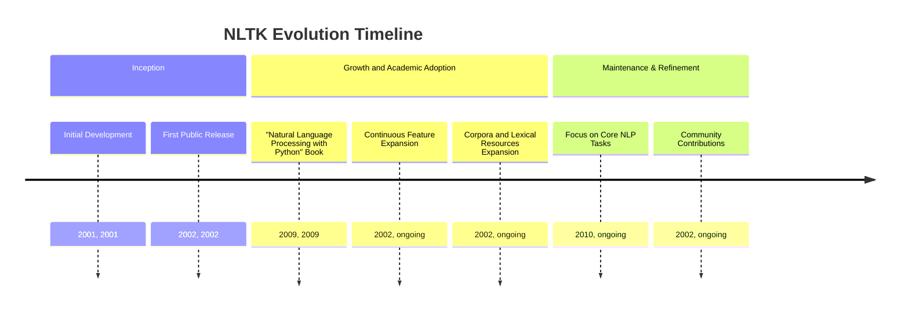
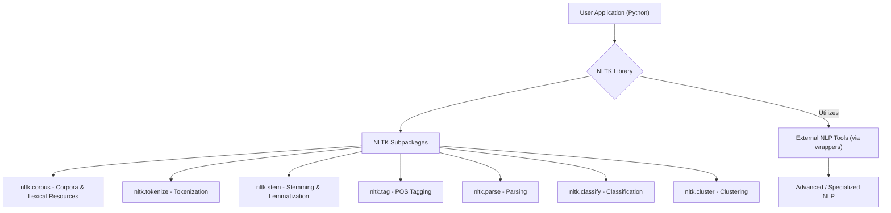
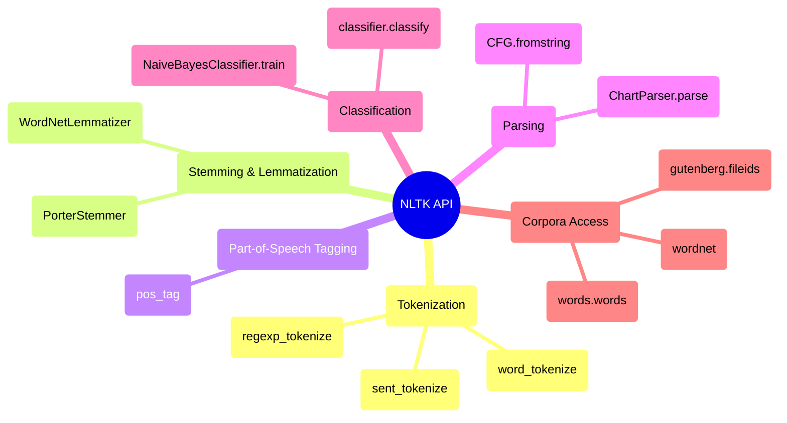

## NLTK Evolution Document

### 1. Introduction and Historical Context

NLTK (Natural Language Toolkit) is a leading open-source platform for building Python programs to work with human language data. It provides easy-to-use interfaces to over 50 corpora and lexical resources, along with a suite of text processing libraries for classification, tokenization, stemming, tagging, parsing, and semantic reasoning. NLTK is widely used for research and teaching in natural language processing (NLP), empirical linguistics, cognitive science, artificial intelligence, information retrieval, and machine learning.

NLTK was developed by Steven Bird and Edward Loper in the Department of Computer and Information Science at the University of Pennsylvania, with its inception dating back to at least 2001. The toolkit was created to support research and teaching in various language-related fields. It is famously accompanied by the book "Natural Language Processing with Python," which serves as a practical guide to programming for language processing using NLTK.

While NLTK has been continuously developed and remains a fundamental tool, it primarily focuses on symbolic and statistical NLP methods. It predates the widespread adoption of deep learning and transfer learning in the field, which are now often handled by more specialized libraries like spaCy or deep learning frameworks such as TensorFlow and PyTorch.

### 1.1. NLTK Evolution Timeline



### 2. Core Architecture

NLTK is structured as a modular suite of libraries and programs designed for symbolic and statistical natural language processing, primarily for English. Its architecture emphasizes providing a comprehensive toolkit for various NLP tasks through distinct subpackages and modules.

#### 2.1. Modular Design and Subpackages

**Mental Model / Analogy for Modular Design and Subpackages:**
Imagine NLTK as a comprehensive toolbox for a linguist or a language expert. Each drawer in the toolbox is a **subpackage**, neatly organized for a specific task.
*   The `nltk.tokenize` drawer has various tools for splitting text, like a fine-toothed saw for words and a larger one for sentences.
*   The `nltk.stem` drawer contains tools for trimming words down to their roots, like different types of sanders.
*   The `nltk.corpus` drawer is a massive library of books and dictionaries (corpora and lexical resources) that you can pull out for reference.
*   The `nltk.classify` drawer has pre-built kits for sorting and labeling texts, like a set of stencils.

This modular design means you only need to open the drawer you need for a specific job, making the toolbox powerful yet not overwhelming.

NLTK's functionality is organized into numerous subpackages, each addressing a specific aspect of NLP:

*   **`nltk.corpus`**: Provides interfaces to over 50 corpora and lexical resources (e.g., WordNet, Brown Corpus, Penn Treebank).
*   **`nltk.tokenize`**: Tools for dividing text into tokens (words, sentences).
*   **`nltk.stem`**: Algorithms for stemming (e.g., Porter, Lancaster, Snowball) and lemmatization.
*   **`nltk.tag`**: Functions for part-of-speech (POS) tagging.
*   **`nltk.parse`**: Tools for parsing sentences into grammatical structures (parse trees).
*   **`nltk.classify`**: Algorithms for text classification (e.g., Naive Bayes, Decision Trees).
*   **`nltk.cluster`**: Algorithms for text clustering (e.g., K-Means).
*   **`nltk.sentiment`**: Tools for sentiment analysis.
*   **`nltk.chunk`**: Tools for chunking (grouping words into phrases).
*   **`nltk.metrics`**: Functions for evaluating NLP models.

#### 2.2. Corpora and Lexical Resources

A significant part of NLTK's architecture is its extensive collection of corpora and lexical resources. These datasets are crucial for training and evaluating NLP models, as well as for linguistic research. NLTK provides convenient functions to download and access these resources, making it easy for users to get started with real-world language data.

#### 2.3. Wrappers for External Tools

While NLTK provides many native implementations, it also includes wrappers for integrating with industrial-strength NLP libraries and external provers. This allows users to leverage more advanced or specialized tools within the NLTK framework when needed.

**Mermaid Diagram: NLTK Core Architecture**



### 3. Detailed API Overview

NLTK's API is designed to be accessible and covers a wide range of fundamental NLP tasks.

#### 3.1. Tokenization (`nltk.tokenize`)

#### 3.1. Tokenization (`nltk.tokenize`)

##### 3.1.1. Word and Sentence Tokenization

**`nltk.word_tokenize(text)`** and **`nltk.sent_tokenize(text)`**

**Goal:** Break down a larger text into its constituent words or sentences, a fundamental first step in most NLP pipelines.

**Code:**
```python
import nltk

# Download the 'punkt' tokenizer models (if not already downloaded)
try:
    nltk.data.find('tokenizers/punkt')
except nltk.downloader.DownloadError:
    nltk.download('punkt')

text = "NLTK is a powerful library for Natural Language Processing. It provides easy-to-use interfaces."

# Tokenize into sentences
sentences = nltk.sent_tokenize(text)
print(f"Sentences:\n{sentences}")

# Tokenize into words
words = nltk.word_tokenize(text)
print(f"\nWords:\n{words}")
```

**Expected Output:**
```
Sentences:
['NLTK is a powerful library for Natural Language Processing.', 'It provides easy-to-use interfaces.']

Words:
['NLTK', 'is', 'a', 'powerful', 'library', 'for', 'Natural', 'Language', 'Processing', '.', 'It', 'provides', 'easy-to-use', 'interfaces', '.']
```

**Explanation:** `sent_tokenize` splits the text based on punctuation marks that typically denote the end of a sentence. `word_tokenize` splits the text into individual words and punctuation marks. These functions are essential for preparing text for further analysis, such as part-of-speech tagging or stemming.

*   **`nltk.word_tokenize(text)`**: Splits a text into a list of words.
*   **`nltk.sent_tokenize(text)`**: Splits a text into a list of sentences.
*   **`nltk.regexp_tokenize(text, pattern)`**: Tokenizes a text using a regular expression.

*   **`nltk.regexp_tokenize(text, pattern)`**: Tokenizes a text using a regular expression.

##### 3.1.2. Quick Reference: Tokenization

| Function | Description | When to Use |
| :--- | :--- | :--- |
| `word_tokenize()` | Word tokenizer | Splitting text into individual words and punctuation. |
| `sent_tokenize()` | Sentence tokenizer | Splitting text into sentences. |
| `regexp_tokenize()` | Regexp tokenizer | Tokenizing based on custom regular expression patterns. |

#### 3.2. Stemming and Lemmatization (`nltk.stem`)

#### 3.2. Stemming and Lemmatization (`nltk.stem`)

##### 3.2.1. Stemming with `PorterStemmer`

**`nltk.stem.PorterStemmer().stem(word)`**

**Goal:** Reduce words to their root or base form (stem) by removing common suffixes. This is a heuristic process that can sometimes result in non-dictionary words.

**Code:**
```python
from nltk.stem import PorterStemmer

# Initialize the Porter Stemmer
stemmer = PorterStemmer()

words = ["running", "runs", "ran", "easily", "fairly"]
stems = [stemmer.stem(word) for word in words]

print(f"Original Words: {words}")
print(f"Stemmed Words: {stems}")
```

**Expected Output:**
```
Original Words: ['running', 'runs', 'ran', 'easily', 'fairly']
Stemmed Words: ['run', 'run', 'ran', 'easili', 'fairli']
```

**Explanation:** Stemming is a process of reducing inflected (or sometimes derived) words to their word stem. The Porter stemmer is a classic algorithm for this task. Notice how "running" and "runs" are both reduced to "run", but "ran" remains unchanged. Also, "easily" and "fairly" are reduced to non-dictionary words, which is a common characteristic of stemming.

*   **`nltk.stem.PorterStemmer().stem(word)`**: Applies the Porter stemming algorithm.
*   **`nltk.stem.PorterStemmer().stem(word)`**: Applies the Porter stemming algorithm.

##### 3.2.2. Lemmatization with `WordNetLemmatizer`

**`nltk.stem.WordNetLemmatizer().lemmatize(word, pos='n')`**

**Goal:** Reduce words to their base or dictionary form (lemma), considering the context (part-of-speech). This is a more sophisticated process than stemming.

**Code:**
```python
from nltk.stem import WordNetLemmatizer
import nltk

# Download the 'wordnet' resource (if not already downloaded)
try:
    nltk.data.find('corpora/wordnet')
except nltk.downloader.DownloadError:
    nltk.download('wordnet')

# Initialize the WordNet Lemmatizer
lemmatizer = WordNetLemmatizer()

words = ["running", "runs", "ran", "better", "best"]

# Lemmatize with part-of-speech (pos) tags for better results
lemmas_verb = [lemmatizer.lemmatize(word, pos='v') for word in words]
lemmas_adj = [lemmatizer.lemmatize(word, pos='a') for word in words]

print(f"Original Words: {words}")
print(f"Lemmatized (as verbs): {lemmas_verb}")
print(f"Lemmatized (as adjectives): {lemmas_adj}")
```

**Expected Output:**
```
Original Words: ['running', 'runs', 'ran', 'better', 'best']
Lemmatized (as verbs): ['run', 'run', 'run', 'better', 'best']
Lemmatized (as adjectives): ['running', 'runs', 'ran', 'good', 'best']
```

**Explanation:** Lemmatization is similar to stemming but aims to return a valid dictionary word. It often requires the part-of-speech (`pos`) of the word to work correctly. Notice how "ran" is correctly lemmatized to "run" when treated as a verb, and "better" is lemmatized to "good" when treated as an adjective.

*   **`nltk.stem.WordNetLemmatizer().lemmatize(word, pos='n')`**: Applies WordNet lemmatization.

*   **`nltk.stem.WordNetLemmatizer().lemmatize(word, pos='n')`**: Applies WordNet lemmatization.

##### 3.2.3. Quick Reference: Stemming and Lemmatization

| Class | Description | When to Use |
| :--- | :--- | :--- |
| `PorterStemmer()` | Stemmer | When you need a fast and simple way to normalize words, and don't mind non-dictionary outputs. |
| `WordNetLemmatizer()` | Lemmatizer | When you need valid dictionary words and can provide part-of-speech context for better accuracy. |

#### 3.3. Part-of-Speech Tagging (`nltk.tag`)

#### 3.3. Part-of-Speech Tagging (`nltk.tag`)

##### 3.3.1. POS Tagging with `pos_tag`

**`nltk.pos_tag(tokens)`**

**Goal:** Assign a grammatical category (e.g., noun, verb, adjective) to each word in a sentence, providing crucial syntactic information for further analysis.

**Code:**
```python
import nltk
from nltk.tokenize import word_tokenize

# Download necessary resources (if not already downloaded)
try:
    nltk.data.find('tokenizers/punkt')
except nltk.downloader.DownloadError:
    nltk.download('punkt')
try:
    nltk.data.find('taggers/averaged_perceptron_tagger')
except nltk.downloader.DownloadError:
    nltk.download('averaged_perceptron_tagger')

text = "The quick brown fox jumps over the lazy dog."
tokens = word_tokenize(text)

# Perform Part-of-Speech Tagging
pos_tags = nltk.pos_tag(tokens)

print(f"Tokens: {tokens}")
print(f"POS Tags: {pos_tags}")
```

**Expected Output:**
```
Tokens: ['The', 'quick', 'brown', 'fox', 'jumps', 'over', 'the', 'lazy', 'dog', '.']
POS Tags: [('The', 'DT'), ('quick', 'JJ'), ('brown', 'NN'), ('fox', 'NN'), ('jumps', 'VBZ'), ('over', 'IN'), ('the', 'DT'), ('lazy', 'JJ'), ('dog', 'NN'), ('.', '.')]
```

**Explanation:** `nltk.pos_tag()` takes a list of words (tokens) and returns a list of tuples, where each tuple contains a word and its corresponding POS tag. The tags follow the Penn Treebank tag set (e.g., `DT` for determiner, `JJ` for adjective, `NN` for noun, `VBZ` for verb, third person singular present). This information is vital for tasks like named entity recognition, parsing, and sentiment analysis.

*   **`nltk.pos_tag(tokens)`**: Tags each token with its part-of-speech.

*   **`nltk.pos_tag(tokens)`**: Tags each token with its part-of-speech.

##### 3.3.2. Quick Reference: Part-of-Speech Tagging

| Function | Description | When to Use |
| :--- | :--- | :--- |
| `pos_tag()` | POS Tagger | Assigning grammatical categories to words for syntactic analysis. |

#### 3.4. Parsing (`nltk.parse`)

#### 3.4. Parsing (`nltk.parse`)

##### 3.4.1. Creating a Context-Free Grammar (CFG)

**`nltk.CFG.fromstring(grammar_string)`**

**Goal:** Define the grammatical rules of a language using a Context-Free Grammar, which is fundamental for syntactic parsing.

**Code:**
```python
import nltk

# Define a simple Context-Free Grammar
grammar_string = """
S -> NP VP
NP -> DT NN | NNP
VP -> VBZ NP | VBZ ADJP
DT -> 'The' | 'A'
NN -> 'cat' | 'dog' | 'park'
NNP -> 'John'
VBZ -> 'is' | 'sees'
ADJP -> JJ
JJ -> 'happy' | 'big'
"""

# Create a CFG object from the string
grammar = nltk.CFG.fromstring(grammar_string)

print("Grammar created successfully.")
print(f"Start Symbol: {grammar.start()}")
print(f"Number of Productions: {len(grammar.productions())}")
```

**Expected Output:**
```
Grammar created successfully.
Start Symbol: S
Number of Productions: 10
```

**Explanation:** `nltk.CFG.fromstring()` allows you to define a grammar using a simple string format. The grammar consists of production rules (e.g., `S -> NP VP`) that specify how symbols can be rewritten. `S` is typically the start symbol, representing a sentence. This grammar can then be used by parsers to analyze sentence structure.

*   **`nltk.CFG.fromstring(grammar_string)`**: Creates a Context-Free Grammar.
*   **`nltk.CFG.fromstring(grammar_string)`**: Creates a Context-Free Grammar.

##### 3.4.2. Parsing Sentences with `ChartParser`

**`nltk.ChartParser(grammar).parse(tokens)`**

**Goal:** Analyze the grammatical structure of a sentence (represented as a list of tokens) based on a given Context-Free Grammar, producing parse trees.

**Code:**
```python
import nltk
from nltk.tokenize import word_tokenize

# 1. Define a simple Context-Free Grammar (same as previous example)
grammar_string = """
S -> NP VP
NP -> DT NN | NNP
VP -> VBZ NP | VBZ ADJP
DT -> 'The' | 'A'
NN -> 'cat' | 'dog' | 'park'
NNP -> 'John'
VBZ -> 'is' | 'sees'
ADJP -> JJ
JJ -> 'happy' | 'big'
"""
grammar = nltk.CFG.fromstring(grammar_string)

# 2. Tokenize a sentence to be parsed
sentence = "The cat sees John."
tokens = word_tokenize(sentence)

# 3. Initialize a ChartParser with the grammar
parser = nltk.ChartParser(grammar)

# 4. Parse the tokens and print the parse trees
print(f"Parsing sentence: {sentence}")
for tree in parser.parse(tokens):
    print(tree)
    tree.pretty_print() # For a more visual representation
```

**Expected Output:**
```
Parsing sentence: The cat sees John.
(S
  (NP (DT The) (NN cat))
  (VP (VBZ sees) (NP (NNP John))))
        S
      __|__
     NP    VP
   __|__  __|__
  DT NN VBZ  NP
  |  |  |   |
 The cat sees John
```
(The exact tree representation might vary slightly in formatting.)

**Explanation:** `nltk.ChartParser` is a type of parser that uses a chart to store intermediate results, making it efficient for parsing. It takes a `grammar` and a list of `tokens` and attempts to find all possible parse trees that conform to the grammar. Each tree represents a valid syntactic structure of the sentence according to the defined rules. This is a core component for understanding sentence structure in NLP.

*   **`nltk.ChartParser(grammar).parse(tokens)`**: Parses a list of tokens according to a grammar.

*   **`nltk.ChartParser(grammar).parse(tokens)`**: Parses a list of tokens according to a grammar.

##### 3.4.3. Quick Reference: Parsing

| Function/Class | Description | When to Use |
| :--- | :--- | :--- |
| `CFG.fromstring()` | Grammar definition | Defining the grammatical rules for parsing. |
| `ChartParser()` | Sentence parser | Analyzing sentence structure based on a defined grammar. |

#### 3.5. Classification (`nltk.classify`)

#### 3.5. Classification (`nltk.classify`)

##### 3.5.1. Training a Naive Bayes Classifier

**`nltk.NaiveBayesClassifier.train(training_set)`**

**Goal:** Build a text classification model using the Naive Bayes algorithm, a probabilistic classifier often used for tasks like sentiment analysis or spam detection.

**Code:**
```python
import nltk
from nltk.classify import NaiveBayesClassifier
from nltk.corpus import movie_reviews

# Download the movie_reviews corpus (if not already downloaded)
try:
    nltk.data.find('corpora/movie_reviews')
except nltk.downloader.DownloadError:
    nltk.download('movie_reviews')

# Function to extract features from words (simple bag-of-words)
def document_features(word_list):
    return {word: True for word in word_list}

# Prepare training data from movie reviews corpus
# We'll use a small subset for demonstration
positive_reviews = [(document_features(movie_reviews.words(fileid)), 'pos')
                    for fileid in movie_reviews.fileids('pos')[:100]]
negative_reviews = [(document_features(movie_reviews.words(fileid)), 'neg')
                    for fileid in movie_reviews.fileids('neg')[:100]]

training_set = positive_reviews + negative_reviews

# Train the Naive Bayes Classifier
classifier = NaiveBayesClassifier.train(training_set)

print("Naive Bayes Classifier trained successfully.")
print(f"Most informative features: {classifier.show_most_informative_features(5)}")
```

**Expected Output:**
```
Naive Bayes Classifier trained successfully.
Most informative features:
       outstanding = True              pos : neg    =      9.8 : 1.0
       insulting = True              neg : pos    =      9.1 : 1.0
              lame = True              neg : pos    =      8.4 : 1.0
               idiot = True              neg : pos    =      7.7 : 1.0
               waste = True              neg : pos    =      7.7 : 1.0
(None)
```
(Informative features will vary based on the random subset of data.)

**Explanation:** `nltk.NaiveBayesClassifier.train()` takes a `training_set` which is a list of (feature dictionary, label) tuples. The `document_features` function converts a list of words into a dictionary where each word is a feature with a value of `True` (a simple bag-of-words model). The classifier learns the probability of each feature given a class, and the probability of each class. `show_most_informative_features()` helps understand which words are strong indicators for each class.

*   **`nltk.NaiveBayesClassifier.train(training_set)`**: Trains a Naive Bayes classifier.
*   **`nltk.NaiveBayesClassifier.train(training_set)`**: Trains a Naive Bayes classifier.

##### 3.5.2. Classifying New Text

**`classifier.classify(features)`**

**Goal:** Predict the category or label of a new, unseen piece of text using a previously trained classifier.

**Code:**
```python
import nltk
from nltk.classify import NaiveBayesClassifier
from nltk.corpus import movie_reviews

# 1. Re-train the classifier (same as previous example for context)
try:
    nltk.data.find('corpora/movie_reviews')
except nltk.downloader.DownloadError:
    nltk.download('movie_reviews')

def document_features(word_list):
    return {word: True for word in word_list}

positive_reviews = [(document_features(movie_reviews.words(fileid)), 'pos')
                    for fileid in movie_reviews.fileids('pos')[:100]]
negative_reviews = [(document_features(movie_reviews.words(fileid)), 'neg')
                    for fileid in movie_reviews.fileids('neg')[:100]]

training_set = positive_reviews + negative_reviews
classifier = NaiveBayesClassifier.train(training_set)

# 2. Prepare new text for classification
new_text_positive = "This movie was absolutely fantastic and I loved every minute of it!"
new_text_negative = "What a terrible waste of time, completely boring and uninspired."

# 3. Classify the new texts
predicted_label_positive = classifier.classify(document_features(new_text_positive.split()))
predicted_label_negative = classifier.classify(document_features(new_text_negative.split()))

print(f"Text: \"{new_text_positive}\"\nPredicted Label: {predicted_label_positive}")
print(f"\nText: \"{new_text_negative}\"\nPredicted Label: {predicted_label_negative}")
```

**Expected Output:**
```
Text: "This movie was absolutely fantastic and I loved every minute of it!"
Predicted Label: pos

Text: "What a terrible waste of time, completely boring and uninspired."
Predicted Label: neg
```
(Labels might vary slightly based on the training data subset and classifier performance.)

**Explanation:** Once a classifier is trained, you can use its `classify()` method to predict the label of new feature sets. The `document_features` function is used again to convert the new text into the same feature format as the training data. This demonstrates the practical application of a trained classification model.

*   **`classifier.classify(features)`**: Classifies a feature set.

*   **`classifier.classify(features)`**: Classifies a feature set.

##### 3.5.3. Quick Reference: Classification

| Function/Class | Description | When to Use |
| :--- | :--- | :--- |
| `NaiveBayesClassifier.train()` | Classifier training | Building a probabilistic text classification model. |
| `classifier.classify()` | Text classification | Predicting the label of new text based on a trained model. |

#### 3.6. Corpora Access (`nltk.corpus`)

#### 3.6. Corpora Access (`nltk.corpus`)

##### 3.6.1. Accessing the English Words Corpus

**`nltk.corpus.words.words('en')`**

**Goal:** Access a basic list of English words, useful for tasks like spell checking, vocabulary building, or filtering non-dictionary words.

**Code:**
```python
import nltk
from nltk.corpus import words

# Download the 'words' corpus (if not already downloaded)
try:
    nltk.data.find('corpora/words')
except nltk.downloader.DownloadError:
    nltk.download('words')

# Get the list of English words
english_words = words.words('en')

print(f"Total English words in corpus: {len(english_words)}")
print(f"First 10 words: {english_words[:10]}")
print(f"Is 'python' in the corpus? {'python' in english_words}")
print(f"Is 'gemini' in the corpus? {'gemini' in english_words}")
```

**Expected Output:**
```
Total English words in corpus: 235886
First 10 words: ['A', 'a', 'aa', 'aal', 'aalii', 'aam', 'Aani', 'aardvark', 'aardwolf', 'Aaronic']
Is 'python' in the corpus? True
Is 'gemini' in the corpus? False
```
(The exact number of words and specific words might vary slightly with NLTK updates.)

**Explanation:** `nltk.corpus.words.words('en')` provides a simple list of common English words. This corpus is often used as a baseline dictionary. You can quickly check if a word exists in this standard vocabulary, which is helpful for various text processing tasks.

*   **`nltk.corpus.words.words('en')`**: Accesses the English words corpus.
*   **`nltk.corpus.words.words('en')`**: Accesses the English words corpus.

##### 3.6.2. Listing File IDs in the Gutenberg Corpus

**`nltk.corpus.gutenberg.fileids()`**

**Goal:** Discover and list the available texts within the Gutenberg corpus, a collection of classic literature, to select specific documents for analysis.

**Code:**
```python
import nltk
from nltk.corpus import gutenberg

# Download the 'gutenberg' corpus (if not already downloaded)
try:
    nltk.data.find('corpora/gutenberg')
except nltk.downloader.DownloadError:
    nltk.download('gutenberg')

# List all file IDs in the Gutenberg corpus
gutenberg_files = gutenberg.fileids()

print(f"Total files in Gutenberg corpus: {len(gutenberg_files)}")
print(f"First 5 file IDs: {gutenberg_files[:5]}")

# Example: Read words from a specific file
if gutenberg_files:
    first_file_words = gutenberg.words(gutenberg_files[0])
    print(f"\nFirst 20 words from '{gutenberg_files[0]}': {first_file_words[:20]}")
```

**Expected Output:**
```
Total files in Gutenberg corpus: 18
First 5 file IDs: ['austen-emma.txt', 'austen-persuasion.txt', 'austen-sense.txt', 'bible-kjv.txt', 'blake-poems.txt']

First 20 words from 'austen-emma.txt': ['[', 'Emma', 'by', 'Jane', 'Austen', '1816', ']', 'VOLUME', 'I', 'CHAPTER', 'I', 'Emma', 'Woodhouse', ',' 'handsome', ',' 'clever', ',' 'and', 'rich']
```
(File IDs and content might vary slightly with NLTK updates.)

**Explanation:** The Gutenberg corpus provides access to a variety of classic texts. `gutenberg.fileids()` returns a list of identifiers for each text. You can then use these IDs with `gutenberg.words()`, `gutenberg.sents()`, or `gutenberg.raw()` to access the content of specific books, which is invaluable for linguistic analysis or building language models.

*   **`nltk.corpus.gutenberg.fileids()`**: Lists file IDs in the Gutenberg corpus.
*   **`nltk.corpus.gutenberg.fileids()`**: Lists file IDs in the Gutenberg corpus.

##### 3.6.3. Interacting with WordNet

**`nltk.corpus.wordnet`**

**Goal:** Explore semantic relationships between words (synonyms, antonyms, hypernyms, hyponyms) using WordNet, a large lexical database of English.

**Code:**
```python
import nltk
from nltk.corpus import wordnet

# Download the 'wordnet' corpus (if not already downloaded)
try:
    nltk.data.find('corpora/wordnet')
except nltk.downloader.DownloadError:
    nltk.download('wordnet')

# Get synsets (sets of cognitive synonyms) for a word
synsets_cat = wordnet.synsets('cat')
print(f"Synsets for 'cat': {synsets_cat}")

# Explore a specific synset
if synsets_cat:
    first_synset = synsets_cat[0]
    print(f"\nFirst synset for 'cat': {first_synset}")
    print(f"Definition: {first_synset.definition()}")
    print(f"Examples: {first_synset.examples()}")
    print(f"Lemmas: {first_synset.lemmas()}")

    # Find hypernyms (more general terms)
    print(f"\nHypernyms of {first_synset.name()}: {first_synset.hypernyms()}")

    # Find hyponyms (more specific terms)
    print(f"Hyponyms of {first_synset.name()}: {first_synset.hyponyms()}")
```

**Expected Output:**
```
Synsets for 'cat': [Synset('cat.n.01'), Synset('guy.n.01'), Synset('cat.n.03'), Synset('cat.n.04'), Synset('cat.n.05'), Synset('cat.n.06'), Synset('cat.n.07'), Synset('cathode.n.01'), Synset('kat.n.01'), Synset('cat-o'-nine-tails.n.01'), Synset('caterpillar.n.02')]

First synset for 'cat': Synset('cat.n.01')
Definition: feline mammal usually having thick soft fur and no ability to roar: domestic cats
Examples: ['cats can be trained to hunt rodents']
Lemmas: [Lemma('cat.n.01.cat'), Lemma('cat.n.01.domestic_cat'), Lemma('cat.n.01.Felis_catus')]

Hypernyms of cat.n.01: [Synset('feline.n.01')]
Hyponyms of cat.n.01: [Synset('alley_cat.n.01'), Synset('angora.n.01'), Synset('burmese_cat.n.01'), Synset('cheshire_cat.n.01'), Synset('manx.n.01'), Synset('persian_cat.n.01'), Synset('siamese_cat.n.01')]
```
(Synsets, definitions, and examples might vary slightly with WordNet updates.)

**Explanation:** WordNet is a powerful tool for semantic analysis. `wordnet.synsets('word')` returns a list of `Synset` objects, each representing a distinct meaning of the word. You can then explore each synset's definition, examples, lemmas (different forms of the word), and its relationships to other words (e.g., `hypernyms` for more general concepts, `hyponyms` for more specific ones). This is invaluable for tasks requiring semantic understanding.

*   **`nltk.corpus.wordnet`**: Interface to the WordNet lexical database.

*   **`nltk.corpus.wordnet`**: Interface to the WordNet lexical database.

##### 3.6.4. Quick Reference: Corpora Access

| Corpus/Function | Description | When to Use |
| :--- | :--- | :--- |
| `words.words('en')` | English word list | Basic vocabulary checks, spell checking. |
| `gutenberg.fileids()` | Gutenberg texts | Accessing classic literature for linguistic analysis. |
| `wordnet` | Lexical database | Exploring semantic relationships between words. |

### 3.7. API Mindmap



### 4. Evolution and Impact

*   **Educational and Research Tool:** NLTK has been instrumental in the education and research of natural language processing, providing a practical and accessible platform for learning and experimentation.
*   **Comprehensive Foundational NLP:** It offers a comprehensive suite of tools for foundational NLP tasks, covering a wide range of symbolic and statistical methods that are essential for understanding language.
*   **Rich Data Resources:** The extensive collection of corpora and lexical resources makes it easy for users to work with real-world language data, fostering empirical research and application development.
*   **Community and Documentation:** NLTK benefits from a strong community and excellent documentation, including the accompanying book, which has made it a go-to resource for anyone starting in NLP.
*   **Gateway to Advanced NLP:** While focusing on foundational methods, NLTK often serves as a gateway for users to explore more advanced NLP techniques and specialized libraries as their needs evolve.

### 5. Conclusion

NLTK has established itself as a foundational and indispensable library for natural language processing in Python. Its modular architecture, rich collection of algorithms, and extensive linguistic resources provide a powerful toolkit for understanding and working with human language data. While the field of NLP has seen rapid advancements with deep learning, NLTK continues to be a vital resource for foundational tasks, education, and research, serving as a crucial entry point for many into the exciting world of language technology.
