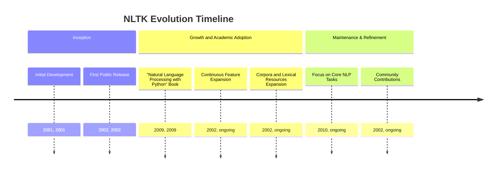
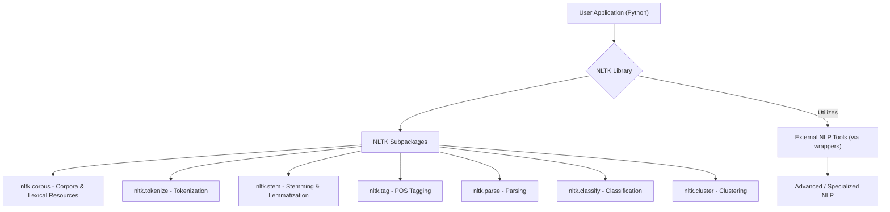
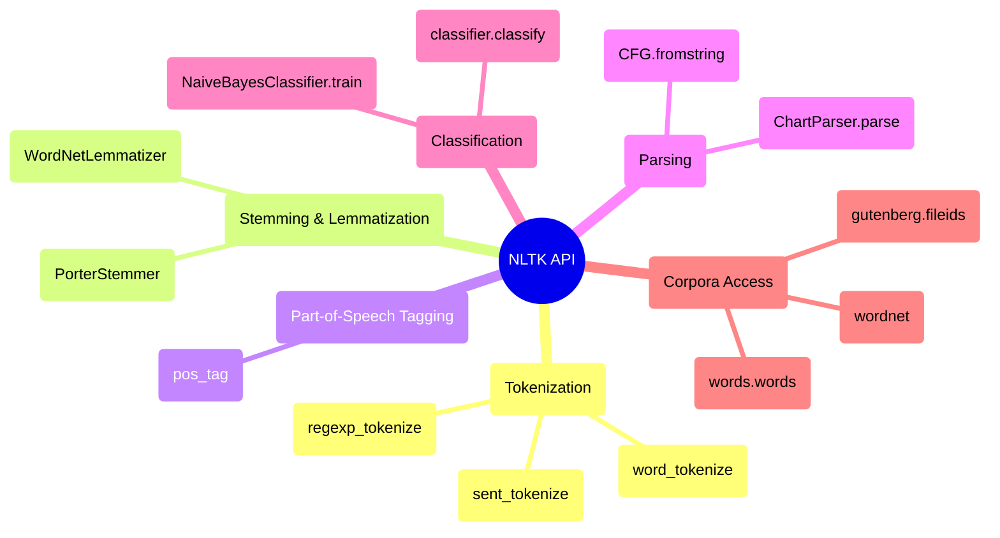

## NLTK Evolution Document

### 1. Introduction and Historical Context

NLTK (Natural Language Toolkit) is a leading open-source platform for building Python programs to work with human language data. It provides easy-to-use interfaces to over 50 corpora and lexical resources, along with a suite of text processing libraries for classification, tokenization, stemming, tagging, parsing, and semantic reasoning. NLTK is widely used for research and teaching in natural language processing (NLP), empirical linguistics, cognitive science, artificial intelligence, information retrieval, and machine learning.

NLTK was developed by Steven Bird and Edward Loper in the Department of Computer and Information Science at the University of Pennsylvania, with its inception dating back to at least 2001. The toolkit was created to support research and teaching in various language-related fields. It is famously accompanied by the book "Natural Language Processing with Python," which serves as a practical guide to programming for language processing using NLTK.

While NLTK has been continuously developed and remains a fundamental tool, it primarily focuses on symbolic and statistical NLP methods. It predates the widespread adoption of deep learning and transfer learning in the field, which are now often handled by more specialized libraries like spaCy or deep learning frameworks such as TensorFlow and PyTorch.

### 1.1. NLTK Evolution Timeline



### 2. Core Architecture

NLTK is structured as a modular suite of libraries and programs designed for symbolic and statistical natural language processing, primarily for English. Its architecture emphasizes providing a comprehensive toolkit for various NLP tasks through distinct subpackages and modules.

#### 2.1. Modular Design and Subpackages

NLTK's functionality is organized into numerous subpackages, each addressing a specific aspect of NLP:

*   **`nltk.corpus`**: Provides interfaces to over 50 corpora and lexical resources (e.g., WordNet, Brown Corpus, Penn Treebank).
*   **`nltk.tokenize`**: Tools for dividing text into tokens (words, sentences).
*   **`nltk.stem`**: Algorithms for stemming (e.g., Porter, Lancaster, Snowball) and lemmatization.
*   **`nltk.tag`**: Functions for part-of-speech (POS) tagging.
*   **`nltk.parse`**: Tools for parsing sentences into grammatical structures (parse trees).
*   **`nltk.classify`**: Algorithms for text classification (e.g., Naive Bayes, Decision Trees).
*   **`nltk.cluster`**: Algorithms for text clustering (e.g., K-Means).
*   **`nltk.sentiment`**: Tools for sentiment analysis.
*   **`nltk.chunk`**: Tools for chunking (grouping words into phrases).
*   **`nltk.metrics`**: Functions for evaluating NLP models.

#### 2.2. Corpora and Lexical Resources

A significant part of NLTK's architecture is its extensive collection of corpora and lexical resources. These datasets are crucial for training and evaluating NLP models, as well as for linguistic research. NLTK provides convenient functions to download and access these resources, making it easy for users to get started with real-world language data.

#### 2.3. Wrappers for External Tools

While NLTK provides many native implementations, it also includes wrappers for integrating with industrial-strength NLP libraries and external provers. This allows users to leverage more advanced or specialized tools within the NLTK framework when needed.

**Mermaid Diagram: NLTK Core Architecture**



### 3. Detailed API Overview

NLTK's API is designed to be accessible and covers a wide range of fundamental NLP tasks.

#### 3.1. Tokenization (`nltk.tokenize`)

*   **`nltk.word_tokenize(text)`**: Splits a text into a list of words.
*   **`nltk.sent_tokenize(text)`**: Splits a text into a list of sentences.
*   **`nltk.regexp_tokenize(text, pattern)`**: Tokenizes a text using a regular expression.

#### 3.2. Stemming and Lemmatization (`nltk.stem`)

*   **`nltk.stem.PorterStemmer().stem(word)`**: Applies the Porter stemming algorithm.
*   **`nltk.stem.WordNetLemmatizer().lemmatize(word, pos='n')`**: Applies WordNet lemmatization.

#### 3.3. Part-of-Speech Tagging (`nltk.tag`)

*   **`nltk.pos_tag(tokens)`**: Tags each token with its part-of-speech.

#### 3.4. Parsing (`nltk.parse`)

*   **`nltk.CFG.fromstring(grammar_string)`**: Creates a Context-Free Grammar.
*   **`nltk.ChartParser(grammar).parse(tokens)`**: Parses a list of tokens according to a grammar.

#### 3.5. Classification (`nltk.classify`)

*   **`nltk.NaiveBayesClassifier.train(training_set)`**: Trains a Naive Bayes classifier.
*   **`classifier.classify(features)`**: Classifies a feature set.

#### 3.6. Corpora Access (`nltk.corpus`)

*   **`nltk.corpus.words.words('en')`**: Accesses the English words corpus.
*   **`nltk.corpus.gutenberg.fileids()`**: Lists file IDs in the Gutenberg corpus.
*   **`nltk.corpus.wordnet`**: Interface to the WordNet lexical database.

### 3.7. API Mindmap



### 4. Evolution and Impact

*   **Educational and Research Tool:** NLTK has been instrumental in the education and research of natural language processing, providing a practical and accessible platform for learning and experimentation.
*   **Comprehensive Foundational NLP:** It offers a comprehensive suite of tools for foundational NLP tasks, covering a wide range of symbolic and statistical methods that are essential for understanding language.
*   **Rich Data Resources:** The extensive collection of corpora and lexical resources makes it easy for users to work with real-world language data, fostering empirical research and application development.
*   **Community and Documentation:** NLTK benefits from a strong community and excellent documentation, including the accompanying book, which has made it a go-to resource for anyone starting in NLP.
*   **Gateway to Advanced NLP:** While focusing on foundational methods, NLTK often serves as a gateway for users to explore more advanced NLP techniques and specialized libraries as their needs evolve.

### 5. Conclusion

NLTK has established itself as a foundational and indispensable library for natural language processing in Python. Its modular architecture, rich collection of algorithms, and extensive linguistic resources provide a powerful toolkit for understanding and working with human language data. While the field of NLP has seen rapid advancements with deep learning, NLTK continues to be a vital resource for foundational tasks, education, and research, serving as a crucial entry point for many into the exciting world of language technology.

### 6. Typical use cases

- Tokenization and POS tagging

```python
import nltk
from nltk.tokenize import word_tokenize

nltk.download('punkt', quiet=True)
nltk.download('averaged_perceptron_tagger', quiet=True)

text = "NLTK makes NLP tasks easy."
tokens = word_tokenize(text)
print(tokens)
print(nltk.pos_tag(tokens))
```

- Stemming and lemmatization

```python
from nltk.stem import PorterStemmer, WordNetLemmatizer
import nltk

nltk.download('wordnet', quiet=True)

stemmer = PorterStemmer()
lemmatizer = WordNetLemmatizer()
print(stemmer.stem('running'))
print(lemmatizer.lemmatize('better', pos='a'))
```

- Sentence segmentation and parsing

```python
import nltk
from nltk.tokenize import sent_tokenize

nltk.download('punkt', quiet=True)

text = "This is a sentence. Here is another one."
print(sent_tokenize(text))

grammar = nltk.CFG.fromstring("""
S -> NP VP
NP -> DT NN
VP -> VBZ ADJP
ADJP -> JJ
DT -> 'The'
NN -> 'cat'
VBZ -> 'is'
JJ -> 'happy'
""")
parser = nltk.ChartParser(grammar)
sent = ['The', 'cat', 'is', 'happy']
for tree in parser.parse(sent):
    print(tree)
```

- Simple text classification

```python
import nltk
from nltk.classify import NaiveBayesClassifier
from nltk.corpus import movie_reviews

nltk.download('movie_reviews', quiet=True)

def doc_features(words):
    return {w: True for w in words}

train_set = []
for cat in movie_reviews.categories():
    for fid in movie_reviews.fileids(cat)[:100]:
        train_set.append((doc_features(movie_reviews.words(fid)), cat))

classifier = NaiveBayesClassifier.train(train_set)
print(classifier.classify(doc_features("an excellent and entertaining film".split())))
```