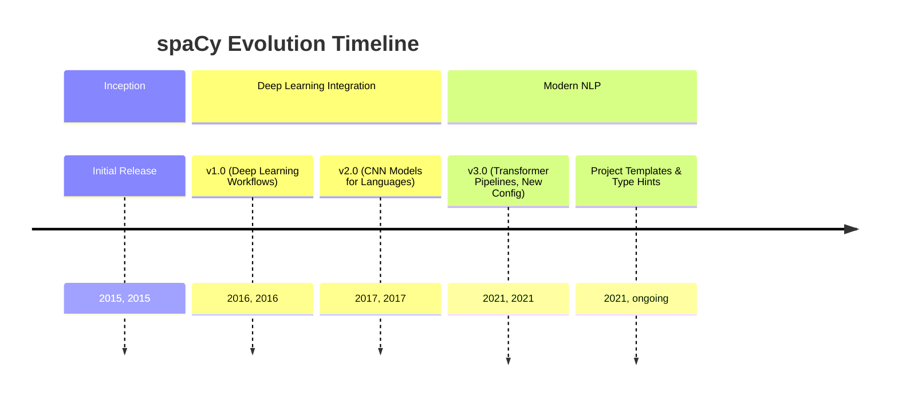
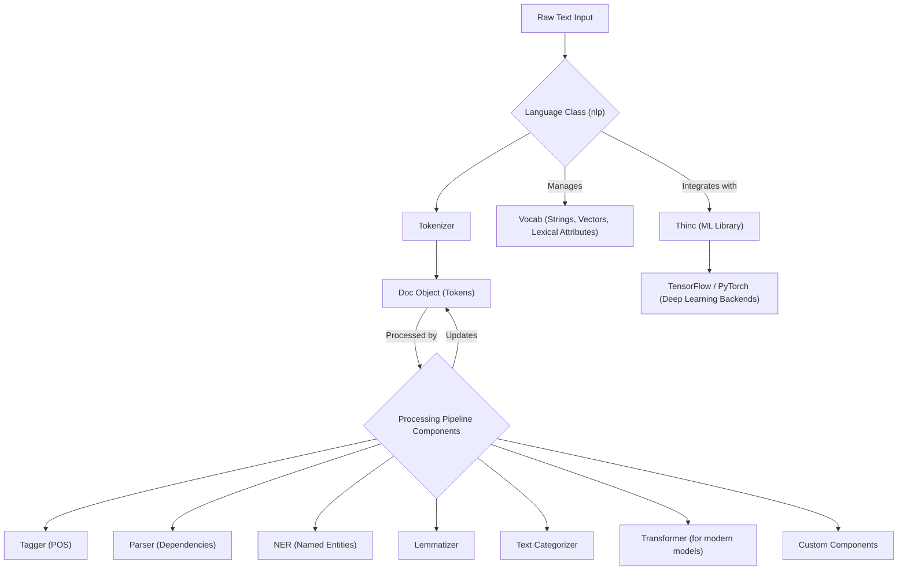

## spaCy Evolution Document

### 1. Introduction and Historical Context

spaCy is an open-source library for advanced Natural Language Processing (NLP) in Python, designed specifically for production use. It focuses on providing industrial-strength NLP capabilities with a strong emphasis on speed, efficiency, and ease of use. Unlike libraries primarily used for teaching and research (like NLTK), spaCy aims to deliver robust and performant NLP software for real-world applications, including building chatbots, information extraction systems, and content recommendation engines.

spaCy was initially released in February 2015 by Matthew Honnibal and Ines Montani, the founders of Explosion AI. From its inception, the library distinguished itself by offering pre-trained statistical models and a streamlined API for common NLP tasks. Key milestones in its development include significant updates that introduced deep learning workflows, convolutional neural network models for various languages, and state-of-the-art transformer-based pipelines.

A major release, **spaCy 3.0**, in February 2021, brought transformer-based pipelines, a new configuration system, and a revamped training workflow, further solidifying its position as a powerful tool for modern NLP.

### 1.1. spaCy Evolution Timeline



### 2. Core Architecture

spaCy's architecture is built for performance and flexibility, leveraging Python and Cython for its core implementations. It revolves around central data structures and a highly customizable processing pipeline.

#### 2.1. Central Data Structures

*   **`Language` Class (`nlp`)**: The primary class that coordinates the processing pipeline, manages training, and handles serialization. It takes raw text and transforms it into a `Doc` object.
*   **`Vocab`**: The vocabulary object centralizes strings, word vectors, and lexical attributes. This design prevents redundant data storage, saving memory and ensuring a single source of truth for linguistic data.
*   **`Doc` Object**: The core container for linguistic annotations. When text is processed, it's converted into a `Doc` object, which owns the sequence of tokens and all their associated annotations. The `Doc` object is initially constructed by the `Tokenizer` and then modified by other pipeline components.
*   **`Token`**: Represents an individual unit of text (word, punctuation, whitespace) within a `Doc`.
*   **`Span`**: A slice or segment from a `Doc` object, allowing for easy manipulation of contiguous sequences of tokens.
*   **`Lexeme`**: An entry in the `Vocab` representing a word type without context.

#### 2.2. Processing Pipeline

The `Language` object processes text by sending it through a pipeline of one or more components. This pipeline is highly customizable, allowing users to add or remove components based on their specific NLP needs.

1.  **Tokenizer**: The first step, segmenting raw text into `Token` objects based on language-specific rules.
2.  **Pipeline Components**: After tokenization, various components are applied sequentially to the `Doc` object. These can include:
    *   `tagger` (Part-of-speech tagger)
    *   `parser` (Dependency parser)
    *   `ner` (Named entity recognizer)
    *   `lemmatizer` (Determines base forms of words)
    *   `textcat` (Text categorizer)
    *   `transformer` (For transformer-based models)
    *   Custom components for specialized tasks.

#### 2.3. Deep Learning Integration

spaCy integrates with popular deep learning libraries like TensorFlow and PyTorch through its own machine learning library, **Thinc**. It leverages convolutional neural network models and, more recently, state-of-the-art transformer-based pipelines for tasks such as part-of-speech tagging, dependency parsing, and named entity recognition, achieving high accuracy and performance.

**Mermaid Diagram: spaCy Core Architecture**



### 3. Detailed API Overview

spaCy provides a consistent and intuitive API for a wide array of NLP tasks, focusing on ease of use for production systems.

#### 3.1. Language Processing

*   **`spacy.load('en_core_web_sm')`**: Loads a pre-trained language model.
*   **`nlp(text)`**: Processes raw text to create a `Doc` object.
*   **`doc.text`**: The original text.
*   **`token.text`**: The text of a token.
*   **`token.lemma_`**: The base form of the token.
*   **`token.pos_`**: The coarse-grained part-of-speech tag.
*   **`token.dep_`**: The syntactic dependency relation.
*   **`ent.text`**: The text of a named entity.
*   **`ent.label_`**: The label of a named entity (e.g., 'PERSON', 'ORG').
*   **`span.text`**: The text of a span.

#### 3.2. Pipeline Customization

*   **`nlp.add_pipe(component_name)`**: Adds a custom component to the processing pipeline.
*   **`nlp.disable_pipe(component_name)`**: Disables a component in the pipeline.

#### 3.3. Training and Configuration (spaCy 3.0+)

*   **`spacy train config.cfg --output ./output`**: Command-line tool for training models using a configuration file.
*   **`config.cfg`**: A declarative configuration file that defines all settings, hyperparameters, model implementations, and pipeline components for training.

#### 3.4. Serialization

*   **`nlp.to_disk('./my_model')`**: Saves a trained model to disk.
*   **`spacy.load('./my_model')`**: Loads a trained model from disk.

### 3.5. API Mindmap

```mermaid
mindmap
  root((spaCy API))
    (Language Processing)
      (spacy.load)
      (nlp(text))
      (doc.text)
      (token.text)
      (token.lemma_)
      (token.pos_)
      (token.dep_)
      (ent.text)
      (ent.label_)
      (span.text)
    (Pipeline Customization)
      (nlp.add_pipe)
      (nlp.disable_pipe)
    (Training & Configuration)
      (spacy train)
      (config.cfg)
    (Serialization)
      (nlp.to_disk)
      (spacy.load)
```

### 4. Evolution and Impact

*   **Industrial-Strength NLP:** spaCy has filled a critical gap by providing a library specifically designed for production-grade NLP, offering speed, efficiency, and robust models for real-world applications.
*   **Pre-trained Models and Ease of Use:** Its provision of high-quality pre-trained models for numerous languages significantly lowers the barrier to entry for complex NLP tasks, allowing users to get started quickly.
*   **Performance and Scalability:** The use of Cython and optimized algorithms ensures spaCy's high performance, making it suitable for processing large volumes of text data efficiently.
*   **Modern NLP Techniques:** Continuous integration of state-of-the-art techniques, such as transformer-based pipelines in spaCy 3.0, keeps the library at the forefront of NLP advancements.
*   **Customization and Extensibility:** The highly customizable pipeline and support for custom components allow users to tailor spaCy to their specific needs, making it adaptable to diverse NLP challenges.

### 5. Conclusion

spaCy has emerged as a powerful and indispensable library for advanced natural language processing in Python. Its architectural design, focused on performance, efficiency, and production readiness, sets it apart. By offering a comprehensive suite of tools, pre-trained models, and a highly customizable pipeline, spaCy empowers developers and researchers to build robust and scalable NLP applications. The continuous evolution, particularly with the integration of modern deep learning techniques, ensures spaCy remains a leading choice for tackling complex language understanding tasks in real-world scenarios.
