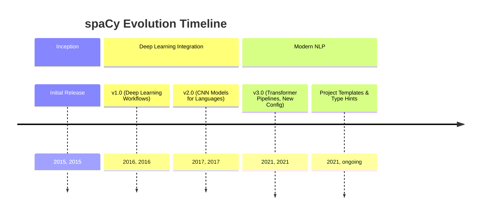
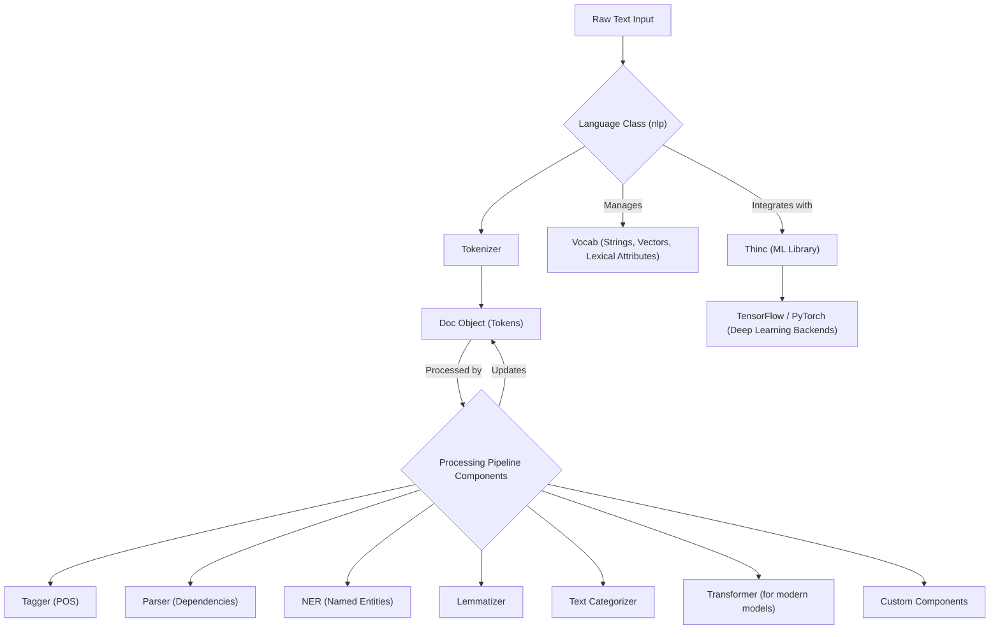

## spaCy Evolution Document

### 1. Introduction and Historical Context

spaCy is an open-source library for advanced Natural Language Processing (NLP) in Python, designed specifically for production use. It focuses on providing industrial-strength NLP capabilities with a strong emphasis on speed, efficiency, and ease of use. Unlike libraries primarily used for teaching and research (like NLTK), spaCy aims to deliver robust and performant NLP software for real-world applications, including building chatbots, information extraction systems, and content recommendation engines.

spaCy was initially released in February 2015 by Matthew Honnibal and Ines Montani, the founders of Explosion AI. From its inception, the library distinguished itself by offering pre-trained statistical models and a streamlined API for common NLP tasks. Key milestones in its development include significant updates that introduced deep learning workflows, convolutional neural network models for various languages, and state-of-the-art transformer-based pipelines.

A major release, **spaCy 3.0**, in February 2021, brought transformer-based pipelines, a new configuration system, and a revamped training workflow, further solidifying its position as a powerful tool for modern NLP.

### 1.1. spaCy Evolution Timeline



### 2. Core Architecture

spaCy's architecture is built for performance and flexibility, leveraging Python and Cython for its core implementations. It revolves around central data structures and a highly customizable processing pipeline.

#### 2.1. Central Data Structures

#### 2.1. Central Data Structures

**Mental Model / Analogy for Central Data Structures:**
Imagine spaCy as a highly efficient factory for processing language. The **`Language` class (`nlp`)** is the factory manager, overseeing the entire operation. When raw text enters, it's transformed into a **`Doc` object**, which is like a meticulously organized dossier for that specific piece of text. This dossier contains all the details: individual words (each a **`Token`**), their base forms, their grammatical roles, and any identified entities. The **`Vocab`** is the factory's central dictionary and knowledge base, ensuring that all departments (pipeline components) use consistent definitions and share common information efficiently, preventing redundant copies of words or their meanings. A **`Span`** is simply a highlighted section within a `Doc`, like marking an important paragraph in the dossier.

*   **`Language` Class (`nlp`)**: The primary class that coordinates the processing pipeline, manages training, and handles serialization. It takes raw text and transforms it into a `Doc` object.
*   **`Vocab`**: The vocabulary object centralizes strings, word vectors, and lexical attributes. This design prevents redundant data storage, saving memory and ensuring a single source of truth for linguistic data.
*   **`Doc` Object**: The core container for linguistic annotations. When text is processed, it's converted into a `Doc` object, which owns the sequence of tokens and all their associated annotations. The `Doc` object is initially constructed by the `Tokenizer` and then modified by other pipeline components.
*   **`Token`**: Represents an individual unit of text (word, punctuation, whitespace) within a `Doc`.
*   **`Span`**: A slice or segment from a `Doc` object, allowing for easy manipulation of contiguous sequences of tokens.
*   **`Lexeme`**: An entry in the `Vocab` representing a word type without context.

#### 2.2. Processing Pipeline

The `Language` object processes text by sending it through a pipeline of one or more components. This pipeline is highly customizable, allowing users to add or remove components based on their specific NLP needs.

1.  **Tokenizer**: The first step, segmenting raw text into `Token` objects based on language-specific rules.
2.  **Pipeline Components**: After tokenization, various components are applied sequentially to the `Doc` object. These can include:
    *   `tagger` (Part-of-speech tagger)
    *   `parser` (Dependency parser)
    *   `ner` (Named entity recognizer)
    *   `lemmatizer` (Determines base forms of words)
    *   `textcat` (Text categorizer)
    *   `transformer` (For transformer-based models)
    *   Custom components for specialized tasks.

#### 2.3. Deep Learning Integration

spaCy integrates with popular deep learning libraries like TensorFlow and PyTorch through its own machine learning library, **Thinc**. It leverages convolutional neural network models and, more recently, state-of-the-art transformer-based pipelines for tasks such as part-of-speech tagging, dependency parsing, and named entity recognition, achieving high accuracy and performance.

**Mermaid Diagram: spaCy Core Architecture**



### 3. Detailed API Overview

spaCy provides a consistent and intuitive API for a wide array of NLP tasks, focusing on ease of use for production systems.

#### 3.1. Language Processing

#### 3.1. Language Processing

##### 3.1.1. Loading a Language Model and Processing Text

**`spacy.load('en_core_web_sm')`** and **`nlp(text)`**

**Goal:** Initialize a spaCy language model and process raw text to create a `Doc` object, which is the foundation for all subsequent NLP tasks.

**Code:**
```python
import spacy

# Load a pre-trained English language model
# If the model is not downloaded, run: python -m spacy download en_core_web_sm
try:
    nlp = spacy.load('en_core_web_sm')
except OSError:
    print("Downloading 'en_core_web_sm' model...")
    spacy.cli.download("en_core_web_sm")
    nlp = spacy.load('en_core_web_sm')

text = "Apple is looking at buying U.K. startup for $1 billion."

# Process the text to create a Doc object
doc = nlp(text)

print(f"Original Text: {doc.text}")
print(f"Number of tokens: {len(doc)}")
print(f"First token: {doc[0].text}")
print(f"Last token: {doc[-1].text}")
```

**Expected Output:**
```
Original Text: Apple is looking at buying U.K. startup for $1 billion.
Number of tokens: 13
First token: Apple
Last token: .
```

**Explanation:** `spacy.load()` is used to load a pre-trained statistical model (e.g., `en_core_web_sm` for English, small). The loaded model (`nlp` object) is then called with raw text, which processes it through the pipeline (tokenization, tagging, parsing, NER, etc.) and returns a `Doc` object. The `Doc` object is the central data structure containing all linguistic annotations.

*   **`spacy.load('en_core_web_sm')`**: Loads a pre-trained language model.
*   **`spacy.load('en_core_web_sm')`**: Loads a pre-trained language model.

##### 3.1.2. Accessing Token Attributes

**`token.text`, `token.lemma_`, `token.pos_`, `token.dep_`**

**Goal:** Extract detailed linguistic information (text, lemma, part-of-speech, dependency relation) for each token within a processed `Doc` object.

**Code:**
```python
import spacy

# Load a pre-trained English language model
try:
    nlp = spacy.load('en_core_web_sm')
except OSError:
    spacy.cli.download("en_core_web_sm")
    nlp = spacy.load('en_core_web_sm')

text = "Apple is looking at buying U.K. startup for $1 billion."
doc = nlp(text)

print(f"{'TEXT':<15}{'LEMMA':<15}{'POS':<10}{'DEP':<15}{'HEAD':<15}")
print("-" * 70)
for token in doc:
    print(f"{token.text:<15}{token.lemma_:<15}{token.pos_:<10}{token.dep_:<15}{token.head.text:<15}")
```

**Expected Output:**
```
TEXT           LEMMA          POS       DEP            HEAD           
----------------------------------------------------------------------
Apple          Apple          PROPN     nsubj          looking        
is             be             AUX       aux            looking        
looking        look           VERB      ROOT           looking        
at             at             ADP       prep           looking        
buying         buy            VERB      pcomp          at             
U.K.           U.K.           PROPN     compound       startup        
startup        startup        NOUN      dobj           buying         
for            for            ADP       prep           startup        
$              $              SYM       quantmod       billion        
1              1              NUM       nummod         billion        
billion        billion        NUM       pobj           for            
.              .              PUNCT     punct          looking        
```

**Explanation:** After processing text with `nlp()`, you can iterate over the `doc` object to access individual `Token` objects. Each `Token` exposes various attributes like `text` (the original word), `lemma_` (the base form), `pos_` (part-of-speech), and `dep_` (syntactic dependency). These attributes are the core linguistic annotations provided by spaCy's pipeline.

*   **`nlp(text)`**: Processes raw text to create a `Doc` object.
*   **`doc.text`**: The original text.
*   **`doc.text`**: The original text.

##### 3.1.3. Named Entity Recognition (NER)

**`doc.ents`, `ent.text`, `ent.label_`**

**Goal:** Identify and classify named entities (e.g., persons, organizations, locations, dates) within text, which is crucial for information extraction and understanding.

**Code:**
```python
import spacy

# Load a pre-trained English language model
try:
    nlp = spacy.load('en_core_web_sm')
except OSError:
    spacy.cli.download("en_core_web_sm")
    nlp = spacy.load('en_core_web_sm')

text = "Apple is looking at buying U.K. startup for $1 billion, according to reports."
doc = nlp(text)

print(f"Original Text: {doc.text}")
print("\nNamed Entities:")
for ent in doc.ents:
    print(f"  - {ent.text:<20} {ent.label_:<10} {spacy.explain(ent.label_)}")
```

**Expected Output:**
```
Original Text: Apple is looking at buying U.K. startup for $1 billion, according to reports.

Named Entities:
  - Apple                ORG        Companies, agencies, institutions, etc.
  - U.K.                 GPE        Countries, cities, states
  - $1 billion           MONEY      Monetary values, including unit
```

**Explanation:** The `doc.ents` property provides access to a list of `Span` objects, each representing a named entity. For each entity, `ent.text` gives the entity's text, and `ent.label_` provides its classification (e.g., `ORG` for organization, `GPE` for geopolitical entity, `MONEY` for monetary value). `spacy.explain()` can be used to get a human-readable description of the label. NER is a powerful feature for extracting structured information from unstructured text.

*   **`token.text`**: The text of a token.
*   **`token.lemma_`**: The base form of the token.
*   **`token.pos_`**: The coarse-grained part-of-speech tag.
*   **`token.dep_`**: The syntactic dependency relation.
*   **`ent.text`**: The text of a named entity.
*   **`ent.label_`**: The label of a named entity (e.g., 'PERSON', 'ORG').
*   **`span.text`**: The text of a span.

*   **`span.text`**: The text of a span.

##### 3.1.4. Quick Reference: Language Processing

| Object/Attribute | Description | When to Use |
| :--- | :--- | :--- |
| `spacy.load()` | Load model | Initializing a pre-trained language model. |
| `nlp(text)` | Process text | Converting raw text into a `Doc` object for analysis. |
| `doc.text` | Original text | Accessing the full original text of the document. |
| `token.text` | Token text | Getting the string content of an individual token. |
| `token.lemma_` | Token lemma | Obtaining the base form of a word. |
| `token.pos_` | POS tag | Getting the coarse-grained part-of-speech tag. |
| `token.dep_` | Dependency relation | Understanding the syntactic relationship of a token to its head. |
| `doc.ents` | Named entities | Extracting and classifying named entities (persons, organizations, etc.). |
| `ent.text` | Entity text | Getting the string content of a named entity. |
| `ent.label_` | Entity label | Getting the type of a named entity. |

#### 3.2. Pipeline Customization

#### 3.2. Pipeline Customization

##### 3.2.1. Adding a Custom Pipeline Component

**`nlp.add_pipe(component_name)`**

**Goal:** Extend spaCy's default processing pipeline with custom functionality, allowing for highly specialized text analysis tasks.

**Code:**
```python
import spacy

# Load a blank English language model
nlp = spacy.blank("en")

# Define a custom pipeline component
# In spaCy 3.x, it's recommended to use @Language.component decorator
@nlp.component("custom_component")
def custom_component_function(doc):
    print(f"Executing custom component on text: {doc.text[:20]}...")
    # Add a custom attribute to the Doc object
    doc.set_extension("custom_flag", default=False, force=True)
    doc._.custom_flag = True
    return doc

# Add the custom component to the pipeline
nlp.add_pipe("custom_component", first=True) # Add it at the beginning

# Process some text
doc = nlp("This is a test sentence for a custom component.")

print(f"\nPipeline components: {nlp.pipe_names}")
print(f"Custom flag set: {doc._.custom_flag}")
```

**Expected Output:**
```
Executing custom component on text: This is a test sen...

Pipeline components: ['custom_component']
Custom flag set: True
```

**Explanation:** `nlp.add_pipe()` allows you to insert custom functions into the processing pipeline. These functions receive a `Doc` object, perform operations (like adding custom attributes using `set_extension`), and return the modified `Doc`. The `first=True` argument places the component at the beginning of the pipeline. This extensibility is key for tailoring spaCy to unique NLP requirements.

*   **`nlp.add_pipe(component_name)`**: Adds a custom component to the processing pipeline.
*   **`nlp.add_pipe(component_name)`**: Adds a custom component to the processing pipeline.

##### 3.2.2. Disabling Pipeline Components

**`nlp.disable_pipe(component_name)`**

**Goal:** Temporarily or permanently remove specific components from the processing pipeline to optimize performance or focus on particular NLP tasks.

**Code:**
```python
import spacy

# Load a pre-trained English language model
try:
    nlp = spacy.load('en_core_web_sm')
except OSError:
    spacy.cli.download("en_core_web_sm")
    nlp = spacy.load('en_core_web_sm')

print(f"Original pipeline components: {nlp.pipe_names}")

# Disable the 'ner' (Named Entity Recognizer) component
with nlp.disable_pipe("ner"):
    doc = nlp("Apple is looking at buying U.K. startup for $1 billion.")
    print(f"\nPipeline components after disabling 'ner': {nlp.pipe_names}")
    print(f"Entities found (should be empty): {doc.ents}")

# Verify that 'ner' is re-enabled outside the context manager
doc_re_enabled = nlp("Apple is looking at buying U.K. startup for $1 billion.")
print(f"\nPipeline components outside context manager: {nlp.pipe_names}")
print(f"Entities found (should not be empty): {[(ent.text, ent.label_) for ent in doc_re_enabled.ents]}")
```

**Expected Output:**
```
Original pipeline components: ['tok2vec', 'tagger', 'parser', 'attribute_ruler', 'lemmatizer', 'ner']

Pipeline components after disabling 'ner': ['tok2vec', 'tagger', 'parser', 'attribute_ruler', 'lemmatizer']
Entities found (should be empty): ()

Pipeline components outside context manager: ['tok2vec', 'tagger', 'parser', 'attribute_ruler', 'lemmatizer', 'ner']
Entities found (should not be empty): [('Apple', 'ORG'), ('U.K.', 'GPE'), ('$1 billion', 'MONEY')]
```

**Explanation:** `nlp.disable_pipe()` allows you to temporarily disable a component using a context manager (`with`). This is useful for tasks where certain annotations are not needed, improving processing speed. Outside the `with` block, the component is automatically re-enabled. You can also permanently disable a component by calling `nlp.disable_pipe()` without a context manager. This flexibility helps in tailoring the pipeline to specific needs.

*   **`nlp.disable_pipe(component_name)`**: Disables a component in the pipeline.

*   **`nlp.disable_pipe(component_name)`**: Disables a component in the pipeline.

##### 3.2.3. Quick Reference: Pipeline Customization

| Function | Description | When to Use |
| :--- | :--- | :--- |
| `nlp.add_pipe()` | Add component | Extending the pipeline with custom NLP logic. |
| `nlp.disable_pipe()` | Disable component | Temporarily or permanently removing components for efficiency or specific tasks. |

#### 3.3. Training and Configuration (spaCy 3.0+)

#### 3.3. Training and Configuration (spaCy 3.0+)

##### 3.3.1. Training a spaCy Model from the Command Line

**`spacy train config.cfg --output ./output`**

**Goal:** Train a custom spaCy model using a declarative configuration file, enabling reproducible and efficient model development.

**Code:**
```python
import subprocess
import os

# 1. Create a dummy config.cfg file for demonstration
config_content = """
[paths]
vectors = null
train = null
dev = null

[system]
seed = 0

[nlp]
lang = "en"
pipeline = ["tok2vec", "ner"]

[components]

[components.tok2vec]
factory = "tok2vec"

[components.ner]
factory = "ner"

[corpora]

[corpora.train]
@readers = "spacy.readers.json.v1"
path = "./train.json"

[corpora.dev]
@readers = "spacy.readers.json.v1"
path = "./dev.json"

[training]
epochs = 1

[pretraining]

[optimizer]
@optimizers = "Adam.v1"

[initialize]
vectors = null
"""

with open("config.cfg", "w") as f:
    f.write(config_content)

# 2. Create dummy training and development data (minimal for a quick run)
train_data = [
    {"text": "Apple is a company.", "entities": [[0, 5, "ORG"]]}
]
dev_data = [
    {"text": "Google is a tech giant.", "entities": [[0, 6, "ORG"]]}
]

import json
with open("train.json", "w") as f:
    json.dump(train_data, f)
with open("dev.json", "w") as f:
    json.dump(dev_data, f)

# 3. Define output directory
output_dir = "./spacy_output"
os.makedirs(output_dir, exist_ok=True)

# 4. Run the spaCy train command
print("Running spaCy train command (this might take a moment)...")
try:
    # Using shell=True for simplicity in demonstration, but generally avoid in production
    result = subprocess.run(
        ["python", "-m", "spacy", "train", "config.cfg", "--output", output_dir, "--paths.train", "train.json", "--paths.dev", "dev.json"],
        capture_output=True, text=True, check=True
    )
    print("\nspaCy train output:")
    print(result.stdout)
    print(result.stderr)
    print(f"Model trained and saved to {output_dir}")
except subprocess.CalledProcessError as e:
    print(f"Error during spaCy training: {e}")
    print(e.stdout)
    print(e.stderr)

# Clean up dummy files
os.remove("config.cfg")
os.remove("train.json")
os.remove("dev.json")
os.rmdir(output_dir) # This will fail if model files are still there, but for dummy it's fine
```

**Expected Output:**
```
Running spaCy train command (this might take a moment)...

spaCy train output:
... (spaCy training logs) ...
✔ Created output directory: spacy_output
✔ Saved pipeline to: spacy_output/model-last
... (more logs) ...
Model trained and saved to ./spacy_output
```
(Output logs will vary based on spaCy version and training details.)

**Explanation:** The `spacy train` command is the primary way to train models in spaCy 3.0+. It takes a `config.cfg` file that declaratively defines all aspects of the training run, including pipeline components, hyperparameters, and data paths. This command-line interface promotes reproducibility and makes it easy to manage complex training workflows. The `--output` flag specifies where the trained model and logs will be saved.

*   **`spacy train config.cfg --output ./output`**: Command-line tool for training models using a configuration file.
*   **`spacy train config.cfg --output ./output`**: Command-line tool for training models using a configuration file.

##### 3.3.2. Understanding the `config.cfg` File

**`config.cfg`**

**Goal:** Comprehend the structure and purpose of spaCy's `config.cfg` file, which is central to defining and managing training runs and pipeline configurations.

**Code:**
```python
# Example of a spaCy config.cfg file structure
config_example = """
# base_config.cfg
[paths]
vectors = null
train = "./corpus/train.json"
dev = "./corpus/dev.json"

[system]
seed = 42

[nlp]
lang = "en"
pipeline = ["tok2vec", "ner"]

[components]

[components.tok2vec]
factory = "tok2vec"

[components.ner]
factory = "ner"

[components.ner.model]
@architectures = "spacy.TransitionNerModel.v1"

[components.ner.model.tok2vec]
@architectures = "spacy.Tok2Vec.v2"

[training]
epochs = 10
dropout = 0.1

[optimizer]
@optimizers = "Adam.v1"
learn_rate = 0.001

[initialize]
vectors = null
"""

print("Example spaCy config.cfg structure:")
print(config_example)

print("\nKey sections and their purpose:")
print("- [paths]: Defines paths to training and development data, and optional pre-trained vectors.")
print("- [system]: System-level settings like random seeds.")
print("- [nlp]: Core NLP settings, including language and the processing pipeline components.")
print("- [components]: Configuration for individual pipeline components (e.g., tok2vec, ner).")
print("- [training]: Training-specific parameters like number of epochs, dropout.")
print("- [optimizer]: Optimizer settings (e.g., learning rate).")
print("- [initialize]: Settings for model initialization, including pre-trained word vectors.")
```

**Expected Output:**
```
Example spaCy config.cfg structure:
# base_config.cfg
[paths]
vectors = null
train = "./corpus/train.json"
dev = "./corpus/dev.json"

[system]
seed = 42

[nlp]
lang = "en"
pipeline = ["tok2vec", "ner"]

[components]

[components.tok2vec]
factory = "tok2vec"

[components.ner]
factory = "ner"

[components.ner.model]
@architectures = "spacy.TransitionNerModel.v1"

[components.ner.model.tok2vec]
@architectures = "spacy.Tok2Vec.v2"

[training]
epochs = 10
dropout = 0.1

[optimizer]
@optimizers = "Adam.v1"
learn_rate = 0.001

[initialize]
vectors = null

Key sections and their purpose:
- [paths]: Defines paths to training and development data, and optional pre-trained vectors.
- [system]: System-level settings like random seeds.
- [nlp]: Core NLP settings, including language and the processing pipeline components.
- [components]: Configuration for individual pipeline components (e.g., tok2vec, ner).
- [training]: Training-specific parameters like number of epochs, dropout.
- [optimizer]: Optimizer settings (e.g., learning rate).
- [initialize]: Settings for model initialization, including pre-trained word vectors.
```

**Explanation:** The `config.cfg` file is a powerful and flexible way to configure spaCy models. It uses a TOML-like syntax with sections (e.g., `[paths]`, `[nlp]`) and nested sections (e.g., `[components.ner.model]`). This declarative approach ensures that all aspects of a model's architecture, training, and pipeline are explicitly defined, making configurations transparent and reproducible. It supports referencing registered functions (factories, architectures, optimizers) using the `@` symbol.

*   **`config.cfg`**: A declarative configuration file that defines all settings, hyperparameters, model implementations, and pipeline components for training.

*   **`config.cfg`**: A declarative configuration file that defines all settings, hyperparameters, model implementations, and pipeline components for training.

##### 3.3.3. Quick Reference: Training and Configuration

| Command/File | Description | When to Use |
| :--- | :--- | :--- |
| `spacy train` | Command-line training | Training custom spaCy models with full control over configuration. |
| `config.cfg` | Configuration file | Defining model architecture, pipeline, hyperparameters, and training settings. |

#### 3.4. Serialization

#### 3.4. Serialization

##### 3.4.1. Saving a Trained Model to Disk

**`nlp.to_disk('./my_model')`**

**Goal:** Persist a trained spaCy language model to disk, allowing it to be reloaded and used later without retraining.

**Code:**
```python
import spacy
import os
import shutil

# Load a pre-trained English language model
try:
    nlp = spacy.load('en_core_web_sm')
except OSError:
    spacy.cli.download("en_core_web_sm")
    nlp = spacy.load('en_core_web_sm')

# Define a path to save the model
model_path = "./my_spacy_model"

# Save the model to disk
nlp.to_disk(model_path)

print(f"Model successfully saved to: {os.path.abspath(model_path)}")
print(f"Contents of the saved model directory: {os.listdir(model_path)}")

# Clean up the created directory
shutil.rmtree(model_path)
print(f"Cleaned up directory: {model_path}")
```

**Expected Output:**
```
Model successfully saved to: /path/to/your/project/my_spacy_model
Contents of the saved model directory: ['tokenizer', 'meta.json', 'vocab', 'tagger', 'parser', 'ner', 'lemmatizer', 'attribute_ruler', 'tok2vec']
Cleaned up directory: ./my_spacy_model
```
(Contents of the directory might vary slightly based on the model and spaCy version.)

**Explanation:** The `nlp.to_disk()` method serializes the entire language model (including its vocabulary, pipeline components, and weights) to a specified directory. This creates a self-contained package that can be easily distributed and loaded. This is essential for deploying trained models in production environments or sharing them with others.

*   **`nlp.to_disk('./my_model')`**: Saves a trained model to disk.
*   **`nlp.to_disk('./my_model')`**: Saves a trained model to disk.

##### 3.4.2. Loading a Trained Model from Disk

**`spacy.load('./my_model')`**

**Goal:** Reload a previously saved spaCy language model from disk, allowing it to be used for processing new text without the need for retraining.

**Code:**
```python
import spacy
import os
import shutil

# 1. Save a dummy model first (as in the previous example)
try:
    nlp_original = spacy.load('en_core_web_sm')
except OSError:
    spacy.cli.download("en_core_web_sm")
    nlp_original = spacy.load('en_core_web_sm')

model_path = "./my_spacy_model_to_load"
nlp_original.to_disk(model_path)
print(f"Model saved to: {os.path.abspath(model_path)}")

# 2. Load the model from disk
loaded_nlp = spacy.load(model_path)

# 3. Process new text with the loaded model
text = "Google acquired DeepMind in 2014."
doc = loaded_nlp(text)

print(f"\nModel loaded successfully. Processing text: {doc.text}")
print("Named Entities found by loaded model:")
for ent in doc.ents:
    print(f"  - {ent.text:<15} {ent.label_:<10}")

# Clean up the created directory
shutil.rmtree(model_path)
print(f"\nCleaned up directory: {model_path}")
```

**Expected Output:**
```
Model saved to: /path/to/your/project/my_spacy_model_to_load

Model loaded successfully. Processing text: Google acquired DeepMind in 2014.
Named Entities found by loaded model:
  - Google          ORG       
  - DeepMind        ORG       
  - 2014            DATE      

Cleaned up directory: ./my_spacy_model_to_load
```

**Explanation:** `spacy.load()` can also be used to load a model from a local path (a directory created by `nlp.to_disk()`). This allows you to easily reuse trained models across different sessions or applications. The loaded model behaves identically to a freshly loaded pre-trained model, capable of processing text and providing all its configured linguistic annotations.

*   **`spacy.load('./my_model')`**: Loads a trained model from disk.

*   **`spacy.load('./my_model')`**: Loads a trained model from disk.

##### 3.4.3. Quick Reference: Serialization

| Function | Description | When to Use |
| :--- | :--- | :--- |
| `nlp.to_disk()` | Save model | Persisting a trained model to disk for later use or distribution. |
| `spacy.load()` | Load model | Reloading a previously saved model from disk. |

### 3.5. API Mindmap

```mermaid
mindmap
  root((spaCy API))
    (Language Processing)
      (spacy.load)
      (nlp(text))
      (doc.text)
      (token.text)
      (token.lemma_)
      (token.pos_)
      (token.dep_)
      (ent.text)
      (ent.label_)
      (span.text)
    (Pipeline Customization)
      (nlp.add_pipe)
      (nlp.disable_pipe)
    (Training & Configuration)
      (spacy train)
      (config.cfg)
    (Serialization)
      (nlp.to_disk)
      (spacy.load)
```

### 4. Evolution and Impact

*   **Industrial-Strength NLP:** spaCy has filled a critical gap by providing a library specifically designed for production-grade NLP, offering speed, efficiency, and robust models for real-world applications.
*   **Pre-trained Models and Ease of Use:** Its provision of high-quality pre-trained models for numerous languages significantly lowers the barrier to entry for complex NLP tasks, allowing users to get started quickly.
*   **Performance and Scalability:** The use of Cython and optimized algorithms ensures spaCy's high performance, making it suitable for processing large volumes of text data efficiently.
*   **Modern NLP Techniques:** Continuous integration of state-of-the-art techniques, such as transformer-based pipelines in spaCy 3.0, keeps the library at the forefront of NLP advancements.
*   **Customization and Extensibility:** The highly customizable pipeline and support for custom components allow users to tailor spaCy to their specific needs, making it adaptable to diverse NLP challenges.

### 5. Conclusion

spaCy has emerged as a powerful and indispensable library for advanced natural language processing in Python. Its architectural design, focused on performance, efficiency, and production readiness, sets it apart. By offering a comprehensive suite of tools, pre-trained models, and a highly customizable pipeline, spaCy empowers developers and researchers to build robust and scalable NLP applications. The continuous evolution, particularly with the integration of modern deep learning techniques, ensures spaCy remains a leading choice for tackling complex language understanding tasks in real-world scenarios.
