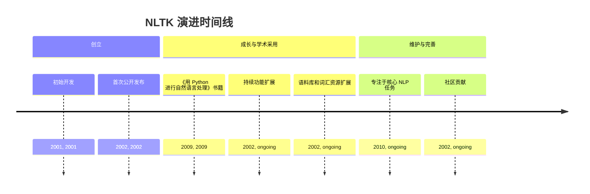
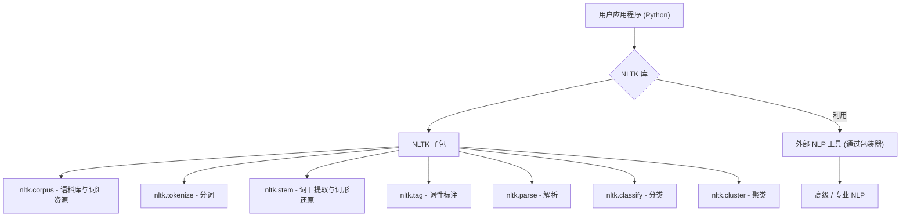
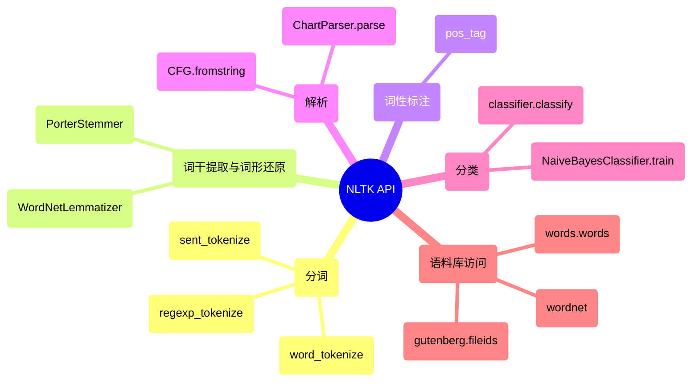

## NLTK 演进文档

### 1. 引言与历史背景

NLTK (自然语言工具包) 是一个领先的开源平台，用于构建处理人类语言数据的 Python 程序。它提供了易于使用的接口，可访问 50 多个语料库和词汇资源，以及一套用于分类、分词、词干提取、标注、解析和语义推理的文本处理库。NLTK 广泛用于自然语言处理 (NLP)、经验语言学、认知科学、人工智能、信息检索和机器学习领域的研究和教学。

NLTK 由宾夕法尼亚大学计算机与信息科学系的 Steven Bird 和 Edward Loper 开发，其创立可追溯到至少 2001 年。该工具包旨在支持各种语言相关领域的研究和教学。它以其著名的配套书籍《用 Python 进行自然语言处理》而闻名，该书是使用 NLTK 进行语言处理编程的实用指南。

尽管 NLTK 一直在持续开发并仍然是一个基础工具，但它主要专注于符号和统计 NLP 方法。它早于深度学习和迁移学习在该领域的广泛采用，这些现在通常由更专业的库（如 spaCy）或深度学习框架（如 TensorFlow 和 PyTorch）处理。

### 1.1. NLTK 演进时间线

### 2. 核心架构

NLTK 的结构是一个模块化的库和程序套件，专为符号和统计自然语言处理而设计，主要针对英语。其架构强调通过不同的子包和模块为各种 NLP 任务提供全面的工具包。

#### 2.1. 模块化设计和子包

NLTK 的功能组织成许多子包，每个子包都处理 NLP 的一个特定方面：

*   **`nltk.corpus`**: 提供 50 多个语料库和词汇资源（例如 WordNet、Brown Corpus、Penn Treebank）的接口。
*   **`nltk.tokenize`**: 用于将文本划分为标记（单词、句子）的工具。
*   **`nltk.stem`**: 词干提取（例如 Porter、Lancaster、Snowball）和词形还原的算法。
*   **`nltk.tag`**: 用于词性 (POS) 标注的函数。
*   **`nltk.parse`**: 用于将句子解析为语法结构（解析树）的工具。
*   **`nltk.classify`**: 用于文本分类的算法（例如朴素贝叶斯、决策树）。
*   **`nltk.cluster`**: 用于文本聚类的算法（例如 K-Means）。
*   **`nltk.sentiment`**: 用于情感分析的工具。
*   **`nltk.chunk`**: 用于分块（将单词分组为短语）的工具。
*   **`nltk.metrics`**: 用于评估 NLP 模型的函数。

#### 2.2. 语料库和词汇资源

NLTK 架构的一个重要部分是其广泛的语料库和词汇资源集合。这些数据集对于训练和评估 NLP 模型以及语言学研究至关重要。NLTK 提供了方便的函数来下载和访问这些资源，使用户可以轻松地开始处理真实世界的语言数据。

#### 2.3. 外部工具的包装器

虽然 NLTK 提供了许多原生实现，但它也包含用于与工业级 NLP 库和外部证明器集成的包装器。这允许用户在需要时利用 NLTK 框架内更高级或更专业的工具。

**Mermaid 图：NLTK 核心架构**

### 3. 详细 API 概述

NLTK 的 API 设计易于访问，涵盖了广泛的基础 NLP 任务。

#### 3.1. 分词 (`nltk.tokenize`)

*   **`nltk.word_tokenize(text)`**: 将文本拆分为单词列表。
*   **`nltk.sent_tokenize(text)`**: 将文本拆分为句子列表。
*   **`nltk.regexp_tokenize(text, pattern)`**: 使用正则表达式对文本进行分词。

#### 3.2. 词干提取和词形还原 (`nltk.stem`)

*   **`nltk.stem.PorterStemmer().stem(word)`**: 应用 Porter 词干提取算法。
*   **`nltk.stem.WordNetLemmatizer().lemmatize(word, pos='n')`**: 应用 WordNet 词形还原。

#### 3.3. 词性标注 (`nltk.tag`)

*   **`nltk.pos_tag(tokens)`**: 为每个标记标注词性。

#### 3.4. 解析 (`nltk.parse`)

*   **`nltk.CFG.fromstring(grammar_string)`**: 创建上下文无关文法。
*   **`nltk.ChartParser(grammar).parse(tokens)`**: 根据文法解析标记列表。

#### 3.5. 分类 (`nltk.classify`)

*   **`nltk.NaiveBayesClassifier.train(training_set)`**: 训练朴素贝叶斯分类器。
*   **`classifier.classify(features)`**: 对特征集进行分类。

#### 3.6. 语料库访问 (`nltk.corpus`)

*   **`nltk.corpus.words.words('en')`**: 访问英语单词语料库。
*   **`nltk.corpus.gutenberg.fileids()`**: 列出古腾堡语料库中的文件 ID。
*   **`nltk.corpus.wordnet`**: WordNet 词汇数据库的接口。

### 3.7. API 思维导图

### 4. 演变与影响

*   **教育和研究工具:** NLTK 在自然语言处理的教育和研究中发挥了重要作用，为学习和实验提供了实用且易于访问的平台。
*   **全面的基础 NLP:** 它为基础 NLP 任务提供了一套全面的工具，涵盖了广泛的符号和统计方法，这些方法对于理解语言至关重要。
*   **丰富的數據资源:** 广泛的语料库和词汇资源集合使用户可以轻松处理真实世界的语言数据，促进了实证研究和应用程序开发。
*   **社区和文档:** NLTK 受益于强大的社区和出色的文档，包括配套书籍，这使其成为任何开始学习 NLP 的人的首选资源。
*   **高级 NLP 的门户:** 尽管专注于基础方法，但 NLTK 通常作为用户探索更高级 NLP 技术和专业库的门户，随着他们的需求而发展。

### 5. 结论

NLTK 已将自己确立为 Python 中自然语言处理的基础且不可或缺的库。其模块化架构、丰富的算法集合和广泛的语言资源为理解和处理人类语言数据提供了强大的工具包。尽管 NLP 领域随着深度学习取得了快速发展，但 NLTK 仍然是基础任务、教育和研究的重要资源，是许多人进入激动人心的语言技术世界的关键入口。
