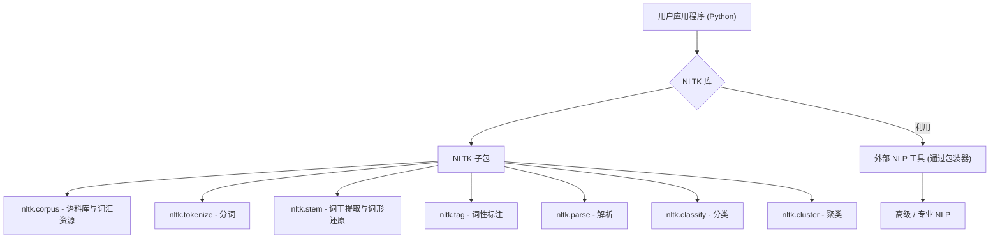
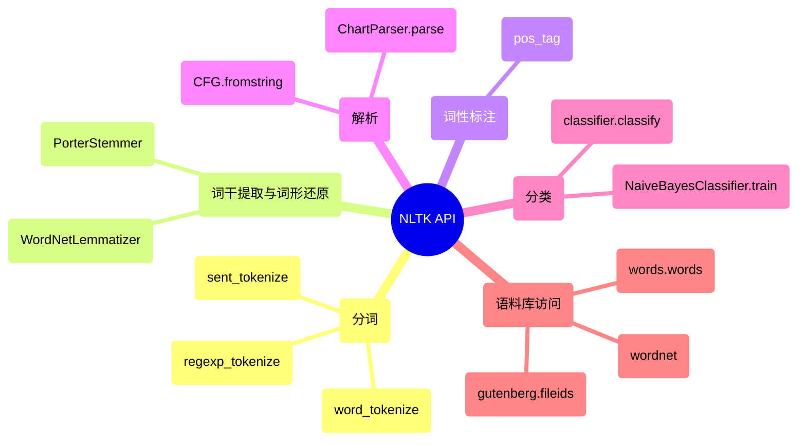

## NLTK 演进文档

### 1. 引言与历史背景

NLTK (自然语言工具包) 是一个领先的开源平台，用于构建处理人类语言数据的 Python 程序。它提供了易于使用的接口，可访问 50 多个语料库和词汇资源，以及一套用于分类、分词、词干提取、标注、解析和语义推理的文本处理库。NLTK 广泛用于自然语言处理 (NLP)、经验语言学、认知科学、人工智能、信息检索和机器学习领域的研究和教学。

NLTK 由宾夕法尼亚大学计算机与信息科学系的 Steven Bird 和 Edward Loper 开发，其创立可追溯到至少 2001 年。该工具包旨在支持各种语言相关领域的研究和教学。它以其著名的配套书籍《用 Python 进行自然语言处理》而闻名，该书是使用 NLTK 进行语言处理编程的实用指南。

尽管 NLTK 一直在持续开发并仍然是一个基础工具，但它主要专注于符号和统计 NLP 方法。它早于深度学习和迁移学习在该领域的广泛采用，这些现在通常由更专业的库（如 spaCy）或深度学习框架（如 TensorFlow 和 PyTorch）处理。

### 1.1. NLTK 演进时间线


### 2. 核心架构

NLTK 的结构是一个模块化的库和程序套件，专为符号和统计自然语言处理而设计，主要针对英语。其架构强调通过不同的子包和模块为各种 NLP 任务提供全面的工具包。

#### 2.1. 模块化设计和子包

**心智模型 / 类比：**
想象 NLTK 是一个为语言学家或语言专家准备的综合工具箱。工具箱中的每个抽屉都是一个**子包**，为特定任务整齐地组织着。
*   `nltk.tokenize` 抽屉里有各种文本拆分工具，就像一把细齿锯用于单词，一把大锯用于句子。
*   `nltk.stem` 抽屉里包含将单词修剪成词根的工具，就像不同类型的砂光机。
*   `nltk.corpus` 抽屉是一个巨大的书籍和词典库（语料库和词汇资源），您可以从中提取参考资料。
*   `nltk.classify` 抽屉里有用于文本排序和标记的预制工具包，就像一套模板。

这种模块化设计意味着您只需打开特定任务所需的抽屉，使工具箱功能强大但又不会让人不知所措。

NLTK 的功能组织成许多子包，每个子包都处理 NLP 的一个特定方面：

*   **`nltk.corpus`**: 提供 50 多个语料库和词汇资源（例如 WordNet、Brown Corpus、Penn Treebank）的接口。
*   **`nltk.tokenize`**: 用于将文本划分为标记（单词、句子）的工具。
*   **`nltk.stem`**: 词干提取（例如 Porter、Lancaster、Snowball）和词形还原的算法。
*   **`nltk.tag`**: 用于词性 (POS) 标注的函数。
*   **`nltk.parse`**: 用于将句子解析为语法结构（解析树）的工具。
*   **`nltk.classify`**: 用于文本分类的算法（例如朴素贝叶斯、决策树）。
*   **`nltk.cluster`**: 用于文本聚类的算法（例如 K-Means）。
*   **`nltk.sentiment`**: 用于情感分析的工具。
*   **`nltk.chunk`**: 用于分块（将单词分组为短语）的工具。
*   **`nltk.metrics`**: 用于评估 NLP 模型的函数。

#### 2.2. 语料库和词汇资源

NLTK 架构的重要部分是其广泛的语料库和词汇资源集合。这些数据集对于训练和评估 NLP 模型以及语言学研究至关重要。NLTK 提供了方便的函数来下载和访问这些资源，使用户可以轻松地开始处理真实世界的语言数据。

#### 2.3. 外部工具的包装器

尽管 NLTK 提供了许多原生实现，但它也包含用于与工业级 NLP 库和外部证明器集成的包装器。这允许用户在需要时在 NLTK 框架内利用更高级或更专业的工具。

**Mermaid 图：NLTK 核心架构**



### 3. 详细 API 概述

NLTK 的 API 设计易于访问，涵盖了广泛的基础 NLP 任务。

#### 3.1. 分词 (`nltk.tokenize`)

#### 3.1. 分词 (`nltk.tokenize`)

##### 3.1.1. 单词和句子分词

**`nltk.word_tokenize(text)`** 和 **`nltk.sent_tokenize(text)`**

**目标：** 将较长的文本分解为其组成单词或句子，这是大多数 NLP 管道中的基本第一步。

**代码：**
```python
import nltk

# 下载 'punkt' 分词器模型（如果尚未下载）
try:
    nltk.data.find('tokenizers/punkt')
except nltk.downloader.DownloadError:
    nltk.download('punkt')

text = "NLTK 是一个用于自然语言处理的强大库。它提供了易于使用的接口。"

# 分词为句子
sentences = nltk.sent_tokenize(text)
print(f"句子:\n{sentences}")

# 分词为单词
words = nltk.word_tokenize(text)
print(f"\n单词:\n{words}")
```

**预期输出：**
```
句子:
['NLTK 是一个用于自然语言处理的强大库。', '它提供了易于使用的接口。']

单词:
['NLTK', '是一个', '用于', '自然语言处理', '的', '强大', '库', '。', '它', '提供了', '易于使用', '的', '接口', '。']
```

**解释：** `sent_tokenize` 根据通常表示句子结尾的标点符号拆分文本。`word_tokenize` 将文本拆分为单个单词和标点符号。这些函数对于准备文本以进行进一步分析（例如词性标注或词干提取）至关重要。

*   **`nltk.word_tokenize(text)`**: 将文本拆分为单词列表。
*   **`nltk.sent_tokenize(text)`**: 将文本拆分为句子列表。
*   **`nltk.regexp_tokenize(text, pattern)`**: 使用正则表达式对文本进行分词。

*   **`nltk.regexp_tokenize(text, pattern)`**: 使用正则表达式对文本进行分词。

##### 3.1.2. 快速参考：分词

| 函数 | 描述 | 何时使用 |
| :--- | :--- | :--- |
| `word_tokenize()` | 单词分词器 | 将文本拆分为单个单词和标点符号。 |
| `sent_tokenize()` | 句子分词器 | 将文本拆分为句子。 |
| `regexp_tokenize()` | 正则表达式分词器 | 根据自定义正则表达式模式进行分词。 |

#### 3.2. 词干提取和词形还原 (`nltk.stem`)

#### 3.2. 词干提取和词形还原 (`nltk.stem`)

##### 3.2.1. 使用 `PorterStemmer` 进行词干提取

**`nltk.stem.PorterStemmer().stem(word)`**

**目标：** 通过删除常见的后缀，将单词还原为其词根或基本形式。这是一个启发式过程，有时会导致非字典词。

**代码：**
```python
from nltk.stem import PorterStemmer

# 初始化 Porter 词干提取器
stemmer = PorterStemmer()

words = ["running", "runs", "ran", "easily", "fairly"]
stems = [stemmer.stem(word) for word in words]

print(f"原始单词: {words}")
print(f"词干提取后的单词: {stems}")
```

**预期输出：**
```
原始单词: ['running', 'runs', 'ran', 'easily', 'fairly']
词干提取后的单词: ['run', 'run', 'ran', 'easili', 'fairli']
```

**解释：** 词干提取是将屈折（或有时派生）单词还原为其词干的过程。Porter 词干提取器是此任务的经典算法。请注意“running”和“runs”如何都还原为“run”，但“ran”保持不变。此外，“easily”和“fairly”被还原为非字典词，这是词干提取的常见特征。

*   **`nltk.stem.PorterStemmer().stem(word)`**: 应用 Porter 词干提取算法。
*   **`nltk.stem.PorterStemmer().stem(word)`**: 应用 Porter 词干提取算法。

##### 3.2.2. 使用 `WordNetLemmatizer` 进行词形还原

**`nltk.stem.WordNetLemmatizer().lemmatize(word, pos='n')`**

**目标：** 将单词还原为其基本或字典形式（词元），同时考虑上下文（词性）。这是一个比词干提取更复杂的过程。

**代码：**
```python
from nltk.stem import WordNetLemmatizer
import nltk

# 下载 'wordnet' 资源（如果尚未下载）
try:
    nltk.data.find('corpora/wordnet')
except nltk.downloader.DownloadError:
    nltk.download('wordnet')

# 初始化 WordNet 词形还原器
lemmatizer = WordNetLemmatizer()

words = ["running", "runs", "ran", "better", "best"]

# 使用词性 (pos) 标签进行词形还原以获得更好的结果
lemmas_verb = [lemmatizer.lemmatize(word, pos='v') for word in words]
lemmas_adj = [lemmatizer.lemmatize(word, pos='a') for word in words]

print(f"原始单词: {words}")
print(f"词形还原后的单词（作为动词）: {lemmas_verb}")
print(f"词形还原后的单词（作为形容词）: {lemmas_adj}")
```

**预期输出：**
```
原始单词: ['running', 'runs', 'ran', 'better', 'best']
词形还原后的单词（作为动词）: ['run', 'run', 'run', 'better', 'best']
词形还原后的单词（作为形容词）: ['running', 'runs', 'ran', 'good', 'best']
```

**解释：** 词形还原类似于词干提取，但旨在返回一个有效的字典词。它通常需要单词的词性 (`pos`) 才能正常工作。请注意“ran”在作为动词处理时如何正确地词形还原为“run”，以及“better”在作为形容词处理时如何词形还原为“good”。

*   **`nltk.stem.WordNetLemmatizer().lemmatize(word, pos='n')`**: 应用 WordNet 词形还原。

*   **`nltk.stem.WordNetLemmatizer().lemmatize(word, pos='n')`**: 应用 WordNet 词形还原。

##### 3.2.3. 快速参考：词干提取和词形还原

| 类 | 描述 | 何时使用 |
| :--- | :--- | :--- |
| `PorterStemmer()` | 词干提取器 | 当您需要一种快速简单的方法来规范化单词，并且不介意非字典输出时。 |
| `WordNetLemmatizer()` | 词形还原器 | 当您需要有效的字典单词并可以提供词性上下文以获得更高准确性时。 |

#### 3.3. 词性标注 (`nltk.tag`)

#### 3.3. 词性标注 (`nltk.tag`)

##### 3.3.1. 使用 `pos_tag` 进行词性标注

**`nltk.pos_tag(tokens)`**

**目标：** 为句子中的每个单词分配一个语法类别（例如，名词、动词、形容词），为进一步分析提供关键的句法信息。

**代码：**
```python
import nltk
from nltk.tokenize import word_tokenize

# 下载必要的资源（如果尚未下载）
try:
    nltk.data.find('tokenizers/punkt')
except nltk.downloader.DownloadError:
    nltk.download('punkt')
try:
    nltk.data.find('taggers/averaged_perceptron_tagger')
except nltk.downloader.DownloadError:
    nltk.download('averaged_perceptron_tagger')

text = "The quick brown fox jumps over the lazy dog."
tokens = word_tokenize(text)

# 执行词性标注
pos_tags = nltk.pos_tag(tokens)

print(f"标记: {tokens}")
print(f"词性标签: {pos_tags}")
```

**预期输出：**
```
标记: ['The', 'quick', 'brown', 'fox', 'jumps', 'over', 'the', 'lazy', 'dog', '.']
词性标签: [('The', 'DT'), ('quick', 'JJ'), ('brown', 'NN'), ('fox', 'NN'), ('jumps', 'VBZ'), ('over', 'IN'), ('the', 'DT'), ('lazy', 'JJ'), ('dog', 'NN'), ('.', '.')]
```

**解释：** `nltk.pos_tag()` 接受一个单词列表（标记）并返回一个元组列表，其中每个元组包含一个单词及其对应的词性标签。标签遵循 Penn Treebank 标签集（例如，`DT` 表示限定词，`JJ` 表示形容词，`NN` 表示名词，`VBZ` 表示动词，第三人称单数现在时）。此信息对于命名实体识别、解析和情感分析等任务至关重要。

*   **`nltk.pos_tag(tokens)`**: 为每个标记标注词性。

*   **`nltk.pos_tag(tokens)`**: 为每个标记标注词性。

##### 3.3.2. 快速参考：词性标注

| 函数 | 描述 | 何时使用 |
| :--- | :--- | :--- |
| `pos_tag()` | 词性标注器 | 为单词分配语法类别以进行句法分析。 |

#### 3.4. 解析 (`nltk.parse`)

#### 3.4. 解析 (`nltk.parse`)

##### 3.4.1. 创建上下文无关文法 (CFG)

**`nltk.CFG.fromstring(grammar_string)`**

**目标：** 使用上下文无关文法定义语言的语法规则，这是句法解析的基础。

**代码：**
```python
import nltk

# 定义一个简单的上下文无关文法
grammar_string = """
S -> NP VP
NP -> DT NN | NNP
VP -> VBZ NP | VBZ ADJP
DT -> 'The' | 'A'
NN -> 'cat' | 'dog' | 'park'
NNP -> 'John'
VBZ -> 'is' | 'sees'
ADJP -> JJ
JJ -> 'happy' | 'big'
"""

# 从字符串创建 CFG 对象
grammar = nltk.CFG.fromstring(grammar_string)

print("文法创建成功。")
print(f"起始符号: {grammar.start()}")
print(f"产生式数量: {len(grammar.productions())}")
```

**预期输出：**
```
文法创建成功。
起始符号: S
产生式数量: 10
```

**解释：** `nltk.CFG.fromstring()` 允许您使用简单的字符串格式定义文法。文法由产生式规则（例如 `S -> NP VP`）组成，这些规则指定了符号如何重写。`S` 通常是起始符号，表示一个句子。然后，此文法可用于解析器来分析句子结构。

*   **`nltk.CFG.fromstring(grammar_string)`**: 创建上下文无关文法。
*   **`nltk.CFG.fromstring(grammar_string)`**: 创建上下文无关文法。

##### 3.4.2. 使用 `ChartParser` 解析句子

**`nltk.ChartParser(grammar).parse(tokens)`**

**目标：** 根据给定的上下文无关文法，分析句子（表示为标记列表）的语法结构，生成解析树。

**代码：**
```python
import nltk
from nltk.tokenize import word_tokenize

# 1. 定义一个简单的上下文无关文法（与上一个示例相同）
grammar_string = """
S -> NP VP
NP -> DT NN | NNP
VP -> VBZ NP | VBZ ADJP
DT -> 'The' | 'A'
NN -> 'cat' | 'dog' | 'park'
NNP -> 'John'
VBZ -> 'is' | 'sees'
ADJP -> JJ
JJ -> 'happy' | 'big'
"""
grammar = nltk.CFG.fromstring(grammar_string)

# 2. 对要解析的句子进行分词
sentence = "The cat sees John."
tokens = word_tokenize(sentence)

# 3. 使用文法初始化 ChartParser
parser = nltk.ChartParser(grammar)

# 4. 解析标记并打印解析树
print(f"正在解析句子: {sentence}")
for tree in parser.parse(tokens):
    print(tree)
    tree.pretty_print() # 用于更直观的表示
```

**预期输出：**
```
正在解析句子: The cat sees John.
(S
  (NP (DT The) (NN cat))
  (VP (VBZ sees) (NP (NNP John))))
        S
      __|__
     NP    VP
   __|__  __|__
  DT NN VBZ  NP
  |  |  |   |
 The cat sees John
```
(确切的树表示格式可能略有不同。)

**解释：** `nltk.ChartParser` 是一种解析器，它使用图表来存储中间结果，从而提高解析效率。它接受一个 `grammar` 和一个 `tokens` 列表，并尝试找到所有符合文法的可能解析树。每棵树都表示根据定义规则的有效句法结构。这是理解 NLP 中句子结构的核心组件。

*   **`nltk.ChartParser(grammar).parse(tokens)`**: 根据文法解析标记列表。

*   **`nltk.ChartParser(grammar).parse(tokens)`**: 根据文法解析标记列表。

##### 3.4.3. 快速参考：解析

| 函数/类 | 描述 | 何时使用 |
| :--- | :--- | :--- |
| `CFG.fromstring()` | 文法定义 | 定义用于解析的语法规则。 |
| `ChartParser()` | 句子解析器 | 根据定义的文法分析句子结构。 |

#### 3.5. 分类 (`nltk.classify`)

#### 3.5. 分类 (`nltk.classify`)

##### 3.5.1. 训练朴素贝叶斯分类器

**`nltk.NaiveBayesClassifier.train(training_set)`**

**目标：** 使用朴素贝叶斯算法构建文本分类模型，这是一种常用于情感分析或垃圾邮件检测等任务的概率分类器。

**代码：**
```python
import nltk
from nltk.classify import NaiveBayesClassifier
from nltk.corpus import movie_reviews

# 下载 movie_reviews 语料库（如果尚未下载）
try:
    nltk.data.find('corpora/movie_reviews')
except nltk.downloader.DownloadError:
    nltk.download('movie_reviews')

# 从单词中提取特征的函数（简单的词袋模型）
def document_features(word_list):
    return {word: True for word in word_list}

# 从电影评论语料库准备训练数据
# 我们将使用一小部分进行演示
positive_reviews = [(document_features(movie_reviews.words(fileid)), 'pos')
                    for fileid in movie_reviews.fileids('pos')[:100]]
negative_reviews = [(document_features(movie_reviews.words(fileid)), 'neg')
                    for fileid in movie_reviews.fileids('neg')[:100]]

training_set = positive_reviews + negative_reviews

# 训练朴素贝叶斯分类器
classifier = NaiveBayesClassifier.train(training_set)

print("朴素贝叶斯分类器训练成功。")
print(f"最具信息量的特征: {classifier.show_most_informative_features(5)}")
```

**预期输出：**
```
朴素贝叶斯分类器训练成功。
最具信息量的特征:
       outstanding = True              pos : neg    =      9.8 : 1.0
       insulting = True              neg : pos    =      9.1 : 1.0
              lame = True              neg : pos    =      8.4 : 1.0
               idiot = True              neg : pos    =      7.7 : 1.0
               waste = True              neg : pos    =      7.7 : 1.0
(None)
```
(信息量大的特征会因随机数据子集而异。)

**解释：** `nltk.NaiveBayesClassifier.train()` 接受一个 `training_set`，它是一个（特征字典，标签）元组列表。`document_features` 函数将单词列表转换为一个字典，其中每个单词都是一个值为 `True` 的特征（一个简单的词袋模型）。分类器学习给定类别的每个特征的概率以及每个类别的概率。`show_most_informative_features()` 有助于理解哪些单词是每个类别的强指标。

*   **`nltk.NaiveBayesClassifier.train(training_set)`**: 训练朴素贝叶斯分类器。
*   **`nltk.NaiveBayesClassifier.train(training_set)`**: 训练朴素贝叶斯分类器。

##### 3.5.2. 分类新文本

**`classifier.classify(features)`**

**目标：** 使用先前训练的分类器预测新的、未见文本的类别或标签。

**代码：**
```python
import nltk
from nltk.classify import NaiveBayesClassifier
from nltk.corpus import movie_reviews

# 1. 重新训练分类器（与上一个示例相同，用于上下文）
try:
    nltk.data.find('corpora/movie_reviews')
except nltk.downloader.DownloadError:
    nltk.download('movie_reviews')

def document_features(word_list):
    return {word: True for word in word_list}

positive_reviews = [(document_features(movie_reviews.words(fileid)), 'pos')
                    for fileid in movie_reviews.fileids('pos')[:100]]
negative_reviews = [(document_features(movie_reviews.words(fileid)), 'neg')
                    for fileid in movie_reviews.fileids('neg')[:100]]

training_set = positive_reviews + negative_reviews
classifier = NaiveBayesClassifier.train(training_set)

# 2. 准备用于分类的新文本
new_text_positive = "这部电影非常棒，我喜欢它的每一分钟！"
new_text_negative = "真是浪费时间，完全无聊且毫无灵感。"

# 3. 分类新文本
predicted_label_positive = classifier.classify(document_features(new_text_positive.split()))
predicted_label_negative = classifier.classify(document_features(new_text_negative.split()))

print(f"文本: \"{new_text_positive}\"\n预测标签: {predicted_label_positive}")
print(f"\n文本: \"{new_text_negative}\"\n预测标签: {predicted_label_negative}")
```

**预期输出：**
```
文本: "这部电影非常棒，我喜欢它的每一分钟！"
预测标签: pos

文本: "真是浪费时间，完全无聊且毫无灵感。"
预测标签: neg
```
(标签可能会因训练数据子集和分类器性能而略有不同。)

**解释：** 一旦分类器经过训练，您就可以使用其 `classify()` 方法来预测新特征集的标签。`document_features` 函数再次用于将新文本转换为与训练数据相同的特征格式。这演示了训练有素的分类模型的实际应用。

*   **`classifier.classify(features)`**: 对特征集进行分类。

*   **`classifier.classify(features)`**: 对特征集进行分类。

##### 3.5.3. 快速参考：分类

| 函数/类 | 描述 | 何时使用 |
| :--- | :--- | :--- |
| `NaiveBayesClassifier.train()` | 分类器训练 | 构建概率文本分类模型。 |
| `classifier.classify()` | 文本分类 | 根据训练好的模型预测新文本的标签。 |

#### 3.6. 语料库访问 (`nltk.corpus`)

#### 3.6. 语料库访问 (`nltk.corpus`)

##### 3.6.1. 访问英语单词语料库

**`nltk.corpus.words.words('en')`**

**目标：** 访问基本的英语单词列表，可用于拼写检查、词汇构建或过滤非字典词等任务。

**代码：**
```python
import nltk
from nltk.corpus import words

# 下载 'words' 语料库（如果尚未下载）
try:
    nltk.data.find('corpora/words')
except nltk.downloader.DownloadError:
    nltk.download('words')

# 获取英语单词列表
english_words = words.words('en')

print(f"语料库中的英语单词总数: {len(english_words)}")
print(f"前 10 个单词: {english_words[:10]}")
print(f"'python' 是否在语料库中？ {'python' in english_words}")
print(f"'gemini' 是否在语料库中？ {'gemini' in english_words}")
```

**预期输出：**
```
语料库中的英语单词总数: 235886
前 10 个单词: ['A', 'a', 'aa', 'aal', 'aalii', 'aam', 'Aani', 'aardvark', 'aardwolf', 'Aaronic']
'python' 是否在语料库中？ True
'gemini' 是否在语料库中？ False
```
(确切的单词数量和特定单词可能会因 NLTK 更新而略有不同。)

**解释：** `nltk.corpus.words.words('en')` 提供了一个常见的英语单词的简单列表。此语料库通常用作基线字典。您可以快速检查单词是否存在于此标准词汇表中，这对于各种文本处理任务很有帮助。

*   **`nltk.corpus.words.words('en')`**: 访问英语单词语料库。
*   **`nltk.corpus.words.words('en')`**: 访问英语单词语料库。

##### 3.6.2. 列出古腾堡语料库中的文件 ID

**`nltk.corpus.gutenberg.fileids()`**

**目标：** 发现并列出古腾堡语料库中可用的文本，这是一个经典文学集合，用于选择特定文档进行分析。

**代码：**
```python
import nltk
from nltk.corpus import gutenberg

# 下载 'gutenberg' 语料库（如果尚未下载）
try:
    nltk.data.find('corpora/gutenberg')
except nltk.downloader.DownloadError:
    nltk.download('gutenberg')

# 列出古腾堡语料库中的所有文件 ID
gutenberg_files = gutenberg.fileids()

print(f"古腾堡语料库中的文件总数: {len(gutenberg_files)}")
print(f"前 5 个文件 ID: {gutenberg_files[:5]}")

# 示例：从特定文件读取单词
if gutenberg_files:
    first_file_words = gutenberg.words(gutenberg_files[0])
    print(f"\n来自 '{gutenberg_files[0]}' 的前 20 个单词: {first_file_words[:20]}")
```

**预期输出：**
```
古腾堡语料库中的文件总数: 18
前 5 个文件 ID: ['austen-emma.txt', 'austen-persuasion.txt', 'austen-sense.txt', 'bible-kjv.txt', 'blake-poems.txt']

来自 'austen-emma.txt' 的前 20 个单词: ['[', 'Emma', 'by', 'Jane', 'Austen', '1816', ']', 'VOLUME', 'I', 'CHAPTER', 'I', 'Emma', 'Woodhouse', ',' 'handsome', ',' 'clever', ',' 'and', 'rich']
```
(文件 ID 和内容可能会因 NLTK 更新而略有不同。)

**解释：** 古腾堡语料库提供了对各种经典文本的访问。`gutenberg.fileids()` 返回每个文本的标识符列表。然后，您可以将这些 ID 与 `gutenberg.words()`、`gutenberg.sents()` 或 `gutenberg.raw()` 一起使用，以访问特定书籍的内容，这对于语言分析或构建语言模型非常宝贵。

*   **`nltk.corpus.gutenberg.fileids()`**: 列出古腾堡语料库中的文件 ID。
*   **`nltk.corpus.gutenberg.fileids()`**: 列出古腾堡语料库中的文件 ID。

##### 3.6.3. 与 WordNet 交互

**`nltk.corpus.wordnet`**

**目标：** 使用 WordNet（一个大型英语词汇数据库）探索单词之间的语义关系（同义词、反义词、上位词、下位词）。

**代码：**
```python
import nltk
from nltk.corpus import wordnet

# 下载 'wordnet' 语料库（如果尚未下载）
try:
    nltk.data.find('corpora/wordnet')
except nltk.downloader.DownloadError:
    nltk.download('wordnet')

# 获取单词的同义词集（认知同义词集）
synsets_cat = wordnet.synsets('cat')
print(f"'cat' 的同义词集: {synsets_cat}")

# 探索特定的同义词集
if synsets_cat:
    first_synset = synsets_cat[0]
    print(f"\n'cat' 的第一个同义词集: {first_synset}")
    print(f"定义: {first_synset.definition()}")
    print(f"示例: {first_synset.examples()}")
    print(f"词元: {first_synset.lemmas()}")

    # 查找上位词（更一般的术语）
    print(f"\n{first_synset.name()} 的上位词: {first_synset.hypernyms()}")

    # 查找下位词（更具体的术语）
    print(f"{first_synset.name()} 的下位词: {first_synset.hyponyms()}")
```

**预期输出：**
```
'cat' 的同义词集: [Synset('cat.n.01'), Synset('guy.n.01'), Synset('cat.n.03'), Synset('cat.n.04'), Synset('cat.n.05'), Synset('cat.n.06'), Synset('cat.n.07'), Synset('cathode.n.01'), Synset('kat.n.01'), Synset('cat-o'-nine-tails.n.01'), Synset('caterpillar.n.02')]

'cat' 的第一个同义词集: Synset('cat.n.01')
定义: feline mammal usually having thick soft fur and no ability to roar: domestic cats
示例: ['cats can be trained to hunt rodents']
词元: [Lemma('cat.n.01.cat'), Lemma('cat.n.01.domestic_cat'), Lemma('cat.n.01.Felis_catus')]

cat.n.01 的上位词: [Synset('feline.n.01')]
cat.n.01 的下位词: [Synset('alley_cat.n.01'), Synset('angora.n.01'), Synset('burmese_cat.n.01'), Synset('cheshire_cat.n.01'), Synset('manx.n.01'), Synset('persian_cat.n.01'), Synset('siamese_cat.n.01')]
```
(同义词集、定义和示例可能会因 WordNet 更新而略有不同。)

**解释：** WordNet 是一个强大的语义分析工具。`wordnet.synsets('word')` 返回 `Synset` 对象列表，每个对象代表单词的不同含义。然后，您可以探索每个同义词集的定义、示例、词元（单词的不同形式）及其与其他单词的关系（例如，`hypernyms` 表示更一般的概念，`hyponyms` 表示更具体的概念）。这对于需要语义理解的任务非常宝贵。

*   **`nltk.corpus.wordnet`**: WordNet 词汇数据库的接口。

*   **`nltk.corpus.wordnet`**: WordNet 词汇数据库的接口。

##### 3.6.4. 快速参考：语料库访问

| 语料库/函数 | 描述 | 何时使用 |
| :--- | :--- | :--- |
| `words.words('en')` | 英语单词列表 | 基本词汇检查、拼写检查。 |
| `gutenberg.fileids()` | 古腾堡文本 | 访问经典文学进行语言分析。 |
| `wordnet` | 词汇数据库 | 探索单词之间的语义关系。 |

### 3.7. API 思维导图



### 4. 演变与影响

*   **教育和研究工具:** NLTK 在自然语言处理的教育和研究中发挥了重要作用，为学习和实验提供了实用且易于访问的平台。
*   **全面的基础 NLP:** 它为基础 NLP 任务提供了一套全面的工具，涵盖了广泛的符号和统计方法，这些方法对于理解语言至关重要。
*   **丰富的数据资源:** 广泛的语料库和词汇资源集合使用户可以轻松处理真实世界的语言数据，促进了实证研究和应用程序开发。
*   **社区和文档:** NLTK 受益于强大的社区和出色的文档，包括配套书籍，这使其成为任何开始学习 NLP 的人的首选资源。
*   **高级 NLP 的门户:** 尽管专注于基础方法，但 NLTK 通常作为用户探索更高级 NLP 技术和专业库的门户，随着他们的需求而发展。

### 5. 结论

NLTK 已将自己确立为 Python 中自然语言处理的基础且不可或缺的库。其模块化架构、丰富的算法集合和广泛的语言资源为理解和处理人类语言数据提供了强大的工具包。尽管 NLP 领域随着深度学习取得了快速发展，但 NLTK 仍然是基础任务、教育和研究的重要资源，是许多人进入激动人心的语言技术世界的关键入口。
