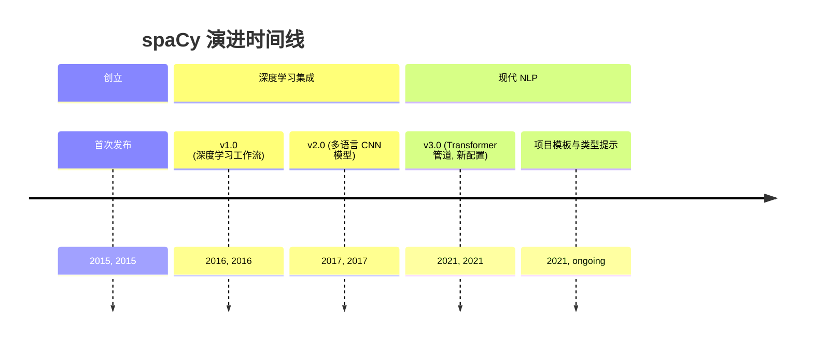
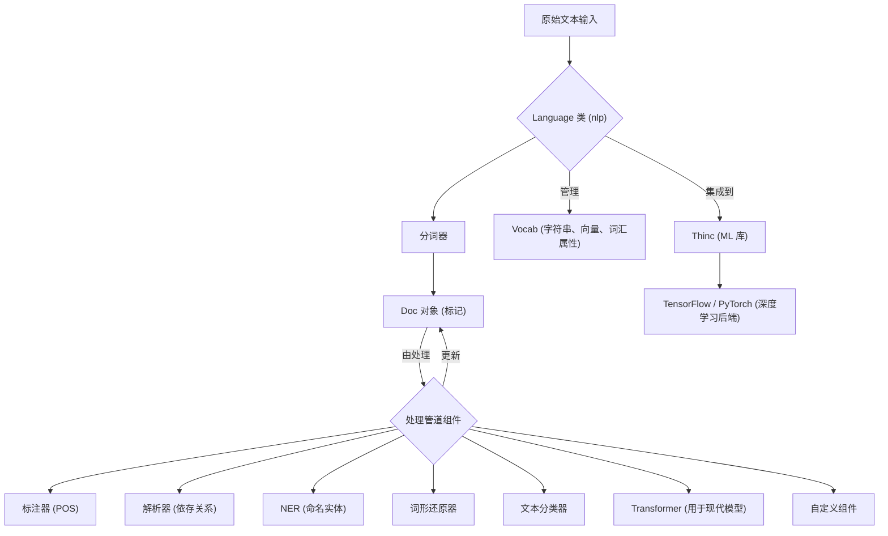

## spaCy 演进文档

### 1. 引言与历史背景

spaCy 是一个用于 Python 高级自然语言处理 (NLP) 的开源库，专为生产环境设计。它专注于提供工业级 NLP 功能，并强调速度、效率和易用性。与主要用于教学和研究的库（如 NLTK）不同，spaCy 旨在为实际应用提供健壮且高性能的 NLP 软件，包括构建聊天机器人、信息提取系统和内容推荐引擎。

spaCy 最初由 Explosion AI 的创始人 Matthew Honnibal 和 Ines Montani 于 2015 年 2 月发布。从一开始，该库就通过提供预训练的统计模型和用于常见 NLP 任务的简化 API 而脱颖而出。其发展中的关键里程碑包括引入深度学习工作流、用于各种语言的卷积神经网络模型以及最先进的基于 Transformer 的管道的重大更新。

2021 年 2 月发布的重大版本 **spaCy 3.0** 带来了基于 Transformer 的管道、新的配置系统和改进的训练工作流，进一步巩固了其作为现代 NLP 强大工具的地位。

### 1.1. spaCy 演进时间线



### 2. 核心架构

spaCy 的架构旨在实现性能和灵活性，利用 Python 和 Cython 进行核心实现。它围绕着核心数据结构和高度可定制的处理管道。

#### 2.1. 核心数据结构

*   **`Language` 类 (`nlp`)**: 主要类，协调处理管道、管理训练和处理序列化。它接收原始文本并将其转换为 `Doc` 对象。
*   **`Vocab`**: 词汇表对象集中管理字符串、词向量和词汇属性。这种设计可以防止冗余数据存储，节省内存并确保语言数据的单一事实来源。
*   **`Doc` 对象**: 语言注释的核心容器。当文本被处理时，它被转换为 `Doc` 对象，该对象拥有标记序列及其所有相关注释。`Doc` 对象最初由 `Tokenizer` 构建，然后由其他管道组件就地修改。
*   **`Token`**: 表示 `Doc` 中文本的单个单元（单词、标点符号、空格）。
*   **`Span`**: `Doc` 对象中的一个切片或片段，允许轻松操作连续的标记序列。
*   **`Lexeme`**: `Vocab` 中的一个条目，表示不带上下文的词类型。

#### 2.2. 处理管道

`Language` 对象通过将其发送到一个或多个组件的管道来处理文本。此管道高度可定制，允许用户根据其特定的 NLP 需求添加或删除组件。

1.  **分词器 (Tokenizer)**: 第一步，根据语言特定规则将原始文本分割成 `Token` 对象。
2.  **管道组件 (Pipeline Components)**: 分词后，各种组件按顺序应用于 `Doc` 对象。这些组件可以包括：
    *   `tagger` (词性标注器)
    *   `parser` (依存句法分析器)
    *   `ner` (命名实体识别器)
    *   `lemmatizer` (确定单词的基本形式)
    *   `textcat` (文本分类器)
    *   `transformer` (用于基于 Transformer 的模型)
    *   用于专门任务的自定义组件。

#### 2.3. 深度学习集成

spaCy 通过其自身的机器学习库 **Thinc** 与 TensorFlow 和 PyTorch 等流行的深度学习库集成。它利用卷积神经网络模型，以及最近的最先进的基于 Transformer 的管道，用于词性标注、依存句法分析和命名实体识别等任务，实现了高准确性和性能。

**Mermaid 图：spaCy 核心架构**



### 3. 详细 API 概述

spaCy 提供了一致且直观的 API，用于各种 NLP 任务，专注于生产系统的易用性。

#### 3.1. 语言处理

*   **`spacy.load('en_core_web_sm')`**: 加载预训练语言模型。
*   **`nlp(text)`**: 处理原始文本以创建 `Doc` 对象。
*   **`doc.text`**: 原始文本。
*   **`token.text`**: 标记的文本。
*   **`token.lemma_`**: 标记的基本形式。
*   **`token.pos_`**: 粗粒度词性标签。
*   **`token.dep_`**: 句法依存关系。
*   **`ent.text`**: 命名实体的文本。
*   **`ent.label_`**: 命名实体的标签（例如 'PERSON'、'ORG'）。
*   **`span.text`**: 跨度的文本。

#### 3.2. 管道定制

*   **`nlp.add_pipe(component_name)`**: 将自定义组件添加到处理管道。
*   **`nlp.disable_pipe(component_name)`**: 禁用管道中的组件。

#### 3.3. 训练和配置 (spaCy 3.0+)

*   **`spacy train config.cfg --output ./output`**: 用于使用配置文件训练模型的命令行工具。
*   **`config.cfg`**: 一个声明性配置文件，定义了训练的所有设置、超参数、模型实现和管道组件。

#### 3.4. 序列化

*   **`nlp.to_disk('./my_model')`**: 将训练好的模型保存到磁盘。
*   **`spacy.load('./my_model')`**: 从磁盘加载训练好的模型。

### 3.5. API 思维导图

```mermaid
mindmap
  root((spaCy API))
    (语言处理)
      (spacy.load)
      (nlp(text))
      (doc.text)
      (token.text)
      (token.lemma_)
      (token.pos_)
      (token.dep_)
      (ent.text)
      (ent.label_)
      (span.text)
    (管道定制)
      (nlp.add_pipe)
      (nlp.disable_pipe)
    (训练与配置)
      (spacy train)
      (config.cfg)
    (序列化)
      (nlp.to_disk)
      (spacy.load)
```

### 4. 演变与影响

*   **工业级 NLP:** spaCy 通过提供专门为生产级 NLP 设计的库填补了关键空白，为实际应用提供了速度、效率和健壮的模型。
*   **预训练模型和易用性:** 它提供了大量高质量的预训练模型，显著降低了复杂 NLP 任务的入门门槛，使用户能够快速上手。
*   **性能和可扩展性:** Cython 和优化算法的使用确保了 spaCy 的高性能，使其适用于高效处理大量文本数据。
*   **现代 NLP 技术:** 持续集成最先进的技术，例如 spaCy 3.0 中基于 Transformer 的管道，使该库始终处于 NLP 发展的前沿。
*   **定制和可扩展性:** 高度可定制的管道和对自定义组件的支持允许用户根据其特定需求定制 spaCy，使其适应各种 NLP 挑战。

### 5. 结论

spaCy 已成为 Python 中高级自然语言处理的强大且不可或缺的库。其专注于性能、效率和生产就绪性的架构设计使其与众不同。通过提供全面的工具套件、预训练模型和高度可定制的管道，spaCy 赋能开发人员和研究人员构建健壮且可扩展的 NLP 应用程序。持续的演进，特别是与现代深度学习技术的集成，确保 spaCy 仍然是应对实际场景中复杂语言理解任务的首选。
