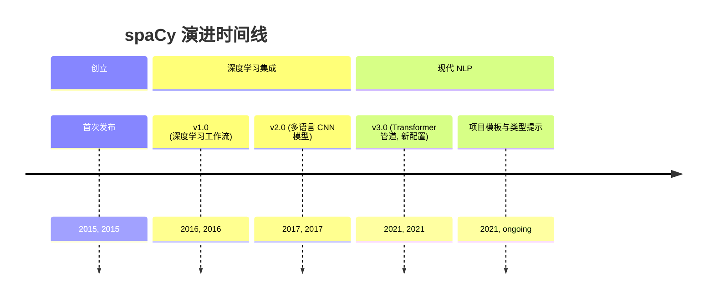
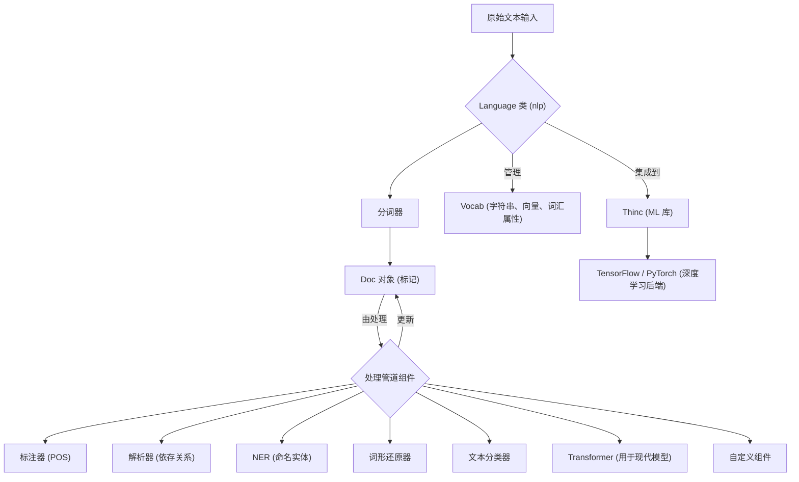

## spaCy 演进文档

### 1. 引言与历史背景

spaCy 是一个用于 Python 高级自然语言处理 (NLP) 的开源库，专为生产环境设计。它专注于提供工业级 NLP 功能，并强调速度、效率和易用性。与主要用于教学和研究的库（如 NLTK）不同，spaCy 旨在为实际应用提供健壮且高性能的 NLP 软件，包括构建聊天机器人、信息提取系统和内容推荐引擎。

spaCy 最初由 Explosion AI 的创始人 Matthew Honnibal 和 Ines Montani 于 2015 年 2 月发布。从一开始，该库就通过提供预训练的统计模型和用于常见 NLP 任务的简化 API 而脱颖而出。其发展中的关键里程碑包括引入深度学习工作流、用于各种语言的卷积神经网络模型以及最先进的基于 Transformer 的管道的重大更新。

2021 年 2 月发布的重大版本 **spaCy 3.0** 带来了基于 Transformer 的管道、新的配置系统和改进的训练工作流，进一步巩固了其作为现代 NLP 强大工具的地位。

### 1.1. spaCy 演进时间线



### 2. 核心架构

spaCy 的架构旨在实现性能和灵活性，利用 Python 和 Cython 进行核心实现。它围绕着核心数据结构和高度可定制的处理管道。

#### 2.1. 核心数据结构

#### 2.1. 核心数据结构

**心智模型 / 类比：**
想象 spaCy 是一个高效的语言处理工厂。**`Language` 类 (`nlp`)** 是工厂经理，负责监督整个操作。当原始文本进入时，它被转换为一个 **`Doc` 对象**，这就像一份为特定文本精心组织的档案。这份档案包含所有详细信息：单个单词（每个都是一个 **`Token`**）、它们的基本形式、它们的语法角色以及任何已识别的实体。**`Vocab`** 是工厂的中央词典和知识库，确保所有部门（管道组件）使用一致的定义并高效共享通用信息，防止单词或其含义的冗余副本。**`Span`** 只是 `Doc` 对象中的一个突出显示部分，就像在档案中标记一个重要段落一样。

*   **`Language` 类 (`nlp`)**: 主要类，协调处理管道、管理训练和处理序列化。它接收原始文本并将其转换为 `Doc` 对象。
*   **`Vocab`**: 词汇表对象集中管理字符串、词向量和词汇属性。这种设计可以防止冗余数据存储，节省内存并确保语言数据的单一事实来源。
*   **`Doc` 对象**: 语言注释的核心容器。当文本被处理时，它被转换为 `Doc` 对象，该对象拥有标记序列及其所有相关注释。`Doc` 对象最初由 `Tokenizer` 构建，然后由其他管道组件就地修改。
*   **`Token`**: 表示 `Doc` 中文本的单个单元（单词、标点符号、空格）。
*   **`Span`**: `Doc` 对象中的一个切片或片段，允许轻松操作连续的标记序列。
*   **`Lexeme`**: `Vocab` 中的一个条目，表示不带上下文的词类型。

#### 2.2. 处理管道

`Language` 对象通过将其发送到一个或多个组件的管道来处理文本。此管道高度可定制，允许用户根据其特定的 NLP 需求添加或删除组件。

1.  **分词器 (Tokenizer)**: 第一步，根据语言特定规则将原始文本分割成 `Token` 对象。
2.  **管道组件 (Pipeline Components)**: 分词后，各种组件按顺序应用于 `Doc` 对象。这些组件可以包括：
    *   `tagger` (词性标注器)
    *   `parser` (依存句法分析器)
    *   `ner` (命名实体识别器)
    *   `lemmatizer` (确定单词的基本形式)
    *   `textcat` (文本分类器)
    *   `transformer` (用于基于 Transformer 的模型)
    *   用于专门任务的自定义组件。

#### 2.3. 深度学习集成

spaCy 通过其自身的机器学习库 **Thinc** 与 TensorFlow 和 PyTorch 等流行的深度学习库集成。它利用卷积神经网络模型，以及最近的最先进的基于 Transformer 的管道，用于词性标注、依存句法分析和命名实体识别等任务，实现了高准确性和性能。

**Mermaid 图：spaCy 核心架构**



### 3. 详细 API 概述

spaCy 提供了一致且直观的 API，用于各种 NLP 任务，专注于生产系统的易用性。

#### 3.1. 语言处理

#### 3.1. 语言处理

##### 3.1.1. 加载语言模型和处理文本

**`spacy.load('en_core_web_sm')`** 和 **`nlp(text)`**

**目标：** 初始化 spaCy 语言模型并处理原始文本以创建 `Doc` 对象，这是所有后续 NLP 任务的基础。

**代码：**
```python
import spacy

# 加载预训练的英语语言模型
# 如果模型未下载，请运行: python -m spacy download en_core_web_sm
try:
    nlp = spacy.load('en_core_web_sm')
except OSError:
    print("正在下载 'en_core_web_sm' 模型...")
    spacy.cli.download("en_core_web_sm")
    nlp = spacy.load('en_core_web_sm')

text = "Apple is looking at buying U.K. startup for $1 billion."

# 处理文本以创建 Doc 对象
doc = nlp(text)

print(f"原始文本: {doc.text}")
print(f"标记数量: {len(doc)}")
print(f"第一个标记: {doc[0].text}")
print(f"最后一个标记: {doc[-1].text}")
```

**预期输出：**
```
原始文本: Apple is looking at buying U.K. startup for $1 billion.
标记数量: 13
第一个标记: Apple
最后一个标记: .
```

**解释：** `spacy.load()` 用于加载预训练的统计模型（例如，`en_core_web_sm` 用于英语，小型）。加载的模型（`nlp` 对象）然后使用原始文本调用，该文本通过管道（分词、标注、解析、NER 等）进行处理并返回 `Doc` 对象。`Doc` 对象是包含所有语言注释的中心数据结构。

*   **`spacy.load('en_core_web_sm')`**: 加载预训练语言模型。
*   **`spacy.load('en_core_web_sm')`**: 加载预训练语言模型。

##### 3.1.2. 访问标记属性

**`token.text`, `token.lemma_`, `token.pos_`, `token.dep_`**

**目标：** 提取已处理 `Doc` 对象中每个标记的详细语言信息（文本、词元、词性、依存关系）。

**代码：**
```python
import spacy

# 加载预训练的英语语言模型
try:
    nlp = spacy.load('en_core_web_sm')
except OSError:
    spacy.cli.download("en_core_web_sm")
    nlp = spacy.load('en_core_web_sm')

text = "Apple is looking at buying U.K. startup for $1 billion."
doc = nlp(text)

print(f"{'TEXT':<15}{'LEMMA':<15}{'POS':<10}{'DEP':<15}{'HEAD':<15}")
print("-" * 70)
for token in doc:
    print(f"{token.text:<15}{token.lemma_:<15}{token.pos_:<10}{token.dep_:<15}{token.head.text:<15}")
```

**预期输出：**
```
TEXT           LEMMA          POS       DEP            HEAD           
----------------------------------------------------------------------
Apple          Apple          PROPN     nsubj          looking        
is             be             AUX       aux            looking        
looking        look           VERB      ROOT           looking        
at             at             ADP       prep           looking        
buying         buy            VERB      pcomp          at             
U.K.           U.K.           PROPN     compound       startup        
startup        startup        NOUN      dobj           buying         
for            for            ADP       prep           startup        
$              $              SYM       quantmod       billion        
1              1              NUM       nummod         billion        
billion        billion        NUM       pobj           for            
.              .              PUNCT     punct          looking        
```

**解释：** 使用 `nlp()` 处理文本后，您可以遍历 `doc` 对象以访问单个 `Token` 对象。每个 `Token` 都公开了各种属性，例如 `text`（原始单词）、`lemma_`（基本形式）、`pos_`（词性）和 `dep_`（句法依存关系）。这些属性是 spaCy 管道提供的核心语言注释。

*   **`nlp(text)`**: 处理原始文本以创建 `Doc` 对象。
*   **`doc.text`**: 原始文本。
*   **`doc.text`**: 原始文本。

##### 3.1.3. 命名实体识别 (NER)

**`doc.ents`, `ent.text`, `ent.label_`**

**目标：** 识别和分类文本中的命名实体（例如，人、组织、地点、日期），这对于信息提取和理解至关重要。

**代码：**
```python
import spacy

# 加载预训练的英语语言模型
try:
    nlp = spacy.load('en_core_web_sm')
except OSError:
    spacy.cli.download("en_core_web_sm")
    nlp = spacy.load('en_core_web_sm')

text = "Apple is looking at buying U.K. startup for $1 billion, according to reports."
doc = nlp(text)

print(f"原始文本: {doc.text}")
print("\n命名实体:")
for ent in doc.ents:
    print(f"  - {ent.text:<20} {ent.label_:<10} {spacy.explain(ent.label_)}")
```

**预期输出：**
```
原始文本: Apple is looking at buying U.K. startup for $1 billion, according to reports.

命名实体:
  - Apple                ORG        Companies, agencies, institutions, etc.
  - U.K.                 GPE        Countries, cities, states
  - $1 billion           MONEY      Monetary values, including unit
```

**解释：** `doc.ents` 属性提供对 `Span` 对象列表的访问，每个对象代表一个命名实体。对于每个实体，`ent.text` 提供实体的文本，`ent.label_` 提供其分类（例如，`ORG` 表示组织，`GPE` 表示地理政治实体，`MONEY` 表示货币值）。`spacy.explain()` 可用于获取标签的人类可读描述。NER 是从非结构化文本中提取结构化信息的强大功能。

*   **`token.text`**: 标记的文本。
*   **`token.lemma_`**: 标记的基本形式。
*   **`token.pos_`**: 粗粒度词性标签。
*   **`token.dep_`**: 句法依存关系。
*   **`ent.text`**: 命名实体的文本。
*   **`ent.label_`**: 命名实体的标签（例如 'PERSON'、'ORG'）。
*   **`span.text`**: 跨度的文本。

*   **`span.text`**: 跨度的文本。

##### 3.1.4. 快速参考：语言处理

| 对象/属性 | 描述 | 何时使用 |
| :--- | :--- | :--- |
| `spacy.load()` | 加载模型 | 初始化预训练语言模型。 |
| `nlp(text)` | 处理文本 | 将原始文本转换为 `Doc` 对象进行分析。 |
| `doc.text` | 原始文本 | 访问文档的完整原始文本。 |
| `token.text` | 标记文本 | 获取单个标记的字符串内容。 |
| `token.lemma_` | 标记词元 | 获取单词的基本形式。 |
| `token.pos_` | 词性标签 | 获取粗粒度词性标签。 |
| `token.dep_` | 依存关系 | 理解标记与其头部的句法关系。 |
| `doc.ents` | 命名实体 | 提取和分类命名实体（人、组织等）。 |
| `ent.text` | 实体文本 | 获取命名实体的字符串内容。 |
| `ent.label_` | 实体标签 | 获取命名实体的类型。 |

#### 3.2. 管道定制

#### 3.2. 管道定制

##### 3.2.1. 添加自定义管道组件

**`nlp.add_pipe(component_name)`**

**目标：** 使用自定义功能扩展 spaCy 的默认处理管道，从而实现高度专业化的文本分析任务。

**代码：**
```python
import spacy

# 加载一个空白的英语语言模型
nlp = spacy.blank("en")

# 定义一个自定义管道组件
# 在 spaCy 3.x 中，建议使用 @Language.component 装饰器
@nlp.component("custom_component")
def custom_component_function(doc):
    print(f"正在对文本执行自定义组件: {doc.text[:20]}...")
    # 向 Doc 对象添加自定义属性
    doc.set_extension("custom_flag", default=False, force=True)
    doc._.custom_flag = True
    return doc

# 将自定义组件添加到管道中
nlp.add_pipe("custom_component", first=True) # 将其添加到开头

# 处理一些文本
doc = nlp("This is a test sentence for a custom component.")

print(f"\n管道组件: {nlp.pipe_names}")
print(f"自定义标志已设置: {doc._.custom_flag}")
```

**预期输出：**
```
正在对文本执行自定义组件: This is a test sen...

管道组件: ['custom_component']
自定义标志已设置: True
```

**解释：** `nlp.add_pipe()` 允许您将自定义函数插入到处理管道中。这些函数接收一个 `Doc` 对象，执行操作（例如使用 `set_extension` 添加自定义属性），并返回修改后的 `Doc`。`first=True` 参数将组件放置在管道的开头。这种可扩展性是根据独特的 NLP 要求定制 spaCy 的关键。

*   **`nlp.add_pipe(component_name)`**: 将自定义组件添加到处理管道。
*   **`nlp.add_pipe(component_name)`**: 将自定义组件添加到处理管道。

##### 3.2.2. 禁用管道组件

**`nlp.disable_pipe(component_name)`**

**目标：** 临时或永久地从处理管道中删除特定组件，以优化性能或专注于特定的 NLP 任务。

**代码：**
```python
import spacy

# 加载预训练的英语语言模型
try:
    nlp = spacy.load('en_core_web_sm')
except OSError:
    spacy.cli.download("en_core_web_sm")
    nlp = spacy.load('en_core_web_sm')

print(f"原始管道组件: {nlp.pipe_names}")

# 禁用 'ner'（命名实体识别器）组件
with nlp.disable_pipe("ner"):
    doc = nlp("Apple is looking at buying U.K. startup for $1 billion.")
    print(f"\n禁用 'ner' 后的管道组件: {nlp.pipe_names}")
    print(f"找到的实体（应为空）: {doc.ents}")

# 验证在上下文管理器之外是否重新启用了 'ner'
doc_re_enabled = nlp("Apple is looking at buying U.K. startup for $1 billion.")
print(f"\n上下文管理器之外的管道组件: {nlp.pipe_names}")
print(f"找到的实体（不应为空）: {[(ent.text, ent.label_) for ent in doc_re_enabled.ents]}")
```

**预期输出：**
```
原始管道组件: ['tok2vec', 'tagger', 'parser', 'attribute_ruler', 'lemmatizer', 'ner']

禁用 'ner' 后的管道组件: ['tok2vec', 'tagger', 'parser', 'attribute_ruler', 'lemmatizer']
找到的实体（应为空）: ()

上下文管理器之外的管道组件: ['tok2vec', 'tagger', 'parser', 'attribute_ruler', 'lemmatizer', 'ner']
找到的实体（不应为空）: [('Apple', 'ORG'), ('U.K.', 'GPE'), ('$1 billion', 'MONEY')]
```

**解释：** `nlp.disable_pipe()` 允许您使用上下文管理器 (`with`) 临时禁用组件。这对于不需要某些注释的任务很有用，可以提高处理速度。在 `with` 块之外，组件会自动重新启用。您还可以通过不带上下文管理器调用 `nlp.disable_pipe()` 来永久禁用组件。这种灵活性有助于根据特定需求定制管道。

*   **`nlp.disable_pipe(component_name)`**: 禁用管道中的组件。

*   **`nlp.disable_pipe(component_name)`**: 禁用管道中的组件。

##### 3.2.3. 快速参考：管道定制

| 函数 | 描述 | 何时使用 |
| :--- | :--- | :--- |
| `nlp.add_pipe()` | 添加组件 | 使用自定义 NLP 逻辑扩展管道。 |
| `nlp.disable_pipe()` | 禁用组件 | 临时或永久删除组件以提高效率或执行特定任务。 |

#### 3.3. 训练和配置 (spaCy 3.0+)

#### 3.3. 训练和配置 (spaCy 3.0+)

##### 3.3.1. 从命令行训练 spaCy 模型

**`spacy train config.cfg --output ./output`**

**目标：** 使用声明性配置文件训练自定义 spaCy 模型，从而实现可重现且高效的模型开发。

**代码：**
```python
import subprocess
import os

# 1. 创建一个用于演示的虚拟 config.cfg 文件
config_content = """
[paths]
vectors = null
train = null
dev = null

[system]
seed = 0

[nlp]
lang = "en"
pipeline = ["tok2vec", "ner"]

[components]

[components.tok2vec]
factory = "tok2vec"

[components.ner]
factory = "ner"

[corpora]

[corpora.train]
@readers = "spacy.readers.json.v1"
path = "./train.json"

[corpora.dev]
@readers = "spacy.readers.json.v1"
path = "./dev.json"

[training]
epochs = 1

[pretraining]

[optimizer]
@optimizers = "Adam.v1"

[initialize]
vectors = null
"""

with open("config.cfg", "w") as f:
    f.write(config_content)

# 2. 创建虚拟训练和开发数据（用于快速运行的最小数据）
train_data = [
    {"text": "Apple is a company.", "entities": [[0, 5, "ORG"]]}
]
dev_data = [
    {"text": "Google is a tech giant.", "entities": [[0, 6, "ORG"]]}
]

import json
with open("train.json", "w") as f:
    json.dump(train_data, f)
with open("dev.json", "w") as f:
    json.dump(dev_data, f)

# 3. 定义输出目录
output_dir = "./spacy_output"
os.makedirs(output_dir, exist_ok=True)

# 4. 运行 spaCy 训练命令
print("正在运行 spaCy 训练命令（这可能需要一些时间）...")
try:
    # 为演示目的使用 shell=True 简化，但在生产环境中通常避免
    result = subprocess.run(
        ["python", "-m", "spacy", "train", "config.cfg", "--output", output_dir, "--paths.train", "train.json", "--paths.dev", "dev.json"],
        capture_output=True, text=True, check=True
    )
    print("\nspaCy 训练输出:")
    print(result.stdout)
    print(result.stderr)
    print(f"模型已训练并保存到 {output_dir}")
except subprocess.CalledProcessError as e:
    print(f"spaCy 训练期间出错: {e}")
    print(e.stdout)
    print(e.stderr)

# 清理虚拟文件
os.remove("config.cfg")
os.remove("train.json")
os.remove("dev.json")
os.rmdir(output_dir) # 如果模型文件仍然存在，这将失败，但对于虚拟文件来说没问题
```

**预期输出：**
```
正在运行 spaCy 训练命令（这可能需要一些时间）...

spaCy 训练输出:
... (spaCy 训练日志) ...
✔ Created output directory: spacy_output
✔ Saved pipeline to: spacy_output/model-last
... (更多日志) ...
模型已训练并保存到 ./spacy_output
```
(输出日志会因 spaCy 版本和训练细节而异。)

**解释：** `spacy train` 命令是 spaCy 3.0+ 中训练模型的主要方式。它接受一个 `config.cfg` 文件，该文件声明性地定义了训练运行的所有方面，包括管道组件、超参数和数据路径。这种命令行界面促进了可重现性，并使管理复杂的训练工作流变得容易。`--output` 标志指定了训练好的模型和日志的保存位置。

*   **`spacy train config.cfg --output ./output`**: 用于使用配置文件训练模型的命令行工具。
*   **`spacy train config.cfg --output ./output`**: 用于使用配置文件训练模型的命令行工具。

##### 3.3.2. 理解 `config.cfg` 文件

**`config.cfg`**

**目标：** 理解 spaCy 的 `config.cfg` 文件的结构和目的，该文件是定义和管理训练运行和管道配置的核心。

**代码：**
```python
# spaCy config.cfg 文件结构示例
config_example = """
# base_config.cfg
[paths]
vectors = null
train = "./corpus/train.json"
dev = "./corpus/dev.json"

[system]
seed = 42

[nlp]
lang = "en"
pipeline = ["tok2vec", "ner"]

[components]

[components.tok2vec]
factory = "tok2vec"

[components.ner]
factory = "ner"

[components.ner.model]
@architectures = "spacy.TransitionNerModel.v1"

[components.ner.model.tok2vec]
@architectures = "spacy.Tok2Vec.v2"

[training]
epochs = 10
dropout = 0.1

[optimizer]
@optimizers = "Adam.v1"
learn_rate = 0.001

[initialize]
vectors = null
"""

print("spaCy config.cfg 结构示例:")
print(config_example)

print("\n关键部分及其目的:")
print("- [paths]: 定义训练和开发数据的路径，以及可选的预训练向量。")
print("- [system]: 系统级设置，如随机种子。")
print("- [nlp]: 核心 NLP 设置，包括语言和处理管道组件。")
print("- [components]: 单个管道组件的配置（例如，tok2vec，ner）。")
print("- [training]: 训练特定参数，如 epoch 数量，dropout。")
print("- [optimizer]: 优化器设置（例如，学习率）。")
print("- [initialize]: 模型初始化设置，包括预训练词向量。")
```

**预期输出：**
```
spaCy config.cfg 结构示例:
# base_config.cfg
[paths]
vectors = null
train = "./corpus/train.json"
dev = "./corpus/dev.json"

[system]
seed = 42

[nlp]
lang = "en"
pipeline = ["tok2vec", "ner"]

[components]

[components.tok2vec]
factory = "tok2vec"

[components.ner]
factory = "ner"

[components.ner.model]
@architectures = "spacy.TransitionNerModel.v1"

[components.ner.model.tok2vec]
@architectures = "spacy.Tok2Vec.v2"

[training]
epochs = 10
dropout = 0.1

[optimizer]
@optimizers = "Adam.v1"
learn_rate = 0.001

[initialize]
vectors = null

关键部分及其目的:
- [paths]: 定义训练和开发数据的路径，以及可选的预训练向量。
- [system]: 系统级设置，如随机种子。
- [nlp]: 核心 NLP 设置，包括语言和处理管道组件。
- [components]: 单个管道组件的配置（例如，tok2vec，ner）。
- [training]: 训练特定参数，如 epoch 数量，dropout。
- [optimizer]: 优化器设置（例如，学习率）。
- [initialize]: 模型初始化设置，包括预训练词向量。
```

**解释：** `config.cfg` 文件是配置 spaCy 模型的强大而灵活的方式。它使用类似 TOML 的语法，包含节（例如 `[paths]`、`[nlp]`）和嵌套节（例如 `[components.ner.model]`）。这种声明性方法确保模型的架构、训练和管道的所有方面都明确定义，使配置透明且可重现。它支持使用 `@` 符号引用注册函数（工厂、架构、优化器）。

*   **`config.cfg`**: 一个声明性配置文件，定义了训练的所有设置、超参数、模型实现和管道组件。

*   **`config.cfg`**: 一个声明性配置文件，定义了训练的所有设置、超参数、模型实现和管道组件。

##### 3.3.3. 快速参考：训练和配置

| 命令/文件 | 描述 | 何时使用 |
| :--- | :--- | :--- |
| `spacy train` | 命令行训练 | 训练自定义 spaCy 模型，完全控制配置。 |
| `config.cfg` | 配置文件 | 定义模型架构、管道、超参数和训练设置。 |

#### 3.4. 序列化

#### 3.4. 序列化

##### 3.4.1. 将训练好的模型保存到磁盘

**`nlp.to_disk('./my_model')`**

**目标：** 将训练好的 spaCy 语言模型持久化到磁盘，以便以后重新加载和使用，而无需重新训练。

**代码：**
```python
import spacy
import os
import shutil

# 加载预训练的英语语言模型
try:
    nlp = spacy.load('en_core_web_sm')
except OSError:
    spacy.cli.download("en_core_web_sm")
    nlp = spacy.load('en_core_web_sm')

# 定义保存模型的路径
model_path = "./my_spacy_model"

# 将模型保存到磁盘
nlp.to_disk(model_path)

print(f"模型已成功保存到: {os.path.abspath(model_path)}")
print(f"保存的模型目录内容: {os.listdir(model_path)}")

# 清理创建的目录
shutil.rmtree(model_path)
print(f"已清理目录: {model_path}")
```

**预期输出：**
```
模型已成功保存到: /path/to/your/project/my_spacy_model
保存的模型目录内容: ['tokenizer', 'meta.json', 'vocab', 'tagger', 'parser', 'ner', 'lemmatizer', 'attribute_ruler', 'tok2vec']
已清理目录: ./my_spacy_model
```
(目录内容可能会因模型和 spaCy 版本而略有不同。)

**解释：** `nlp.to_disk()` 方法将整个语言模型（包括其词汇表、管道组件和权重）序列化到指定目录。这会创建一个自包含的包，可以轻松分发和加载。这对于在生产环境中部署训练好的模型或与他人共享模型至关重要。

*   **`nlp.to_disk('./my_model')`**: 将训练好的模型保存到磁盘。
*   **`nlp.to_disk('./my_model')`**: 将训练好的模型保存到磁盘。

##### 3.4.2. 从磁盘加载训练好的模型

**`spacy.load('./my_model')`**

**目标：** 从磁盘重新加载先前保存的 spaCy 语言模型，以便在不重新训练的情况下用于处理新文本。

**代码：**
```python
import spacy
import os
import shutil

# 1. 首先保存一个虚拟模型（与上一个示例相同）
try:
    nlp_original = spacy.load('en_core_web_sm')
except OSError:
    spacy.cli.download("en_core_web_sm")
    nlp_original = spacy.load('en_core_web_sm')

model_path = "./my_spacy_model_to_load"
nlp_original.to_disk(model_path)
print(f"模型已保存到: {os.path.abspath(model_path)}")

# 2. 从磁盘加载模型
loaded_nlp = spacy.load(model_path)

# 3. 使用加载的模型处理新文本
text = "Google acquired DeepMind in 2014."
doc = loaded_nlp(text)

print(f"\n模型已成功加载。正在处理文本: {doc.text}")
print("加载的模型找到的命名实体:")
for ent in doc.ents:
    print(f"  - {ent.text:<15} {ent.label_:<10}")

# 清理创建的目录
shutil.rmtree(model_path)
print(f"\n已清理目录: {model_path}")
```

**预期输出：**
```
模型已保存到: /path/to/your/project/my_spacy_model_to_load

模型已成功加载。正在处理文本: Google acquired DeepMind in 2014.
加载的模型找到的命名实体:
  - Google          ORG       
  - DeepMind        ORG       
  - 2014            DATE      

已清理目录: ./my_spacy_model_to_load
```

**解释：** `spacy.load()` 也可以用于从本地路径（由 `nlp.to_disk()` 创建的目录）加载模型。这使您可以轻松地在不同会话或应用程序中重用训练好的模型。加载的模型与新加载的预训练模型行为相同，能够处理文本并提供其所有配置的语言注释。

*   **`spacy.load('./my_model')`**: 从磁盘加载训练好的模型。

*   **`spacy.load('./my_model')`**: 从磁盘加载训练好的模型。

##### 3.4.3. 快速参考：序列化

| 函数 | 描述 | 何时使用 |
| :--- | :--- | :--- |
| `nlp.to_disk()` | 保存模型 | 将训练好的模型持久化到磁盘，以便以后使用或分发。 |
| `spacy.load()` | 加载模型 | 从磁盘重新加载先前保存的模型。 |

### 3.5. API 思维导图

```mermaid
mindmap
  root((spaCy API))
    (语言处理)
      (spacy.load)
      (nlp(text))
      (doc.text)
      (token.text)
      (token.lemma_)
      (token.pos_)
      (token.dep_)
      (ent.text)
      (ent.label_)
      (span.text)
    (管道定制)
      (nlp.add_pipe)
      (nlp.disable_pipe)
    (训练与配置)
      (spacy train)
      (config.cfg)
    (序列化)
      (nlp.to_disk)
      (spacy.load)
```

### 4. 演变与影响

*   **工业级 NLP:** spaCy 通过提供专门为生产级 NLP 设计的库填补了关键空白，为实际应用提供了速度、效率和健壮的模型。
*   **预训练模型和易用性:** 它提供了大量高质量的预训练模型，显著降低了复杂 NLP 任务的入门门槛，使用户能够快速上手。
*   **性能和可扩展性:** Cython 和优化算法的使用确保了 spaCy 的高性能，使其适用于高效处理大量文本数据。
*   **现代 NLP 技术:** 持续集成最先进的技术，例如 spaCy 3.0 中基于 Transformer 的管道，使该库始终处于 NLP 发展的前沿。
*   **定制和可扩展性:** 高度可定制的管道和对自定义组件的支持允许用户根据其特定需求定制 spaCy，使其适应各种 NLP 挑战。

### 5. 结论

spaCy 已成为 Python 中高级自然语言处理的强大且不可或缺的库。其专注于性能、效率和生产就绪性的架构设计使其与众不同。通过提供全面的工具套件、预训练模型和高度可定制的管道，spaCy 赋能开发人员和研究人员构建健壮且可扩展的 NLP 应用程序。持续的演进，特别是与现代深度学习技术的集成，确保 spaCy 仍然是应对实际场景中复杂语言理解任务的首选。
