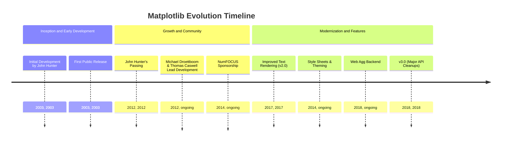
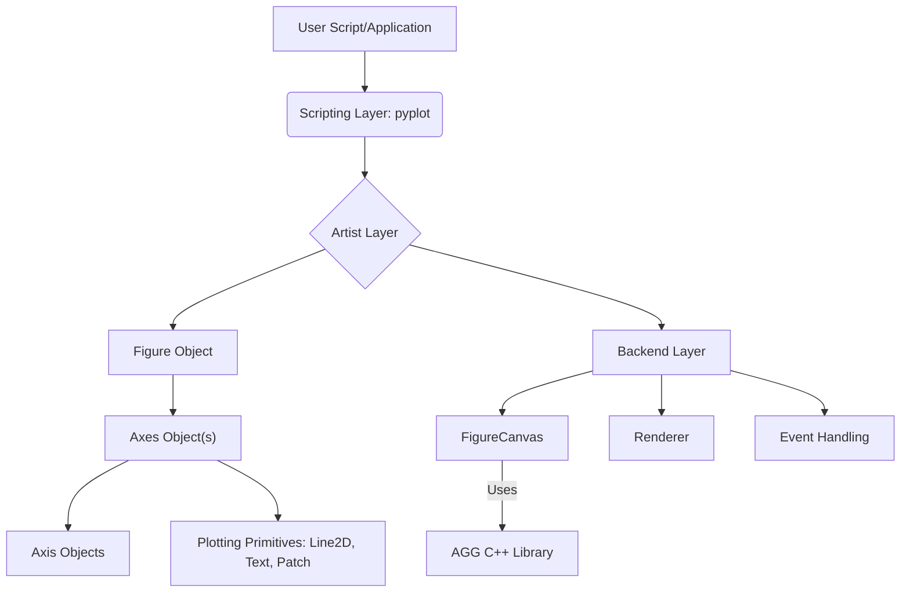
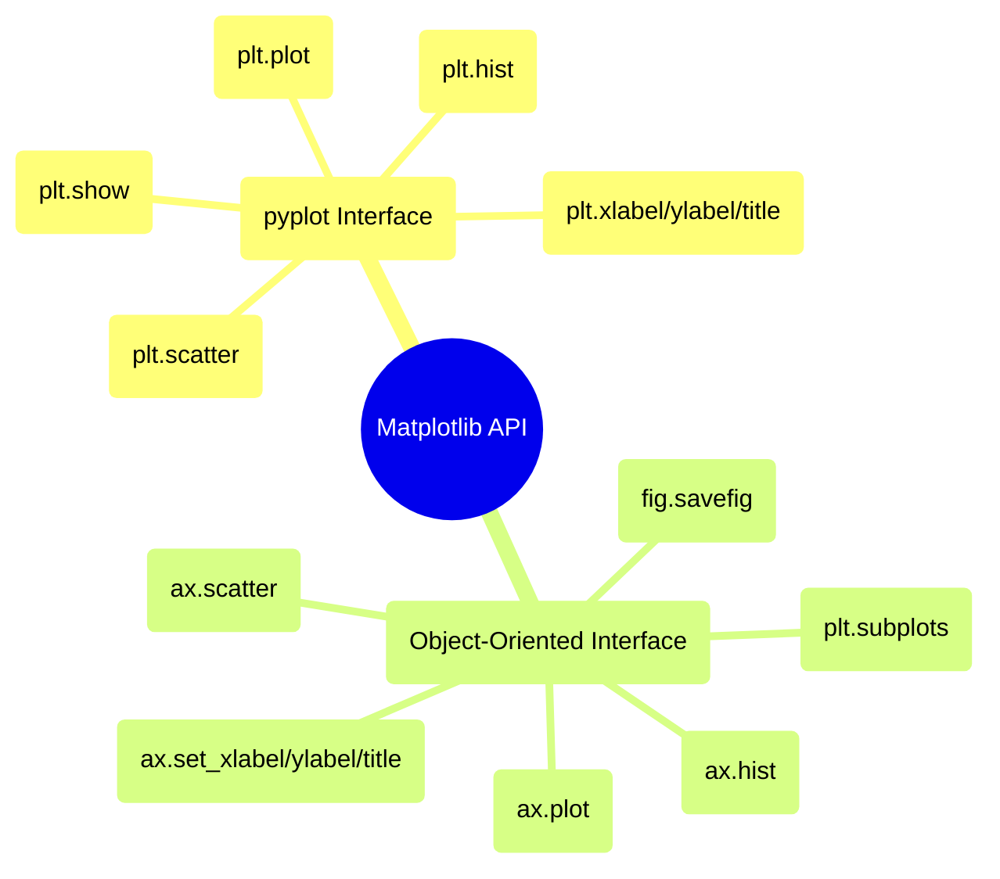

## Matplotlib Evolution Document

### 1. Introduction and Historical Context

Matplotlib is a comprehensive library for creating static, animated, and interactive visualizations in Python. It is a cornerstone of the scientific Python ecosystem, providing a flexible and powerful tool for generating high-quality plots, charts, and figures across various domains, including data science, engineering, and research.

Matplotlib was initially conceived and developed by John Hunter in 2003. As a neurobiologist, Hunter sought to replace proprietary MATLAB-based tools for analyzing electrocorticography (ECOG) signals with an open-source, Python-based alternative. His goal was to create a plotting library that offered a similar interface and capabilities to MATLAB's plotting functions, but within the Python environment, allowing for greater extensibility and collaboration among researchers.

Since its inception, Matplotlib has evolved from a MATLAB-like scripting interface to a robust, object-oriented plotting library. It leverages NumPy extensively for numerical operations and has fostered a vibrant open-source community that continues to drive its development and maintenance.

### 1.1. Matplotlib Evolution Timeline



### 2. Core Architecture

Matplotlib's architecture is structured in a layered hierarchy, providing different levels of control and abstraction. This design allows users to create simple plots quickly using a high-level interface or to exert fine-grained control over every element of a figure using a more object-oriented approach.

#### 2.1. The Backend Layer

**Mental Model / Analogy for The Backend Layer:**
Think of the Backend Layer as the specialized workshop where the actual drawing happens. It's like a team of skilled artisans and their tools:
*   **`FigureCanvas`**: This is the physical canvas or screen where the artwork (your plot) will appear. It knows how to display the drawing, whether it's on your computer monitor or saved as a file (PNG, PDF).
*   **`Renderer`**: This is the artist themselves, taking your abstract instructions (e.g., "draw a blue line from here to there") and translating them into precise brushstrokes on the `FigureCanvas`. It uses high-performance tools (like the AGG C++ library) to make sure the drawing is smooth and fast.
*   **`Event`**: This is the workshop's interaction specialist. If you click on the drawing or press a key, the `Event` system detects it and tells the `Renderer` or `FigureCanvas` what happened, allowing for interactive features.

This layer works behind the scenes, handling the low-level details of getting your visualization from code to display.

This is the lowest layer, responsible for handling the actual drawing and interacting with the operating system's graphics toolkit. It consists of three abstract interface classes:

*   **`FigureCanvas`**: The area where the plot is drawn and displayed. It handles rendering to various output formats (e.g., screen, PNG, PDF).
*   **`Renderer`**: Responsible for translating abstract drawing commands into specific drawing operations on the `FigureCanvas`. Matplotlib often uses the Anti-Grain Geometry (AGG) C++ library for high-performance 2D rendering.
*   **`Event`**: Handles user interactions such as keyboard presses and mouse clicks, enabling interactive features in plots.

#### 2.2. The Artist Layer

This is the intermediate layer, where most of the plotting logic resides. Everything visible on a Matplotlib figure is an `Artist` object. Artists can be primitive (e.g., `Line2D`, `Rectangle`, `Text`) or composite (collections of other artists).

**Mental Model / Analogy for `Figure` and `Axes`:**
*   **`Figure`:** Think of the `Figure` as the entire canvas or a blank sheet of paper where you'll draw your plots. It's the top-level container that holds everything related to your visualization.
*   **`Axes`:** Now, imagine drawing one or more individual plots (like a bar chart, a line graph, or a scatter plot) *onto* that sheet of paper. Each of these individual plots is an `Axes` object. An `Axes` has its own x-axis, y-axis, title, and labels. You can have multiple `Axes` (subplots) on a single `Figure`.

*   **`Figure`**: The top-level container for all plot elements. It can contain multiple `Axes` objects, titles, legends, and other artists.
*   **`Axes`**: The most important `Artist` object, representing a single plot area. Most plotting methods (e.g., `plot()`, `scatter()`, `hist()`) are defined as methods of the `Axes` object. An `Axes` object contains two (or three in 3D) `Axis` objects, which handle ticks, tick labels, and axis labels.

#### 2.3. The Scripting Layer (`pyplot`)

This is the highest-level interface, designed for quick and easy plot generation, mimicking MATLAB's procedural plotting style. The `matplotlib.pyplot` module provides a collection of functions that implicitly create and manage figures and axes, making it convenient for interactive plotting and simple scripts.

**Mermaid Diagram: Matplotlib Core Architecture**



### 3. Detailed API Overview

Matplotlib offers two main approaches to plotting: the convenient `pyplot` interface for quick plots and the more powerful object-oriented (OO) interface for fine-grained control. While `pyplot` is often used for initial exploration, the OO API is recommended for complex visualizations and programmatic control.

#### 3.1. `matplotlib.pyplot` Interface

This procedural interface provides a state-machine environment, where functions implicitly operate on the "current" figure and axes. It's ideal for interactive sessions and simple plots.

##### 3.1.1. Creating Line Plots

**`plt.plot(x, y, ...)`**

**Goal:** Create a 2D line plot of `y` versus `x`.

**Code:**
```python
import matplotlib.pyplot as plt
import numpy as np

x = np.linspace(0, 10, 100)
y = np.sin(x)

plt.plot(x, y, label='sin(x)', color='blue', linestyle='--')
plt.xlabel('X-axis')
plt.ylabel('Y-axis')
plt.title('Simple Sine Wave')
plt.legend()
plt.grid(True)
plt.show()
```

**Expected Output:**
(A plot window showing a blue dashed sine wave from 0 to 10, with x and y labels, a title, a legend, and a grid.)

**Explanation:** `plt.plot()` is the most basic plotting function. It takes x and y coordinates and draws lines and/or markers. You can customize the line style, color, and add labels for legends. `plt.show()` is necessary to display the plot.

*   **Context:** Plots lines and/or markers to the current `Axes`.
*   **Parameters:**
        *   `x`, `y`: The horizontal and vertical coordinates of the data points.
        *   `fmt`: (Optional) A format string, e.g., `'ro-'` for red circles with a solid line.
    *   **Returns:** A list of `Line2D` objects.

##### 3.1.2. Creating Scatter Plots

**`plt.scatter(x, y, ...)`**

**Goal:** Create a scatter plot of `y` versus `x` with customizable markers.

**Code:**
```python
import matplotlib.pyplot as plt
import numpy as np

np.random.seed(42)
x = np.random.rand(50)
y = np.random.rand(50)
sizes = np.random.randint(20, 200, 50) # Marker sizes
colors = np.random.rand(50) # Marker colors

plt.scatter(x, y, s=sizes, c=colors, alpha=0.7, cmap='viridis')
plt.xlabel('X-value')
plt.ylabel('Y-value')
plt.title('Random Scatter Plot')
plt.colorbar(label='Color Value') # Add a color bar
plt.grid(True)
plt.show()
```

**Expected Output:**
(A plot window showing a scatter plot with 50 points, varying in size and color, with x and y labels, a title, a color bar, and a grid.)

**Explanation:** `plt.scatter()` is used for visualizing the relationship between two variables, often with additional dimensions represented by marker size (`s`) and color (`c`). `alpha` controls transparency, and `cmap` sets the colormap.

*   **Context:** Creates a scatter plot of `x` vs. `y`.
*   **Parameters:**
        *   `x`, `y`: The data positions.
        *   `s`: (Optional) The marker size in points^2.
        *   `c`: (Optional) The marker color.
    *   **Returns:** A `PathCollection` object.

##### 3.1.3. Creating Histograms

**`plt.hist(x, bins=10, ...)`**

**Goal:** Generate a histogram to visualize the distribution of a dataset.

**Code:**
```python
import matplotlib.pyplot as plt
import numpy as np

np.random.seed(42)
data = np.random.randn(1000) # 1000 random numbers from a normal distribution

plt.hist(data, bins=30, color='skyblue', edgecolor='black', alpha=0.7)
plt.xlabel('Value')
plt.ylabel('Frequency')
plt.title('Distribution of Random Data')
plt.grid(axis='y', alpha=0.75)
plt.show()
```

**Expected Output:**
(A plot window showing a histogram with 30 bins, skyblue bars with black edges, x and y labels, a title, and a grid.)

**Explanation:** `plt.hist()` is used to represent the frequency distribution of numerical data. The `bins` parameter controls the number of intervals (bins) into which the data is divided. `edgecolor` and `alpha` are common aesthetic customizations.

*   **Context:** Plots a histogram.
*   **Parameters:**
        *   `x`: The input data that is binned.
        *   `bins`: (Optional) The number of histogram bins.
    *   **Returns:** A tuple of `(n, bins, patches)`.

##### 3.1.4. Customizing Plot Labels and Title

**`plt.xlabel(label)`, `plt.ylabel(label)`, `plt.title(title)`**

**Goal:** Add descriptive labels to the x-axis and y-axis, and a title to the plot.

**Code:**
```python
import matplotlib.pyplot as plt
import numpy as np

x = np.array([1, 2, 3, 4])
y = x**2

plt.plot(x, y)
plt.xlabel('Input Value') # Set x-axis label
plt.ylabel('Squared Value') # Set y-axis label
plt.title('Relationship between Input and Squared Value') # Set plot title
plt.show()
```

**Expected Output:**
(A plot window showing a line plot with x-axis labeled "Input Value", y-axis labeled "Squared Value", and a title "Relationship between Input and Squared Value".)

**Explanation:** These functions are straightforward for adding essential descriptive text to your plots, making them understandable. In `pyplot`, they operate on the currently active `Axes`.

*   **Context:** Sets the label for the x-axis, y-axis, and the title of the current `Axes`, respectively.

##### 3.1.5. Displaying Plots

**`plt.show()`**

**Goal:** Display all open Matplotlib figures and block execution until they are closed.

**Code:**
```python
import matplotlib.pyplot as plt
import numpy as np

plt.plot([1, 2, 3], [4, 5, 6])
plt.title("First Plot")

# Create a second plot in a new figure
plt.figure() # Creates a new figure
plt.scatter(np.random.rand(10), np.random.rand(10))
plt.title("Second Plot")

plt.show() # Displays both plots
print("Plots displayed and closed.") # This line executes after plots are closed
```

**Expected Output:**
(Two separate plot windows will appear: one with a line plot titled "First Plot", and another with a scatter plot titled "Second Plot". After both windows are manually closed, the console will print "Plots displayed and closed.")

**Explanation:** `plt.show()` is essential for rendering your plots. In interactive environments (like Jupyter notebooks), plots might display automatically, but in scripts, `plt.show()` is required. It pauses script execution until the plot windows are closed.

*   **Context:** Displays all open figures. This function blocks execution until all figures are closed.

##### 3.1.6. Quick Reference: `pyplot` Interface

| Function | Description | When to Use |
| :--- | :--- | :--- |
| `plt.plot()` | Line plots | Simple 2D line graphs and series data. |
| `plt.scatter()` | Scatter plots | Visualizing relationships between two variables, often with size/color encoding. |
| `plt.hist()` | Histograms | Showing the distribution of a single numerical variable. |
| `plt.xlabel()`, `plt.ylabel()`, `plt.title()` | Labels and Title | Adding descriptive text to make plots understandable. |
| `plt.show()` | Display plots | Rendering and displaying generated figures. |

#### 3.1. `matplotlib.pyplot` Interface

This procedural interface provides a state-machine environment, where functions implicitly operate on the "current" figure and axes. It's ideal for interactive sessions and simple plots.

##### 3.1.1. Creating Line Plots

**`plt.plot(x, y, ...)`**

**Goal:** Create a 2D line plot of `y` versus `x`.

**Code:**
```python
import matplotlib.pyplot as plt
import numpy as np

x = np.linspace(0, 10, 100)
y = np.sin(x)

plt.plot(x, y, label='sin(x)', color='blue', linestyle='--')
plt.xlabel('X-axis')
plt.ylabel('Y-axis')
plt.title('Simple Sine Wave')
plt.legend()
plt.grid(True)
plt.show()
```

**Expected Output:**
(A plot window showing a blue dashed sine wave from 0 to 10, with x and y labels, a title, a legend, and a grid.)

**Explanation:** `plt.plot()` is the most basic plotting function. It takes x and y coordinates and draws lines and/or markers. You can customize the line style, color, and add labels for legends. `plt.show()` is necessary to display the plot.

*   **`plt.plot(x, y, ...)`**: Plots lines and/or markers to the current `Axes`.
*   **`plt.xlabel(label)`**: Sets the label for the x-axis.
*   **`plt.ylabel(label)`**: Sets the label for the y-axis.
*   **`plt.title(title)`**: Sets the title of the current `Axes`.
*   **`plt.legend()`**: Displays the legend.
*   **`plt.grid(True)`**: Adds a grid to the plot.
*   **`plt.show()`**: Displays all open figures and blocks execution until they are closed.

##### 3.1.2. Creating Scatter Plots

**`plt.scatter(x, y, ...)`**

**Goal:** Create a scatter plot of `y` versus `x` with customizable markers.

**Code:**
```python
import matplotlib.pyplot as plt
import numpy as np

np.random.seed(42)
x = np.random.rand(50)
y = np.random.rand(50)
sizes = np.random.randint(20, 200, 50) # Marker sizes
colors = np.random.rand(50) # Marker colors

plt.scatter(x, y, s=sizes, c=colors, alpha=0.7, cmap='viridis')
plt.xlabel('X-value')
plt.ylabel('Y-value')
plt.title('Random Scatter Plot')
plt.colorbar(label='Color Value') # Add a color bar
plt.grid(True)
plt.show()
```

**Expected Output:**
(A plot window showing a scatter plot with 50 points, varying in size and color, with x and y labels, a title, a color bar, and a grid.)

**Explanation:** `plt.scatter()` is used for visualizing the relationship between two variables, often with additional dimensions represented by marker size (`s`) and color (`c`). `alpha` controls transparency, and `cmap` sets the colormap.

*   **`plt.scatter(x, y, ...)`**: Creates a scatter plot of `x` vs. `y`.
*   **`plt.hist(x, bins=10, ...)`**: Plots a histogram.
*   **`plt.xlabel(label)`**: Sets the label for the x-axis.
*   **`plt.ylabel(label)`**: Sets the label for the y-axis.
*   **`plt.title(title)`**: Sets the title of the current `Axes`.
*   **`plt.show()`**: Displays all open figures.

##### 3.1.3. Creating Histograms

**`plt.hist(x, bins=10, ...)`**

**Goal:** Generate a histogram to visualize the distribution of a dataset.

**Code:**
```python
import matplotlib.pyplot as plt
import numpy as np

np.random.seed(42)
data = np.random.randn(1000) # 1000 random numbers from a normal distribution

plt.hist(data, bins=30, color='skyblue', edgecolor='black', alpha=0.7)
plt.xlabel('Value')
plt.ylabel('Frequency')
plt.title('Distribution of Random Data')
plt.grid(axis='y', alpha=0.75)
plt.show()
```

**Expected Output:**
(A plot window showing a histogram with 30 bins, skyblue bars with black edges, x and y labels, a title, and a grid.)

**Explanation:** `plt.hist()` is used to represent the frequency distribution of numerical data. The `bins` parameter controls the number of intervals (bins) into which the data is divided. `edgecolor` and `alpha` are common aesthetic customizations.

*   **`plt.hist(x, bins=10, ...)`**: Plots a histogram.
*   **`plt.xlabel(label)`**: Sets the label for the x-axis.
*   **`plt.ylabel(label)`**: Sets the label for the y-axis.
*   **`plt.title(title)`**: Sets the title of the current `Axes`.
*   **`plt.show()`**: Displays all open figures.

##### 3.1.4. Customizing Plot Labels and Title

**`plt.xlabel(label)`, `plt.ylabel(label)`, `plt.title(title)`**

**Goal:** Add descriptive labels to the x-axis and y-axis, and a title to the plot.

**Code:**
```python
import matplotlib.pyplot as plt
import numpy as np

x = np.array([1, 2, 3, 4])
y = x**2

plt.plot(x, y)
plt.xlabel('Input Value') # Set x-axis label
plt.ylabel('Squared Value') # Set y-axis label
plt.title('Relationship between Input and Squared Value') # Set plot title
plt.show()
```

**Expected Output:**
(A plot window showing a line plot with x-axis labeled "Input Value", y-axis labeled "Squared Value", and a title "Relationship between Input and Squared Value".)

**Explanation:** These functions are straightforward for adding essential descriptive text to your plots, making them understandable. In `pyplot`, they operate on the currently active `Axes`.

*   **`plt.xlabel(label)`**: Sets the label for the x-axis.
*   **`plt.ylabel(label)`**: Sets the label for the y-axis.
*   **`plt.title(title)`**: Sets the title of the current `Axes`.
*   **`plt.show()`**: Displays all open figures.

##### 3.1.5. Displaying Plots

**`plt.show()`**

**Goal:** Display all open Matplotlib figures and block execution until they are closed.

**Code:**
```python
import matplotlib.pyplot as plt
import numpy as np

plt.plot([1, 2, 3], [4, 5, 6])
plt.title("First Plot")

# Create a second plot in a new figure
plt.figure() # Creates a new figure
plt.scatter(np.random.rand(10), np.random.rand(10))
plt.title("Second Plot")

plt.show() # Displays both plots
print("Plots displayed and closed.") # This line executes after plots are closed
```

**Expected Output:**
(Two separate plot windows will appear: one with a line plot titled "First Plot", and another with a scatter plot titled "Second Plot". After both windows are manually closed, the console will print "Plots displayed and closed.")

**Explanation:** `plt.show()` is essential for rendering your plots. In interactive environments (like Jupyter notebooks), plots might display automatically, but in scripts, `plt.show()` is required. It pauses script execution until the plot windows are closed.

*   **`plt.show()`**: Displays all open figures and blocks execution until they are closed.

##### 3.1.6. Quick Reference: `pyplot` Interface

| Function | Description | When to Use |
| :--- | :--- | :--- |
| `plt.plot()` | Line plots | Simple 2D line graphs and series data. |
| `plt.scatter()` | Scatter plots | Visualizing relationships between two variables, often with size/color encoding. |
| `plt.hist()` | Histograms | Showing the distribution of a single numerical variable. |
| `plt.xlabel()`, `plt.ylabel()`, `plt.title()` | Labels and Title | Adding descriptive text to make plots understandable. |
| `plt.show()` | Display plots | Rendering and displaying generated figures. |

#### 3.2. Object-Oriented (OO) Interface

This approach provides explicit control over figures and axes objects, making it suitable for complex plots, embedding in GUI applications, and creating reusable plotting functions.

##### 3.2.1. Creating Figures and Axes

**`fig, ax = plt.subplots(nrows=1, ncols=1, ...)`**

**Goal:** Create a Figure object and one or more Axes objects, which are the actual plotting areas.

**Code:**
```python
import matplotlib.pyplot as plt
import numpy as np

# Create a single figure and a single set of axes
fig1, ax1 = plt.subplots() # Default is 1x1 grid
ax1.plot([1, 2, 3], [1, 4, 9])
ax1.set_title('Single Subplot')

# Create a figure with a 1x2 grid of subplots
fig2, (ax2, ax3) = plt.subplots(1, 2, figsize=(10, 4))
ax2.plot(np.sin(np.linspace(0, 2*np.pi, 50)))
ax2.set_title('Sine Wave')
ax3.plot(np.cos(np.linspace(0, 2*np.pi, 50)), color='orange')
ax3.set_title('Cosine Wave')
fig2.suptitle('Two Subplots on One Figure') # Title for the entire figure

plt.tight_layout() # Adjust subplot params for a tight layout
plt.show()
```

**Expected Output:**
(Two separate plot windows will appear. The first shows a single plot with a parabola. The second shows a figure with two subplots side-by-side, one with a sine wave and one with a cosine wave, and a main title for the figure.)

**Explanation:** `plt.subplots()` is the recommended way to start with the OO interface. It returns a `Figure` object (`fig`) and an `Axes` object (or an array of `Axes` objects if `nrows` or `ncols` > 1). You then call plotting methods directly on these `ax` objects.

*   **Context:** Creates a figure and a set of subplots. This is the most common way to start with the OO interface.
*   **Parameters:**
        *   `nrows`, `ncols`: The number of rows and columns of the subplot grid.
    *   **Returns:** A tuple `(Figure, Axes)` or `(Figure, ndarray of Axes)`.

*   **Returns:** A tuple `(Figure, Axes)` or `(Figure, ndarray of Axes)`.

##### 3.2.2. Plotting on Specific Axes

**`ax.plot(x, y, ...)`**, **`ax.scatter(x, y, ...)`**, **`ax.hist(x, bins=10, ...)`**

**Goal:** Create various types of plots directly on a specific `Axes` object, allowing for multi-panel figures.

**Code:**
```python
import matplotlib.pyplot as plt
import numpy as np

fig, axes = plt.subplots(1, 3, figsize=(15, 5)) # One row, three columns of subplots

x_data = np.linspace(0, 10, 50)
y_data = np.sin(x_data)

# Plot a line on the first axes
axes[0].plot(x_data, y_data, color='red')
axes[0].set_title('Line Plot')
axes[0].set_xlabel('X')
axes[0].set_ylabel('sin(X)')

# Plot a scatter on the second axes
np.random.seed(0)
scatter_x = np.random.rand(30)
scatter_y = np.random.rand(30)
axes[1].scatter(scatter_x, scatter_y, color='green', alpha=0.6)
axes[1].set_title('Scatter Plot')

# Plot a histogram on the third axes
hist_data = np.random.randn(1000)
axes[2].hist(hist_data, bins=20, color='purple', edgecolor='black')
axes[2].set_title('Histogram')

plt.tight_layout() # Adjust layout to prevent overlapping
plt.show()
```

**Expected Output:**
(A single plot window showing three subplots side-by-side: a red line plot, a green scatter plot, and a purple histogram, each with its own title and labels.)

**Explanation:** In the OO interface, plotting methods are called directly on the `Axes` objects (e.g., `ax.plot()`). This gives you explicit control over which subplot receives which plot, making it easy to create complex layouts with multiple visualizations.

*   **Context:** These are the OO equivalents of the `pyplot` functions, called directly on an `Axes` object.

*   **`ax.set_xlabel(label)`, `ax.set_ylabel(label)`, `ax.set_title(title)`**
    *   **Context:** These are the OO equivalents of the `pyplot` functions, called directly on an `Axes` object.

##### 3.2.3. Customizing Axes Labels and Title

**`ax.set_xlabel(label)`, `ax.set_ylabel(label)`, `ax.set_title(title)`**

**Goal:** Set descriptive labels for the x-axis and y-axis, and a title for a specific `Axes` object.

**Code:**
```python
import matplotlib.pyplot as plt

fig, ax = plt.subplots()
ax.plot([1, 2, 3], [10, 20, 15])
ax.set_xlabel('Experiment Duration (hours)') # Set x-axis label for this Axes
ax.set_ylabel('Measured Value') # Set y-axis label for this Axes
ax.set_title('Results of Experiment A') # Set title for this Axes
plt.show()
```

**Expected Output:**
(A plot window showing a line plot with x-axis labeled "Experiment Duration (hours)", y-axis labeled "Measured Value", and a title "Results of Experiment A".)

**Explanation:** In the OO interface, you use `set_xlabel()`, `set_ylabel()`, and `set_title()` methods directly on the `Axes` object to customize its specific labels and title. This is crucial when working with multiple subplots on a single figure.

*   **Context:** Sets the labels and title for a specific `Axes` object.

*   **`fig.savefig(fname, ...)`**
    *   **Context:** Sets the labels and title for a specific `Axes` object.

##### 3.2.4. Saving Figures to Files

**`fig.savefig(fname, ...)`**

**Goal:** Save the entire Figure to a file in various formats (e.g., PNG, PDF, SVG).

**Code:**
```python
import matplotlib.pyplot as plt
import numpy as np
import os

fig, ax = plt.subplots(figsize=(8, 6))
ax.plot(np.linspace(0, 10, 100), np.cos(np.linspace(0, 10, 100)))
ax.set_title('Cosine Wave Plot')
ax.set_xlabel('X')
ax.set_ylabel('cos(X)')

filename = "cosine_plot.png"
fig.savefig(filename, dpi=300, bbox_inches='tight')
print(f"Figure saved to {filename}")

# Clean up the created file
os.remove(filename)
print(f"Cleaned up {filename}")
```

**Expected Output:**
```
Figure saved to cosine_plot.png
Cleaned up cosine_plot.png
```
(A file named `cosine_plot.png` will be created in the current directory, containing the plot. This file will then be removed.)

**Explanation:** `fig.savefig()` is used to export your visualizations. You can specify the filename, resolution (`dpi`), and use `bbox_inches='tight'` to ensure all elements (like labels) are included without cropping. Matplotlib infers the file format from the extension.

*   **Context:** Saves the current figure to a file.
*   **Parameters:**
        *   `fname`: The filename or file-like object.
        *   `dpi`: (Optional) The resolution in dots per inch.

##### 3.2.5. Quick Reference: Object-Oriented Interface

| Function/Method | Description | When to Use |
| :--- | :--- | :--- |
| `plt.subplots()` | Create Figure and Axes | Starting point for most OO plots, especially with multiple subplots. |
| `ax.plot()`, `ax.scatter()`, `ax.hist()` | Plotting on Axes | Creating specific plot types on a designated subplot. |
| `ax.set_xlabel()`, `ax.set_ylabel()`, `ax.set_title()` | Axes Labels and Title | Customizing labels and titles for individual subplots. |
| `fig.savefig()` | Save Figure | Exporting the entire figure to a file. |

#### 3.2. Object-Oriented (OO) Interface

This approach provides explicit control over figures and axes objects, making it suitable for complex plots, embedding in GUI applications, and creating reusable plotting functions.

##### 3.2.1. Creating Figures and Axes

**`fig, ax = plt.subplots(nrows=1, ncols=1, ...)`**

**Goal:** Create a Figure object and one or more Axes objects, which are the actual plotting areas.

**Code:**
```python
import matplotlib.pyplot as plt
import numpy as np

# Create a single figure and a single set of axes
fig1, ax1 = plt.subplots() # Default is 1x1 grid
ax1.plot([1, 2, 3], [1, 4, 9])
ax1.set_title('Single Subplot')

# Create a figure with a 1x2 grid of subplots
fig2, (ax2, ax3) = plt.subplots(1, 2, figsize=(10, 4))
ax2.plot(np.sin(np.linspace(0, 2*np.pi, 50)))
ax2.set_title('Sine Wave')
ax3.plot(np.cos(np.linspace(0, 2*np.pi, 50)), color='orange')
ax3.set_title('Cosine Wave')
fig2.suptitle('Two Subplots on One Figure') # Title for the entire figure

plt.tight_layout() # Adjust subplot params for a tight layout
plt.show()
```

**Expected Output:**
(Two separate plot windows will appear. The first shows a single plot with a parabola. The second shows a figure with two subplots side-by-side, one with a sine wave and one with a cosine wave, and a main title for the figure.)

**Explanation:** `plt.subplots()` is the recommended way to start with the OO interface. It returns a `Figure` object (`fig`) and an `Axes` object (or an array of `Axes` objects if `nrows` or `ncols` > 1). You then call plotting methods directly on these `ax` objects.

*   **`plt.subplots(nrows=1, ncols=1, ...)`**: Creates a figure and a set of subplots. Returns a tuple `(Figure, Axes)` or `(Figure, ndarray of Axes)`.
*   **`fig.suptitle(title)`**: Sets a title for the entire figure.
*   **`plt.tight_layout()`**: Adjusts subplot parameters for a tight layout.
*   **`ax.plot(x, y, ...)`**: Plots lines and/or markers on the `Axes`.
*   **`ax.set_title(title)`**: Sets the title for the `Axes`.

##### 3.2.2. Plotting on Specific Axes

**`ax.plot(x, y, ...)`**, **`ax.scatter(x, y, ...)`**, **`ax.hist(x, bins=10, ...)`**

**Goal:** Create various types of plots directly on a specific `Axes` object, allowing for multi-panel figures.

**Code:**
```python
import matplotlib.pyplot as plt
import numpy as np

fig, axes = plt.subplots(1, 3, figsize=(15, 5)) # One row, three columns of subplots

x_data = np.linspace(0, 10, 50)
y_data = np.sin(x_data)

# Plot a line on the first axes
axes[0].plot(x_data, y_data, color='red')
axes[0].set_title('Line Plot')
axes[0].set_xlabel('X')
axes[0].set_ylabel('sin(X)')

# Plot a scatter on the second axes
np.random.seed(0)
scatter_x = np.random.rand(30)
scatter_y = np.random.rand(30)
axes[1].scatter(scatter_x, scatter_y, color='green', alpha=0.6)
axes[1].set_title('Scatter Plot')

# Plot a histogram on the third axes
hist_data = np.random.randn(1000)
axes[2].hist(hist_data, bins=20, color='purple', edgecolor='black')
axes[2].set_title('Histogram')

plt.tight_layout() # Adjust layout to prevent overlapping
plt.show()
```

**Expected Output:**
(A single plot window showing three subplots side-by-side: a red line plot, a green scatter plot, and a purple histogram, each with its own title and labels.)

**Explanation:** In the OO interface, plotting methods are called directly on the `Axes` objects (e.g., `ax.plot()`). This gives you explicit control over which subplot receives which plot, making it easy to create complex layouts with multiple visualizations.

*   **`ax.plot(x, y, ...)`**: Plots lines and/or markers on the `Axes`.
*   **`ax.scatter(x, y, ...)`**: Creates a scatter plot on the `Axes`.
*   **`ax.hist(x, bins=10, ...)`**: Plots a histogram on the `Axes`.
*   **`ax.set_title(title)`**: Sets the title for the `Axes`.
*   **`ax.set_xlabel(label)`**: Sets the label for the x-axis of the `Axes`.
*   **`ax.set_ylabel(label)`**: Sets the label for the y-axis of the `Axes`.

##### 3.2.3. Customizing Axes Labels and Title

**`ax.set_xlabel(label)`, `ax.set_ylabel(label)`, `ax.set_title(title)`**

**Goal:** Set descriptive labels for the x-axis and y-axis, and a title for a specific `Axes` object.

**Code:**
```python
import matplotlib.pyplot as plt

fig, ax = plt.subplots()
ax.plot([1, 2, 3], [10, 20, 15])
ax.set_xlabel('Experiment Duration (hours)') # Set x-axis label for this Axes
ax.set_ylabel('Measured Value') # Set y-axis label for this Axes
ax.set_title('Results of Experiment A') # Set title for this Axes
plt.show()
```

**Expected Output:**
(A plot window showing a line plot with x-axis labeled "Experiment Duration (hours)", y-axis labeled "Measured Value", and a title "Results of Experiment A".)

**Explanation:** In the OO interface, you use `set_xlabel()`, `set_ylabel()`, and `set_title()` methods directly on the `Axes` object to customize its specific labels and title. This is crucial when working with multiple subplots on a single figure.

*   **`ax.set_xlabel(label)`**: Sets the label for the x-axis of the `Axes`.
*   **`ax.set_ylabel(label)`**: Sets the label for the y-axis of the `Axes`.
*   **`ax.set_title(title)`**: Sets the title for the `Axes`.

##### 3.2.4. Saving Figures to Files

**`fig.savefig(fname, ...)`**

**Goal:** Save the entire Figure to a file in various formats (e.g., PNG, PDF, SVG).

**Code:**
```python
import matplotlib.pyplot as plt
import numpy as np
import os

fig, ax = plt.subplots(figsize=(8, 6))
ax.plot(np.linspace(0, 10, 100), np.cos(np.linspace(0, 10, 100)))
ax.set_title('Cosine Wave Plot')
ax.set_xlabel('X')
ax.set_ylabel('cos(X)')

filename = "cosine_plot.png"
fig.savefig(filename, dpi=300, bbox_inches='tight')
print(f"Figure saved to {filename}")

# Clean up the created file
os.remove(filename)
print(f"Cleaned up {filename}")
```

**Expected Output:**
```
Figure saved to cosine_plot.png
Cleaned up cosine_plot.png
```
(A file named `cosine_plot.png` will be created in the current directory, containing the plot. This file will then be removed.)

**Explanation:** `fig.savefig()` is used to export your visualizations. You can specify the filename, resolution (`dpi`), and use `bbox_inches='tight'` to ensure all elements (like labels) are included without cropping. Matplotlib infers the file format from the extension.

*   **`fig.savefig(fname, ...)`**: Saves the current figure to a file.

##### 3.2.5. Quick Reference: Object-Oriented Interface

| Function/Method | Description | When to Use |
| :--- | :--- | :--- |
| `plt.subplots()` | Create Figure and Axes | Starting point for most OO plots, especially with multiple subplots. |
| `ax.plot()`, `ax.scatter()`, `ax.hist()` | Plotting on Axes | Creating specific plot types on a designated subplot. |
| `ax.set_xlabel()`, `ax.set_ylabel()`, `ax.set_title()` | Axes Labels and Title | Customizing labels and titles for individual subplots. |
| `fig.savefig()` | Save Figure | Exporting the entire figure to a file. |

### 3.3. API Mindmap



### 4. Evolution and Impact

*   **Versatility and Customization:** Matplotlib's strength lies in its unparalleled versatility and customization options. It allows users to create almost any type of static, animated, or interactive visualization imaginable, with fine-grained control over every aesthetic detail.
*   **Foundation for Other Libraries:** Matplotlib serves as the underlying plotting engine for many other Python visualization libraries, such as Seaborn (for statistical graphics) and Pandas (for DataFrame plotting methods). This makes it a fundamental skill for anyone doing data visualization in Python.
*   **Continuous Development:** Despite its maturity, Matplotlib continues to evolve. Recent developments include improved text rendering, new style sheets, better web backends, and ongoing API cleanups (e.g., in v3.0) to enhance consistency and usability.
*   **Community and Documentation:** A strong open-source community contributes to its development, provides extensive documentation, and offers support, ensuring its continued relevance and robustness.

### 5. Conclusion

Matplotlib has cemented its position as the indispensable plotting library for Python. Born out of a need for open-source scientific visualization, it has grown into a powerful, flexible, and highly customizable tool. Its layered architecture, dual API interfaces, and continuous evolution ensure that it remains at the forefront of data visualization, empowering researchers and developers to effectively communicate insights through compelling graphics.